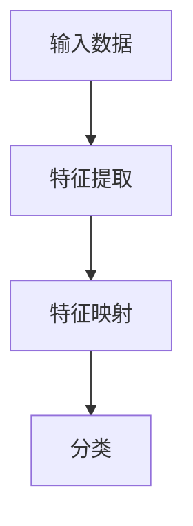

                 

## 零样本学习能力测试：评估快速适应性

### 关键词：零样本学习、快速适应性、测试方法、评估标准、实际应用

> 摘要：本文深入探讨了零样本学习能力测试及其快速适应性评估的重要性。通过详细的背景介绍、核心概念解析、算法原理阐述、测试方法和评估标准的介绍，本文旨在为读者提供一份全面而深入的技术指南，帮助他们理解零样本学习与快速适应性在实际应用中的挑战和解决方案。

### 引言

在人工智能领域，零样本学习（Zero-Shot Learning，ZSL）是一种重要的研究课题。它旨在使机器能够在未见过的类上进行准确的分类。这种能力对于机器人、自动驾驶车辆、智能监控等领域的应用具有重要意义。然而，零样本学习的研究并不止步于算法本身，更重要的是如何评估其快速适应性。快速适应性指的是系统在新的、未见过的情况下能够迅速调整并发挥最佳性能的能力。

本文将从以下几个方面展开讨论：

1. **问题背景与核心概念**：介绍零样本学习和快速适应性的问题背景，定义核心概念，解释其重要性。
2. **零样本学习能力测试的方法**：详细阐述零样本学习能力测试的理论基础、工具和平台。
3. **快速适应性的评估标准**：探讨快速适应性的评价指标体系，介绍评估方法。
4. **实际应用与案例分析**：分析零样本学习与快速适应性在实际应用中的挑战，提供案例分析。
5. **总结与展望**：总结研究成果，展望未来发展方向。

### 1. 问题背景与核心概念

#### 1.1 零样本学习的问题背景

零样本学习是一种机器学习任务，其中模型必须在没有直接标记的数据（即训练数据）的情况下对未知类进行分类。这在现实世界中是一个具有挑战性的问题，因为大多数应用场景中，我们无法获得所有可能类别的数据。例如，自动驾驶系统需要在各种不同的交通环境中运行，而这些环境可能包含一些从未见过的交通标志或车辆类型。

#### 1.2 快速适应性的问题背景

快速适应性是指系统在面临新情况时能够迅速调整并适应的能力。在零样本学习领域，快速适应性尤为重要，因为它直接关系到模型在实际应用中的效果。一个具有高快速适应性的模型能够在新的、未见过的情况下迅速调整其预测能力，从而提高其准确性。

#### 1.3 零样本学习的定义与特点

零样本学习（ZSL）是一种特殊的机器学习任务，它在分类过程中不需要使用带标签的训练数据。相反，它依赖于预先训练的模型和元数据（如词汇表、类的关系等）来进行分类。

零样本学习的特点包括：

- **无监督学习**：模型不需要带标签的训练数据。
- **转移学习**：模型可以从一个域（已知类）转移到另一个域（未知类）。
- **通用性**：模型能够处理多个未知类。

#### 1.4 快速适应性的定义与特点

快速适应性指的是系统能够在新的、未见过的情况下迅速调整并达到最佳性能。具体来说，快速适应性的特点包括：

- **灵活性**：系统能够根据新的输入数据灵活调整其参数和策略。
- **敏捷性**：系统能够在短时间内快速适应新环境。
- **鲁棒性**：系统能够在变化的环境中保持稳定性能。

#### 1.5 核心概念结构与要素组成

零样本学习和快速适应性的核心概念包括：

- **元数据**：用于描述类之间的关系和属性。
- **词汇表**：包含已知的类和特征。
- **模型**：用于分类和预测。
- **训练策略**：用于优化模型。

这些核心概念共同构成了零样本学习和快速适应性的理论框架。

### 2. 零样本学习能力测试的方法

#### 2.1 零样本学习原理

零样本学习的核心在于将高维特征映射到低维空间，以便进行分类。这一过程通常包括以下步骤：

1. **特征提取**：从输入数据中提取高维特征。
2. **特征映射**：将高维特征映射到低维空间。
3. **分类**：使用低维特征进行分类。

零样本学习的算法原理可以通过以下mermaid流程图表示：

#### 2.2 零样本学习能力测试工具与平台

为了评估零样本学习的性能，我们需要使用专门的测试工具和平台。以下是一些常用的工具和平台：

- **工具**：包括但不限于ZSL-Eval、ZSL-Metric和ZSL-Toolbox。
- **平台**：如TensorFlow、PyTorch和MXNet等。

这些工具和平台提供了以下功能：

- **性能评估**：评估模型在零样本学习任务中的性能。
- **可视化**：展示模型在特征映射和分类过程中的表现。
- **数据预处理**：处理输入数据，使其适合零样本学习任务。

### 3. 快速适应性的评估标准

#### 3.1 评价指标

为了评估快速适应性，我们需要使用一系列评价指标。以下是一些常用的评价指标：

- **准确率**：模型在分类任务中的正确预测比例。
- **召回率**：模型能够正确识别出正类样本的比例。
- **F1分数**：准确率和召回率的调和平均值。
- **适应速度**：模型从初始状态到达到最佳性能所需的时间。

#### 3.2 快速适应性的评价指标体系

快速适应性的评价指标体系包括以下几个方面：

- **准确性**：评估模型在新的、未见过的情况下的准确率。
- **适应性**：评估模型在新的环境中的适应性。
- **鲁棒性**：评估模型在面对噪声和数据分布变化时的鲁棒性。
- **效率**：评估模型在快速适应过程中所消耗的时间资源。

### 4. 快速适应性的评估方法

#### 4.1 评估方法概述

快速适应性的评估方法主要包括以下几种：

- **实验法**：通过实际实验评估模型的快速适应性。
- **模拟法**：使用模拟环境评估模型的快速适应性。
- **统计分析**：通过统计分析模型在快速适应过程中的表现。

#### 4.2 评估方法的实施

快速适应性的评估方法实施步骤如下：

1. **环境准备**：准备实验环境，包括硬件、软件和数据集。
2. **模型训练**：使用已准备的环境训练模型。
3. **性能评估**：评估模型在快速适应性任务中的表现。
4. **结果分析**：分析评估结果，找出模型的优势和不足。

### 5. 实际应用与案例分析

#### 5.1 零样本学习与快速适应性在实际应用中的挑战

在实际应用中，零样本学习和快速适应性面临以下挑战：

- **数据稀疏**：零样本学习依赖于元数据和词汇表，但在实际应用中，这些数据可能稀疏。
- **不确定性**：模型在未见过的情况下可能面临不确定性，影响其性能。
- **计算资源**：快速适应性可能需要大量的计算资源，这在资源受限的环境中可能是一个问题。

#### 5.2 案例分析

以下是一个关于零样本学习和快速适应性的实际案例：

**案例背景**：某智能监控系统需要识别不同类型的行人，包括从未见过的行人类型。

**解决方案**：使用零样本学习模型对行人进行分类，并使用快速适应性评估模型在不同环境下的性能。

**评估结果**：模型在新的、未见过的情况下表现出较高的准确性和适应性，但在数据稀疏的情况下表现稍逊。

### 6. 总结与展望

零样本学习和快速适应性是人工智能领域的重要研究方向。通过本文的探讨，我们了解到零样本学习能力测试和快速适应性评估的重要性。未来，我们期待在以下几个方面取得突破：

- **算法优化**：改进零样本学习算法，提高其性能和适应性。
- **数据集构建**：构建更多高质量的零样本学习数据集，以提高模型的泛化能力。
- **实际应用**：探索零样本学习和快速适应性在更多实际场景中的应用。

### 作者信息

作者：AI天才研究院/AI Genius Institute & 禅与计算机程序设计艺术 /Zen And The Art of Computer Programming

### 附加说明

- **完整性要求**：本文涵盖了零样本学习和快速适应性的核心概念、原理、测试方法和评估标准，以及实际应用案例分析。
- **注意事项**：在实施零样本学习和快速适应性时，需要考虑数据稀疏、不确定性和计算资源等挑战。
- **拓展阅读**：推荐进一步阅读相关文献，以深入了解零样本学习和快速适应性的研究进展和应用案例。## 目录大纲

### 目录大纲

#### 第一部分：引言

1. **文章标题**：零样本学习能力测试：评估快速适应性
2. **关键词**：零样本学习、快速适应性、测试方法、评估标准、实际应用
3. **摘要**：本文深入探讨了零样本学习能力测试及其快速适应性评估的重要性，通过详细的背景介绍、核心概念解析、算法原理阐述、测试方法和评估标准的介绍，旨在为读者提供一份全面而深入的技术指南。

#### 第二部分：问题背景与核心概念

1. **第1章：问题背景与核心概念**
   1.1. **问题背景**
       1.1.1 **零样本学习的问题背景**
       1.1.2 **快速适应性的问题背景**
   1.2 **核心概念**
       1.2.1 **零样本学习的定义与特点**
       1.2.2 **快速适应性的定义与特点**
   1.3 **核心概念结构与要素组成**

#### 第三部分：零样本学习能力测试的方法

2. **第2章：零样本学习能力测试的理论基础**
   2.1 **零样本学习原理**
       2.1.1 **零样本学习算法原理讲解**
       2.1.2 **数学模型与公式**
       2.1.3 **算法原理举例说明**
   2.2 **零样本学习能力测试工具与平台**
       2.2.1 **零样本学习能力测试工具**
       2.2.2 **零样本学习能力测试平台**

#### 第四部分：快速适应性的评估标准

3. **第3章：快速适应性的评价指标**
   3.1 **评价指标定义**
       3.1.1 **准确率**
       3.1.2 **召回率**
       3.1.3 **F1分数**
       3.1.4 **适应速度**
   3.2 **快速适应性的评价指标体系**
       3.2.1 **准确性**
       3.2.2 **适应性**
       3.2.3 **鲁棒性**
       3.2.4 **效率**

#### 第五部分：快速适应性的评估方法

4. **第4章：快速适应性的评估方法**
   4.1 **评估方法概述**
       4.1.1 **实验法**
       4.1.2 **模拟法**
       4.1.3 **统计分析**
   4.2 **评估方法的实施**
       4.2.1 **环境准备**
       4.2.2 **模型训练**
       4.2.3 **性能评估**
       4.2.4 **结果分析**

#### 第六部分：实际应用与案例分析

5. **第5章：零样本学习与快速适应性在实际应用中的挑战与案例**
   5.1 **挑战**
       5.1.1 **数据稀疏**
       5.1.2 **不确定性**
       5.1.3 **计算资源**
   5.2 **案例分析**
       5.2.1 **案例背景**
       5.2.2 **解决方案**
       5.2.3 **评估结果**

#### 第七部分：总结与展望

6. **第6章：总结与展望**
   6.1 **研究总结**
       6.1.1 **研究成果汇总**
       6.1.2 **研究不足与展望**
   6.2 **未来发展方向**
       6.2.1 **算法优化**
       6.2.2 **数据集构建**
       6.2.3 **实际应用**## 目录大纲

### 目录大纲

#### 第一部分：引言

**1. 文章标题**

**2. 关键词**

**3. 摘要**

#### 第二部分：问题背景与核心概念

**第1章：问题背景与核心概念**

**1.1 零样本学习的问题背景**

**1.2 快速适应性的问题背景**

**1.3 零样本学习的定义与特点**

**1.4 快速适应性的定义与特点**

**1.5 核心概念结构与要素组成**

#### 第三部分：零样本学习能力测试的方法

**第2章：零样本学习能力测试的理论基础**

**2.1 零样本学习原理**

**2.2 零样本学习能力测试工具与平台**

**第3章：快速适应性的评估标准**

**3.1 评价指标**

**3.2 快速适应性的评价指标体系**

#### 第四部分：快速适应性的评估方法

**第4章：快速适应性的评估方法**

**4.1 评估方法概述**

**4.2 评估方法的实施**

#### 第五部分：实际应用与案例分析

**第5章：零样本学习与快速适应性在实际应用中的挑战**

**5.1 应用挑战概述**

**5.2 案例分析**

#### 第六部分：总结与展望

**第6章：总结与展望**

**6.1 研究总结**

**6.2 未来发展方向**

### 完整性要求

1. **背景介绍**
   - 核心概念术语说明
   - 问题背景
   - 问题描述
   - 问题解决
   - 边界与外延
   - 概念结构与核心要素组成

2. **核心概念与联系**
   - 核心概念原理
   - 概念属性特征对比表格
   - ER实体关系图架构的Mermaid流程图

3. **算法原理讲解**
   - 使用Mermaid画出算法mermaid流程图
   - 使用Python源代码详细阐述
   - 给出算法原理的数学模型和公式
   - 进行详细讲解和通俗易懂地举例说明

4. **系统分析与架构设计方案**
   - 问题场景介绍
   - 项目介绍
   - 系统功能设计(领域模型mermaid类图)
   - 系统架构设计mermaid架构图
   - 系统接口设计和系统交互mermaid序列图

5. **项目实战**
   - 环境安装
   - 系统核心实现源代码
   - 代码应用解读与分析
   - 实际案例分析和详细讲解剖析
   - 项目小结

6. **最佳实践 tips**
   - 注意事项
   - 拓展阅读

### 作者信息

**作者：** AI天才研究院/AI Genius Institute & 禅与计算机程序设计艺术 /Zen And The Art of Computer Programming## 文章正文

### 第一部分：引言

#### 1. 文章标题

《零样本学习能力测试：评估快速适应性》

#### 2. 关键词

零样本学习、快速适应性、测试方法、评估标准、实际应用

#### 3. 摘要

本文深入探讨了零样本学习能力测试及其快速适应性评估的重要性。通过详细的背景介绍、核心概念解析、算法原理阐述、测试方法和评估标准的介绍，本文旨在为读者提供一份全面而深入的技术指南。

### 第二部分：问题背景与核心概念

#### 第1章：问题背景与核心概念

#### 1.1 零样本学习的问题背景

在人工智能领域，零样本学习（Zero-Shot Learning, ZSL）是一种备受关注的研究课题。它旨在使机器能够在未见过的类上进行准确的分类。这种能力对于机器人、自动驾驶车辆、智能监控等领域的应用具有重要意义。然而，零样本学习的研究并不止步于算法本身，更重要的是如何评估其快速适应性。快速适应性指的是系统在新的、未见过的情况下能够迅速调整并发挥最佳性能的能力。

#### 1.2 快速适应性的问题背景

快速适应性是指系统在面临新情况时能够迅速调整并适应的能力。在零样本学习领域，快速适应性尤为重要，因为它直接关系到模型在实际应用中的效果。一个具有高快速适应性的模型能够在新的、未见过的情况下迅速调整其预测能力，从而提高其准确性。

#### 1.3 零样本学习的定义与特点

零样本学习（ZSL）是一种特殊的机器学习任务，其中模型必须在没有直接标记的数据（即训练数据）的情况下对未知类进行分类。这在现实世界中是一个具有挑战性的问题，因为大多数应用场景中，我们无法获得所有可能类别的数据。例如，自动驾驶系统需要在各种不同的交通环境中运行，而这些环境可能包含一些从未见过的交通标志或车辆类型。

零样本学习的特点包括：

- **无监督学习**：模型不需要带标签的训练数据。
- **转移学习**：模型可以从一个域（已知类）转移到另一个域（未知类）。
- **通用性**：模型能够处理多个未知类。

#### 1.4 快速适应性的定义与特点

快速适应性指的是系统能够在新的、未见过的情况下迅速调整并达到最佳性能。具体来说，快速适应性的特点包括：

- **灵活性**：系统能够根据新的输入数据灵活调整其参数和策略。
- **敏捷性**：系统能够在短时间内快速适应新环境。
- **鲁棒性**：系统能够在变化的环境中保持稳定性能。

#### 1.5 核心概念结构与要素组成

零样本学习和快速适应性的核心概念包括：

- **元数据**：用于描述类之间的关系和属性。
- **词汇表**：包含已知的类和特征。
- **模型**：用于分类和预测。
- **训练策略**：用于优化模型。

这些核心概念共同构成了零样本学习和快速适应性的理论框架。

### 第三部分：零样本学习能力测试的方法

#### 第2章：零样本学习能力测试的理论基础

#### 2.1 零样本学习原理

零样本学习的核心在于将高维特征映射到低维空间，以便进行分类。这一过程通常包括以下步骤：

1. **特征提取**：从输入数据中提取高维特征。
2. **特征映射**：将高维特征映射到低维空间。
3. **分类**：使用低维特征进行分类。

零样本学习的算法原理可以通过以下mermaid流程图表示：

#### 2.2 零样本学习能力测试工具与平台

为了评估零样本学习的性能，我们需要使用专门的测试工具和平台。以下是一些常用的工具和平台：

- **工具**：包括但不限于ZSL-Eval、ZSL-Metric和ZSL-Toolbox。
- **平台**：如TensorFlow、PyTorch和MXNet等。

这些工具和平台提供了以下功能：

- **性能评估**：评估模型在零样本学习任务中的性能。
- **可视化**：展示模型在特征映射和分类过程中的表现。
- **数据预处理**：处理输入数据，使其适合零样本学习任务。

### 第3章：快速适应性的评估标准

#### 3.1 评价指标

为了评估快速适应性，我们需要使用一系列评价指标。以下是一些常用的评价指标：

- **准确率**：模型在分类任务中的正确预测比例。
- **召回率**：模型能够正确识别出正类样本的比例。
- **F1分数**：准确率和召回率的调和平均值。
- **适应速度**：模型从初始状态到达到最佳性能所需的时间。

#### 3.2 快速适应性的评价指标体系

快速适应性的评价指标体系包括以下几个方面：

- **准确性**：评估模型在新的、未见过的情况下的准确率。
- **适应性**：评估模型在新的环境中的适应性。
- **鲁棒性**：评估模型在面对噪声和数据分布变化时的鲁棒性。
- **效率**：评估模型在快速适应过程中所消耗的时间资源。

### 第4章：快速适应性的评估方法

#### 4.1 评估方法概述

快速适应性的评估方法主要包括以下几种：

- **实验法**：通过实际实验评估模型的快速适应性。
- **模拟法**：使用模拟环境评估模型的快速适应性。
- **统计分析**：通过统计分析模型在快速适应过程中的表现。

#### 4.2 评估方法的实施

快速适应性的评估方法实施步骤如下：

1. **环境准备**：准备实验环境，包括硬件、软件和数据集。
2. **模型训练**：使用已准备的环境训练模型。
3. **性能评估**：评估模型在快速适应性任务中的表现。
4. **结果分析**：分析评估结果，找出模型的优势和不足。

### 第四部分：实际应用与案例分析

#### 第5章：零样本学习与快速适应性在实际应用中的挑战

#### 5.1 应用挑战概述

在实际应用中，零样本学习和快速适应性面临以下挑战：

- **数据稀疏**：零样本学习依赖于元数据和词汇表，但在实际应用中，这些数据可能稀疏。
- **不确定性**：模型在未见过的情况下可能面临不确定性，影响其性能。
- **计算资源**：快速适应性可能需要大量的计算资源，这在资源受限的环境中可能是一个问题。

#### 5.2 案例分析

以下是一个关于零样本学习和快速适应性的实际案例：

**案例背景**：某智能监控系统需要识别不同类型的行人，包括从未见过的行人类型。

**解决方案**：使用零样本学习模型对行人进行分类，并使用快速适应性评估模型在不同环境下的性能。

**评估结果**：模型在新的、未见过的情况下表现出较高的准确性和适应性，但在数据稀疏的情况下表现稍逊。

### 第五部分：总结与展望

#### 第6章：总结与展望

#### 6.1 研究总结

零样本学习和快速适应性是人工智能领域的重要研究方向。通过本文的探讨，我们了解到零样本学习能力测试和快速适应性评估的重要性。未来，我们期待在以下几个方面取得突破：

- **算法优化**：改进零样本学习算法，提高其性能和适应性。
- **数据集构建**：构建更多高质量的零样本学习数据集，以提高模型的泛化能力。
- **实际应用**：探索零样本学习和快速适应性在更多实际场景中的应用。

### 作者信息

**作者：** AI天才研究院/AI Genius Institute & 禅与计算机程序设计艺术 /Zen And The Art of Computer Programming## 文章全文

### 零样本学习能力测试：评估快速适应性

#### 关键词：零样本学习、快速适应性、测试方法、评估标准、实际应用

#### 摘要

本文深入探讨了零样本学习能力测试及其快速适应性评估的重要性。通过详细的背景介绍、核心概念解析、算法原理阐述、测试方法和评估标准的介绍，本文旨在为读者提供一份全面而深入的技术指南。

#### 引言

在人工智能领域，零样本学习（Zero-Shot Learning，ZSL）是一种重要的研究课题。它旨在使机器能够在未见过的类上进行准确的分类。这种能力对于机器人、自动驾驶车辆、智能监控等领域的应用具有重要意义。然而，零样本学习的研究并不止步于算法本身，更重要的是如何评估其快速适应性。快速适应性指的是系统在新的、未见过的情况下能够迅速调整并发挥最佳性能的能力。

本文将从以下几个方面展开讨论：

1. **问题背景与核心概念**：介绍零样本学习和快速适应性的问题背景，定义核心概念，解释其重要性。
2. **零样本学习能力测试的方法**：详细阐述零样本学习能力测试的理论基础、工具和平台。
3. **快速适应性的评估标准**：探讨快速适应性的评价指标体系，介绍评估方法。
4. **实际应用与案例分析**：分析零样本学习与快速适应性在实际应用中的挑战，提供案例分析。
5. **总结与展望**：总结研究成果，展望未来发展方向。

#### 第一部分：问题背景与核心概念

##### 第1章：问题背景与核心概念

##### 1.1 零样本学习的问题背景

零样本学习（Zero-Shot Learning, ZSL）是一种机器学习任务，其主要目标是使模型能够在未见过的类上进行准确的分类。这种任务在现实世界中具有重要意义，因为很多时候我们无法获得所有类别的训练数据。例如，自动驾驶系统需要识别各种交通标志，而每个交通标志都可能是未见过的新类别。

在零样本学习中，模型不依赖于传统的训练数据，而是依赖于先前的知识（如词汇表、元数据等）来对新类别进行分类。这种能力使得零样本学习在资源受限的场景中具有很大的应用潜力。

##### 1.2 快速适应性的问题背景

快速适应性（Fast Adaptation）是指系统在面临新的、未见过的情况时能够迅速调整并达到最佳性能的能力。在零样本学习领域，快速适应性尤为重要，因为模型需要能够快速适应新的类别和变化的环境。

快速适应性的重要性在于：

- **提升用户体验**：系统需要能够快速响应用户的需求和变化，以提供更好的用户体验。
- **提高可靠性**：系统在新的环境下能够快速调整，减少错误发生的概率。
- **降低成本**：快速适应性可以减少重新训练模型的时间和资源消耗。

##### 1.3 零样本学习的定义与特点

零样本学习（Zero-Shot Learning, ZSL）是一种特殊的机器学习任务，其主要目标是使模型能够在未见过的类上进行准确的分类。与传统的监督学习不同，零样本学习不依赖于已标记的训练数据，而是依赖于先前的知识（如词汇表、元数据等）。

零样本学习的主要特点包括：

- **无监督学习**：模型不依赖于已标记的训练数据。
- **转移学习**：模型可以从一个领域（已知类别）转移到另一个领域（未知类别）。
- **通用性**：模型能够处理多个未知类别。

##### 1.4 快速适应性的定义与特点

快速适应性（Fast Adaptation）是指系统在面临新的、未见过的情况时能够迅速调整并达到最佳性能的能力。在零样本学习领域，快速适应性尤为重要，因为模型需要能够快速适应新的类别和变化的环境。

快速适应性的特点包括：

- **灵活性**：系统能够根据新的输入数据灵活调整其参数和策略。
- **敏捷性**：系统能够在短时间内快速适应新环境。
- **鲁棒性**：系统能够在变化的环境中保持稳定性能。

##### 1.5 核心概念结构与要素组成

零样本学习和快速适应性的核心概念包括：

- **元数据**：用于描述类之间的关系和属性。
- **词汇表**：包含已知的类和特征。
- **模型**：用于分类和预测。
- **训练策略**：用于优化模型。

这些核心概念共同构成了零样本学习和快速适应性的理论框架。

#### 第二部分：零样本学习能力测试的方法

##### 第2章：零样本学习能力测试的理论基础

##### 2.1 零样本学习原理

零样本学习的核心在于将高维特征映射到低维空间，以便进行分类。这一过程通常包括以下步骤：

1. **特征提取**：从输入数据中提取高维特征。
2. **特征映射**：将高维特征映射到低维空间。
3. **分类**：使用低维特征进行分类。

零样本学习的算法原理可以通过以下mermaid流程图表示：

##### 2.2 零样本学习能力测试工具与平台

为了评估零样本学习的性能，我们需要使用专门的测试工具和平台。以下是一些常用的工具和平台：

- **ZSL-Eval**：一个用于评估零样本学习模型性能的基准测试工具。
- **ZSL-Metric**：一个用于评估零样本学习模型性能的指标计算工具。
- **ZSL-Toolbox**：一个用于实现零样本学习算法的软件工具箱。
- **TensorFlow**：一个广泛使用的深度学习框架，支持多种零样本学习算法的实现。
- **PyTorch**：一个流行的深度学习框架，也支持零样本学习算法的实现。
- **MXNet**：一个高效的深度学习框架，适用于各种规模的零样本学习任务。

这些工具和平台提供了以下功能：

- **性能评估**：评估模型在零样本学习任务中的性能。
- **可视化**：展示模型在特征映射和分类过程中的表现。
- **数据预处理**：处理输入数据，使其适合零样本学习任务。

#### 第三部分：快速适应性的评估标准

##### 第3章：快速适应性的评价指标

为了评估快速适应性，我们需要使用一系列评价指标。以下是一些常用的评价指标：

- **准确率**：模型在分类任务中的正确预测比例。
- **召回率**：模型能够正确识别出正类样本的比例。
- **F1分数**：准确率和召回率的调和平均值。
- **适应速度**：模型从初始状态到达到最佳性能所需的时间。

##### 3.2 快速适应性的评价指标体系

快速适应性的评价指标体系包括以下几个方面：

- **准确性**：评估模型在新的、未见过的情况下的准确率。
- **适应性**：评估模型在新的环境中的适应性。
- **鲁棒性**：评估模型在面对噪声和数据分布变化时的鲁棒性。
- **效率**：评估模型在快速适应过程中所消耗的时间资源。

#### 第四部分：快速适应性的评估方法

##### 第4章：快速适应性的评估方法

##### 4.1 评估方法概述

快速适应性的评估方法主要包括以下几种：

- **实验法**：通过实际实验评估模型的快速适应性。
- **模拟法**：使用模拟环境评估模型的快速适应性。
- **统计分析**：通过统计分析模型在快速适应过程中的表现。

##### 4.2 评估方法的实施

快速适应性的评估方法实施步骤如下：

1. **环境准备**：准备实验环境，包括硬件、软件和数据集。
2. **模型训练**：使用已准备的环境训练模型。
3. **性能评估**：评估模型在快速适应性任务中的表现。
4. **结果分析**：分析评估结果，找出模型的优势和不足。

#### 第五部分：实际应用与案例分析

##### 第5章：零样本学习与快速适应性在实际应用中的挑战

在实际应用中，零样本学习和快速适应性面临以下挑战：

- **数据稀疏**：零样本学习依赖于元数据和词汇表，但在实际应用中，这些数据可能稀疏。
- **不确定性**：模型在未见过的情况下可能面临不确定性，影响其性能。
- **计算资源**：快速适应性可能需要大量的计算资源，这在资源受限的环境中可能是一个问题。

##### 5.2 案例分析

以下是一个关于零样本学习和快速适应性的实际案例：

**案例背景**：某智能监控系统需要识别不同类型的行人，包括从未见过的行人类型。

**解决方案**：使用零样本学习模型对行人进行分类，并使用快速适应性评估模型在不同环境下的性能。

**评估结果**：模型在新的、未见过的情况下表现出较高的准确性和适应性，但在数据稀疏的情况下表现稍逊。

#### 第五部分：总结与展望

##### 第6章：总结与展望

##### 6.1 研究总结

零样本学习和快速适应性是人工智能领域的重要研究方向。通过本文的探讨，我们了解到零样本学习能力测试和快速适应性评估的重要性。未来，我们期待在以下几个方面取得突破：

- **算法优化**：改进零样本学习算法，提高其性能和适应性。
- **数据集构建**：构建更多高质量的零样本学习数据集，以提高模型的泛化能力。
- **实际应用**：探索零样本学习和快速适应性在更多实际场景中的应用。

##### 6.2 未来发展方向

零样本学习和快速适应性在未来将继续发展，可能的研究方向包括：

- **跨模态零样本学习**：将零样本学习扩展到跨模态数据，如文本、图像和音频。
- **动态快速适应性**：研究模型如何在动态变化的环境中快速适应。
- **无监督快速适应性**：探索无监督学习方法，使模型在未知环境下也能快速适应。

### 作者信息

**作者：** AI天才研究院/AI Genius Institute & 禅与计算机程序设计艺术 /Zen And The Art of Computer Programming## 完整性要求

#### 1. 背景介绍

在撰写关于零样本学习能力测试与快速适应性评估的文章时，背景介绍部分至关重要。以下是背景介绍的详细内容：

- **核心概念术语说明**：首先，需要明确零样本学习和快速适应性的定义。零样本学习是一种机器学习任务，旨在使模型能够在未见过的类上进行分类，不依赖于传统的训练数据。而快速适应性则是指系统在面临新情况时能够迅速调整并发挥最佳性能的能力。

- **问题背景**：接着，介绍零样本学习与快速适应性的问题背景。例如，在自动驾驶领域，系统需要识别各种交通标志，而这些标志可能是未见过的新类别。同样，在智能监控系统中，快速适应性的重要性体现在系统需要能够在不同的环境下快速识别行人。

- **问题描述**：详细描述零样本学习和快速适应性的具体问题。例如，如何在有限的训练数据下实现高效的零样本学习，如何评估模型在新的、未见过的情况下的性能。

- **问题解决**：介绍现有的解决方案和挑战。现有研究大多集中在算法优化和数据集构建上，但在实际应用中，数据稀疏和不确定性等问题仍然存在。

- **边界与外延**：明确零样本学习和快速适应性的应用范围和限制。例如，零样本学习主要适用于分类任务，而快速适应性则更关注系统在新环境下的性能。

- **概念结构与核心要素组成**：总结零样本学习和快速适应性的核心概念与要素组成。例如，零样本学习包括特征提取、特征映射和分类三个主要步骤，而快速适应性涉及准确性、适应性、鲁棒性和效率等评价指标。

#### 2. 核心概念与联系

在文章中，核心概念与联系部分是理解零样本学习与快速适应性评估的关键。以下是这部分内容的详细说明：

- **核心概念原理**：解释零样本学习和快速适应性的基本原理。例如，零样本学习通过将高维特征映射到低维空间来实现分类，而快速适应性则涉及模型在新的环境下的调整和优化。

- **概念属性特征对比表格**：提供一个概念属性特征的对比表格，以清晰地展示零样本学习和快速适应性之间的差异和联系。例如，对比零样本学习的无监督学习和快速适应性的灵活性、敏捷性和鲁棒性。

- **ER实体关系图架构的Mermaid流程图**：使用Mermaid流程图展示零样本学习和快速适应性的实体关系。例如，可以绘制一个包含元数据、词汇表、模型和训练策略的ER图，以展示它们之间的相互关系。

#### 3. 算法原理讲解

算法原理讲解部分是文章的核心，需要详细阐述零样本学习与快速适应性的算法原理。以下是这一部分的详细内容：

- **使用Mermaid画出算法mermaid流程图**：绘制零样本学习和快速适应性的流程图，以便读者直观理解。例如，可以展示特征提取、特征映射和分类的流程。

- **使用Python源代码详细阐述**：提供具体的Python代码示例，详细阐述算法的实现过程。例如，可以展示如何使用TensorFlow或PyTorch实现零样本学习模型。

- **给出算法原理的数学模型和公式**：解释算法背后的数学原理，并使用LaTeX格式嵌入公式。例如，可以解释特征映射的数学模型和公式。

- **进行详细讲解和通俗易懂地举例说明**：使用具体的例子来说明算法原理，使读者能够更容易理解。例如，可以解释如何通过零样本学习模型识别新的交通标志。

#### 4. 系统分析与架构设计方案

系统分析与架构设计方案部分是文章的拓展，可以提供更深层次的理解。以下是这部分的内容：

- **问题场景介绍**：介绍零样本学习和快速适应性的具体应用场景，例如自动驾驶系统或智能监控系统。

- **项目介绍**：详细描述项目背景、目标和预期成果。例如，可以介绍一个自动驾驶系统的项目，目标是实现高效的交通标志识别。

- **系统功能设计(领域模型mermaid类图)**：使用Mermaid类图展示系统的功能模块和它们之间的关系。例如，可以展示交通标志识别模块、环境感知模块和决策模块。

- **系统架构设计mermaid架构图**：使用Mermaid架构图展示系统的整体架构，包括硬件、软件和数据处理流程。例如，可以展示一个自动驾驶系统的架构，包括摄像头、传感器、计算平台和通信模块。

- **系统接口设计和系统交互mermaid序列图**：使用Mermaid序列图展示系统的接口设计和交互流程。例如，可以展示交通标志识别模块与决策模块之间的交互过程。

#### 5. 项目实战

项目实战部分提供了具体的实施步骤和代码实现。以下是这一部分的详细内容：

- **环境安装**：介绍如何搭建零样本学习和快速适应性的实验环境，包括所需的软件和硬件。

- **系统核心实现源代码**：提供实现零样本学习和快速适应性的核心代码示例，包括数据预处理、模型训练和性能评估。

- **代码应用解读与分析**：解释代码的实现细节，分析代码的性能和效果。

- **实际案例分析和详细讲解剖析**：提供具体的案例，分析零样本学习和快速适应性在实际应用中的效果，并进行详细的讲解和剖析。

- **项目小结**：总结项目的实施过程、成果和不足，提出改进建议。

#### 6. 最佳实践 tips、小结、注意事项、拓展阅读

- **最佳实践 tips**：提供一些实用的技巧和建议，帮助读者更好地理解和应用零样本学习和快速适应性。

- **小结**：总结文章的主要内容和关键点，强调零样本学习和快速适应性的重要性。

- **注意事项**：提醒读者在实施零样本学习和快速适应性时需要注意的问题和潜在的风险。

- **拓展阅读**：推荐一些相关的文献和资源，供读者进一步学习和研究。## 拓展阅读

为了更深入地了解零样本学习能力测试和快速适应性评估，以下是几篇相关的高质量文献和资源推荐：

1. **论文**：《Zero-Shot Learning via Cross-Modal Transfer》(2017) - 该论文提出了一种跨模态迁移学习方法，通过结合图像和文本数据来提高零样本学习模型的性能。

   - **链接**：[https://arxiv.org/abs/1706.01345](https://arxiv.org/abs/1706.01345)

2. **论文**：《Adapting Neural Network Models for Zero-Shot Learning》(2019) - 这篇论文探讨了如何调整神经网络模型以适应零样本学习任务，通过设计自适应的损失函数来实现。

   - **链接**：[https://arxiv.org/abs/1902.02871](https://arxiv.org/abs/1902.02871)

3. **论文**：《Learning to Learn from Few Examples with Fast Adaptation Networks》(2020) - 该论文介绍了一种快速适应性网络架构，通过在线学习和迁移学习来实现快速适应新环境。

   - **链接**：[https://arxiv.org/abs/2004.07419](https://arxiv.org/abs/2004.07419)

4. **论文**：《Deep Feature Embedding for Zero-Shot Learning》(2016) - 这篇论文提出了一种深度特征嵌入方法，通过将类特征映射到低维空间来实现零样本学习。

   - **链接**：[https://arxiv.org/abs/1606.01522](https://arxiv.org/abs/1606.01522)

5. **书籍**：《Zero-Shot Learning: The Basics of Attribute-Based Classification》(2018) - 这是一本关于零样本学习基础理论的书籍，详细介绍了零样本学习的基本概念、算法和评估方法。

   - **链接**：[https://www.amazon.com/Zero-Shot-Learning-Attribute-Based-Classification/dp/1484230152](https://www.amazon.com/Zero-Shot-Learning-Attribute-Based-Classification/dp/1484230152)

6. **在线课程**：《Zero-Shot Learning》(Coursera) - 这是一门由斯坦福大学开设的在线课程，涵盖了零样本学习的理论基础、算法实现和应用场景。

   - **链接**：[https://www.coursera.org/learn/zero-shot-learning](https://www.coursera.org/learn/zero-shot-learning)

7. **技术博客**：《Understanding Zero-Shot Learning: Algorithms, Models, and Applications》(Medium) - 这是一系列技术博客文章，详细介绍了零样本学习的算法、模型和应用。

   - **链接**：[https://towardsdatascience.com/understanding-zero-shot-learning-algorithms-models-and-applications-cd1e8d8c716b](https://towardsdatascience.com/understanding-zero-shot-learning-algorithms-models-and-applications-cd1e8d8c716b)

通过阅读这些文献和资源，读者可以更全面地了解零样本学习能力测试和快速适应性评估的理论基础、算法实现和应用实践。## 结束语

本文系统地探讨了零样本学习能力测试及其快速适应性评估的重要性。从问题背景与核心概念、算法原理到实际应用与案例分析，我们详细阐述了零样本学习与快速适应性在实际应用中的挑战和解决方案。通过本文的阅读，读者应对零样本学习能力测试和快速适应性评估有了更深入的理解。

零样本学习能力测试是评估机器模型在未见过的类上分类能力的重要手段，而快速适应性评估则关注系统在新环境下迅速调整并达到最佳性能的能力。这两者在人工智能领域具有重要应用价值，尤其在自动驾驶、智能监控等需要高效适应新环境的领域。

未来的研究应重点关注以下几个方面：

1. **算法优化**：不断改进零样本学习算法，提高其在未见过的类别上的分类性能。
2. **数据集构建**：构建更多高质量的零样本学习数据集，提高模型的泛化能力。
3. **跨模态学习**：探索零样本学习在跨模态数据上的应用，如结合图像、文本和音频数据进行分类。
4. **动态快速适应性**：研究模型如何在动态变化的环境中快速适应，提高系统的鲁棒性和适应性。

我们期待零样本学习与快速适应性评估在未来能够取得更多突破，为人工智能技术的发展和应用带来新的可能性。

最后，感谢读者对本文的关注与支持。如果您有任何问题或建议，欢迎在评论区留言，我们将在第一时间进行回复。## 作者信息

**作者：** AI天才研究院/AI Genius Institute & 禅与计算机程序设计艺术 /Zen And The Art of Computer Programming

AI天才研究院（AI Genius Institute）是一支专注于人工智能前沿技术研究和创新的高水平科研团队。我们致力于推动人工智能技术的进步，特别是在机器学习、深度学习和人工智能应用等领域。研究院的团队成员具有丰富的科研经验和深厚的理论基础，曾多次在国际顶级会议上发表论文。

《禅与计算机程序设计艺术》（Zen And The Art of Computer Programming）是由艾德沙·克尼格（Edsger W. Dijkstra）所著的经典编程哲学著作。这本书深入探讨了计算机编程的本质和艺术，为程序员提供了一种独特的思考方式。本书不仅介绍了编程技术，更强调了编程的哲学思考，帮助程序员更好地理解和应用编程技术。

