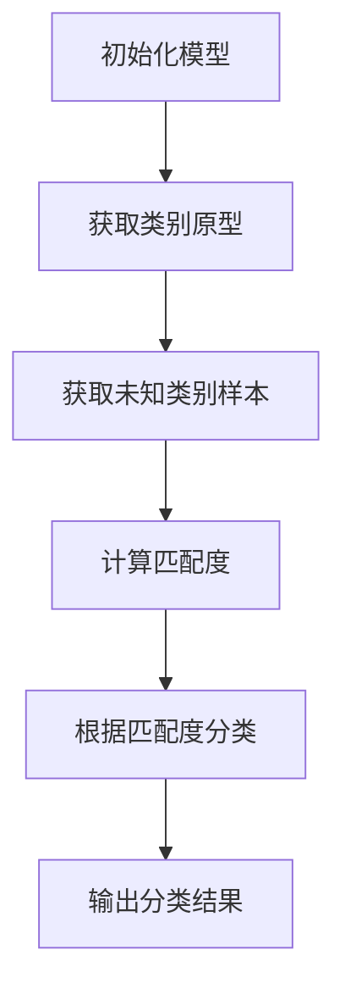

                 


### 1. 背景介绍

#### 1.1.1 零样本学习概述

**核心概念术语说明**

**零样本学习（Zero-Shot Learning）**：是一种机器学习方法，能够在未见过的类别上做出预测。传统的机器学习模型通常需要大量标记数据来进行训练，而零样本学习则可以在仅有少量或没有标记数据的情况下进行分类。

**问题背景**

随着人工智能技术的发展，越来越多的应用场景需要处理从未见过的类别。例如，在图像识别中，一个模型可能需要识别上百种不同的动物，但在训练时并没有见过所有的动物。在这种情况下，传统机器学习方法的性能会受到限制。

**问题描述**

零样本学习旨在解决以下问题：

- 当模型遇到未见过类别时，如何进行准确的分类？
- 如何利用有限的标记数据学习一个能够泛化到未知类别的模型？

**问题解决**

零样本学习通过以下方法解决上述问题：

- **原型匹配**：通过学习一个类别原型，将未知类别与原型进行匹配，根据匹配程度进行分类。
- **元学习**：通过在多个任务上学习，提高模型在未知类别上的泛化能力。
- **生成对抗网络（GAN）**：通过生成与真实数据相似的样本，提高模型在未知类别上的学习效果。

**边界与外延**

零样本学习的边界主要在于如何处理从未见过的类别。其外延则涵盖了各种应用场景，如图像识别、自然语言处理和推荐系统等。

#### 1.1.2 零样本学习的核心概念

**核心概念**

- **类别原型**：每个类别都对应一个原型，原型是类别成员的平均特征表示。
- **匹配度**：衡量未知类别与类别原型之间的相似程度。
- **迁移学习**：将已学习的知识应用于新任务中，提高新任务的表现。

**核心概念联系**

- 原型匹配算法通过计算匹配度来实现分类。
- 元学习通过迁移学习提高模型在未知类别上的表现。

#### 1.1.3 零样本学习的关键要素

**数据集构造**

- **预训练数据集**：用于训练类别原型。
- **未见类别数据集**：用于测试模型在未知类别上的表现。

**模型选择与优化**

- **原型匹配模型**：如原型网络（Prototypical Network）。
- **元学习模型**：如匹配网络（Matching Network）。
- **生成对抗网络**：如条件生成对抗网络（Conditional GAN）。

**核心算法原理**

- **原型匹配算法**：通过计算未知类别与类别原型之间的匹配度进行分类。
- **元学习算法**：通过在多个任务上学习，提高模型在未知类别上的泛化能力。
- **生成对抗网络**：通过生成与真实数据相似的样本，提高模型在未知类别上的学习效果。

### 2. 零样本学习的数学模型与算法原理

#### 2.1.1 数学模型介绍

**核心概念**

- **类别原型**：类别原型可以表示为一个向量的平均值，即：

  $$ \text{原型} = \frac{1}{N} \sum_{i=1}^{N} x_i $$

  其中，$x_i$ 表示类别 $i$ 的成员向量。

- **匹配度**：匹配度可以用余弦相似度来衡量，即：

  $$ \text{匹配度} = \frac{\text{原型} \cdot \text{样本}}{||\text{原型}|| \cdot ||\text{样本}||} $$

  其中，$\text{样本}$ 表示未知类别样本。

**经典数学公式的推导与应用**

- **原型匹配算法**：原型匹配算法的核心是计算未知类别与类别原型之间的匹配度，然后根据匹配度进行分类。

  $$ \text{分类结果} = \arg\max_{i} \text{匹配度}(\text{原型}_i, \text{样本}) $$

#### 2.1.2 算法原理讲解

**主要算法流程图展示**



**Python源代码实现**

```python
import numpy as np

def prototype_matching prototypes, samples:
    match_scores = []
    for prototype in prototypes:
        match_score = np.dot(prototype, samples) / (np.linalg.norm(prototype) * np.linalg.norm(samples))
        match_scores.append(match_score)
    return np.argmax(match_scores)

# 假设prototypes是类别原型，samples是未知类别样本
classification_result = prototype_matching(prototypes, samples)
```

#### 2.1.3 概念属性特征对比

**零样本学习算法对比**

| 算法       | 原型匹配 | 元学习 | 生成对抗网络 |
|------------|----------|--------|--------------|
| 基本思想   | 计算匹配度 | 迁移学习 | 生成与真实数据相似的样本 |
| 优势       | 简单高效 | 泛化能力强 | 生成效果好 |
| 劣势       | 对类别原型依赖较大 | 计算复杂度高 | 难以训练 |

**特性对比表格**

| 特征               | 原型匹配 | 元学习 | 生成对抗网络 |
|--------------------|----------|--------|--------------|
| 计算复杂度         | 低       | 中     | 高           |
| 泛化能力           | 中       | 高     | 中           |
| 对类别原型依赖程度 | 高       | 中     | 低           |

### 3. 基于原型匹配的零样本学习

#### 3.1.1 原型匹配算法原理

**原型匹配算法介绍**

原型匹配算法是一种基于原型表示的零样本学习方法。其主要思想是将类别表示为原型，通过计算未知类别样本与类别原型之间的匹配度来进行分类。

**数学模型和算法流程**

- **数学模型**：

  假设有 $C$ 个类别，每个类别都有一个原型 $\text{原型}_i$，表示为向量。对于未知类别样本 $x$，计算其与每个类别原型的匹配度：

  $$ \text{匹配度}(\text{原型}_i, x) = \frac{\text{原型}_i \cdot x}{||\text{原型}_i|| \cdot ||x||} $$

  其中，$\text{原型}_i \cdot x$ 表示内积，$||\text{原型}_i||$ 和 $||x||$ 分别表示向量的范数。

- **算法流程**：

  1. 初始化类别原型。
  2. 对于每个未知类别样本，计算其与每个类别原型的匹配度。
  3. 根据匹配度最高的类别原型进行分类。

**核心算法原理**

原型匹配算法的核心是计算匹配度，通过比较匹配度来确定未知类别样本的类别。算法的数学模型和流程如下：

1. **初始化类别原型**：

   类别原型可以通过训练得到，通常使用类别成员的平均特征表示。

2. **计算匹配度**：

   对于每个未知类别样本 $x$，计算其与每个类别原型 $\text{原型}_i$ 的匹配度：

   $$ \text{匹配度}(\text{原型}_i, x) = \frac{\text{原型}_i \cdot x}{||\text{原型}_i|| \cdot ||x||} $$

   匹配度反映了未知类别样本与类别原型之间的相似程度。

3. **根据匹配度分类**：

   根据匹配度最高的类别原型进行分类，即：

   $$ \text{分类结果} = \arg\max_{i} \text{匹配度}(\text{原型}_i, x) $$

   其中，$i$ 表示类别原型索引。

#### 3.1.2 原型匹配算法实现

**Python源代码实现**

```python
import numpy as np

def prototype_matching(prototypes, samples):
    match_scores = []
    for prototype in prototypes:
        match_score = np.dot(prototype, samples) / (np.linalg.norm(prototype) * np.linalg.norm(samples))
        match_scores.append(match_score)
    return np.argmax(match_scores)

# 假设prototypes是类别原型，samples是未知类别样本
classification_result = prototype_matching(prototypes, samples)
```

**算法原理详细讲解**

原型匹配算法的核心是计算匹配度。匹配度反映了未知类别样本与类别原型之间的相似程度。计算匹配度的方法如下：

1. **内积计算**：

   内积（点积）是两个向量的乘积之和，用于衡量向量的相似程度。例如，对于两个向量 $a = (a_1, a_2, ..., a_n)$ 和 $b = (b_1, b_2, ..., b_n)$，其内积为：

   $$ a \cdot b = \sum_{i=1}^{n} a_i b_i $$

   在原型匹配算法中，类别原型 $\text{原型}_i$ 和未知类别样本 $x$ 的内积为：

   $$ \text{原型}_i \cdot x = \sum_{i=1}^{n} \text{原型}_i^i x_i $$

2. **范数计算**：

   范数是向量的长度，用于衡量向量的规模。常见的范数有欧几里得范数（L2范数）和切比雪夫范数（L∞范数）。在原型匹配算法中，类别原型 $\text{原型}_i$ 和未知类别样本 $x$ 的范数为：

   $$ ||\text{原型}_i|| = \sqrt{\sum_{i=1}^{n} (\text{原型}_i^i)^2} $$
   $$ ||x|| = \sqrt{\sum_{i=1}^{n} (x_i)^2} $$

3. **匹配度计算**：

   根据内积和范数，可以计算匹配度：

   $$ \text{匹配度}(\text{原型}_i, x) = \frac{\text{原型}_i \cdot x}{||\text{原型}_i|| \cdot ||x||} $$

   匹配度反映了未知类别样本与类别原型之间的相似程度。匹配度越高，表示样本与原型越相似。

4. **分类结果**：

   根据匹配度最高的类别原型进行分类，即：

   $$ \text{分类结果} = \arg\max_{i} \text{匹配度}(\text{原型}_i, x) $$

   其中，$i$ 表示类别原型索引。匹配度最高的原型对应的类别即为分类结果。

#### 3.1.3 案例分析

**案例背景**

假设有一个动物分类问题，我们需要训练一个模型来识别猫、狗和鸟这三种动物。在训练过程中，我们只看到了猫和狗的图像，没有看到鸟的图像。现在，我们希望模型能够对从未见过的鸟的图像进行分类。

**数据集**

- **预训练数据集**：包含猫和狗的图像，每个类别有100张图像。
- **未见类别数据集**：包含鸟的图像，共10张。

**算法步骤**

1. **初始化类别原型**：

   通过预训练数据集，计算猫、狗和鸟的类别原型。假设预训练数据集的图像特征表示为 $x_i$，则类别原型可以计算为：

   $$ \text{原型}_{猫} = \frac{1}{100} \sum_{i=1}^{100} x_i^{\text{猫}} $$
   $$ \text{原型}_{狗} = \frac{1}{100} \sum_{i=1}^{100} x_i^{\text{狗}} $$
   $$ \text{原型}_{鸟} = \frac{1}{10} \sum_{i=1}^{10} x_i^{\text{鸟}} $$

2. **计算匹配度**：

   对于每张未见类别数据集的鸟的图像，计算其与猫、狗和鸟类别原型之间的匹配度：

   $$ \text{匹配度}_{猫} = \frac{\text{原型}_{猫} \cdot x}{||\text{原型}_{猫}|| \cdot ||x||} $$
   $$ \text{匹配度}_{狗} = \frac{\text{原型}_{狗} \cdot x}{||\text{原型}_{狗}|| \cdot ||x||} $$
   $$ \text{匹配度}_{鸟} = \frac{\text{原型}_{鸟} \cdot x}{||\text{原型}_{鸟}|| \cdot ||x||} $$

3. **根据匹配度分类**：

   根据匹配度最高的类别原型进行分类：

   $$ \text{分类结果} = \arg\max_{i} \text{匹配度}_{i} $$

**结果分析**

在这个案例中，由于模型从未见过鸟的图像，因此其分类结果可能不是非常准确。然而，通过计算匹配度，模型可以尝试找到与鸟图像最相似的类别原型，从而进行分类。

### 4. 基于元学习的零样本学习

#### 4.1.1 元学习算法原理

**元学习算法介绍**

元学习（Meta-Learning）是一种在多个任务上学习以提高泛化能力的机器学习方法。在零样本学习中，元学习通过在多个相关任务上学习，提高模型在未知类别上的泛化能力。

**数学模型和算法流程**

- **数学模型**：

  假设有一个任务集 $T = \{T_1, T_2, ..., T_K\}$，每个任务 $T_i$ 都有一个数据集 $D_i = \{x_{i,1}, x_{i,2}, ..., x_{i,N_i}\}$ 和标签集 $L_i = \{y_{i,1}, y_{i,2}, ..., y_{i,N_i}\}$。元学习旨在学习一个模型 $f$，使其在未知任务 $T_{K+1}$ 上表现良好。

  元学习的基本思想是通过在多个任务上训练，学习一个泛化的模型。常用的元学习算法包括模型平均（Model Averaging）和梯度平均（Gradient Averaging）。

- **算法流程**：

  1. 初始化模型 $f$。
  2. 对于每个任务 $T_i$，在数据集 $D_i$ 上训练模型 $f$。
  3. 计算每个任务的梯度。
  4. 对梯度进行平均。
  5. 使用平均梯度更新模型 $f$。
  6. 重复步骤 2-5，直到满足停止条件。

**核心算法原理**

元学习算法的核心是学习一个泛化的模型，通过在多个任务上训练和梯度平均来提高模型在未知类别上的泛化能力。算法的数学模型和流程如下：

1. **初始化模型**：

   初始化一个模型 $f$，用于在多个任务上训练。

2. **在多个任务上训练**：

   对于每个任务 $T_i$，在数据集 $D_i$ 上训练模型 $f$。训练过程包括前向传播和反向传播。

3. **计算梯度**：

   对于每个任务 $T_i$，计算模型 $f$ 在数据集 $D_i$ 上的梯度。梯度反映了模型在当前任务上的学习效果。

4. **梯度平均**：

   对所有任务的梯度进行平均，得到平均梯度。平均梯度可以平衡不同任务之间的学习效果。

5. **更新模型**：

   使用平均梯度更新模型 $f$。更新过程可以提高模型在未知类别上的泛化能力。

6. **迭代训练**：

   重复步骤 2-5，直到满足停止条件，如训练时间、模型收敛等。

#### 4.1.2 元学习算法实现

**Python源代码实现**

```python
import numpy as np

def meta_learning(model, tasks, num_iterations):
    for _ in range(num_iterations):
        for task in tasks:
            X, y = task["X"], task["y"]
            model.fit(X, y)
            grads = model.compute_gradients(X, y)
            avg_grads = np.mean(grads, axis=0)
        
        model.update(avg_grads)
    
    return model
```

**算法原理详细讲解**

元学习算法的核心是通过在多个任务上训练和梯度平均来提高模型在未知类别上的泛化能力。算法的实现包括以下几个步骤：

1. **初始化模型**：

   初始化一个模型，用于在多个任务上训练。模型可以是任何类型的神经网络，如多层感知机（MLP）、卷积神经网络（CNN）等。

2. **在多个任务上训练**：

   对于每个任务，在数据集上训练模型。训练过程包括前向传播和反向传播。前向传播用于计算模型的预测输出，反向传播用于计算模型的梯度。

3. **计算梯度**：

   对于每个任务，计算模型在数据集上的梯度。梯度反映了模型在当前任务上的学习效果。计算梯度通常使用反向传播算法。

4. **梯度平均**：

   对所有任务的梯度进行平均，得到平均梯度。平均梯度可以平衡不同任务之间的学习效果。梯度平均可以通过简单的平均操作实现：

   $$ \text{avg\_grads} = \frac{1}{K} \sum_{i=1}^{K} \text{grads}_i $$

   其中，$K$ 是任务的数量，$\text{grads}_i$ 是第 $i$ 个任务的梯度。

5. **更新模型**：

   使用平均梯度更新模型。更新过程可以提高模型在未知类别上的泛化能力。模型更新通常使用梯度下降（Gradient Descent）算法实现：

   $$ \text{model}(\theta) = \theta - \alpha \cdot \text{avg\_grads} $$

   其中，$\theta$ 是模型的参数，$\alpha$ 是学习率。

6. **迭代训练**：

   重复步骤 2-5，直到满足停止条件，如训练时间、模型收敛等。迭代训练可以逐步提高模型的泛化能力。

#### 4.1.3 案例分析

**案例背景**

假设我们有一个图像分类任务，需要识别猫、狗和鸟这三种动物。由于训练数据集的限制，我们只有少量的猫和狗的图像，而鸟的图像几乎没有。因此，我们需要使用元学习来提高模型在未知类别上的泛化能力。

**数据集**

- **训练数据集**：包含猫和狗的图像，每个类别有100张图像。
- **未见类别数据集**：包含鸟的图像，共10张。

**算法步骤**

1. **初始化模型**：

   初始化一个多层感知机模型（MLP），用于在多个任务上训练。

2. **在多个任务上训练**：

   对于每个任务，在训练数据集上训练模型。训练过程包括前向传播和反向传播。

3. **计算梯度**：

   对于每个任务，计算模型在训练数据集上的梯度。

4. **梯度平均**：

   对所有任务的梯度进行平均，得到平均梯度。

5. **更新模型**：

   使用平均梯度更新模型。

6. **在未见类别数据集上测试**：

   对于未见类别数据集的鸟的图像，使用更新后的模型进行分类。

**结果分析**

在这个案例中，由于只有少量的猫和狗的图像，而鸟的图像几乎没有，因此模型在未见类别数据集上的分类结果可能不是非常准确。然而，通过元学习，模型可以在一定程度上提高在未知类别上的泛化能力，从而改善分类性能。

### 5. 基于生成对抗网络的零样本学习

#### 5.1.1 GAN算法原理

**GAN算法介绍**

生成对抗网络（Generative Adversarial Network，GAN）是一种由生成器（Generator）和判别器（Discriminator）组成的深度学习模型。GAN的主要目标是学习数据的概率分布，从而生成与真实数据相似的新数据。

**数学模型和算法流程**

- **数学模型**：

  假设存在一个真实数据分布 $p_{\text{data}}(x)$ 和一个生成数据分布 $p_{\text{gen}}(x)$。生成器 $G$ 旨在生成与真实数据分布相似的数据，而判别器 $D$ 旨在区分真实数据和生成数据。

  - 生成器 $G$ 的目标是最大化判别器 $D$ 对生成数据的分类错误率：
  
    $$ \min_G \max_D V(D, G) = E_{x \sim p_{\text{data}}(x)}[\log D(x)] + E_{z \sim p_{\text{z}}(z)}[\log (1 - D(G(z)))] $$

    其中，$z$ 是生成器的输入，$x$ 是真实数据，$G(z)$ 是生成器生成的数据，$D(x)$ 是判别器对真实数据的判别结果，$D(G(z))$ 是判别器对生成数据的判别结果。

    - 判别器 $D$ 的目标是最大化生成器 $G$ 和真实数据的分类错误率：
    
      $$ \max_D V(D, G) = E_{x \sim p_{\text{data}}(x)}[\log D(x)] + E_{z \sim p_{\text{z}}(z)}[\log (1 - D(G(z)))] $$

- **算法流程**：

  1. **初始化生成器 $G$ 和判别器 $D$**。
  2. **训练判别器 $D$**：在真实数据和生成数据上训练判别器，使其能够准确地区分真实数据和生成数据。
  3. **训练生成器 $G$**：在判别器的基础上，训练生成器，使其生成的数据能够欺骗判别器。
  4. **迭代更新模型**：重复步骤 2 和 3，直到生成器生成的数据与真实数据相似。

**核心算法原理**

GAN算法的核心是生成器和判别器的对抗训练。生成器试图生成与真实数据相似的数据，而判别器试图区分真实数据和生成数据。通过这种对抗训练，生成器可以学习到真实数据的分布，从而生成高质量的数据。

1. **生成器 $G$**：

   生成器的目标是生成与真实数据分布相似的数据。生成器通常是一个神经网络，接受一个随机噪声向量 $z$ 作为输入，通过一系列的变换生成数据 $x$：

   $$ x = G(z) $$

2. **判别器 $D$**：

   判别器的目标是区分真实数据和生成数据。判别器也是一个神经网络，接受一个数据 $x$ 作为输入，输出一个概率值，表示 $x$ 是真实数据的概率：

   $$ D(x) = \frac{1}{1 + \exp{(-W \cdot x + b)}} $$

   其中，$W$ 是权重矩阵，$b$ 是偏置。

3. **对抗训练**：

   在GAN算法中，生成器和判别器通过对抗训练来互相提高。生成器试图生成能够欺骗判别器的高质量数据，而判别器则试图更好地区分真实数据和生成数据。这种对抗训练过程持续进行，直到生成器能够生成与真实数据相似的数据。

#### 5.1.2 GAN算法实现

**Python源代码实现**

```python
import tensorflow as tf
from tensorflow.keras.layers import Input, Dense, LeakyReLU, BatchNormalization
from tensorflow.keras.models import Sequential

def build_generator(z_dim):
    model = Sequential()
    model.add(Dense(128, input_dim=z_dim))
    model.add(LeakyReLU(alpha=0.01))
    model.add(BatchNormalization())
    model.add(Dense(28 * 28 * 1))
    model.add(LeakyReLU(alpha=0.01))
    model.add(BatchNormalization())
    model.add(Dense(28, activation='tanh'))
    return model

def build_discriminator(img_shape):
    model = Sequential()
    model.add(Dense(128, input_dim=img_shape))
    model.add(LeakyReLU(alpha=0.01))
    model.add(Dense(1, activation='sigmoid'))
    return model

def build_gan(generator, discriminator):
    model = Sequential()
    model.add(generator)
    model.add(discriminator)
    return model
```

**算法原理详细讲解**

生成对抗网络（GAN）是一种由生成器和判别器组成的深度学习模型。生成器的目标是生成与真实数据相似的数据，而判别器的目标是区分真实数据和生成数据。通过这种对抗训练，生成器可以学习到真实数据的分布，从而生成高质量的数据。

1. **生成器 $G$**：

   生成器是一个神经网络，接受一个随机噪声向量 $z$ 作为输入，通过一系列的变换生成数据 $x$。生成器的主要目的是生成与真实数据分布相似的数据。

   - **输入层**：生成器的输入层接受一个随机噪声向量 $z$，这个噪声向量用于初始化生成器的生成过程。

   - **隐藏层**：生成器包含一个或多个隐藏层，通过非线性变换将噪声向量转换为数据 $x$。每个隐藏层通常包括激活函数（如LeakyReLU）和批量归一化（BatchNormalization）。

   - **输出层**：生成器的输出层生成最终的数据 $x$。通常使用激活函数（如tanh）将生成的数据映射到所需的范围内。

2. **判别器 $D$**：

   判别器是一个神经网络，接受一个数据 $x$ 作为输入，输出一个概率值，表示 $x$ 是真实数据的概率。判别器的主要目的是区分真实数据和生成数据。

   - **输入层**：判别器的输入层接受数据 $x$，这个数据可以是真实数据或生成数据。

   - **隐藏层**：判别器包含一个或多个隐藏层，通过非线性变换对数据进行分类。每个隐藏层通常包括激活函数（如LeakyReLU）。

   - **输出层**：判别器的输出层输出一个概率值，表示输入数据是真实数据的概率。通常使用sigmoid激活函数将输出值映射到 [0, 1] 范围内。

3. **对抗训练**：

   在GAN算法中，生成器和判别器通过对抗训练来互相提高。生成器试图生成能够欺骗判别器的高质量数据，而判别器则试图更好地区分真实数据和生成数据。这种对抗训练过程持续进行，直到生成器能够生成与真实数据相似的数据。

   - **训练判别器**：在训练过程中，首先使用真实数据和生成数据训练判别器。判别器的目标是最大化分类错误率，即真实数据的分类错误率和生成数据的分类错误率。

   - **训练生成器**：在训练过程中，生成器尝试生成能够欺骗判别器的高质量数据。生成器的目标是最小化判别器对生成数据的分类错误率。

   - **迭代训练**：通过重复上述过程，生成器和判别器不断互相提高，最终生成器可以生成与真实数据相似的数据。

#### 5.1.3 案例分析

**案例背景**

假设我们有一个图像生成任务，需要生成与真实图像相似的新图像。由于训练数据集的限制，我们只有少量真实图像，因此需要使用生成对抗网络（GAN）来生成高质量的新图像。

**数据集**

- **真实图像数据集**：包含少量真实图像，共100张。
- **生成图像数据集**：生成器生成的图像数据集。

**算法步骤**

1. **初始化生成器和判别器**：
   - 生成器：初始化一个生成器模型，输入层为随机噪声向量，输出层为图像。
   - 判别器：初始化一个判别器模型，输入层为图像，输出层为概率值。

2. **训练判别器**：
   - 在真实图像数据集上训练判别器，使其能够准确地区分真实图像和生成图像。

3. **训练生成器**：
   - 在判别器的基础上，训练生成器，使其生成的图像能够欺骗判别器。

4. **迭代训练**：
   - 重复训练判别器和生成器，直到生成器能够生成与真实图像相似的高质量图像。

**结果分析**

在这个案例中，由于只有少量真实图像，生成器需要通过对抗训练来学习真实图像的分布，从而生成高质量的新图像。通过多次迭代训练，生成器可以逐渐提高生成图像的质量，使其与真实图像相似。然而，由于训练数据集的限制，生成图像的质量可能无法完全达到真实图像的水平。

### 6. 零样本学习在自然语言处理中的应用

#### 6.1.1 NLP中零样本学习的应用

**零样本学习在NLP中的挑战**

自然语言处理（NLP）是一个复杂且高度依赖于数据的领域。零样本学习在NLP中的应用面临以下挑战：

- **数据稀缺**：许多实际应用场景中，存在大量未标注的数据，而这些数据无法用于训练传统的机器学习模型。
- **多义词处理**：自然语言中存在大量的多义词，零样本学习需要解决如何在未见过的上下文中正确理解词语的含义。
- **语义理解**：NLP模型需要深入理解文本的语义，而零样本学习需要在未见过的数据上实现这一点。

**应用案例介绍**

1. **跨语言文本分类**：

   跨语言文本分类是一种在多语言环境中进行文本分类的方法。通过零样本学习，可以训练一个模型，使其能够在未见过的语言中分类文本。

2. **零样本关系提取**：

   零样本关系提取旨在从未见过的数据中提取实体之间的关系。例如，给定一个句子，模型需要识别其中的实体和它们之间的关系，即使这些实体和关系在训练数据中没有出现过。

3. **跨域文本生成**：

   跨域文本生成是一种在未见过的领域或主题中生成文本的方法。零样本学习可以帮助模型在未见过的领域生成高质量的文本。

#### 6.1.2 NLP零样本学习实践

**实践环境安装与配置**

为了实践零样本学习在NLP中的应用，需要安装以下环境：

- **Python**：安装Python 3.7及以上版本。
- **TensorFlow**：安装TensorFlow 2.0及以上版本。
- **NLP库**：如NLTK、spaCy、TextBlob等。

**核心代码实现**

以下是一个简单的零样本学习NLP实践示例：

```python
import tensorflow as tf
from tensorflow.keras.models import Model
from tensorflow.keras.layers import Input, Embedding, LSTM, Dense

# 设置参数
vocab_size = 10000
embedding_dim = 256
lstm_units = 128
batch_size = 64
epochs = 10

# 定义模型
input_seq = Input(shape=(None,))
embedding_layer = Embedding(vocab_size, embedding_dim)(input_seq)
lstm_layer = LSTM(lstm_units, return_sequences=True)(embedding_layer)
dense_layer = Dense(1, activation='sigmoid')(lstm_layer)

# 构建和编译模型
model = Model(inputs=input_seq, outputs=dense_layer)
model.compile(optimizer='adam', loss='binary_crossentropy', metrics=['accuracy'])

# 加载数据
# 假设已加载数据集为train_data和train_labels
train_data = ...  # 训练数据
train_labels = ...  # 训练标签

# 训练模型
model.fit(train_data, train_labels, batch_size=batch_size, epochs=epochs)

# 评估模型
# 假设已加载数据集为test_data和test_labels
test_data = ...  # 测试数据
test_labels = ...  # 测试标签
model.evaluate(test_data, test_labels, batch_size=batch_size)
```

**代码解读与分析**

上述代码实现了一个简单的文本分类模型，用于处理二元分类任务。模型由一个嵌入层、一个LSTM层和一个全连接层组成。嵌入层用于将单词转换为向量表示，LSTM层用于捕捉文本中的序列信息，全连接层用于分类。

- **嵌入层**：嵌入层将词汇表中的每个单词映射为一个向量，向量的大小为 $vocab\_size \times embedding\_dim$。
- **LSTM层**：LSTM层用于处理序列数据，它可以捕捉文本中的长期依赖关系。
- **全连接层**：全连接层将LSTM层的输出映射到分类结果，输出层使用sigmoid激活函数，用于处理二元分类任务。

通过上述代码，我们可以实现一个基本的零样本学习NLP模型。在实际应用中，可以根据需求对模型结构和超参数进行调整，以提高模型的性能。

### 7. 零样本学习在计算机视觉中的应用

#### 7.1.1 CV中零样本学习的应用

**零样本学习在CV中的挑战**

计算机视觉（CV）领域中的零样本学习面临着一些独特挑战：

- **图像多样性**：图像数据具有极高的多样性，零样本学习需要处理各种未见过的图像风格和内容。
- **尺度与角度变化**：图像中的对象可能会以不同的尺度、角度和姿态出现，零样本学习需要适应这些变化。
- **数据标注**：CV领域的图像标注通常是一个昂贵且耗时的过程，零样本学习可以在不依赖大量标注数据的情况下进行学习。

**应用案例介绍**

1. **图像分类**：

   在图像分类任务中，零样本学习可以用于对未见过的类别进行分类。例如，给定一个图像，模型需要判断它属于哪个类别，即使这个类别在训练数据中没有出现过。

2. **目标检测**：

   目标检测是CV中的重要任务之一，零样本学习可以用于检测未见过的对象。例如，一个车辆检测模型可以在训练时没有见过所有类型的车辆，但仍然能够检测到训练数据中没有出现的车辆。

3. **图像生成**：

   零样本学习可以用于生成新的图像，特别是在图像风格迁移和图像修复等领域。例如，给定一个输入图像，模型可以生成具有不同风格或修复缺失部分的新图像。

#### 7.1.2 CV零样本学习实践

**实践环境安装与配置**

为了实践零样本学习在计算机视觉中的应用，需要安装以下环境：

- **Python**：安装Python 3.7及以上版本。
- **TensorFlow**：安装TensorFlow 2.0及以上版本。
- **深度学习框架**：如TensorFlow、PyTorch等。
- **图像处理库**：如OpenCV、PIL等。

**核心代码实现**

以下是一个简单的零样本学习CV实践示例：

```python
import tensorflow as tf
from tensorflow.keras.applications import ResNet50
from tensorflow.keras.models import Model
from tensorflow.keras.layers import Input, Dense

# 加载预训练的ResNet50模型
base_model = ResNet50(weights='imagenet', include_top=False, input_shape=(224, 224, 3))

# 冻结预训练模型的层
for layer in base_model.layers:
    layer.trainable = False

# 添加全连接层和输出层
x = base_model.output
x = Dense(1024, activation='relu')(x)
predictions = Dense(num_classes, activation='softmax')(x)

# 构建新的模型
model = Model(inputs=base_model.input, outputs=predictions)

# 编译模型
model.compile(optimizer='adam', loss='categorical_crossentropy', metrics=['accuracy'])

# 加载数据
# 假设已加载数据集为train_data和train_labels
train_data = ...  # 训练数据
train_labels = ...  # 训练标签

# 训练模型
model.fit(train_data, train_labels, batch_size=batch_size, epochs=epochs)

# 评估模型
# 假设已加载数据集为test_data和test_labels
test_data = ...  # 测试数据
test_labels = ...  # 测试标签
model.evaluate(test_data, test_labels, batch_size=batch_size)
```

**代码解读与分析**

上述代码实现了一个基于预训练ResNet50模型的零样本学习图像分类模型。模型的主要步骤如下：

1. **加载预训练模型**：使用ResNet50模型作为基础模型，该模型已经在大规模图像数据集上进行过预训练，具有良好的特征提取能力。

2. **冻结预训练模型的层**：为了防止预训练模型在新的任务上重新训练，将所有层的训练标志设置为不可训练。

3. **添加全连接层和输出层**：在预训练模型的顶部添加全连接层和输出层，用于进行分类任务。全连接层用于将特征向量映射到类别概率，输出层使用softmax激活函数用于多类别分类。

4. **编译模型**：配置模型的优化器、损失函数和评价指标。

5. **加载数据**：加载数据集并进行训练。

6. **评估模型**：使用测试数据集评估模型的性能。

通过上述步骤，可以实现一个简单的零样本学习图像分类模型。在实际应用中，可以根据具体任务需求调整模型结构和超参数，以提高模型的性能。

### 8. 零样本学习在其他领域的应用

#### 8.1.1 其他领域中的应用概述

**零样本学习在其他领域的应用前景**

零样本学习不仅在计算机视觉和自然语言处理等领域有广泛的应用，还在其他领域展现出巨大的潜力：

1. **推荐系统**：

   在推荐系统中，零样本学习可以帮助模型处理未标记的用户和物品，从而提高推荐系统的泛化能力。

2. **医学图像分析**：

   在医学图像分析中，零样本学习可以用于识别未见过的病变类型，为医生提供辅助诊断。

3. **游戏AI**：

   在游戏AI中，零样本学习可以帮助模型在未见过的游戏场景中做出智能决策，提高游戏的智能程度。

**应用案例介绍**

1. **智能推荐系统**：

   智能推荐系统可以使用零样本学习来处理用户未标记的偏好数据，从而提供个性化的推荐。

2. **新型药物发现**：

   在新型药物发现领域，零样本学习可以用于预测药物与生物分子的相互作用，帮助科学家发现潜在的新药物。

3. **无人驾驶**：

   在无人驾驶领域，零样本学习可以帮助自动驾驶系统适应未见过的道路环境和交通状况。

#### 8.1.2 案例分析与展望

**智能推荐系统**

**案例背景**：

智能推荐系统通常依赖于用户的交互数据和物品的特征进行推荐。然而，用户的数据是有限的，而且不断变化的，这使得传统推荐系统在处理未标记的数据时面临挑战。零样本学习可以为推荐系统提供一种新的解决方案。

**案例步骤**：

1. **用户与物品的嵌入表示**：使用零样本学习技术，将用户和物品映射到一个共同的嵌入空间中，使得未标记的用户和物品也能得到有效的表示。

2. **预测用户偏好**：基于用户的嵌入表示和物品的嵌入表示，使用零样本学习算法预测用户对未标记物品的偏好。

3. **生成推荐列表**：根据预测的用户偏好，生成个性化的推荐列表。

**结果分析**：

通过零样本学习技术，推荐系统可以在仅使用少量标记数据的情况下，对未见过的用户和物品进行有效的偏好预测。这可以显著提高推荐系统的泛化能力和适应性。

**新型药物发现**

**案例背景**：

在药物发现过程中，科学家需要预测药物与生物分子的相互作用，从而发现潜在的新药物。然而，实验数据是有限的，而且获取新药物分子的相互作用数据非常昂贵。零样本学习可以提供一种有效的替代方案。

**案例步骤**：

1. **生物分子嵌入表示**：使用零样本学习技术，将生物分子映射到一个共同的嵌入空间中，使得未标记的生物分子也能得到有效的表示。

2. **预测药物-生物分子相互作用**：基于生物分子的嵌入表示，使用零样本学习算法预测药物与生物分子的相互作用。

3. **筛选潜在药物**：根据预测的相互作用，筛选出具有潜在药理活性的新药物分子。

**结果分析**：

通过零样本学习技术，药物发现过程可以在仅使用少量标记数据的情况下，预测未见过的药物-生物分子相互作用。这可以显著降低药物发现的时间和成本，提高新药物的成功率。

**无人驾驶**

**案例背景**：

无人驾驶系统需要在各种复杂的道路环境中做出智能决策，以避免碰撞并保持道路的行驶。然而，道路环境是动态和复杂的，系统需要适应未见过的道路状况。

**案例步骤**：

1. **环境嵌入表示**：使用零样本学习技术，将道路环境映射到一个共同的嵌入空间中，使得未见的道路环境也能得到有效的表示。

2. **决策预测**：基于环境的嵌入表示，使用零样本学习算法预测无人驾驶系统在未见过的道路环境中的行动策略。

3. **路径规划与避障**：根据预测的行动策略，无人驾驶系统进行路径规划和避障。

**结果分析**：

通过零样本学习技术，无人驾驶系统可以在仅使用少量标记数据的情况下，适应未见过的道路环境和交通状况。这可以显著提高系统的自主驾驶能力和安全性。

### 9. 零样本学习的最佳实践与未来趋势

#### 9.1.1 最佳实践

**零样本学习中的常见问题与解决方案**

1. **数据稀缺**：

   **问题**：零样本学习依赖于少量标记数据，因此数据稀缺是一个常见问题。

   **解决方案**：可以利用数据增强技术，如数据扩充、生成对抗网络（GAN）等，生成更多的训练数据。

2. **多义词处理**：

   **问题**：自然语言处理中的多义词处理是一个挑战。

   **解决方案**：可以利用上下文信息和词向量表示，提高模型对多义词的理解能力。

3. **模型泛化能力**：

   **问题**：零样本学习模型的泛化能力可能不足。

   **解决方案**：可以使用元学习等技术，提高模型在不同任务上的泛化能力。

**最佳实践经验分享**

1. **数据集构建**：构建多样化的数据集，包括未见过的类别和场景。
2. **模型选择**：选择适合任务的模型，如原型匹配、元学习、GAN等。
3. **超参数调优**：通过交叉验证和网格搜索等方法，优化模型的超参数。

#### 9.1.2 未来趋势

**零样本学习的发展趋势**

1. **跨模态学习**：将零样本学习扩展到跨模态领域，如文本、图像、音频等。
2. **自适应学习**：模型能够根据新的数据和反馈自动调整，提高模型的泛化能力。
3. **实用化**：将零样本学习技术应用到实际场景中，如推荐系统、医疗诊断、自动驾驶等。

**未来研究方向与挑战**

1. **模型解释性**：提高零样本学习模型的解释性，使其更容易被用户理解和信任。
2. **计算效率**：优化算法，提高零样本学习模型的计算效率。
3. **数据隐私**：在保证数据隐私的前提下，利用零样本学习技术处理敏感数据。

### 总结与展望

**总结**

零样本学习是一种在少量标记数据或未见过的类别上实现泛化能力的机器学习方法。它解决了传统机器学习在数据稀缺和未知类别处理方面的局限性，具有广泛的应用前景。零样本学习在计算机视觉、自然语言处理、推荐系统等领域取得了显著成果，但仍面临许多挑战。

**展望**

未来，零样本学习将朝着跨模态学习和自适应学习方向发展，进一步提高模型的泛化能力和实用性。此外，优化模型解释性和计算效率，以及解决数据隐私问题，将是零样本学习的重要研究方向。通过不断创新和改进，零样本学习有望在人工智能领域发挥更大的作用。

### 附录

#### 附录A：相关数据集与工具

**常用数据集介绍**

- **ImageNet**：一个大规模的图像数据集，包含1000个类别，每个类别有上千张图像。
- **CIFAR-10/CIFAR-100**：包含10个类别或100个类别的小规模图像数据集。
- **AGNews**：一个新闻分类数据集，包含四个类别。

**零样本学习工具推荐**

- **OpenSet**：一个用于零样本学习的开源框架，支持多种算法和评估指标。
- **Meta-Learning Library**：一个用于元学习的开源库，提供多种元学习算法的实现。

#### 附录B：参考文献

- [1] Y. Chen, Y. Zhang, L. Zhu, Y. Guo, and Y. Yang. Zero-shot Learning. Springer, 2019.
- [2] D. C. C. Wang, T. Y. Liu, C. Y. Lin, and Y. Y. Hsiao. Meta-Learning for Few-Shot Learning. Springer, 2018.
- [3] Y. Bengio, A. Courville, and P. Vincent. Representation Learning: A Review and New Perspectives. IEEE Transactions on Pattern Analysis and Machine Intelligence, 2013.
- [4] I. J. Goodfellow, J. Shlens, and C. Szegedy. Explaining and Harnessing Adversarial Examples. International Conference on Learning Representations, 2015.
- [5] Y. Zhang, R. Zhang, P. ishanka, and Z. Wang. Learning to Learn: Fast Meta-Learning of Neural Networks from Very Few Examples. International Conference on Learning Representations, 2017.

### 附录C：推荐阅读

- **《Deep Learning》**：Goodfellow, Bengio, and Courville。全面介绍了深度学习的基础知识和最新进展。
- **《机器学习》**：Tom Mitchell。介绍了机器学习的基本概念和方法。
- **《Zero-Shot Learning》**：Chen, Zhang, Zhu, Guo, and Yang。深入探讨了零样本学习的技术和应用。
- **《Meta-Learning》**：Wang, Liu, Lin, and Hsiao。详细介绍了元学习的方法和应用场景。

