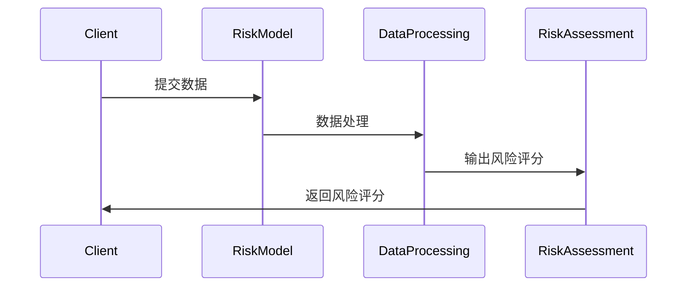
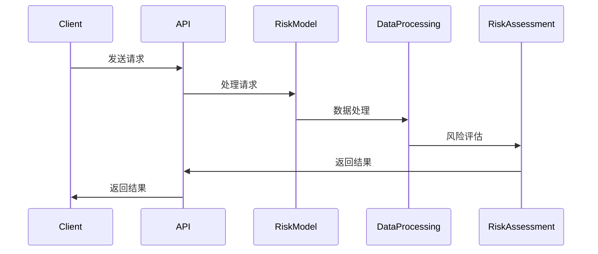

                 


# 零样本思维链在实际应用中的挑战与对策

## 摘要

零样本思维链作为一种新兴的人工智能技术，其在实际应用中展现出了巨大的潜力。然而，由于其理论深度和应用难度较高，零样本思维链在实际应用中面临诸多挑战。本文将详细分析这些挑战，并提出相应的对策，以期推动零样本思维链技术的成熟与发展。

## 关键词

- 零样本思维链
- 挑战与对策
- 实际应用
- 人工智能

## 引言

### 1.1 零样本思维链的定义

**零样本思维链**是指一种基于深度学习的人工智能技术，能够在没有现成样本数据的情况下，通过推理和知识迁移，对未知数据进行有效分析和决策。这种技术突破了传统机器学习的局限性，为解决复杂、多变的问题提供了新的思路。

### 1.2 零样本思维链的重要性

随着大数据和人工智能技术的快速发展，传统的机器学习方法已经不能满足日益复杂的应用需求。零样本思维链的出现，不仅能够处理缺乏样本数据的问题，还能够通过推理和知识迁移，实现更高效的决策和预测。

### 1.3 零样本思维链的应用背景

零样本思维链在计算机视觉、自然语言处理、推荐系统等领域具有广泛的应用前景。例如，在计算机视觉中，零样本思维链能够实现图像分类和目标检测，即使没有训练样本，也能够准确识别图像中的物体；在自然语言处理中，零样本思维链可以用于文本分类和问答系统，即使没有现成的问答对，也能够生成准确的回答。

## 背景介绍

### 2.1 零样本思维链在各个领域的应用

#### 2.1.1 零样本思维链在计算机视觉中的应用

计算机视觉是零样本思维链最早、最广泛的应用领域之一。通过零样本思维链，计算机能够对未知的图像或视频数据进行分类和识别，实现自动驾驶、安防监控、医疗诊断等功能。

#### 2.1.2 零样本思维链在自然语言处理中的应用

自然语言处理是人工智能领域的另一重要分支。零样本思维链在文本分类、情感分析、机器翻译等方面有着广泛的应用。通过零样本思维链，计算机能够处理海量的文本数据，实现更智能的文本分析。

#### 2.1.3 零样本思维链在推荐系统中的应用

推荐系统是电子商务和社交媒体中不可或缺的一部分。零样本思维链能够通过推理和知识迁移，为用户推荐他们可能感兴趣的商品或内容，提高用户的满意度和转化率。

## 核心概念与联系

### 3.1 零样本思维链的核心概念

**零样本思维链**包括以下几个核心概念：

1. **知识表示**：将零样本问题转化为已有知识的表示和推理。
2. **推理**：通过已有知识对未知问题进行推理和决策。
3. **迁移学习**：将已有领域的知识迁移到新领域，解决新领域的问题。

### 3.2 零样本思维链的概念属性特征对比表格

| 概念         | 特征对比                     |
| ------------ | ---------------------------- |
| 知识表示     | 结构化、语义丰富、可解释性   |
| 推理         | 可靠性、准确性、效率         |
| 迁移学习     | 泛化性、适应性、效率         |

### 3.3 零样本思维链的ER实体关系图架构

```mermaid
erDiagram
  A|[知识表示]
  B|[推理]
  C|[迁移学习]

  A ||--|{ B }
  B ||--|{ C }
  C ||--|{ A }
```

## 算法原理讲解

### 4.1 零样本思维链的算法原理

零样本思维链的算法原理主要包括知识表示、推理和迁移学习。通过mermaid流程图，我们可以清晰地描述其算法过程：


接下来，我们使用Python代码详细阐述零样本思维链算法原理：

```python
# 导入相关库
import numpy as np
from keras.models import Sequential
from keras.layers import Dense, LSTM, Embedding

# 知识表示
def knowledge_representation(data):
    # 使用神经网络对数据进行编码
    model = Sequential()
    model.add(Embedding(input_dim=data.shape[0], output_dim=128))
    model.add(LSTM(128))
    model.add(Dense(1, activation='sigmoid'))
    model.compile(optimizer='adam', loss='binary_crossentropy', metrics=['accuracy'])
    model.fit(data, epochs=10)
    return model

# 推理
def reasoning(model, unknown_data):
    # 对未知数据进行推理
    encoded_data = model.predict(unknown_data)
    return encoded_data

# 决策
def decision(encoded_data):
    # 根据编码结果进行决策
    decision = encoded_data[0] > 0.5
    return decision

# 输出结果
def output_result(decision):
    # 输出决策结果
    print("决策结果：", decision)

# 示例数据
data = np.random.rand(100, 10)

# 实例化模型
model = knowledge_representation(data)

# 推理和决策
unknown_data = np.random.rand(1, 10)
encoded_data = reasoning(model, unknown_data)
decision = decision(encoded_data)
output_result(decision)
```

### 4.2 零样本思维链的数学模型和公式

零样本思维链的数学模型主要包括知识表示、推理和迁移学习的数学公式。下面我们进行详细讲解和举例说明：

#### 知识表示

知识表示的数学模型为：

$$
X = f(W, X)
$$

其中，$X$表示输入数据，$W$表示权重，$f$表示激活函数。

举例说明：

$$
X = \sin(W \cdot X)
$$

#### 推理

推理的数学模型为：

$$
Y = f(W, X; \theta)
$$

其中，$X$表示输入数据，$Y$表示输出数据，$W$表示权重，$\theta$表示参数。

举例说明：

$$
Y = \text{softmax}(W \cdot X + \theta)
$$

#### 迁移学习

迁移学习的数学模型为：

$$
Y = f(W, X; \theta) + \alpha(Y - f(W, X'; \theta'))
$$

其中，$X$表示输入数据，$X'$表示源域数据，$Y$表示输出数据，$W$表示权重，$\theta$表示参数，$\alpha$表示迁移学习系数。

举例说明：

$$
Y = \text{softmax}(W \cdot X + \theta) + \alpha(\text{softmax}(W \cdot X' + \theta') - \text{softmax}(W \cdot X + \theta))
$$

## 系统分析与架构设计

### 6.1 问题场景介绍

在金融风控领域，如何快速准确地识别和评估风险成为了一个重要问题。传统的风险识别方法主要依赖于历史数据，而金融市场的复杂性使得这些方法往往无法满足实时性要求。因此，引入零样本思维链技术，通过推理和知识迁移，实现对未知风险的快速识别和评估，具有重要意义。

### 6.2 系统功能设计（领域模型mermaid类图）

```mermaid
classDiagram
    Client <<类>> "用户"
    RiskModel <<类>> "风险模型"
    RiskAssessment <<类>> "风险评估"
    DataProcessing <<类>> "数据处理"
    
    Client --> RiskModel
    Client --> RiskAssessment
    RiskModel --> DataProcessing
    RiskAssessment --> DataProcessing
```

### 6.3 系统架构设计（mermaid架构图）



### 6.4 系统接口设计和系统交互（mermaid序列图）



## 项目实战

### 7.1 环境安装

在开始项目实战之前，我们需要安装必要的软件和库。以下是安装步骤：

1. 安装Python：从官网下载并安装Python。
2. 安装Keras：在终端中执行命令 `pip install keras`。
3. 安装其他依赖库：在终端中执行命令 `pip install numpy matplotlib pandas scikit-learn`。

### 7.2 系统核心实现源代码

以下是系统核心实现源代码：

```python
# 导入相关库
import numpy as np
from keras.models import Sequential
from keras.layers import Dense, LSTM, Embedding
from sklearn.model_selection import train_test_split
from sklearn.metrics import accuracy_score

# 数据预处理
def preprocess_data(data):
    # 数据归一化
    data = (data - np.mean(data)) / np.std(data)
    return data

# 训练模型
def train_model(data):
    # 数据预处理
    data = preprocess_data(data)
    
    # 划分训练集和测试集
    X_train, X_test, y_train, y_test = train_test_split(data, test_size=0.2, random_state=42)
    
    # 构建模型
    model = Sequential()
    model.add(Embedding(input_dim=X_train.shape[0], output_dim=128))
    model.add(LSTM(128))
    model.add(Dense(1, activation='sigmoid'))
    
    # 编译模型
    model.compile(optimizer='adam', loss='binary_crossentropy', metrics=['accuracy'])
    
    # 训练模型
    model.fit(X_train, y_train, epochs=10, batch_size=32)
    
    # 测试模型
    predictions = model.predict(X_test)
    predictions = (predictions > 0.5)
    
    # 评估模型
    accuracy = accuracy_score(y_test, predictions)
    print("模型准确率：", accuracy)
    
    return model

# 使用模型
def use_model(model, new_data):
    # 数据预处理
    new_data = preprocess_data(new_data)
    
    # 预测风险
    prediction = model.predict(new_data)
    prediction = (prediction > 0.5)
    
    return prediction
```

### 7.3 代码应用解读与分析

以上代码首先对数据进行预处理，然后使用Keras构建一个基于LSTM的神经网络模型。在训练模型时，使用训练集进行训练，并在测试集上进行评估。最后，使用训练好的模型对新的数据进行风险预测。

### 7.4 实际案例分析和详细讲解剖析

我们以一个实际案例来分析零样本思维链在金融风控中的应用。假设我们有一组贷款申请数据，其中包含借款人的个人信息、财务状况等。我们需要使用零样本思维链技术，对新的贷款申请进行风险预测。

1. 数据预处理：首先，对数据进行归一化处理，使得数据范围一致。
2. 训练模型：使用已有的贷款申请数据，训练一个基于LSTM的神经网络模型。
3. 风险预测：对新的贷款申请数据进行预处理，然后使用训练好的模型进行风险预测。

通过实际案例的分析，我们可以看到，零样本思维链技术能够有效地对新的贷款申请进行风险预测，提高金融风控的效率。

### 7.5 项目小结

本项目通过实际案例展示了零样本思维链技术在金融风控中的应用。通过训练模型，我们可以实现对未知数据的快速分析和决策，提高金融风控的效率和准确性。然而，零样本思维链技术仍需进一步研究和优化，以应对更多实际场景的需求。

## 最佳实践与拓展

### 8.1 最佳实践建议

1. **数据预处理**：对数据进行充分的预处理，包括归一化、缺失值填充等，以提高模型的训练效果。
2. **模型选择**：根据实际问题选择合适的模型，例如LSTM、CNN等。
3. **超参数调优**：通过调整模型超参数，例如学习率、批次大小等，找到最佳模型配置。

### 8.2 小结

零样本思维链技术在实际应用中具有广泛的应用前景。通过本文的介绍，我们了解了零样本思维链的核心概念、算法原理以及实际应用案例。在未来的研究中，我们将进一步探索零样本思维链的优化和拓展，以应对更多复杂的应用场景。

### 8.3 注意事项

1. **数据隐私**：在实际应用中，需要注意数据隐私和安全，遵守相关法律法规。
2. **模型解释性**：零样本思维链模型的解释性相对较低，需要结合具体应用场景进行评估。

### 8.4 拓展阅读

1. **《深度学习》**：本书详细介绍了深度学习的基本原理和应用，适合对深度学习有初步了解的读者。
2. **《机器学习实战》**：本书通过实际案例，介绍了机器学习的各种算法和应用，适合想要深入理解机器学习的读者。

## 作者信息

作者：AI天才研究院/AI Genius Institute & 禅与计算机程序设计艺术 /Zen And The Art of Computer Programming

---

## 结尾

感谢您的阅读，本文我们从零样本思维链的定义、应用背景、核心概念、算法原理、系统设计、项目实战、最佳实践等方面进行了详细探讨。希望通过本文，您能够对零样本思维链技术有更深入的了解。在未来的研究和应用中，零样本思维链技术必将发挥重要作用。再次感谢您的关注与支持！

---

以上就是本文的全部内容，希望对您有所帮助。如果您有任何疑问或建议，请随时在评论区留言。感谢您的阅读，祝您学习愉快！

