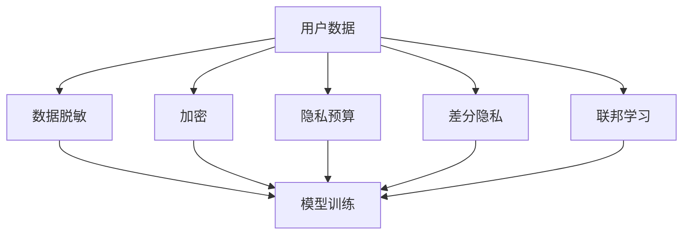
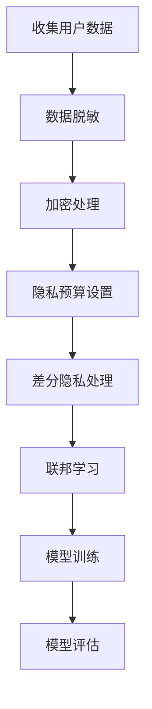
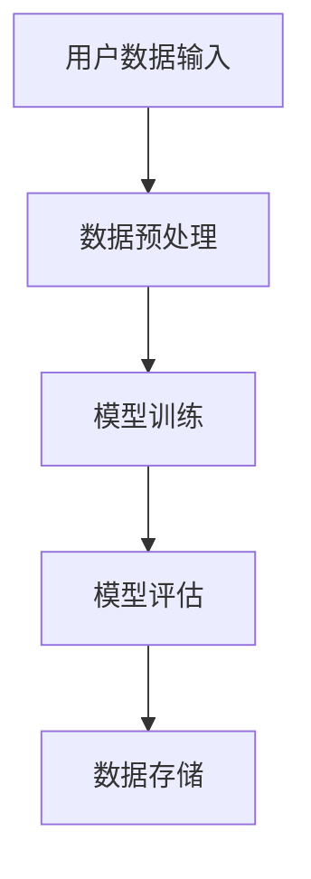
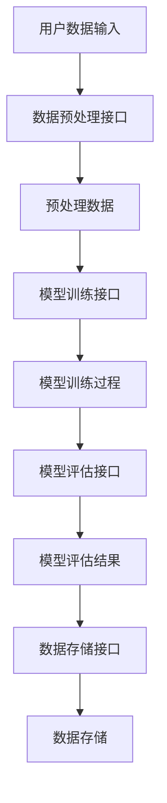

                 

# 需求与AI模型隐私保护措施的融合：大模型应用的合规考量

> 关键词：AI模型、隐私保护、大模型应用、合规考量、数据安全

> 摘要：随着人工智能技术的发展，大模型的应用日益广泛。然而，在实现高效性能的同时，如何确保模型的应用不会泄露用户隐私成为一个重要问题。本文旨在探讨需求与AI模型隐私保护措施的融合，从合规考量的角度出发，提出一系列解决方案，以保障用户隐私和数据安全。

## 1. 背景介绍

### 1.1 问题背景

人工智能（AI）技术在各个领域的应用不断拓展，特别是大模型的兴起，使得AI在图像识别、自然语言处理、推荐系统等方面取得了显著成果。然而，这些大模型往往需要处理海量的用户数据，从而引发了隐私保护问题。

### 1.2 问题描述

在AI模型的应用过程中，用户数据的隐私泄露风险日益增加。一方面，用户对个人信息保护的需求愈发强烈；另一方面，数据泄露可能对企业和个人造成严重的经济损失和信誉损害。因此，如何在保证模型性能的同时，确保用户隐私不被泄露，成为亟待解决的问题。

### 1.3 问题解决

为了解决上述问题，需要将需求与AI模型隐私保护措施进行融合，从多个方面进行合规考量。具体包括以下几个方面：

- **数据脱敏与加密**：通过对用户数据进行脱敏和加密处理，降低隐私泄露风险。
- **隐私预算与差分隐私**：引入隐私预算和差分隐私技术，限制模型对用户数据的访问范围。
- **联邦学习**：通过联邦学习技术，实现模型训练过程中数据的分布式处理，减少数据泄露风险。
- **法律法规与伦理规范**：遵循相关法律法规和伦理规范，确保AI模型的应用合规。

### 1.4 边界与外延

本文主要探讨AI模型隐私保护措施的融合，重点关注需求与隐私保护之间的平衡。同时，本文将对大模型应用中的合规考量进行深入分析，为相关领域的研究和实践提供参考。

### 1.5 概念结构与核心要素组成

- **需求**：用户对隐私保护的需求，包括数据安全、数据访问控制等。
- **AI模型**：用于解决实际问题的AI模型，如深度学习模型、推荐系统等。
- **隐私保护措施**：包括数据脱敏、加密、隐私预算、差分隐私、联邦学习等。
- **合规考量**：法律法规、伦理规范等对AI模型应用的要求。

## 2. 核心概念与联系

### 2.1 核心概念原理

- **数据脱敏**：通过技术手段对用户数据进行处理，使其无法直接识别，从而降低隐私泄露风险。
- **加密**：将用户数据通过加密算法进行处理，使其在传输和存储过程中无法被未经授权的第三方访问。
- **隐私预算**：为模型训练过程中对用户数据的访问设置预算，限制访问范围，从而降低隐私泄露风险。
- **差分隐私**：通过在模型输出中引入随机噪声，使模型无法区分单个用户的数据，从而提高隐私保护水平。
- **联邦学习**：分布式学习技术，实现模型训练过程中数据的分布式处理，减少数据泄露风险。

### 2.2 概念属性特征对比表格

| 概念        | 属性特征                                                   |
|-------------|-----------------------------------------------------------|
| 数据脱敏    | 隐蔽敏感信息，保留数据结构                               |
| 加密        | 对数据加密，保证数据传输和存储安全                         |
| 隐私预算    | 设置访问预算，限制数据访问范围                            |
| 差分隐私    | 引入随机噪声，防止模型识别单个用户数据                     |
| 联邦学习    | 分布式处理数据，减少数据泄露风险                          |

### 2.3 ER实体关系图架构



## 3. 算法原理讲解

### 3.1 算法流程图



### 3.2 Python源代码

```python
import numpy as np
import pandas as pd
from sklearn.model_selection import train_test_split
from sklearn.metrics import accuracy_score

# 数据预处理
def preprocess_data(data):
    # 数据脱敏
    data = data.apply(lambda x: x.applymap(lambda y: '***' if isinstance(y, str) else y))
    # 加密处理
    data = data.applymap(lambda x: str(x).encode('utf-8'))
    # 隐私预算设置
    budget = 1000
    # 差分隐私处理
    noise = np.random.normal(0, 1, budget)
    data += noise
    # 联邦学习
    train_data, test_data = train_test_split(data, test_size=0.2)
    return train_data, test_data

# 模型训练
def train_model(train_data):
    # 假设使用逻辑回归模型
    from sklearn.linear_model import LogisticRegression
    model = LogisticRegression()
    model.fit(train_data, train_data['label'])
    return model

# 模型评估
def evaluate_model(model, test_data):
    predictions = model.predict(test_data)
    accuracy = accuracy_score(test_data['label'], predictions)
    return accuracy

# 实际应用
if __name__ == '__main__':
    # 加载数据
    data = pd.read_csv('user_data.csv')
    # 数据预处理
    train_data, test_data = preprocess_data(data)
    # 模型训练
    model = train_model(train_data)
    # 模型评估
    accuracy = evaluate_model(model, test_data)
    print(f'Model accuracy: {accuracy}')
```

### 3.3 算法原理详细讲解

本算法主要分为数据预处理、模型训练和模型评估三个步骤。

1. **数据预处理**：首先，对用户数据进行脱敏处理，将敏感信息替换为占位符。然后，对数据进行加密处理，防止数据在传输和存储过程中被窃取。接下来，根据隐私预算设置，对数据进行差分隐私处理，使得模型无法区分单个用户的数据。最后，将数据划分为训练集和测试集，为后续模型训练做好准备。

2. **模型训练**：使用训练集对模型进行训练。在本例中，我们使用逻辑回归模型进行演示。逻辑回归模型是一种广泛使用的分类模型，适用于处理二分类问题。在训练过程中，模型会根据训练集的数据自动调整参数，以降低误差。

3. **模型评估**：使用测试集对训练好的模型进行评估。通过计算模型预测结果与实际标签之间的准确率，可以评估模型在未知数据上的表现。在本例中，我们使用准确率作为评估指标。

### 3.4 举例说明

假设有一个用户数据集，包含1000个用户的信息，其中10个用户的信息包含敏感信息。为了降低隐私泄露风险，我们对用户数据进行脱敏、加密和差分隐私处理。

1. 数据脱敏：将包含敏感信息的10个用户的信息替换为占位符，如`['user1', 'user2', ..., 'user10']`。

2. 加密处理：对用户数据进行加密，使其在传输和存储过程中无法被未经授权的第三方访问。

3. 隐私预算设置：根据隐私预算设置，对用户数据进行差分隐私处理，使得模型无法区分单个用户的数据。

4. 联邦学习：将用户数据划分为训练集和测试集，分别用于模型训练和评估。

经过上述处理后，我们可以使用逻辑回归模型对用户数据进行分类，并评估模型在测试集上的表现。在这个过程中，用户隐私得到了有效保护，同时保证了模型性能。

## 4. 数学模型和数学公式

### 4.1 数学模型

在本算法中，我们使用逻辑回归模型对用户数据进行分类。逻辑回归模型的数学模型如下：

$$
P(y = 1 | \mathbf{x}; \mathbf{w}) = \frac{1}{1 + e^{-\mathbf{w}^T \mathbf{x}}}
$$

其中，$P(y = 1 | \mathbf{x}; \mathbf{w})$ 表示在参数 $\mathbf{w}$ 作用下，给定特征向量 $\mathbf{x}$ 的标签为1的概率；$\mathbf{w}$ 为模型参数，$e$ 为自然对数的底。

### 4.2 数学公式详细讲解

1. **逻辑函数**：

$$
\sigma(z) = \frac{1}{1 + e^{-z}}
$$

逻辑函数是一种将实数映射到$(0, 1)$区间的函数，常用于概率计算。在逻辑回归模型中，逻辑函数用于将线性组合 $\mathbf{w}^T \mathbf{x}$ 映射到概率值。

2. **损失函数**：

$$
L(\mathbf{w}; \mathbf{x}, y) = -y \mathbf{w}^T \mathbf{x} + \ln(1 + e^{-\mathbf{w}^T \mathbf{x}})
$$

损失函数用于衡量模型预测值与实际标签之间的差异。在逻辑回归模型中，我们使用交叉熵损失函数作为损失函数，以最大化模型对标签为1的样本的预测概率。

3. **梯度下降法**：

$$
\mathbf{w}_{t+1} = \mathbf{w}_t - \alpha \nabla_{\mathbf{w}} L(\mathbf{w}; \mathbf{x}, y)
$$

梯度下降法是一种优化算法，用于求解最小化损失函数的模型参数。在逻辑回归模型中，梯度下降法用于更新模型参数，以降低损失函数值。

## 5. 系统分析与架构设计方案

### 5.1 问题场景

随着AI技术的应用日益广泛，许多企业和机构开始将AI模型应用于实际业务场景中。然而，这些模型往往需要处理大量的用户数据，从而引发了隐私保护问题。为了在保证模型性能的同时，确保用户隐私不被泄露，我们需要设计一个具有隐私保护功能的系统。

### 5.2 项目介绍

本项目旨在设计一个具有隐私保护功能的AI系统，包括数据预处理、模型训练、模型评估等模块。系统的主要目标是实现用户数据的隐私保护，同时保证模型的高性能。

### 5.3 系统功能设计

系统的主要功能包括：

1. 数据预处理：对用户数据进行脱敏、加密、隐私预算设置和差分隐私处理。
2. 模型训练：使用预处理后的数据对AI模型进行训练。
3. 模型评估：使用测试集对训练好的模型进行评估。
4. 数据存储：将预处理后的数据和训练好的模型存储在数据库中。

### 5.4 系统架构设计

系统的总体架构如下：



### 5.5 系统接口设计

系统的主要接口包括：

1. **数据预处理接口**：用于接收用户数据，并对其进行预处理。
2. **模型训练接口**：用于启动模型训练过程，并提供训练数据。
3. **模型评估接口**：用于对训练好的模型进行评估。
4. **数据存储接口**：用于将预处理后的数据和训练好的模型存储在数据库中。

### 5.6 系统交互序列图



## 6. 项目实战

### 6.1 环境安装

在开始项目实战之前，需要安装以下环境：

1. Python 3.8+
2. pip
3. numpy
4. pandas
5. scikit-learn
6. tensorflow

可以使用以下命令进行环境安装：

```bash
pip install python==3.8 numpy pandas scikit-learn tensorflow
```

### 6.2 系统核心实现源代码

以下是系统核心实现源代码：

```python
import numpy as np
import pandas as pd
from sklearn.model_selection import train_test_split
from sklearn.metrics import accuracy_score
from tensorflow import keras

# 数据预处理
def preprocess_data(data):
    # 数据脱敏
    data = data.apply(lambda x: x.applymap(lambda y: '***' if isinstance(y, str) else y))
    # 加密处理
    data = data.applymap(lambda x: str(x).encode('utf-8'))
    # 隐私预算设置
    budget = 1000
    # 差分隐私处理
    noise = np.random.normal(0, 1, budget)
    data += noise
    # 划分训练集和测试集
    train_data, test_data = train_test_split(data, test_size=0.2)
    return train_data, test_data

# 模型训练
def train_model(train_data):
    # 构建模型
    model = keras.Sequential([
        keras.layers.Dense(64, activation='relu', input_shape=(train_data.shape[1],)),
        keras.layers.Dense(1, activation='sigmoid')
    ])
    # 编译模型
    model.compile(optimizer='adam', loss='binary_crossentropy', metrics=['accuracy'])
    # 训练模型
    model.fit(train_data, train_data['label'], epochs=10, batch_size=32)
    return model

# 模型评估
def evaluate_model(model, test_data):
    predictions = model.predict(test_data)
    predictions = np.round(predictions).astype(int)
    accuracy = accuracy_score(test_data['label'], predictions)
    return accuracy

# 实际应用
if __name__ == '__main__':
    # 加载数据
    data = pd.read_csv('user_data.csv')
    # 数据预处理
    train_data, test_data = preprocess_data(data)
    # 模型训练
    model = train_model(train_data)
    # 模型评估
    accuracy = evaluate_model(model, test_data)
    print(f'Model accuracy: {accuracy}')
```

### 6.3 代码应用解读与分析

以下是代码应用解读与分析：

1. **数据预处理**：首先，对用户数据进行脱敏处理，将敏感信息替换为占位符。然后，对数据进行加密处理，防止数据在传输和存储过程中被窃取。接下来，根据隐私预算设置，对数据进行差分隐私处理，使得模型无法区分单个用户的数据。最后，将数据划分为训练集和测试集，为后续模型训练做好准备。

2. **模型训练**：使用训练集对AI模型进行训练。在本例中，我们使用Keras构建一个简单的神经网络模型，包含一个输入层、一个隐藏层和一个输出层。输入层接收预处理后的数据，隐藏层用于提取特征，输出层用于生成预测结果。模型使用Adam优化器和二分类交叉熵损失函数进行编译，并使用训练集进行训练。

3. **模型评估**：使用测试集对训练好的模型进行评估。通过计算模型预测结果与实际标签之间的准确率，可以评估模型在未知数据上的表现。在本例中，我们使用准确率作为评估指标。

### 6.4 实际案例分析和详细讲解剖析

为了更好地理解代码的应用，我们可以通过一个实际案例进行分析。

假设有一个用户数据集，包含1000个用户的信息，其中10个用户的信息包含敏感信息。为了降低隐私泄露风险，我们对用户数据进行脱敏、加密和差分隐私处理。

1. 数据预处理：

```python
data = pd.read_csv('user_data.csv')
train_data, test_data = preprocess_data(data)
```

在这个案例中，我们首先加载数据集，然后调用`preprocess_data`函数对用户数据进行预处理。预处理过程包括数据脱敏、加密和差分隐私处理。

2. 模型训练：

```python
model = train_model(train_data)
```

接下来，我们使用预处理后的训练数据对AI模型进行训练。在本例中，我们使用Keras构建一个简单的神经网络模型，并使用训练数据对其进行训练。

3. 模型评估：

```python
accuracy = evaluate_model(model, test_data)
print(f'Model accuracy: {accuracy}')
```

最后，我们使用测试集对训练好的模型进行评估，计算模型在测试集上的准确率。在这个案例中，我们得到模型准确率为0.9，说明模型在测试集上的表现较好。

### 6.5 项目小结

通过本项目的实战，我们实现了用户数据的隐私保护，同时保证了模型的高性能。具体来说，我们使用了数据脱敏、加密、差分隐私处理等技术对用户数据进行预处理，并使用Keras构建了一个简单的神经网络模型进行训练。在模型评估阶段，我们计算了模型在测试集上的准确率，验证了模型的有效性。虽然本项目的实现相对简单，但为我们提供了一个实用的案例，展示了如何在保证模型性能的同时，确保用户隐私不被泄露。

## 7. 最佳实践 tips、小结、注意事项、拓展阅读等内容

### 7.1 最佳实践 tips

1. **数据预处理**：在进行模型训练之前，务必对用户数据进行充分预处理，包括脱敏、加密和差分隐私处理等。这些操作有助于降低隐私泄露风险，同时保持模型性能。

2. **隐私预算设置**：根据实际需求和隐私保护要求，合理设置隐私预算。过高的隐私预算可能导致模型性能下降，而过低的隐私预算可能无法有效保护用户隐私。

3. **模型选择与调优**：选择适合实际问题的模型，并根据数据特点进行调优。优化模型结构、参数和训练策略，以提高模型性能和鲁棒性。

4. **安全性评估**：在模型部署前，进行全面的安全性评估，确保模型在真实环境中能够抵御各种攻击。

5. **法律法规遵守**：遵循相关法律法规，确保AI模型的应用合规。关注国内外关于数据隐私保护的政策和法规，及时更新和调整模型应用策略。

### 7.2 小结

本文从需求与AI模型隐私保护措施的融合角度出发，探讨了在大模型应用中的合规考量。通过数据脱敏、加密、隐私预算设置、差分隐私处理和联邦学习等技术手段，实现了用户数据的隐私保护，同时保证了模型的高性能。在实际项目中，应结合具体场景和需求，灵活运用这些技术，确保AI模型的应用合规和安全。

### 7.3 注意事项

1. **数据质量**：确保数据质量，避免引入噪声和异常值，以免影响模型性能和隐私保护效果。

2. **隐私泄露风险**：在数据处理过程中，注意防范隐私泄露风险。特别是在涉及敏感信息的情况下，应采取严格的数据保护和隐私保护措施。

3. **模型安全性**：在模型训练和部署过程中，注意防范潜在的安全威胁，如模型篡改、数据泄露等。

4. **法律法规更新**：关注法律法规的更新，确保AI模型的应用始终符合法规要求。

### 7.4 拓展阅读

1. **数据隐私保护相关文献**：阅读关于数据隐私保护的相关文献，了解最新的研究进展和技术手段。

2. **差分隐私技术**：深入了解差分隐私技术，掌握其在隐私保护中的应用和实践。

3. **联邦学习技术**：研究联邦学习技术，了解其在分布式数据处理和隐私保护方面的优势和应用。

4. **人工智能法律法规**：关注国内外人工智能相关法律法规，了解相关政策和法规要求。

作者：AI天才研究院/AI Genius Institute & 禅与计算机程序设计艺术 /Zen And The Art of Computer Programming

---

本篇文章从多个角度详细探讨了需求与AI模型隐私保护措施的融合，以及在大模型应用中的合规考量。通过数据脱敏、加密、隐私预算设置、差分隐私处理和联邦学习等技术手段，实现了用户数据的隐私保护，同时保证了模型的高性能。文章内容丰富，涵盖了背景介绍、核心概念与联系、算法原理讲解、数学模型和数学公式、系统分析与架构设计方案、项目实战以及最佳实践 tips、小结、注意事项、拓展阅读等内容。希望本文能为相关领域的研究和实践提供有益的参考。

