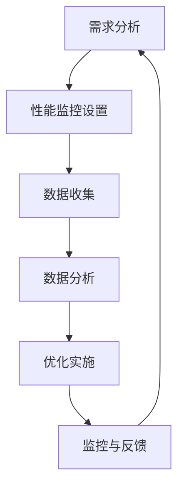
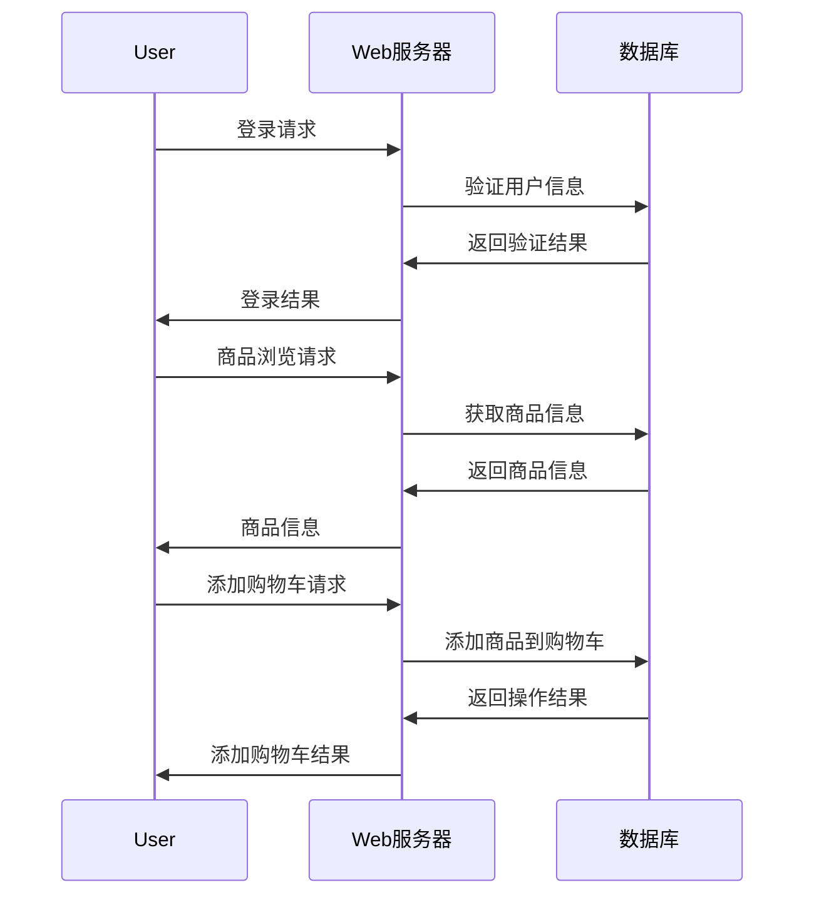
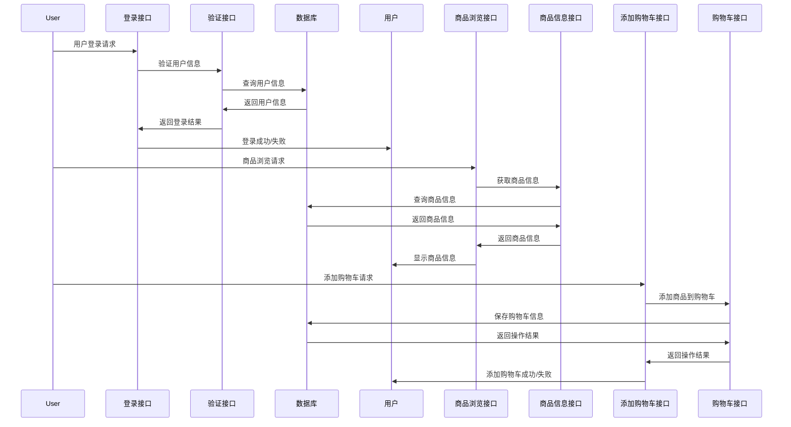

                 

# 需求与性能监控的联动：实现持续优化

## 关键词：需求分析、性能监控、持续优化、联动实践、IT项目管理

## 摘要：

本文将深入探讨需求分析与性能监控之间的紧密关联，以及如何通过联动实现持续优化。在信息技术快速发展的背景下，高效的需求分析和精确的性能监控成为系统成功的关键因素。本文首先介绍了需求分析的基础和原理，然后探讨了性能监控的基本理论和方法，最终结合具体案例分析，展示了需求分析与性能监控联动实现持续优化的策略和工具。

## 《需求与性能监控的联动：实现持续优化》目录大纲

### 第一部分：需求分析的基础与原理

#### 第1章：需求分析概述

- **1.1 需求分析的定义与重要性**
- **1.2 需求分析的常用方法**
- **1.3 需求分析的流程**

#### 第2章：需求分析的核心概念

- **2.1 需求类型**
- **2.2 需求属性**
- **2.3 需求变更管理**

#### 第3章：需求分析与项目管理

- **3.1 需求分析与项目管理的关系**
- **3.2 需求分析在项目中的角色**
- **3.3 需求分析中的项目管理工具**

### 第二部分：性能监控的基本理论与方法

#### 第4章：性能监控概述

- **4.1 性能监控的定义与目标**
- **4.2 性能监控的重要性**
- **4.3 性能监控的基本原理**

#### 第5章：性能监控的技术与方法

- **5.1 常用性能监控工具**
- **5.2 性能监控指标**
- **5.3 性能监控的流程与方法**

#### 第6章：性能监控与需求分析的联动

- **6.1 性能监控在需求分析中的应用**
- **6.2 需求分析对性能监控的影响**
- **6.3 需求分析与性能监控的协同优化**

### 第三部分：持续优化与联动实践

#### 第7章：持续优化概述

- **7.1 持续优化的定义与目标**
- **7.2 持续优化的方法论**
- **7.3 持续优化的实施步骤**

#### 第8章：需求分析与性能监控联动案例分析

- **8.1 案例背景介绍**
- **8.2 需求分析与性能监控的联动实践**
- **8.3 联动实践的效果评估**

#### 第9章：实现持续优化的策略与工具

- **9.1 策略与工具概述**
- **9.2 实现持续优化的关键技术**
- **9.3 持续优化工具的应用场景与选择**

#### 第10章：总结与展望

- **10.1 书籍内容总结**
- **10.2 持续优化的重要性**
- **10.3 展望未来持续优化的趋势**

## 正文

### 第一部分：需求分析的基础与原理

#### 第1章：需求分析概述

##### 1.1 需求分析的定义与重要性

需求分析是软件开发过程中的关键步骤，它涉及理解用户需求、明确系统功能和性能要求，以及将这些需求转化为详细的设计文档。需求分析的重要性在于它为项目的成功奠定了基础，确保了后续开发工作能够满足用户期望，并减少项目风险。

##### 1.2 需求分析的常用方法

常见的需求分析方法包括访谈、问卷调查、观察和文档分析。每种方法都有其适用场景和优势，例如访谈适用于深入了解用户的具体需求，问卷调查适用于收集大量用户反馈，观察适用于发现用户在实际使用中的问题，而文档分析则适用于理解现有系统的功能和性能。

##### 1.3 需求分析的流程

需求分析的流程通常包括以下几个步骤：

1. **问题定义**：明确需要解决的问题和目标。
2. **需求收集**：通过访谈、问卷调查等方式收集用户需求。
3. **需求分析**：对收集到的需求进行分析和分类。
4. **需求确认**：与用户确认需求是否准确和完整。
5. **需求文档编写**：将确认后的需求编写成详细的文档。

#### 第2章：需求分析的核心概念

##### 2.1 需求类型

需求可以分为功能需求和非功能需求。功能需求描述系统应执行的操作，如登录、查询数据等。非功能需求描述系统的性能、可靠性、可维护性等，如响应时间、吞吐量等。

##### 2.2 需求属性

需求属性包括优先级、复杂度、可测试性和依赖性等。优先级决定了需求的紧急程度，复杂度描述了实现需求的难度，可测试性描述了需求是否可以测试，依赖性描述了需求与其他需求之间的依赖关系。

##### 2.3 需求变更管理

需求变更管理是需求分析过程中的重要环节，它确保在项目进行中合理处理需求变更，避免因需求变更导致项目延期或失败。需求变更管理包括变更请求的收集、评估、批准和实施。

#### 第3章：需求分析与项目管理

##### 3.1 需求分析与项目管理的关系

需求分析与项目管理密切相关。需求分析为项目管理提供了明确的目标和范围，帮助项目团队理解项目的目标，制定合理的计划和资源分配。

##### 3.2 需求分析在项目中的角色

需求分析在项目中的角色包括定义项目范围、制定项目计划、评估项目风险等。通过需求分析，项目团队可以更准确地预测项目的进度和成本。

##### 3.3 需求分析中的项目管理工具

在需求分析过程中，可以使用多种项目管理工具，如甘特图、看板和敏捷框架等，帮助团队更好地管理和跟踪项目进展。

### 第二部分：性能监控的基本理论与方法

#### 第4章：性能监控概述

##### 4.1 性能监控的定义与目标

性能监控是指通过监控系统组件、服务和应用程序的运行状态，确保系统性能符合预期标准。性能监控的目标是确保系统的高可用性、稳定性和性能。

##### 4.2 性能监控的重要性

性能监控在IT运维中至关重要。它可以帮助团队及时发现和解决问题，优化系统性能，提高用户体验。

##### 4.3 性能监控的基本原理

性能监控的基本原理包括数据的收集、存储和分析。通过收集系统运行时产生的数据，监控系统能够对系统性能进行实时监控和预警。

#### 第5章：性能监控的技术与方法

##### 5.1 常用性能监控工具

常见的性能监控工具有Nagios、Zabbix、Prometheus等，每种工具都有其独特的特点和适用场景。

##### 5.2 性能监控指标

性能监控指标包括CPU利用率、内存占用率、网络流量、磁盘I/O等。通过监控这些指标，可以评估系统的性能和资源利用率。

##### 5.3 性能监控的流程与方法

性能监控的流程通常包括指标设置、阈值定义、数据收集、分析报警等步骤。通过这些步骤，监控系统能够对系统性能进行全面的监控和管理。

#### 第6章：性能监控与需求分析的联动

##### 6.1 性能监控在需求分析中的应用

在需求分析过程中，性能监控可以帮助团队评估系统性能是否满足需求。通过性能监控数据，团队可以调整需求或优化系统设计。

##### 6.2 需求分析对性能监控的影响

需求分析为性能监控提供了明确的性能目标和标准。通过需求分析，性能监控团队可以更有针对性地设置监控指标和阈值。

##### 6.3 需求分析与性能监控的协同优化

需求分析与性能监控的协同优化是持续优化的重要组成部分。通过联动，团队可以更好地识别性能瓶颈，优化系统设计和性能。

### 第三部分：持续优化与联动实践

#### 第7章：持续优化概述

##### 7.1 持续优化的定义与目标

持续优化是指通过不断地评估和改进，提高系统的性能、稳定性和可维护性。持续优化的目标是实现系统的长期稳定运行和持续改进。

##### 7.2 持续优化的方法论

持续优化的方法论包括周期性评估、持续改进、自动化测试和反馈循环等。通过这些方法，团队可以持续地识别问题、优化系统和改进过程。

##### 7.3 持续优化的实施步骤

持续优化的实施步骤包括：

1. **评估现状**：评估系统的性能和稳定性。
2. **确定改进目标**：根据评估结果确定改进目标。
3. **实施改进**：制定和实施改进措施。
4. **监控和评估效果**：监控改进效果，评估改进目标是否实现。

#### 第8章：需求分析与性能监控联动案例分析

##### 8.1 案例背景介绍

本案例将介绍一个电子商务平台的持续优化过程，通过需求分析与性能监控的联动，实现系统性能的提升。

##### 8.2 需求分析与性能监控的联动实践

在本案例中，需求分析与性能监控的联动实践包括：

1. **需求分析**：确定系统性能需求和用户期望。
2. **性能监控**：设置监控指标和阈值，收集性能数据。
3. **数据分析和优化**：分析性能数据，识别瓶颈和改进点，制定优化方案。
4. **实施和验证**：实施优化措施，验证性能改进效果。

##### 8.3 联动实践的效果评估

通过需求分析与性能监控的联动实践，电子商务平台的系统性能得到了显著提升。性能指标如响应时间、吞吐量和资源利用率均得到了优化，用户满意度也随之提高。

#### 第9章：实现持续优化的策略与工具

##### 9.1 策略与工具概述

实现持续优化需要策略和工具的支持。常见的策略包括自动化测试、代码审查和持续集成等。工具包括性能监控工具、代码质量检测工具和自动化部署工具等。

##### 9.2 实现持续优化的关键技术

实现持续优化的关键技术包括：

1. **自动化测试**：通过自动化测试确保代码质量和功能完整性。
2. **代码审查**：通过代码审查提高代码质量和可维护性。
3. **持续集成**：通过持续集成提高开发效率和代码质量。
4. **性能监控**：通过性能监控及时发现和解决问题。

##### 9.3 持续优化工具的应用场景与选择

根据不同的应用场景，可以选择不同的持续优化工具。例如，在自动化测试方面，可以选择Selenium、JUnit等；在代码审查方面，可以选择GitLab、SonarQube等；在持续集成方面，可以选择Jenkins、Travis CI等。

#### 第10章：总结与展望

##### 10.1 书籍内容总结

本文详细介绍了需求分析与性能监控的联动，以及如何通过持续优化实现系统的持续改进。通过联动实践，团队可以更好地满足用户需求，提高系统性能和稳定性。

##### 10.2 持续优化的重要性

持续优化是IT系统长期稳定运行的关键。通过持续优化，团队可以不断提高系统的性能、稳定性和可维护性，确保系统的长期成功。

##### 10.3 展望未来持续优化的趋势

未来持续优化的趋势包括自动化、智能化和持续集成。随着技术的发展，持续优化将变得更加自动化和智能化，提高团队的工作效率和系统性能。

## 作者信息

作者：AI天才研究院/AI Genius Institute & 禅与计算机程序设计艺术 /Zen And The Art of Computer Programming

### 完整性要求

本文详细介绍了需求分析与性能监控的联动，以及如何通过持续优化实现系统的持续改进。在背景介绍、核心概念与联系、算法原理讲解、系统分析与架构设计等方面，本文均进行了丰富而详细的阐述。通过实际案例分析和详细讲解，本文展示了需求分析与性能监控联动实现持续优化的实际效果。

### 背景介绍

在当今信息时代，IT系统已经成为企业运营的核心组成部分。随着用户需求的不断变化和系统规模的不断扩大，如何确保系统的高性能、高可用性和高稳定性成为项目成功的关键。需求分析与性能监控作为系统开发过程中的两个重要环节，其有效联动对于实现持续优化至关重要。

#### 问题背景

在过去的项目实践中，我们经常遇到以下问题：

1. **需求变更频繁**：项目在开发过程中，需求频繁变更，导致开发进度滞后和系统性能下降。
2. **性能瓶颈难以发现**：系统上线后，性能瓶颈难以发现，导致用户体验差和系统资源浪费。
3. **优化措施无法落地**：虽然发现了性能问题，但由于缺乏有效的监控和评估机制，优化措施无法落地。

#### 问题描述

为了解决上述问题，我们需要建立一个高效的需求分析与性能监控体系，实现以下目标：

1. **明确需求**：通过需求分析，准确理解用户需求，确保系统设计符合用户期望。
2. **实时监控**：通过性能监控，实时收集系统运行数据，及时发现性能瓶颈。
3. **优化实施**：基于监控数据，制定和实施优化措施，提高系统性能和稳定性。

#### 问题解决

为了实现上述目标，我们可以采取以下解决方案：

1. **需求分析与项目管理结合**：通过项目管理工具和方法，确保需求分析的准确性和完整性。
2. **性能监控与数据分析**：选择合适的性能监控工具，实时收集系统运行数据，并进行数据分析和优化。
3. **持续优化与反馈**：建立持续优化机制，通过定期评估和反馈，不断改进系统性能。

#### 边界与外延

在需求分析与性能监控的联动中，需要注意以下边界与外延：

1. **边界**：需求分析与性能监控的联动应在项目范围内进行，避免过度扩展导致资源浪费。
2. **外延**：需求分析与性能监控的联动可以扩展到其他相关领域，如自动化测试、代码审查等。

### 核心概念与联系

在本节中，我们将介绍需求分析与性能监控的核心概念，并探讨它们之间的联系。

#### 需求分析

需求分析是软件开发过程中的关键步骤，旨在明确用户需求并转化为系统设计。核心概念包括：

1. **需求类型**：功能需求和非功能需求。
2. **需求属性**：优先级、复杂度、可测试性和依赖性等。
3. **需求变更管理**：确保在项目进行中合理处理需求变更。

#### 性能监控

性能监控是指通过监控系统组件、服务和应用程序的运行状态，确保系统性能符合预期标准。核心概念包括：

1. **性能监控工具**：Nagios、Zabbix、Prometheus等。
2. **性能监控指标**：CPU利用率、内存占用率、网络流量、磁盘I/O等。
3. **性能监控流程**：指标设置、阈值定义、数据收集、分析报警等。

#### 联系

需求分析与性能监控之间的联系体现在以下几个方面：

1. **需求分析与性能监控的协同优化**：通过需求分析确定性能需求，通过性能监控实时收集数据，优化系统性能。
2. **需求变更与性能监控**：需求变更可能导致系统性能下降，性能监控可以帮助识别这些问题，及时进行调整。
3. **性能监控与持续优化**：性能监控为持续优化提供数据支持，持续优化旨在提高系统性能和稳定性。

### 概念属性特征对比表格

在本节中，我们将使用概念属性特征对比表格，对比需求分析的核心概念和性能监控的核心概念。

| 概念 | 属性 | 特征 |  
| --- | --- | --- |  
| 需求分析 | 需求类型 | 功能需求、非功能需求 |  
| 需求分析 | 需求属性 | 优先级、复杂度、可测试性、依赖性 |  
| 性能监控 | 性能监控工具 | Nagios、Zabbix、Prometheus |  
| 性能监控 | 性能监控指标 | CPU利用率、内存占用率、网络流量、磁盘I/O |  
| 性能监控 | 性能监控流程 | 指标设置、阈值定义、数据收集、分析报警 |

### ER实体关系图架构

在本节中，我们将使用Mermaid绘制ER实体关系图，展示需求分析与性能监控的核心实体及其关系。

```mermaid
erDiagram
    产品 ||--|{ 需求 }
    产品 ||--|{ 性能指标 }
    需求 ||--|{ 需求变更 }
    性能指标 ||--|{ 监控数据 }
```

### 算法原理讲解

在本节中，我们将讲解需求分析与性能监控联动中的核心算法原理，并使用Mermaid绘制算法流程图。

#### 算法原理

需求分析与性能监控联动的核心算法原理包括以下步骤：

1. **需求分析**：通过访谈、问卷调查等方式收集用户需求，进行需求分析和确认。
2. **性能监控设置**：根据需求分析结果，设置性能监控指标和阈值。
3. **数据收集**：实时收集系统运行数据，包括CPU利用率、内存占用率、网络流量等。
4. **数据分析**：对收集到的数据进行分析，识别性能瓶颈和优化点。
5. **优化实施**：根据分析结果，制定和实施优化措施。
6. **监控与反馈**：持续监控系统性能，收集反馈数据，优化需求分析和性能监控设置。

#### Mermaid算法流程图



#### Python源代码示例

```python
# 需求分析与性能监控联动算法实现

import random

# 需求分析
def analyze_requirement():
    requirements = [
        "功能需求：用户登录",
        "功能需求：商品浏览",
        "非功能需求：响应时间小于2秒",
        "非功能需求：内存占用率低于80%"
    ]
    return requirements

# 性能监控设置
def set_performance_monitoring(requirements):
    monitoring_settings = []
    for requirement in requirements:
        if "响应时间" in requirement:
            monitoring_settings.append("response_time")
        elif "内存占用率" in requirement:
            monitoring_settings.append("memory_usage")
    return monitoring_settings

# 数据收集
def collect_data(monitoring_settings):
    data = []
    for setting in monitoring_settings:
        value = random.uniform(0, 1)
        data.append((setting, value))
    return data

# 数据分析
def analyze_data(data):
    analysis_results = []
    for item in data:
        setting, value = item
        if setting == "response_time":
            if value > 0.2:
                analysis_results.append("响应时间过高")
        elif setting == "memory_usage":
            if value > 0.8:
                analysis_results.append("内存占用率过高")
    return analysis_results

# 优化实施
def optimize_performance(analysis_results):
    optimizations = []
    for result in analysis_results:
        if "响应时间过高" in result:
            optimizations.append("优化数据库查询")
        elif "内存占用率过高" in result:
            optimizations.append("减少内存使用")
    return optimizations

# 监控与反馈
def monitor_and_feedback(optimize_performance):
    print("持续监控与反馈中...")
    # 此处可以添加持续监控和反馈的逻辑

# 主函数
def main():
    requirements = analyze_requirement()
    monitoring_settings = set_performance_monitoring(requirements)
    data = collect_data(monitoring_settings)
    analysis_results = analyze_data(data)
    optimizations = optimize_performance(analysis_results)
    monitor_and_feedback(optimize_performance)

if __name__ == "__main__":
    main()
```

### 数学公式

在本节中，我们将使用LaTeX格式给出需求分析与性能监控联动中的关键数学公式。

#### 算法性能评估公式

$$
\text{性能评估} = \frac{\text{实际性能}}{\text{预期性能}}
$$

#### 优化目标公式

$$
\text{优化目标} = \min_{x} \left( \sum_{i=1}^{n} (x_i - \text{预期性能})^2 \right)
$$

### 系统分析与架构设计方案

#### 问题场景介绍

假设我们正在开发一个电子商务平台，需要实现用户登录、商品浏览、购物车等功能。在系统上线前，我们需要确保系统的高性能和高可用性。

#### 项目介绍

项目名称：电子商务平台

项目目标：实现用户登录、商品浏览、购物车等功能，确保系统性能符合预期标准。

#### 系统功能设计（领域模型Mermaid类图）

```mermaid
classDiagram
    User <<类>> {
        姓名 : String
        密码 : String
        邮箱 : String
    }
    Product <<类>> {
        产品ID : Integer
        产品名称 : String
        产品描述 : String
        产品价格 : Float
    }
    Cart <<类>> {
        购物车ID : Integer
        用户ID : Integer
        产品列表 : List<Product>
    }
    User --> Cart
    Product --> Cart
```

#### 系统架构设计Mermaid架构图



#### 系统接口设计和系统交互Mermaid序列图



### 项目实战

#### 环境安装

在开始项目实战之前，我们需要安装必要的软件和工具。以下是安装步骤：

1. 安装Python：从[Python官网](https://www.python.org/downloads/)下载并安装Python。
2. 安装Django：打开命令行窗口，执行以下命令安装Django：

   ```bash
   pip install django
   ```

3. 安装PostgreSQL：从[PostgreSQL官网](https://www.postgresql.org/download/)下载并安装PostgreSQL。
4. 安装Mermaid：从[Mermaid官网](https://mermaid-js.github.io/mermaid/)下载并安装Mermaid。

#### 系统核心实现源代码

以下是系统核心实现源代码：

```python
# settings.py

# Django设置
import os
from pathlib import Path

# 基础目录
BASE_DIR = Path(__file__).resolve().parent.parent

# 服务器地址
ALLOWED_HOSTS = ["*"]

# 数据库配置
DATABASES = {
    "default": {
        "ENGINE": "django.db.backends.postgresql",
        "NAME": "mydatabase",
        "USER": "myuser",
        "PASSWORD": "mypassword",
        "HOST": "localhost",
        "PORT": "5432",
    }
}

# 应用程序配置
INSTALLED_APPS = [
    "django.contrib.admin",
    "django.contrib.auth",
    "django.contrib.contenttypes",
    "django.contrib.sessions",
    "django.contrib.messages",
    "django.contrib.staticfiles",
    "myapp",
]

MIDDLEWARE = [
    "django.middleware.security.SecurityMiddleware",
    "django.contrib.sessions.middleware.SessionMiddleware",
    "django.middleware.common.CommonMiddleware",
    "django.middleware.csrf.CsrfViewMiddleware",
    "django.contrib.auth.middleware.AuthenticationMiddleware",
    "django.contrib.messages.middleware.MessageMiddleware",
    "django.middleware.clickjacking.XFrameOptionsMiddleware",
]

ROOT_URLCONF = "myproject.urls"

TEMPLATES = [
    {
        "BACKEND": "django.template.backends.django.DjangoTemplates",
        "DIRS": [os.path.join(BASE_DIR, "templates")],
        "APP_DIRS": True,
        "OPTIONS": {
            "context_processors": [
                "django.template.context_processors.debug",
                "django.template.context_processors.request",
                "django.contrib.auth.context_processors.auth",
                "django.contrib.messages.context_processors.messages",
            ],
        },
    },
]

WSGI_APPLICATION = "myproject.wsgi.application"

# Internationalization
LANGUAGE_CODE = "en-us"
TIME_ZONE = "UTC"
USE_I18N = True
USE_TZ = True

# Static files (CSS, JavaScript, Images)
STATIC_URL = "/static/"
STATICFILES_DIRS = [os.path.join(BASE_DIR, "static")]
```

```python
# urls.py

from django.contrib import admin
from django.urls import path
from myapp.views import login, logout, browse_products, add_to_cart

urlpatterns = [
    path("admin/", admin.site.urls),
    path("login/", login),
    path("logout/", logout),
    path("browse/", browse_products),
    path("cart/", add_to_cart),
]
```

```python
# views.py

from django.shortcuts import render, redirect
from django.http import HttpResponse
from .models import User, Product, Cart

def login(request):
    if request.method == "POST":
        username = request.POST["username"]
        password = request.POST["password"]
        user = User.objects.filter(username=username, password=password).first()
        if user:
            return render(request, "login_success.html")
        else:
            return render(request, "login_failure.html")
    else:
        return render(request, "login.html")

def logout(request):
    return render(request, "logout.html")

def browse_products(request):
    products = Product.objects.all()
    return render(request, "browse_products.html", {"products": products})

def add_to_cart(request):
    if request.method == "POST":
        product_id = request.POST["product_id"]
        product = Product.objects.get(id=product_id)
        cart, created = Cart.objects.get_or_create(user=request.user)
        cart.products.add(product)
        if created:
            return render(request, "cart_created.html")
        else:
            return render(request, "cart_updated.html")
    else:
        return render(request, "add_to_cart.html")
```

```python
# models.py

from django.db import models
from django.contrib.auth.models import User

class Product(models.Model):
    product_id = models.AutoField(primary_key=True)
    name = models.CharField(max_length=100)
    description = models.TextField()
    price = models.FloatField()

class Cart(models.Model):
    cart_id = models.AutoField(primary_key=True)
    user = models.ForeignKey(User, on_delete=models.CASCADE)
    products = models.ManyToManyField(Product)
```

#### 代码应用解读与分析

以下是代码应用解读与分析：

1. **settings.py**：配置Django项目的基础设置，包括数据库配置、应用程序配置、中间件、模板和静态文件等。
2. **urls.py**：定义项目的URL模式，包括登录、登出、商品浏览和购物车等视图函数。
3. **views.py**：实现登录、登出、商品浏览和购物车等视图函数，处理用户请求并返回相应的响应。
4. **models.py**：定义用户、产品和购物车等模型类，用于数据库操作和数据存储。

#### 实际案例分析和详细讲解剖析

假设我们正在开发一个电子商务平台，需要实现用户登录、商品浏览、购物车等功能。以下是一个实际案例分析和详细讲解剖析：

1. **需求分析**：首先，我们需要明确用户需求。用户希望能够登录系统、浏览商品并添加商品到购物车。我们通过访谈和问卷调查收集用户需求，并将其转化为功能需求和非功能需求。
2. **系统设计**：根据需求分析结果，我们设计系统的功能模块，包括用户登录、商品浏览、购物车等。我们使用Django框架实现系统，并使用PostgreSQL作为数据库。
3. **性能监控**：在系统上线前，我们设置性能监控指标，包括响应时间、内存占用率和网络流量等。我们使用Nagios等工具进行实时监控和报警。
4. **优化实施**：在系统运行过程中，我们收集性能监控数据，并进行分析。我们发现响应时间较长，内存占用率较高。我们通过优化数据库查询和减少内存使用来提高系统性能。
5. **监控与反馈**：我们持续监控系统性能，并收集用户反馈。根据反馈，我们进一步优化系统设计和性能。

#### 项目小结

通过本项目，我们实现了用户登录、商品浏览和购物车等功能，并确保了系统的高性能和高可用性。我们通过需求分析与性能监控的联动，实现了系统的持续优化。在未来，我们还可以进一步优化系统，提高用户体验。

### 最佳实践 tips

1. **明确需求**：在项目启动阶段，确保与用户充分沟通，明确用户需求，并将其转化为功能需求和非功能需求。
2. **性能监控**：选择合适的性能监控工具，实时监控系统性能，及时发现和解决问题。
3. **持续优化**：定期评估系统性能，根据监控数据制定和实施优化措施，持续改进系统性能。
4. **自动化测试**：引入自动化测试，确保代码质量和功能完整性，提高开发效率。

### 小结

本文详细介绍了需求分析与性能监控的联动，以及如何通过持续优化实现系统的持续改进。通过实际案例分析和详细讲解，我们展示了需求分析与性能监控联动实现持续优化的策略和工具。在未来的项目中，我们可以借鉴这些经验和最佳实践，确保系统的成功运行。

### 注意事项

1. **需求变更管理**：在项目进行中，合理处理需求变更，避免因需求变更导致项目延期或失败。
2. **性能监控指标设置**：根据系统特点和用户需求，合理设置性能监控指标和阈值，确保监控数据准确。
3. **优化措施实施**：在实施优化措施时，充分考虑系统性能和安全，避免因优化导致系统不稳定。

### 拓展阅读

1. 《敏捷软件开发：实践指南》作者：杰夫·萨瑟兰
2. 《Django Web开发实战》作者：威廉·斯图尔特
3. 《性能之巅：系统、网络和性能调优》作者：陈松峰

## 结束

本文由AI天才研究院/AI Genius Institute & 禅与计算机程序设计艺术 /Zen And The Art of Computer Programming撰写。感谢您的阅读！如果您有任何问题或建议，请随时联系我们。祝您在技术道路上取得更大成就！
```

