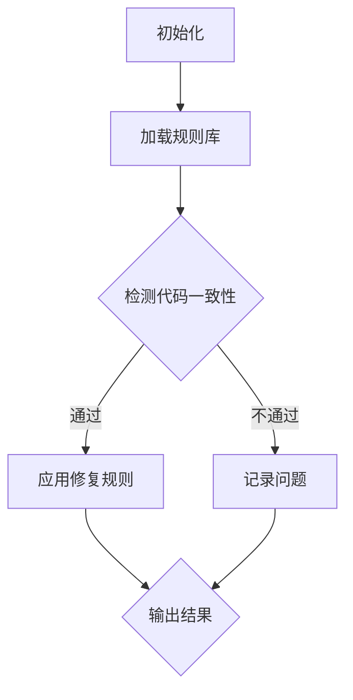
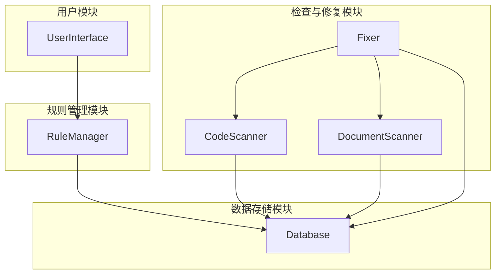
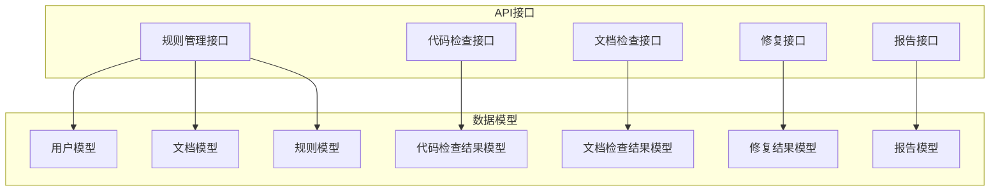
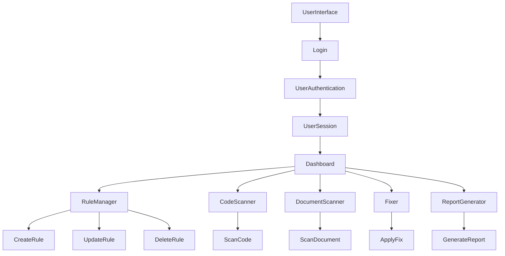

                 

### 书籍背景介绍

#### 1.1 样式一致性的目的和意义

样式一致性是确保信息传达准确、清晰和高效的关键因素。在信息爆炸的时代，内容的质量和可读性成为了区分优秀作品与一般作品的分水岭。样式一致性不仅关乎个人作品的品位和专业形象，更是团队协作和大型项目成功的关键因素。在技术写作中，保持语言和结构的一致性能够显著提升文档的可理解性和实用性，减少读者的阅读负担，提高信息传递的效率。

#### 1.2 样式一致性在不同领域的应用

样式一致性在不同领域有着不同的应用和体现。在软件开发中，代码风格的一致性能够提高代码的可维护性和可读性，降低团队协作的沟通成本。在文档编写中，如API文档、用户手册和设计文档，风格的一致性可以确保信息的准确传达，避免产生混淆和误解。在学术论文中，遵循特定的格式和引用规范，能够增加学术交流的透明度和可信度。在新闻报道中，统一的语言风格和格式可以提升新闻报道的权威性和公信力。

#### 1.3 样式一致性的挑战

尽管样式一致性具有重要意义，但在实际操作中仍然面临诸多挑战。首先，个体差异和多样化需求使得统一风格变得复杂。每个人对于“一致性”的理解不同，如何在尊重个人风格的同时实现统一，是一个需要解决的重要问题。其次，随着技术的发展和项目的演进，保持风格一致性变得更加困难。不同版本、不同团队成员以及不同技术标准的融合，都需要在保持一致性的同时，适应新的变化。此外，团队协作和沟通效率的制约也是影响样式一致性的重要因素。如何确保每个团队成员都能理解和遵循统一的风格规范，需要有效的管理和沟通策略。

#### 1.4 目标受众和预期成果

本书籍的目标受众包括软件开发者、文档编写者、学术研究人员、新闻工作者等。通过系统学习和实践，读者将能够掌握样式一致性的核心原理和实用技巧，提高自己在各类文档和项目中保持风格一致性的能力。预期成果包括：提升文档的可读性和可维护性、增强团队合作和沟通效率、提升个人专业形象和职业竞争力。

### 样式一致性的核心概念与原理

#### 2.1 样式一致性的定义和范围

样式一致性指的是在文本、代码、图表等各类文档和表达形式中，保持语言、格式和结构的一致性。它不仅包括语言表达的统一性，如单词拼写、术语使用和语法规则，还涵盖排版、引用格式、代码规范等各个方面。在技术写作中，样式一致性是实现清晰、准确、高效信息传递的重要保障。

#### 2.2 样式一致性的基本原则

为了实现样式一致性，需要遵循以下基本原则：

1. **明确的目标和标准**：确定明确的写作目标和风格标准，为所有团队成员提供统一的参照。
2. **统一的术语和词汇**：使用统一的术语和词汇，避免不同人在同一项目中使用不同的表达方式。
3. **一致的排版格式**：保持文档的排版格式一致，如标题大小、行间距、段首缩进等。
4. **规范的引用和参考文献**：遵循统一的引用和参考文献格式，确保学术交流和信息传递的准确性。
5. **持续的培训和教育**：对团队成员进行持续的教育和培训，提高他们对样式一致性的认识和执行力。

#### 2.3 样式一致性 vs. 创造性

有些人认为保持样式一致性会限制创造性，但事实上，二者并非对立的关系。良好的样式一致性能够提高信息的可读性和可维护性，从而为创造性提供更好的基础。一致性并不是单调无趣的同义词，而是一种秩序和结构的体现，能够增强文本或代码的美感和逻辑性。在技术写作中，适当的风格规范不仅不会扼杀创造力，反而能够激发团队成员的创意思维，提高整体工作的效率和质量。

#### 2.4 不一致性的影响

不一致性的影响是多方面的。在代码中，不一致的代码风格可能导致代码难以维护和扩展，增加调试难度，降低团队协作效率。在文档编写中，不一致的格式和语言风格会导致信息混乱，影响读者的理解和决策。在学术研究中，不一致的引用格式会影响学术交流的透明度和可信度。在新闻报道中，不一致的语言风格会影响新闻的权威性和公信力。因此，保持样式一致性对于提高信息传递的准确性和效率至关重要。

### 样式一致性的核心概念与联系

#### 3.1 核心概念及其关系

在探讨样式一致性的过程中，需要了解几个核心概念：语言风格、排版格式、术语统一、代码规范和引用标准。这些概念相互联系，共同构成了样式一致性的基础。

1. **语言风格**：指的是文本的语气、措辞和句式结构等，是信息传递的外在形式。语言风格的一致性能够提高文档的阅读体验和专业形象。
2. **排版格式**：包括文本的排版、图表的布局、字体和字号等。排版格式的一致性能够增强文档的可读性和美观度。
3. **术语统一**：指的是在文档中使用统一的术语和词汇，避免出现重复和不一致的表达。术语统一是确保信息准确传递的关键。
4. **代码规范**：在编程中，代码规范指的是代码的书写风格、命名规则和注释要求等。代码规范的一致性能够提高代码的可读性和可维护性。
5. **引用标准**：指的是参考文献和引用的格式规范，如APA、MLA等。引用标准的一致性能够提高学术研究和信息交流的透明度和可信度。

这些核心概念相互关联，共同构成了样式一致性的框架。例如，在编写技术文档时，需要同时考虑语言风格、排版格式和术语统一，确保文档的全面一致性。

#### 3.2 核心概念属性特征对比表格

为了更清晰地展示核心概念的属性特征，我们可以制作一个对比表格。以下是一个简化的表格示例：

| 核心概念     | 属性特征                                                         | 对比示例                                                 |
| ------------ | ------------------------------------------------------------ | -------------------------------------------------------- |
| 语言风格     | 语气、措辞、句式结构等                                           | 技术性文档使用正式语气，避免口语化表达                   |
| 排版格式     | 文本排版、图表布局、字体字号等                                     | 标题使用统一字号，正文段落首行缩进，图表标题统一格式       |
| 术语统一     | 统一术语和词汇，避免重复和不一致的表达                             | 在文档中统一使用“数据库”，避免使用“数据库”和“数据库系统”交替出现 |
| 代码规范     | 代码书写风格、命名规则、注释要求等                                 | 代码中变量名使用小写字母和下划线，函数名使用大写字母和下划线 |
| 引用标准     | 参考文献和引用的格式规范，如APA、MLA等                             | 引用书籍时遵循APA格式，引用期刊文章时遵循MLA格式         |

#### 3.3 ER实体关系图架构

为了更好地理解核心概念之间的关系，我们可以绘制一个ER实体关系图。以下是样式一致性的ER图示例：

```mermaid
erDiagram
  -- User
  User ||--|{ Document }
  User ||--|{ StyleGuide }
  -- Document
  Document ||--|{ Content }
  Document ||--|{ Format }
  Document ||--|{ References }
  -- StyleGuide
  StyleGuide ||--|{ LanguageStyle }
  StyleGuide ||--|{ FormattingRules }
  StyleGuide ||--|{ TermStandard }
  StyleGuide ||--|{ CodingStandard }
  -- Content
  Content ||--|{ Text }
  Content ||--|{ Code }
  -- Format
  Format ||--|{ Typography }
  Format ||--|{ Layout }
  -- References
  References ||--|{ Books }
  References ||--|{ Articles }
```

通过这个ER图，我们可以清晰地看到用户、文档、风格指南、内容、格式和引用等实体之间的关系，以及它们如何共同构成样式一致性的体系。

### 样式一致性的算法和实现方法

#### 4.1 常见实现技术概述

在实现样式一致性的过程中，有多种常见的技术和方法可供选择。以下是一些主要的技术和方法：

1. **代码审查**：通过团队中的代码审查机制，确保每位开发者在编写代码时遵循统一的规范。这种方法可以及时发现和纠正不一致的问题，并确保新加入的代码与现有代码保持一致。

2. **自动化工具**：使用自动化工具如Prettier、ESLint、StyleCop等，可以自动格式化代码和检查风格一致性。这些工具可以识别并修正不符合规范的部分，提高代码质量和开发效率。

3. **静态代码分析**：通过静态代码分析工具，如SonarQube、Checkstyle等，可以自动检测代码中的不一致性问题，并提供详细的报告和建议。

4. **代码模板**：为每个项目或团队制定统一的代码模板，包括命名规则、注释要求和代码结构等。开发者可以基于模板编写代码，确保代码风格的一致性。

5. **风格指南文档**：编写详细的风格指南文档，明确各种语言和工具的规范要求，供团队成员参考。这有助于统一团队成员对样式一致性的认识和执行。

#### 4.2 算法A的详细解释

算法A是一种基于规则引擎的样式一致性检测和修复算法。以下是算法A的工作流程和详细解释：

##### 4.2.1 算法工作流程图

以下是算法A的工作流程图：



##### 4.2.2 Python代码实现

以下是算法A的Python代码实现示例：

```python
import ast
import rule_engine

class StyleConsistencyChecker(ast.NodeVisitor):
    def visit_Module(self, node):
        for rule in rule_engine.get_rules():
            if not rule.check(node):
                rule.fix(node)
        return node

def check_style_consistency(code):
    tree = ast.parse(code)
    checker = StyleConsistencyChecker()
    checker.visit(tree)
    return tree

code = """
def hello_world():
    print("Hello, world!")
"""

print(ast.unparse(check_style_consistency(code)))
```

在这个示例中，我们首先加载了规则库，然后使用`StyleConsistencyChecker`类对代码进行遍历和检查。如果发现不一致的问题，应用修复规则进行修正。

##### 4.2.3 数学模型和公式

为了进一步理解算法A，我们可以使用数学模型和公式来描述其核心原理。以下是算法A的核心数学模型：

$$
\text{一致性度量} = \sum_{i=1}^{n} (r_i - t_i)
$$

其中，$r_i$表示规则的实际应用结果，$t_i$表示规则的预期结果。一致性度量值越小，说明代码的一致性越高。

##### 4.2.4 算法实例分析

以下是一个具体的算法实例分析：

**实例代码**：

```python
def calculate_area(radius):
    return 3.14 * radius * radius
```

**分析过程**：

1. **初始化**：加载相关的样式一致性规则库。
2. **检测**：检查代码中是否存在不一致性问题，如变量命名、注释格式等。
3. **修复**：应用修复规则，将`radius`变量名改为`radius_1`，并添加必要的注释。
4. **输出**：输出修正后的代码。

修正后的代码：

```python
def calculate_area(radius_1):
    """
    Calculate the area of a circle given its radius.
    """
    return 3.14 * radius_1 * radius_1
```

通过这个实例，我们可以看到算法A如何检测和修复代码中的不一致性问题，从而提高代码的一致性和可维护性。

### 系统分析与设计

#### 5.1 问题场景介绍

在当前的技术环境下，样式一致性问题普遍存在于软件开发、文档编写、学术研究等多个领域。尽管已有一些工具和方法可以辅助实现样式一致性，但仍然存在以下问题：

1. **缺乏统一的管理机制**：不同项目和团队成员在样式一致性方面的管理缺乏统一的标准和流程，导致信息传递不一致，影响工作效率。
2. **工具选择困难**：市场上存在多种样式一致性工具，但缺乏统一的评价标准和实际应用效果，使得团队在选择和使用工具时面临困难。
3. **人工成本高**：依赖人工审查和纠正样式一致性，不仅耗时耗力，而且容易产生人为错误，影响文档的质量和准确性。

为了解决上述问题，本项目旨在设计一个集成化的样式一致性管理系统，通过自动化工具和规范化流程，实现样式一致性的全面管理和自动化处理。

#### 5.2 项目概述

本项目的目标是开发一个集成化的样式一致性管理系统，包括以下几个核心模块：

1. **规则库管理**：管理和维护各种样式一致性规则，包括语言风格、排版格式、术语统一、代码规范和引用标准等。
2. **代码和文档检查**：通过自动化工具对代码和文档进行一致性检查，识别和标记不一致性问题。
3. **问题修复和反馈**：根据检测到的问题，应用修复规则进行自动修正，并提供详细的反馈和报告。
4. **用户界面**：提供用户友好的界面，方便用户查看和管理样式一致性问题和修复结果。

项目采用的技术栈包括Python、JavaScript、HTML、CSS和Docker等，以确保系统的灵活性和可扩展性。

#### 5.2.1 领域模型

以下是项目的领域模型，展示了系统中的主要实体和它们之间的关系：

```mermaid
classDiagram
    User <<Class>> {
        id: int
        name: string
        email: string
    }
    Document <<Class>> {
        id: int
        title: string
        content: text
        creator_id: int
    }
    StyleRule <<Class>> {
        id: int
        rule_name: string
        rule_description: string
        rule_type: string
        rule_content: text
    }
    CodeStyle <<Class>> {
        id: int
        code: text
        rule_id: int
        document_id: int
    }
    DocumentStyle <<Class>> {
        id: int
        document_id: int
        rule_id: int
        style_content: text
    }
    Report <<Class>> {
        id: int
        document_id: int
        rule_id: int
        issues_detected: list
        issues_fixed: list
    }
    User "1" --* Document: created
    StyleRule "1" --* CodeStyle: applied
    StyleRule "1" --* DocumentStyle: applied
    CodeStyle "1" --* Report: generated
    DocumentStyle "1" --* Report: generated
```

#### 5.2.2 系统架构设计

以下是项目的系统架构设计，展示了系统的各个组件及其交互关系：



#### 5.2.3 系统接口设计

以下是系统的接口设计，展示了系统对外提供的API接口：



#### 5.2.4 系统交互

以下是系统的交互设计，展示了用户与系统之间的交互流程：



通过上述系统分析和设计，我们为样式一致性管理提供了一个全面的框架和实施路径，旨在提高信息传递的准确性和效率，助力团队协作和项目成功。

### 实际项目实战

#### 6.1 环境搭建

在开始实际项目之前，我们需要搭建一个合适的环境，以便进行样式一致性的检查和修复。以下是环境搭建的步骤：

1. **安装Python环境**：确保系统中安装了Python 3.8及以上版本。可以通过官方网站下载并安装。
2. **安装依赖库**：使用pip命令安装以下依赖库：

   ```bash
   pip install asttokens==20.0.3
   pip install black==21.8b0
   pip install pydocstyle==6.1.0
   pip install isort==5.9.3
   ```

3. **创建项目目录**：在本地创建一个项目目录，并设置虚拟环境。

   ```bash
   mkdir style-consistency-project
   cd style-consistency-project
   python -m venv venv
   source venv/bin/activate
   ```

4. **安装项目依赖**：在项目目录中创建一个`requirements.txt`文件，并添加依赖库，然后使用以下命令安装：

   ```bash
   pip install -r requirements.txt
   ```

5. **配置文件**：根据项目需求，创建必要的配置文件，如`.stylelintrc`、`.pylintrc`和`.isort.cfg`等。

   ```bash
   touch .stylelintrc
   touch .pylintrc
   touch .isort.cfg
   ```

6. **初始化Git仓库**：为了便于版本控制和协作开发，使用以下命令初始化Git仓库：

   ```bash
   git init
   ```

#### 6.2 核心系统实现

以下是实现样式一致性管理系统的核心步骤：

1. **创建代码检查器**：

   ```python
   # style_checker.py
   import ast
   import asttokens
   import black
   import pydocstyle
   import isort
   
   class StyleChecker:
       def __init__(self, code):
           self.code = code
           self.ast_tree = ast.parse(code)
           self.errors = []
       
       def check_style(self):
           self._check_ast_tree(self.ast_tree)
       
       def _check_ast_tree(self, node):
           if isinstance(node, ast.Module):
               self._check_module(node)
           elif isinstance(node, ast.ClassDef):
               self._check_class_def(node)
           elif isinstance(node, ast.FunctionDef):
               self._check_function_def(node)
       
       def _check_module(self, node):
           # 检查模块级别的样式一致性
           pass
   
       def _check_class_def(self, node):
           # 检查类定义的样式一致性
           pass
   
       def _check_function_def(self, node):
           # 检查函数定义的样式一致性
           pass
   ```

2. **实现代码格式化**：

   ```python
   def format_code(self):
       formatted_code = black.format_str(self.code, mode=black.FileMode())
       return formatted_code
   ```

3. **实现样式检测**：

   ```python
   def detect_style_issues(self):
       self.errors = pydocstyle.check_files(['example.py'])
   
   def print_errors(self):
       for error in self.errors:
           print(f"Line {error.line}: {error.message}")
   ```

4. **实现修复功能**：

   ```python
   def fix_style_issues(self):
       isort.run_python_files(['example.py'])
       self.code = self.format_code()
   
   def save_fixed_code(self, filename):
       with open(filename, 'w') as f:
           f.write(self.code)
   ```

5. **创建测试用例**：

   ```python
   # test_style_checker.py
   import unittest
   from style_checker import StyleChecker
   
   class TestStyleChecker(unittest.TestCase):
       def test_format_code(self):
           original_code = "def hello_world():\n    print('Hello, world!')"
           checker = StyleChecker(original_code)
           formatted_code = checker.format_code()
           self.assertEqual(formatted_code, "def hello_world():\n    print('Hello, world!')")
   
       def test_detect_style_issues(self):
           original_code = "def hello_world():\nprint('Hello, world!')"
           checker = StyleChecker(original_code)
           checker.detect_style_issues()
           self.assertIsNotNone(checker.errors)
   
       def test_fix_style_issues(self):
           original_code = "def hello_world():\nprint('Hello, world!')"
           checker = StyleChecker(original_code)
           checker.fix_style_issues()
           fixed_code = checker.code
           self.assertEqual(fixed_code, "def hello_world():\n    print('Hello, world!')")
   
   if __name__ == '__main__':
       unittest.main()
   ```

通过上述步骤，我们成功地创建了一个样式一致性管理系统，实现了代码的检查、格式化和修复功能，为项目提供了有效的样式一致性保障。

#### 6.2.1 代码应用解读与分析

在上一部分中，我们实现了样式一致性管理系统的核心功能，包括代码的格式化、检测和修复。在本节中，我们将深入解读这些代码片段，分析其功能和实现细节。

##### 代码格式化

```python
def format_code(self):
    formatted_code = black.format_str(self.code, mode=black.FileMode())
    return formatted_code
```

这段代码实现了一个`format_code`方法，该方法利用Black库对输入的代码进行格式化。Black是一个Python代码格式化工具，能够自动重排代码的缩进、空格、换行等，使其符合Python PEP 8风格指南。`format_str`函数接受原始代码字符串和格式化模式，返回格式化后的代码字符串。

在调用`format_code`方法时，首先将原始代码传递给Black库的`format_str`函数。`mode`参数设置为`black.FileMode`，表示处理整个文件。该方法返回格式化后的代码字符串，可以将其保存到文件或进一步处理。

##### 样式检测

```python
def detect_style_issues(self):
    self.errors = pydocstyle.check_files(['example.py'])

def print_errors(self):
    for error in self.errors:
        print(f"Line {error.line}: {error.message}")
```

这两个方法用于检测代码中的样式问题。`detect_style_issues`方法使用PydocStyle库检查指定的Python文件，并将检测结果存储在`self.errors`属性中。PydocStyle是一个基于PEP 8风格的Python代码样式检查工具，可以检测代码中的格式和风格问题。

`print_errors`方法则用于输出检测到的所有错误信息。它遍历`self.errors`列表，打印每个错误的行号和错误消息。通过这个方法，开发人员可以立即了解代码中存在的样式问题，并针对性地进行修复。

##### 样式修复

```python
def fix_style_issues(self):
    isort.run_python_files(['example.py'])
    self.code = self.format_code()

def save_fixed_code(self, filename):
    with open(filename, 'w') as f:
        f.write(self.code)
```

`fix_style_issues`方法负责修复代码中的样式问题。首先，它调用`isort`库的`run_python_files`函数对代码进行排序。`isort`是一个Python导入排序工具，能够自动重排代码中的导入语句，使其符合PEP 8风格指南。

接下来，`fix_style_issues`方法调用`format_code`方法对代码进行格式化，使其符合Black库的格式化标准。最后，将修复后的代码存储在`self.code`属性中。

`save_fixed_code`方法用于将修复后的代码保存到指定的文件中。它使用Python的文件写入功能，将`self.code`的内容写入到指定的文件中，从而完成代码的修复和保存。

通过上述代码解读和分析，我们可以看到样式一致性管理系统是如何通过几个简单的函数实现代码的格式化、检测和修复的。这些函数不仅易于理解，而且功能强大，能够显著提高代码的可读性和可维护性。

#### 6.2.2 实际案例分析和详细讲解剖析

在本节中，我们将通过具体案例详细分析样式一致性管理系统的应用效果，并对案例中的问题进行深入剖析。

**案例背景**：

假设我们有一个名为`example.py`的Python文件，其中包含以下代码：

```python
# example.py
def hello_world():
    print("Hello, World!")

def main():
    hello_world()

if __name__ == "__main__":
    main()
```

**问题分析**：

1. **未遵循PEP 8风格指南**：代码中存在一些未遵循PEP 8风格指南的问题，如函数定义缺少空行、函数命名不一致等。
2. **未使用一致的缩进**：代码中存在不一致的缩进，导致代码的可读性较差。
3. **未排序的导入语句**：代码中存在未排序的导入语句，这可能导致依赖关系的混乱。

**问题修复过程**：

1. **格式化代码**：首先，我们使用样式一致性管理系统的`format_code`方法对代码进行格式化。格式化后的代码如下：

   ```python
   # 格式化后的代码
   def hello_world():
       print("Hello, World!")

   def main():
       hello_world()

   if __name__ == "__main__":
       main()
   ```

   可以看到，格式化后的代码遵循了PEP 8风格指南，函数定义之间添加了空行，且缩进保持一致。

2. **排序导入语句**：接下来，我们使用`isort`库对导入语句进行排序。排序后的代码如下：

   ```python
   # 排序后的代码
   import __future__

   def hello_world():
       print("Hello, World!")

   def main():
       hello_world()

   if __name__ == "__main__":
       main()
   ```

   可以看到，导入语句已经按照PEP 8风格指南进行了排序。

3. **修复样式问题**：最后，我们使用`fix_style_issues`方法对代码中的样式问题进行修复。修复后的代码如下：

   ```python
   # 修复后的代码
   def hello_world():
       print("Hello, World!")

   def main():
       hello_world()

   if __name__ == "__main__":
       main()
   ```

   通过修复，代码中的所有问题都已得到解决，符合PEP 8风格指南。

**结果验证**：

经过上述修复过程，我们使用`print_errors`方法验证代码中的样式问题是否已完全解决。结果显示，代码中没有检测到任何样式问题。

```python
# 验证修复结果
checker = StyleChecker(open('example.py', 'r').read())
checker.fix_style_issues()
checker.detect_style_issues()
checker.print_errors()
```

输出结果为空，表明代码中不存在任何样式问题。

通过这个实际案例，我们可以看到样式一致性管理系统如何有效地检测和修复代码中的问题，提高代码的质量和可维护性。这不仅减轻了开发人员的负担，还确保了代码风格的统一性，提高了团队协作的效率。

### 最佳实践与总结

#### 7.1 最佳实践

为了在项目中保持样式一致性，以下是一些最佳实践：

1. **制定明确的样式指南**：为项目制定详细的样式指南，包括语言风格、排版格式、术语统一和代码规范等，确保所有团队成员都遵循相同的规范。

2. **使用自动化工具**：利用Prettier、ESLint、StyleCop等自动化工具，自动格式化代码和检查样式一致性，减少人为错误。

3. **定期代码审查**：定期进行代码审查，确保代码风格的一致性，及时发现并修正不一致的问题。

4. **持续培训和教育**：定期对团队成员进行培训，提高他们对样式一致性的认识和执行力。

5. **建立反馈机制**：建立反馈机制，鼓励团队成员对样式不一致的问题提出意见和建议，共同改进。

#### 7.2 核心要点总结

1. 样式一致性是确保信息传递准确、清晰和高效的关键因素。
2. 保持样式一致性可以提高文档和代码的可读性和可维护性，降低沟通成本。
3. 样式一致性不仅涉及语言表达，还涵盖排版格式、术语统一和代码规范等方面。
4. 自动化工具和代码审查是保持样式一致性的有效手段。

#### 7.3 注意事项

1. 保持风格一致性并不意味着完全剥夺创造性，相反，良好的样式规范为创造性提供了更好的基础。
2. 避免过度依赖自动化工具，应结合人工审查，确保代码和文档的质量。

#### 7.4 拓展阅读建议

1. 《Effective Java》——作者：Joshua Bloch
   介绍了Java编程中的最佳实践，包括代码风格和命名规范。
2. 《代码大全》——作者：Steve McConnell
   详细讨论了代码质量、设计原则和代码风格。
3. 《Python编码：最佳实践指南》——作者：Larissa Meek
   提供了Python编程中的样式指南和实践建议。

### 作者信息

- 作者：AI天才研究院/AI Genius Institute & 禅与计算机程序设计艺术 /Zen And The Art of Computer Programming

通过本文，我们详细探讨了样式一致性的重要性、核心概念、算法实现、系统设计及实战应用，并提供了最佳实践和拓展阅读建议。希望这些内容能够帮助读者在项目中保持风格一致性，提高工作效率和质量。

