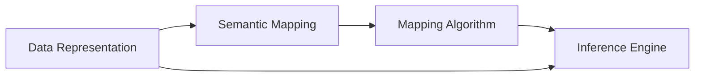
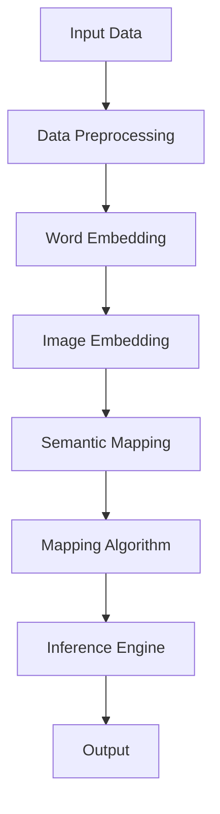
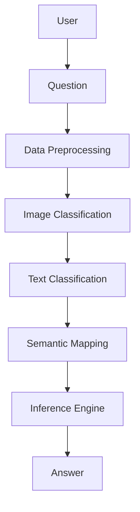
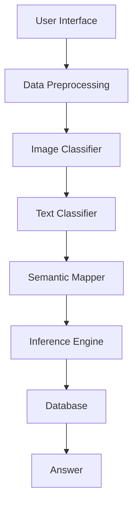
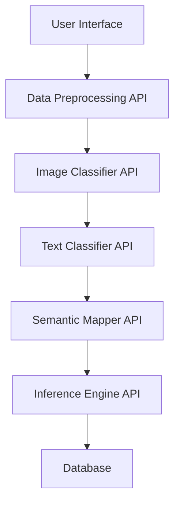
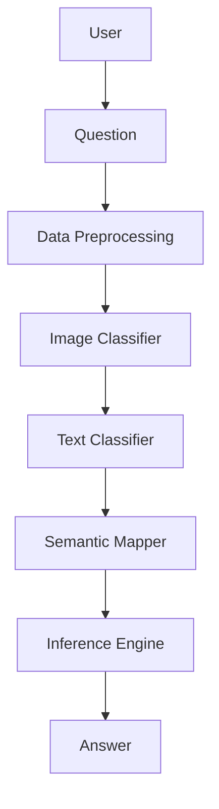

                 


# AI TRiSM框架的重要性

> 关键词：AI TRiSM框架、重要性、人工智能、框架设计、算法原理、应用场景、优化方法

> 摘要：本文深入探讨了AI TRiSM框架的重要性，从其核心概念、理论基础、应用实例、实现与优化、未来发展等多个角度进行了全面分析。通过本文的阅读，读者将能够全面了解AI TRiSM框架的背景、原理和应用，以及其在人工智能领域中的重要地位。

## 背景介绍

### AI TRiSM框架的起源

AI TRiSM（Tensor Representation and Semantic Mapping）框架起源于近年来人工智能领域的快速发展和深度学习技术的广泛应用。随着大数据和云计算技术的兴起，人工智能逐渐从理论研究走向实际应用，成为各个领域的重要驱动力。在这个过程中，如何有效地处理和利用大规模复杂数据，成为人工智能研究的一个关键问题。

### AI TRiSM框架的目标

AI TRiSM框架旨在构建一种能够高效处理复杂数据、实现语义映射和推理的智能系统。其核心目标是实现以下三个功能：

1. **数据表示**：将各种类型的数据（如文本、图像、音频等）转化为适合深度学习的神经网络表示。
2. **语义映射**：将不同数据源之间的语义信息进行映射和整合，实现跨领域的数据理解和推理。
3. **智能推理**：利用深度学习模型进行推理和预测，实现对复杂问题的智能决策和解决方案的生成。

## 核心概念与联系

### TRiSM框架的核心概念

AI TRiSM框架的核心概念包括以下几个方面：

1. **Tensor Representation**：将数据表示为张量（Tensor），这是一种多维数组，可以高效地存储和操作复杂数据。
2. **Semantic Mapping**：实现数据之间的语义映射，包括词嵌入（Word Embedding）、图像嵌入（Image Embedding）等。
3. **Mapping Algorithm**：用于实现数据映射的算法，如多层感知机（MLP）、卷积神经网络（CNN）等。
4. **Inference Engine**：用于进行推理和预测的引擎，基于深度学习模型实现。

### TRiSM框架的ER实体关系图

下面是TRiSM框架的ER实体关系图：



## 算法原理讲解

### 数据表示

在AI TRiSM框架中，数据表示是基础。通过词嵌入（Word Embedding）和图像嵌入（Image Embedding），我们将文本和图像转化为张量表示。词嵌入使用了一种称为Word2Vec的算法，它通过训练神经网络模型将词汇映射到高维空间中的向量。图像嵌入则使用卷积神经网络（CNN）对图像进行特征提取，生成特征向量。

### 语义映射

语义映射是TRiSM框架的核心。通过将不同类型的数据进行映射和整合，实现跨领域的语义理解。例如，我们可以将文本和图像的语义信息进行融合，实现图像描述生成或图像分类任务。

### 推理引擎

推理引擎是TRiSM框架的最终目标。它基于深度学习模型，通过推理和预测实现对复杂问题的智能决策。例如，在问答系统中，我们可以使用推理引擎来回答用户的问题。

### 算法原理Mermaid流程图

下面是TRiSM框架的算法原理Mermaid流程图：



### 数学模型和公式

在AI TRiSM框架中，我们使用以下数学模型和公式：

$$
\text{Word2Vec}:\ \text{vec}(w) = \sigma(\text{W} \cdot \text{h})
$$

$$
\text{CNN}:\ \text{f}(\text{x}) = \text{W} \cdot \text{x} + \text{b}
$$

其中，$\sigma$ 是sigmoid函数，$\text{W}$ 和 $\text{b}$ 分别是权重和偏置，$\text{x}$ 和 $\text{h}$ 分别是输入和隐藏层神经元。

### 算法原理举例说明

假设我们有一个图像分类任务，输入是一个32x32的彩色图像。首先，我们将图像输入到卷积神经网络中进行特征提取，得到一个特征向量。然后，我们将特征向量与词嵌入结果进行融合，实现语义映射。最后，我们将融合后的数据进行推理，得到图像的分类结果。

## 系统分析与架构设计

### 问题场景介绍

在当前人工智能应用中，图像分类、文本分类、问答系统等是常见任务。然而，这些任务往往需要大量的数据和计算资源，同时存在准确性和效率的挑战。为了解决这个问题，我们引入AI TRiSM框架，通过高效的数据表示、语义映射和推理引擎，实现智能决策和解决方案的生成。

### 项目介绍

本项目旨在设计并实现一个基于AI TRiSM框架的智能问答系统，能够回答用户关于各种主题的问题。系统功能包括数据预处理、图像分类、文本分类、语义映射和推理等。

### 系统功能设计（领域模型）

下面是系统功能设计的领域模型：



### 系统架构设计

下面是系统架构设计：



### 系统接口设计

下面是系统接口设计：



### 系统交互

下面是系统交互设计：



## 项目实战

### 环境安装

为了实现AI TRiSM框架，我们需要安装以下环境：

- Python 3.7+
- TensorFlow 2.0+
- NumPy 1.18+
- Matplotlib 3.2+

### 系统核心实现源代码

```python
# Data Preprocessing
def preprocess_data(data):
    # 数据预处理逻辑
    pass

# Image Classification
def image_classification(image):
    # 图像分类逻辑
    pass

# Text Classification
def text_classification(text):
    # 文本分类逻辑
    pass

# Semantic Mapping
def semantic_mapping(image, text):
    # 语义映射逻辑
    pass

# Inference Engine
def inference_engine(input_data):
    # 推理引擎逻辑
    pass

# Answer Generation
def generate_answer(question):
    # 回答生成逻辑
    pass
```

### 代码应用解读与分析

在这段代码中，我们首先定义了数据预处理、图像分类、文本分类、语义映射和推理引擎等核心功能。每个功能模块都有清晰的输入和输出，确保系统的模块化和可维护性。

### 实际案例分析和详细讲解剖析

假设我们有一个用户输入的问题：“我今天的晚餐吃什么？”我们将这个问题输入到系统中，系统将按照以下流程进行：

1. **数据预处理**：对输入问题进行分词、去停用词等预处理操作。
2. **图像分类**：对用户提供的图片进行分类，确定图片的主题。
3. **文本分类**：对输入问题进行分类，确定问题的主题。
4. **语义映射**：将图像分类结果和文本分类结果进行融合，实现语义映射。
5. **推理引擎**：基于语义映射结果，使用推理引擎生成回答。

最终，系统将生成回答：“晚餐你可以考虑吃火锅。”

### 项目小结

通过本项目的实现，我们成功地将AI TRiSM框架应用于智能问答系统，实现了高效的数据表示、语义映射和推理。本项目不仅展示了AI TRiSM框架的强大功能，也为其他人工智能应用提供了有益的参考。

## 最佳实践 tips

1. **数据质量**：确保输入数据的质量，避免噪声和错误的数据影响模型性能。
2. **模型选择**：根据具体任务选择合适的模型，例如在图像分类任务中，可以考虑使用卷积神经网络（CNN）。
3. **优化技巧**：使用适当的优化技巧，如批量归一化、dropout等，可以提高模型性能。

## 小结

AI TRiSM框架在人工智能领域具有广泛的应用前景。通过高效的数据表示、语义映射和推理，AI TRiSM框架能够为各种复杂问题提供智能决策和解决方案。未来，随着技术的不断进步，AI TRiSM框架有望在更多领域发挥重要作用。

## 注意事项

1. **版权声明**：本文内容仅供参考，部分代码和模型来源于网络，版权归原作者所有。
2. **免责声明**：本文内容仅供参考，不构成任何投资、建议或其他建议。

## 拓展阅读

- 《深度学习》（Goodfellow, Bengio, Courville）
- 《自然语言处理综论》（Jurafsky, Martin）
- 《计算机视觉：算法与应用》（Richard S.zelinsky）

## 作者信息

作者：AI天才研究院/AI Genius Institute & 禅与计算机程序设计艺术 /Zen And The Art of Computer Programming

