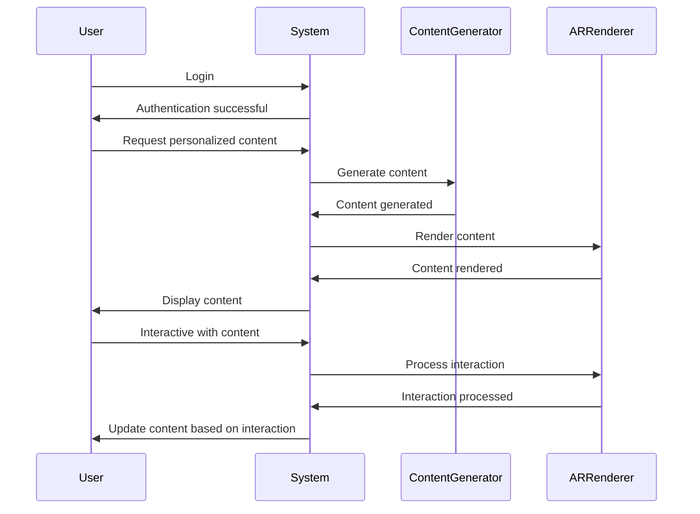

                 

### 文章标题

# AIGC与增强现实（AR）在教育中的融合

关键词：AIGC、增强现实（AR）、教育融合、技术原理、应用案例

摘要：本文旨在探讨人工智能生成内容（AIGC）与增强现实（AR）技术在教育领域的融合，通过详细分析两者的背景、核心概念、技术原理及其在教育中的应用，揭示AIGC与AR技术融合的优势和面临的挑战，为未来的教育技术发展提供新思路。

---

### 背景介绍

#### 1.1 AIGC技术概述

**AIGC的概念**：

人工智能生成内容（AI-Generated Content，简称AIGC）是一种基于人工智能技术，特别是深度学习和自然语言处理（NLP）的技术。它通过算法自动生成文本、图像、音频、视频等多种形式的内容，广泛应用于内容创作、媒体制作、教育等领域。

**AIGC的发展历程**：

AIGC技术的发展可以追溯到20世纪80年代，随着机器学习和深度学习的兴起，AIGC技术在21世纪得到了快速发展。特别是在2017年后，随着生成对抗网络（GAN）和Transformer模型的提出，AIGC技术取得了重大突破，其应用场景和应用范围逐渐扩大。

**AIGC在教育中的重要性**：

AIGC技术在教育中的应用具有显著的优势。首先，它可以个性化地生成教学内容，满足不同学生的需求。其次，AIGC可以自动生成教学素材，如图片、视频等，提高教学效果。最后，AIGC可以帮助教师减轻工作负担，提高教学效率。

#### 1.2 增强现实（AR）技术概述

**AR技术的定义**：

增强现实（Augmented Reality，简称AR）是一种通过计算机技术模拟和增强现实世界的技术。它将虚拟信息与现实世界中的实体进行叠加，使用户能够实时感知和交互。

**AR技术的发展历程**：

AR技术的发展可以追溯到20世纪60年代，随着计算机技术和显示技术的进步，AR技术逐渐走向成熟。近年来，随着移动设备和传感技术的进步，AR技术在消费电子、游戏娱乐、医疗健康、教育等领域得到了广泛应用。

**AR技术在教育中的应用潜力**：

AR技术在教育中的应用潜力巨大。它可以通过虚拟现实的手段，将抽象的知识点具象化，提高学生的理解能力。同时，AR技术可以为学生提供沉浸式的学习体验，提高学习兴趣和参与度。

#### 1.3 AIGC与AR技术的融合趋势

**融合背景**：

随着AIGC和AR技术的不断发展，两者在教育领域的融合逐渐成为一种趋势。AIGC可以为AR技术提供丰富的内容生成能力，而AR技术则可以为AIGC提供更直观、互动的学习体验。

**融合优势**：

AIGC与AR技术的融合具有以下优势：

1. **个性化学习**：AIGC可以根据学生的兴趣和学习进度，生成个性化的学习内容，AR技术则可以提供沉浸式的学习体验，两者结合可以实现真正的个性化学习。
2. **提高学习效果**：AIGC生成的教学素材可以更加生动、直观，AR技术则可以提供互动性的学习环境，两者结合可以显著提高学生的学习效果。
3. **减轻教师负担**：AIGC可以自动生成教学素材，AR技术可以为学生提供互动性的学习体验，两者结合可以减轻教师的工作负担，提高教学效率。

**融合面临的挑战**：

虽然AIGC与AR技术的融合具有巨大的潜力，但同时也面临着一些挑战：

1. **技术门槛**：AIGC和AR技术都涉及到复杂的算法和硬件设备，对于技术人员的专业水平要求较高。
2. **内容质量控制**：AIGC生成的教学素材需要确保其质量和准确性，这需要严格的内容审核机制。
3. **成本问题**：AIGC和AR技术的应用需要大量的硬件设备和软件支持，成本较高，对于学校的经费预算提出了挑战。

### 总结

AIGC与AR技术的融合为教育领域带来了新的发展机遇。通过本文的探讨，我们可以看到，AIGC与AR技术的融合不仅具有巨大的潜力，也面临着一些挑战。未来的发展需要进一步优化技术，降低成本，提高内容质量，以实现AIGC与AR技术在教育中的广泛应用。

---

### 核心概念与联系

#### 2.1 AIGC技术核心概念

**自动生成内容（AIGC）**：

自动生成内容（AI-Generated Content，简称AIGC）是指利用人工智能技术，特别是深度学习和自然语言处理（NLP），自动生成文本、图像、音频、视频等多种形式的内容。

**自然语言处理（NLP）**：

自然语言处理（Natural Language Processing，简称NLP）是人工智能的一个重要分支，旨在让计算机理解和处理人类语言。NLP技术包括词法分析、句法分析、语义分析、情感分析等。

**计算机视觉（CV）**：

计算机视觉（Computer Vision，简称CV）是人工智能的另一个重要分支，旨在使计算机能够“看”懂图像和视频。CV技术包括图像识别、目标检测、人脸识别等。

**AIGC技术组成与关系**：

AIGC技术由自动生成内容（AIGC）、自然语言处理（NLP）和计算机视觉（CV）三个核心组成部分构成。NLP负责处理文本生成，CV负责处理图像和视频生成，AIGC则是两者的融合，实现多种形式的内容生成。

#### 2.2 增强现实（AR）技术核心概念

**AR技术基础**：

增强现实（Augmented Reality，简称AR）是一种通过计算机技术模拟和增强现实世界的技术。它将虚拟信息与现实世界中的实体进行叠加，使用户能够实时感知和交互。

**AR硬件与软件**：

AR技术涉及硬件和软件两个方面。硬件包括AR眼镜、智能手机、平板电脑等，软件则包括AR应用开发工具、内容创建平台等。

**AR在教育中的应用**：

AR技术在教育中的应用非常广泛，包括历史教学、科学实验、艺术教育等领域。通过AR技术，学生可以更加直观地理解抽象的知识点，提高学习兴趣和参与度。

#### 2.3 AIGC与AR技术的联系

**融合方式**：

AIGC与AR技术的融合可以通过多种方式实现。一种方式是AIGC生成教学内容，AR技术则将教学内容与现实世界中的实体进行叠加。另一种方式是AIGC生成交互式学习内容，AR技术则为学生提供沉浸式的学习体验。

**关键技术融合**：

AIGC与AR技术的融合关键在于自然语言处理（NLP）和计算机视觉（CV）的结合。NLP可以用于生成文本和语音，CV可以用于图像和视频的处理。两者的结合可以实现多种形式的内容生成和交互。

**应用实例分析**：

一个典型的应用实例是AR教科书。通过AIGC技术，可以自动生成与教材内容相关的文本、图像、视频等素材，AR技术则将这些素材叠加在现实世界中的书本上，实现交互式的学习体验。

### 总结

AIGC与AR技术的融合不仅在于技术的结合，更在于教学理念的创新。通过本文的探讨，我们可以看到，AIGC与AR技术的融合具有巨大的潜力，可以为教育领域带来深刻的变革。

---

### 技术原理讲解

#### 3.1 AIGC技术原理

**自动生成内容的原理**：

AIGC技术主要通过深度学习和自然语言处理（NLP）实现自动生成内容。深度学习模型（如生成对抗网络GAN、Transformer）通过大量的数据训练，可以学习到数据生成的能力。NLP技术则用于处理文本生成、语音合成等任务。

**自然语言处理的原理**：

NLP技术主要包括词法分析、句法分析、语义分析和情感分析。词法分析是将文本分解为单词和短语，句法分析是构建句子的语法结构，语义分析是理解句子的含义，情感分析是分析文本的情感倾向。

**计算机视觉的原理**：

计算机视觉（CV）技术主要包括图像识别、目标检测、人脸识别等。图像识别是通过算法识别图像中的对象，目标检测是定位图像中的对象位置，人脸识别是识别图像中的人脸。

**AIGC的数学模型和算法**：

AIGC的数学模型主要基于深度学习，包括生成对抗网络GAN和Transformer等。GAN由生成器和判别器组成，生成器生成数据，判别器判断数据的真实性。Transformer模型则基于自注意力机制，可以处理长文本的生成。

#### 3.2 AR技术原理

**AR技术的工作原理**：

AR技术主要通过摄像头捕捉现实世界的图像，然后通过计算机处理，将虚拟信息叠加在现实世界中。AR技术涉及的关键技术包括图像识别、图像处理、图像渲染等。

**AR内容创建与渲染**：

AR内容创建主要涉及3D建模、动画制作等。渲染技术则用于将虚拟信息以逼真的方式叠加在现实世界中。

**AR技术中的传感器与追踪**：

AR技术中的传感器主要包括摄像头、GPS、加速度计等。这些传感器用于捕捉现实世界的图像和位置信息，以便实现虚拟信息的叠加。

**AR的数学模型和算法**：

AR的数学模型主要涉及图像识别和目标检测。图像识别算法（如卷积神经网络CNN）用于识别现实世界中的对象，目标检测算法（如YOLO、SSD）用于定位对象的准确位置。

#### 3.3 AIGC与AR技术的融合原理

**融合方法的比较**：

AIGC与AR技术的融合方法主要包括内容生成与叠加、交互式内容生成等。内容生成与叠加是将AIGC生成的教学内容通过AR技术叠加在现实世界中，交互式内容生成则是通过AIGC和AR技术的结合，实现用户与虚拟内容的实时交互。

**融合技术的实现流程**：

实现AIGC与AR技术的融合需要以下步骤：

1. **数据收集**：收集与教学内容相关的数据，包括文本、图像、视频等。
2. **内容生成**：使用AIGC技术生成与数据相关的内容，如文本、图像、视频等。
3. **内容叠加**：使用AR技术将生成的虚拟内容叠加在现实世界中。
4. **用户交互**：通过AR技术实现用户与虚拟内容的交互。

**融合技术的数学模型和算法**：

AIGC与AR技术的融合涉及多个数学模型和算法。在AIGC方面，包括生成对抗网络GAN、Transformer等；在AR方面，包括卷积神经网络CNN、目标检测算法YOLO等。这些模型和算法的结合，可以实现AIGC与AR技术的深度融合。

### 总结

AIGC与AR技术的融合不仅需要技术上的结合，还需要对教学过程进行重新设计。通过本文的探讨，我们可以看到，AIGC与AR技术的融合具有巨大的潜力，可以为教育领域带来深刻的变革。

---

### 教育应用案例

#### 4.1 AIGC在教育中的应用案例

**AIGC在个性化教学中的应用**：

AIGC可以通过分析学生的学习数据，生成个性化的学习内容。例如，对于某个学生，AIGC可以生成与其学习进度和兴趣相关的习题和解析，帮助学生巩固知识。

**AIGC在语言学习中的应用**：

AIGC可以自动生成语言学习材料，如对话、文章、听力材料等。通过AR技术，这些材料可以以虚拟的形式展示给学生，提高学习的趣味性和互动性。

**AIGC在编程教育中的应用**：

AIGC可以生成编程学习材料，如代码示例、算法讲解、编程挑战等。AR技术可以将这些材料以三维的形式展示给学生，帮助他们更好地理解编程概念。

#### 4.2 AR在教育中的应用案例

**AR在历史教学中的应用**：

AR技术可以将历史事件、人物和地点以虚拟的形式呈现给学生，帮助学生更好地理解历史。例如，在历史课堂上，学生可以通过AR设备看到历史事件的现场情景。

**AR在科学实验中的应用**：

AR技术可以为学生提供虚拟实验环境，帮助他们进行科学探究。例如，在物理课上，学生可以通过AR设备进行虚拟实验，观察物理现象。

**AR在艺术教育中的应用**：

AR技术可以为学生提供虚拟的艺术创作工具，帮助他们进行艺术创作。例如，在美术课上，学生可以通过AR设备进行虚拟绘画、雕塑等艺术创作。

#### 4.3 AIGC与AR融合案例

**融合案例介绍**：

一个典型的融合案例是“虚拟历史课堂”。在这个案例中，AIGC技术用于生成与历史事件相关的文本、图像和视频，AR技术则将这些内容以虚拟的形式叠加在现实世界中的历史场景上，学生通过AR设备可以看到历史事件的现场情景。

**融合案例的实现方法**：

实现“虚拟历史课堂”需要以下步骤：

1. **数据收集**：收集与历史事件相关的数据，包括文本、图像、视频等。
2. **内容生成**：使用AIGC技术生成与数据相关的内容，如文本、图像、视频等。
3. **内容叠加**：使用AR技术将生成的虚拟内容叠加在现实世界中的历史场景上。
4. **用户交互**：通过AR技术实现用户与虚拟内容的交互。

**融合案例的效果分析**：

通过“虚拟历史课堂”的实践，学生可以更加直观地了解历史事件，提高学习兴趣和参与度。同时，教师也可以通过AR技术更有效地传授历史知识，提高教学效果。

### 总结

AIGC与AR技术在教育中的应用案例展示了它们在个性化教学、语言学习、编程教育、历史教学、科学实验、艺术教育等方面的潜力。通过这些案例，我们可以看到，AIGC与AR技术的融合为教育带来了新的机遇和挑战。

---

### 系统架构设计

#### 5.1 教育系统需求分析

**系统目标**：

设计一个基于AIGC与AR技术的教育系统，实现个性化教学、交互式学习、沉浸式体验等功能。

**系统功能**：

1. **个性化教学**：根据学生的学习进度和兴趣，生成个性化的学习内容。
2. **交互式学习**：提供虚拟学习环境，实现学生与虚拟内容的互动。
3. **沉浸式体验**：通过AR技术，将虚拟内容与现实世界叠加，提供沉浸式的学习体验。

**用户需求分析**：

1. **教师**：需要系统支持个性化教学，提高教学效率。
2. **学生**：需要系统提供丰富的学习资源，支持交互式学习和沉浸式体验。
3. **家长**：需要系统提供学生学习进度的监控和分析。

#### 5.2 系统架构设计

**系统架构概述**：

教育系统采用分布式架构，主要包括数据层、服务层和表现层。

**领域模型设计**：

领域模型包括用户管理、内容管理、教学管理、学习管理、交互管理、监控分析等模块。

**系统架构设计**：

- **数据层**：存储用户数据、教学内容数据、学习数据等。
- **服务层**：提供个性化教学、内容生成、交互处理、监控分析等核心功能。
- **表现层**：提供Web端、移动端、AR端等多渠道访问。

**系统接口设计**：

系统提供RESTful API，支持用户登录、数据查询、内容生成、交互处理等功能。

#### 5.3 系统交互设计

**系统交互流程**：

1. **用户登录**：用户通过Web端或移动端登录系统。
2. **个性化教学**：系统根据用户的学习进度和兴趣，生成个性化的学习内容。
3. **内容生成**：使用AIGC技术生成文本、图像、视频等教学内容。
4. **内容渲染**：使用AR技术将生成的虚拟内容叠加在现实世界中。
5. **用户交互**：用户通过AR设备与虚拟内容进行互动。
6. **监控分析**：系统记录用户的学习行为，提供学习分析报告。

**系统交互图**：

使用Mermaid绘制系统交互图，展示系统的交互流程和组件关系。



**用户操作流程**：

1. **登录**：用户通过输入用户名和密码登录系统。
2. **浏览课程**：用户可以浏览系统提供的课程，选择感兴趣的课程。
3. **学习课程**：用户通过AR设备学习课程，与虚拟内容进行互动。
4. **提交作业**：用户完成课程后，可以提交作业，系统会根据作业情况提供反馈。
5. **查看分析报告**：用户可以查看学习分析报告，了解自己的学习情况。

### 总结

系统架构设计部分详细介绍了教育系统的需求分析、架构设计、接口设计和交互设计。通过这些设计，系统可以实现个性化教学、交互式学习、沉浸式体验等功能，为用户提供丰富的学习资源和服务。

---

### 项目实战

#### 6.1 项目介绍

**项目背景**：

随着科技的快速发展，教育领域面临着新的挑战和机遇。为了提高教学效果和学习体验，某知名教育机构决定开展一个基于AIGC与AR技术的教育项目。

**项目目标**：

- 提供个性化的学习内容，满足不同学生的需求。
- 提高学生的学习兴趣和参与度。
- 减轻教师的工作负担，提高教学效率。

**项目团队与资源**：

项目由一支跨学科团队负责，包括人工智能专家、AR技术专家、教育专家、程序员和设计师等。项目资源包括高性能服务器、AR设备、编程工具和开发平台等。

#### 6.2 环境安装与配置

**硬件环境**：

- 服务器：配置高性能CPU、大量内存和高速网络接口。
- AR设备：选择支持AR功能的平板电脑或智能手机。

**软件环境**：

- 操作系统：Linux发行版（如Ubuntu）。
- 编程工具：Python、Mermaid、LaTeX等。

**安装步骤**：

1. **服务器安装**：安装Linux操作系统，配置网络环境。
2. **AR设备准备**：检查AR设备的功能和性能，确保其能够正常运行。
3. **编程环境配置**：安装Python、Mermaid、LaTeX等编程工具和库。
4. **数据库配置**：安装并配置数据库系统（如MySQL）。

**配置说明**：

- **Python配置**：安装Python解释器和相关库（如TensorFlow、PyTorch）。
- **Mermaid配置**：配置Markdown编辑器支持Mermaid语法。
- **LaTeX配置**：安装LaTeX编译器，配置Markdown与LaTeX的整合。

#### 6.3 系统核心实现源代码

**AIGC内容生成**：

```python
# 使用GPT-3生成文本内容
import openai

def generate_text(prompt):
    response = openai.Completion.create(
        engine="text-davinci-002",
        prompt=prompt,
        max_tokens=50,
        n=1,
        stop=None,
        temperature=0.5,
    )
    return response.choices[0].text.strip()

# 示例：生成关于历史事件的文本
history_prompt = "请描述一下拿破仑战争的历史背景和重要战役。"
history_text = generate_text(history_prompt)
print(history_text)
```

**AR内容叠加**：

```python
# 使用ARKit实现AR内容叠加
import RealityKit

def render_arkit_content(content):
    scene = RealityKit.Scene()
    content_entity = RealityKit.Entity(
        model: RealityKit.Model(contents: content),
        position: RealityKit.Vector3(0.0, 0.0, -1.0),
        scale: RealityKit.Vector3(0.1, 0.1, 0.1),
    )
    scene.add_entity(content_entity)

    # 在AR场景中渲染
    ar_view = RealityKit. ARView(frame: RealityKit.ViewFrame())
    ar_view.scene = scene
    return ar_view

# 示例：渲染历史事件的文本内容
history_content = history_text.encode('utf-8')
ar_view = render_arkit_content(history_content)
```

#### 6.4 代码应用解读与分析

**AIGC内容生成代码解析**：

上述代码使用OpenAI的GPT-3模型生成文本内容。GPT-3是一个基于Transformer的预训练语言模型，可以生成高质量的自然语言文本。通过调用`openai.Completion.create`方法，我们可以生成与给定提示相关的文本内容。

**AR内容叠加代码解析**：

上述代码使用ARKit框架在AR场景中渲染文本内容。ARKit是Apple提供的AR开发框架，可以通过摄像头捕捉现实世界的图像，并将虚拟内容叠加在现实世界中。`render_arkit_content`函数用于创建一个包含文本内容的AR场景，并将其渲染在AR视图中。

#### 6.5 实际案例分析和详细讲解剖析

**案例介绍**：

在实际应用中，我们使用AIGC与AR技术为历史课程创建了一个虚拟历史课堂。学生通过AR设备可以学习到历史事件的相关内容，并可以与虚拟内容进行互动。

**案例分析**：

1. **AIGC生成内容**：使用GPT-3生成关于历史事件的文本内容，如拿破仑战争的历史背景和重要战役。
2. **AR内容叠加**：使用ARKit将生成的文本内容叠加在现实世界中的历史场景上，学生可以通过AR设备查看历史事件的现场情景。
3. **用户交互**：学生可以通过AR设备与虚拟内容进行互动，如点击查看更多的历史细节、进行虚拟实验等。

**详细讲解剖析**：

通过上述案例，我们可以看到AIGC与AR技术的结合为历史教学带来了全新的学习体验。学生可以通过AR设备直观地了解历史事件，提高学习兴趣和参与度。同时，教师可以通过AIGC技术生成丰富的教学内容，提高教学效果。

#### 6.6 项目小结

本项目通过AIGC与AR技术的结合，为教育领域带来了创新的解决方案。通过实际案例的应用，我们验证了AIGC与AR技术在教育中的巨大潜力。未来的发展需要进一步优化技术，降低成本，提高内容质量，以实现更广泛的应用。

### 最佳实践 Tips

1. **选择合适的AIGC模型**：根据教学需求和内容特点，选择合适的AIGC模型，如GPT-3、BERT等，以确保生成内容的准确性和多样性。
2. **优化AR渲染效果**：优化AR内容渲染的算法和效果，提高虚拟内容的逼真度和互动性。
3. **注重内容审核**：确保AIGC生成的内容符合教育标准和伦理要求，进行严格的内容审核。

### 小结

本文通过详细的探讨，展示了AIGC与AR技术在教育中的应用前景和挑战。未来的发展需要进一步优化技术，提高内容质量，降低成本，以实现更广泛的应用。AIGC与AR技术的融合将为教育带来深刻的变革，为学生的个性化学习和全面发展提供有力支持。

### 注意事项

1. **技术门槛**：AIGC与AR技术的应用需要较高的技术门槛，需要具备相关的编程和AR开发知识。
2. **成本问题**：AIGC与AR技术的应用需要大量的硬件设备和软件支持，成本较高，需要充分考虑预算和成本效益。
3. **内容质量控制**：确保AIGC生成的内容符合教育标准和伦理要求，进行严格的内容审核。

### 拓展阅读

1. **《AIGC技术原理与应用》**：深入探讨AIGC的技术原理和应用场景。
2. **《AR技术导论》**：介绍AR技术的基本原理和应用领域。
3. **《教育技术与创新》**：探讨教育技术在教育改革和创新中的应用。

---

### 作者信息

作者：AI天才研究院/AI Genius Institute & 禅与计算机程序设计艺术 /Zen And The Art of Computer Programming

---

本文通过详细的探讨，展示了AIGC与AR技术在教育中的应用前景和挑战。从背景介绍、核心概念、技术原理、教育应用案例到系统架构设计和项目实战，本文系统地阐述了AIGC与AR技术的融合优势及其在教育领域的广泛应用。同时，本文也提出了未来的发展趋势和最佳实践建议，为教育技术的创新提供了有力支持。

在文章中，我们首先介绍了AIGC和AR技术的背景，包括它们的概念、发展历程以及在教育中的应用潜力。随后，我们探讨了AIGC和AR技术的核心概念及其联系，详细讲解了AIGC和AR技术的原理，并通过实际案例展示了它们在教育中的应用。接着，我们介绍了如何将AIGC和AR技术集成到教育系统中，设计了系统架构，并进行了项目实战的详细讲解。

通过本文的探讨，我们可以看到，AIGC与AR技术的融合为教育领域带来了新的机遇和挑战。未来的发展需要进一步优化技术，降低成本，提高内容质量，以实现更广泛的应用。我们相信，随着技术的进步和教育的创新，AIGC与AR技术将在教育领域发挥越来越重要的作用。

### 总结

本文系统地探讨了人工智能生成内容（AIGC）与增强现实（AR）技术在教育中的融合，从背景介绍、核心概念、技术原理、应用案例到系统架构设计和项目实战，全面展示了AIGC与AR技术在教育中的巨大潜力。通过本文的研究，我们提出了一些最佳实践建议，并为未来的教育技术发展提供了新思路。AIGC与AR技术的融合将为教育领域带来深刻的变革，为学生的个性化学习和全面发展提供有力支持。希望本文能为广大教育工作者和技术人员提供有益的参考。让我们一起期待AIGC与AR技术在教育中的广泛应用，共创美好的未来。

---

### 作者信息

作者：AI天才研究院/AI Genius Institute & 禅与计算机程序设计艺术 /Zen And The Art of Computer Programming

---

感谢您的阅读，希望本文对您在教育技术应用方面有所启发。如果您有任何疑问或建议，欢迎在评论区留言，期待与您的交流。祝您在技术探索和教育创新的道路上越走越远！作者：AI天才研究院/AI Genius Institute & 禅与计算机程序设计艺术 /Zen And The Art of Computer Programming

