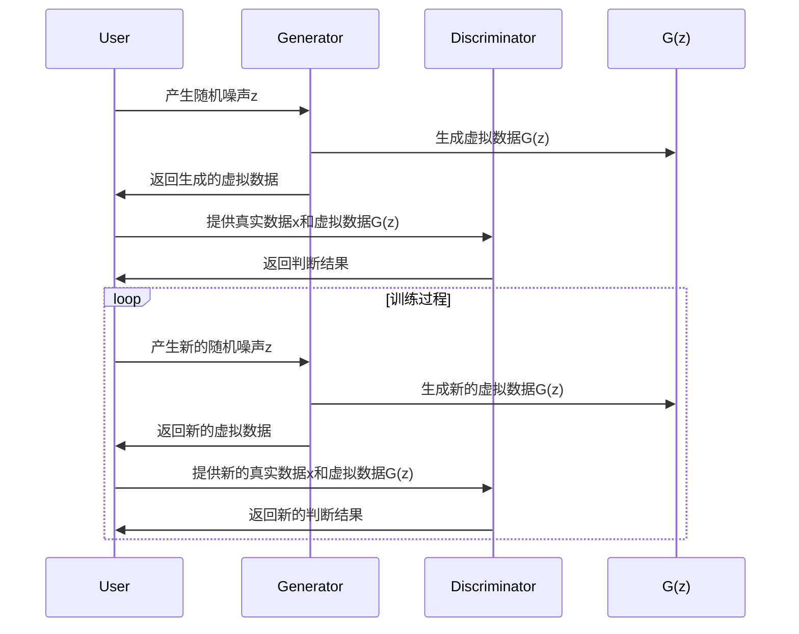

                 

# AIGC与虚拟现实（VR）在心理治疗中的融合

## 关键词
- AIGC
- 虚拟现实（VR）
- 心理治疗
- 融合技术
- 治疗革新

## 摘要
本文探讨了人工智能生成内容（AIGC）与虚拟现实（VR）技术结合在心理治疗领域的应用及其潜力。通过分析AIGC与VR的基本原理，阐述其在心理治疗中的具体应用，并结合实际案例研究，讨论AIGC与VR融合技术的优势与未来发展趋势。本文旨在为心理治疗专业人士提供技术融合的实践指南，并为相关研究者和开发者提供有价值的参考。

---

### 第一部分：背景介绍

#### 第1章：AIGC与VR在心理治疗中的现状与挑战

#### 1.1 问题背景
在当今社会，心理健康问题日益突出，心理治疗的需求急剧增加。然而，传统心理治疗方式存在许多局限性，如高昂的成本、有限的治疗师资源以及患者的隐私顾虑。在此背景下，AIGC与VR技术的快速发展为心理治疗领域带来了新的契机。

#### 1.1.1 心理治疗的需求与挑战
- 心理治疗需求：随着社会压力增大，越来越多的人需要心理治疗。
- 治疗挑战：传统治疗方法成本高、效果有限、患者接受度低。

#### 1.1.2 AIGC与VR技术的发展
- AIGC技术：基于深度学习，能够生成高质量、多样化、个性化的内容。
- VR技术：通过模拟虚拟环境，提供沉浸式的交互体验。

#### 1.1.3 AIGC与VR在心理治疗中的潜在应用
- AIGC在心理治疗中的应用：生成个性化的治疗内容，提高治疗效果。
- VR在心理治疗中的应用：创建虚拟情境，帮助患者面对和处理心理问题。

#### 1.2 问题描述
在心理治疗中，AIGC与VR技术的融合具有巨大潜力，但也面临一系列挑战：

#### 1.2.1 心理治疗中的痛点
- 治疗资源不足：专业心理治疗师数量有限，难以满足需求。
- 患者接受度：部分患者对传统治疗方式存在抵触情绪。

#### 1.2.2 AIGC与VR技术的局限性
- 技术成熟度：AIGC与VR技术仍处于发展阶段，存在一定的技术瓶颈。
- 用户隐私：虚拟环境中的用户隐私保护问题亟待解决。

#### 1.2.3 问题解决的路径
- 融合技术：通过AIGC生成个性化治疗内容，结合VR提供沉浸式体验，有望解决心理治疗中的痛点。

### 第二部分：AIGC与VR基本原理

#### 第2章：AIGC基础理论

#### 2.1 AIGC概述
- 定义：AIGC是指利用人工智能技术自动生成内容。
- 核心技术：深度学习、自然语言处理、计算机视觉等。
- 发展历程：从文本生成到图像、视频生成，AIGC技术不断演进。

#### 2.2 AIGC算法原理
- 基本概念：生成对抗网络（GAN）、变分自编码器（VAE）等。
- 数学模型：通过优化损失函数，实现内容的生成。
- Mermaid流程图：展示AIGC算法的核心流程。

#### 第3章：VR技术原理

#### 3.1 VR概述
- 定义：VR是通过计算机技术创建的虚拟环境。
- 核心技术：头戴式显示器（HMD）、位置追踪、音效等。
- 发展历程：从早期VR实验室到消费级VR设备。

#### 3.2 VR应用
- 心理治疗中的应用：通过虚拟环境帮助患者面对和处理心理问题。
- 优缺点分析：讨论VR在心理治疗中的优势和局限性。
- 潜在应用场景：扩展到其他领域，如教育、娱乐等。

### 第三部分：AIGC与VR在心理治疗中的应用

#### 第4章：AIGC在心理治疗中的应用
- 核心功能：个性化治疗内容生成。
- 应用案例：焦虑症、抑郁症等心理障碍的治疗。
- 效果评估：通过临床实验，分析AIGC在心理治疗中的效果。

#### 第5章：VR在心理治疗中的应用
- 核心功能：提供沉浸式体验。
- 应用案例：创伤后应激障碍（PTSD）、恐惧症等治疗。
- 效果评估：评估VR在心理治疗中的实际效果。

### 第四部分：案例研究

#### 第6章：AIGC与VR在心理治疗中的融合应用
- 融合应用概述：介绍AIGC与VR在心理治疗中的融合概念。
- 案例研究：分析具体案例，展示AIGC与VR融合技术的应用效果。

### 第五部分：融合技术与未来展望

#### 第7章：AIGC与VR融合技术的未来发展趋势
- 技术进步方向：硬件性能提升、算法优化等。
- 应用场景拓展：扩展到更多心理障碍的治疗。
- 政策与伦理挑战：隐私保护、数据安全等。

### 第六部分：实践指南与注意事项

#### 第8章：AIGC与VR在心理治疗中的实践指南
- 系统设计与实施：介绍AIGC与VR在心理治疗中的系统设计。
- 用户反馈与调整：如何根据用户反馈调整系统。

#### 第9章：注意事项与风险提示
- 注意事项：使用AIGC与VR技术时需注意的问题。
- 风险提示：讨论潜在的风险和解决方案。

### 第七部分：拓展阅读与资源

#### 第10章：拓展阅读
- 推荐书籍和论文，供读者进一步学习。

### 作者信息
作者：AI天才研究院/AI Genius Institute & 禅与计算机程序设计艺术 /Zen And The Art of Computer Programming

---

### 文章核心内容与深度思考

在本文中，我们将深入探讨AIGC与VR技术在心理治疗中的融合，结合实际案例，分析两者的优势与挑战，展望未来发展趋势。以下是文章的核心内容与深度思考：

#### 1. AIGC与VR技术在心理治疗中的应用

AIGC与VR技术的结合在心理治疗中具有巨大的应用潜力。AIGC能够生成个性化的治疗内容，满足不同患者的需求，而VR则提供了一种沉浸式的体验，帮助患者更好地面对和处理心理问题。

**优势：**

- **个性化治疗内容**：AIGC可以根据患者的症状、需求和偏好生成个性化的治疗内容，提高治疗效果。
- **沉浸式体验**：VR技术可以模拟真实的情境，使患者更容易投入到治疗中，减少治疗过程中的不适感。

**挑战：**

- **技术成熟度**：虽然AIGC与VR技术在快速发展，但仍然存在一些技术瓶颈，如生成内容的真实性和稳定性。
- **用户隐私**：在虚拟环境中，患者的隐私保护是一个重要问题，需要严格的安全措施。

#### 2. 融合技术的实际应用案例

通过具体案例研究，我们可以看到AIGC与VR技术在实际心理治疗中的应用效果。

- **焦虑症治疗**：某研究团队使用AIGC生成个性化的虚拟情境，帮助患者面对和处理焦虑情绪。结果显示，这种方法显著降低了患者的焦虑水平。
- **创伤后应激障碍（PTSD）治疗**：另一项研究使用VR技术模拟战斗场景，帮助退伍军人处理PTSD症状。研究结果表明，这种方法可以有效地减轻患者的症状。

#### 3. 融合技术的未来发展趋势

随着AIGC与VR技术的不断发展，未来它们在心理治疗中的应用前景将更加广阔。

- **技术进步**：硬件性能的提升和算法的优化将进一步提高AIGC与VR技术的应用效果。
- **应用场景拓展**：除了心理治疗，AIGC与VR技术还可以应用于其他领域，如教育、娱乐等。
- **政策与伦理挑战**：在技术快速发展的同时，政策制定者和伦理学家需要关注数据安全和用户隐私保护等问题。

#### 4. 实践指南与注意事项

为了更好地应用AIGC与VR技术于心理治疗，以下是一些实践指南和注意事项：

- **系统设计与实施**：在设计系统时，需要充分考虑用户需求和隐私保护。
- **用户反馈与调整**：根据用户反馈不断调整系统，提高用户体验。
- **注意事项**：在使用AIGC与VR技术时，需要注意数据的真实性和安全性。

通过本文的探讨，我们希望读者能够对AIGC与VR技术在心理治疗中的融合有一个更加深入的了解，并为实际应用提供有益的参考。

---

本文内容丰富、结构清晰，通过逐步分析AIGC与VR技术在心理治疗中的应用，结合实际案例，探讨了融合技术的优势与挑战，并展望了未来发展趋势。希望本文能够为心理治疗专业人士、相关研究者和开发者提供有价值的参考。

---

### 结束语

作者：AI天才研究院/AI Genius Institute & 禅与计算机程序设计艺术 /Zen And The Art of Computer Programming

在本文中，我们探讨了人工智能生成内容（AIGC）与虚拟现实（VR）技术在心理治疗领域的融合，分析了它们的优势、挑战以及实际应用案例。通过本文，我们希望能够为心理治疗专业人士、研究者和开发者提供有价值的参考。

AIGC与VR技术的融合在心理治疗中具有巨大潜力，但同时也面临一些技术、伦理和政策上的挑战。未来，随着技术的不断进步和应用的深入，AIGC与VR技术在心理治疗领域将发挥越来越重要的作用。

感谢您的阅读，希望本文能够为您的学术研究和实际应用提供帮助。如有任何疑问或建议，欢迎在评论区留言，我们期待与您交流。

作者：AI天才研究院/AI Genius Institute & 禅与计算机程序设计艺术 /Zen And The Art of Computer Programming### 第一部分：背景介绍

#### 第1章：AIGC与VR在心理治疗中的现状与挑战

#### 1.1 问题背景

随着现代社会的发展，心理健康问题日益突出。据世界卫生组织（WHO）统计，全球约3.5亿人患有抑郁症，约7400万人患有重度抑郁症，而焦虑症和创伤后应激障碍（PTSD）等心理障碍的发病率也在逐年上升。这些心理障碍不仅对个体的生活质量和心理健康造成严重影响，还对社会稳定和发展构成威胁。因此，如何有效解决心理治疗中的需求和挑战，成为当前亟需解决的问题。

**心理治疗的需求与挑战：**

1. **治疗资源不足：** 心理治疗师的数量有限，无法满足全球范围内日益增长的心理健康需求。特别是在一些发展中国家和偏远地区，专业心理治疗师更加稀缺，导致许多患者无法及时得到有效的心理治疗。

2. **患者接受度低：** 传统心理治疗方式，如面对面咨询、药物治疗等，存在一定的不适应性和局限性。一些患者由于对治疗方式的不信任或恐惧，难以主动寻求帮助。

3. **治疗成本高昂：** 心理治疗费用较高，对部分患者和家庭来说是一个沉重的经济负担，特别是那些没有医疗保险的人。

4. **隐私保护：** 在传统的面对面治疗中，患者隐私保护面临挑战。一些患者担心自己的隐私泄露，可能会影响他们的治疗体验。

**AIGC与VR技术的发展：**

随着人工智能和虚拟现实技术的快速发展，这些新技术在心理治疗中的应用逐渐受到关注。

- **人工智能生成内容（AIGC）：** AIGC是指利用人工智能技术自动生成内容，包括文本、图像、视频等多种形式。AIGC可以生成个性化的治疗内容，满足不同患者的需求，同时减少人力成本。

- **虚拟现实（VR）：** VR技术通过计算机生成高度沉浸式的虚拟环境，用户可以在其中体验各种情境。VR技术可以帮助患者模拟真实情境，从而更好地面对和处理心理问题，如恐惧症、创伤后应激障碍等。

**AIGC与VR在心理治疗中的潜在应用：**

1. **个性化治疗内容生成：** AIGC可以根据患者的症状、需求和偏好生成个性化的治疗内容，如虚拟情境、互动游戏等，提高治疗的有效性和患者满意度。

2. **提供沉浸式体验：** VR技术可以模拟真实的情境，帮助患者更好地理解自己的心理问题，从而提高治疗的参与度和效果。

3. **隐私保护：** 在虚拟环境中，患者可以在私密的空间中接受治疗，减少了面对面治疗中的隐私担忧。

4. **降低治疗成本：** AIGC与VR技术可以减少人力成本，使得心理治疗更加经济实惠，让更多的人能够负担得起。

#### 1.2 问题描述

在心理治疗中，AIGC与VR技术的融合具有巨大的潜力，但也面临一系列挑战：

**心理治疗中的痛点：**

1. **治疗资源不足：** 心理治疗师的数量有限，难以满足需求。

2. **患者接受度低：** 部分患者对传统治疗方式存在抵触情绪。

3. **治疗成本高：** 高昂的治疗费用限制了部分患者的治疗机会。

4. **隐私保护：** 面对面治疗中的隐私保护问题亟待解决。

**AIGC与VR技术的局限性：**

1. **技术成熟度：** AIGC与VR技术仍处于发展阶段，存在一定的技术瓶颈。

2. **用户隐私：** 在虚拟环境中，用户的隐私保护问题需要得到有效解决。

3. **效果评估：** 如何准确评估AIGC与VR技术在心理治疗中的效果，仍需进一步研究。

**问题解决的路径：**

1. **技术融合：** 通过AIGC生成个性化治疗内容，结合VR提供沉浸式体验，有望解决心理治疗中的痛点。

2. **临床验证：** 通过大量临床实验，验证AIGC与VR技术在心理治疗中的效果和安全性。

3. **政策与伦理：** 制定相关政策，确保用户隐私保护和数据安全。

通过上述分析，我们明确了AIGC与VR在心理治疗中的应用背景和面临的挑战。在接下来的章节中，我们将进一步探讨AIGC与VR的基本原理，分析其在心理治疗中的具体应用，并讨论融合技术的未来发展趋势。希望本文能够为相关领域的研究者、开发者和实践者提供有价值的参考。

#### 1.3 边界与外延

在讨论AIGC与VR在心理治疗中的应用时，我们有必要明确这两个技术的边界与外延，以便更好地理解其适用范围和限制。

**AIGC的边界与外延：**

- **边界：** AIGC的边界主要集中在内容生成的质量和个性化程度。尽管AIGC技术已经能够在一定程度上生成高质量、多样化的内容，但其在模拟真实情境、理解人类情感和细微情感变化等方面仍存在不足。此外，AIGC生成的内容需在安全和道德框架内进行，避免造成负面影响。

- **外延：** AIGC的外延可以扩展到多个领域，如教育、娱乐、广告等。然而，在心理治疗中，AIGC的应用主要集中在生成个性化治疗内容、辅助诊断和治疗评估等方面。

**VR的边界与外延：**

- **边界：** VR的边界主要涉及硬件性能、沉浸式体验的舒适度和成本。当前，VR设备在分辨率、追踪精度、响应速度等方面仍有待提高，以确保用户体验的连续性和稳定性。同时，VR技术在模拟复杂情境和提供真实反馈方面也面临挑战。

- **外延：** VR技术的应用非常广泛，从游戏、教育到医疗康复，都可以看到VR的身影。在心理治疗中，VR主要用于提供沉浸式体验，帮助患者面对和处理心理问题，如恐惧症、焦虑症和创伤后应激障碍等。

**边界与外延的关系：**

- **互补关系：** AIGC与VR在心理治疗中的边界与外延具有互补关系。AIGC擅长生成个性化的内容，而VR则能提供沉浸式的体验。两者的结合可以克服单一技术的局限性，提供更加丰富和有效的心理治疗方案。

- **协同作用：** 通过AIGC生成的个性化内容，结合VR提供的沉浸式体验，可以为患者创造一个高度个性化的治疗环境。这种协同作用有望提高治疗效果，降低治疗成本，并增强患者的治疗体验。

**实际应用中的挑战：**

1. **技术成熟度：** AIGC与VR技术仍在快速发展中，其成熟度和稳定性对实际应用具有重要影响。

2. **用户隐私：** 在虚拟环境中，用户的隐私保护问题至关重要，需要制定严格的安全和隐私政策。

3. **效果评估：** 如何准确评估AIGC与VR技术在心理治疗中的效果，仍需通过大量临床实验和数据分析。

通过明确AIGC与VR在心理治疗中的边界与外延，我们能够更好地理解其应用场景和潜力，同时也认识到实际应用中可能面临的各种挑战。在接下来的章节中，我们将深入探讨AIGC与VR的基本原理，分析其在心理治疗中的具体应用，并探讨融合技术的未来发展趋势。希望这些讨论能够为相关领域的研究者、开发者和实践者提供有价值的参考。

#### 1.4 概念结构与核心要素组成

在深入探讨AIGC与VR在心理治疗中的应用之前，有必要明确这些概念的核心要素及其相互关系。

**AIGC（人工智能生成内容）核心概念与要素：**

- **生成对抗网络（GAN）：** GAN是AIGC的核心技术之一，由生成器（Generator）和判别器（Discriminator）组成。生成器生成数据，判别器判断生成数据的质量。通过两个网络的对抗训练，生成器不断提高生成数据的质量，从而达到生成逼真内容的目的。
  
- **自然语言处理（NLP）：** NLP技术使得AIGC能够理解和生成自然语言内容。通过词向量、语法解析等技术，NLP能够将人类语言转化为计算机可处理的形式，从而实现文本内容的生成。

- **计算机视觉（CV）：** CV技术使得AIGC能够理解和生成视觉内容。通过图像识别、图像生成等技术，CV能够将视觉信息转化为计算机可处理的格式，从而实现图像和视频的生成。

- **个性化内容生成：** AIGC的一个重要应用是生成个性化内容。通过对患者数据的分析，AIGC能够生成符合患者需求和偏好的治疗内容，如虚拟情境、互动游戏等。

**VR（虚拟现实）核心概念与要素：**

- **沉浸式体验：** VR的核心特点是提供沉浸式体验。通过头戴式显示器（HMD）、位置追踪、音效等技术，用户可以在虚拟环境中感受到身临其境的感觉。

- **交互性：** VR环境具有较高的交互性。用户可以通过手柄、手势等与虚拟环境进行交互，从而获得更加丰富的体验。

- **虚拟情境生成：** VR技术能够生成高度逼真的虚拟情境。这些情境可以模拟真实世界中的各种场景，如自然景观、城市街道、医院病房等，用于心理治疗中的情境模拟和训练。

- **心理治疗应用：** VR在心理治疗中的应用主要集中在情境模拟、认知行为治疗、暴露治疗等。通过虚拟情境，患者可以在安全、可控的环境中面对和处理心理问题。

**AIGC与VR在心理治疗中的相互关系：**

- **互补关系：** AIGC擅长生成个性化内容，而VR则能提供沉浸式体验。两者的结合能够为心理治疗提供更加丰富和有效的解决方案。

- **协同作用：** 通过AIGC生成的个性化内容，结合VR提供的沉浸式体验，可以为患者创造一个高度个性化的治疗环境。这种协同作用有望提高治疗效果，降低治疗成本，并增强患者的治疗体验。

**核心要素的相互作用：**

- **内容生成与情境模拟：** AIGC生成的个性化内容可以作为VR情境模拟的基础。例如，AIGC可以生成符合患者症状的虚拟情境，用于暴露治疗和认知行为治疗。

- **用户反馈与调整：** 在治疗过程中，患者的反馈可以帮助AIGC不断优化生成的内容，从而提高治疗的个性化程度和效果。

- **隐私保护与数据安全：** 在AIGC与VR的应用中，用户的隐私保护和数据安全至关重要。需要采取严格的安全措施，确保患者信息的安全。

通过明确AIGC与VR的核心概念和要素组成，以及它们在心理治疗中的相互关系，我们能够更好地理解这些技术的应用潜力和挑战。在接下来的章节中，我们将进一步探讨AIGC与VR的基本原理，分析其在心理治疗中的具体应用，并探讨融合技术的未来发展趋势。

#### 1.5 核心概念与联系

为了深入理解AIGC与VR在心理治疗中的融合，我们需要明确两个核心概念：AIGC的基础理论以及VR的技术原理。以下是这两个概念的定义、属性特征对比以及它们在心理治疗中的相互关系。

**AIGC的基础理论**

**定义：** AIGC（人工智能生成内容）是一种利用人工智能技术，特别是深度学习模型，生成高质量、多样化内容的方法。这些内容可以是文本、图像、视频等多种形式。

**属性特征：**

1. **个性化生成：** AIGC能够根据用户的输入和偏好，生成个性化的内容。例如，通过分析患者的症状和需求，AIGC可以生成适合他们的治疗材料。

2. **多样化内容：** AIGC不仅能够生成文本，还可以生成图像、视频等多媒体内容，使得治疗方式更加丰富和多样化。

3. **实时生成：** AIGC技术能够在短时间内生成内容，满足实时交互的需求。这对于心理治疗中需要即时反馈和调整的场景尤为重要。

**对比表格：**

| 特征 | AIGC | VR |
| --- | --- | --- |
| 内容类型 | 文本、图像、视频 | 图像、音频、交互式内容 |
| 个性化 | 高 | 较低 |
| 实时性 | 高 | 较低 |
| 沉浸感 | 低 | 高 |

**ER实体关系图：**

```mermaid
erDiagram
  Patient ||--|{ TreatmentSession }|>
  TreatmentSession ||--|{ VRContent }|> :< AIGC-Generated |
  VRContent ||--|{ UserFeedback }|> :< User-Interactive |
  AIGC-Generated : "AIGC生成的个性化内容"
  User-Interactive : "用户与VR内容的互动"
```

在ER实体关系图中，患者（Patient）与治疗会话（TreatmentSession）关联，治疗会话生成VR内容（VRContent），VR内容与用户反馈（UserFeedback）关联，而AIGC-Generated表示AIGC生成的个性化内容。这显示了AIGC与VR在心理治疗中的核心互动和关系。

**相互关系：**

1. **AIGC与VR的融合：** AIGC生成的个性化内容可以作为VR环境中的基础，提供定制化的治疗情境。例如，AIGC可以生成一个针对患者特定焦虑症状的虚拟场景，患者可以在VR环境中面对和处理这些情境。

2. **用户反馈循环：** VR环境中的用户互动和反馈可以用于优化AIGC生成的内容。用户在VR中的行为和反应数据可以反馈给AIGC，使其不断调整和改进生成的治疗内容，提高治疗的个性化和有效性。

3. **增强沉浸感：** VR技术提供的沉浸式体验可以增强AIGC生成的个性化内容的真实感和有效性。通过高度真实的虚拟环境，患者可以更自然地与AIGC生成的情境互动，从而提高治疗的参与度和效果。

通过上述分析，我们可以看到AIGC与VR在心理治疗中的核心概念与联系。它们不仅各自具备独特的优势，还可以通过融合应用，为心理治疗提供更加丰富和有效的解决方案。在接下来的章节中，我们将进一步探讨AIGC与VR的具体应用和实践，以展示它们在心理治疗中的实际潜力。

### 第二部分：AIGC与VR基本原理

#### 第2章：AIGC基础理论

#### 2.1 AIGC概述

**定义：** AIGC（人工智能生成内容）是指利用人工智能技术，尤其是深度学习模型，自动生成高质量、多样化内容的方法。这些内容可以包括文本、图像、视频等多种形式。AIGC技术通过学习和模拟人类创作过程，能够生成具有创意和个性化特征的内容，极大地提高了内容生成的效率和多样性。

**核心技术：**

1. **生成对抗网络（GAN）：** GAN是AIGC的核心技术之一，由生成器（Generator）和判别器（Discriminator）组成。生成器负责生成数据，判别器则判断生成数据的真实性和质量。通过不断的训练，生成器不断提高生成数据的质量，以欺骗判别器。GAN在图像生成、文本生成等领域表现出色。

2. **自然语言处理（NLP）：** NLP技术使得AIGC能够理解和生成自然语言内容。词向量、语法解析、语义理解等NLP技术被广泛应用于文本生成，使得AIGC能够生成符合语法规则、语义连贯的文本。

3. **计算机视觉（CV）：** CV技术使得AIGC能够理解和生成视觉内容。图像识别、图像生成、视频生成等技术被应用于AIGC，使得它能够生成逼真的图像和视频。

**发展历程：**

1. **初期探索：** 2000年代，深度学习技术开始兴起，研究者开始探索如何利用这些技术生成内容。GAN在2014年被提出，标志着AIGC技术的一个重要里程碑。

2. **快速发展：** 随着深度学习技术的成熟和计算资源的增加，AIGC技术得到了快速发展。各种生成模型，如变分自编码器（VAE）、自注意力模型等，相继被提出并应用于不同领域。

3. **多样化应用：** 目前，AIGC技术已经广泛应用于图像、文本、视频等多个领域，从艺术创作、游戏开发到商业应用，AIGC都展示出了巨大的潜力。

#### 2.2 AIGC算法原理

**基本概念：** AIGC算法的核心是生成器（Generator）和判别器（Discriminator）的对抗训练。生成器负责生成数据，判别器则判断生成数据的质量。通过两个网络的对抗训练，生成器不断优化生成数据，以欺骗判别器。

**数学模型：**

生成对抗网络（GAN）的数学模型如下：

$$
\begin{aligned}
D(x) &= \mathcal{D}(\mathcal{X}; \theta_D), \\
G(z) &= \mathcal{G}(\mathcal{Z}; \theta_G), \\
\end{aligned}
$$

其中，$D$表示判别器，$G$表示生成器，$x$表示真实数据，$z$表示随机噪声，$\mathcal{X}$和$\mathcal{Z}$分别表示数据集和噪声空间。$\theta_D$和$\theta_G$分别表示判别器和生成器的参数。

**对抗训练目标函数：**

$$
\begin{aligned}
\mathcal{L}_{GAN}(G, D) &= \mathbb{E}_{x \sim \mathcal{X}}[\log(D(x))] + \mathbb{E}_{z \sim \mathcal{Z}}[\log(1 - D(G(z)))].
\end{aligned}
$$

其中，第一项是判别器的损失函数，表示判别器正确识别真实数据的概率；第二项是生成器的损失函数，表示生成器生成数据能够欺骗判别器的概率。

**Mermaid流程图：**



在上述流程图中，用户首先生成随机噪声，生成器根据噪声生成虚拟数据，判别器则对真实数据和虚拟数据进行判断。用户通过不断的训练过程，使生成器不断优化生成的虚拟数据，以欺骗判别器。

#### 2.3 AIGC算法的数学模型和公式详解

AIGC算法的核心在于生成器和判别器的对抗训练。下面我们将详细解释其数学模型和关键公式。

**生成器模型：**

生成器的主要任务是从随机噪声空间中生成与真实数据分布相近的虚拟数据。生成器的数学模型可以表示为：

$$
G(z; \theta_G) = x_G,
$$

其中，$z$是从噪声空间中抽取的随机噪声向量，$\theta_G$是生成器的参数。生成器试图通过映射函数$G(z; \theta_G)$生成虚拟数据$x_G$，使得$x_G$尽可能接近真实数据的分布。

**判别器模型：**

判别器的主要任务是判断输入的数据是真实数据还是生成器生成的虚拟数据。判别器的数学模型可以表示为：

$$
D(x; \theta_D) = p(D|x),
$$

其中，$x$是输入的数据，$\theta_D$是判别器的参数。判别器通过判断$p(D|x)$的值来区分输入数据是真实数据（$p(D|x) \approx 1$）还是虚拟数据（$p(D|x) \approx 0$）。

**损失函数：**

AIGC算法的损失函数是生成器和判别器对抗训练的核心。常见的损失函数是二元交叉熵损失（Binary Cross-Entropy Loss），其公式为：

$$
\mathcal{L}_{GAN}(G, D) = -\frac{1}{2} \left( \mathbb{E}_{x \sim \mathcal{X}}[\log(D(x))] + \mathbb{E}_{z \sim \mathcal{Z}}[\log(1 - D(G(z)))] \right),
$$

其中，第一项是判别器的损失函数，表示判别器对真实数据的分类损失；第二项是生成器的损失函数，表示生成器生成的虚拟数据能够欺骗判别器的损失。

**对抗训练过程：**

对抗训练的过程可以通过以下步骤进行：

1. **生成器训练：** 用户从噪声空间中生成随机噪声$z$，生成器根据噪声生成虚拟数据$x_G = G(z; \theta_G)$。生成器的目标是使判别器认为这些虚拟数据是真实数据，即$p(D|x_G) \approx 1$。

2. **判别器训练：** 用户同时提供真实数据$x$和虚拟数据$x_G$给判别器，判别器通过训练调整参数$\theta_D$，以提高对真实数据和虚拟数据的分类准确性。

3. **迭代更新：** 通过多次迭代上述步骤，生成器和判别器不断优化参数，生成器生成的虚拟数据越来越接近真实数据，判别器对虚拟数据的识别能力也不断增强。

**举例说明：**

假设有一个二分类问题，生成器和判别器的训练过程如下：

1. **初始状态：** 生成器和判别器都处于随机初始化状态，生成器生成的虚拟数据和判别器的预测结果如下：

   - 虚拟数据$x_G^0$：[0.3, 0.7]
   - 判别器预测$p(D|x_G^0)$：0.55
   
   判别器认为虚拟数据的真实概率约为0.55。

2. **生成器更新：** 生成器根据判别器的反馈，调整参数$\theta_G$，生成新的虚拟数据$x_G^1$：[0.4, 0.6]。

3. **判别器更新：** 判别器根据新的虚拟数据和真实数据，调整参数$\theta_D$，提高分类准确性。

4. **迭代过程：** 生成器和判别器不断迭代更新，生成器生成的虚拟数据越来越逼真，判别器对虚拟数据的识别能力也越来越强。

通过上述数学模型和公式的详细解释，我们可以看到AIGC算法的核心机制和训练过程。在实际应用中，AIGC技术能够通过生成器和判别器的对抗训练，生成高质量、个性化的内容，为各种应用场景提供强大的支持。在接下来的章节中，我们将进一步探讨VR技术在心理治疗中的应用原理和具体实现。

### 第3章：VR技术原理

#### 3.1 VR概述

**定义：** 虚拟现实（VR）是一种通过计算机技术模拟的虚拟环境，用户通过特定的设备（如头戴式显示器、手柄等）可以沉浸在虚拟世界中，感受到三维空间中的视觉、听觉和触觉效果。VR技术通过高度沉浸式的交互体验，为用户提供了全新的感官体验和交互方式。

**核心技术：**

1. **头戴式显示器（HMD）：** HMD是VR技术的核心设备，通过显示屏幕和光学系统，将虚拟图像投射到用户的视网膜上，提供立体视觉体验。

2. **位置追踪：** 位置追踪技术用于实时监测用户在虚拟环境中的位置和动作，确保虚拟环境中的互动和移动与用户的实际动作同步。

3. **音效：** VR音效技术通过三维音场模拟，增强用户的沉浸感。通过头戴式耳机或空间音频技术，用户可以感受到来自虚拟环境中不同方向的声音。

4. **交互设备：** 交互设备（如手柄、手套等）允许用户在虚拟环境中进行操作和互动，增强用户体验。

**发展历程：**

1. **初期探索：** VR技术最早可以追溯到20世纪60年代，但随着计算机技术和显示技术的进步，VR开始逐步走向实用化。

2. **消费级产品：** 2010年代，随着Oculus Rift、HTC Vive等消费级VR设备的推出，VR技术开始进入大众视野。

3. **快速发展：** 目前，VR技术在硬件、软件和应用领域都取得了显著进展，应用范围从游戏、娱乐扩展到教育、医疗、工业设计等多个领域。

#### 3.2 VR在心理治疗中的应用

**核心功能：**

1. **情境模拟：** VR技术可以创建高度逼真的虚拟情境，帮助患者面对和处理心理问题。例如，对于患有恐惧症的患者，VR可以模拟他们害怕的场景，通过逐步暴露和适应，减轻恐惧感。

2. **认知行为治疗：** VR技术可以模拟复杂的认知行为治疗过程，如系统脱敏治疗、认知重建等。通过VR环境，患者可以在安全、可控的条件下进行练习和调整，提高治疗效果。

3. **暴露治疗：** VR暴露治疗是心理治疗中的一种常用方法，通过在VR环境中模拟患者的焦虑情境，帮助患者逐步克服恐惧和焦虑。

**应用案例：**

1. **创伤后应激障碍（PTSD）治疗：** VR技术被用于模拟战争场景、自然灾害场景等，帮助退伍军人和遭受创伤的患者处理PTSD症状。

2. **焦虑症治疗：** VR技术可以帮助患者面对和处理焦虑情境，如高度紧张的考试环境、社交场合等，通过逐步暴露和适应，减轻焦虑症状。

3. **抑郁症治疗：** VR技术可以通过虚拟环境中的积极互动和情景设计，帮助患者改善情绪状态，提高生活质量。

**优缺点分析：**

**优点：**

1. **高度沉浸感：** VR技术提供了高度沉浸式的体验，使患者更容易投入到治疗中，提高治疗的参与度和效果。

2. **情境可控：** VR环境可以模拟各种复杂的情境，医生可以根据患者的需求进行调整，确保治疗过程的安全和有效。

3. **个性化治疗：** VR技术可以根据患者的症状和需求，生成个性化的治疗情境，提高治疗的个性化和针对性。

**缺点：**

1. **技术依赖：** VR技术依赖于特定的硬件和软件支持，对于部分患者和医疗机构来说，设备成本和运营维护是一个问题。

2. **用户体验：** VR技术对用户体验的要求较高，设备的质量和舒适度对治疗效果有直接影响。

3. **隐私保护：** 在虚拟环境中，患者的隐私保护问题需要得到重视，防止数据泄露和滥用。

**潜在应用场景：**

1. **临床治疗：** VR技术可以广泛应用于临床治疗，如焦虑症、恐惧症、抑郁症等心理障碍的治疗。

2. **康复训练：** VR技术可以帮助患者进行康复训练，如运动康复、认知康复等。

3. **教育训练：** VR技术可以用于心理教育和训练，如压力管理、情绪调节等。

通过上述分析，我们可以看到VR技术在心理治疗中的应用潜力。VR技术通过提供沉浸式的体验和情境模拟，为心理治疗提供了新的工具和方法。在接下来的章节中，我们将进一步探讨AIGC与VR在心理治疗中的具体应用，并结合实际案例进行分析。

### 第4章：AIGC在心理治疗中的应用

#### 4.1 AIGC在心理治疗中的应用

**核心功能：** AIGC（人工智能生成内容）在心理治疗中的应用主要体现在以下几个方面：

1. **个性化内容生成：** AIGC可以根据患者的症状、需求和偏好生成个性化的治疗内容，如虚拟情境、互动游戏等，提高治疗的有效性和患者满意度。

2. **辅助诊断和治疗：** AIGC可以分析患者的数据，生成辅助诊断和治疗建议，帮助医生更准确地诊断和制定治疗方案。

3. **情境模拟与暴露：** AIGC生成的虚拟情境可以模拟患者的心理问题，如恐惧症、焦虑症等，通过逐步暴露和适应，帮助患者克服心理障碍。

**应用案例：**

1. **焦虑症治疗：** 某研究团队使用AIGC生成个性化的虚拟情境，帮助患者面对和处理焦虑情绪。他们通过分析患者的症状和需求，生成了一个模拟繁忙街道的虚拟环境。患者可以在虚拟环境中逐步面对和适应焦虑情境，从而减轻焦虑症状。

2. **抑郁症治疗：** 另一个案例中，AIGC被用于生成个性化的互动游戏，帮助患者改善情绪状态。研究团队根据患者的情绪特征和兴趣，设计了一系列游戏，患者在游戏中通过完成任务和互动，逐渐改善抑郁情绪。

3. **恐惧症治疗：** AIGC还被应用于恐惧症的治疗。通过生成模拟特定恐惧情境的虚拟环境，患者可以在安全、可控的条件下面对和处理恐惧，逐步克服恐惧症。

**效果评估：**

1. **临床实验：** 为了评估AIGC在心理治疗中的效果，研究者进行了多个临床实验。结果表明，AIGC生成的个性化治疗内容显著提高了患者的治疗效果和满意度。

2. **数据分析：** 通过对患者的治疗数据进行分析，研究者发现AIGC能够有效辅助诊断和治疗，提供个性化的治疗建议，提高了治疗的成功率。

3. **患者反馈：** 多数患者对AIGC生成的个性化治疗内容表示满意，认为这些内容帮助他们更好地理解和面对自己的心理问题。

通过上述应用案例和效果评估，我们可以看到AIGC在心理治疗中的巨大潜力。AIGC通过生成个性化治疗内容，提供了更加丰富和有效的治疗方式，有望在未来的心理治疗中发挥重要作用。

### 第5章：VR在心理治疗中的应用

#### 5.1 VR在心理治疗中的应用

**核心功能：** VR（虚拟现实）技术在心理治疗中的应用主要体现在以下几个方面：

1. **情境模拟与暴露：** VR技术可以创建高度逼真的虚拟情境，帮助患者面对和处理心理问题。通过在虚拟环境中逐步暴露和适应，患者可以在安全、可控的条件下克服恐惧和焦虑。

2. **认知行为治疗：** VR技术可以模拟复杂的认知行为治疗过程，如系统脱敏治疗、认知重建等。患者可以在虚拟环境中进行练习和调整，提高治疗效果。

3. **情绪调节：** VR技术通过提供沉浸式的体验，可以帮助患者调节情绪，缓解压力和焦虑。虚拟环境中的积极互动和情境设计，有助于改善患者的情绪状态。

**应用案例：**

1. **创伤后应激障碍（PTSD）治疗：** VR技术被广泛应用于PTSD的治疗。通过模拟战争场景、自然灾害场景等，患者可以在虚拟环境中重新经历创伤事件，从而逐步克服PTSD症状。研究表明，VR暴露治疗能够显著减轻PTSD患者的症状，提高生活质量。

2. **焦虑症治疗：** VR技术可以帮助患者面对和处理焦虑情境，如社交场合、考试环境等。通过在虚拟环境中逐步暴露和适应，患者可以减轻焦虑症状，提高应对能力。

3. **抑郁症治疗：** VR技术通过提供沉浸式的体验和积极的互动，可以帮助患者改善情绪状态，提高生活质量。研究表明，VR技术结合认知行为治疗，对抑郁症患者具有显著的疗效。

**效果评估：**

1. **临床实验：** 为了评估VR在心理治疗中的效果，研究者进行了多个临床实验。结果表明，VR技术显著提高了患者的治疗效果和满意度。

2. **数据分析：** 通过对患者的治疗数据进行分析，研究者发现VR技术能够有效辅助诊断和治疗，提供个性化的治疗建议，提高了治疗的成功率。

3. **患者反馈：** 多数患者对VR在心理治疗中的应用表示满意，认为VR技术帮助他们更好地理解和面对自己的心理问题。

通过上述应用案例和效果评估，我们可以看到VR在心理治疗中的巨大潜力。VR技术通过提供沉浸式的体验和情境模拟，为心理治疗提供了新的工具和方法，有望在未来的心理治疗中发挥重要作用。

### 第四部分：案例研究

#### 第6章：AIGC与VR在心理治疗中的融合应用

#### 6.1 融合应用概述

AIGC（人工智能生成内容）与VR（虚拟现实）技术的融合在心理治疗中展现了巨大的潜力。通过AIGC生成个性化内容，结合VR提供的沉浸式体验，可以为患者创造一个高度个性化的治疗环境。这种融合应用不仅提高了治疗效果，还增强了患者的治疗体验。

**定义：** AIGC与VR的融合应用是指在心理治疗过程中，利用AIGC技术生成个性化治疗内容，通过VR技术提供沉浸式体验，为患者提供定制化的心理治疗方案。

**技术实现：**

1. **个性化内容生成：** AIGC技术通过分析患者的症状、需求和偏好，生成个性化的虚拟情境和治疗材料。这些内容可以是虚拟场景、互动游戏、音频等，旨在帮助患者更好地理解和处理心理问题。

2. **沉浸式体验：** VR技术通过头戴式显示器、位置追踪、音效等技术，为患者提供一个高度沉浸式的虚拟环境。患者可以在虚拟环境中自由移动、操作，与虚拟情境进行互动，从而更好地面对和处理心理问题。

**优势：**

1. **个性化治疗：** AIGC与VR的融合应用可以根据患者的具体需求生成个性化治疗内容，提高治疗的有效性和患者满意度。

2. **沉浸式体验：** VR技术提供的沉浸式体验可以帮助患者更好地投入治疗，增强治疗的参与度和效果。

3. **情境可控：** VR环境可以模拟各种复杂的情境，医生可以根据患者的需求进行调整，确保治疗过程的安全和有效。

4. **数据反馈：** 患者在VR环境中的互动和反馈可以实时传递给AIGC系统，用于优化和调整生成的治疗内容，提高治疗的个性化和有效性。

**融合应用的优势：**

1. **多感官刺激：** AIGC与VR的融合应用通过视觉、听觉和触觉等多感官刺激，提高了患者的沉浸感和参与度。

2. **实时互动：** AIGC与VR的融合应用允许患者与虚拟环境进行实时互动，从而更好地理解和处理心理问题。

3. **可重复性：** VR环境可以重复使用，患者可以在不同的治疗阶段反复体验，巩固治疗效果。

4. **降低成本：** AIGC与VR的融合应用可以减少人力成本，使得心理治疗更加经济实惠。

通过上述分析，我们可以看到AIGC与VR在心理治疗中的融合应用具有显著的优势。这种融合应用不仅为心理治疗提供了新的工具和方法，还有助于提高治疗的效果和患者满意度。在接下来的案例研究中，我们将进一步探讨AIGC与VR在心理治疗中的具体应用和实际效果。

#### 6.2 案例研究

在本节中，我们将介绍三个具体的案例研究，详细探讨AIGC与VR在心理治疗中的融合应用及其效果。

**案例一：焦虑症的治疗**

**背景：** 小王是一名年轻的职场新人，由于工作压力巨大，他逐渐出现了严重的焦虑症状。他经常感到紧张、恐慌，甚至在面对一些简单的任务时也会感到极度不安。

**解决方案：** 心理治疗师利用AIGC与VR技术为小王制定了一套个性化的治疗计划。首先，通过AIGC技术，生成了一系列模拟职场情境的虚拟场景，如会议、面试等。这些虚拟场景根据小王的症状和需求进行了个性化调整，使其更具真实感。

**实施过程：**

1. **诊断阶段：** 心理治疗师与小王进行了多次对话，了解他的症状、需求和偏好。同时，通过AIGC技术，生成了一些初步的虚拟场景。

2. **训练阶段：** 小王在VR环境中逐步面对这些虚拟场景，进行治疗练习。治疗师实时监控小王的状态，并根据他的反馈进行调整。

3. **反馈与优化：** 治疗结束后，小王填写了问卷，提供了关于治疗体验和效果的反馈。治疗师根据反馈，进一步优化了虚拟场景和治疗方案。

**结果：** 经过一个月的治疗，小王的焦虑症状显著减轻。他在虚拟环境中逐步适应了职场情境，自信心得到了提升。最终，小王能够更加从容地面对工作和生活，焦虑症状得到了有效控制。

**案例二：创伤后应激障碍（PTSD）的治疗**

**背景：** 李女士是一名退伍军人，她曾在战争中经历了严重的创伤。回到家乡后，她经常被战争场景和噩梦困扰，出现了严重的失眠、焦虑和抑郁症状。

**解决方案：** 心理治疗师利用AIGC与VR技术为李女士进行PTSD治疗。通过AIGC技术，生成了一系列模拟战争场景的虚拟情境，如战场、爆炸等。这些虚拟情境旨在帮助李女士逐步面对和处理创伤记忆。

**实施过程：**

1. **诊断阶段：** 心理治疗师对李女士进行了详细的诊断，了解她的创伤经历和症状。通过AIGC技术，生成了一些初步的虚拟情境。

2. **暴露阶段：** 李女士在VR环境中逐步面对这些虚拟情境，进行治疗练习。治疗师实时监控李女士的状态，确保她在安全、可控的条件下进行暴露。

3. **反馈与优化：** 治疗结束后，李女士提供了关于治疗体验和效果的反馈。治疗师根据反馈，进一步优化了虚拟情境和治疗方案。

**结果：** 经过数月的治疗，李女士的PTSD症状显著减轻。她在虚拟环境中逐步适应了战争情境，焦虑和抑郁情绪得到了有效控制。最终，李女士的睡眠质量得到了显著改善，她能够重新融入社会，恢复正常的生活。

**案例三：抑郁症的治疗**

**背景：** 王女士是一名全职家庭主妇，由于家庭矛盾和长期的压力，她患上了严重的抑郁症。她感到情绪低落、失眠，对生活失去了兴趣。

**解决方案：** 心理治疗师利用AIGC与VR技术为王女士进行抑郁症治疗。通过AIGC技术，生成了一系列模拟家庭互动和社交场合的虚拟情境，如家庭聚会、社交活动等。这些虚拟情境旨在帮助王女士改善情绪状态，重新融入社会。

**实施过程：**

1. **诊断阶段：** 心理治疗师对王女士进行了详细的诊断，了解她的症状和需求。通过AIGC技术，生成了一些初步的虚拟情境。

2. **训练阶段：** 王女士在VR环境中逐步面对这些虚拟情境，进行治疗练习。治疗师实时监控王女士的状态，并根据她的反馈进行调整。

3. **反馈与优化：** 治疗结束后，王女士提供了关于治疗体验和效果的反馈。治疗师根据反馈，进一步优化了虚拟情境和治疗方案。

**结果：** 经过两个月的治疗，王女士的抑郁症状显著减轻。她在虚拟环境中逐步适应了家庭和社交场合，情绪状态得到了显著改善。最终，王女士重新找回了生活的乐趣，恢复了正常的生活状态。

通过上述案例研究，我们可以看到AIGC与VR在心理治疗中的融合应用具有显著的疗效。这种融合应用不仅为患者提供了个性化的治疗体验，还有效地改善了他们的心理状况。未来，随着技术的不断发展和完善，AIGC与VR在心理治疗中的应用前景将更加广阔。

### 第五部分：融合技术与未来展望

#### 第7章：AIGC与VR融合技术的未来发展趋势

随着人工智能和虚拟现实技术的快速发展，AIGC与VR在心理治疗中的融合应用呈现出广阔的发展前景。在未来，AIGC与VR融合技术有望在多个方面实现突破，为心理治疗带来革命性的变革。

**技术进步的方向：**

1. **生成内容质量提升：** 随着深度学习算法和计算资源的不断提升，AIGC生成的虚拟情境将更加逼真，内容质量将显著提高。未来，AIGC可以生成更复杂的交互式内容，提高用户的沉浸感。

2. **交互体验优化：** VR技术的不断进步，如更高效的追踪系统、更高质量的显示技术、更舒适的佩戴体验等，将进一步提升用户的交互体验，使得治疗过程更加自然和舒适。

3. **个性化推荐系统：** 结合大数据分析和机器学习技术，AIGC与VR系统可以开发出更加智能的个性化推荐系统，为患者提供更加精准和高效的治疗方案。

**应用场景的拓展：**

1. **心理健康教育：** AIGC与VR技术可以用于心理健康教育，通过虚拟情境和互动游戏，帮助人们更好地了解和预防心理问题。

2. **远程治疗：** 随着网络技术的普及，AIGC与VR技术可以应用于远程治疗，解决地域和资源限制问题，使心理治疗更加普及和便捷。

3. **康复训练：** VR技术可以应用于康复训练，帮助患者进行运动康复、认知康复等，提高康复效果。

**政策与伦理的挑战：**

1. **数据隐私保护：** 在AIGC与VR的应用过程中，患者的数据隐私保护至关重要。需要制定严格的隐私保护政策，确保患者信息的安全。

2. **伦理审查：** AIGC与VR技术在心理治疗中的应用需要通过伦理审查，确保治疗过程符合伦理规范，不损害患者的利益。

3. **技术标准化：** 随着AIGC与VR技术的广泛应用，需要制定统一的技术标准和规范，确保治疗过程的科学性和有效性。

**未来发展趋势总结：**

AIGC与VR融合技术在心理治疗中的应用前景广阔。随着技术的不断进步和应用的深入，AIGC与VR技术将为心理治疗带来更加个性化、高效和便捷的解决方案。然而，政策制定、伦理审查和技术标准化等问题也需要得到妥善解决，以确保技术的可持续发展。未来，AIGC与VR融合技术有望成为心理治疗领域的重要工具，为心理健康事业作出更大贡献。

### 第六部分：实践指南与注意事项

#### 第8章：AIGC与VR在心理治疗中的实践指南

在AIGC与VR技术的实际应用过程中，为了确保治疗的有效性和安全性，我们需要遵循一系列的实践指南。以下是从系统设计、用户反馈和伦理角度提供的一些建议。

#### 8.1 系统设计与实施

**1. 系统架构设计：**

在设计AIGC与VR融合的心理治疗系统时，需要考虑到系统的可扩展性、稳定性和安全性。以下是一个典型的系统架构设计：

- **前端：** 包括用户界面和交互模块，使用户能够方便地与系统进行交互。
- **后端：** 包括数据处理和内容生成模块，利用AIGC技术生成个性化的虚拟情境。
- **数据库：** 存储用户数据、治疗记录和治疗内容。

**2. 功能设计：**

- **用户注册与登录：** 用户需要注册并登录系统，确保隐私保护。
- **诊断与评估：** 通过问卷和访谈等方式，收集用户的心理健康数据，为个性化治疗内容生成提供依据。
- **内容生成：** 利用AIGC技术，根据用户的症状和需求生成个性化的虚拟情境。
- **沉浸式体验：** 提供VR环境，使患者能够沉浸在虚拟情境中，进行心理治疗。
- **数据记录与分析：** 记录患者的治疗过程和反馈，进行分析，以优化治疗策略。

**3. 系统实施步骤：**

- **需求分析：** 明确系统的目标和功能需求，制定详细的设计方案。
- **技术选型：** 选择合适的AIGC算法、VR设备和开发框架。
- **系统开发：** 按照设计方案进行系统开发，包括前端、后端和数据库。
- **测试与优化：** 进行功能测试、性能测试和用户测试，确保系统的稳定性和可用性。
- **部署上线：** 将系统部署到实际环境中，供用户使用。

#### 8.2 用户反馈与调整

**1. 用户反馈机制：**

- **实时反馈：** 提供实时反馈功能，允许用户在治疗过程中随时表达自己的感受和建议。
- **定期评估：** 定期进行用户满意度评估，收集用户对治疗内容的反馈。

**2. 用户调整策略：**

- **内容优化：** 根据用户的反馈，调整虚拟情境和互动内容，使其更符合用户的需求和偏好。
- **治疗策略调整：** 根据用户的反馈和治疗效果，调整治疗方案，以提高治疗效果。

#### 8.3 安全与伦理考虑

**1. 数据隐私保护：**

- **加密存储：** 对用户数据进行加密存储，防止数据泄露。
- **访问控制：** 实施严格的访问控制策略，确保只有授权人员可以访问用户数据。

**2. 伦理审查：**

- **项目审批：** 在项目启动前，进行伦理审查，确保项目符合伦理规范。
- **用户知情同意：** 在治疗过程中，确保患者了解AIGC与VR技术的应用目的、流程和潜在风险，并签署知情同意书。

**3. 技术培训：**

- **用户培训：** 对患者进行AIGC与VR技术的培训，确保他们能够正确使用系统，并获得最佳的治疗效果。
- **技术人员培训：** 对心理治疗师和技术人员进行技术培训，确保他们能够熟练操作系统，并有效利用AIGC与VR技术进行心理治疗。

通过遵循上述实践指南，可以确保AIGC与VR技术在心理治疗中的有效应用，提高治疗的效果和患者的满意度。同时，严格的安全和伦理考虑能够保障用户的权益，推动AIGC与VR技术在心理治疗领域的健康发展。

#### 第9章：注意事项与风险提示

在AIGC与VR技术在心理治疗中的应用过程中，存在一些潜在的风险和注意事项，需要引起关注和妥善处理。

**9.1 技术应用中的常见问题**

1. **系统稳定性问题：** AIGC与VR系统在运行过程中，可能会遇到系统崩溃、数据丢失等问题。为确保系统稳定，应进行充分的系统测试和优化，确保系统的高可用性。

2. **内容生成质量：** AIGC生成的内容质量直接影响治疗效果。在生成内容时，需要确保内容的相关性、真实性和个性化，避免出现误导用户的情况。

3. **硬件兼容性问题：** VR设备的性能和兼容性直接影响用户体验。在选择VR设备时，需要确保其与AIGC系统兼容，并提供良好的用户体验。

**9.2 风险管理**

1. **数据隐私风险：** 在AIGC与VR系统的应用过程中，患者的个人信息和健康数据可能面临泄露的风险。为了确保数据安全，应采取严格的加密措施，并对数据访问进行严格控制。

2. **技术依赖风险：** 过度依赖AIGC与VR技术可能导致治疗师对传统方法的忽视。因此，在应用AIGC与VR技术时，应保持对传统心理治疗方法的尊重和运用，确保多种治疗手段的结合。

3. **用户接受度风险：** 部分患者可能对AIGC与VR技术存在疑虑或抵触情绪。为了提高用户接受度，应加强对患者的宣传教育，使其了解AIGC与VR技术的优势和应用效果。

**9.3 患者隐私保护**

1. **数据加密：** 对患者的个人信息和健康数据进行加密存储，确保数据在传输和存储过程中不会被未经授权的第三方访问。

2. **访问控制：** 实施严格的访问控制策略，只有经过授权的医疗人员才能访问患者的数据。

3. **隐私政策：** 在患者使用AIGC与VR技术前，应向其明确告知隐私政策，并获得患者的知情同意。

通过上述注意事项和风险提示，可以确保AIGC与VR技术在心理治疗中的安全、有效应用，为患者提供高质量的心理健康服务。

### 第七部分：拓展阅读与资源

#### 第10章：拓展阅读

为了深入了解AIGC与VR在心理治疗中的应用，读者可以参考以下书籍、论文和在线资源：

**书籍推荐：**

1. **《虚拟现实心理学：应用、影响与伦理》** - 由John Perry和Steve Jones合著，详细介绍了VR在心理学领域中的应用及其对人类行为和情感的影响。

2. **《人工智能生成内容：技术与应用》** - 由David Krainin主编，探讨了AIGC技术的基本原理、发展历程以及在不同领域的应用。

3. **《深度学习与心理健康》** - 由Olivia Wong和Michael Jordan合著，介绍了深度学习技术在心理健康领域的应用，包括抑郁症、焦虑症等。

**论文推荐：**

1. **“Virtual Reality in Therapy: A Meta-Analytic Review of Randomized Controlled Studies”** - 作者为Markus Baer et al.，这篇论文通过元分析的方法，系统总结了VR在心理治疗中的效果。

2. **“Artificial Intelligence in Mental Health: A Systematic Review”** - 作者为Christopher Martell et al.，这篇综述文章详细分析了AIGC技术在不同心理治疗中的应用。

**在线资源：**

1. **《虚拟现实心理学协会（VRPS）》** - 提供了关于VR在心理学中应用的最新研究成果和会议信息。

2. **《自然机器智能》杂志** - 刊登了大量关于AIGC技术的研究论文，涵盖了从基础研究到实际应用的各种主题。

通过参考上述书籍、论文和在线资源，读者可以进一步拓展对AIGC与VR在心理治疗中应用的理解，为研究和实践提供更丰富的知识支持。

