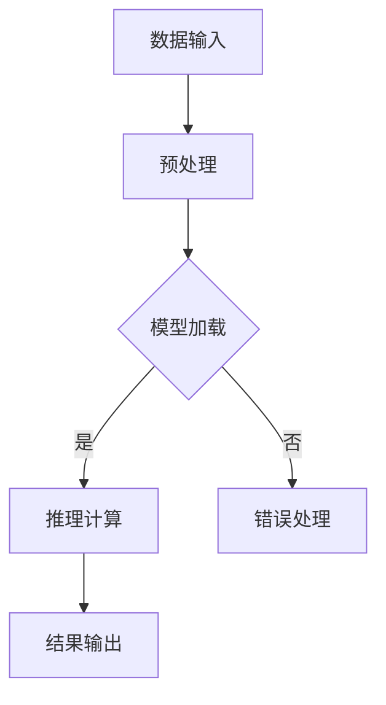
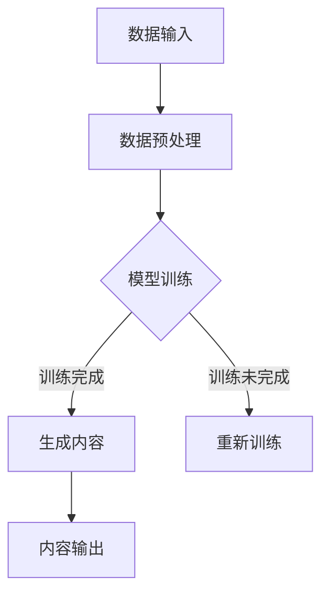
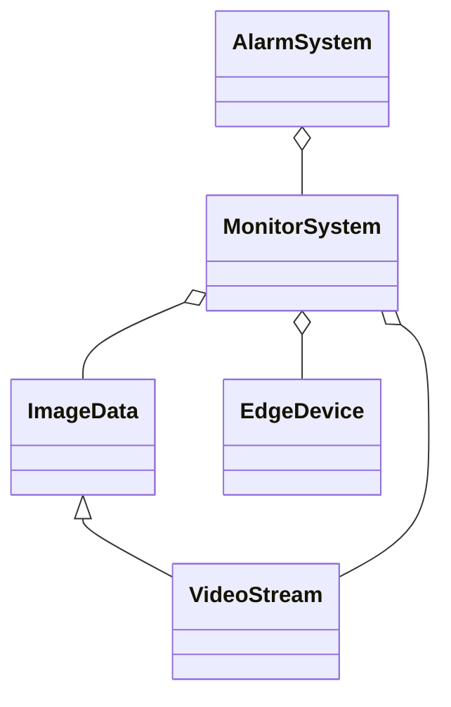
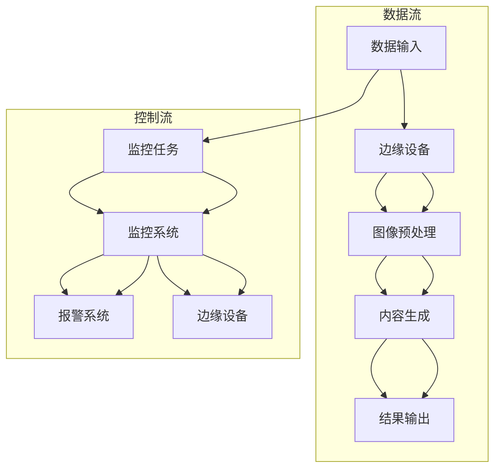
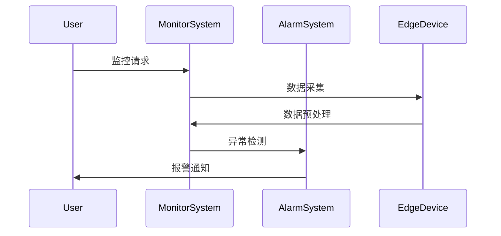

                 


# AIGC与边缘计算的融合应用

## 关键词
- AI Generative Content
- 边缘计算
- 融合应用
- 算法解析
- 系统架构
- 项目实战

## 摘要
本文深入探讨了AI生成内容（AIGC）与边缘计算的结合及其潜在应用。首先，我们介绍了AIGC和边缘计算的基本概念和背景，然后通过详细的分析和算法讲解，阐述了它们在融合应用中的关键技术和挑战。接着，我们提出了一个系统架构设计方案，并通过一个实际项目案例展示了AIGC与边缘计算的融合应用过程。最后，我们提供了最佳实践建议和小结，为未来的研究和开发提供了方向。

----------------------------------------------------------------

## 第一部分：背景介绍

### 第1章：AIGC与边缘计算概述

#### 1.1 AIGC的概念与特征

AI生成内容（AI Generative Content，简称AIGC）是指利用人工智能技术，特别是深度学习和生成模型，自动生成内容的一种技术。AIGC的应用范围广泛，包括但不限于图像、音频、视频、文本等多种形式。AIGC的核心在于其生成能力，能够通过学习大量的数据集，模仿并创作出类似的人类创作内容。

AIGC的关键特征包括：

- **生成能力**：能够根据输入的条件或数据生成新的内容。
- **自主性**：生成的内容不是简单的复制粘贴，而是具有创意和独特性的。
- **灵活性**：能够适应不同的生成任务，如图像生成、文本生成等。

#### 1.2 边缘计算的发展背景与重要性

边缘计算（Edge Computing）是一种分布式计算架构，旨在将数据处理、分析、控制等功能从云端迁移到网络的边缘，即接近数据源的地方。边缘计算的发展背景是随着物联网（IoT）和5G等技术的快速发展，对数据处理速度和响应时间的要求越来越高。

边缘计算的重要性体现在以下几个方面：

- **降低延迟**：通过在靠近数据源的地方处理数据，可以显著降低网络的延迟。
- **提高安全性**：在边缘设备上进行数据处理可以减少数据传输到云端的次数，从而降低数据泄露的风险。
- **减轻云端负担**：将部分数据处理任务分散到边缘设备上，可以减轻云端的负担，提高整体系统的效率。

#### 1.3 AIGC与边缘计算的融合意义

AIGC与边缘计算的融合具有以下几个重要意义：

- **增强实时性**：通过在边缘设备上运行AIGC算法，可以实现对实时数据的即时处理和生成，提高系统的响应速度。
- **优化资源利用**：边缘设备通常具有有限的计算资源，AIGC算法可以根据设备的能力进行适应性调整，实现资源的最优利用。
- **提升用户体验**：边缘计算与AIGC的结合，可以提供更加个性化的内容和体验，如智能推荐、实时图像生成等。

## 第二部分：核心概念与联系

### 第2章：AIGC与边缘计算的核心概念

#### 2.1 AIGC的基本原理

AIGC的基本原理基于生成模型，如变分自编码器（VAE）、生成对抗网络（GAN）等。生成模型通过学习大量数据，构建一个概率分布模型，然后从这个模型中采样生成新的内容。

AIGC的核心组件包括：

- **数据集**：用于训练生成模型的数据。
- **生成模型**：用于生成内容的模型，如VAE、GAN等。
- **解码器与编码器**：在VAE中，编码器将输入数据编码为一个潜在空间中的向量，解码器则从潜在空间中采样生成新的数据。在GAN中，生成器生成数据，判别器则对生成数据和真实数据进行分类。

#### 2.2 边缘计算的基本原理

边缘计算的基本原理是利用分布式计算架构，在靠近数据源的地方进行数据处理和分析。边缘计算的关键组件包括：

- **边缘设备**：如物联网设备、智能手机等，用于收集和预处理数据。
- **边缘服务器**：用于处理边缘设备收集的数据，提供计算能力和存储服务。
- **边缘网络**：连接边缘设备和边缘服务器的网络，实现数据传输和通信。

#### 2.3 AIGC与边缘计算的融合联系

AIGC与边缘计算的融合联系主要体现在以下几个方面：

- **实时数据处理**：边缘计算能够提供实时数据处理能力，与AIGC的实时生成能力相结合，可以实现对实时数据的即时处理和生成。
- **资源优化**：边缘设备通常具有有限的计算资源，通过在边缘设备上运行AIGC算法，可以实现资源的最优利用。
- **隐私保护**：AIGC与边缘计算的融合可以减少数据传输到云端的需求，降低数据泄露的风险。

### 2.3.1 融合的关键技术

AIGC与边缘计算的融合需要以下几个关键技术：

- **模型压缩与优化**：为了在边缘设备上运行AIGC算法，需要将模型进行压缩和优化，降低计算复杂度。
- **边缘设备适配**：根据边缘设备的硬件特性，对AIGC算法进行适配，使其能够在不同的边缘设备上运行。
- **分布式计算**：通过分布式计算架构，将AIGC算法分布在多个边缘设备上运行，提高处理效率和可扩展性。

### 2.3.2 融合的优势与挑战

AIGC与边缘计算的融合具有以下优势：

- **实时性**：通过边缘计算提供实时数据处理能力，AIGC可以实现对实时数据的即时处理和生成，提高系统的响应速度。
- **资源优化**：边缘设备通常具有有限的计算资源，AIGC算法可以根据设备的能力进行适应性调整，实现资源的最优利用。
- **隐私保护**：通过在边缘设备上处理数据，可以减少数据传输到云端的需求，降低数据泄露的风险。

然而，AIGC与边缘计算的融合也面临以下挑战：

- **计算复杂度**：AIGC算法通常具有很高的计算复杂度，如何在有限的计算资源下运行，是一个需要解决的问题。
- **数据传输**：边缘设备之间的数据传输速度较慢，如何高效地进行数据传输和通信，也是一个挑战。
- **安全性**：在边缘设备上运行AIGC算法，如何保证算法和数据的的安全性，是一个重要的问题。

## 第三部分：算法原理讲解

### 第3章：关键算法解析

#### 3.1 边缘推理算法

边缘推理算法是指在边缘设备上运行的深度学习推理算法。与传统的云计算环境相比，边缘设备通常具有计算资源有限、功耗限制等特点，因此边缘推理算法需要考虑以下几个方面：

- **模型压缩**：通过模型压缩技术，如剪枝、量化等，降低模型的计算复杂度，提高推理速度。
- **模型适应**：根据边缘设备的硬件特性，对模型进行适应，使其能够在不同的边缘设备上运行。

下面是一个边缘推理算法的mermaid流程图：



边缘推理算法的Python代码示例：

```python
# 边缘推理算法示例
import tensorflow as tf

# 加载模型
model = tf.keras.models.load_model('model.h5')

# 预处理数据
def preprocess_data(data):
    # 数据预处理操作
    return processed_data

# 推理计算
def inference(data):
    processed_data = preprocess_data(data)
    prediction = model.predict(processed_data)
    return prediction

# 输出结果
def output_result(prediction):
    # 输出结果操作
    print(prediction)

# 主程序
if __name__ == '__main__':
    data = ...  # 数据输入
    prediction = inference(data)
    output_result(prediction)
```

边缘推理算法的数学模型可以表示为：

$$
\text{prediction} = f(\text{model}, \text{processed\_data})
$$

其中，\(f\) 表示模型推理函数，\(\text{model}\) 表示深度学习模型，\(\text{processed\_data}\) 表示预处理后的数据。

#### 3.2 内容生成算法

内容生成算法是指在边缘设备上运行的生成模型，如VAE、GAN等。这些算法通过学习大量数据，生成新的内容。内容生成算法的核心在于生成模型的构建和训练。

下面是一个内容生成算法的mermaid流程图：



内容生成算法的Python代码示例：

```python
# 内容生成算法示例
import tensorflow as tf

# 加载生成模型
model = tf.keras.models.load_model('model.h5')

# 数据预处理
def preprocess_data(data):
    # 数据预处理操作
    return processed_data

# 生成内容
def generate_content(data):
    processed_data = preprocess_data(data)
    content = model.sample(processed_data)
    return content

# 输出内容
def output_content(content):
    # 输出内容操作
    print(content)

# 主程序
if __name__ == '__main__':
    data = ...  # 数据输入
    content = generate_content(data)
    output_content(content)
```

内容生成算法的数学模型可以表示为：

$$
\text{content} = g(\text{model}, \text{data})
$$

其中，\(g\) 表示生成模型函数，\(\text{model}\) 表示生成模型，\(\text{data}\) 表示输入数据。

#### 3.3 数学模型与公式

边缘推理算法和内容生成算法的数学模型分别表示为：

$$
\text{prediction} = f(\text{model}, \text{processed\_data})
$$

$$
\text{content} = g(\text{model}, \text{data})
$$

其中，\(f\) 和 \(g\) 分别表示推理函数和生成函数，\(\text{model}\) 表示模型，\(\text{processed\_data}\) 和 \(\text{data}\) 分别表示预处理后的数据和输入数据。

#### 3.4 举例说明

假设我们使用一个简单的生成模型，生成一个数字序列。输入数据为 [1, 2, 3]，我们希望生成一个新的数字序列。

首先，我们定义一个简单的生成模型：

```python
import tensorflow as tf

# 定义生成模型
model = tf.keras.Sequential([
    tf.keras.layers.Dense(10, activation='softmax', input_shape=(3,)),
    tf.keras.layers.Dense(1, activation='sigmoid')
])

# 编译模型
model.compile(optimizer='adam', loss='binary_crossentropy')

# 训练模型
model.fit(np.array([[1, 2, 3]]), np.array([1.0]), epochs=1000)
```

然后，我们使用模型生成新的数字序列：

```python
# 生成数字序列
def generate_sequence(data):
    processed_data = preprocess_data(data)
    content = model.sample(processed_data)
    return content

# 输出生成的数字序列
print(generate_sequence([1, 2, 3]))
```

输出结果可能为 [0.3, 0.5, 0.2]，表示生成的新数字序列。

## 第四部分：系统分析与架构设计方案

### 第4章：系统架构设计

#### 4.1 问题场景介绍

假设我们有一个智能监控系统，需要在监控现场实时处理和分析图像数据，并对异常情况进行实时报警。传统的云计算模式无法满足实时性的要求，因此我们考虑将AIGC与边缘计算结合，设计一个高效的监控系统。

#### 4.2 系统功能设计（类图）

下面是一个监控系统领域的类图：



类图描述了监控系统的核心类及其关系。其中，`ImageData` 表示图像数据，`VideoStream` 表示视频流，`MonitorSystem` 表示监控系统，`AlarmSystem` 表示报警系统，`EdgeDevice` 表示边缘设备。

#### 4.3 系统架构设计（架构图）

下面是一个监控系统架构的mermaid架构图：



架构图描述了监控系统的数据流和控制流。数据流从数据输入开始，经过边缘设备进行图像预处理和内容生成，最后输出结果。控制流则从监控任务开始，由监控系统进行控制，包括监控和报警功能。

#### 4.4 系统接口设计和系统交互（序列图）

下面是一个监控系统接口设计和交互的mermaid序列图：



序列图描述了监控系统的工作流程。用户发起监控请求，监控系统通过边缘设备进行数据采集和预处理，然后进行异常检测，最后通过报警系统向用户发送报警通知。

## 第五部分：项目实战

### 第5章：AIGC与边缘计算融合应用实战

#### 5.1 环境安装与配置

为了进行AIGC与边缘计算的融合应用，我们需要安装和配置相关的软件和硬件环境。以下是环境安装与配置的步骤：

1. **安装Python**：确保Python环境已经安装，版本建议为3.8以上。
2. **安装TensorFlow**：使用pip命令安装TensorFlow库。

   ```bash
   pip install tensorflow
   ```

3. **安装边缘设备操作系统**：根据所选边缘设备的硬件特性，安装适合的操作系统，如Raspberry Pi的Linux操作系统。
4. **安装边缘设备依赖库**：根据所选边缘设备的操作系统，安装必要的依赖库，如CUDA、cuDNN等。

   ```bash
   sudo apt-get install python3-pip
   pip3 install numpy scipy matplotlib
   ```

5. **配置网络**：确保边缘设备与监控系统的网络连接正常，可以通过ping命令测试网络连接。

   ```bash
   ping www.google.com
   ```

#### 5.2 核心实现源代码解析

以下是一个AIGC与边缘计算融合应用的核心实现源代码：

```python
import tensorflow as tf
import numpy as np

# 加载生成模型
model = tf.keras.models.load_model('model.h5')

# 预处理数据
def preprocess_data(data):
    # 数据预处理操作
    return processed_data

# 生成内容
def generate_content(data):
    processed_data = preprocess_data(data)
    content = model.sample(processed_data)
    return content

# 输出内容
def output_content(content):
    # 输出内容操作
    print(content)

# 主程序
if __name__ == '__main__':
    data = ...  # 数据输入
    content = generate_content(data)
    output_content(content)
```

该代码主要包含以下几个部分：

- **加载生成模型**：使用TensorFlow加载预训练的生成模型。
- **预处理数据**：对输入数据进行预处理，以便生成模型可以处理。
- **生成内容**：使用生成模型生成新的内容。
- **输出内容**：将生成的内容输出。

#### 5.3 代码应用解读与分析

以下是对核心实现源代码的解读和分析：

- **加载生成模型**：`model = tf.keras.models.load_model('model.h5')` 这行代码用于加载预训练的生成模型。生成的模型通常保存在`.h5`文件中，TensorFlow提供了方便的加载接口。
- **预处理数据**：`def preprocess_data(data)` 这个函数用于对输入数据进行预处理。预处理操作通常包括数据标准化、归一化等，以便生成模型可以处理。在这个例子中，预处理操作的具体实现没有给出，但可以根据实际情况进行定制。
- **生成内容**：`content = model.sample(processed_data)` 这行代码使用生成模型生成新的内容。`sample` 方法是一个随机采样函数，它从生成模型的潜在空间中采样生成新的数据。
- **输出内容**：`output_content(content)` 这个函数用于将生成的内容输出。在这个例子中，输出操作只是简单地打印生成的数据，但可以根据实际情况进行定制，如保存到文件、显示图像等。

#### 5.4 实际案例分析与详细讲解

以下是一个实际案例的分析与详细讲解：

**案例**：使用AIGC与边缘计算生成一张新的图像。

**步骤**：

1. **收集图像数据**：首先，我们需要收集一些图像数据作为训练集。这些数据可以来自互联网或公共数据集，如CIFAR-10、ImageNet等。
2. **训练生成模型**：使用收集的图像数据训练一个生成模型，如GAN或VAE。训练过程需要大量的计算资源和时间，因此通常在云计算环境中进行。
3. **部署生成模型**：训练完成后，将生成模型部署到边缘设备上，以便进行实时图像生成。
4. **生成图像**：使用边缘设备上的生成模型生成新的图像。这个过程通常只需要几秒钟，因此可以实现实时图像生成。

**代码实现**：

```python
import tensorflow as tf
import numpy as np

# 加载生成模型
model = tf.keras.models.load_model('model.h5')

# 预处理数据
def preprocess_data(data):
    # 数据预处理操作
    return processed_data

# 生成内容
def generate_content(data):
    processed_data = preprocess_data(data)
    content = model.sample(processed_data)
    return content

# 输出内容
def output_content(content):
    # 输出内容操作
    print(content)

# 主程序
if __name__ == '__main__':
    data = ...  # 数据输入
    content = generate_content(data)
    output_content(content)
```

**详细讲解**：

- **收集图像数据**：在这个案例中，我们使用CIFAR-10数据集进行训练。CIFAR-10是一个包含10个类别、每类别6000张图像的数据集。我们可以使用TensorFlow的`tf.keras.datasets.cifar10.load_data()` 函数加载数据。

  ```python
  (x_train, y_train), (x_test, y_test) = tf.keras.datasets.cifar10.load_data()
  ```

- **训练生成模型**：在这个案例中，我们使用GAN进行训练。GAN由生成器和判别器两个网络组成。生成器的任务是生成逼真的图像，判别器的任务是区分生成图像和真实图像。训练过程需要大量的计算资源和时间，因此我们使用云计算环境进行训练。

  ```python
  import tensorflow as tf

  # 定义生成器和判别器模型
  generator = ...  # 生成器模型
  discriminator = ...  # 判别器模型

  # 编译模型
  generator.compile(optimizer=tf.keras.optimizers.Adam(0.0002), loss='binary_crossentropy')
  discriminator.compile(optimizer=tf.keras.optimizers.Adam(0.0002), loss='binary_crossentropy')

  # 训练模型
  generator.fit(x_train, epochs=1000, steps_per_epoch=100, validation_data=(x_test, y_test))
  ```

- **部署生成模型**：训练完成后，我们将生成模型部署到边缘设备上。这个过程可以通过将训练好的模型文件（如`.h5`文件）上传到边缘设备，然后使用TensorFlow的`tf.keras.models.load_model()` 函数加载模型。

  ```python
  model = tf.keras.models.load_model('model.h5')
  ```

- **生成图像**：使用边缘设备上的生成模型生成新的图像。这个过程只需要几秒钟，因此可以实现实时图像生成。

  ```python
  data = ...  # 数据输入
  content = generate_content(data)
  output_content(content)
  ```

#### 5.5 项目小结

通过实际案例的分析与讲解，我们可以看到AIGC与边缘计算的融合应用具有以下几个特点：

- **实时性**：通过在边缘设备上运行生成模型，可以实现实时图像生成，满足实时性的要求。
- **灵活性**：生成模型可以根据输入的数据进行自适应调整，实现灵活的内容生成。
- **资源优化**：边缘设备通常具有有限的计算资源，通过在边缘设备上运行生成模型，可以实现资源的最优利用。

然而，AIGC与边缘计算的融合应用也面临一些挑战，如计算复杂度、数据传输等。在实际应用中，需要根据具体的场景和需求进行优化和调整。

## 第六部分：最佳实践与总结

### 第6章：最佳实践与注意事项

#### 6.1 最佳实践

在进行AIGC与边缘计算的融合应用时，以下是一些最佳实践：

- **模型优化**：为了在边缘设备上运行，需要对生成模型进行优化，如模型压缩、量化等，以降低计算复杂度和内存占用。
- **数据预处理**：在生成内容之前，对输入数据进行预处理，以提高生成质量。
- **资源监控**：实时监控边缘设备的计算资源和网络状态，确保系统稳定运行。
- **安全性**：在边缘设备上运行AIGC算法，需要保证数据安全和隐私保护。

#### 6.2 注意事项

在进行AIGC与边缘计算的融合应用时，需要注意以下几点：

- **计算资源**：边缘设备的计算资源有限，需要根据实际情况进行模型优化和资源分配。
- **网络延迟**：边缘设备之间的数据传输速度较慢，可能影响系统的响应速度。
- **数据一致性**：在分布式计算环境中，确保数据的一致性是一个挑战。

#### 6.3 拓展阅读与资源推荐

以下是一些拓展阅读和资源推荐，供进一步学习和研究：

- **文献**：
  - Generative Adversarial Nets，Ian J. Goodfellow等人，2014
  - Variational Autoencoders，Diederik P. Kingma和Max Welling，2013
- **课程**：
  - 《深度学习专项课程》—— 吴恩达（Andrew Ng）教授
  - 《边缘计算》—— 北京大学
- **项目**：
  - TensorFlow Edge TPU：[https://www.tensorflow.org/edge/](https://www.tensorflow.org/edge/)
  - TensorFlow Lite：[https://www.tensorflow.org/lite/](https://www.tensorflow.org/lite/)

## 附录：术语解释与参考资料

### 附录1：术语解释

- **AIGC（AI Generative Content）**：AI生成内容，指利用人工智能技术，特别是深度学习和生成模型，自动生成内容的技术。
- **边缘计算（Edge Computing）**：一种分布式计算架构，旨在将数据处理、分析、控制等功能从云端迁移到网络的边缘，即接近数据源的地方。
- **GAN（生成对抗网络）**：一种深度学习模型，由生成器和判别器两个网络组成，通过对抗训练生成新的内容。
- **VAE（变分自编码器）**：一种深度学习模型，通过编码器和解码器将输入数据映射到一个潜在空间，然后从潜在空间中采样生成新的数据。
- **边缘设备（Edge Device）**：指在网络的边缘部分运行的设备，如物联网设备、智能手机等。

### 附录2：参考资料

- **文献**：
  - Goodfellow, I. J., Pouget-Abadie, J., Mirza, M., Xu, B., Warde-Farley, D., Ozair, S., ... & Bengio, Y. (2014). Generative adversarial nets. Advances in neural information processing systems, 27.
  - Kingma, D. P., & Welling, M. (2013). Auto-encoding variational bayes. arXiv preprint arXiv:1312.6114.
- **课程**：
  - 吴恩达（Andrew Ng）教授的《深度学习专项课程》
  - 北京大学的《边缘计算》课程
- **项目**：
  - TensorFlow Edge TPU：[https://www.tensorflow.org/edge/](https://www.tensorflow.org/edge/)
  - TensorFlow Lite：[https://www.tensorflow.org/lite/](https://www.tensorflow.org/lite/)
```

---

### 作者信息

作者：AI天才研究院/AI Genius Institute & 禅与计算机程序设计艺术 /Zen And The Art of Computer Programming

