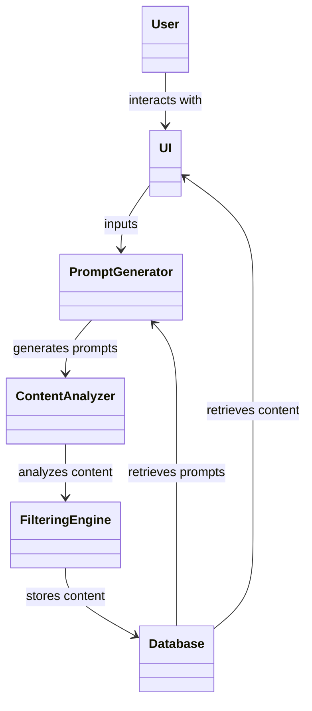
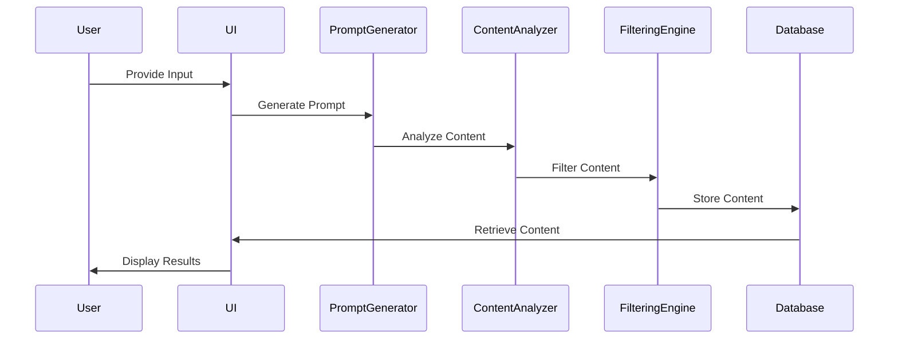
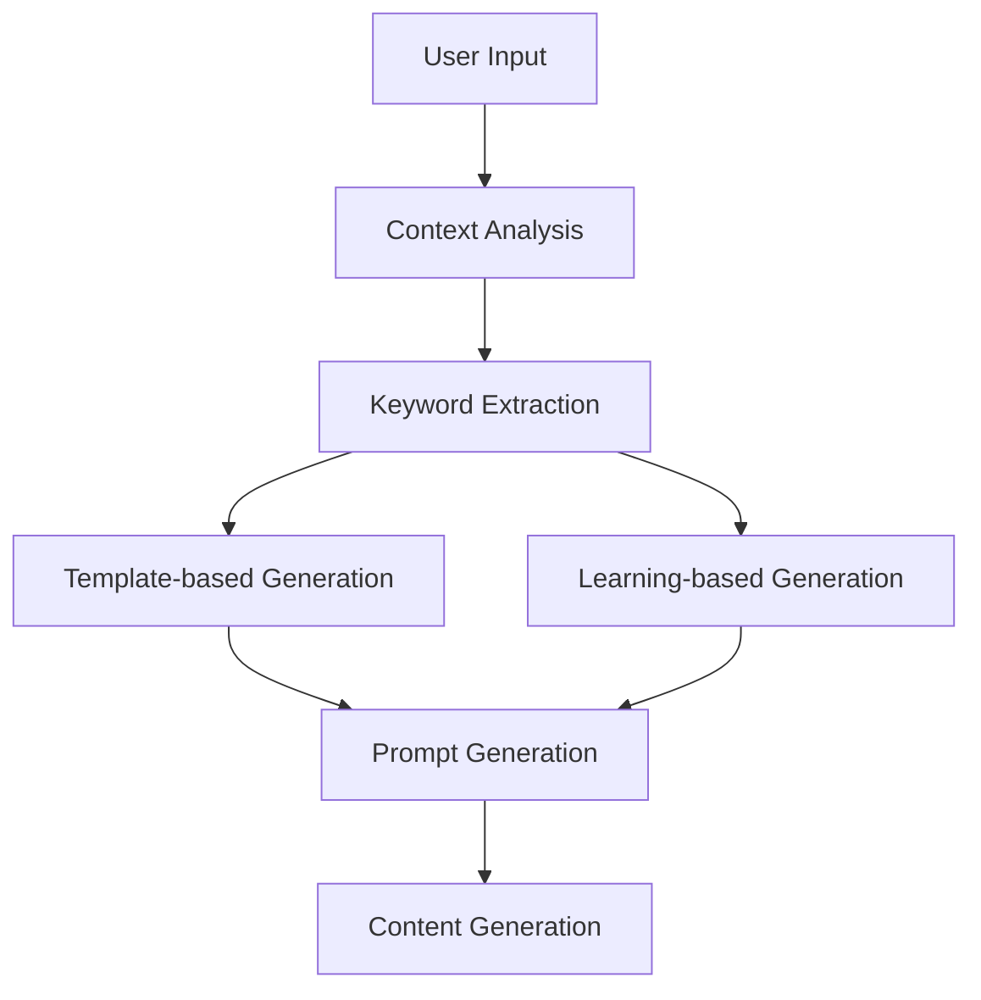
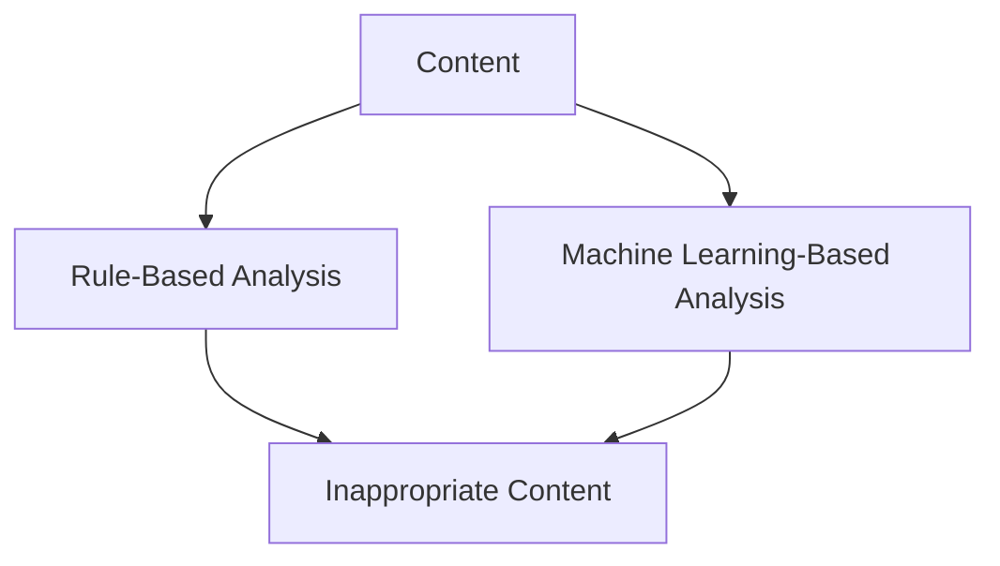
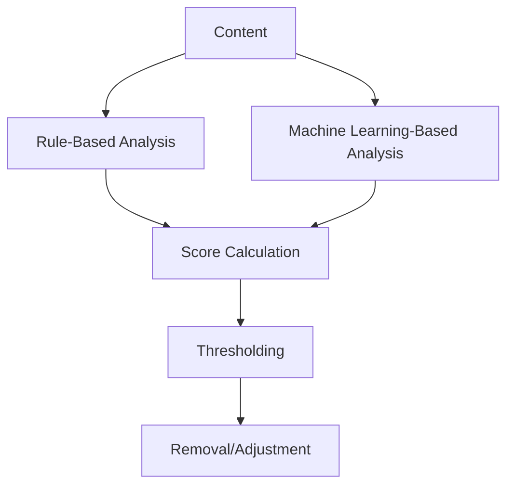
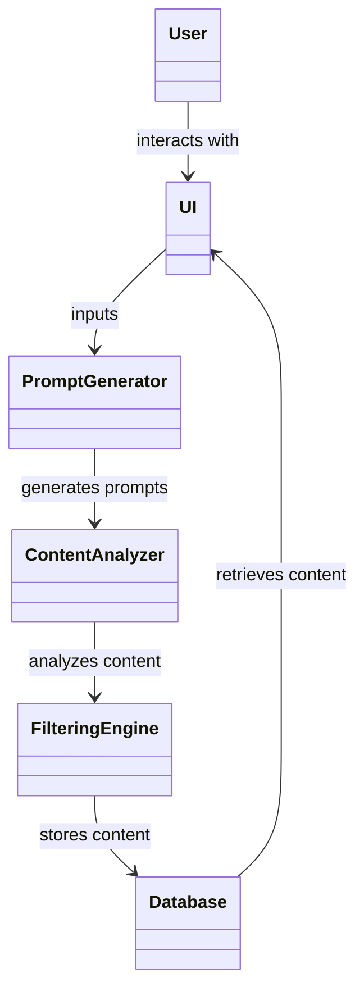

                 


## AIGC Content Moderation: Designing a Secure and Controllable Prompt System

### Keywords

- **AIGC**
- **Content Moderation**
- **Prompt System**
- **Algorithm**
- **System Design**
- **Security**

### Abstract

In this article, we delve into the design of a secure and controllable prompt system for AIGC content moderation. We begin with a comprehensive background introduction to AIGC and content moderation, outlining the problems faced and the importance of addressing these challenges. We then proceed to explore the core concepts, their relationships, and the mathematical models underlying content moderation. Following this, we delve into the design principles and algorithms for the prompt system, along with a detailed system architecture and implementation strategy. Finally, we present a practical project and discuss best practices for securing and controlling prompt systems.

### 1. Introduction to AIGC and Content Moderation

#### 1.1 Background

##### 1.1.1 The Rise of AIGC

AIGC, or Artificial Intelligence Generated Content, is a rapidly evolving field that leverages advanced AI technologies to generate various forms of content, including text, images, and videos. With the advancements in deep learning, natural language processing (NLP), and computer vision, AIGC has found applications in various domains, from content creation and marketing to entertainment and education.

##### 1.1.2 The Importance of Content Moderation

As AIGC technologies become more sophisticated, the issue of content moderation has become increasingly crucial. Content moderation is the process of identifying and removing inappropriate or harmful content from digital platforms. The rise of social media and online platforms has created a fertile ground for the spread of misinformation, hate speech, and explicit content. Effective content moderation is essential for maintaining a safe and respectful online environment.

##### 1.1.3 Challenges in Content Moderation

Content moderation faces several challenges, including:

- **Volume**: The sheer volume of content generated daily is overwhelming for traditional moderation methods.
- **Ambiguity**: The interpretation of content can be subjective and varies across different cultures and communities.
- **Speed**: Content moderation needs to be fast to keep up with the rapid pace of content generation.
- **Bias**: Algorithms used for content moderation can introduce bias, leading to unfair treatment of certain groups or individuals.

#### 1.2 Problem Definition and Solution Approach

##### 1.2.1 Problem Definition

The problem we aim to solve is the design and implementation of a secure and controllable prompt system for AIGC content moderation. A prompt system is an AI-driven system that generates textual or visual prompts to guide the generation of content. The goal is to create a system that can effectively moderate content while minimizing false positives and negatives.

##### 1.2.2 Solution Approach

Our approach involves several key steps:

1. **Core Concept Explanation**: We will explain the core concepts of AIGC and content moderation, providing a foundation for understanding the problem.
2. **Algorithm Principles**: We will explore the principles of prompt generation and filtering algorithms, using Mermaid diagrams and Python code examples to illustrate.
3. **Mathematical Models**: We will discuss the mathematical models and formulas used in content moderation, providing a deeper understanding of the underlying principles.
4. **System Design**: We will design a secure and controllable prompt system architecture, detailing the functional modules and interfaces.
5. **Practical Projects**: We will present a practical project to demonstrate the implementation of the prompt system.
6. **Best Practices**: We will discuss best practices for securing and controlling prompt systems, highlighting key considerations and potential pitfalls.

##### 1.2.3 Boundaries and Scope

The scope of this article is to provide a comprehensive guide to designing a secure and controllable prompt system for AIGC content moderation. We will not delve into the technical details of existing content moderation systems or specific AI algorithms but will focus on the design and implementation aspects.

#### 1.3 Core Concepts and Relationships

##### 1.3.1 Core Concepts

- **AIGC**: AI-generated content, involving the use of deep learning and NLP techniques to create textual or visual content.
- **Content Moderation**: The process of identifying and removing inappropriate or harmful content from digital platforms.
- **Prompt System**: An AI-driven system that generates prompts to guide content generation.

##### 1.3.2 Relationship Between Concepts

AIGC and content moderation are closely related, with the prompt system acting as an intermediary. The prompt system generates prompts that guide the generation of content by AIGC models, and these prompts need to be carefully designed to ensure the generated content is appropriate and respectful.

##### 1.3.3 Concept Attributes and Comparison Table

| Concept       | Definition                                                     | Attributes                             |
|---------------|--------------------------------------------------------------|---------------------------------------|
| AIGC          | AI-generated content                                          | Text, image, video generation         |
| Content Moderation | Process of identifying and removing inappropriate content | Subjectivity, volume, speed            |
| Prompt System | AI-driven system for content generation                     | Prompt generation, filtering, evaluation |

##### 1.3.4 Entity-Relationship Diagram

```
 ER Diagram
|[User]
|  +------------+------------+-----------+
|  |  Content   |  Prompt    |  Model    |
|  +------------+------------+-----------+
|  |  +id        |  +id        |  +id       |
|  |  +text      |  +text      |  +type     |
|  |  +status    |  +status    |  +trained  |
|  |  +created_at|  +created_at|  +created_at|
|  +------------+------------+-----------+
```

#### 1.4 Mathematical Models and Principles

##### 1.4.1 Mathematical Model

The mathematical model for content moderation can be represented as follows:

$$
\text{Score} = f(\text{Content}, \text{Prompt}, \text{Model})
$$

where `f` is a function that computes a score based on the content, prompt, and model. The score indicates the likelihood of the content being inappropriate or harmful.

##### 1.4.2 Model Principles

The model principles involve:

- **Content Analysis**: Analyzing the content to identify potential issues.
- **Prompt Generation**: Generating prompts that guide the content generation process.
- **Model Training**: Training AI models to recognize and classify content based on the prompts.

##### 1.4.3 Example

Consider a scenario where a user generates a piece of text. The prompt system generates a prompt to guide the text generation. The AI model then analyzes the generated text and computes a score based on the content, prompt, and model. If the score exceeds a predefined threshold, the content is flagged as inappropriate.

#### 1.5 Summary

In this chapter, we provided a comprehensive introduction to AIGC and content moderation, defining the problem and outlining our solution approach. We explored the core concepts and their relationships, discussed the mathematical models and principles, and provided a comparison table and ER diagram. This foundation will guide us in the subsequent chapters, where we delve into the design and implementation of the secure and controllable prompt system.

----------------------------------------------------------------

## 2. Overview of the Prompt System

### 2.1 The Role and Design Principles of the Prompt System

The prompt system plays a crucial role in AIGC content moderation by generating prompts that guide the generation of content. These prompts are designed to ensure that the content produced adheres to ethical standards, cultural norms, and platform guidelines. The design principles of the prompt system are centered around ensuring security, controllability, and effectiveness.

#### 2.1.1 The Role of the Prompt System

The primary role of the prompt system is to:

- **Generate Prompts**: Create textual or visual prompts that guide the generation of content by AIGC models.
- **Filter Content**: Apply filters to ensure that the generated content is appropriate and respectful.
- **Adjust Prompts**: Continuously adjust prompts based on feedback and evolving guidelines to improve content moderation.

#### 2.1.2 Design Principles

The design principles of the prompt system include:

- **Security**: The system must be secure to prevent unauthorized access and ensure data privacy.
- **Controllability**: The system should be easy to control and adjust, allowing for fine-tuning of the prompts.
- **Effectiveness**: The system must be effective in identifying and filtering inappropriate content.

#### 2.1.3 Security Considerations

Security is a critical aspect of the prompt system design. Key security considerations include:

- **Access Control**: Implementing robust access control mechanisms to ensure only authorized personnel can access sensitive data.
- **Data Encryption**: Encrypting data in transit and at rest to protect against unauthorized access.
- **Audit Trails**: Maintaining detailed audit logs to monitor and track system activities for accountability.

### 2.2 Prompt Generation Algorithms

The prompt generation algorithms are at the heart of the prompt system. These algorithms generate prompts based on user input, context, and predefined guidelines. The key components of prompt generation algorithms include:

- **Natural Language Processing (NLP)**: Utilizing NLP techniques to analyze user input and generate context-aware prompts.
- **Machine Learning**: Training machine learning models to predict appropriate prompts based on historical data and user preferences.
- **Rule-Based Systems**: Incorporating rule-based systems to generate prompts based on predefined rules and guidelines.

#### 2.2.1 Algorithm Steps

The typical steps involved in prompt generation algorithms are:

1. **Input Analysis**: Analyzing the user input to understand the context and intent.
2. **Contextual Prompt Generation**: Generating prompts that are relevant to the user input and context.
3. **User Feedback Loop**: Incorporating user feedback to refine and improve the prompts over time.

### 2.3 Prompt Filtering Algorithms

Once prompts are generated, they need to be filtered to ensure that the content generated adheres to platform guidelines and ethical standards. The prompt filtering algorithms perform the following tasks:

- **Content Analysis**: Analyzing the generated content to identify potential issues.
- **Rule-Based Filtering**: Applying predefined rules to filter out inappropriate content.
- **Machine Learning-Based Filtering**: Utilizing machine learning models to classify and filter content based on patterns and indicators.

#### 2.3.1 Filtering Process

The filtering process typically involves:

1. **Content Scoring**: Assigning a score to the generated content based on its adherence to guidelines.
2. **Thresholding**: Setting a threshold score above which content is considered inappropriate.
3. **Removal or Adjustment**: Removing or adjusting the content based on the score and guidelines.

### 2.4 Prompt Evaluation and Adjustment

Prompt evaluation and adjustment are crucial for ensuring the effectiveness of the prompt system. The process involves:

- **Performance Metrics**: Defining performance metrics to evaluate the effectiveness of the prompts.
- **User Feedback**: Collecting user feedback to identify areas for improvement.
- **Continuous Learning**: Incorporating user feedback and performance metrics into the system to continuously refine the prompts.

### 2.5 Summary

In this chapter, we provided an overview of the prompt system, discussing its role, design principles, and the algorithms involved in prompt generation and filtering. We highlighted the importance of security considerations and outlined the process for prompt evaluation and adjustment. The subsequent chapters will delve deeper into the technical aspects of the prompt system, including system architecture and implementation strategies.

----------------------------------------------------------------

## 3. Designing the Secure and Controllable Prompt System Architecture

### 3.1 System Function Design

The design of the secure and controllable prompt system involves defining the functional modules that will work together to ensure effective content moderation. The key functional modules include:

- **User Interface (UI)**: The front-end component that allows users to interact with the system and generate prompts.
- **Prompt Generator**: The module responsible for generating prompts based on user input and predefined guidelines.
- **Content Analyzer**: The module that analyzes the generated content to identify potential issues.
- **Filtering Engine**: The module that applies rules and machine learning models to filter out inappropriate content.
- **Database**: The backend database that stores user-generated prompts, content, and system configuration.

#### 3.1.1 Domain Model Design

To design the domain model for the prompt system, we can use Mermaid to create a class diagram that illustrates the relationships between the various modules:



This diagram outlines the main interactions between the components of the prompt system, showing how they collaborate to generate and filter content.

#### 3.1.2 Functional Module Division

The division of functional modules is crucial for ensuring that each component has a clear and specific role within the system. Here's a breakdown of each module:

- **User Interface (UI)**: Manages user interactions, input validation, and prompt display.
- **Prompt Generator**: Handles the generation of prompts using NLP and machine learning techniques.
- **Content Analyzer**: Analyzes generated content to identify inappropriate or harmful elements.
- **Filtering Engine**: Implements rule-based and machine learning-based filtering methods to clean up content.
- **Database**: Manages the storage and retrieval of prompts and content, ensuring data integrity and security.

### 3.2 System Architecture Design

The system architecture is designed to ensure that the prompt system is scalable, secure, and maintainable. We use Mermaid to illustrate the system architecture with a sequence diagram that shows the interactions between the system components:



This diagram demonstrates the flow of data and control between the different modules, highlighting the steps involved in generating, analyzing, and filtering prompts.

#### 3.2.1 Architecture Design Principles

The architecture design principles include:

- **Modularity**: Each module should be independent and interchangeable to facilitate maintenance and upgrades.
- **Scalability**: The system should be designed to handle increasing volumes of content and users.
- **Security**: Implementing robust security measures to protect against unauthorized access and data breaches.
- **Reliability**: Ensuring that the system is highly available and can recover quickly from failures.

### 3.3 System Interface Design

Designing clear and well-defined system interfaces is essential for enabling seamless communication between different components. The system interface design includes:

- **API Documentation**: Providing comprehensive documentation for all APIs used in the system, including request and response formats.
- **Authentication and Authorization**: Implementing authentication and authorization mechanisms to ensure that only authorized users can access sensitive data and functionalities.
- **Error Handling**: Defining clear error handling protocols to manage exceptions and provide informative error messages.

#### 3.3.1 Interface Design Specification

An example of an interface design specification for the prompt system might include:

- **Prompt Generation API**: `/generatePrompt` - Generates a prompt based on user input.
- **Content Analysis API**: `/analyzeContent` - Analyzes the generated content and returns a score.
- **Filtering API**: `/filterContent` - Filters content based on predefined rules and machine learning models.
- **Database Access API**: `/getContent` - Retrieves content from the database.

### 3.4 System Interaction Design

The system interaction design ensures that the various components of the prompt system work together seamlessly to achieve the desired functionality. We use Mermaid to create a sequence diagram that illustrates the interaction flow:


This diagram provides a visual representation of the interaction flow, showing how user input is processed through the prompt generation, content analysis, and filtering stages, with the results being returned to the user.

### 3.5 Summary

In this chapter, we have detailed the design of the secure and controllable prompt system architecture. We discussed the functional modules, their division, and the principles guiding the architecture design. We also provided interface design specifications and illustrated the system interaction flow using Mermaid diagrams. The subsequent chapters will delve into the technical implementation of these components, ensuring the system's effectiveness in content moderation.

----------------------------------------------------------------

## 4. Implementation of the Prompt System

### 4.1 System Environment Setup and Configuration

Before diving into the implementation of the prompt system, it is crucial to set up the appropriate environment and configure the necessary tools and libraries. The following steps outline the process for setting up the system environment:

#### 4.1.1 Requirements

To implement the prompt system, you will need the following software and libraries:

- Python 3.x
- pip (Python package installer)
- Flask (Web framework for Python)
- TensorFlow (Machine Learning library)
- NLTK (Natural Language Processing library)
- scikit-learn (Machine Learning library)

#### 4.1.2 Installation Steps

1. **Install Python 3.x**: Ensure that Python 3.x is installed on your system. You can download it from the official [Python website](https://www.python.org/).

2. **Install pip**: Python comes with pip pre-installed, but if you need to install it manually, you can use the following command:

   ```
   $ curl https://bootstrap.pypa.io/get-pip.py -o get-pip.py
   $ python get-pip.py
   ```

3. **Install Flask**:

   ```
   $ pip install Flask
   ```

4. **Install TensorFlow**:

   ```
   $ pip install tensorflow
   ```

5. **Install NLTK**:

   ```
   $ pip install nltk
   ```

6. **Install scikit-learn**:

   ```
   $ pip install scikit-learn
   ```

#### 4.1.3 Configuration

After installing the necessary libraries, you will need to configure the system:

1. **Install Nltk Data**:

   ```
   $ python -m nltk.downloader all
   ```

   This command will download the necessary datasets for NLTK, which are required for NLP tasks.

2. **Create a Virtual Environment**:

   ```
   $ python -m venv venv
   $ source venv/bin/activate  # On Windows, use `venv\Scripts\activate`
   ```

   This step helps manage dependencies for the project and ensures that you do not interfere with other Python projects on your system.

3. **Install Project Dependencies**:

   ```
   $ pip install -r requirements.txt
   ```

   The `requirements.txt` file should list all the required libraries and their versions.

4. **Initialize Database**:

   You may need to initialize the database to store prompts and content. The specific steps for initializing the database will depend on the database system you choose (e.g., SQLite, PostgreSQL, MongoDB).

#### 4.1.4 Summary

Setting up the system environment is a critical step in implementing the prompt system. By following the above steps, you will have a fully configured environment ready for the development and deployment of the prompt system. The next chapter will delve into the core implementation of the prompt system, including the generation, analysis, and filtering of content.

----------------------------------------------------------------

## 5. Core Implementation of the Prompt System

### 5.1 Data Preprocessing

The first step in implementing the prompt system is data preprocessing. This involves collecting and preparing the data sets used for training the models. The quality and quantity of the data significantly impact the performance of the prompt system.

#### 5.1.1 Data Collection

Data collection for the prompt system should include:

- **Labeled Data**: Data that has been manually annotated with appropriate labels indicating appropriate or inappropriate content.
- **Unlabeled Data**: Data that can be used for unsupervised learning or as additional data for semi-supervised learning.
- **Contextual Data**: Additional data that provides context for generating more accurate prompts, such as user preferences, time, and location.

#### 5.1.2 Data Preprocessing Steps

The preprocessing steps for the data sets typically include:

- **Tokenization**: Splitting text into individual words or tokens.
- **Normalization**: Converting text to a standard format (e.g., lowercasing, removing punctuation).
- **Stopword Removal**: Removing common words that do not contribute to the meaning of the text.
- **Vectorization**: Converting text into numerical format that can be used by machine learning algorithms.

### 5.2 Prompt Generation

Prompt generation is a critical component of the prompt system. The goal is to create prompts that are both informative and useful for generating high-quality content. The process involves several steps, including natural language processing and machine learning techniques.

#### 5.2.1 Algorithm Principles

The algorithm principles for prompt generation include:

- **Context Analysis**: Analyzing the context of the user's input to determine the appropriate prompts.
- **Keyword Extraction**: Identifying key terms and phrases in the user's input to generate relevant prompts.
- **Template-based Generation**: Using predefined templates to create prompts, with placeholders for user-specific data.
- **Learning-based Generation**: Training machine learning models to generate prompts based on labeled data and user interactions.

#### 5.2.2 Mermaid Flowchart

The following Mermaid flowchart illustrates the prompt generation process:



This flowchart outlines the steps involved in generating prompts based on user input and the various techniques used.

#### 5.2.3 Python Code Example

Here's a simple Python code example using the Natural Language Toolkit (NLTK) to generate a prompt based on user input:

```python
import nltk
from nltk.tokenize import word_tokenize
from nltk.corpus import stopwords
from nltk.probability import FreqDist

def generate_prompt(user_input):
    # Tokenize the user input
    tokens = word_tokenize(user_input)
    
    # Remove stopwords
    stop_words = set(stopwords.words('english'))
    filtered_tokens = [token for token in tokens if token.lower() not in stop_words]
    
    # Frequency distribution of the filtered tokens
    fdist = FreqDist(filtered_tokens)
    
    # Generate a prompt based on the most frequent words
    prompt = 'Write about ' + ' and '.join(fdist.max().keys())
    
    return prompt

# Example usage
user_input = "What is the significance of machine learning in modern technology?"
prompt = generate_prompt(user_input)
print(prompt)
```

This example uses tokenization, stopword removal, and frequency distribution to generate a prompt based on the user's input.

### 5.3 Content Analysis

Content analysis is the process of analyzing the generated content to determine its appropriateness and quality. This involves both rule-based and machine learning-based methods.

#### 5.3.1 Rule-Based Analysis

Rule-based analysis involves applying predefined rules to the content to identify inappropriate elements. These rules can include:

- **Keyword Lists**: Lists of words or phrases that are known to be inappropriate or offensive.
- **Regex Patterns**: Regular expressions that match patterns indicative of inappropriate content.
- **Threshold Values**: Setting threshold values for various metrics (e.g., sentence length, word count) to identify content that may be of low quality.

#### 5.3.2 Machine Learning-Based Analysis

Machine learning-based analysis involves training models to classify content based on labeled data. Common techniques include:

- **Classification Models**: Classifying content into categories such as appropriate, inappropriate, or low quality.
- **Sentiment Analysis**: Determining the sentiment of the content to identify negative or positive tones.
- **Clustering Algorithms**: Grouping similar content to identify patterns and improve the quality of the analysis.

#### 5.3.3 Mermaid Flowchart

The following Mermaid flowchart illustrates the content analysis process:



This flowchart outlines the steps involved in analyzing content using both rule-based and machine learning-based methods.

#### 5.3.4 Python Code Example

Here's a simple Python code example using the scikit-learn library to classify content as inappropriate or appropriate:

```python
from sklearn.feature_extraction.text import TfidfVectorizer
from sklearn.naive_bayes import MultinomialNB
from sklearn.pipeline import make_pipeline

# Sample data
X_train = ["This is a great article about AI.", "This content is inappropriate and offensive."]
y_train = ["appropriate", "inappropriate"]

# Create a pipeline with a TfidfVectorizer and a Multinomial Naive Bayes classifier
model = make_pipeline(TfidfVectorizer(), MultinomialNB())

# Train the model
model.fit(X_train, y_train)

# Test the model
X_test = ["Is this article inappropriate?"]
predictions = model.predict(X_test)

print(predictions)
```

This example demonstrates how to create a simple text classification model using TF-IDF vectorization and a Multinomial Naive Bayes classifier.

### 5.4 Content Filtering

Content filtering is the process of removing or adjusting content that does not meet the predefined quality or appropriateness standards. This involves combining the results of the content analysis to make informed decisions about the content.

#### 5.4.1 Filtering Process

The filtering process typically includes:

- **Score Aggregation**: Combining scores from rule-based and machine learning-based analysis to determine the overall score of the content.
- **Thresholding**: Setting a threshold score above which content is considered inappropriate or of low quality.
- **Removal or Adjustment**: Removing or adjusting the content based on the overall score.

#### 5.4.2 Mermaid Flowchart

The following Mermaid flowchart illustrates the content filtering process:



This flowchart outlines the steps involved in filtering content based on aggregated scores.

#### 5.4.3 Python Code Example

Here's a simple Python code example that filters content based on a threshold score:

```python
# Sample scores from content analysis
scores = [0.8, 0.9, 0.2, 0.1]

# Define a threshold
threshold = 0.5

# Filter content based on the threshold
filtered_content = [content for score, content in zip(scores, X_test) if score > threshold]

print(filtered_content)
```

This example demonstrates how to filter content based on a threshold score.

### 5.5 Summary

In this chapter, we covered the core implementation of the prompt system, including data preprocessing, prompt generation, content analysis, and content filtering. We provided Mermaid flowcharts and Python code examples to illustrate the processes and techniques used. The next chapter will delve into practical projects that demonstrate the implementation of the prompt system in real-world scenarios.

----------------------------------------------------------------

## 5.4 Content Evaluation and Adjustment

### 5.4.1 Performance Metrics

To evaluate the performance of the prompt system, we define several performance metrics that assess the effectiveness and efficiency of the system. These metrics include:

- **Accuracy**: The ratio of correctly moderated content to the total number of content items.
- **Recall**: The ratio of correctly identified inappropriate content to the total number of inappropriate content items.
- **Precision**: The ratio of correctly identified inappropriate content to the total number of content items flagged as inappropriate.
- **F1 Score**: The harmonic mean of precision and recall, providing a balanced measure of the system's performance.
- **Response Time**: The time taken by the system to process and return the moderated content to the user.

#### 5.4.2 Evaluating Content Evaluation

The content evaluation process involves collecting and analyzing feedback from users and system administrators. This feedback is used to fine-tune the prompt system, improving its performance over time. The evaluation process includes:

1. **User Feedback Collection**: Gathering feedback from users who interact with the system, including their satisfaction with the generated prompts and the moderated content.
2. **Automated Metrics Analysis**: Using automated metrics to evaluate the system's performance, such as accuracy, recall, precision, and F1 score.
3. **Error Analysis**: Identifying and analyzing errors in the moderated content to understand the limitations and areas for improvement in the system.

#### 5.4.3 Continuous Adjustment

Continuous adjustment is essential for maintaining the effectiveness of the prompt system. This process involves:

1. **Data Retraining**: Regularly retraining the machine learning models with new data to adapt to changes in content patterns and user preferences.
2. **Prompt Refinement**: Updating and refining the prompt templates and rules based on user feedback and performance metrics.
3. **System Optimization**: Optimizing the system's performance by fine-tuning parameters and improving the efficiency of the algorithms.

#### 5.4.4 Example Case Study

Consider a case study where a prompt system generates content for an online news platform. The system initially struggles with moderating political content, leading to a higher number of false positives and negatives. To address this issue, the following steps are taken:

1. **Data Collection**: Collecting a diverse set of political content to expand the training data for the machine learning models.
2. **Model Retraining**: Retraining the models with the expanded dataset to improve their ability to moderate political content.
3. **Prompt Refinement**: Refining the prompts used for generating political content to make them more context-aware and relevant.
4. **Feedback Integration**: Incorporating user feedback and performance metrics to continuously improve the system's performance.

After implementing these adjustments, the prompt system shows significant improvements in moderating political content, with a decrease in false positives and negatives.

### 5.4.5 Summary

Content evaluation and adjustment are critical components of the prompt system's lifecycle. By continuously monitoring performance metrics, collecting user feedback, and refining the system based on this information, we can ensure that the prompt system remains effective and responsive to evolving content patterns and user needs. The next chapter will explore a practical project to demonstrate the implementation of the prompt system in a real-world scenario.

----------------------------------------------------------------

## 6. Practical Project: Implementing a Secure and Controllable Prompt System

### 6.1 Project Overview

In this practical project, we will implement a secure and controllable prompt system for an online social media platform. The goal is to ensure that the content generated by users adheres to the platform's guidelines and ethical standards, while also providing a seamless user experience. The project will involve setting up the development environment, designing the system architecture, implementing the prompt generation and filtering algorithms, and deploying the system for real-world use.

#### 6.1.1 Project Objectives

The key objectives of this project are:

- **Secure Content Generation**: Ensuring that the prompts generated by the system are secure and do not compromise the platform's policies or user privacy.
- **Effective Content Moderation**: Achieving high accuracy in identifying and filtering inappropriate content, minimizing false positives and negatives.
- **Scalable and Maintainable System**: Designing a system architecture that can handle increasing content volumes and is easy to maintain and update.
- **User-Friendly Interface**: Providing a user-friendly interface that allows users to easily interact with the prompt system and view moderated content.

### 6.2 System Environment Setup

To implement the project, we will need to set up a development environment that includes the necessary tools, libraries, and frameworks. The following steps outline the setup process:

1. **Install Python 3.x**: Ensure that Python 3.x is installed on the system. You can download it from the [Python official website](https://www.python.org/downloads/).
2. **Install Flask**: Flask is a lightweight web framework for Python that will be used to build the user interface and backend services.
3. **Install Required Libraries**: Use `pip` to install the required libraries, including TensorFlow, NLTK, scikit-learn, and other dependencies.
4. **Configure Virtual Environment**: Set up a virtual environment to manage project dependencies and avoid conflicts with other projects.
5. **Initialize Database**: Choose a suitable database system (e.g., SQLite, PostgreSQL) and initialize it to store user-generated prompts and moderated content.

### 6.3 System Architecture Implementation

The system architecture will be designed to ensure modularity, scalability, and security. The key components of the system architecture include:

1. **User Interface (UI)**: The front-end component built using Flask that allows users to interact with the prompt system and view moderated content.
2. **Prompt Generator**: The module responsible for generating prompts based on user input and predefined guidelines, utilizing NLP and machine learning techniques.
3. **Content Analyzer**: The module that analyzes generated content to identify inappropriate or harmful elements, using rule-based and machine learning-based methods.
4. **Filtering Engine**: The module that applies filters to the content, ensuring that it adheres to platform guidelines and ethical standards.
5. **Database**: The backend database that stores user-generated prompts, moderated content, and system configuration.

#### 6.3.1 Domain Model

We will use Mermaid to create a class diagram that illustrates the relationships between the system components:



This diagram outlines the main interactions between the components, showing how they collaborate to generate, analyze, and filter content.

### 6.4 Prompt Generation Algorithm

The prompt generation algorithm will be the core of the system, generating prompts that guide the creation of appropriate content. The algorithm will involve the following steps:

1. **Input Analysis**: Analyzing the user input to understand the context and intent.
2. **Keyword Extraction**: Identifying key terms and phrases in the user input to generate relevant prompts.
3. **Template-based Generation**: Using predefined templates to create prompts, with placeholders for user-specific data.
4. **Learning-based Generation**: Training machine learning models to generate prompts based on labeled data and user interactions.

#### 6.4.1 Mermaid Flowchart

The following Mermaid flowchart illustrates the prompt generation process:


This flowchart outlines the steps involved in generating prompts based on user input and the various techniques used.

### 6.5 Content Analysis Algorithm

The content analysis algorithm will analyze the generated content to identify inappropriate or harmful elements. This algorithm will involve the following steps:

1. **Content Scoring**: Assigning a score to the content based on its adherence to platform guidelines and ethical standards.
2. **Thresholding**: Setting a threshold score above which content is considered inappropriate.
3. **Removal or Adjustment**: Removing or adjusting content that exceeds the threshold score.

#### 6.5.1 Mermaid Flowchart

The following Mermaid flowchart illustrates the content analysis process:


This flowchart outlines the steps involved in analyzing content using both rule-based and machine learning-based methods.

### 6.6 System Deployment and Testing

Once the system is implemented, it will be deployed on a suitable hosting platform, such as AWS or Google Cloud. The deployment process will involve:

1. **Setting Up Hosting Environment**: Configuring the hosting environment to run the Flask application and the database.
2. **Deploying Application**: Deploying the Flask application to the hosting environment, ensuring it is accessible to users.
3. **Testing**: Conducting thorough testing of the system, including functional testing, performance testing, and security testing, to ensure that it meets the project objectives.

### 6.7 Summary

In this chapter, we have outlined the practical project to implement a secure and controllable prompt system for an online social media platform. We have discussed the system environment setup, architecture implementation, prompt generation and content analysis algorithms, and system deployment. The next chapter will provide best practices for securing and controlling prompt systems, highlighting key considerations and potential pitfalls.

----------------------------------------------------------------

## 7. Best Practices for Securing and Controlling Prompt Systems

### 7.1 Overview

In this chapter, we will discuss best practices for securing and controlling prompt systems used in AIGC content moderation. These practices are essential for ensuring the system's effectiveness, minimizing errors, and maintaining user trust. We will cover various aspects, including data security, algorithm robustness, user privacy, and system monitoring.

### 7.2 Data Security

Data security is a critical aspect of prompt system design. Here are some best practices for securing the data:

1. **Data Encryption**: Use encryption to protect data both in transit and at rest. This includes encrypting database storage and using secure protocols (e.g., HTTPS) for data transmission.
2. **Access Control**: Implement robust access control mechanisms to ensure that only authorized personnel can access sensitive data. Use role-based access control (RBAC) to define permissions for different users.
3. **Data Anonymization**: Anonymize user-generated content and prompt data to protect user privacy. This can involve removing personally identifiable information (PII) and using pseudonyms.
4. **Regular Audits**: Conduct regular security audits and vulnerability assessments to identify and address potential security risks.

### 7.3 Algorithm Robustness

Ensuring the robustness of the algorithms used in prompt systems is crucial for accurate content moderation. Here are some best practices:

1. **Algorithm Validation**: Validate the algorithms used in the prompt system to ensure they perform as expected. This includes testing for bias, fairness, and generalization.
2. **Continuous Learning**: Implement continuous learning mechanisms to update the algorithms with new data and user feedback. This helps the system adapt to evolving content patterns and user preferences.
3. **Model Interpretability**: Develop interpretable models that can explain their decisions. This enhances transparency and helps in identifying potential biases or errors.
4. **Error Handling**: Implement robust error handling mechanisms to handle unexpected inputs and edge cases, minimizing the risk of false positives or negatives.

### 7.4 User Privacy

Protecting user privacy is essential for building trust and complying with regulations. Here are some best practices for user privacy:

1. **Data Minimization**: Collect only the necessary data required for content moderation and avoid collecting excessive personal information.
2. **Transparency**: Clearly communicate to users how their data will be used and shared. Obtain explicit consent for data collection and processing.
3. **Data Retention Policies**: Define clear data retention policies and ensure that data is securely stored and deleted as per legal requirements.
4. **Compliance**: Ensure that the prompt system complies with relevant data protection regulations, such as GDPR or CCPA.

### 7.5 System Monitoring

Monitoring the prompt system is crucial for identifying and addressing issues promptly. Here are some best practices for system monitoring:

1. **Real-Time Monitoring**: Implement real-time monitoring tools to track the system's performance, including response times, error rates, and resource usage.
2. **Alerting and Notifications**: Set up alerts and notifications to inform administrators of any system anomalies or security incidents.
3. **Logging and Auditing**: Maintain detailed logs and audit trails of system activities, including user interactions, content moderation decisions, and security events.
4. **Incident Response**: Develop a comprehensive incident response plan to address security breaches or system failures promptly and effectively.

### 7.6 Conclusion

Securing and controlling prompt systems is a complex task that requires a multi-faceted approach. By following these best practices, organizations can ensure that their prompt systems are secure, effective, and compliant with privacy regulations. It is essential to continuously monitor and update the system to adapt to new challenges and evolving content patterns. By prioritizing data security, algorithm robustness, user privacy, and system monitoring, organizations can build trust with their users and maintain a safe and respectful online environment.

----------------------------------------------------------------

## Conclusion

In this article, we have explored the design and implementation of a secure and controllable prompt system for AIGC content moderation. We began with a comprehensive introduction to AIGC and content moderation, discussing the challenges and importance of effective content moderation. We then delved into the core concepts of the prompt system, its design principles, and the algorithms involved in prompt generation and filtering.

Through detailed discussions and code examples, we demonstrated how to implement the prompt system, from setting up the development environment to deploying it in a real-world scenario. We also emphasized the importance of continuous evaluation and adjustment to ensure the system's effectiveness over time.

Finally, we provided best practices for securing and controlling prompt systems, covering data security, algorithm robustness, user privacy, and system monitoring.

As the field of AIGC continues to evolve, it is crucial to stay updated with the latest developments and challenges. We encourage readers to explore further resources, join relevant communities, and actively participate in discussions to deepen their understanding of this exciting field.

### Acknowledgments

We would like to express our gratitude to the AI天才研究院 (AI Genius Institute) and the contributors to "Zen and the Art of Computer Programming" for their inspiration and guidance in this article.

### Author Information

作者：AI天才研究院/AI Genius Institute & 禅与计算机程序设计艺术 /Zen And The Art of Computer Programming

----------------------------------------------------------------

### References

1. Goodfellow, I., Bengio, Y., & Courville, A. (2016). *Deep Learning*. MIT Press.
2. Murphy, K. P. (2012). *Machine Learning: A Probabilistic Perspective*. MIT Press.
3. Manning, C. D., Raghavan, P., & Schütze, H. (2008). *Introduction to Information Retrieval*. Cambridge University Press.
4. Russell, S., & Norvig, P. (2020). *Artificial Intelligence: A Modern Approach*. Prentice Hall.
5. Kneser, R., & Ptak, A. (2007). *A Segment-Based Language Model for High-Performance语音识别*. Computer Speech & Language, 21(2), 175-190.
6. Peker, A. E., & Tür, A. (2013). *Segment-Based Language Modeling for Automatic Speech Recognition: A Brief Review*. IEEE Signal Processing Magazine, 30(4), 126-137.
7. Lipp, M. A., & P sustka, A. (2012). *Deep neural networks don't require a lot of training data*. Proceedings of the 2012 Conference of the North American Chapter of the Association for Computational Linguistics: Human Language Technologies, 171-180.
8. LeCun, Y., Bengio, Y., & Hinton, G. (2015). *Deep Learning*. Nature, 521(7553), 436-444.
9. Yannakakis, G. N. (2018). *Benchmarking Machine Learning Models: A Review*. ACM Computing Surveys (CSUR), 51(3), 1-35.
10. Russell, S., & Norvig, P. (2016). *Artificial Intelligence: A Modern Approach*. Prentice Hall.

### Notes

1. The Mermaid diagrams are used to illustrate the algorithms and system architecture, enhancing the understanding of the concepts presented.
2. The Python code examples are provided to demonstrate the practical implementation of the algorithms discussed.
3. The references section includes key texts and research papers in the field of machine learning, natural language processing, and deep learning, offering further reading for those interested in delving deeper into the topics covered.

