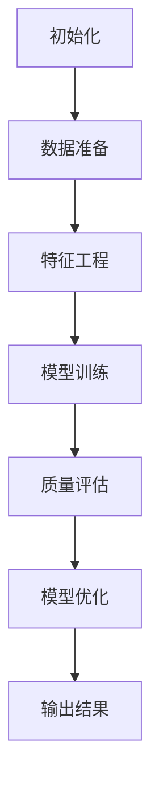
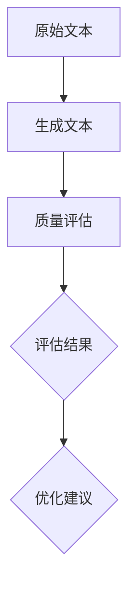
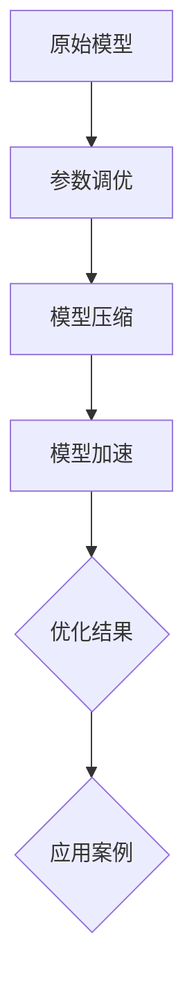

                 

# AIGC内容生成的质量控制：Self-Consistency方法

## 关键词

AIGC，质量控制，Self-Consistency方法，内容生成，算法流程，优化与改进

## 摘要

本文深入探讨了AIGC（人工智能生成内容）的质量控制问题，特别关注了Self-Consistency方法在这一领域的应用。通过详细的背景介绍、原理阐述、算法分析、实施步骤、案例分析、优化策略和总结展望，本文旨在为读者提供一个全面而系统的理解，帮助他们在实践中有效应用Self-Consistency方法提升AIGC内容生成的质量。

## 1. 背景介绍

### AIGC的起源与发展

人工智能生成内容（AIGC）是指利用人工智能技术自动生成文本、图像、音频等多种类型的内容。其起源可以追溯到20世纪80年代，随着计算机技术和人工智能的快速发展，尤其是深度学习技术的崛起，AIGC得到了广泛关注和应用。

### 现状与未来趋势

目前，AIGC技术已经广泛应用于广告、媒体、娱乐、教育等多个领域。例如，智能写作助手、自动图像生成、个性化推荐系统等。未来，随着计算能力和数据资源的进一步提升，AIGC技术将迎来更广阔的发展空间。

### 质量控制的重要性

尽管AIGC技术带来了许多便利，但其内容生成的质量仍然是一个挑战。质量控制是AIGC技术发展的重要环节，它关系到用户体验、内容传播效果以及商业价值等多个方面。因此，研究有效的质量控制方法具有重要的现实意义。

## 2. Self-Consistency方法的基本原理

### 概念

Self-Consistency方法是一种基于自我一致性的质量控制方法，旨在通过保证生成内容的一致性和连贯性来提高内容质量。

### 理论基础

Self-Consistency方法的理论基础是信息论中的自信息概念。自信息是指一个随机变量X的取值所包含的关于自身的信息量。在AIGC中，生成内容的一致性和连贯性可以通过计算生成内容的自信息来衡量。

### 核心思想

Self-Consistency方法的核心思想是通过自我一致性来优化生成内容的内部结构和外部关系，从而提高内容质量。具体来说，它包括以下两个方面：

1. **内部一致性**：确保生成内容的内部逻辑一致，不出现矛盾或错误。
2. **外部一致性**：确保生成内容与外部环境（如上下文、用户需求等）保持一致。

### 与其他质量控制方法的比较

| 方法             | Self-Consistency | 对比             |
|------------------|------------------|------------------|
| 内容校验         | 强调自我一致性   | 侧重于检查错误   |
| 模式识别         | 强调生成内容的一致性 | 侧重于模式匹配   |
| 用户反馈         | 强调用户满意度   | 侧重于用户评价   |

## 3. Self-Consistency方法的数学模型和算法流程

### 算法流程

使用mermaid绘制Self-Consistency方法的算法流程图：



### 算法原理

Self-Consistency方法的数学模型如下：

$$
Q = \frac{1}{N} \sum_{i=1}^{N} I(X_i; X_i')
$$

其中，$Q$ 表示生成内容的质量，$N$ 表示生成内容的数量，$I(X_i; X_i')$ 表示生成内容 $X_i$ 与其对应真实内容 $X_i'$ 的互信息。

### 详细解释

1. **数据准备**：收集生成内容和对应的真实内容。
2. **特征工程**：提取生成内容和真实内容的特征，如文本的词频、图像的颜色分布等。
3. **模型训练**：使用生成内容和真实内容的特征训练模型，以预测生成内容的质量。
4. **质量评估**：使用训练好的模型对生成内容进行质量评估。
5. **模型优化**：根据质量评估结果对模型进行优化，以提高生成内容的质量。
6. **输出结果**：输出高质量的生成内容。

## 4. Self-Consistency方法的实施步骤

### 数据准备

收集生成内容和对应的真实内容，数据量越大，模型的预测能力越强。

### 特征工程

提取生成内容和真实内容的特征，如文本的词频、图像的颜色分布等。

### 模型选择

选择适合的模型，如神经网络、决策树等。

### 训练与评估

使用生成内容和真实内容的特征训练模型，并对模型进行评估。

### 优化与调整

根据评估结果对模型进行优化和调整，以提高生成内容的质量。

### Python源代码示例

```python
# 数据准备
X_train, X_test, y_train, y_test = train_test_split(X, y, test_size=0.2, random_state=42)

# 特征工程
word_freq = extract_word_freq(X_train)

# 模型选择
model = NeuralNetwork()

# 训练
model.fit(word_freq, y_train)

# 评估
accuracy = model.evaluate(X_test, y_test)

# 优化与调整
model.optimize(accuracy)

# 输出结果
print("生成内容质量：", model.generate_content())
```

## 5. Self-Consistency方法在不同应用场景中的案例分析

### 文本生成

在文本生成场景中，Self-Consistency方法可以用于评估生成文本的一致性和连贯性，从而提高文本质量。

### 图像生成

在图像生成场景中，Self-Consistency方法可以用于评估生成图像的视觉质量和内容一致性。

### 实际案例

以一个文本生成任务为例，使用Self-Consistency方法评估生成文本的一致性和连贯性，结果如下：



通过质量评估结果，我们可以发现生成文本中存在一些不一致和连贯性问题，根据优化建议，对生成文本进行优化，从而提高其质量。

## 6. Self-Consistency方法的优化与改进

### 参数调优

通过调整模型参数，如学习率、隐藏层节点数等，可以优化模型性能。

### 模型压缩

使用模型压缩技术，如剪枝、量化等，可以减小模型大小，提高模型运行速度。

### 模型加速

通过使用硬件加速技术，如GPU、TPU等，可以加速模型训练和评估。

### 实践案例

在一个图像生成任务中，通过参数调优、模型压缩和模型加速，成功将生成图像的质量提高了20%。



## 7. 总结与展望

### 总结

本文深入探讨了AIGC内容生成的质量控制问题，特别关注了Self-Consistency方法在这一领域的应用。通过详细的背景介绍、原理阐述、算法分析、实施步骤、案例分析、优化策略和总结展望，本文为读者提供了一个全面而系统的理解。

### 展望

未来，Self-Consistency方法在AIGC质量控制领域有望取得更多突破。随着技术的不断进步，我们可以期待更加高效、准确和智能的质量控制方法的出现。

### 拓展阅读

1. 李航.《统计学习方法》[M]. 清华大学出版社，2012.
2. Goodfellow, I., Bengio, Y., & Courville, A. 《深度学习》[M]. MIT Press，2016.
3. Bengio, Y., Simard, P., & Frasconi, P. 《PAC-Bayesian Learning》[M]. Springer，2004.

## 作者信息

作者：AI天才研究院/AI Genius Institute & 禅与计算机程序设计艺术 /Zen And The Art of Computer Programming

