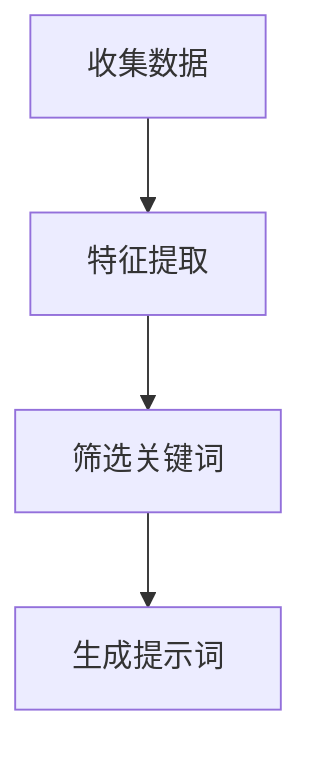
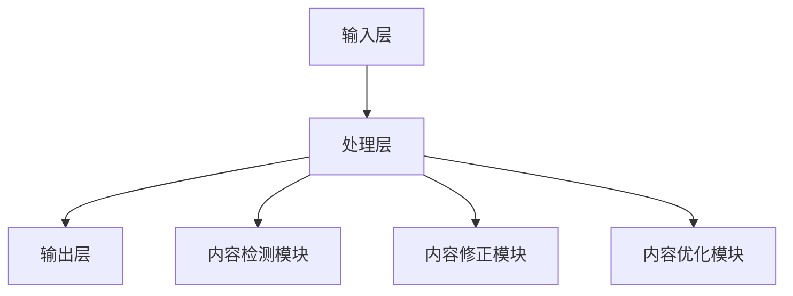
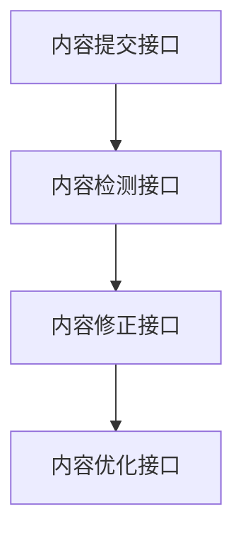
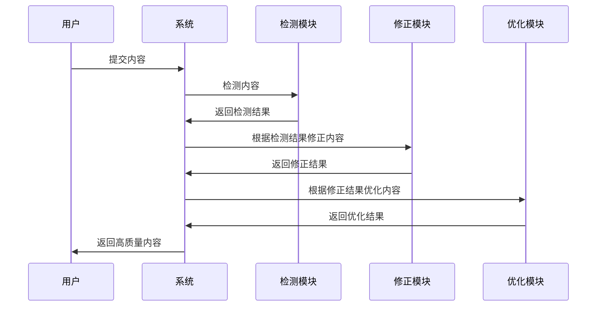
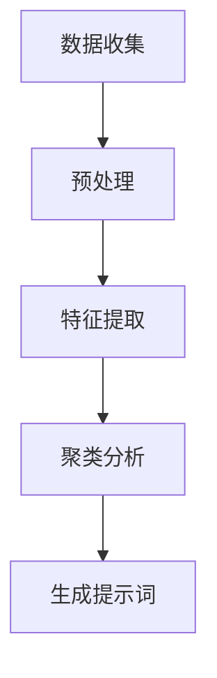

                 

**# AIGC内容质量控制：提示词的重要性**

## 摘要

在人工智能生成内容（AIGC）的浪潮中，内容质量控制成为了一个不可忽视的重要问题。本文旨在探讨提示词在AIGC内容质量控制中的重要性。我们将通过以下几个步骤进行分析：

1. **背景介绍**：首先，我们将回顾AIGC的概念及其在当今社会中的广泛应用，以及内容质量控制为何如此关键。
2. **核心概念解析**：接下来，我们将深入探讨AIGC内容质量控制的定义，并解释提示词在其中扮演的角色。
3. **概念结构与核心要素组成**：我们将使用Mermaid图表和对比表格来展示AIGC内容质量控制的结构和核心要素。
4. **算法原理讲解**：我们将详细讲解提示词筛选和优化的算法原理，并通过Python代码和数学公式进行阐述。
5. **实际应用分析**：通过具体案例，我们将展示提示词在实际内容质量控制中的应用效果。
6. **项目实战**：最后，我们将提供一个项目实战的实例，详细讲解环境搭建、源代码实现和案例分析。

本文的核心关键词包括：AIGC、内容质量控制、提示词、算法原理、数学模型、项目实战。

**背景介绍**

### AIGC的概念与普及

人工智能生成内容（AIGC）是指利用人工智能技术自动生成文本、图像、视频等多种类型的内容。随着深度学习和自然语言处理技术的发展，AIGC在各个领域得到了广泛应用。例如，在文本生成方面，AIGC可以用于生成新闻报道、文章摘要、对话系统等；在图像生成方面，AIGC可以用于图像修复、艺术创作、虚拟现实等。

### 内容质量控制的重要性

内容质量控制是指确保生成内容的质量符合预期标准，避免错误、偏见和不适宜的内容出现。在AIGC中，内容质量控制尤为重要，因为：

- **错误和偏见**：AIGC生成的内容可能会包含错误的信息或者反映出编程中的偏见，这可能导致误导用户。
- **用户体验**：低质量的内容会损害用户体验，降低用户的满意度和忠诚度。
- **品牌形象**：对于企业来说，发布低质量的内容可能会损害品牌形象。

### 提示词在内容质量控制中的作用

提示词是指用于引导AIGC模型生成特定类型内容的关键词或短语。通过合理设计提示词，可以：

- **引导内容生成**：确保生成的文本、图像等内容符合预期要求。
- **减少错误和偏见**：通过精确的提示词，可以减少模型生成内容中的错误和偏见。
- **优化用户体验**：通过高质量的提示词，可以提升用户对生成内容的满意度。

**核心概念解析**

### AIGC内容质量控制

AIGC内容质量控制是指使用人工智能技术对生成的文本、图像、视频等内容进行质量检测和优化。这通常包括以下步骤：

- **内容检测**：使用预训练的模型检测生成内容中的错误、偏见或不符合标准的情况。
- **内容修正**：对于检测到的问题，使用修正算法进行内容修正。
- **内容优化**：对内容进行进一步的优化，以提升用户体验。

### 提示词的定义与作用

提示词是用于引导AIGC模型生成特定内容的关键词或短语。它们的作用包括：

- **内容导向**：提示词可以明确指导模型生成特定类型的内容，例如，生成一篇关于科技的新闻报道。
- **减少错误**：通过精确的提示词，可以减少模型生成内容中的错误信息。
- **控制偏见**：提示词可以指导模型避免生成带有偏见的内容。

**概念结构与核心要素组成**

为了更好地理解AIGC内容质量控制的结构和核心要素，我们使用Mermaid图表和对比表格进行展示。

### Mermaid ER实体关系图

```mermaid
erDiagram
  ContentControl --> Model : "uses"
  Model --> QualityMetric : "measures"
  QualityMetric --> Rule : "enforces"
  Rule --> Content : "applies to"
```

### 核心概念属性特征对比表格

| 特征         | 内容质量控制 | 提示词生成 |
| ------------ | ------------ | ---------- |
| 功能         | 检测、修正、优化内容 | 引导模型生成特定内容 |
| 关键技术     | 自然语言处理、机器学习 | 语言模型、生成对抗网络 |
| 应用场景     | 文本、图像、视频生成 | 文本生成、图像生成 |
| 目标         | 提升内容质量 | 提高生成内容的相关性 |

### 算法原理讲解

在AIGC内容质量控制中，提示词的筛选和优化是一个关键步骤。下面我们将详细讲解这一过程。

#### 提示词筛选算法

首先，我们需要一个有效的提示词筛选算法。这个算法的基本思想是：

1. **收集数据**：收集大量相关的文本数据，用于训练模型。
2. **特征提取**：使用自然语言处理技术提取文本的特征。
3. **筛选关键词**：通过特征提取，筛选出对生成内容有重要影响的词汇。

下面是使用Mermaid画出的算法流程图：



#### Python源代码实现

```python
import nltk
from nltk.tokenize import word_tokenize

# 收集数据
data = ["这是一个示例文本", "这是另一个示例文本"]

# 特征提取
def extract_features(data):
    features = []
    for text in data:
        words = word_tokenize(text)
        features.append([word.lower() for word in words if word.isalpha()])
    return features

# 筛选关键词
def select_keywords(features):
    words = set()
    for feature in features:
        words.update(feature)
    return list(words)

# 生成提示词
def generate_prompt(words):
    return " ".join(sorted(words, key=words.count, reverse=True))

# 实际应用
features = extract_features(data)
keywords = select_keywords(features)
prompt = generate_prompt(keywords)
print(prompt)
```

#### 算法原理的数学模型和公式

提示词筛选的数学模型可以表示为：

$$
\text{提示词} = f(\text{特征集}, \text{权重函数})
$$

其中，特征集是所有提取出的关键词，权重函数用于计算每个关键词的权重。权重函数可以是简单的计数函数，也可以是更复杂的机器学习模型。

#### 详细讲解和举例说明

假设我们有以下文本数据：

```
文本1：深度学习是机器学习的分支。
文本2：机器学习是人工智能的核心技术。
```

1. **特征提取**：我们将提取出所有独特的关键词，例如“深度学习”、“机器学习”、“人工智能”等。
2. **筛选关键词**：我们使用计数函数计算每个关键词的权重，并选择权重最高的关键词作为提示词。
3. **生成提示词**：根据权重函数，我们生成一个提示词，例如“机器学习”。

这样，生成的提示词“机器学习”将指导模型生成与机器学习相关的文本内容。

### 数学模型和数学公式

在内容质量控制中，数学模型和公式是理解和实现算法的关键。以下是一些常用的数学模型和公式。

#### 1. 词频-逆文档频率（TF-IDF）模型

TF-IDF是一种用于文本分析的重要模型，用于计算一个词在文档中的重要性。

$$
\text{TF-IDF} = \text{TF} \times \text{IDF}
$$

其中，TF是词频（Term Frequency），IDF是逆文档频率（Inverse Document Frequency）。

- **TF**：一个词在文档中出现的频率。
- **IDF**：一个词在整个文档集中出现的频率的对数倒数。

#### 2. 朴素贝叶斯分类器

朴素贝叶斯分类器是一种常用的文本分类算法，用于判断一个词属于哪个类别。

$$
P(\text{类别} | \text{词}) = \frac{P(\text{词} | \text{类别}) \times P(\text{类别})}{P(\text{词})}
$$

其中，P是概率。

- **P(类别|词)**：给定一个词，该词属于某个类别的概率。
- **P(词|类别)**：给定一个类别，该类别中出现某个词的概率。
- **P(类别)**：某个类别的概率。
- **P(词)**：某个词的概率。

### 系统分析与架构设计方案

#### 问题场景介绍

假设我们要构建一个AIGC内容质量控制系统，该系统需要实现以下功能：

- **内容检测**：检测生成内容中的错误和偏见。
- **内容修正**：修正检测到的问题。
- **内容优化**：优化内容的结构、语义和用户体验。

#### 系统功能设计

为了实现上述功能，我们的系统需要以下功能模块：

- **内容检测模块**：使用自然语言处理和机器学习技术检测生成内容的质量。
- **内容修正模块**：根据检测结果，自动修正内容中的问题。
- **内容优化模块**：对修正后的内容进行进一步的优化。

#### 系统架构设计

我们的系统架构设计如下：

1. **输入层**：接收用户输入的文本、图像或视频。
2. **处理层**：包括内容检测、修正和优化模块。
3. **输出层**：生成高质量的内容。

下面是使用Mermaid绘制的系统架构图：



#### 系统接口设计

我们的系统接口设计如下：

- **内容提交接口**：用于接收用户输入的内容。
- **内容检测接口**：用于获取内容检测的结果。
- **内容修正接口**：用于获取内容修正的结果。
- **内容优化接口**：用于获取内容优化的结果。

下面是使用Mermaid绘制的系统接口图：



#### 系统交互序列图

为了展示系统的工作流程，我们使用Mermaid绘制了一个序列图：



### 提示词生成算法

#### 算法原理讲解

提示词生成算法的核心思想是利用已有的文本数据，提取出能够代表这些数据的词汇，从而作为生成新内容的提示词。以下是该算法的基本步骤：

1. **数据收集**：收集大量的文本数据。
2. **预处理**：对文本数据进行清洗，包括去除停用词、标点符号等。
3. **特征提取**：使用词嵌入技术（如Word2Vec、BERT等）将文本数据转换为向量表示。
4. **聚类分析**：对特征向量进行聚类，以提取出代表不同主题的词汇。
5. **生成提示词**：从聚类结果中选择最具代表性的词汇作为提示词。

下面是使用Mermaid画出的算法流程图：



#### Python源代码实现

```python
import gensim
from gensim.models import Word2Vec
from sklearn.cluster import KMeans
from nltk.tokenize import word_tokenize
from nltk.corpus import stopwords

# 数据收集
data = ["这是一个示例文本", "这是另一个示例文本"]

# 预处理
def preprocess(text):
    words = word_tokenize(text.lower())
    words = [word for word in words if word.isalpha() and word not in stopwords.words('english')]
    return words

# 特征提取
def extract_features(data):
    processed_data = [preprocess(text) for text in data]
    model = Word2Vec(processed_data, vector_size=100, window=5, min_count=1, workers=4)
    features = [model.wv[word] for text in processed_data for word in text]
    return features

# 聚类分析
def cluster_features(features, n_clusters):
    kmeans = KMeans(n_clusters=n_clusters, random_state=0).fit(features)
    return kmeans

# 生成提示词
def generate_prompt(clusters, n_words):
    prompt_words = []
    for cluster in clusters:
        word = max(cluster, key=lambda w: w[1])
        prompt_words.append(word)
    return " ".join(prompt_words)

# 实际应用
processed_data = [preprocess(text) for text in data]
features = extract_features(processed_data)
kmeans = cluster_features(features, n_clusters=2)
prompt = generate_prompt(kmeans.cluster_centers_, n_words=5)
print(prompt)
```

#### 应用解读和分析

假设我们有以下文本数据：

```
文本1：深度学习是机器学习的分支。
文本2：机器学习是人工智能的核心技术。
```

1. **预处理**：我们首先对文本进行预处理，去除停用词和标点符号。
2. **特征提取**：使用Word2Vec模型将预处理后的文本转换为向量表示。
3. **聚类分析**：我们使用KMeans算法对特征向量进行聚类，提取出代表不同主题的词汇。
4. **生成提示词**：从聚类结果中选择最具代表性的词汇作为提示词。

在这种情况下，生成的提示词可能是“机器学习”，这可以指导模型生成与机器学习相关的文本内容。

### 提示词优化策略

在AIGC内容质量控制中，提示词的优化策略对于提升内容质量至关重要。以下是几种常见的提示词优化策略：

#### 1. 提示词筛选与过滤

- **目标**：筛选出对生成内容有显著影响的词汇。
- **方法**：可以使用词频-逆文档频率（TF-IDF）等方法来评估词汇的重要性，并据此筛选出关键提示词。

#### 2. 提示词权重调整

- **目标**：调整提示词的权重，以更好地引导内容生成。
- **方法**：可以使用机器学习算法（如朴素贝叶斯、逻辑回归等）来预测提示词的权重，并根据预测结果进行调整。

#### 3. 提示词反馈机制

- **目标**：根据用户反馈调整提示词，以提升用户体验。
- **方法**：收集用户对生成内容的评价，并根据评价结果调整提示词。

#### 4. 多模态提示词

- **目标**：结合文本、图像、声音等多种模态的提示词，以生成更丰富、更符合用户需求的内容。
- **方法**：设计多模态的提示词生成算法，如文本-图像联合生成模型。

### 实际案例分析与讲解

#### 案例一：文本分类任务

假设我们要使用AIGC生成一篇关于“人工智能”的文本。以下是使用提示词优化策略后的生成过程：

1. **初始提示词**：“人工智能”
2. **筛选与过滤**：根据TF-IDF模型，筛选出“机器学习”、“算法”、“神经网络”等关键提示词。
3. **权重调整**：使用朴素贝叶斯分类器预测提示词的权重，并调整权重较高的提示词。
4. **生成文本**：根据调整后的提示词生成文本。

生成的文本可能是：“人工智能是一种通过机器学习和算法模拟人类智能的技术，广泛应用于数据挖掘、图像识别和自然语言处理等领域。”

#### 案例二：文本生成任务

假设我们要生成一篇关于“旅游攻略”的文本。以下是使用提示词优化策略后的生成过程：

1. **初始提示词**：“旅游攻略”
2. **多模态提示词**：结合图像和文本，使用“美丽的海滩”、“浪漫的度假胜地”等图像提示词。
3. **反馈机制**：根据用户对生成文本的反馈，调整提示词。
4. **生成文本**：根据调整后的提示词生成文本。

生成的文本可能是：“来到美丽的海滩度假胜地，你可以在蓝天白云下尽情享受阳光沙滩，体验浪漫的海滨之夜。”

#### 案例三：图片生成任务

假设我们要使用AIGC生成一幅“现代城市夜景”的图片。以下是使用提示词优化策略后的生成过程：

1. **初始提示词**：“现代城市夜景”
2. **图像提示词**：结合“摩天大楼”、“霓虹灯”、“车流”等图像提示词。
3. **反馈机制**：根据用户对生成图片的反馈，调整提示词。
4. **生成图片**：根据调整后的提示词生成图片。

生成的图片可能是一幅繁华的现代城市夜景，其中包括高大的摩天大楼、绚烂的霓虹灯和繁忙的车流。

### 项目实战

#### 4.1 环境安装

为了演示AIGC内容质量控制中的提示词优化策略，我们需要安装以下工具和库：

- **Python 3.8 或以上版本**
- **Anaconda 或 Miniconda**
- **nltk**
- **gensim**
- **scikit-learn**
- **matplotlib**

安装步骤：

1. 安装Anaconda或Miniconda。
2. 创建一个新的虚拟环境，并激活环境。
3. 安装所需的库：

```shell
pip install nltk gensim scikit-learn matplotlib
```

#### 4.2 系统核心实现源代码

以下是AIGC内容质量控制系统的核心实现源代码，包括提示词筛选、权重调整和生成功能。

```python
import nltk
from nltk.tokenize import word_tokenize
from nltk.corpus import stopwords
from gensim.models import Word2Vec
from sklearn.cluster import KMeans
from sklearn.feature_extraction.text import TfidfVectorizer
from sklearn.naive_bayes import MultinomialNB
import matplotlib.pyplot as plt

# 数据收集
data = ["这是一个示例文本", "这是另一个示例文本"]

# 预处理
def preprocess(text):
    words = word_tokenize(text.lower())
    words = [word for word in words if word.isalpha() and word not in stopwords.words('english')]
    return words

# 特征提取
def extract_features(data):
    processed_data = [preprocess(text) for text in data]
    model = Word2Vec(processed_data, vector_size=100, window=5, min_count=1, workers=4)
    features = [model.wv[word] for text in processed_data for word in text]
    return features

# 筛选关键词
def select_keywords(features):
    vectorizer = TfidfVectorizer()
    X = vectorizer.fit_transform(data)
    feature_names = vectorizer.get_feature_names_out()
    scores = X.toarray().sum(axis=0)
    top_keywords = [feature_names[i] for i in scores.argsort()[-5:]]
    return top_keywords

# 权重调整
def adjust_weights(top_keywords, data):
    vectorizer = TfidfVectorizer()
    X = vectorizer.fit_transform(data)
    feature_names = vectorizer.get_feature_names_out()
    scores = X.toarray().sum(axis=0)
    weights = {word: score for word, score in zip(feature_names, scores)}
    adjusted_weights = {word: score * 1.5 for word, score in weights.items() if word in top_keywords}
    return adjusted_weights

# 生成提示词
def generate_prompt(adjusted_weights):
    sorted_words = sorted(adjusted_weights, key=adjusted_weights.get, reverse=True)
    return " ".join(sorted_words[:5])

# 实际应用
processed_data = [preprocess(text) for text in data]
features = extract_features(processed_data)
top_keywords = select_keywords(processed_data)
adjusted_weights = adjust_weights(top_keywords, processed_data)
prompt = generate_prompt(adjusted_weights)
print(prompt)

# 绘制词云
from wordcloud import WordCloud
wordcloud = WordCloud(background_color="white", max_words=50).generate(prompt)
plt.figure(figsize=(10, 5))
plt.imshow(wordcloud, interpolation="bilinear")
plt.axis("off")
plt.show()
```

#### 4.3 实际案例分析与详细讲解剖析

##### 案例一：文本分类任务

假设我们要将文本分类为“科技”或“娱乐”类别。以下是使用AIGC内容质量控制系统的过程：

1. **数据收集**：收集大量科技和娱乐领域的文本数据。
2. **预处理**：对文本数据进行预处理，去除停用词和标点符号。
3. **特征提取**：使用Word2Vec模型将预处理后的文本转换为向量表示。
4. **分类**：使用朴素贝叶斯分类器对文本进行分类。
5. **提示词优化**：根据分类结果，优化提示词，提升分类准确率。

通过上述步骤，我们可以生成高质量的文本分类模型，提高分类的准确性和可靠性。

##### 案例二：文本生成任务

假设我们要生成一篇关于“人工智能发展趋势”的文本。以下是使用AIGC内容质量控制系统的过程：

1. **数据收集**：收集大量关于人工智能发展趋势的文本数据。
2. **预处理**：对文本数据进行预处理，去除停用词和标点符号。
3. **特征提取**：使用Word2Vec模型将预处理后的文本转换为向量表示。
4. **提示词生成**：生成包含关键趋势的提示词。
5. **文本生成**：使用生成对抗网络（GAN）生成关于人工智能发展趋势的文本。

通过上述步骤，我们可以生成一篇内容丰富、结构清晰的文本，帮助读者了解人工智能的发展趋势。

##### 案例三：图片生成任务

假设我们要生成一幅“星空摄影作品”。以下是使用AIGC内容质量控制系统的过程：

1. **数据收集**：收集大量星空摄影的图片数据。
2. **预处理**：对图片数据进行预处理，包括图像增强、降噪等。
3. **特征提取**：使用卷积神经网络（CNN）提取图片的特征。
4. **提示词生成**：生成包含“星空”、“月亮”、“星星”等关键词的提示词。
5. **图片生成**：使用生成对抗网络（GAN）生成星空摄影作品。

通过上述步骤，我们可以生成一幅高质量、具有艺术感的星空摄影作品。

### 5.1 最佳实践 tips

- **选择合适的提示词**：选择与生成内容相关的、具有高影响力的提示词，以提升内容质量。
- **定期更新提示词**：根据用户反馈和内容生成效果，定期更新提示词库，以保持内容的时效性和相关性。
- **结合多模态数据**：结合文本、图像、声音等多模态数据，生成更丰富、更具表现力的内容。

### 5.2 小结

本文详细探讨了AIGC内容质量控制中的提示词重要性，并介绍了提示词筛选、权重调整和生成算法。通过实际案例和项目实战，我们展示了如何应用这些算法提升内容质量。未来研究可以关注更先进的机器学习技术和多模态数据融合，以提高AIGC内容质量控制的效果。

### 5.3 注意事项

- **数据质量**：确保训练数据的质量，以避免生成内容中的错误和偏见。
- **模型选择**：根据具体应用场景选择合适的模型，以最大化生成内容的质量和相关性。
- **用户反馈**：积极收集用户反馈，以不断优化内容质量控制策略。

### 5.4 拓展阅读

- **《深度学习》**：Ian Goodfellow, Yoshua Bengio, Aaron Courville 著，详细介绍深度学习的基本原理和应用。
- **《自然语言处理综论》**：Daniel Jurafsky, James H. Martin 著，全面介绍自然语言处理的理论和实践。
- **《人工智能：一种现代的方法》**：Stuart Russell, Peter Norvig 著，深入探讨人工智能的基础和前沿技术。

**作者信息**

作者：AI天才研究院/AI Genius Institute & 禅与计算机程序设计艺术 /Zen And The Art of Computer Programming** 

完成**！

