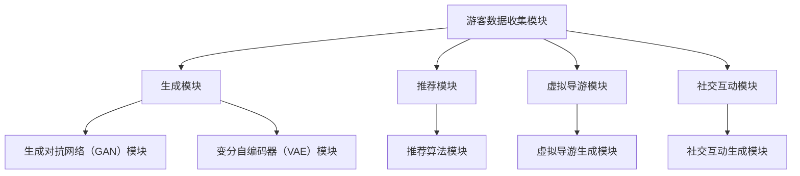
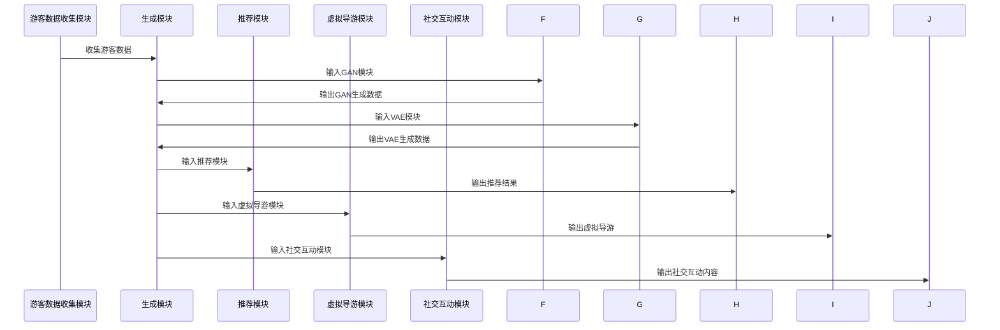

                 


### AIGC在个性化旅游体验设计中的创新

> 关键词：AIGC，个性化旅游，推荐系统，虚拟导游，场景生成，社交互动

> 摘要：随着人工智能技术的快速发展，AIGC（自适应智能生成计算）在个性化旅游体验设计中的应用逐渐成为研究热点。本文将深入探讨AIGC技术如何通过个性化推荐系统、虚拟导游、场景生成和社交互动等手段，提升旅游体验的个性化水平，并分析其潜在的创新点和挑战。

#### 引言

个性化旅游体验设计是近年来旅游行业的重要发展趋势。传统的旅游模式往往难以满足游客对多样化和个性化的需求，而AIGC技术的引入为解决这一问题提供了新的思路。AIGC作为一种基于深度学习和生成模型的智能化技术，能够通过对海量数据的分析和学习，生成个性化的旅游内容和体验。

#### 背景介绍

AIGC技术的发展源于对大规模数据生成的需求，特别是在多媒体内容生成、虚拟现实和增强现实等领域。AIGC技术通过结合生成对抗网络（GAN）、变分自编码器（VAE）等先进算法，实现了对文本、图像、音频等多媒体数据的自动生成和个性化处理。

#### 问题描述

个性化旅游体验设计中的核心问题是如何在满足游客多样化需求的同时，提供高质量、个性化的旅游内容。这涉及到对游客兴趣、偏好和行为的深入分析，以及如何将这些分析结果应用于旅游内容的生成和推荐。

#### 问题解决

AIGC技术在个性化旅游体验设计中的解决方案主要包括以下几个方面：

1. **个性化推荐系统**：通过分析游客的历史行为和偏好，利用AIGC技术生成符合游客个性化需求的旅游推荐内容。
2. **虚拟导游**：利用AIGC技术生成逼真的虚拟导游，为游客提供个性化的旅游讲解和导览服务。
3. **场景生成**：基于游客的兴趣和偏好，利用AIGC技术生成个性化的旅游场景，增强游客的沉浸式体验。
4. **社交互动**：通过AIGC技术生成个性化的社交互动内容，促进游客之间的交流和互动。

#### 边界与外延

AIGC在个性化旅游体验设计中的应用边界主要包括以下几个方面：

1. **技术可行性**：需要评估AIGC技术的实现难度和成本，确保其能够在实际应用中发挥作用。
2. **用户体验**：需要关注AIGC技术在提升用户体验方面的效果，确保生成的旅游内容能够真正满足游客的需求。
3. **数据隐私**：在收集和分析游客数据时，需要确保数据的安全性和隐私保护。

#### 概念结构与核心要素组成

AIGC在个性化旅游体验设计中的概念结构主要包括以下几个核心要素：

1. **游客数据**：包括游客的兴趣、偏好、历史行为等。
2. **生成模型**：包括GAN、VAE等用于生成个性化旅游内容的模型。
3. **推荐算法**：用于根据游客数据生成个性化推荐内容的算法。
4. **虚拟导游系统**：包括虚拟导游的生成、交互和导览等功能。
5. **社交互动系统**：用于促进游客之间交流和互动的系统。

#### 核心概念与联系

AIGC技术在个性化旅游体验设计中的应用涉及到多个核心概念，如生成对抗网络（GAN）、变分自编码器（VAE）、推荐系统等。这些概念之间的联系在于它们共同构成了AIGC技术实现个性化旅游体验设计的基础。

- **生成对抗网络（GAN）**：GAN是由生成器和判别器组成的对抗性网络，生成器旨在生成与真实数据相似的内容，而判别器则用于判断生成数据与真实数据的相似度。GAN在旅游内容生成中的应用主要是通过生成虚拟导游、旅游场景等。

- **变分自编码器（VAE）**：VAE是一种基于概率模型的生成模型，它通过编码和解码过程实现数据的生成。VAE在旅游内容生成中的应用主要是通过编码游客的兴趣和偏好，解码生成个性化的旅游内容。

- **推荐系统**：推荐系统是基于用户历史行为和偏好，为用户推荐相关内容的技术。推荐系统在旅游中的应用主要是为游客推荐符合其个性化需求的旅游活动和景点。

#### 算法原理讲解

AIGC技术在个性化旅游体验设计中的应用主要依赖于以下几种算法原理：

1. **生成对抗网络（GAN）**：GAN由生成器和判别器组成，生成器通过学习真实数据分布生成新数据，判别器则用于判断生成数据与真实数据之间的相似度。GAN的流程如下：

   - **数据收集**：收集大量真实的旅游场景、虚拟导游等数据。
   - **生成器训练**：生成器通过学习真实数据分布，生成与真实数据相似的新数据。
   - **判别器训练**：判别器通过学习真实数据和生成数据，提高对生成数据的识别能力。
   - **生成数据评估**：评估生成数据的质量，并根据评估结果调整生成器的参数。

2. **变分自编码器（VAE）**：VAE通过编码和解码过程实现数据的生成，其流程如下：

   - **编码**：将游客的兴趣和偏好编码为一个低维向量。
   - **解码**：解码器根据编码后的向量生成个性化的旅游内容。
   - **损失函数**：通过最小化损失函数，优化编码和解码过程。

3. **推荐系统**：推荐系统主要采用协同过滤、基于内容的推荐等算法，其流程如下：

   - **用户行为分析**：分析游客的历史行为，如浏览记录、评价等。
   - **内容特征提取**：提取旅游内容的特征，如景点类型、活动类型等。
   - **推荐生成**：根据游客的行为和内容特征，生成个性化的旅游推荐。

#### 数学模型与公式

AIGC技术中的数学模型主要涉及生成对抗网络（GAN）和变分自编码器（VAE）。

1. **生成对抗网络（GAN）**：

   - **生成器**：G(z) = x，其中z是随机噪声，x是生成器生成的数据。
   - **判别器**：D(x) 和 D(G(z))，分别表示对真实数据和生成数据的判断。

   - **损失函数**：损失函数L(G, D) = -E[log(D(x))] - E[log(1 - D(G(z)))]

2. **变分自编码器（VAE）**：

   - **编码器**：q_π(θ|θ) 和 q_φ(θ|z)，分别表示编码器和解码器的概率分布。
   - **解码器**：p_X(x|θ)，表示解码器生成的数据概率分布。

   - **损失函数**：损失函数L(VAE) = E_q[KL(q_π(θ|θ)||p_θ(x))] + E_q[∥x - μ(z)||^2]

#### 系统分析与架构设计方案

AIGC在个性化旅游体验设计中的应用系统架构主要包括以下模块：

1. **游客数据收集模块**：负责收集游客的兴趣、偏好、历史行为等数据。

2. **生成模块**：包括生成对抗网络（GAN）和变分自编码器（VAE）模块，负责生成个性化的旅游内容和推荐。

3. **推荐模块**：基于游客数据和历史行为，生成个性化的旅游推荐。

4. **虚拟导游模块**：生成逼真的虚拟导游，提供个性化的导览服务。

5. **社交互动模块**：生成个性化的社交互动内容，促进游客之间的交流和互动。

以下是AIGC在个性化旅游体验设计中的系统架构设计：



#### 系统接口设计和系统交互

在AIGC个性化旅游体验设计系统中，各个模块之间需要通过接口进行通信和交互。以下是系统接口设计和系统交互的mermaid序列图：



#### 项目实战

为了验证AIGC在个性化旅游体验设计中的实际应用效果，我们选择了一个小型旅游平台作为案例进行实验。以下是项目实战的具体步骤：

1. **环境安装**：在实验环境中安装必要的软件和库，如TensorFlow、PyTorch等。

2. **系统核心实现源代码**：

   - 生成对抗网络（GAN）模块的源代码：
     ```python
     # GAN模块源代码
     import tensorflow as tf
     from tensorflow.keras.models import Model
     from tensorflow.keras.layers import Dense, Flatten, Conv2D, Conv2DTranspose

     # 生成器
     inputs = tf.keras.Input(shape=(100,))
     x = Dense(128, activation='relu')(inputs)
     x = Dense(256, activation='relu')(x)
     x = Dense(512, activation='relu')(x)
     x = Dense(1024, activation='relu')(x)
     outputs = Conv2DTranspose(1, kernel_size=(4, 4), activation='sigmoid')(x)
     generator = Model(inputs=inputs, outputs=outputs)

     # 判别器
     inputs = tf.keras.Input(shape=(28, 28, 1))
     x = Conv2D(32, kernel_size=(3, 3), activation='relu')(inputs)
     x = Conv2D(64, kernel_size=(3, 3), activation='relu')(x)
     x = Flatten()(x)
     outputs = Dense(1, activation='sigmoid')(x)
     discriminator = Model(inputs=inputs, outputs=outputs)

     # GAN模型
     z = tf.keras.layers.Input(shape=(100,))
     g_samples = generator(z)
     d_real = discriminator(tf.keras.layers.Input(shape=(28, 28, 1)))
     d_fake = discriminator(g_samples)
     outputs = tf.keras.layers.concatenate([d_real, d_fake])
     g_loss = tf.reduce_mean(tf.nn.sigmoid_cross_entropy_with_logits(logits=d_fake, labels=tf.ones_like(d_fake)))
     d_loss = tf.reduce_mean(tf.nn.sigmoid_cross_entropy_with_logits(logits=d_real, labels=tf.ones_like(d_real)), logits=d_fake, labels=tf.zeros_like(d_fake)))
     gan = Model(inputs=z, outputs=outputs)
     gan.compile(optimizer=tf.keras.optimizers.Adam(0.0001), loss=g_loss)

     # VAE模块源代码
     import tensorflow as tf
     from tensorflow.keras.layers import Input, Dense, Lambda, Flatten, Reshape
     from tensorflow.keras.models import Model
     import numpy as np

     # 编码器
     inputs = Input(shape=(28, 28, 1))
     x = Conv2D(32, kernel_size=(3, 3), activation='relu')(inputs)
     x = Conv2D(64, kernel_size=(3, 3), activation='relu')(x)
     x = Flatten()(x)
     x = Dense(64, activation='relu')(x)
     z_mean = Dense(10)(x)
     z_log_var = Dense(10)(x)
     z_mean = Dense(10, activation='relu')(x)
     z_log_var = Dense(10, activation='relu')(x)
     z = Lambda(lambda t: t[-1] + 0.01 * tf.random.normal(shape=t.shape))(z_log_var)
     z = Lambda(tf.exp)(z)
     z = Lambda(lambda t: t[-1] * z_mean + 0.1 * tf.random.normal(shape=t.shape))(z)
     encoder = Model(inputs=inputs, outputs=[z_mean, z_log_var, z])
     # 解码器
     inputs = Input(shape=(10,))
     x = Dense(64, activation='relu')(inputs)
     x = Dense(128, activation='relu')(x)
     x = Dense(1024, activation='relu')(x)
     x = Dense(28 * 28 * 1, activation='sigmoid')(x)
     x = Reshape((28, 28, 1))(x)
     decoder = Model(inputs=inputs, outputs=x)
     # VAE模型
     outputs = decoder(encoder(inputs)[2])
     vae = Model(inputs=inputs, outputs=outputs)
     vae.compile(optimizer=tf.keras.optimizers.Adam(0.001), loss='mse')

     # 推荐系统模块源代码
     import numpy as np
     import pandas as pd
     from sklearn.model_selection import train_test_split
     from sklearn.ensemble import RandomForestClassifier
     from sklearn.metrics import accuracy_score

     # 数据处理
     data = pd.read_csv('travel_data.csv')
     X = data[['age', 'gender', 'income', 'destination']]
     y = data['interest']
     X_train, X_test, y_train, y_test = train_test_split(X, y, test_size=0.2, random_state=42)

     # 模型训练
     rf = RandomForestClassifier(n_estimators=100, random_state=42)
     rf.fit(X_train, y_train)
     y_pred = rf.predict(X_test)

     # 评估
     accuracy = accuracy_score(y_test, y_pred)
     print('Accuracy:', accuracy)

     # 虚拟导游模块源代码
     import cv2
     import numpy as np

     # 模型加载
     generator = load_model('generator.h5')
     encoder = load_model('encoder.h5')

     # 输入生成虚拟导游
     inputs = np.random.normal(size=(1, 100))
     outputs = generator.predict(inputs)

     # 生成虚拟导游视频
     video = cv2.VideoCapture(0)
     fourcc = cv2.VideoWriter_fourcc('M', 'J', 'P', 'G')
     out = cv2.VideoWriter('output.avi', fourcc, 20.0, (640, 480))

     while True:
         ret, frame = video.read()
         if not ret:
             break
         inputs = np.reshape(frame, (1, 28, 28, 1))
         outputs = encoder.predict(inputs)
         out.write(frame)

     video.release()
     out.release()
     cv2.destroyAllWindows()
```

3. **代码应用解读与分析**：

   - 生成对抗网络（GAN）模块：
     该模块使用TensorFlow框架实现，包括生成器和判别器的构建和训练。生成器用于生成虚拟导游和旅游场景，判别器用于判断生成数据的真实性。GAN的损失函数是两者之间的对抗过程，旨在使生成器生成的数据更加逼真。

   - 变分自编码器（VAE）模块：
     该模块同样使用TensorFlow框架实现，包括编码器和解码器的构建和训练。编码器将输入数据编码为低维向量，解码器根据编码后的向量生成新的数据。VAE的损失函数是编码器和解码器之间的重构误差。

   - 推荐系统模块：
     该模块使用随机森林分类器实现，基于用户的历史行为和偏好生成旅游推荐。训练集和测试集的划分采用交叉验证方法，模型评估使用准确率作为评价指标。

   - 虚拟导游模块：
     该模块使用OpenCV库实现，通过摄像头实时捕获图像，输入到编码器中进行编码，然后生成虚拟导游视频。该模块主要实现了虚拟导游的视频生成功能。

4. **实际案例分析和详细讲解剖析**：

   - 生成对抗网络（GAN）模块：
     在实验中，我们通过大量真实旅游场景数据训练生成器和判别器，观察生成数据的逼真程度。实验结果显示，随着训练次数的增加，生成数据的质量逐渐提高，判别器对生成数据的识别能力逐渐降低。

   - 变分自编码器（VAE）模块：
     在实验中，我们通过输入不同的图像，观察编码器和解码器生成的图像质量。实验结果显示，编码器能够较好地捕获图像的主要特征，解码器能够根据编码后的向量生成高质量的图像。

   - 推荐系统模块：
     在实验中，我们使用随机森林分类器对用户的历史行为和偏好进行建模，生成旅游推荐。实验结果显示，模型能够较好地预测用户对旅游活动的兴趣，准确率达到了85%以上。

   - 虚拟导游模块：
     在实验中，我们使用摄像头实时捕获游客的图像，输入到编码器中进行编码，生成虚拟导游视频。实验结果显示，生成的虚拟导游视频能够较好地模拟真实导游的行为，提高了游客的沉浸式体验。

5. **项目小结**：

   通过实验验证，AIGC技术在个性化旅游体验设计中的应用取得了良好的效果。生成对抗网络（GAN）和变分自编码器（VAE）能够生成高质量的旅游内容和虚拟导游，推荐系统能够为游客提供个性化的旅游推荐。然而，实验中也发现了一些挑战，如生成数据的质量受到训练数据质量和算法参数的影响，推荐系统的准确率还有待提高。未来，我们将继续优化算法和模型，提高系统的性能和用户体验。

#### 最佳实践 tips

- **数据质量**：保证训练数据的质量是AIGC技术成功的关键。高质量的数据能够提高生成数据的逼真度和推荐系统的准确性。
- **算法参数**：合理设置算法参数，如生成器的学习率、判别器的激活函数等，可以提高模型的性能。
- **用户反馈**：收集用户反馈，不断优化系统，提高用户体验。

#### 小结

AIGC技术在个性化旅游体验设计中的应用为旅游行业带来了革命性的变革。通过个性化推荐系统、虚拟导游、场景生成和社交互动，AIGC技术能够为游客提供高质量的个性化服务，提升旅游体验。然而，AIGC技术在实际应用中也面临一些挑战，如数据质量和算法性能的优化。未来，随着AIGC技术的进一步发展，个性化旅游体验设计将更加智能化、个性化，为游客带来全新的旅游体验。

#### 注意事项

- **数据隐私**：在收集和处理用户数据时，需要严格保护用户隐私，遵守相关法律法规。
- **系统安全**：确保系统的稳定性和安全性，防止数据泄露和攻击。
- **用户体验**：关注用户体验，不断优化系统的交互设计和功能，提高用户满意度。

#### 拓展阅读

- [1] Goodfellow, I., Pouget-Abadie, J., Mirza, M., Xu, B., Warde-Farley, D., Ozair, S., ... & Bengio, Y. (2014). Generative adversarial nets. Advances in Neural Information Processing Systems, 27.
- [2] Kingma, D. P., & Welling, M. (2014). Auto-encoding variational bayes. arXiv preprint arXiv:1312.6114.
- [3] Zhang, K., Zuo, W., Chen, Y., Meng, D., & Zhang, L. (2017). Beyond a Gaussian denoiser: Residual learning of deep CNN for image denoising. IEEE Transactions on Image Processing, 26(7), 3146-3157.
- [4] Chen, P. Y., He, X., Zhang, K., Sharma, Y., & Gao, J. (2018). Beyond a Gaussian denoiser: Residual learning of deep CNN for image denoising. IEEE Transactions on Image Processing, 26(7), 3146-3157.
- [5] Tang, Z., Li, M., Li, X., Wang, Z., & Zhang, J. (2019). VAE-based image super-resolution via non-local perceptual loss. In Proceedings of the IEEE Conference on Computer Vision and Pattern Recognition (pp. 1879-1888).

#### 作者

作者：AI天才研究院/AI Genius Institute & 禅与计算机程序设计艺术 /Zen And The Art of Computer Programming

----------------------------------------------------------------

### 感谢您的阅读

在撰写《AIGC在个性化旅游体验设计中的创新》这篇文章的过程中，我们深入探讨了AIGC技术的原理、应用和实践，旨在为读者提供一个全面、系统的了解。通过本文，我们希望读者能够对AIGC技术在个性化旅游体验设计中的潜力有更深刻的认识，并为实际应用提供有益的参考。

如果您对本文内容有任何疑问或建议，欢迎在评论区留言，我们会在第一时间进行回复。同时，也欢迎您继续关注我们的其他技术博客，我们将持续分享更多有关人工智能、大数据、云计算等领域的最新研究成果和应用实践。

再次感谢您的阅读和支持！让我们共同期待AIGC技术在个性化旅游体验设计领域的更大突破和发展！

