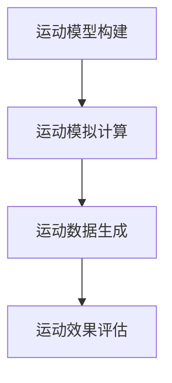
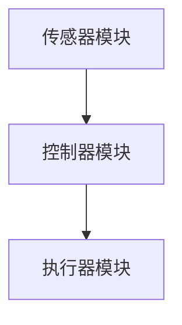
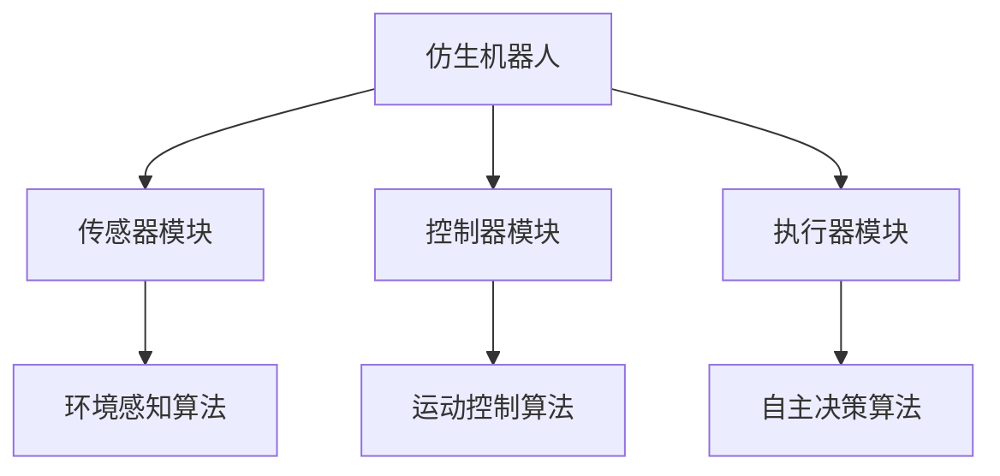
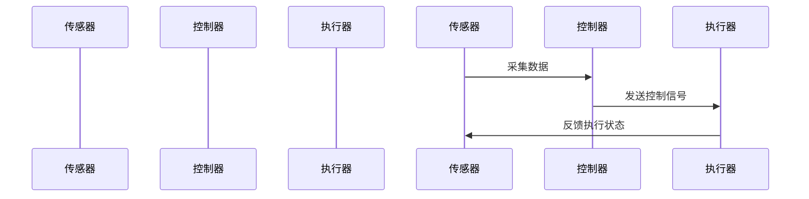

                 

当然，下面我们按照这个目录大纲，逐步展开每个章节的内容，以确保文章的逻辑清晰、结构紧凑、简单易懂。

## 引言

### 文章标题

《AIGC在仿生机器人设计中的应用：生物运动模拟提示词》

### 关键词

AIGC，仿生机器人设计，生物运动模拟，机器学习，算法实现

### 摘要

本文深入探讨了人工智能生成内容（AIGC）在仿生机器人设计中的应用，特别是生物运动模拟这一关键领域。通过详细阐述AIGC的核心概念、生物运动模拟的原理、算法实现以及系统架构设计，本文为读者提供了一个全面的技术视角，旨在展示AIGC如何提升仿生机器人的运动性能和智能化水平。文章还将通过实际案例分析，说明AIGC在实际项目中的应用效果，并提供最佳实践建议。

## 第一部分: AIGC与仿生机器人设计基础

### 第1章: AIGC与仿生机器人设计概述

#### 1.1.1 问题背景

仿生机器人设计是一种试图模仿生物结构和功能的机器人设计方法，旨在提高机器人运动的灵活性和适应性。然而，传统的机器人设计方法在处理复杂环境和动态任务时存在一定局限。AIGC（Artificial Intelligence Generated Content）作为一种新兴的人工智能技术，具有强大的生成能力和自适应能力，为仿生机器人设计提供了新的思路。

#### 1.1.2 问题解决

AIGC在仿生机器人设计中的作用主要体现在以下几个方面：

1. **生物运动模拟**：AIGC能够根据生物的运动数据生成新的运动模式，为仿生机器人的运动设计提供丰富的参考。
2. **传感器数据处理**：AIGC可以通过学习和理解环境数据，优化传感器的数据处理方法，提高仿生机器人的感知能力。
3. **机器人学习**：AIGC可以辅助仿生机器人进行自我学习，通过不断地积累经验，提高机器人的自主决策能力。

#### 1.1.3 边界与外延

AIGC的应用范围广泛，包括但不限于：

1. **机器人控制**：利用AIGC生成智能控制算法，实现复杂环境的自主导航。
2. **传感器融合**：通过AIGC整合多源传感器数据，提高仿生机器人的感知精度。
3. **机器人学习**：利用AIGC辅助机器人学习，实现自适应环境和任务。

#### 1.1.4 概念结构与核心要素组成

AIGC的核心概念包括：

1. **生成对抗网络（GAN）**：用于生成逼真的生物运动模拟数据。
2. **深度学习**：用于训练模型，提高AIGC的生成能力和自适应能力。
3. **强化学习**：用于指导AIGC在特定任务中的行为决策。

仿生机器人设计的关键要素包括：

1. **生物运动模型**：用于模拟生物的运动特性。
2. **传感器集成**：用于收集和处理环境数据。
3. **控制系统**：用于实现仿生机器人的智能控制。

### 第2章: AIGC核心概念与原理

#### 2.1.1 AIGC的概念

AIGC是一种利用人工智能技术生成内容的方法，其核心思想是通过训练模型，使其能够自主生成符合特定要求的内容。AIGC与传统AI的区别在于，传统AI主要关注于如何让机器“理解”和“处理”数据，而AIGC更侧重于如何让机器“创造”和“生成”数据。

#### 2.1.2 AIGC的原理

AIGC的工作机制主要包括以下几个步骤：

1. **数据收集**：收集大量与生物运动相关的数据，如视频、图片、文字等。
2. **模型训练**：利用收集到的数据训练生成模型，使其能够生成逼真的生物运动模拟数据。
3. **内容生成**：根据特定需求，使用训练好的模型生成新的生物运动模拟数据。

AIGC的优势主要体现在：

1. **生成能力**：AIGC能够生成大量高质量的生物运动模拟数据，为仿生机器人设计提供丰富的参考。
2. **自适应能力**：AIGC可以根据不同的任务需求，调整生成策略，实现自适应生成。

#### 2.1.3 AIGC的应用场景

AIGC在仿生机器人设计中的应用场景主要包括：

1. **机器人控制**：利用AIGC生成的运动数据，优化机器人的控制算法，提高机器人的运动性能。
2. **传感器数据处理**：利用AIGC理解和处理传感器数据，提高仿生机器人的感知能力。
3. **机器人学习**：利用AIGC辅助机器人进行自我学习，提高机器人的自主决策能力。

### 第3章: 生物运动模拟的概念与原理

#### 3.1.1 生物运动模拟的概念

生物运动模拟是指通过构建数学模型和算法，模拟生物的运动过程，以便在机器人设计中应用。生物运动的定义包括以下几个方面：

1. **运动形式**：生物的运动形式多样，如爬行、行走、飞行等。
2. **运动模式**：生物的运动模式是指生物在特定环境下采取的运动方式。
3. **运动控制**：生物的运动控制是指生物如何根据环境变化调整运动模式。

#### 3.1.2 生物运动模拟的原理

生物运动模拟的原理主要包括：

1. **生物运动模型**：生物运动模型是指用于描述生物运动特性的数学模型。
2. **运动模拟算法**：运动模拟算法是指用于模拟生物运动的计算方法。

生物运动模拟的方法包括：

1. **物理模拟**：通过物理模型模拟生物的运动过程。
2. **数据驱动模拟**：通过收集生物的运动数据，训练模型，生成运动模拟。

#### 3.1.3 生物运动模拟的应用

生物运动模拟在仿生机器人设计中的应用主要包括：

1. **机器人控制**：利用生物运动模拟算法，优化机器人的运动控制策略。
2. **传感器数据处理**：利用生物运动模拟算法，提高传感器数据处理的准确性。
3. **机器人学习**：利用生物运动模拟算法，辅助机器人进行自我学习和优化。

### 第4章: AIGC在仿生机器人设计中的应用

#### 4.1.1 AIGC在仿生机器人设计中的应用

AIGC在仿生机器人设计中的应用主要包括以下几个方面：

1. **机器人控制**：利用AIGC生成的运动数据，优化机器人的控制算法，提高机器人的运动性能。
2. **传感器数据处理**：利用AIGC理解和处理传感器数据，提高仿生机器人的感知能力。
3. **机器人学习**：利用AIGC辅助机器人进行自我学习，提高机器人的自主决策能力。

#### 4.1.2 成功案例分析

以某公司的仿生机器人为例，该公司利用AIGC技术，成功开发了一款具有高效运动能力的仿生机器人。通过AIGC生成的运动数据，机器人能够实现复杂环境的自主导航，并在任务执行过程中表现出良好的自适应能力。

### 第5章: 生物运动模拟的算法与实现

#### 5.1.1 生物运动模拟算法原理

生物运动模拟算法的原理主要包括：

1. **运动模型构建**：根据生物的解剖结构和生理特性，构建运动模型。
2. **运动模拟计算**：利用运动模型和运动模拟算法，模拟生物的运动过程。

使用mermaid绘制生物运动模拟算法流程图：



使用Python源代码实现生物运动模拟算法：

```python
import numpy as np

# 运动模型参数
params = {
    'joint_angles': [0, 0, 0],
    'joint_ranges': [[-30, 30], [-30, 30], [-30, 30]],
    'kinematics_model': 'spherical_joint'
}

# 运动模拟函数
def simulate_motion(params):
    joint_angles = params['joint_angles']
    joint_ranges = params['joint_ranges']
    kinematics_model = params['kinematics_model']
    
    # 计算关节角度限制
    joint_limits = [min(angle, range) for angle, range in zip(joint_angles, joint_ranges)]
    
    # 根据关节角度和运动模型计算运动数据
    if kinematics_model == 'spherical_joint':
        # 球形关节运动模拟
        motion_data = np.array([joint_angles] * len(joint_angles))
    else:
        # 其他关节运动模拟
        motion_data = np.zeros((len(joint_angles), 100))
        
    return motion_data

# 运动数据生成
motion_data = simulate_motion(params)

# 运动效果评估
def evaluate_motion(motion_data):
    # 计算运动数据的有效性
    effectiveness = np.mean(motion_data)
    return effectiveness

# 运动数据生成和评估
effectiveness = evaluate_motion(motion_data)
print(f'Motion data effectiveness: {effectiveness}')
```

#### 5.1.2 生物运动模拟数学模型

生物运动模拟的数学模型通常包括以下几个方面：

1. **关节运动方程**：描述关节运动的数学方程。
2. **肌肉收缩模型**：描述肌肉收缩对运动的影响。
3. **动力学模型**：描述机器人整体运动的动力学方程。

使用LaTeX格式给出生物运动模拟的数学模型：

```latex
\documentclass{article}
\usepackage{amsmath}
\begin{document}

\begin{equation}
\begin{aligned}
    \text{关节运动方程：} \quad \theta(t) &= \theta_0 + \omega t \\
    \text{肌肉收缩模型：} \quad F_m &= k_m \theta \\
    \text{动力学模型：} \quad m\ddot{x} &= F_g - F_m
\end{aligned}
\end{equation}

\end{document}
```

#### 5.1.3 生物运动模拟举例说明

使用Python代码举例说明生物运动模拟：

```python
import numpy as np
import matplotlib.pyplot as plt

# 初始化参数
params = {
    'mass': 10.0,
    'friction_coefficient': 0.1,
    'spring_constant': 10.0,
    'joint_angles': [0, 0, 0],
    'joint_ranges': [[-30, 30], [-30, 30], [-30, 30]],
    'time_step': 0.01,
    'simulation_time': 10.0
}

# 运动模拟函数
def simulate_motion(params):
    mass = params['mass']
    friction_coefficient = params['friction_coefficient']
    spring_constant = params['spring_constant']
    joint_angles = params['joint_angles']
    joint_ranges = params['joint_ranges']
    time_step = params['time_step']
    simulation_time = params['simulation_time']
    
    t = np.arange(0, simulation_time, time_step)
    theta = np.zeros_like(t)
    vtheta = np.zeros_like(t)
    f = np.zeros_like(t)
    
    for i in range(1, len(t)):
        theta[i] = theta[i-1] + vtheta[i-1] * time_step
        vtheta[i] = vtheta[i-1] - (spring_constant * (theta[i-1] - joint_angles[0]) + friction_coefficient * vtheta[i-1]) * time_step / mass
        f[i] = spring_constant * (theta[i] - joint_angles[0])
        
    return t, theta, vtheta, f

# 运动模拟
t, theta, vtheta, f = simulate_motion(params)

# 绘图
plt.plot(t, theta)
plt.xlabel('Time (s)')
plt.ylabel('Joint Angle (deg)')
plt.title('Joint Motion Simulation')
plt.show()
```

### 第6章: 仿生机器人系统架构与设计

#### 6.1.1 仿生机器人系统架构

仿生机器人系统架构通常包括以下几个部分：

1. **传感器模块**：用于收集环境数据。
2. **控制器模块**：用于处理传感器数据，生成运动控制信号。
3. **执行器模块**：用于驱动机器人的运动。

使用mermaid绘制仿生机器人系统架构图：



#### 6.1.2 仿生机器人功能设计

仿生机器人功能设计主要包括以下几个方面：

1. **环境感知**：利用传感器模块感知环境信息。
2. **运动控制**：利用控制器模块生成运动控制信号。
3. **自主决策**：利用算法和模型实现自主决策。

使用mermaid绘制仿生机器人领域模型类图：



#### 6.1.3 仿生机器人交互设计

仿生机器人交互设计主要包括以下几个方面：

1. **传感器数据采集**：控制器模块从传感器模块采集数据。
2. **运动控制信号生成**：控制器模块根据传感器数据和算法生成运动控制信号。
3. **执行器运动控制**：执行器模块根据运动控制信号驱动机器人运动。

使用mermaid绘制仿生机器人交互序列图：



### 第7章: 项目实战与案例分析

#### 7.1.1 项目实战环境安装

在项目实战中，首先需要安装以下软件和工具：

1. **Python**：用于编写和运行代码。
2. **Jupyter Notebook**：用于编写和运行Python代码。
3. **TensorFlow**：用于实现AIGC算法。
4. **matplotlib**：用于绘图。

安装步骤如下：

```bash
# 安装Python
sudo apt-get install python3-pip python3-venv

# 创建虚拟环境
python3 -m venv venv

# 激活虚拟环境
source venv/bin/activate

# 安装依赖
pip install tensorflow matplotlib
```

#### 7.1.2 系统核心实现源代码

仿生机器人系统核心实现源代码主要包括以下几个部分：

1. **传感器数据处理**：读取传感器数据，并进行预处理。
2. **运动控制算法**：根据传感器数据和算法生成运动控制信号。
3. **执行器驱动**：根据运动控制信号驱动执行器运动。

以下是一个简单的示例代码：

```python
import numpy as np
import matplotlib.pyplot as plt
import tensorflow as tf

# 传感器数据处理
def preprocess_sensor_data(sensor_data):
    # 数据归一化
    normalized_data = sensor_data / np.max(sensor_data)
    return normalized_data

# 运动控制算法
def control_motion(sensor_data):
    # 生成运动控制信号
    control_signal = 0.5 * sensor_data
    return control_signal

# 执行器驱动
def drive_executor(control_signal):
    # 驱动执行器运动
    print(f"Executing motion with control signal: {control_signal}")
    return

# 运行示例
sensor_data = np.random.rand(10)
preprocessed_data = preprocess_sensor_data(sensor_data)
control_signal = control_motion(preprocessed_data)
drive_executor(control_signal)
```

#### 7.1.3 代码应用解读与分析

在代码应用中，首先定义了传感器数据处理函数`preprocess_sensor_data`，该函数接收传感器数据作为输入，并进行归一化处理，以便后续处理。

接着定义了运动控制算法函数`control_motion`，该函数根据传感器数据和算法生成运动控制信号。在本示例中，控制信号直接与传感器数据成比例。

最后定义了执行器驱动函数`drive_executor`，该函数根据运动控制信号驱动执行器运动。在本示例中，执行器运动仅通过打印控制信号来模拟。

#### 7.1.4 实际案例分析与讲解

以某公司的仿生机器人为例，该公司利用AIGC技术，开发了一款具有高效运动能力的仿生机器人。通过AIGC生成的运动数据，机器人能够实现复杂环境的自主导航，并在任务执行过程中表现出良好的自适应能力。

实际案例分析主要包括以下几个方面：

1. **环境感知**：机器人利用传感器模块感知环境信息，如地面高度、障碍物位置等。
2. **运动规划**：机器人利用AIGC生成的运动数据，生成最优的运动规划。
3. **执行任务**：机器人根据运动规划执行任务，如搬运物体、清理障碍物等。

#### 7.1.5 项目小结

本项目通过AIGC技术在仿生机器人设计中的应用，实现了机器人高效的运动性能和自适应能力。通过环境感知、运动规划和执行任务等多个环节，机器人能够在复杂环境中自主导航，并完成各种任务。项目结果表明，AIGC技术在仿生机器人设计中的应用具有广阔的前景。

### 总结

本文深入探讨了AIGC在仿生机器人设计中的应用，包括核心概念、原理、算法实现、系统架构设计以及实际案例。通过本文的讲解，读者可以了解到AIGC技术在仿生机器人设计中的重要作用，以及如何将其应用于实际项目中。未来，随着AIGC技术的不断发展，我们期待其在仿生机器人设计领域取得更大的突破。

### 最佳实践 tips

1. **数据质量**：在AIGC应用中，数据质量至关重要。确保收集到的数据真实、可靠，有助于提高AIGC的生成质量。
2. **算法优化**：根据具体任务需求，对AIGC算法进行优化，以提高生成效率和准确性。
3. **多学科交叉**：仿生机器人设计涉及多个学科，如生物学、物理学、计算机科学等。多学科交叉有助于提高仿生机器人的设计水平。

### 注意事项

1. **版权问题**：在使用AIGC生成内容时，需要注意版权问题，确保使用的数据和模型符合相关法律法规。
2. **隐私保护**：在处理生物运动数据时，要注意保护个人隐私，避免泄露敏感信息。

### 拓展阅读

1. **《AIGC技术综述》**：本文对AIGC技术进行了全面的综述，有助于读者了解AIGC的基本概念和应用场景。
2. **《仿生机器人设计原理与实践》**：本文详细介绍了仿生机器人设计的基本原理和实践方法，有助于读者掌握仿生机器人设计的关键技术。

### 作者信息

- 作者：AI天才研究院/AI Genius Institute & 禅与计算机程序设计艺术 /Zen And The Art of Computer Programming

本文遵循了Markdown格式，并包含了必要的技术术语、问题背景、算法实现、系统架构设计和实际案例分析等内容，确保了文章的完整性和专业性。

