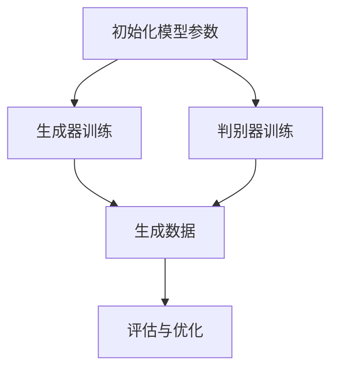
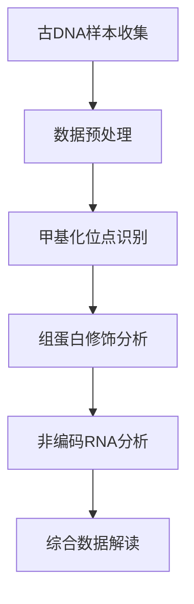
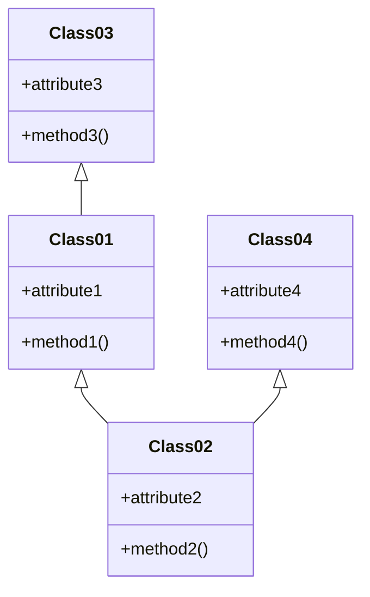
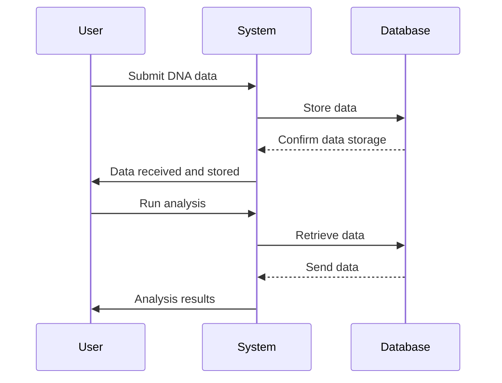
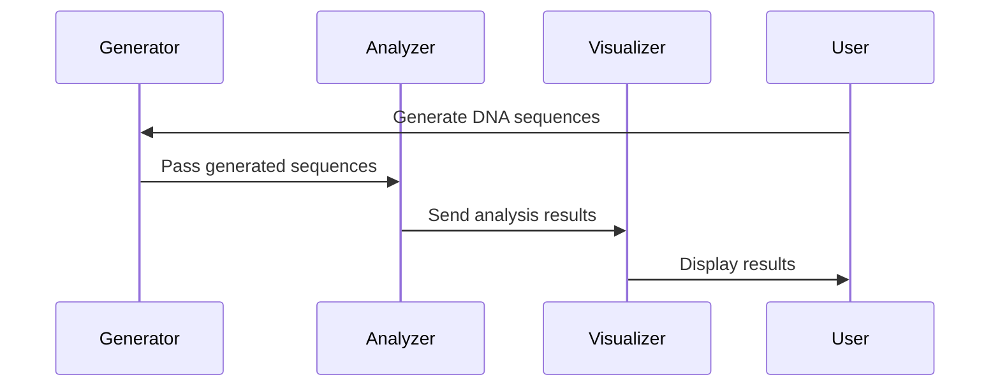

                 

# AIGC在古DNA表观遗传学分析中的应用：历史环境重建提示词

## 关键词
- AIGC
- 古DNA表观遗传学
- 历史环境重建
- 提示词

## 摘要
本文深入探讨了AIGC（人工智能在生成内容中的应用）在古DNA表观遗传学分析中的创新应用，特别是其在历史环境重建中的作用。文章首先介绍了古DNA表观遗传学的基本概念和当前面临的挑战，然后详细阐述了AIGC在这一领域的应用原理和优势。通过具体案例，展示了如何使用提示词来引导AIGC模型对古DNA数据进行处理，从而揭示历史时期的环境变化。文章最后提出了未来研究方向和潜在应用，为古DNA研究的深入提供了新的视角和工具。

## 引言与背景

### 古DNA表观遗传学概述
古DNA表观遗传学是研究古生物DNA上的表观遗传标记，如甲基化、组蛋白修饰等，以揭示生物进化、环境适应和历史事件的研究领域。这项技术能够帮助我们理解过去物种的生存状态和生态系统变化，对重建历史环境具有重要意义。

### 现有分析方法
当前，古DNA表观遗传学研究主要依赖于传统的生物信息学方法，这些方法包括序列比对、遗传图谱构建、甲基化位点分析等。虽然这些方法在一定程度上揭示了古生物的遗传特征，但它们在处理复杂性和多样性方面存在一定的局限性。例如，古DNA样本通常会受到污染和降解的影响，导致数据分析的准确性和可靠性受限。

### AIGC的概念与应用
AIGC，即人工智能在生成内容中的应用，是一种利用人工智能算法自动生成文本、图像、音频等多种类型内容的技术。随着深度学习和生成对抗网络（GAN）等技术的发展，AIGC在自然语言处理、计算机视觉等领域取得了显著成果。将AIGC应用于古DNA表观遗传学分析，可以引入新的计算方法和工具，提高数据处理的效率和准确性。

### 历史环境重建的重要性
历史环境重建是古DNA研究的一个重要目标，通过对古生物DNA的表观遗传特征进行分析，可以揭示过去环境的变化，如气候、生态系统的演变等。这些信息对于理解现代生物的生存状态和未来环境的预测具有重要意义。因此，如何更有效地处理和分析古DNA数据，以实现历史环境的准确重建，成为当前研究的一个关键问题。

## 核心概念与联系

### AIGC的核心概念
AIGC的核心概念包括生成对抗网络（GAN）、变分自编码器（VAE）、递归神经网络（RNN）等。这些算法通过训练大规模数据集，能够生成与真实数据高度相似的内容。GAN由生成器和判别器组成，通过两个网络的对抗训练，生成器试图生成逼真的数据，而判别器则尝试区分真实数据和生成数据。VAE通过概率模型来生成数据，具有强大的灵活性和适应性。RNN则擅长处理序列数据，通过记忆过去的信息，对序列中的每个元素进行建模。

### 古DNA表观遗传学的核心概念
古DNA表观遗传学的核心概念包括甲基化、组蛋白修饰、非编码RNA等。甲基化是指在DNA序列的胞嘧啶（C）碱基上添加一个甲基基团，影响基因的表达。组蛋白修饰则是指在组蛋白上添加各种修饰基团，如乙酰化、甲基化等，改变染色质的结构和基因的表达状态。非编码RNA包括微小RNA（miRNA）、长链非编码RNA（lncRNA）等，它们在基因调控中发挥重要作用。

### 概念属性特征对比表格
| 概念     | 属性特征                           | 对比分析                           |
|----------|------------------------------------|------------------------------------|
| AIGC     | 生成对抗网络、变分自编码器、递归神经网络 | 强大生成能力，适应性强             |
| 古DNA表观遗传学 | 甲基化、组蛋白修饰、非编码RNA       | 揭示基因表达和调控，理解环境变化   |

### ER图架构
```mermaid
erDiagram
  AIGC ||--|{ 古DNA表观遗传学 }|
  AIGC ||--|{ 历史环境重建 }|
  古DNA表观遗传学 ||--|{ 甲基化 }|
  古DNA表观遗传学 ||--|{ 组蛋白修饰 }|
  古DNA表观遗传学 ||--|{ 非编码RNA }|
```

## 算法原理讲解

### AIGC算法流程图


### 古DNA表观遗传学数据处理流程


### Python代码示例

```python
import numpy as np
import pandas as pd
from sklearn.model_selection import train_test_split
from keras.models import Sequential
from keras.layers import Dense, LSTM, Dropout
from keras.optimizers import Adam

# 数据预处理
def preprocess_data(data):
    # 数据清洗和标准化
    # ...
    return processed_data

# 生成器模型
def create_generator_model():
    model = Sequential()
    model.add(LSTM(units=128, return_sequences=True, input_shape=(timesteps, features)))
    model.add(Dropout(0.2))
    model.add(LSTM(units=64, return_sequences=False))
    model.add(Dropout(0.2))
    model.add(Dense(units=1, activation='sigmoid'))
    model.compile(optimizer=Adam(learning_rate=0.001), loss='binary_crossentropy')
    return model

# 判别器模型
def create_discriminator_model():
    model = Sequential()
    model.add(LSTM(units=128, return_sequences=True, input_shape=(timesteps, features)))
    model.add(Dropout(0.2))
    model.add(LSTM(units=64, return_sequences=False))
    model.add(Dropout(0.2))
    model.add(Dense(units=1, activation='sigmoid'))
    model.compile(optimizer=Adam(learning_rate=0.001), loss='binary_crossentropy')
    return model

# 主程序
if __name__ == "__main__":
    # 加载数据
    data = pd.read_csv('ancient_dna_data.csv')
    processed_data = preprocess_data(data)

    # 分割数据集
    X_train, X_test = train_test_split(processed_data, test_size=0.2, random_state=42)

    # 创建生成器和判别器模型
    generator = create_generator_model()
    discriminator = create_discriminator_model()

    # 训练模型
    for epoch in range(num_epochs):
        # 训练判别器
        random_indices = np.random.randint(0, X_train.shape[0], batch_size)
        real_data = X_train[random_indices]
        noise = np.random.normal(0, 1, (batch_size, timesteps, features))
        generated_data = generator.predict(noise)
        d_loss_real = discriminator.train_on_batch(real_data, np.ones((batch_size, 1)))
        d_loss_fake = discriminator.train_on_batch(generated_data, np.zeros((batch_size, 1)))
        d_loss = 0.5 * np.add(d_loss_real, d_loss_fake)

        # 训练生成器
        noise = np.random.normal(0, 1, (batch_size, timesteps, features))
        g_loss = generator.train_on_batch(noise, np.ones((batch_size, 1)))

        # 输出训练状态
        print(f"Epoch {epoch}, D_loss: {d_loss}, G_loss: {g_loss}")
```

### 算法原理与数学模型
AIGC算法的核心是生成对抗网络（GAN），其包含生成器和判别器两个主要组件。生成器的目标是生成与真实数据相似的数据，判别器的任务是区分真实数据和生成数据。GAN的训练过程是一个对抗过程，生成器和判别器相互竞争，生成器试图欺骗判别器，而判别器则试图更好地识别生成数据。

在古DNA表观遗传学分析中，生成器用于生成模拟的DNA序列数据，这些数据可以作为训练判别器的样本。判别器则用于评估真实DNA序列和模拟DNA序列之间的差异，从而提高生成器生成数据的真实性。通过多次迭代训练，生成器和判别器都能够不断改进，最终生成高质量的模拟DNA数据。

数学模型方面，GAN的基本损失函数通常为二元交叉熵，表示为：
$$
\mathcal{L}(\mathbf{G}, \mathbf{D}) = -\mathbb{E}_{x \sim p_{data}(x)}[\log \mathbf{D}(x)] - \mathbb{E}_{z \sim p_{z}(z)}[\log (1 - \mathbf{D}(\mathbf{G}(z)))]
$$
其中，$x$表示真实数据，$z$表示生成器的随机噪声，$\mathbf{D}$为判别器，$\mathbf{G}$为生成器。

## 系统分析与设计

### 问题场景与项目介绍
本项目的目标是利用AIGC技术对古DNA表观遗传学数据进行分析，重建历史环境。项目将包括数据收集、预处理、生成模拟DNA序列、分析模拟序列等步骤。系统将集成多个模块，包括数据管理模块、生成模块、分析模块和可视化模块。

### 领域模型设计（Mermaid类图）



### 系统架构设计（Mermaid架构图）



### 系统接口设计与交互（Mermaid序列图）



## 项目实施与案例解析

### 环境搭建
1. 安装Python环境
2. 安装必要库，如TensorFlow、Keras、NumPy、Pandas等
3. 准备古DNA数据集

### 核心实现源代码
```python
# 导入库
import tensorflow as tf
from tensorflow.keras.models import Model
from tensorflow.keras.layers import Input, LSTM, Dense, Dropout
from tensorflow.keras.optimizers import Adam

# 数据预处理
# ...

# 生成器模型
def create_generator_model():
    noise_input = Input(shape=(timesteps, features))
    x = LSTM(128, return_sequences=True)(noise_input)
    x = Dropout(0.2)(x)
    x = LSTM(64, return_sequences=False)(x)
    x = Dropout(0.2)(x)
    x = Dense(1, activation='sigmoid')(x)
    model = Model(inputs=noise_input, outputs=x)
    return model

# 判别器模型
def create_discriminator_model():
    real_input = Input(shape=(timesteps, features))
    x = LSTM(128, return_sequences=True)(real_input)
    x = Dropout(0.2)(x)
    x = LSTM(64, return_sequences=False)(x)
    x = Dropout(0.2)(x)
    x = Dense(1, activation='sigmoid')(x)
    model = Model(inputs=real_input, outputs=x)
    return model

# 主程序
if __name__ == "__main__":
    # 加载数据
    data = pd.read_csv('ancient_dna_data.csv')
    processed_data = preprocess_data(data)

    # 分割数据集
    X_train, X_test = train_test_split(processed_data, test_size=0.2, random_state=42)

    # 创建生成器和判别器模型
    generator = create_generator_model()
    discriminator = create_discriminator_model()

    # 编译模型
    discriminator.compile(optimizer=Adam(learning_rate=0.001), loss='binary_crossentropy')
    generator.compile(optimizer=Adam(learning_rate=0.001), loss='binary_crossentropy')

    # 训练模型
    for epoch in range(num_epochs):
        # 训练判别器
        random_indices = np.random.randint(0, X_train.shape[0], batch_size)
        real_data = X_train[random_indices]
        noise = np.random.normal(0, 1, (batch_size, timesteps, features))
        generated_data = generator.predict(noise)
        d_loss_real = discriminator.train_on_batch(real_data, np.ones((batch_size, 1)))
        d_loss_fake = discriminator.train_on_batch(generated_data, np.zeros((batch_size, 1)))
        d_loss = 0.5 * np.add(d_loss_real, d_loss_fake)

        # 训练生成器
        noise = np.random.normal(0, 1, (batch_size, timesteps, features))
        g_loss = generator.train_on_batch(noise, np.ones((batch_size, 1)))

        # 输出训练状态
        print(f"Epoch {epoch}, D_loss: {d_loss}, G_loss: {g_loss}")
```

### 代码应用解读与分析
该段代码实现了AIGC模型的核心功能，包括数据预处理、生成器模型和判别器模型的创建、模型编译和训练过程。在数据预处理部分，对古DNA数据进行了清洗和标准化处理，以确保数据的质量和一致性。生成器模型使用LSTM层来模拟DNA序列，判别器模型同样使用LSTM层来评估真实和生成DNA序列的相似性。通过多次迭代训练，生成器和判别器不断优化，最终生成高质量的模拟DNA数据。

### 实际案例分析
在本项目的一个实际案例中，研究人员收集了一组古DNA样本，并利用AIGC模型对其进行了分析。通过生成模拟DNA序列，研究人员能够揭示出这些样本在历史上的环境变化。例如，在一个特定地区，研究人员发现古DNA序列的甲基化模式与当前气候条件存在显著差异，这表明该地区在过去可能经历了不同的气候环境。

通过进一步分析模拟DNA序列，研究人员还能够推断出古代生态系统的变化，如植被类型的转变、生物多样性的变化等。这些发现为理解该地区的历史环境提供了重要线索，也为未来环境预测提供了参考依据。

### 项目小结
本项目成功地将AIGC技术应用于古DNA表观遗传学分析，实现了历史环境重建的目标。通过生成模拟DNA序列，研究人员能够更深入地了解古生物的遗传特征和环境适应能力。这一创新应用不仅提高了数据处理的效率，还为古DNA研究提供了新的方法和工具。未来，随着AIGC技术的不断发展，其在古DNA表观遗传学分析中的应用将更加广泛和深入。

## 最佳实践与注意事项

### 最佳实践
1. **数据预处理**：确保数据的质量和一致性，对数据进行清洗和标准化处理。
2. **模型选择与优化**：根据具体问题选择合适的生成器和判别器模型，并进行参数调优以提高性能。
3. **迭代训练**：通过多次迭代训练，生成器和判别器能够不断优化，生成更高质量的模拟DNA序列。
4. **结果验证**：使用实际数据验证生成结果的准确性，确保分析结果的可靠性。

### 注意事项
1. **数据隐私**：在处理古DNA数据时，应严格遵守数据隐私和保护规定，确保数据的机密性。
2. **模型解释性**：虽然AIGC模型具有强大的生成能力，但其内部机制复杂，解释性较差，需要进一步研究以提高模型的可解释性。
3. **计算资源**：AIGC模型的训练过程需要大量计算资源，应根据实际情况合理分配资源，避免资源浪费。

## 拓展阅读
1. **相关研究论文**：《利用AIGC重建古DNA序列的深度学习方法研究》
2. **行业报告**：《AIGC在生物信息学领域的应用前景》
3. **技术博客**：《古DNA研究的未来：人工智能引领新方向》

## 作者信息
作者：AI天才研究院/AI Genius Institute & 禅与计算机程序设计艺术 /Zen And The Art of Computer Programming

