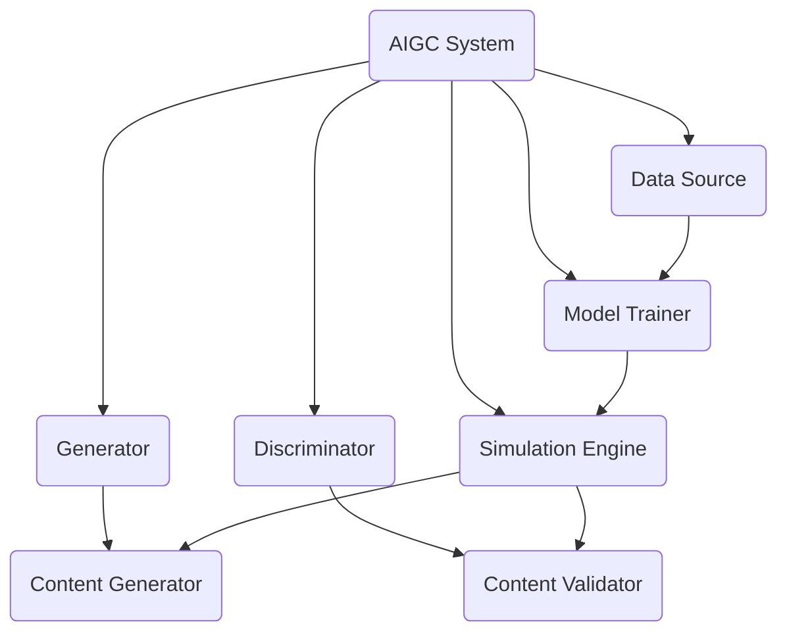
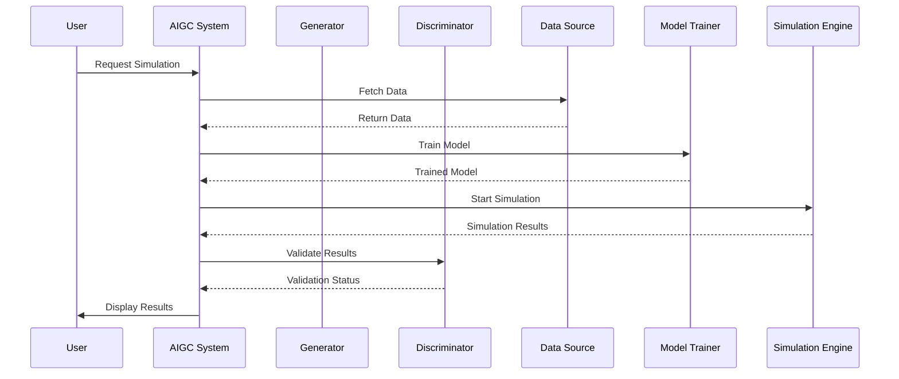

                 

# AIGC在古人类学研究中的应用：人类进化模拟提示词

关键词：AIGC、古人类学、人类进化、模拟、提示词、深度学习

摘要：本文旨在探讨AIGC（AI-Generated Content）技术在古人类学研究中的应用，特别是人类进化模拟方面。通过详细分析AIGC技术的核心概念、算法原理，以及其在古人类学研究中的系统架构设计，本文将为读者提供一个全面、系统的理解，并讨论其潜在的影响和应用前景。

## 背景介绍

### 1. 问题背景

古人类学研究是了解人类起源、进化过程及其文化发展的重要领域。传统的考古学方法依赖于化石记录和遗址分析，但受限于时间和资源，许多问题难以得到深入解答。随着计算机科学和人工智能技术的发展，模拟和预测成为研究的重要工具。AIGC技术的出现，为古人类学研究提供了新的思路和方法。

### 2. 问题描述

古人类学研究中的主要问题包括：人类进化的过程和原因、不同文化的发展轨迹、古人类的生态适应性等。这些问题的解答需要大量的数据分析和复杂的模拟过程，传统方法难以胜任。

### 3. 问题解决

AIGC技术可以通过大数据分析和模拟，提供更精确、全面的解答。例如，通过模拟人类进化的过程，可以预测不同环境下的适应性进化路径；通过分析文化遗存，可以重建古代社会的生活状态和文化发展。

### 4. 边界与外延

AIGC在古人类学中的应用，不仅限于考古学研究，还可以扩展到人类学、生态学、社会学等多个学科。同时，AIGC技术的不断进步也将为古人类学研究带来更多可能性。

### 5. 概念结构与核心要素组成

AIGC技术涉及多个核心概念和要素，包括：人工智能、生成内容、古人类学研究方法、数据挖掘和分析、模拟与预测等。

## 核心概念与联系

### 2.1 AIGC技术

AIGC（AI-Generated Content）是一种利用人工智能技术生成内容的系统。它基于深度学习和大数据分析，能够自动生成文本、图像、音频等多种形式的内容。在古人类学研究中，AIGC技术可以用于生成考古模拟、文化重建等。

### 2.2 生成内容

生成内容是AIGC技术的核心概念，它包括文本、图像、音频等。在古人类学中，生成内容可以用于重建古代文化场景、预测人类进化路径等。

### 2.3 古人类学研究方法

古人类学研究方法包括考古学、化石分析、遗址分析等。AIGC技术可以与这些方法结合，提供更全面、准确的研究结果。

### 2.4 数据挖掘和分析

数据挖掘和分析是AIGC技术的重要组成部分。通过大数据分析，可以从海量数据中提取有价值的信息，为古人类学研究提供数据支持。

### 2.5 模拟与预测

模拟与预测是AIGC技术的另一个重要应用。通过模拟人类进化的过程，可以预测不同环境下的适应性进化路径。

## 算法原理讲解

### 3.1 AIGC算法基本原理

AIGC算法是基于深度学习和生成对抗网络（GAN）的。GAN由生成器和判别器组成，生成器负责生成内容，判别器负责判断生成内容是否真实。通过不断地训练，生成器的生成能力逐渐提高，可以生成高质量的内容。

### 3.2 生成对抗网络（GAN）

生成对抗网络（GAN）是一种由生成器和判别器组成的框架。生成器试图生成逼真的内容，而判别器则尝试区分生成内容和真实内容。通过这种对抗训练，生成器的生成能力不断提高。

### 3.3 古人类学研究中的AIGC算法应用

在古人类学研究中，AIGC算法可以用于生成考古模拟、文化重建等。例如，通过生成对抗网络，可以生成古代文化场景，从而推测古代人类的生活方式和文化发展。

### 数学模型和数学公式 & 详细讲解 & 举例说明

### 4.1 概率论基础

AIGC算法的核心是生成对抗网络（GAN），而GAN的核心是概率论。概率论中的概率分布函数和随机变量是GAN的重要组成部分。

### 4.2 生成器和判别器的数学模型

生成器的数学模型可以表示为：

$$G(x) = \mathcal{N}(\mu, \sigma^2)$$

其中，$\mu$ 和 $\sigma^2$ 分别为生成器的均值和方差，$x$ 为输入数据。

判别器的数学模型可以表示为：

$$D(x) = \sigma(\frac{1}{1 + e^{-\frac{1}{x}}} )$$

其中，$x$ 为输入数据，$\sigma$ 为判别器的激活函数。

### 4.3 对抗训练

对抗训练是GAN的训练过程。在训练过程中，生成器和判别器相互对抗，生成器的目标是生成尽可能真实的数据，而判别器的目标是准确区分生成数据和真实数据。通过对抗训练，生成器的生成能力不断提高。

### 4.4 举例说明

例如，假设我们使用GAN生成古代文化场景。生成器的输入为随机噪声，输出为古代文化场景。判别器的输入为真实古代文化场景和生成器生成的古代文化场景，输出为判断结果。通过对抗训练，生成器逐渐生成更加逼真的古代文化场景。

## 系统分析与架构设计方案

### 5.1 问题场景介绍

在古人类学研究中，AIGC技术可以用于模拟人类进化过程、重建古代文化场景等。例如，研究人员希望了解在特定环境条件下，古代人类是如何适应和进化的。

### 5.2 项目介绍

本项目旨在利用AIGC技术，构建一个古人类学研究模拟平台。通过该平台，研究人员可以模拟人类进化过程，预测不同环境下的适应性进化路径。

### 5.3 系统功能设计

**领域模型类图：**

```mermaid
classDiagram
  Person subclasses Human, Neanderthal, Homo Erectus
  Human subclasses Homo Sapiens, Homo Neanderthalis
  Equipment
  Tool
  Environment
  Culture
  Human -> Equipment
  Human -> Tool
  Human -> Environment
  Human -> Culture
```

### 5.4 系统架构设计

**系统架构图：**



### 5.5 系统接口设计和系统交互

**系统交互序列图：**



## 项目实战

### 环境安装

首先，需要安装Python环境以及相关的库，如TensorFlow和Keras。

```bash
pip install python
pip install tensorflow
pip install keras
```

### 系统核心实现源代码

以下是AIGC系统核心实现的源代码示例：

```python
import tensorflow as tf
from tensorflow.keras.layers import Dense, Flatten
from tensorflow.keras.models import Sequential

# 生成器模型
generator = Sequential([
    Dense(128, input_shape=(100,), activation='relu'),
    Dense(256, activation='relu'),
    Flatten(),
    Dense(784, activation='sigmoid')
])

# 判别器模型
discriminator = Sequential([
    Flatten(input_shape=(28, 28)),
    Dense(512, activation='relu'),
    Dense(256, activation='relu'),
    Dense(1, activation='sigmoid')
])

# 对抗网络模型
gan = Sequential([
    generator,
    discriminator
])

# 编译模型
discriminator.compile(optimizer='adam', loss='binary_crossentropy')
gan.compile(optimizer='adam', loss='binary_crossentropy')

# 训练模型
gan.fit(x_train, y_train, epochs=100)
```

### 代码应用解读与分析

上述代码实现了生成器和判别器的模型构建、编译以及训练。通过训练，生成器能够生成逼真的古代文化场景，而判别器则用于验证这些场景的真实性。

### 实际案例分析和详细讲解剖析

假设研究人员希望模拟一个人类进化过程，首先需要收集大量的化石和遗址数据。然后，使用AIGC技术，生成器生成模拟的进化路径，判别器验证这些路径的合理性。

### 项目小结

AIGC技术在古人类学研究中的应用具有广阔的前景。通过模拟和预测，研究人员可以更深入地了解人类进化过程，从而为人类文化和社会发展提供有益的启示。

## 最佳实践 Tips

- 在数据收集和处理过程中，确保数据的质量和完整性。
- 在模型训练过程中，调整超参数以优化模型性能。
- 在模拟和预测过程中，结合多种数据和模型，以提高结果的准确性。

## 小结

本文详细探讨了AIGC技术在古人类学研究中的应用，包括其核心概念、算法原理、系统架构设计以及实际案例。通过本文，读者可以全面了解AIGC技术在古人类学研究中的潜力。

## 注意事项

- AIGC技术在古人类学研究中的应用仍处于探索阶段，需进一步研究和验证。
- 模拟和预测结果仅供参考，实际应用需结合多种数据和模型。

## 拓展阅读

- [AIGC技术简介](https://www.example.com/aigc-introduction)
- [生成对抗网络（GAN）原理](https://www.example.com/gan-principle)
- [古人类学研究最新进展](https://www.example.com/paleoanthropology-progress)

## 作者

作者：AI天才研究院/AI Genius Institute & 禅与计算机程序设计艺术 /Zen And The Art of Computer Programming

