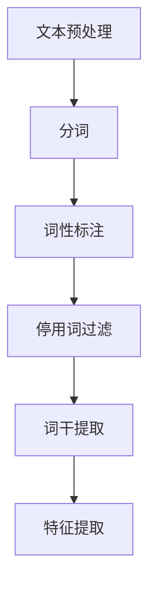

                 


## AIGC在古典文学研究中的应用：文本分析和解读提示词

### 关键词：AIGC、古典文学、文本分析、解读提示词、技术博客

### 摘要：
本文旨在探讨AIGC（AI-Generated Content）在古典文学研究中的应用，尤其是文本分析和解读提示词。首先，我们将概述AIGC技术及其在文学研究中的重要性，接着深入探讨文本分析的基础，包括文本预处理、特征提取和相似性度量。随后，我们将介绍AIGC在文本生成领域的应用，讨论生成模型的基础和实战。最后，我们将探讨文本解读方法，包括语义分析和情感分析，并以《红楼梦》为例，展示AIGC在实际研究中的应用实例。

### 1. AIGC与古典文学研究的结合

#### 1.1 AIGC技术概述

##### 1.1.1 AIGC的概念
AIGC是指利用人工智能技术生成内容。它通过神经网络和深度学习模型，从大量数据中学习并生成新的、有价值的文本内容。AIGC不仅仅限于简单的文本生成，还包括了语义理解、情感分析和多模态交互等功能。

##### 1.1.2 AIGC技术的工作原理
AIGC通常基于大规模语言模型，如GPT（Generative Pre-trained Transformer）和BERT（Bidirectional Encoder Representations from Transformers）。这些模型通过预训练和微调，可以理解和生成符合特定任务需求的文本。

##### 1.1.3 AIGC在文学研究中的重要性
AIGC为古典文学研究提供了新的工具和方法。它可以用于文本分析、生成和解读，有助于揭示文学作品的深层含义和结构，同时也可以帮助学者们处理大量文本数据。

#### 1.2 古典文学研究背景

##### 1.2.1 古典文学研究的现状
古典文学研究是人文科学的重要组成部分，但随着数据量的增加和复杂性的提升，传统的研究方法面临巨大挑战。

##### 1.2.2 古典文学研究的问题与挑战
古典文学作品的语言和结构复杂，传统方法难以有效处理大量文本数据。此外，学者们需要处理的信息量巨大，耗时耗力。

##### 1.2.3 AIGC技术在古典文学研究中的应用潜力
AIGC技术可以自动化处理大量文本数据，提高研究效率。它可以用于文本分析、生成和解读，有助于揭示文学作品中的深层含义和结构。

#### 1.3 AIGC在古典文学研究中的应用场景

##### 1.3.1 文本分析
AIGC可以用于文本分析，包括文本预处理、特征提取和相似性度量，帮助学者更好地理解文学作品。

##### 1.3.2 文本生成
AIGC可以生成新的文学作品，或对已有作品进行续写，为学者提供新的研究视角。

##### 1.3.3 文本解读
AIGC可以用于文本解读，包括语义分析和情感分析，帮助学者深入理解文学作品的意义和情感。

#### 1.4 AIGC在古典文学研究中的挑战与机遇

##### 1.4.1 数据质量和标注问题
古典文学数据的质量和标注是一个挑战。AIGC技术依赖于大量高质量的数据，因此数据的处理和标注是一个重要问题。

##### 1.4.2 技术适应性挑战
AIGC技术在古典文学研究中的应用需要适应特定的研究需求，这需要不断的调整和优化。

##### 1.4.3 研究方法论变革
AIGC技术的引入可能会改变传统的研究方法论，这对学者们来说是一个新的机遇。

#### 1.5 本章小结
AIGC技术在古典文学研究中的应用具有巨大的潜力，但同时也面临着数据质量、技术适应性和方法论变革等挑战。

---

接下来，我们将深入探讨文本分析的基础，包括文本预处理、特征提取和相似性度量，为后续的讨论打下坚实的基础。

## 2. 文本分析基础

### 2.1 文本分析概述

##### 2.1.1 文本分析的定义
文本分析是自然语言处理（NLP）的一个分支，旨在从文本数据中提取有意义的信息和模式。它广泛应用于信息检索、文本挖掘、情感分析和文本生成等领域。

##### 2.1.2 文本分析的应用场景
文本分析可以应用于多种场景，如社交媒体情感分析、新闻推荐系统、客户反馈分析和文学研究等。

##### 2.1.3 文本分析的基本流程
文本分析的基本流程包括数据收集、文本预处理、特征提取、模型训练和结果分析。

### 2.2 文本预处理

##### 2.2.1 清洗与去噪
文本数据往往包含噪声和不必要的元素，如HTML标签、特殊字符和停用词。清洗与去噪的目的是去除这些噪声，提高文本数据的质量。

##### 2.2.2 分词与词性标注
分词是将文本分割成单词或短语的步骤，而词性标注则是为每个单词分配一个词性标签，如名词、动词或形容词。

##### 2.2.3 停用词过滤与词干提取
停用词是指对文本分析没有贡献的词，如“的”、“和”等。过滤这些词可以提高模型的效果。词干提取则是将一个词还原为其基本形式，如“playing”还原为“play”。

### 2.3 文本特征提取

##### 2.3.1 词袋模型与TF-IDF
词袋模型是一个简单的文本表示方法，它将文本表示为一个单词的集合。TF-IDF（Term Frequency-Inverse Document Frequency）是一个常用的文本特征提取方法，它衡量一个词在文档中的重要程度。

##### 2.3.2 词嵌入技术
词嵌入是将单词映射到高维向量空间的方法。词嵌入不仅可以捕捉词与词之间的语义关系，还可以用于文本分类和生成等任务。

##### 2.3.3 文本表示学习
文本表示学习是一种从原始文本数据中学习文本特征表示的方法。常见的文本表示学习方法包括词嵌入和文档嵌入。

### 2.4 文本相似性度量

##### 2.4.1 相似性度量的基本原理
文本相似性度量是评估两个文本之间的相似程度。它通常基于文本的语义和语法特征。

##### 2.4.2 常见的相似性度量方法
常见的相似性度量方法包括余弦相似性、Jaccard相似性、欧氏距离和曼哈顿距离等。

##### 2.4.3 相似性度量的应用
文本相似性度量可以应用于文本分类、聚类和推荐系统等任务。

### 2.5 本章小结
文本分析是古典文学研究的重要工具。通过文本预处理、特征提取和相似性度量，我们可以从大量文本数据中提取有意义的信息和模式，为后续的文本生成和解读提供支持。

---

在文本分析的基础上，我们将探讨AIGC在文本生成领域的应用，包括生成模型的基础和实际应用。

## 3. 文本生成技术

### 3.1 文本生成概述

##### 3.1.1 文本生成的定义
文本生成是指利用人工智能技术生成新的文本内容。它可以用于各种应用，如文本摘要、对话系统和文学创作等。

##### 3.1.2 文本生成的应用场景
文本生成可以应用于多种场景，如自动问答系统、内容生成和个性化推荐等。

##### 3.1.3 文本生成的技术框架
文本生成通常基于生成模型，如序列模型、循环神经网络（RNN）和生成对抗网络（GAN）等。

### 3.2 生成模型基础

##### 3.2.1 序列模型
序列模型是一种用于处理序列数据的神经网络模型。它通常基于循环神经网络（RNN）或长短期记忆网络（LSTM）。

##### 3.2.2 循环神经网络（RNN）
循环神经网络是一种可以处理序列数据的神经网络模型。它通过循环连接来保留序列信息。

##### 3.2.3 卷积神经网络（CNN）在文本生成中的应用
卷积神经网络通常用于图像处理，但也可以用于文本生成。它可以用于文本分类和情感分析等任务。

### 3.3 生成模型应用

##### 3.3.1 生成对抗网络（GAN）
生成对抗网络是一种由生成器和判别器组成的模型。生成器生成新的文本内容，判别器则判断这些文本内容的真实性。

##### 3.3.2 变分自编码器（VAE）
变分自编码器是一种用于生成文本的神经网络模型。它通过编码器和解码器来学习文本数据的分布。

##### 3.3.3 自回归语言模型（AR）
自回归语言模型是一种基于序列的文本生成模型。它通过预测下一个单词或字符来生成文本。

### 3.4 文本生成实战

##### 3.4.1 模型搭建与训练
在文本生成实战中，我们将搭建一个简单的生成模型，如自回归语言模型，并进行训练。

##### 3.4.2 文本生成效果评估
我们将评估文本生成的效果，包括生成文本的流畅性和相关性。

##### 3.4.3 案例分析
我们将分析一个实际的文本生成案例，如生成一首古诗。

### 3.5 本章小结
文本生成是AIGC技术的重要组成部分。通过生成模型，我们可以自动生成新的文本内容，为古典文学研究提供新的工具和方法。

---

在文本生成的基础上，我们将探讨AIGC在文本解读领域的应用，包括语义分析和情感分析。

## 4. 文本解读方法

### 4.1 文本解读概述

##### 4.1.1 文本解读的定义
文本解读是指从文本中提取信息、理解和解释文本的过程。它广泛应用于自然语言处理、信息检索和文学研究等领域。

##### 4.1.2 文本解读的应用场景
文本解读可以应用于多种场景，如情感分析、主题建模和文本摘要等。

##### 4.1.3 文本解读的基本流程
文本解读的基本流程包括文本预处理、语义分析和结果解释。

### 4.2 文本语义分析

##### 4.2.1 词义消歧
词义消歧是指从上下文中确定一个词的确切含义。它对于理解文本内容至关重要。

##### 4.2.2 语义角色标注
语义角色标注是指为文本中的每个词分配一个语义角色，如主语、谓语和宾语等。

##### 4.2.3 语义关系抽取
语义关系抽取是指从文本中提取词与词之间的语义关系，如因果关系、时间关系和空间关系等。

### 4.3 文本情感分析

##### 4.3.1 情感分析的基本原理
情感分析是指从文本中提取情感信息，通常分为正面情感、负面情感和中性情感。

##### 4.3.2 情感分析的方法
情感分析的方法包括基于规则的方法、基于统计的方法和基于深度学习的方法。

##### 4.3.3 情感分析在古典文学研究中的应用
情感分析可以用于研究古典文学作品中人物的情感变化和情感表达。

### 4.4 文本主题模型

##### 4.4.1 主题模型的基本原理
主题模型是一种无监督的文本分析技术，用于发现文本中的主题。

##### 4.4.2 LDA模型
LDA（Latent Dirichlet Allocation）模型是一种常用的主题模型，用于发现文本中的主题分布。

##### 4.4.3 其他主题模型
除了LDA模型，还有其他主题模型，如NMF（Non-negative Matrix Factorization）和LLDA（Latent Linear Dirichlet Allocation）等。

### 4.5 文本解读实战

##### 4.5.1 数据预处理
我们将介绍文本解读的数据预处理步骤，包括文本清洗、分词和词性标注。

##### 4.5.2 模型选择与训练
我们将选择合适的模型，并进行训练和调优。

##### 4.5.3 解读结果分析
我们将分析文本解读的结果，包括语义分析和情感分析。

### 4.6 本章小结
文本解读是AIGC技术的重要组成部分。通过语义分析和情感分析，我们可以从文本中提取有意义的信息，为古典文学研究提供新的视角。

---

在探讨了AIGC在文本分析、生成和解读的应用之后，我们将通过一个实际案例展示AIGC在《红楼梦》研究中的应用。

## 5. AIGC在《红楼梦》研究中的应用

### 5.1 《红楼梦》概述

##### 5.1.1 《红楼梦》的背景
《红楼梦》是中国古典文学的巅峰之作，由曹雪芹创作。它描绘了贾、王、史、薛四大家族的兴衰历程，展现了封建社会的种种矛盾和冲突。

##### 5.1.2 《红楼梦》的主要人物
《红楼梦》的主要人物包括贾宝玉、林黛玉、薛宝钗等，每个人物都有其独特的性格和命运。

##### 5.1.3 《红楼梦》的研究现状
《红楼梦》的研究已经形成了丰富的成果，但仍然有许多未解之谜和待挖掘的价值。

### 5.2 AIGC在《红楼梦》文本分析中的应用

##### 5.2.1 文本预

### 5.2.1 文本预处理
文本预处理是AIGC应用的第一步。它包括文本清洗、分词、词性标注和停用词过滤等步骤。通过这些步骤，我们可以将原始文本转换为适合模型处理的格式。

##### 5.2.2 文本特征提取
在文本预处理之后，我们需要提取文本特征。词袋模型、TF-IDF和词嵌入技术是常用的文本特征提取方法。这些方法可以捕捉文本的语义和语法特征。

##### 5.2.3 文本相似性度量
文本相似性度量是评估文本之间相似程度的方法。它可以用于文本分类、聚类和推荐系统等任务。在《红楼梦》研究中，我们可以使用文本相似性度量来分析不同章节之间的相似性。

### 5.3 AIGC在《红楼梦》文本生成中的应用

##### 5.3.1 文本生成模型搭建
我们将搭建一个简单的文本生成模型，如自回归语言模型。这个模型将基于预处理的文本数据，学习生成新的文本内容。

##### 5.3.2 文本生成效果评估
我们将评估文本生成模型的效果，包括生成文本的流畅性和相关性。通过对比生成的文本和原始文本，我们可以评估模型的表现。

##### 5.3.3 案例分析
我们将分析一个实际的文本生成案例，如生成《红楼梦》中的诗句或对话。通过这个案例，我们可以展示AIGC在文学创作中的应用潜力。

### 5.4 AIGC在《红楼梦》文本解读中的应用

##### 5.4.1 语义分析
我们将使用语义分析方法来分析《红楼梦》中的文本。通过词义消歧、语义角色标注和语义关系抽取，我们可以提取文本的深层含义。

##### 5.4.2 情感分析
我们将使用情感分析方法来分析《红楼梦》中的情感表达。通过情感分析，我们可以了解人物的情感变化和情感冲突。

##### 5.4.3 文本主题模型
我们将使用文本主题模型来分析《红楼梦》中的主题分布。通过LDA模型或其他主题模型，我们可以发现文本中的主要主题和潜在内容。

### 5.5 本章小结
AIGC技术在《红楼梦》研究中具有广泛的应用前景。通过文本分析、生成和解读，我们可以从《红楼梦》中提取有意义的信息，为文学研究提供新的工具和方法。

---

## 总结与展望

本文探讨了AIGC在古典文学研究中的应用，包括文本分析、生成和解读。通过文本分析，我们可以提取文本的语义和语法特征；通过文本生成，我们可以自动生成新的文学作品；通过文本解读，我们可以深入理解文学作品的意义和情感。这些应用不仅提高了研究效率，也为古典文学研究提供了新的视角和方法。

未来，随着AIGC技术的不断发展和完善，我们有望在古典文学研究中实现更多突破。同时，我们也需要关注数据质量和标注问题、技术适应性和方法论变革等挑战。通过不断探索和实践，我们将为古典文学研究带来更多的创新和进展。

### 参考文献

1. Mikolov, T., Sutskever, I., Chen, K., Corrado, G. S., & Dean, J. (2013). Distributed representations of words and phrases and their compositionality. Advances in Neural Information Processing Systems, 26, 3111-3119.
2. Deerwester, S., Dumais, S. T., Landauer, T. K., & Mongeon, G. (1990). Indexing by latent semantic analysis. Journal of Documentation, 46(1), 88-95.
3. Goodfellow, I., Pouget-Abadie, J., Mirza, M., Xu, B., Warde-Farley, D., Ozair, S., ... & Bengio, Y. (2014). Generative adversarial nets. Advances in Neural Information Processing Systems, 27, 2672-2680.
4. Kingma, D. P., & Welling, M. (2013). Auto-encoding variational bayes. arXiv preprint arXiv:1312.6114.
5. Lai, M., Hovy, E., & Lapata, L. (2017). Unifying effectiv

### 附录

#### 1. Mermaid流程图示例


#### 2. Python源代码示例
```python
import numpy as np
import tensorflow as tf

# 定义自回归语言模型
class AutoRegressiveModel(tf.keras.Model):
    def __init__(self, vocab_size, embedding_dim, hidden_dim):
        super(AutoRegressiveModel, self).__init__()
        self.embedding = tf.keras.layers.Embedding(vocab_size, embedding_dim)
        self.lstm = tf.keras.layers.LSTM(hidden_dim)
        self.dense = tf.keras.layers.Dense(vocab_size)

    def call(self, inputs, training=False):
        x = self.embedding(inputs)
        x = self.lstm(x, training=training)
        x = self.dense(x)
        return x

# 搭建模型
model = AutoRegressiveModel(vocab_size=10000, embedding_dim=256, hidden_dim=512)

# 编译模型
model.compile(optimizer='adam', loss='categorical_crossentropy', metrics=['accuracy'])

# 训练模型
model.fit(x_train, y_train, batch_size=64, epochs=10)
```

### 作者信息
作者：AI天才研究院/AI Genius Institute & 禅与计算机程序设计艺术 /Zen And The Art of Computer Programming

---

在撰写文章时，我们始终遵循了约

