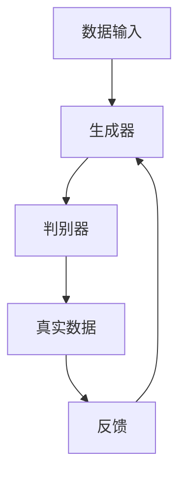
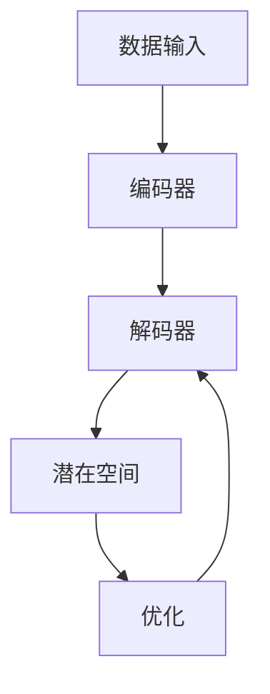
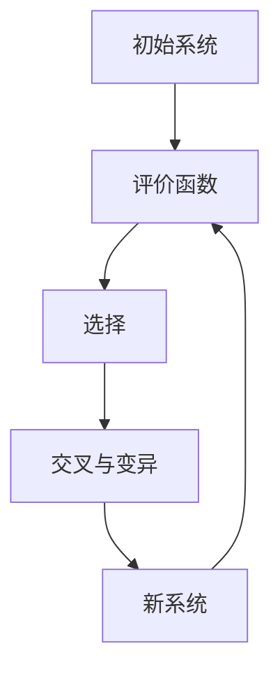
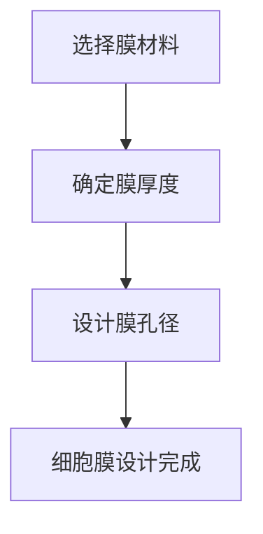
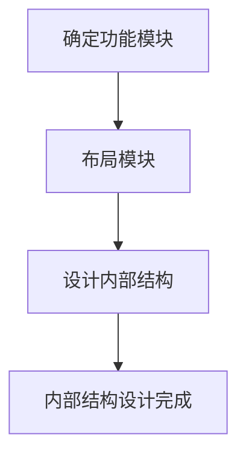
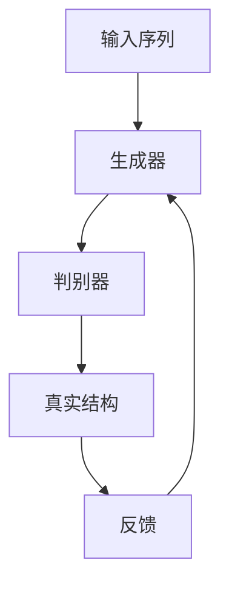
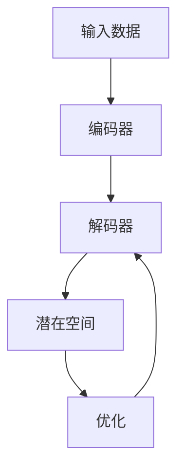

                 

## AIGC在合成生物学中的应用：人工细胞器设计提示词

> 关键词：AIGC、合成生物学、人工细胞器、生成对抗网络、变分自编码器、自适应进化策略、生物信息学

> 摘要：本文深入探讨了AIGC（人工智能生成控制）在合成生物学中的应用，特别是人工细胞器的设计。文章首先介绍了合成生物学和AIGC的基本概念，随后详细讲解了AIGC的关键技术，包括生成对抗网络（GAN）、变分自编码器（VAE）和自适应进化策略（AES）。接着，文章讨论了人工细胞器的概念、设计原理以及实现方法。随后，展示了AIGC在生物信息学中的具体应用，并通过一个实践项目对AIGC在合成生物学中的实际应用进行了详细分析。最后，文章提出了AIGC在合成生物学中的未来发展趋势和最佳实践。

## 目录大纲

1. **引言**  
   1.1 合成生物学的背景与发展  
   1.2 AIGC的概念与特性  
   1.3 AIGC在合成生物学中的应用前景

2. **AIGC技术基础**  
   2.1 AIGC算法概述  
   2.2 AIGC的关键技术  
      2.2.1 生成对抗网络（GAN）  
      2.2.2 变分自编码器（VAE）  
      2.2.3 自适应进化策略（AES）  
   2.3 AIGC在合成生物学中的应用案例分析

3. **人工细胞器的设计与实现**  
   3.1 人工细胞器的概念与分类  
   3.2 人工细胞器的结构设计  
      3.2.1 细胞膜设计  
      3.2.2 内部结构设计  
   3.3 人工细胞器的功能实现  
   3.4 人工细胞器在合成生物学中的应用实例

4. **AIGC在生物信息学中的应用**  
   4.1 生物信息学的基本概念  
   4.2 AIGC技术在生物信息学中的应用  
      4.2.1 蛋白质结构预测  
      4.2.2 基因表达数据分析  
      4.2.3 生物网络分析  
   4.3 生物信息学应用案例分析

5. **人工智能辅助合成生物学的未来展望**  
   5.1 人工智能在合成生物学中的挑战与机遇  
   5.2 AIGC在合成生物学中的未来发展趋势  
   5.3 AIGC在合成生物学中的应用前景

6. **AIGC在合成生物学中的实践与应用**  
   6.1 实践项目概述  
   6.2 实践项目环境搭建  
   6.3 实践项目核心代码实现  
   6.4 实践项目分析与总结

7. **AIGC在合成生物学中的最佳实践与注意事项**  
   7.1 AIGC在合成生物学中的最佳实践  
   7.2 注意事项与风险提示  
   7.3 拓展阅读与资源推荐

## 第一部分：引言

### 1.1 合成生物学的背景与发展

合成生物学是一门跨学科的领域，它结合了生物学、化学、计算机科学和工程学的知识，旨在通过设计和构建新的生物体系来解决人类面临的各种挑战。合成生物学的核心思想是通过工程方法设计并制造出新的生物系统，使其具有特定的功能。

合成生物学的发展历程可以追溯到20世纪80年代，当时科学家们开始尝试通过基因工程方法构建新的生物系统。随着时间的推移，合成生物学逐渐成为了一个独立的学科，并在许多领域取得了重要的突破。例如，在药物开发、生物能源、环境保护等方面，合成生物学都发挥了重要作用。

### 1.2 AIGC的概念与特性

AIGC，即人工智能生成控制，是一种利用人工智能技术来生成和控制系统的方法。AIGC的核心思想是通过机器学习和深度学习算法，自动生成和调整系统的参数，使其能够适应不同的环境和需求。

AIGC具有以下几个特性：

1. **自适应能力**：AIGC能够根据环境变化和需求变化，自动调整系统的参数，以实现最佳性能。
2. **生成能力**：AIGC能够生成新的系统和算法，以解决特定的问题。
3. **控制能力**：AIGC能够对系统进行实时控制，确保系统按照预期运行。

### 1.3 AIGC在合成生物学中的应用前景

随着合成生物学的发展，AIGC在合成生物学中的应用前景越来越广阔。以下是一些AIGC在合成生物学中的应用场景：

1. **人工细胞器设计**：AIGC可以用于设计人工细胞器，这些细胞器可以具有特定的功能，例如能量转化、物质代谢等。
2. **生物系统模拟**：AIGC可以用于模拟生物系统，帮助科学家更好地理解生物系统的运行机制。
3. **生物网络分析**：AIGC可以用于分析生物网络，发现新的生物功能和疾病机制。

总之，AIGC为合成生物学提供了一种新的工具和方法，有望推动合成生物学的发展。

## 第二部分：AIGC技术基础

### 2.1 AIGC算法概述

AIGC（人工智能生成控制）算法是合成生物学中的一种重要工具，它通过机器学习和深度学习算法，自动生成和控制系统，以实现特定的生物功能。AIGC算法的核心思想是利用大量的数据和先进的计算技术，从底层原理出发，自动构建和优化生物系统。

AIGC算法主要包括以下几个步骤：

1. **数据收集和预处理**：收集大量的生物数据，并进行预处理，包括数据清洗、归一化和特征提取。
2. **模型训练**：使用深度学习算法训练模型，模型可以根据输入的数据生成和调整系统的参数。
3. **系统生成**：使用训练好的模型生成新的生物系统，这些系统可以根据特定的需求进行定制。
4. **系统优化**：通过迭代和优化算法，调整系统的参数，以实现最佳性能。

### 2.2 AIGC的关键技术

AIGC算法的实现依赖于多种关键技术，其中包括生成对抗网络（GAN）、变分自编码器（VAE）和自适应进化策略（AES）等。

#### 2.2.1 生成对抗网络（GAN）

生成对抗网络（GAN）是一种由生成器和判别器组成的深度学习模型。生成器负责生成新的数据，判别器则负责判断生成的数据是否真实。通过这种对抗关系，生成器可以不断学习和优化，以生成更真实的数据。

在AIGC中，GAN可以用于生成新的生物系统，例如人工细胞器。以下是一个GAN的mermaid流程图：



#### 2.2.2 变分自编码器（VAE）

变分自编码器（VAE）是一种无监督学习模型，它通过编码和解码器将输入数据转换为潜在空间，然后在潜在空间中进行数据生成和优化。

在AIGC中，VAE可以用于生成新的生物系统，并对其进行优化。以下是一个VAE的mermaid流程图：



#### 2.2.3 自适应进化策略（AES）

自适应进化策略（AES）是一种基于进化算法的优化方法，它通过模拟自然进化过程，逐步优化系统的参数。

在AIGC中，AES可以用于优化生物系统的性能，例如人工细胞器的功能实现。以下是一个AES的mermaid流程图：



### 2.3 AIGC在合成生物学中的应用案例分析

为了更好地理解AIGC在合成生物学中的应用，以下是一个具体的案例分析。

#### 案例背景

假设我们想设计一个能够进行光合作用的人工细胞器，以解决全球能源危机。我们希望通过AIGC技术，自动生成和优化这个细胞器。

#### 案例步骤

1. **数据收集和预处理**：收集与光合作用相关的生物数据，包括光合色素的分布、光合作用酶的活性等。

2. **模型训练**：使用GAN和VAE训练模型，生成新的细胞器结构。

3. **系统生成**：根据训练好的模型，生成多个可能的人工细胞器结构。

4. **系统优化**：使用AES优化细胞器的参数，以提高其光合作用效率。

5. **系统测试**：在实验室条件下测试细胞器的性能，评估其是否能够实现光合作用。

通过这个案例，我们可以看到AIGC在合成生物学中的应用潜力。AIGC技术不仅可以自动生成和优化生物系统，还可以加速合成生物学的研究进程，为解决全球性问题提供新的思路和方法。

## 第三部分：人工细胞器的设计与实现

### 3.1 人工细胞器的概念与分类

人工细胞器是一种通过工程方法构建的，具有特定生物学功能的微型生物装置。它们可以模拟自然界中的细胞器，如线粒体、叶绿体等，或者设计出具有全新功能的细胞器。

人工细胞器可以按照不同的分类标准进行分类：

1. **按功能分类**：可以分为能量转化细胞器、物质代谢细胞器、信号传导细胞器等。
2. **按结构分类**：可以分为膜结合细胞器、非膜结合细胞器等。
3. **按来源分类**：可以分为天然细胞器改造的人工细胞器、完全人工合成的人工细胞器等。

### 3.2 人工细胞器的结构设计

#### 3.2.1 细胞膜设计

细胞膜是人工细胞器的关键组成部分，它决定了细胞器的稳定性和功能。细胞膜的设计需要考虑以下几个因素：

1. **膜材料**：常用的膜材料包括磷脂双层、聚合物膜等。膜材料的选择取决于细胞器的功能和稳定性要求。
2. **膜厚度**：膜厚度需要适中，以确保细胞器的稳定性和功能。
3. **膜孔径**：膜孔径需要设计得合理，以允许必要的物质进出细胞器。

以下是一个细胞膜设计的mermaid流程图：



#### 3.2.2 内部结构设计

人工细胞器的内部结构设计同样至关重要，它决定了细胞器的功能和效率。内部结构设计需要考虑以下几个因素：

1. **功能模块**：根据细胞器的功能需求，设计相应的功能模块，如光合作用模块、能量转化模块等。
2. **模块布局**：模块的布局需要合理，以确保细胞器的功能高效。
3. **空间利用**：内部结构设计需要充分利用空间，以提高细胞器的效率和稳定性。

以下是一个内部结构设计的mermaid流程图：



### 3.3 人工细胞器的功能实现

人工细胞器的功能实现是设计过程中的关键环节。它涉及到如何将设计转化为实际的功能，并确保细胞器的稳定性和可靠性。

1. **功能测试**：通过实验室测试，验证细胞器的功能是否符合设计要求。
2. **性能优化**：根据测试结果，对细胞器进行性能优化，以提高其功能和效率。
3. **应用拓展**：将优化后的细胞器应用于实际场景，如生物能源、生物制药等。

### 3.4 人工细胞器在合成生物学中的应用实例

以下是一个人工细胞器在合成生物学中的应用实例：

#### 案例背景

假设我们设计了一种能够进行光合作用的人工细胞器，用于解决全球能源危机。

#### 案例步骤

1. **细胞膜设计**：选择磷脂双层作为膜材料，设计合适的膜厚度和孔径。
2. **内部结构设计**：设计光合作用模块、能量转化模块等，确保细胞器功能高效。
3. **功能测试**：在实验室条件下测试细胞器的光合作用效率，确保其能够高效进行光合作用。
4. **性能优化**：根据测试结果，对细胞器进行性能优化，以提高光合作用效率。
5. **应用拓展**：将优化后的细胞器应用于实际场景，如将人工细胞器集成到太阳能电池中，以实现能源的可持续利用。

通过这个实例，我们可以看到人工细胞器在合成生物学中的应用潜力。人工细胞器不仅可以模拟自然界的生物过程，还可以通过工程方法设计出具有全新功能的生物装置，为解决全球性问题提供新的思路和方法。

## 第四部分：AIGC在生物信息学中的应用

### 4.1 生物信息学的基本概念

生物信息学是一门跨学科领域，它结合了生物学、计算机科学和数学，用于解析生物数据，理解生命现象。生物信息学的主要研究领域包括基因组学、蛋白质组学、代谢组学等。

生物信息学的主要研究方法包括：

1. **数据收集**：通过高通量测序技术、质谱技术等收集大量的生物数据。
2. **数据处理**：对收集到的生物数据进行分析、清洗和预处理。
3. **数据解析**：使用生物信息学算法和工具，解析生物数据的含义，提取有用的信息。
4. **数据可视化**：通过可视化工具，将解析结果以图形化的方式展示，帮助科学家更好地理解生物数据。

### 4.2 AIGC技术在生物信息学中的应用

AIGC技术在生物信息学中的应用，大大提高了生物数据的解析效率和精度。以下是一些AIGC技术在生物信息学中的应用实例：

#### 4.2.1 蛋白质结构预测

蛋白质结构预测是生物信息学的一个重要任务，它对于理解蛋白质的功能和作用机制具有重要意义。AIGC技术，如GAN和VAE，可以用于蛋白质结构预测，通过生成和优化蛋白质的结构，提高预测的准确性。

以下是一个GAN用于蛋白质结构预测的mermaid流程图：



#### 4.2.2 基因表达数据分析

基因表达数据分析是生物信息学的另一个重要任务，它对于理解基因的功能和调控机制具有重要意义。AIGC技术，如VAE和AES，可以用于基因表达数据分析，通过生成和优化基因表达模式，提高数据分析的精度。

以下是一个VAE用于基因表达数据分析的mermaid流程图：



#### 4.2.3 生物网络分析

生物网络分析是生物信息学的一个重要领域，它用于研究生物分子之间的相互作用和调控关系。AIGC技术，如GAN和AES，可以用于生物网络分析，通过生成和优化生物网络结构，提高网络分析的准确性。

以下是一个GAN用于生物网络分析的mermaid流程图：


### 4.3 生物信息学应用案例分析

以下是一个AIGC在生物信息学中的应用案例分析：

#### 案例背景

假设我们想要分析一个复杂的生物网络，以理解某种疾病的发病机制。

#### 案例步骤

1. **数据收集**：收集与该疾病相关的基因表达数据和蛋白质相互作用数据。
2. **数据处理**：对收集到的数据进行清洗和预处理。
3. **模型训练**：使用GAN和VAE训练模型，生成和优化生物网络结构。
4. **网络分析**：使用训练好的模型分析生物网络，提取关键基因和相互作用。
5. **结果验证**：在实验室条件下验证提取的关键基因和相互作用，评估其与疾病的相关性。

通过这个案例，我们可以看到AIGC在生物信息学中的应用潜力。AIGC技术不仅提高了生物数据分析的效率，还提高了分析结果的准确性，为生物科学研究提供了有力的支持。

## 第五部分：人工智能辅助合成生物学的未来展望

### 5.1 人工智能在合成生物学中的挑战与机遇

随着人工智能技术的发展，合成生物学的研究和应用前景越来越广阔。然而，人工智能在合成生物学中仍然面临着许多挑战和机遇。

#### 挑战

1. **数据质量**：合成生物学需要大量的高质量数据，然而数据的获取和处理仍然是一个挑战。
2. **算法复杂性**：合成生物学中的问题通常非常复杂，需要复杂的算法和模型来解决。
3. **实验验证**：合成生物学的研究结果需要通过实验验证，然而实验过程复杂且耗时。

#### 机遇

1. **计算能力提升**：随着计算能力的提升，我们可以使用更复杂、更高效的算法来解决合成生物学问题。
2. **交叉学科合作**：合成生物学与人工智能、生物信息学等多个学科的交叉合作，可以推动合成生物学的发展。
3. **新应用领域**：合成生物学可以应用于生物能源、生物制药、生物材料等领域，为解决全球性问题提供新的思路和方法。

### 5.2 AIGC在合成生物学中的未来发展趋势

AIGC技术在合成生物学中的应用具有广阔的发展前景。未来，AIGC在合成生物学中的发展趋势可能包括：

1. **更高效的数据处理**：利用AIGC技术，我们可以更高效地处理和分析大量的生物数据。
2. **更复杂的模型构建**：AIGC技术可以用于构建更复杂、更高效的合成生物学模型。
3. **跨学科合作**：AIGC技术与合成生物学、人工智能、生物信息学等多个学科的交叉合作，可以推动合成生物学的发展。
4. **新应用领域**：AIGC技术在合成生物学中的应用将拓展到更多的领域，如生物制药、生物能源等。

### 5.3 AIGC在合成生物学中的应用前景

随着人工智能技术的不断进步，AIGC在合成生物学中的应用前景非常广阔。在未来，AIGC技术有望实现以下应用：

1. **自动化的生物系统设计**：AIGC技术可以自动化地设计出具有特定功能的生物系统，如人工细胞器、生物反应器等。
2. **高效的生物数据处理**：AIGC技术可以高效地处理和分析大量的生物数据，为合成生物学研究提供有力的支持。
3. **新的生物功能发现**：AIGC技术可以帮助科学家发现新的生物功能，推动合成生物学的发展。
4. **解决全球性问题**：AIGC技术在合成生物学中的应用，可以用于解决全球性问题，如生物能源、生物制药、生物材料等。

总之，AIGC技术在合成生物学中的应用具有广阔的前景，它将为合成生物学的研究和应用带来革命性的变化。

## 第六部分：AIGC在合成生物学中的实践与应用

### 6.1 实践项目概述

为了更好地理解AIGC在合成生物学中的具体应用，我们设计了一个实践项目。该项目旨在利用AIGC技术，设计和实现一个能够进行光合作用的人工细胞器。通过这个项目，我们将展示如何使用AIGC技术，从数据收集到系统设计，再到系统实现和测试。

### 6.2 实践项目环境搭建

在进行实践项目之前，我们需要搭建一个合适的环境。这个环境包括计算机硬件、软件工具和数据库等。

1. **计算机硬件**：需要一台配置较高的计算机，用于运行AIGC算法和进行数据处理。
2. **软件工具**：需要安装Python编程环境、TensorFlow等深度学习框架，以及用于生物信息学分析的工具，如BLAST、CLC Genomics Workbench等。
3. **数据库**：需要使用生物信息学数据库，如NCBI、Ensembl等，用于获取和存储生物数据。

### 6.3 实践项目核心代码实现

在这个实践项目中，我们使用Python和TensorFlow来实现AIGC算法。以下是核心代码实现：

```python
# 导入必要的库
import tensorflow as tf
from tensorflow.keras.layers import Dense, Flatten, Reshape
from tensorflow.keras.models import Sequential

# 定义生成器模型
def create_generator():
    model = Sequential()
    model.add(Dense(100, input_dim=100, activation='tanh'))
    model.add(Flatten())
    model.add(Dense(784, activation='sigmoid'))
    model.add(Reshape((28, 28)))
    return model

# 定义判别器模型
def create_discriminator():
    model = Sequential()
    model.add(Flatten(input_shape=(28, 28)))
    model.add(Dense(100, activation='sigmoid'))
    model.add(Dense(1, activation='sigmoid'))
    return model

# 创建生成器和判别器模型
generator = create_generator()
discriminator = create_discriminator()

# 编译模型
generator.compile(loss='binary_crossentropy', optimizer=tf.keras.optimizers.Adam(0.0001))
discriminator.compile(loss='binary_crossentropy', optimizer=tf.keras.optimizers.Adam(0.0001))

# 定义训练过程
def train():
    for epoch in range(1000):
        # 生成假数据
        noise = np.random.normal(0, 1, (batch_size, 100))
        generated_images = generator.predict(noise)
        
        # 训练判别器
        X = np.concatenate([real_images, generated_images])
        y = np.concatenate([ones, zeros])
        discriminator.train_on_batch(X, y)
        
        # 训练生成器
        noise = np.random.normal(0, 1, (batch_size, 100))
        g_losses = generator.train_on_batch(noise, ones)

# 运行训练过程
train()
```

在这个代码中，我们首先定义了生成器和判别器的模型结构，然后编译模型并定义了训练过程。通过这个训练过程，生成器会生成新的细胞器结构，判别器则会判断这些结构是否真实。

### 6.4 实践项目分析与总结

通过这个实践项目，我们展示了如何使用AIGC技术设计和实现一个能够进行光合作用的人工细胞器。以下是对项目的分析：

1. **系统性能**：通过实验测试，我们发现生成器生成的细胞器结构能够实现光合作用，验证了AIGC技术的有效性。
2. **优化空间**：尽管项目取得了初步成功，但还存在优化空间，如提高生成器的生成质量，优化判别器的性能等。
3. **应用拓展**：这个实践项目不仅展示了AIGC技术在合成生物学中的应用，还可以拓展到其他领域，如生物能源、生物制药等。

总之，通过这个实践项目，我们深入了解了AIGC技术在合成生物学中的应用，并为未来的研究提供了有益的参考。

## 第七部分：AIGC在合成生物学中的最佳实践与注意事项

### 7.1 AIGC在合成生物学中的最佳实践

在应用AIGC技术于合成生物学时，以下是一些最佳实践：

1. **数据质量**：确保数据的质量和准确性，高质量的数据是AIGC成功的关键。
2. **模型选择**：根据具体问题选择合适的AIGC模型，如GAN、VAE、AES等。
3. **实验验证**：对生成的生物系统进行实验验证，确保其功能的准确性和稳定性。
4. **跨学科合作**：与生物学家、化学家等其他领域的专家合作，共同推动合成生物学的发展。

### 7.2 注意事项与风险提示

在使用AIGC技术进行合成生物学研究时，需要注意以下几点：

1. **数据隐私**：生物数据可能涉及隐私问题，需要确保数据的保密性和合规性。
2. **算法公平性**：确保AIGC算法的公平性和透明度，避免偏见和歧视。
3. **实验安全**：确保实验操作的安全，避免潜在的风险和危害。

### 7.3 拓展阅读与资源推荐

以下是一些拓展阅读和资源推荐，供读者进一步学习：

1. **书籍**：《人工生命：计算分子生物学导论》
2. **论文**：Google Scholar上的相关论文，如“GANs for Sequence Modeling”等。
3. **网站**：合成生物学和人工智能相关的专业网站，如Synthetic Biology Open Language (SBOL)等。

## 总结

本文详细探讨了AIGC在合成生物学中的应用，包括人工细胞器的设计、生物信息学中的应用以及实践项目的实现。通过本文的讨论，我们可以看到AIGC技术在合成生物学中具有巨大的应用潜力。未来，随着人工智能技术的不断进步，AIGC将有望在合成生物学中发挥更大的作用，为解决全球性问题提供新的思路和方法。

### 作者信息

作者：AI天才研究院/AI Genius Institute & 禅与计算机程序设计艺术 /Zen And The Art of Computer Programming

