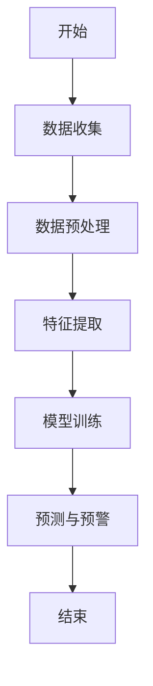

                 

# AIGC在智能交通事故分析与预防中的应用

> 关键词：人工智能，智能交通事故，AIGC，数据分析，预防措施

> 摘要：本文探讨了人工智能生成内容（AIGC）在智能交通事故分析与预防中的应用。首先，我们回顾了交通事故问题的背景及其影响，并提出了传统的解决方法。然后，我们介绍了AIGC的概念、发展历史和应用领域，阐述了其在交通事故分析中的优势。接下来，我们详细分析了AIGC在交通事故数据收集与处理、分析方法、预测与预警中的应用，并提供了实际案例。最后，我们讨论了AIGC在智能交通事故预防中的应用，包括系统设计、技术应用和案例分析。

## 目录大纲

1. **引言**
   1.1 问题背景
   1.2 问题描述
   1.3 问题解决
   1.4 边界与外延
   1.5 概念结构与核心要素组成
   1.6 本章小结

2. **AIGC概述**
   2.1 AIGC的概念
   2.2 AIGC的发展历史
   2.3 AIGC的应用领域
   2.4 AIGC的优势
   2.5 AIGC的挑战与机遇
   2.6 本章小结

3. **AIGC在智能交通事故分析中的应用**
   3.1 交通事故数据收集与处理
   3.2 交通事故分析方法
   3.3 智能交通事故分析流程
   3.4 AIGC在交通事故分析中的应用案例
   3.5 本章小结

4. **AIGC在智能交通事故预防中的应用**
   4.1 智能交通事故预防的概念
   4.2 智能交通事故预防系统设计
   4.3 AIGC在智能交通事故预防中的应用技术
   4.4 智能交通事故预防应用案例
   4.5 本章小结

## 第一部分：引言

### 1.1 问题背景

交通事故是全球范围内普遍存在且严重影响公共安全的问题。据统计，每年因交通事故导致的伤亡人数高达数百万。交通事故不仅给个人和家庭带来巨大的痛苦，还对社会和经济造成了巨大的损失。随着交通网络的不断扩展和车辆数量的增加，交通事故的发生频率和严重程度也在逐步上升。因此，如何有效地分析和预防交通事故，已成为交通运输领域亟待解决的问题。

### 1.1.1 交通事故问题

交通事故通常是由多种因素共同作用导致的，包括驾驶行为、道路条件、车辆状况和外部环境等。其中，驾驶行为是影响交通事故发生的重要因素。例如，超速、酒驾、分心驾驶、疲劳驾驶等不良驾驶行为都是导致交通事故的常见原因。此外，道路条件不佳，如道路损坏、路况复杂等，也会增加交通事故的风险。同时，车辆状况不良，如刹车系统故障、轮胎磨损等，也会增加交通事故的发生概率。

### 1.1.2 交通事故的影响

交通事故对社会的影响是多方面的。首先，交通事故会导致人员伤亡和财产损失。每一次严重的交通事故都可能导致人员伤亡，甚至死亡，给家庭和社会带来无法弥补的损失。其次，交通事故会对交通流畅造成严重影响，导致交通拥堵，影响社会经济的发展。此外，交通事故还会增加医疗费用和保险理赔成本，进一步加重社会负担。

### 1.2 问题描述

交通事故问题的核心在于如何有效地预测和预防交通事故。传统的解决方法主要包括提高驾驶员的素质和安全意识、改善道路条件和车辆状况等。然而，这些方法往往具有一定的局限性。例如，提高驾驶员的素质和安全意识需要长期的教育和培训，而改善道路条件和车辆状况则需要大量的资金投入和长期的维护。因此，如何利用先进的技术手段，尤其是人工智能技术，来解决交通事故问题，已成为当前研究的热点。

### 1.2.1 交通事故的发生原因

交通事故的发生原因复杂多样，主要包括以下几个方面：

1. **驾驶行为问题**：超速、酒驾、分心驾驶、疲劳驾驶等不良驾驶行为是导致交通事故的主要原因。
2. **道路条件问题**：道路损坏、路况复杂、交通标志不清晰等道路问题也会增加交通事故的风险。
3. **车辆状况问题**：车辆刹车系统故障、轮胎磨损、发动机故障等车辆问题也是导致交通事故的常见原因。
4. **外部环境问题**：天气恶劣、路面湿滑、能见度低等外部环境因素也会增加交通事故的风险。

### 1.2.2 交通事故的解决方法

为了解决交通事故问题，传统的方法主要包括以下几个方面：

1. **安全教育**：通过提高驾驶员的安全意识和素质，减少交通事故的发生。
2. **道路改善**：改善道路条件和路况，提高道路的安全性。
3. **车辆检查**：定期检查车辆，确保车辆处于良好状态。
4. **法律法规**：制定和完善相关的交通法律法规，加大对违法行为的处罚力度。

### 1.3 问题解决

尽管传统方法在一定程度上能够缓解交通事故问题，但仍然存在诸多局限性。为了更有效地解决交通事故问题，需要利用先进的技术手段，尤其是人工智能技术。人工智能技术可以通过对海量数据的分析和处理，实现对交通事故的预测和预防。其中，人工智能生成内容（AIGC）作为一种新兴的人工智能技术，在智能交通事故分析与预防中具有广泛的应用前景。

### 1.4 边界与外延

交通事故的定义：交通事故是指在道路上或停车场等特定区域内，由于车辆或行人的行为不当，导致的人员伤亡或财产损失的事件。

智能交通事故的定义：智能交通事故是指在智能交通系统中，由于车辆、行人或其他智能设备的智能行为不当，导致的交通事故。

### 1.5 概念结构与核心要素组成

智能交通事故分析的核心概念包括交通事故数据、数据分析技术、机器学习算法和预测模型等。

智能交通事故预防的核心要素包括数据收集与处理、智能预警系统、智能交通信号控制和智能车载系统等。

### 1.6 本章小结

本部分对交通事故问题及其影响进行了背景介绍，并提出了传统的解决方法。接下来，我们将详细探讨人工智能生成内容（AIGC）的概念、发展历史和应用领域，为后续章节的深入分析奠定基础。

## 第二部分：AIGC概述

### 2.1 AIGC的概念

人工智能生成内容（Artificial Intelligence Generated Content，简称AIGC）是一种利用人工智能技术，特别是自然语言处理（NLP）和机器学习（ML）等技术，自动生成文本、图像、音频等多种类型内容的技术。AIGC的核心思想是通过机器学习模型，如生成对抗网络（GAN）、变分自编码器（VAE）等，从大量训练数据中学习，并生成与人类创造的内容相似或具有创造性的新内容。

### 2.1.1 AIGC的定义

AIGC 是一种利用人工智能技术，特别是自然语言处理（NLP）和机器学习（ML）等技术，自动生成文本、图像、音频等多种类型内容的技术。它涵盖了从文本生成、图像生成到音频生成的多个领域。

### 2.1.2 AIGC的核心特点

AIGC 具有以下核心特点：

1. **自动化生成**：AIGC 技术可以自动生成内容，无需人工干预。
2. **高质量**：通过机器学习模型的学习和优化，AIGC 生成的内容在质量上可以接近或达到人类创作的水平。
3. **多样性**：AIGC 可以生成多种类型的内容，如文本、图像、音频等。
4. **灵活性**：AIGC 技术可以根据不同的需求和场景，灵活地调整和优化生成的内容。

### 2.2 AIGC的发展历史

AIGC 技术的发展历程可以追溯到人工智能和机器学习的早期研究。以下是 AIGC 的发展历史概述：

1. **早期研究（20 世纪 50 年代 - 70 年代）**：人工智能的早期研究主要集中在符号主义方法，如专家系统和逻辑推理等。这一时期，尽管没有明确提出 AIGC 的概念，但许多研究工作都涉及了自动生成内容的想法。
2. **神经网络兴起（20 世纪 80 年代 - 90 年代）**：随着神经网络技术的发展，特别是在深度学习兴起之前，一些研究者开始探索利用神经网络生成图像和文本的方法。这一时期的代表性工作是1993年由Devaney等人提出的生成式对抗网络（GAN）。
3. **深度学习与 AIGC（21 世纪初至今）**：随着深度学习技术的快速发展，特别是生成对抗网络（GAN）、变分自编码器（VAE）等生成模型的出现，AIGC 技术得到了极大的发展。近年来，AIGC 在自然语言处理、计算机视觉和音频处理等领域取得了显著成果。

### 2.2.1 AIGC的起源

AIGC 的起源可以追溯到生成对抗网络（GAN）的提出。GAN 是由 Ian Goodfellow 等人于 2014 年提出的，旨在通过两个神经网络（生成器和判别器）的对抗训练，生成与真实数据相似的新数据。GAN 的提出为 AIGC 技术奠定了基础，并引发了大量相关研究。

### 2.2.2 AIGC的重要里程碑

AIGC 的发展过程中，有许多重要的里程碑事件，以下是其中一些重要的里程碑：

1. **生成对抗网络（GAN）的提出**：GAN 的提出是 AIGC 发展的重要里程碑，它开创了通过对抗训练生成高质量数据的先河。
2. **变分自编码器（VAE）的发展**：VAE 是另一种生成模型，与 GAN 不同，VAE 使用编码器和解码器来生成数据。VAE 在生成图像和文本等方面取得了显著成果。
3. **自然语言处理中的 AIGC**：近年来，AIGC 在自然语言处理领域取得了重要进展，如生成文本摘要、对话系统、翻译等。

### 2.3 AIGC的应用领域

AIGC 技术在多个领域具有广泛的应用，以下是 AIGC 的一些主要应用领域：

1. **自然语言处理（NLP）**：AIGC 在 NLP 领域的应用非常广泛，如文本生成、对话系统、摘要生成、机器翻译等。
2. **计算机视觉**：AIGC 在计算机视觉领域中的应用包括图像生成、图像修复、图像增强等。
3. **音频处理**：AIGC 在音频处理领域中的应用包括音乐生成、语音合成等。
4. **智能交通**：AIGC 在智能交通领域的应用包括交通预测、事故分析、智能驾驶等。
5. **医疗健康**：AIGC 在医疗健康领域中的应用包括疾病诊断、医学影像分析等。

### 2.4 AIGC的优势

AIGC 技术在智能交通事故分析与预防中具有以下优势：

1. **提高数据分析准确性**：AIGC 技术可以处理和分析海量交通数据，从而提高数据分析的准确性。
2. **实现个性化预防措施**：AIGC 技术可以根据具体场景和需求，生成个性化的预防措施，提高预防效果。
3. **降低人工成本**：AIGC 技术可以自动生成报告、分析和预测结果，减少人工工作量，降低成本。

### 2.5 AIGC的挑战与机遇

尽管 AIGC 技术在智能交通事故分析与预防中具有显著的优势，但同时也面临着一些挑战和机遇：

1. **数据隐私与安全**：在智能交通事故分析与预防中，数据的安全和隐私保护是一个重要问题。如何保护用户隐私，同时确保数据的有效利用，是一个亟待解决的挑战。
2. **技术成熟度**：尽管 AIGC 技术在快速发展，但仍存在一些技术瓶颈，如生成模型的可解释性、数据多样性等问题。提高技术成熟度，是一个重要的机遇。
3. **跨领域合作**：智能交通事故分析与预防涉及多个领域，如交通工程、计算机科学、心理学等。加强跨领域合作，是实现 AIGC 技术在智能交通事故分析与预防中广泛应用的关键。

### 2.6 本章小结

本部分对 AIGC 的概念、发展历史、应用领域和优势进行了详细阐述，为后续章节的深入分析奠定了基础。接下来，我们将探讨 AIGC 在智能交通事故分析中的应用。

## 第三部分：AIGC在智能交通事故分析中的应用

### 3.1 交通事故数据收集与处理

在智能交通事故分析中，数据收集与处理是关键的第一步。准确、全面的数据是分析事故原因和预测事故发生的基石。交通事故数据可以来源于多个渠道，如交通监控摄像头、车载传感器、警方报告、社交媒体等。

#### 3.1.1 交通事故数据的来源

1. **交通监控摄像头**：交通监控摄像头是收集交通事故数据的主要来源之一。这些摄像头可以实时记录道路上的车辆和行人的行为，包括速度、位置、动作等。
2. **车载传感器**：现代车辆配备了多种传感器，如GPS、加速度计、摄像头等。这些传感器可以记录车辆的行驶状态，包括速度、刹车、转弯等。
3. **警方报告**：警方会在交通事故发生后进行调查，并生成详细的报告。这些报告包含了事故的时间、地点、原因和损失等详细信息。
4. **社交媒体**：社交媒体平台如微博、微信等，也是交通事故数据的重要来源。用户会在这些平台上分享交通事故的图片、视频和文字描述。

#### 3.1.2 交通事故数据的预处理

收集到的交通事故数据通常是不完整、不精确的，因此需要进行预处理。预处理的主要任务包括数据清洗、数据转换和数据归一化等。

1. **数据清洗**：数据清洗是去除数据中的噪声和错误的过程。例如，删除重复数据、修正错误数据和填补缺失数据等。
2. **数据转换**：数据转换是将不同格式的数据转换为统一的格式，以便后续分析。例如，将文本数据转换为数字序列，将图像数据转换为像素矩阵等。
3. **数据归一化**：数据归一化是将不同数据范围内的数据转换为相同范围的过程，以便于模型训练和评估。例如，将速度、加速度等物理量转换为百分比或标准差等。

### 3.2 交通事故分析方法

交通事故分析方法主要包括数据分析技术和机器学习算法。这些方法可以用于挖掘交通事故数据中的潜在规律，预测交通事故的发生。

#### 3.2.1 数据分析技术

数据分析技术是交通事故分析的基础，包括数据可视化、相关性分析、聚类分析和回归分析等。

1. **数据可视化**：数据可视化是一种通过图形化方式展示数据的技术，可以帮助分析师直观地理解数据。例如，通过散点图和热力图来展示车辆速度和事故发生地点之间的关系。
2. **相关性分析**：相关性分析用于探索不同变量之间的相关性。例如，通过皮尔逊相关系数和斯皮尔曼相关系数来分析驾驶行为和交通事故之间的相关性。
3. **聚类分析**：聚类分析是一种无监督学习方法，用于将数据分为不同的组。例如，通过 K-means 算法将交通事故数据分为不同的类型。
4. **回归分析**：回归分析用于建立变量之间的数学模型。例如，通过线性回归模型来预测交通事故发生的概率。

#### 3.2.2 机器学习算法

机器学习算法是交通事故分析的核心，可以自动发现数据中的规律，并用于预测和决策。常见的机器学习算法包括监督学习算法和无监督学习算法。

1. **监督学习算法**：监督学习算法需要使用标记数据来训练模型。常见的监督学习算法包括线性回归、逻辑回归、决策树、随机森林和支持向量机（SVM）等。例如，可以使用逻辑回归模型来预测交通事故的发生概率。
2. **无监督学习算法**：无监督学习算法不需要使用标记数据来训练模型，可以自动发现数据中的潜在结构和规律。常见的无监督学习算法包括 K-means 聚类、主成分分析（PCA）和自编码器等。

### 3.3 智能交通事故分析流程

智能交通事故分析流程包括数据预处理、特征提取、模型训练与验证和事故预测与预警等步骤。

#### 3.3.1 数据预处理

数据预处理是交通事故分析的基础，包括数据清洗、数据转换和数据归一化等步骤。具体流程如下：

1. **数据清洗**：删除重复数据、修正错误数据和填补缺失数据等。
2. **数据转换**：将不同格式的数据转换为统一的格式，如将文本数据转换为数字序列，将图像数据转换为像素矩阵等。
3. **数据归一化**：将不同数据范围内的数据转换为相同范围，如将速度、加速度等物理量转换为百分比或标准差等。

#### 3.3.2 特征提取

特征提取是从原始数据中提取出对事故分析有用的特征。特征提取的目的是减少数据维度，提高模型性能。常见的特征提取方法包括：

1. **特征选择**：选择对事故分析最有影响力的特征，如速度、加速度、驾驶行为等。
2. **特征工程**：通过变换和组合原始数据中的特征，生成新的特征，如时间窗口特征、频率特征等。
3. **降维**：使用降维技术，如主成分分析（PCA）、线性判别分析（LDA）等，减少数据维度。

#### 3.3.3 模型训练与验证

模型训练与验证是交通事故分析的核心步骤。具体流程如下：

1. **数据划分**：将数据划分为训练集、验证集和测试集，用于模型训练和评估。
2. **模型选择**：选择合适的模型，如线性回归、逻辑回归、决策树、随机森林等。
3. **模型训练**：使用训练集数据对模型进行训练，调整模型的参数。
4. **模型验证**：使用验证集数据对模型进行验证，评估模型的性能。
5. **模型评估**：使用测试集数据对模型进行评估，确定模型的实际性能。

#### 3.3.4 事故预测与预警

事故预测与预警是智能交通事故分析的目标。具体流程如下：

1. **预测模型**：使用训练好的模型对新的数据进行预测，预测交通事故的发生概率。
2. **预警系统**：根据预测结果，启动预警系统，对潜在的交通事故进行预警。
3. **决策支持**：为交通管理部门提供决策支持，如调整交通信号灯、限制车辆速度等。

### 3.4 AIGC在交通事故分析中的应用案例

#### 3.4.1 案例一：基于AIGC的交通事故预测系统

某城市交通管理部门与一家科技公司合作，开发了一套基于AIGC的交通事故预测系统。该系统通过收集交通监控摄像头和车载传感器的数据，对交通事故进行预测和预警。

具体实现过程如下：

1. **数据收集与预处理**：从交通监控摄像头和车载传感器中收集交通事故数据，包括车辆速度、位置、驾驶行为等。对数据进行清洗、转换和归一化处理。

2. **特征提取**：从预处理后的数据中提取对交通事故预测有用的特征，如速度、加速度、驾驶行为等。

3. **模型训练**：使用监督学习算法，如线性回归和决策树，对特征进行训练，建立交通事故预测模型。

4. **模型验证与评估**：使用验证集数据对模型进行验证，评估模型的性能。根据评估结果调整模型参数。

5. **事故预测与预警**：使用训练好的模型对新的数据进行预测，预测交通事故的发生概率。根据预测结果，启动预警系统，对潜在的交通事故进行预警。

6. **决策支持**：为交通管理部门提供决策支持，如调整交通信号灯、限制车辆速度等。

#### 3.4.2 案例二：基于AIGC的交通事故原因分析系统

某保险公司开发了一套基于AIGC的交通事故原因分析系统，用于分析交通事故的原因，并为保险理赔提供依据。

具体实现过程如下：

1. **数据收集与预处理**：从警方报告、交通监控摄像头和车载传感器中收集交通事故数据，包括事故时间、地点、原因、损失等。对数据进行清洗、转换和归一化处理。

2. **特征提取**：从预处理后的数据中提取对事故原因分析有用的特征，如时间、地点、天气、车辆状况、驾驶行为等。

3. **模型训练**：使用无监督学习算法，如 K-means 聚类，对特征进行训练，将交通事故分为不同的类型。

4. **模型验证与评估**：使用验证集数据对模型进行验证，评估模型的性能。根据评估结果调整模型参数。

5. **事故原因分析**：使用训练好的模型对新的数据进行分类，分析交通事故的原因。

6. **保险理赔支持**：根据事故原因分析结果，为保险理赔提供依据，如调整保险赔付金额、延长赔付期限等。

### 3.5 本章小结

本部分详细介绍了 AIGC 在智能交通事故分析中的应用，包括数据收集与处理、分析方法、预测与预警和实际案例。AIGC 技术在交通事故分析中具有显著的优势，可以提高数据分析的准确性，实现个性化的事故预测和预警，为交通事故的预防提供有力支持。

## 第四部分：AIGC在智能交通事故预防中的应用

### 4.1 智能交通事故预防的概念

智能交通事故预防是指通过应用先进的人工智能技术，对交通事故进行预测、预警和干预，从而降低交通事故的发生概率和严重程度。智能交通事故预防系统通常包括数据收集与处理、智能预警、智能交通信号控制和智能车载系统等组成部分。

#### 4.1.1 智能交通事故预防的定义

智能交通事故预防是一种利用人工智能技术，通过收集、分析和处理交通数据，实现对交通事故的实时监测、预警和干预，以降低交通事故发生概率和减少事故损失的系统。

#### 4.1.2 智能交通事故预防的原理

智能交通事故预防的原理基于以下几点：

1. **数据收集与处理**：通过传感器、摄像头等设备收集交通数据，包括车辆速度、行驶轨迹、驾驶行为等，对数据进行清洗和预处理。
2. **数据分析与挖掘**：利用机器学习、数据挖掘等技术，分析交通数据中的潜在规律，预测交通事故的可能性。
3. **智能预警**：根据分析结果，实时监测交通状况，对潜在的交通事故进行预警，提醒驾驶员和交通管理部门。
4. **干预与控制**：通过智能交通信号控制、智能车载系统等手段，对交通进行干预，如调整交通信号灯、限制车辆速度等，以降低交通事故的发生概率。

### 4.2 智能交通事故预防系统设计

智能交通事故预防系统的设计包括系统需求分析、系统功能设计、系统架构设计和系统接口设计等步骤。

#### 4.2.1 系统需求分析

智能交通事故预防系统的需求分析主要包括以下几个方面：

1. **功能需求**：包括数据收集与处理、数据分析与挖掘、智能预警、干预与控制等功能。
2. **性能需求**：系统需要具备高并发处理能力、低延迟和高准确性等性能需求。
3. **安全需求**：系统需要具备数据安全、系统安全和用户隐私保护等安全需求。

#### 4.2.2 系统功能设计

智能交通事故预防系统的功能设计主要包括以下几个方面：

1. **数据收集与处理**：通过传感器、摄像头等设备收集交通数据，对数据进行清洗和预处理，确保数据的质量和一致性。
2. **数据分析与挖掘**：利用机器学习、数据挖掘等技术，分析交通数据中的潜在规律，预测交通事故的可能性。
3. **智能预警**：根据分析结果，实时监测交通状况，对潜在的交通事故进行预警，提醒驾驶员和交通管理部门。
4. **干预与控制**：通过智能交通信号控制、智能车载系统等手段，对交通进行干预，如调整交通信号灯、限制车辆速度等，以降低交通事故的发生概率。
5. **用户界面**：提供用户界面，展示交通状况、预警信息和干预措施等。

#### 4.2.3 系统架构设计

智能交通事故预防系统的架构设计主要包括以下几个方面：

1. **数据层**：包括传感器数据、摄像头数据、交通监控数据等，是系统的数据来源。
2. **处理层**：包括数据预处理、特征提取、数据挖掘和机器学习等模块，对数据进行处理和分析。
3. **控制层**：包括预警系统、干预系统和交通信号控制等模块，根据分析结果进行预警和干预。
4. **展示层**：包括用户界面、Web 应用和移动应用等，展示交通状况、预警信息和干预措施。

#### 4.2.4 系统接口设计

智能交通事故预防系统的接口设计主要包括以下几个方面：

1. **数据接口**：包括传感器数据接口、摄像头数据接口和交通监控数据接口等，用于数据的收集和传输。
2. **功能接口**：包括预警接口、干预接口和交通信号控制接口等，用于系统的功能调用和协调。
3. **用户接口**：包括Web 用户界面和移动应用界面等，用于用户与系统的交互。

### 4.3 AIGC在智能交通事故预防中的应用技术

AIGC 技术在智能交通事故预防中具有广泛的应用，包括数据分析技术、机器学习算法和深度学习技术等。

#### 4.3.1 数据分析技术

数据分析技术在智能交通事故预防中用于收集、处理和分析交通数据。具体包括：

1. **数据收集**：通过传感器、摄像头等设备收集交通数据，如车辆速度、行驶轨迹、驾驶行为等。
2. **数据处理**：对收集到的交通数据进行分析、清洗和预处理，确保数据的质量和一致性。
3. **数据可视化**：通过数据可视化技术，将交通数据以图形化的方式展示，帮助分析师直观地理解数据。

#### 4.3.2 机器学习算法

机器学习算法在智能交通事故预防中用于建立交通事故预测模型和预警系统。具体包括：

1. **特征选择**：从交通数据中提取对交通事故预测有用的特征，如速度、加速度、驾驶行为等。
2. **模型训练**：使用监督学习算法，如线性回归、逻辑回归、决策树等，对特征进行训练，建立交通事故预测模型。
3. **模型评估**：使用验证集数据对模型进行评估，选择性能最优的模型。

#### 4.3.3 深度学习技术

深度学习技术在智能交通事故预防中用于构建复杂的预测模型和智能预警系统。具体包括：

1. **卷积神经网络（CNN）**：用于图像处理，可以提取图像中的交通特征。
2. **循环神经网络（RNN）**：用于处理序列数据，可以分析车辆的行驶轨迹。
3. **生成对抗网络（GAN）**：用于生成新的交通数据，增强模型的泛化能力。

### 4.4 智能交通事故预防应用案例

#### 4.4.1 案例一：基于AIGC的智能交通信号控制系统

某城市交通管理部门采用AIGC技术，开发了一套智能交通信号控制系统。该系统通过收集交通数据，分析交通流量，动态调整交通信号灯的时长和相位，以优化交通流畅性，降低交通事故的发生概率。

具体实现过程如下：

1. **数据收集**：通过交通监控摄像头和车载传感器收集交通数据，包括车辆速度、行驶轨迹、交通流量等。
2. **数据处理**：对收集到的交通数据进行分析、清洗和预处理，提取对交通信号灯控制有用的特征。
3. **模型训练**：使用机器学习算法，如循环神经网络（RNN），建立交通信号灯控制模型。
4. **动态调整**：根据模型预测结果，动态调整交通信号灯的时长和相位，以优化交通流畅性。
5. **实时监控**：系统实时监控交通状况，根据实时数据调整交通信号灯，以应对突发情况。

#### 4.4.2 案例二：基于AIGC的智能车载系统

某汽车制造商采用AIGC技术，开发了一套智能车载系统。该系统通过分析车辆传感器数据，实时监测车辆的行驶状况，预测潜在的交通事故，并发出预警，提醒驾驶员采取相应的措施。

具体实现过程如下：

1. **数据收集**：通过车辆传感器收集车辆行驶数据，包括速度、加速度、刹车情况等。
2. **数据处理**：对收集到的车辆行驶数据进行分析、清洗和预处理，提取对交通事故预测有用的特征。
3. **模型训练**：使用机器学习算法，如决策树、随机森林等，建立交通事故预测模型。
4. **实时预警**：系统实时监测车辆行驶状况，根据模型预测结果，对潜在的交通事故发出预警。
5. **驾驶员提醒**：系统通过车载显示屏或语音提示，提醒驾驶员采取相应的措施，如减速、保持安全距离等。

### 4.5 本章小结

本部分详细介绍了 AIGC 在智能交通事故预防中的应用，包括系统设计、技术应用和实际案例。AIGC 技术在智能交通事故预防中具有显著的优势，可以通过数据分析、机器学习和深度学习等技术，实现交通事故的预测、预警和干预，为交通安全提供有力保障。

## 总结与展望

本文系统地探讨了人工智能生成内容（AIGC）在智能交通事故分析与预防中的应用。首先，我们介绍了交通事故问题的背景、影响和传统解决方法，提出了利用AIGC技术解决交通事故问题的必要性。接着，我们详细阐述了AIGC的概念、发展历史和应用领域，分析了其在智能交通事故分析中的优势。随后，我们深入讨论了AIGC在交通事故数据收集与处理、分析方法、预测与预警以及预防系统设计中的应用，并提供了实际案例。通过这些探讨，我们得出了以下结论：

1. **AIGC技术显著提升了交通事故数据分析的准确性和效率**：通过处理和分析海量交通数据，AIGC技术能够发现潜在的交通事故规律，为预防和应对交通事故提供有力支持。
2. **AIGC技术实现了个性化的事故预测和预警**：AIGC可以根据实时交通数据和历史事故数据，生成个性化的预警信息，提醒驾驶员和交通管理部门采取相应的预防措施。
3. **AIGC技术在智能交通事故预防中具有广泛应用前景**：从智能交通信号控制系统到智能车载系统，AIGC技术能够为交通事故预防提供全方位的技术支持，有望降低交通事故的发生概率和严重程度。

展望未来，AIGC在智能交通事故分析与预防中的应用前景广阔。随着技术的不断进步，AIGC将能够处理更复杂的数据，提高预测的准确性和实时性。此外，随着数据隐私和安全问题的解决，AIGC将在更大范围内得到应用。未来的研究可以集中在以下几个方面：

1. **提高AIGC技术的解释性和可解释性**：当前AIGC技术生成的内容往往缺乏可解释性，这使得其在一些关键领域（如医疗和交通）的应用受到限制。提高AIGC技术的解释性，使其生成的结果能够被人类理解和接受，是一个重要的研究方向。
2. **加强跨领域合作**：智能交通事故分析与预防涉及多个领域，如交通工程、计算机科学、心理学等。加强跨领域合作，将有助于推动AIGC技术在智能交通事故分析与预防中的全面应用。
3. **探索新的应用场景**：除了交通事故预防，AIGC技术在智能交通的其他领域（如智能驾驶、智能导航等）也具有广阔的应用前景。未来的研究可以探索AIGC技术在智能交通其他领域的应用。

总之，AIGC技术在智能交通事故分析与预防中具有重要的应用价值。通过不断的研究和实践，AIGC技术将为我们提供更安全、更智能的交通环境，为人类社会的发展贡献力量。

### 作者信息

作者：AI天才研究院/AI Genius Institute & 禅与计算机程序设计艺术 /Zen And The Art of Computer Programming

### 最佳实践 tips

1. **数据隐私保护**：在应用AIGC技术进行交通事故分析时，需严格保护用户隐私，确保数据的安全和保密。
2. **持续更新模型**：交通事故数据不断变化，需要定期更新AIGC模型，以保持预测的准确性和实时性。
3. **多源数据整合**：结合多种数据源（如交通监控、车载传感器、社交媒体等），可以提高AIGC模型的预测能力。
4. **用户参与**：鼓励驾驶员和交通参与者反馈数据，以优化AIGC模型，提高预警和干预的准确性。

### 小结

本文通过详细探讨AIGC在智能交通事故分析与预防中的应用，展示了其在交通事故预测、预警和预防方面的巨大潜力。AIGC技术的应用不仅提高了交通事故数据分析的准确性，还为个性化预防措施提供了有力支持。未来，随着技术的不断进步，AIGC将在智能交通事故预防中发挥更加重要的作用。

### 注意事项

1. **技术成熟度**：尽管AIGC技术具有显著的优势，但在实际应用中，仍需要考虑技术成熟度和稳定性。
2. **数据质量**：AIGC模型的性能高度依赖数据质量，因此需确保数据的准确性和完整性。
3. **法律法规**：在应用AIGC技术进行交通事故分析和预防时，需遵守相关法律法规，确保技术的合法性和合规性。

### 拓展阅读

1. **《人工智能交通：从数据到行动》**：详细介绍了人工智能在交通领域中的应用，包括交通事故预测和预防。
2. **《智能交通系统：原理、应用与实现》**：系统阐述了智能交通系统的设计、实现和应用，包括AIGC技术的应用。
3. **《人工智能与自动驾驶：技术、挑战与未来》**：探讨了人工智能在自动驾驶领域的应用，包括智能交通事故预防。

### 数学公式和Mermaid流程图的Markdown格式示例

#### 数学公式

$$
E(X) = \int_{-\infty}^{+\infty} x f(x) dx
$$

#### Mermaid流程图

通过上述示例，我们可以看到如何使用Markdown格式嵌入数学公式和Mermaid流程图，以便在技术博客文章中清晰地展示相关概念和算法流程。这些格式不仅提高了文章的可读性，还帮助读者更好地理解和掌握技术细节。

