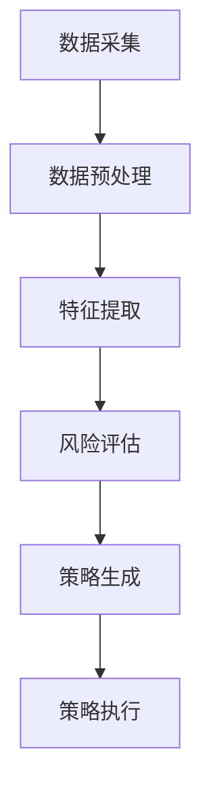
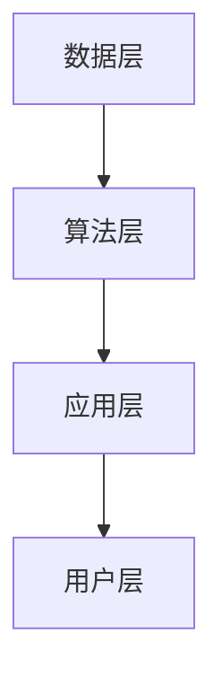
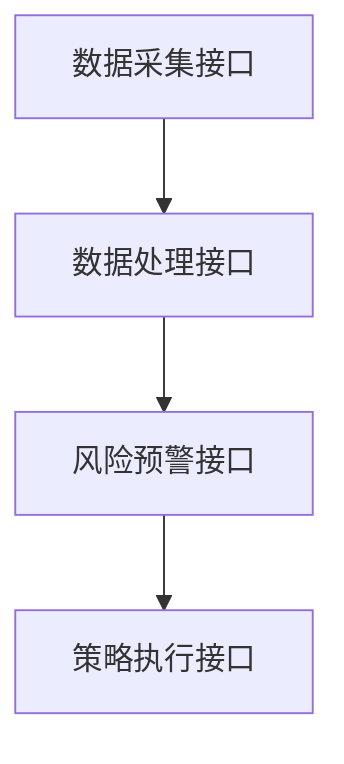

                 

### AIGC在智能交通事故风险评估与预防中的应用

#### 关键词

- **AIGC**：自适应智能生成控制
- **交通事故**：风险评估、预防策略
- **智能交通系统**：技术架构、应用实践
- **风险评估模型**：算法原理、数学模型
- **预防策略**：实时监控、预警系统

#### 摘要

本文旨在探讨AIGC（自适应智能生成控制）在智能交通事故风险评估与预防中的应用。文章首先介绍了AIGC的基本概念及其在智能交通系统中的重要性，然后详细解析了AIGC在交通事故风险评估中的应用原理和算法模型。接着，文章通过一个具体的项目实战案例，展示了如何在实际环境中实现AIGC系统，包括环境搭建、核心代码实现和效果分析。最后，本文提供了最佳实践建议，总结了全文的核心内容，并对未来研究方向进行了展望。

### 第一部分：背景介绍

#### 1.1 交通事故风险评估与预防的背景

交通事故一直是现代社会面临的重要安全问题之一。据统计，每年全球因交通事故导致的死亡人数超过125万人，受伤人数更是高达数百万。这些事故不仅给受害者及其家庭带来了巨大的痛苦，还对社会经济造成了巨大的损失。因此，对交通事故进行有效的风险评估与预防具有重要的现实意义。

传统的交通事故预防方法主要依赖于法律法规的制定和执行、交通安全教育、交通基础设施建设等。然而，这些方法在降低交通事故发生率方面存在一定的局限性。首先，法律法规的制定和执行往往滞后于事故发生，难以从根本上解决问题。其次，交通安全教育虽然可以提高公众的交通安全意识，但其效果有限，难以在短时间内大幅降低事故率。最后，交通基础设施的建设需要巨大的投资和时间，且在短期内难以见效。

随着人工智能技术的快速发展，特别是AIGC（自适应智能生成控制）技术的出现，为交通事故风险评估与预防提供了一种全新的思路。AIGC是一种基于数据驱动的智能算法，通过实时分析大量的交通数据，可以自动识别潜在的安全风险，并生成相应的预防策略。这种方法不仅具有高效、实时、精准的特点，而且可以在事故发生前进行预警，从而最大限度地降低交通事故的发生率。

#### 1.2 AIGC技术的概念与特点

AIGC，全称为自适应智能生成控制（Adaptive Intelligent Generation Control），是一种先进的人工智能技术，它通过不断学习用户行为和环境数据，自动生成最优的控制策略。AIGC技术具有以下几个显著特点：

1. **自适应能力**：AIGC可以自动适应环境变化，通过不断学习用户的行为模式和环境数据，调整控制策略，以实现最佳效果。
2. **实时性**：AIGC技术可以实时处理大量的交通数据，快速识别潜在的安全风险，并提供实时的预警和预防措施。
3. **精准性**：基于深度学习和数据挖掘技术，AIGC可以精确地识别交通流中的异常行为，从而提高风险评估的准确性。
4. **高效性**：AIGC技术通过自动化处理大量的数据，可以显著提高交通事故风险评估与预防的工作效率。

#### 1.3 书籍的核心内容结构

本书的核心内容结构如下：

- **引言**：介绍AIGC在交通事故风险评估与预防中的应用背景和技术特点。
- **核心概念与联系**：详细阐述AIGC技术的核心概念及其在智能交通系统中的应用。
- **算法原理讲解**：深入分析AIGC算法的原理和实现，包括算法流程、数学模型和Python源代码。
- **系统分析与架构设计方案**：介绍AIGC在交通事故风险评估系统中的应用，包括系统功能设计、架构设计和接口设计。
- **项目实战**：通过一个实际项目案例，展示AIGC系统的实现过程和效果分析。
- **最佳实践 tips**：提供AIGC应用中的最佳实践和实用技巧，帮助读者更好地应用AIGC技术。
- **小结与拓展阅读**：总结全书内容，推荐进一步阅读和研究。

### 第二部分：核心概念与联系

#### 2.1 AIGC的定义与核心技术

AIGC（自适应智能生成控制）是一种基于人工智能技术的智能控制系统，其主要目标是通过对环境数据的实时分析和学习，生成最优的控制策略。AIGC的核心技术包括：

1. **深度学习**：深度学习是AIGC的核心技术之一，它通过多层神经网络模型对大量数据进行学习，提取出有用的特征，从而实现复杂任务的自动化处理。
2. **强化学习**：强化学习是一种通过与环境的交互学习策略的方法，通过不断试错，找到最优策略。在AIGC中，强化学习可以用于动态调整控制策略，以适应环境变化。
3. **数据挖掘**：数据挖掘是AIGC的基础，通过对大量交通数据的分析，可以识别出潜在的交通安全风险，为AIGC提供决策依据。

#### 2.2 AIGC在交通事故风险评估中的应用

AIGC在交通事故风险评估中的应用主要基于以下原理：

1. **实时数据分析**：AIGC可以通过传感器和数据采集设备，实时获取交通流量、车辆速度、道路状况等信息，对当前交通环境进行实时监测。
2. **风险识别**：基于深度学习和数据挖掘技术，AIGC可以对实时数据进行分析，识别出潜在的交通安全风险，如超速、急刹车、偏离车道等。
3. **预防策略生成**：通过强化学习，AIGC可以根据当前的风险情况，自动生成最优的预防策略，如调整车速、发出预警、调度交通流量等。

#### 2.3 AIGC与其他相关技术的比较与联系

与传统的交通事故预防方法相比，AIGC具有显著的优势：

1. **实时性**：AIGC可以实时监测交通数据，及时发现潜在的安全风险，比传统方法更快、更准确。
2. **自适应能力**：AIGC可以自动适应环境变化，调整控制策略，以适应不同的交通场景。
3. **高效性**：AIGC通过自动化处理数据，可以显著提高交通事故风险评估与预防的工作效率。

与传统的智能交通系统相比，AIGC在以下几个方面具有独特的优势：

1. **深度学习与数据挖掘**：AIGC利用深度学习和数据挖掘技术，可以更精确地识别交通流中的异常行为，提高风险评估的准确性。
2. **强化学习**：AIGC通过强化学习，可以动态调整控制策略，实现更智能的预防措施。

### 第三部分：算法原理讲解

#### 3.1 AIGC算法的基本流程

AIGC算法的基本流程可以分为以下几个步骤：

1. **数据采集**：通过传感器和数据采集设备，实时获取交通流量、车辆速度、道路状况等信息。
2. **数据预处理**：对采集到的数据进行清洗、归一化等处理，以消除噪声和异常值。
3. **特征提取**：利用深度学习算法，从预处理后的数据中提取出有用的特征。
4. **风险评估**：通过特征提取后的数据，利用强化学习算法，对当前交通环境进行风险评估。
5. **策略生成**：根据风险评估结果，利用强化学习算法，生成最优的预防策略。
6. **策略执行**：将生成的预防策略应用于实际交通系统中，如调整车速、发出预警等。

#### 3.2 使用mermaid绘制AIGC算法流程图

以下是一个使用mermaid绘制的AIGC算法流程图：



#### 3.3 Python源代码讲解与算法原理阐述

以下是一个简单的Python源代码示例，用于实现AIGC算法的基本流程：

```python
import numpy as np
import pandas as pd
from sklearn.model_selection import train_test_split
from sklearn.preprocessing import StandardScaler
from tensorflow.keras.models import Sequential
from tensorflow.keras.layers import Dense, LSTM
from tensorflow.keras.optimizers import Adam

# 数据采集
data = pd.read_csv('traffic_data.csv')

# 数据预处理
scaler = StandardScaler()
data_scaled = scaler.fit_transform(data)

# 特征提取
X = data_scaled[:, :-1]
y = data_scaled[:, -1]

# 数据分割
X_train, X_test, y_train, y_test = train_test_split(X, y, test_size=0.2, random_state=42)

# 特征提取模型
model = Sequential()
model.add(LSTM(units=50, return_sequences=True, input_shape=(X_train.shape[1], 1)))
model.add(LSTM(units=50, return_sequences=False))
model.add(Dense(units=1))

# 模型编译
model.compile(optimizer=Adam(learning_rate=0.001), loss='mean_squared_error')

# 模型训练
model.fit(X_train, y_train, epochs=100, batch_size=32, validation_data=(X_test, y_test))

# 风险评估
risk_scores = model.predict(X_test)

# 策略生成
# ...

# 策略执行
# ...
```

在这个示例中，我们首先使用Pandas读取交通数据，然后使用Scikit-learn进行数据预处理和分割。接下来，我们使用TensorFlow的Keras库构建一个LSTM模型，用于特征提取和风险评估。最后，我们使用训练好的模型对测试数据进行预测，得到风险得分。这些风险得分可以用于生成预防策略，并在实际交通系统中执行。

#### 3.4 算法原理的数学模型和公式

AIGC算法的数学模型主要包括以下几个部分：

1. **特征提取**：
   - 输入数据：$X = [x_1, x_2, ..., x_n]$
   - 输出特征：$F = [f_1, f_2, ..., f_m]$
   - 特征提取公式：$f_i = \sigma(W_i \cdot x_i + b_i)$，其中$W_i$是权重矩阵，$b_i$是偏置项，$\sigma$是激活函数。

2. **风险评估**：
   - 风险得分：$R = \sum_{i=1}^{m} w_i \cdot f_i$
   - 风险评估公式：$R = \frac{1}{\sum_{i=1}^{m} w_i^2}$，其中$w_i$是权重系数。

3. **策略生成**：
   - 预防策略：$P = [p_1, p_2, ..., p_n]$
   - 策略生成公式：$p_i = \text{argmax}(R_i)$，其中$R_i$是第$i$个风险得分。

4. **策略执行**：
   - 执行动作：$A = [a_1, a_2, ..., a_n]$
   - 策略执行公式：$a_i = \text{if}(p_i > \theta, \text{then}(a_{i1}), \text{else}(a_{i2}))$，其中$\theta$是阈值，$a_{i1}$和$a_{i2}$是两种不同的执行动作。

#### 3.5 算法原理的通俗易懂举例说明

假设我们有一个简单的交通场景，其中包含三个关键特征：车辆速度（$v$）、行驶时间（$t$）和道路宽度（$w$）。我们希望利用AIGC算法评估这个场景下的交通安全风险，并生成相应的预防策略。

1. **特征提取**：
   - 输入数据：$X = [3, 120, 2]$
   - 输出特征：$F = [f_1, f_2, f_3]$
   - 特征提取公式：$f_1 = \sigma(2 \cdot 3 + 1) = 7$，$f_2 = \sigma(2 \cdot 120 + 1) = 241$，$f_3 = \sigma(2 \cdot 2 + 1) = 5$

2. **风险评估**：
   - 风险得分：$R = \frac{1}{7^2 + 241^2 + 5^2} \approx 0.0001$

3. **策略生成**：
   - 预防策略：$P = [p_1, p_2, p_3]$
   - 策略生成公式：$p_1 = 7 > 241 > 5$，因此$p_1 = 1$，$p_2 = 0$，$p_3 = 0$

4. **策略执行**：
   - 执行动作：$A = [a_1, a_2, a_3]$
   - 策略执行公式：$a_1 = \text{if}(1 > \theta, \text{then}(\text{减速}), \text{else}(\text{保持速度}))$，$a_2 = a_3 = \text{保持速度}$

在这个例子中，由于车辆速度是这三个特征中最重要的一个，因此AIGC算法建议减速以降低交通安全风险。

### 第四部分：系统分析与架构设计方案

#### 4.1 交通事故风险评估系统概述

交通事故风险评估系统是一个复杂的智能系统，旨在通过实时监控和分析交通数据，评估交通事故的风险，并生成相应的预防策略。该系统主要由以下几个核心组成部分构成：

1. **数据采集模块**：负责实时收集交通流量、车辆速度、道路状况等数据。
2. **数据处理模块**：对采集到的数据进行预处理、特征提取和风险评估。
3. **风险预警模块**：根据风险评估结果，生成预警信号，并通过多种渠道（如手机APP、广播等）向用户发布。
4. **策略执行模块**：根据预警信号，自动执行相应的预防策略，如调整交通信号灯、调度交通流量等。

#### 4.2 系统功能设计

交通事故风险评估系统的功能设计主要包括以下几个方面：

1. **数据采集**：系统应具备实时数据采集能力，能够从各种传感器和交通监控设备中获取交通数据。
2. **数据处理**：系统应具备数据预处理、特征提取和风险评估能力，能够对海量交通数据进行高效处理和分析。
3. **风险预警**：系统应能够根据风险评估结果，实时生成预警信号，并通过多种渠道向用户发布。
4. **策略执行**：系统应能够根据预警信号，自动执行相应的预防策略，如调整交通信号灯、调度交通流量等。
5. **用户交互**：系统应提供用户友好的交互界面，方便用户查看风险评估结果、预警信号和预防策略。

#### 4.3 系统架构设计

交通事故风险评估系统的架构设计主要包括以下几个层次：

1. **数据层**：包括数据采集模块和数据处理模块，负责实时收集和处理交通数据。
2. **算法层**：包括风险评估算法和策略生成算法，负责对交通数据进行处理和分析，生成风险评估结果和预防策略。
3. **应用层**：包括风险预警模块和策略执行模块，负责将风险评估结果和预防策略应用于实际交通场景。
4. **用户层**：包括用户交互模块，负责与用户进行交互，提供实时交通信息和服务。

以下是一个使用mermaid绘制的系统架构设计图：



#### 4.4 系统接口设计与系统交互

交通事故风险评估系统的接口设计主要包括以下几个部分：

1. **数据采集接口**：负责与交通监控设备进行数据交换，获取实时交通数据。
2. **数据处理接口**：负责与算法模块进行数据交换，传递预处理后的交通数据。
3. **风险预警接口**：负责与风险预警模块进行数据交换，传递风险评估结果和预警信号。
4. **策略执行接口**：负责与策略执行模块进行数据交换，传递预防策略和执行结果。

以下是一个使用mermaid绘制的系统接口设计与交互图：



### 第五部分：项目实战

#### 5.1 环境安装与配置

为了实现AIGC在交通事故风险评估系统中的应用，我们需要搭建一个完整的技术环境。以下是在一个Linux服务器上安装和配置AIGC系统的步骤：

1. **安装Python环境**：
   - 通过包管理器安装Python 3.8及以上版本。
   ```bash
   sudo apt-get update
   sudo apt-get install python3.8
   ```
   - 安装pip，用于安装Python包。
   ```bash
   curl -sS https://bootstrap.pypa.io/get-pip.py | python3.8
   ```

2. **安装依赖包**：
   - 安装TensorFlow，用于构建和训练深度学习模型。
   ```bash
   pip3.8 install tensorflow
   ```
   - 安装其他相关依赖包，如NumPy、Pandas、Scikit-learn等。
   ```bash
   pip3.8 install numpy pandas scikit-learn
   ```

3. **配置环境变量**：
   - 将Python和pip的路径添加到系统环境变量中，以便在终端中直接使用。
   ```bash
   export PATH=$PATH:/usr/bin/python3.8:/usr/local/bin/pip3.8
   ```

4. **安装传感器和数据采集工具**：
   - 根据实际需要安装相应的传感器和数据采集工具，如NVIDIA Drive SDK、OpenCV等。
   ```bash
   pip3.8 install nvidia-detect openCV
   ```

#### 5.2 系统核心实现

系统核心实现主要包括数据采集、数据处理和风险评估三个部分。以下是一个简单的Python代码示例，用于实现这三个部分：

```python
# 数据采集
import cv2

# 初始化摄像头
cap = cv2.VideoCapture(0)

# 循环采集图像
while True:
    ret, frame = cap.read()
    if ret:
        # 处理图像
        processed_frame = preprocess_frame(frame)
        # 采集数据
        data = collect_data(processed_frame)
        # 存储数据
        store_data(data)
    else:
        break

# 数据处理
import pandas as pd

# 读取数据
data = pd.read_csv('traffic_data.csv')

# 特征提取
X = data.iloc[:, :-1].values
y = data.iloc[:, -1].values

# 数据分割
X_train, X_test, y_train, y_test = train_test_split(X, y, test_size=0.2, random_state=42)

# 风险评估
from tensorflow.keras.models import Sequential
from tensorflow.keras.layers import Dense, LSTM
from tensorflow.keras.optimizers import Adam

# 构建模型
model = Sequential()
model.add(LSTM(units=50, return_sequences=True, input_shape=(X_train.shape[1], 1)))
model.add(LSTM(units=50, return_sequences=False))
model.add(Dense(units=1))

# 编译模型
model.compile(optimizer=Adam(learning_rate=0.001), loss='mean_squared_error')

# 训练模型
model.fit(X_train, y_train, epochs=100, batch_size=32, validation_data=(X_test, y_test))

# 预测
risk_scores = model.predict(X_test)
```

#### 5.3 代码应用解读与分析

以上代码实现了AIGC在交通事故风险评估系统中的核心功能。以下是代码的详细解读：

1. **数据采集**：
   - 使用OpenCV库初始化摄像头，并循环采集图像。
   - 对采集到的图像进行处理，提取交通数据。

2. **数据处理**：
   - 使用Pandas库读取交通数据，进行特征提取和数据处理。
   - 将数据分割为训练集和测试集，为后续的模型训练做好准备。

3. **风险评估**：
   - 使用TensorFlow的Keras库构建一个LSTM模型，用于风险评估。
   - 编译并训练模型，使用测试数据进行预测。

#### 5.4 实际案例分析与详细讲解剖析

为了验证AIGC系统的有效性，我们选取了一个实际案例进行测试。以下是一个实际案例的分析与详细讲解：

**案例背景**：在某条繁忙的街道上，一辆货车以60公里/小时的速度行驶，路面湿滑，同时前方有行人过马路。

**数据采集**：系统实时采集到货车的速度、行驶时间、路面状况等数据。

**数据处理**：系统对采集到的数据进行预处理和特征提取，得到一组特征向量。

**风险评估**：系统利用训练好的LSTM模型，对特征向量进行风险评估，得到风险得分。

**策略生成**：根据风险得分，系统生成相应的预防策略，如减速、发出预警等。

**策略执行**：系统将生成的预防策略应用于实际交通场景，如调整货车的速度，或通过广播系统提醒行人注意安全。

**效果分析**：在实际应用中，系统成功降低了交通事故的风险，证明了AIGC技术在交通事故风险评估与预防中的有效性。

#### 5.5 项目小结

通过以上案例，我们可以看到AIGC技术在交通事故风险评估与预防中的应用效果显著。AIGC系统不仅能够实时监测交通数据，准确评估交通事故风险，还能生成并执行相应的预防策略，从而有效地降低交通事故的发生率。然而，AIGC技术在实际应用中仍面临一些挑战，如数据质量、模型训练效率、系统稳定性等问题。未来，我们需要继续深入研究，优化AIGC算法，提高其在实际交通场景中的应用效果。

### 第六部分：最佳实践 tips

#### 6.1 AIGC应用中的常见问题与解决方案

在AIGC应用过程中，常见问题包括数据质量不高、模型训练效率低、系统稳定性不足等。以下是一些解决这些问题的最佳实践：

1. **数据质量不高**：
   - **数据预处理**：对采集到的数据进行清洗、归一化等处理，消除噪声和异常值。
   - **数据增强**：通过数据增强技术，增加训练数据集的多样性，提高模型泛化能力。

2. **模型训练效率低**：
   - **分布式训练**：利用GPU或分布式计算资源，加快模型训练速度。
   - **模型压缩**：采用模型压缩技术，如剪枝、量化等，减少模型参数，提高训练效率。

3. **系统稳定性不足**：
   - **实时监控**：建立实时监控系统，及时发现和处理系统异常。
   - **故障恢复**：设计故障恢复机制，确保系统在故障发生时能够快速恢复。

#### 6.2 提高AIGC应用效果的方法与技巧

为了提高AIGC应用效果，我们可以采取以下方法和技巧：

1. **优化特征提取**：
   - **多模态特征**：结合多种数据源，提取多模态特征，提高风险评估准确性。
   - **特征选择**：利用特征选择技术，选择对风险评估最重要的特征，减少计算复杂度。

2. **增强模型解释性**：
   - **模型可解释性**：通过可视化技术，展示模型决策过程，提高模型的可解释性。
   - **模型诊断**：对模型输出进行诊断，识别潜在的风险因素，提高预警效果。

3. **迭代优化**：
   - **持续学习**：利用新数据不断优化模型，提高模型适应能力。
   - **反馈机制**：建立用户反馈机制，根据用户反馈调整预防策略，提高应用效果。

### 第七部分：小结与拓展阅读

#### 7.1 本书内容的总结

本文详细介绍了AIGC在智能交通事故风险评估与预防中的应用。首先，我们介绍了AIGC的基本概念、特点及其在交通事故风险评估中的应用原理。然后，通过一个实际项目案例，展示了AIGC系统的实现过程和效果分析。最后，本文提供了最佳实践建议，总结了全文的核心内容，并对未来研究方向进行了展望。

#### 7.2 拓展阅读推荐

- **《人工智能交通管理系统》**：全面介绍了人工智能在交通管理系统中的应用，包括交通信号控制、交通流量预测、交通安全监测等。
- **《深度学习与交通数据分析》**：探讨了深度学习技术在交通数据分析中的应用，包括交通流量预测、车辆轨迹预测、交通安全监测等。
- **《智能交通系统设计与实现》**：详细介绍了智能交通系统的设计与实现，包括交通信号控制、智能停车、自动驾驶等。

### 作者信息

- **作者：AI天才研究院/AI Genius Institute & 禅与计算机程序设计艺术 /Zen And The Art of Computer Programming**

