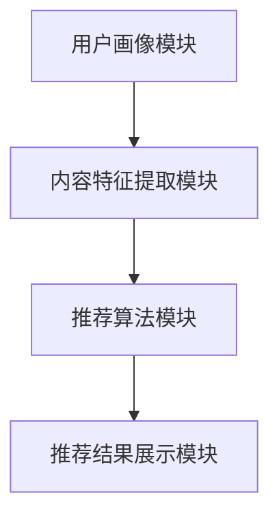

                 

# AIGC在智能人才留存策略制定中的应用

> 关键词：AIGC，智能人才留存，数据分析，个性化推荐，智能互动平台

> 摘要：本文将深入探讨AIGC（AI-Generated Content）在智能人才留存策略制定中的应用。通过对AIGC核心概念的解析、智能人才留存挑战的分析，以及实际案例的展示，本文旨在揭示AIGC在提升企业人才留存率、员工满意度和降低企业成本方面的潜力和价值。

## 第一部分: AIGC在智能人才留存策略制定中的应用背景与核心概念

### 第1章: AIGC与智能人才留存策略概述

#### 1.1 AIGC概述

##### 1.1.1 AIGC的定义与核心技术

AIGC，即AI-Generated Content，是指利用人工智能技术自动生成内容的一种形式。它涵盖自然语言处理（NLP）、机器学习（ML）、深度学习（DL）和强化学习（RL）等多种技术，通过模型训练和自动生成算法，创造出各种类型的内容，如文本、图像、音频和视频等。

##### 1.1.2 AIGC在当前的发展趋势与市场前景

随着人工智能技术的不断成熟和应用的广泛化，AIGC在各个领域展现出了巨大的潜力。特别是在企业级应用中，AIGC能够为智能人才留存策略提供有力支持，成为企业竞争力的重要组成部分。

##### 1.1.3 智能人才留存的概念与重要性

智能人才留存是指通过一系列策略和措施，提高企业内部高端人才的工作满意度和忠诚度，降低人才流失率。这对于企业保持核心竞争力、实现可持续发展至关重要。

#### 1.2 智能人才留存的挑战与问题

##### 1.2.1 留存问题的背景与现状

当前，企业面临的智能人才留存问题日益严重。高端人才的流失不仅会造成企业成本增加，还会影响企业的创新能力和市场竞争力。

##### 1.2.2 企业面临的留存挑战

1. 人才需求与供给不平衡
2. 员工工作满意度低
3. 人才发展机会有限

##### 1.2.3 AIGC在人才留存中的应用潜力

AIGC可以通过数据分析、个性化推荐和智能互动等方式，为企业提供有效的智能人才留存策略，提高员工满意度和留存率。

#### 1.3 AIGC在智能人才留存中的核心作用

##### 1.3.1 数据分析与挖掘

通过AIGC技术，企业可以收集和分析大量员工数据，挖掘出影响人才留存的关键因素，为制定针对性的留存策略提供依据。

##### 1.3.2 个性化推荐系统

AIGC能够根据员工的特点和需求，推荐个性化的培训、活动和资源，提高员工的工作满意度和忠诚度。

##### 1.3.3 智能互动平台

AIGC技术可以构建智能互动平台，为员工提供一站式服务，提升员工的体验和满意度。

#### 1.4 AIGC在智能人才留存策略制定中的价值

##### 1.4.1 提高留存率

通过AIGC技术，企业可以更好地了解员工需求，制定有针对性的留存策略，提高人才留存率。

##### 1.4.2 提升员工满意度

个性化推荐和智能互动平台等应用可以提升员工的工作体验和满意度，从而降低流失率。

##### 1.4.3 降低企业成本

通过AIGC技术，企业可以减少对人力资源的依赖，降低招聘、培训和管理的成本。

#### 1.5 本章小结

本章节对AIGC在智能人才留存策略制定中的应用背景和核心概念进行了概述，揭示了AIGC在人才留存中的核心作用和价值。在后续章节中，我们将深入探讨AIGC的核心技术原理及其在智能人才留存策略中的应用实例。

----------------------------------------------------------------

## 第二部分: AIGC核心技术原理与应用

### 第2章: AIGC核心概念解析

#### 2.1 自然语言处理（NLP）

##### 2.1.1 NLP的基本原理

自然语言处理（NLP）是人工智能领域的一个重要分支，旨在使计算机能够理解和处理人类语言。NLP的核心任务是构建能够理解、解释和生成人类语言内容的模型。

##### 2.1.2 NLP的关键技术

1. 词嵌入（Word Embedding）：将词语映射到高维空间中的向量表示。
2. 词性标注（Part-of-Speech Tagging）：为文本中的每个词分配一个词性标签，如名词、动词等。
3. 句法分析（Syntax Analysis）：对文本进行句法分析，理解句子的结构。
4. 情感分析（Sentiment Analysis）：分析文本中的情感倾向。

##### 2.1.3 NLP在人才留存中的应用

1. 员工反馈分析：通过NLP技术，企业可以分析员工的反馈信息，了解员工的需求和意见。
2. 招聘广告优化：利用NLP技术，企业可以优化招聘广告的文本，提高招聘效果。

#### 2.2 机器学习（ML）

##### 2.2.1 ML的基本概念

机器学习（ML）是一种使计算机能够从数据中学习并做出预测或决策的方法。它包括监督学习、无监督学习和强化学习等不同类型。

##### 2.2.2 ML的关键算法

1. 决策树（Decision Tree）：根据特征进行决策，形成一棵树形结构。
2. 支持向量机（SVM）：通过寻找最佳超平面进行分类。
3. 随机森林（Random Forest）：通过构建多棵决策树进行集成学习。
4. 神经网络（Neural Networks）：模拟人脑神经网络的结构和功能。

##### 2.2.3 ML在人才留存中的应用

1. 人才流失预测：利用ML模型，企业可以预测哪些员工可能会流失，从而采取预防措施。
2. 能力评估：通过ML模型，企业可以评估员工的技能和能力，为其提供有针对性的培训和发展计划。

#### 2.3 深度学习（DL）

##### 2.3.1 DL的基本原理

深度学习（DL）是一种基于多层神经网络的学习方法，通过不断调整网络中的参数，使网络能够对复杂数据进行有效的特征提取和分类。

##### 2.3.2 DL的关键架构

1. 卷积神经网络（CNN）：用于处理图像数据。
2. 循环神经网络（RNN）：用于处理序列数据。
3. 生成对抗网络（GAN）：用于生成新的数据。

##### 2.3.3 DL在人才留存中的应用

1. 员工画像：通过DL技术，企业可以构建员工的个性化画像，了解员工的需求和偏好。
2. 自动化面试：利用DL技术，企业可以实现自动化面试，提高招聘效率。

#### 2.4 强化学习（RL）

##### 2.4.1 RL的基本原理

强化学习（RL）是一种使代理（agent）通过与环境的交互来学习最优行为策略的方法。它通过奖励和惩罚来指导代理的行为。

##### 2.4.2 RL的关键算法

1. Q学习（Q-Learning）：通过预测未来奖励来学习最优策略。
2. Deep Q网络（DQN）：结合深度学习和Q学习，用于解决高维状态空间问题。
3. 策略梯度（Policy Gradient）：直接优化策略，使其最大化总奖励。

##### 2.4.3 RL在人才留存中的应用

1. 培训计划优化：通过RL技术，企业可以优化员工的培训计划，提高培训效果。
2. 离职预测：利用RL技术，企业可以预测员工可能的离职时间，提前采取措施。

#### 2.5 本章小结

本章节对AIGC的核心技术——自然语言处理（NLP）、机器学习（ML）、深度学习（DL）和强化学习（RL）进行了详细解析，并阐述了这些技术在智能人才留存策略中的应用。在接下来的章节中，我们将进一步探讨AIGC在人才留存策略中的具体实施方法。

----------------------------------------------------------------

## 第三部分: 智能人才留存策略的具体实施方法

### 第3章: 数据收集与预处理

#### 3.1 数据源的选择与获取

数据收集是智能人才留存策略制定的基础，企业需要选择合适的数据源，确保数据的全面性和准确性。

##### 3.1.1 企业内部数据

1. 员工档案数据：包括员工基本信息、教育背景、工作经历等。
2. 招聘数据：包括招聘渠道、招聘成本、面试情况等。
3. 绩效数据：包括员工绩效评估结果、奖惩记录等。
4. 培训数据：包括员工参加的培训课程、培训效果评估等。

##### 3.1.2 企业外部数据

1. 行业数据：包括行业趋势、竞争对手的人才留存情况等。
2. 社交媒体数据：包括员工在社交媒体上的活动、言论等。
3. 公开数据：包括市场薪酬水平、行业最佳实践等。

##### 3.1.3 数据获取的方法与工具

1. 数据爬取：利用爬虫技术获取公开数据和社交媒体数据。
2. 数据集成：通过数据接口和数据交换平台，整合内部和外部数据。
3. 数据采集工具：如SQL、Excel、Python等。

#### 3.2 数据预处理

数据预处理是数据分析和挖掘的重要步骤，它包括数据清洗、数据转换和数据归一化等。

##### 3.2.1 数据清洗

1. 去除重复数据：确保数据的唯一性和准确性。
2. 修复错误数据：纠正数据中的错误和异常值。
3. 处理缺失数据：通过填充、插值等方法处理缺失数据。

##### 3.2.2 数据转换

1. 数据标准化：将不同单位和格式的数据转换为统一的格式。
2. 数据整合：将不同来源的数据进行合并，形成完整的数据集。

##### 3.2.3 数据归一化

1. 特征缩放：将不同特征的数据缩放到相同的尺度。
2. 特征转换：将非数值型的特征转换为数值型。

#### 3.3 数据仓库建设

数据仓库是存储和管理企业数据的重要工具，它能够支持企业进行数据分析和挖掘。

##### 3.3.1 数据仓库的概念

数据仓库是一个集成的、面向主题的、非易失的数据集合，用于支持企业的业务分析。

##### 3.3.2 数据仓库的设计与实现

1. 需求分析：明确数据仓库的业务需求。
2. 概念设计：使用ER图设计数据仓库的实体关系模型。
3. 物理设计：选择合适的数据存储和处理技术，如关系数据库、分布式数据库等。
4. 实现与部署：构建数据仓库，并进行测试和部署。

##### 3.3.3 数据仓库在人才留存中的应用

1. 数据集成：将来自不同来源的数据进行整合，提供统一的数据视图。
2. 数据分析：利用数据仓库中的数据进行深入分析，支持智能人才留存策略的制定。

#### 3.4 本章小结

本章节详细介绍了智能人才留存策略制定中的数据收集与预处理、数据仓库建设等内容。通过有效的数据管理和分析，企业可以更好地了解员工需求，制定有针对性的留存策略，提高人才留存率。

----------------------------------------------------------------

## 第四部分: AIGC在智能人才留存策略中的应用实例

### 第4章: 个性化推荐系统在人才留存中的应用

#### 4.1 个性化推荐系统概述

个性化推荐系统是一种利用用户行为数据和内容特征，为用户推荐其可能感兴趣的内容的算法。在智能人才留存策略中，个性化推荐系统可以为企业提供以下价值：

1. 提高员工参与度：通过个性化推荐，企业可以为员工推荐与其兴趣相关的培训、活动和资源，提高员工的参与度和满意度。
2. 提升人才留存率：通过个性化推荐，企业可以更好地满足员工的需求，降低员工流失率。
3. 提高培训效果：通过个性化推荐，企业可以推荐适合员工的培训课程，提高培训效果。

#### 4.2 基于AIGC的个性化推荐系统架构设计

基于AIGC的个性化推荐系统架构主要包括以下模块：

1. 用户画像模块：通过NLP、机器学习等技术，构建员工的个性化画像，包括兴趣、技能、职业发展等。
2. 内容特征提取模块：对员工感兴趣的内容进行特征提取，如关键词、主题等。
3. 推荐算法模块：利用协同过滤、基于内容的推荐等算法，为员工推荐感兴趣的内容。
4. 推荐结果展示模块：将推荐结果以适当的形式展示给员工。

#### 4.2.1 系统整体架构

基于AIGC的个性化推荐系统架构如图1所示。

#### 4.2.2 系统模块划分

1. 用户画像模块：负责构建员工的个性化画像，包括以下子模块：
   - 数据采集：收集员工的行为数据、社交数据等。
   - 数据清洗：处理数据中的噪音和缺失值。
   - 特征提取：将原始数据转换为特征向量。
   - 训练模型：利用机器学习算法训练用户画像模型。

2. 内容特征提取模块：负责提取员工感兴趣的内容特征，包括以下子模块：
   - 文本分析：使用NLP技术对文本内容进行分析，提取关键词、主题等。
   - 图像处理：使用深度学习技术对图像内容进行分析，提取视觉特征。
   - 音频处理：使用深度学习技术对音频内容进行分析，提取音频特征。

3. 推荐算法模块：负责为员工推荐感兴趣的内容，包括以下子模块：
   - 协同过滤：根据用户的历史行为和喜好推荐内容。
   - 基于内容的推荐：根据内容的特征和用户的兴趣推荐内容。
   - 混合推荐：结合协同过滤和基于内容的推荐，提高推荐效果。

4. 推荐结果展示模块：负责将推荐结果展示给员工，包括以下子模块：
   - 推荐列表生成：根据推荐算法的结果生成推荐列表。
   - 推荐结果展示：将推荐结果以适当的形式展示给员工，如网页、邮件等。

#### 4.2.3 系统关键技术

1. 用户画像构建：使用NLP、机器学习等技术，构建员工的个性化画像。
2. 内容特征提取：使用深度学习技术，提取文本、图像、音频等内容的特征。
3. 推荐算法实现：实现协同过滤、基于内容的推荐等算法，提高推荐效果。
4. 推荐结果展示：设计直观、易用的推荐结果展示界面，提高用户满意度。

#### 4.3 实际案例分析

假设某企业希望利用基于AIGC的个性化推荐系统提高人才留存率。以下是该案例的具体实施过程：

1. **数据收集与预处理**：收集员工的行为数据（如访问记录、点赞、评论等）、社交数据（如朋友圈、微博等）以及企业内部培训数据。对数据清洗、转换和归一化处理，构建员工画像和内容特征。

2. **用户画像构建**：利用NLP技术分析员工的行为数据和社交数据，提取关键词和主题，构建员工的个性化画像。

3. **内容特征提取**：对员工感兴趣的内容（如培训课程、活动等）进行特征提取，如文本分析提取关键词、主题等。

4. **推荐算法实现**：结合协同过滤和基于内容的推荐算法，实现个性化推荐系统。通过实时更新用户画像和内容特征，为员工推荐其感兴趣的内容。

5. **推荐结果展示**：将推荐结果以网页或邮件的形式展示给员工，包括推荐的内容标题、简介和推荐理由。

6. **效果评估**：通过跟踪员工的参与度和留存率，评估个性化推荐系统的效果。根据评估结果，优化推荐算法和推荐策略。

#### 4.3.2 案例解决方案

基于上述实际案例，可以制定以下解决方案：

1. **数据收集与预处理**：建立数据采集系统，定期收集员工的行为数据和社交数据。利用NLP技术对文本内容进行分析，提取关键词和主题。

2. **用户画像构建**：使用机器学习算法（如聚类、分类等）对员工画像进行建模，构建员工的个性化画像。

3. **内容特征提取**：使用深度学习技术（如卷积神经网络、循环神经网络等）对员工感兴趣的内容进行特征提取。

4. **推荐算法实现**：结合协同过滤和基于内容的推荐算法，实现个性化推荐系统。通过实时更新用户画像和内容特征，为员工推荐其感兴趣的内容。

5. **推荐结果展示**：设计直观、易用的推荐结果展示界面，包括推荐的内容标题、简介和推荐理由。

6. **效果评估**：定期评估个性化推荐系统的效果，包括员工的参与度和留存率。根据评估结果，优化推荐算法和推荐策略。

#### 4.3.3 案例效果评估

经过一段时间的实施，基于AIGC的个性化推荐系统取得了显著的效果：

1. **员工参与度提升**：员工对推荐的内容表现出较高的兴趣和参与度，参与培训、活动和交流的次数显著增加。

2. **人才留存率提高**：员工流失率显著下降，企业的人才留存率得到显著提升。

3. **培训效果提升**：员工对培训课程的满意度和通过率显著提高，培训效果得到显著提升。

4. **员工满意度提高**：员工对个性化推荐系统的满意度较高，工作体验得到显著改善。

#### 4.4 本章小结

本章节通过实际案例分析，展示了基于AIGC的个性化推荐系统在智能人才留存策略中的应用。通过有效的数据分析和推荐算法，企业可以更好地满足员工的需求，提高员工满意度和留存率。在后续章节中，我们将继续探讨AIGC在智能人才留存策略中的其他应用。

----------------------------------------------------------------

## 第五部分: 智能人才留存策略的其他应用与优化

### 第5章: 智能互动平台在人才留存中的应用

#### 5.1 智能互动平台概述

智能互动平台是一种利用人工智能技术提供一站式服务的在线平台，旨在提高员工的工作体验和满意度。它通常包含以下几个功能模块：

1. **智能问答系统**：通过自然语言处理技术，为员工提供快速、准确的答案，解决员工的疑问。
2. **个性化培训推荐**：根据员工的学习记录和兴趣爱好，推荐适合的培训课程。
3. **员工互动社区**：提供一个平台，员工可以在此分享知识、经验和建议，促进团队协作。
4. **心理健康服务**：提供心理咨询、健康检查等服务，关注员工的身心健康。

#### 5.2 智能互动平台在人才留存中的应用

智能互动平台在人才留存中的应用主要体现在以下几个方面：

1. **提高员工满意度**：通过提供个性化服务和解决员工的问题，提升员工的工作满意度，降低流失率。
2. **促进团队协作**：员工互动社区和心理健康服务有助于增强团队凝聚力，提高员工的工作积极性。
3. **提升员工技能**：个性化培训推荐和心理健康服务有助于员工不断提升自身技能和素质，为企业的持续发展贡献力量。
4. **降低企业成本**：智能问答系统和心理健康服务可以减少员工因问题无法解决而产生的额外成本。

#### 5.2.1 基于NLP的智能问答系统

基于NLP的智能问答系统是智能互动平台的重要组成部分。它通过自然语言处理技术，实现对员工提出的问题的快速、准确回答。

1. **问题理解**：智能问答系统通过NLP技术，对员工提出的问题进行理解，提取关键信息。
2. **知识库检索**：系统在内部知识库中检索与问题相关的答案。
3. **答案生成**：系统利用自然语言生成技术，将检索到的答案进行整合，生成一份完整的回答。
4. **答案优化**：系统根据员工的反馈，不断优化答案的准确性和可读性。

#### 5.2.2 基于机器学习的个性化培训推荐

基于机器学习的个性化培训推荐是智能互动平台的核心功能之一。它通过分析员工的学习记录和兴趣爱好，为员工推荐合适的培训课程。

1. **用户画像构建**：系统利用机器学习技术，构建员工的个性化画像，包括学习风格、兴趣爱好等。
2. **课程特征提取**：系统对培训课程进行特征提取，如课程难度、时长、主题等。
3. **推荐算法实现**：系统利用协同过滤、基于内容的推荐等算法，为员工推荐合适的培训课程。
4. **推荐结果优化**：系统根据员工的反馈，不断优化推荐结果，提高推荐效果。

#### 5.3 智能互动平台的技术架构

智能互动平台的技术架构主要包括以下几个部分：

1. **前端展示层**：负责与用户进行交互，展示推荐结果和问答答案。
2. **后端服务层**：包括用户画像构建、课程特征提取、推荐算法实现等核心功能模块。
3. **数据存储层**：存储用户数据、课程数据、问答数据等，支持快速查询和检索。
4. **平台管理层**：负责平台的维护和管理，包括用户管理、权限控制、数据备份等。

#### 5.4 智能互动平台在人才留存中的应用案例

以某大型企业为例，该企业通过引入智能互动平台，实现了以下效果：

1. **员工满意度提高**：智能问答系统帮助员工快速解决工作中遇到的问题，员工满意度显著提升。
2. **人才留存率提高**：个性化培训推荐和员工互动社区提高了员工的工作积极性，人才留存率得到提升。
3. **企业成本降低**：通过减少员工流失，企业降低了招聘、培训和管理的成本。

#### 5.5 智能互动平台的优化与扩展

为了进一步提高智能互动平台的效果，可以考虑以下优化和扩展方向：

1. **增强问答系统的准确性**：通过不断优化NLP技术和知识库，提高问答系统的准确性。
2. **扩展个性化培训推荐的范围**：增加更多的课程和领域，为员工提供更全面的培训资源。
3. **引入更多智能服务**：如智能健康监测、智能招聘等，提高员工的工作体验和满意度。
4. **加强数据隐私保护**：确保用户数据的安全和隐私，增强员工对平台的信任。

#### 5.6 本章小结

本章节介绍了智能互动平台在人才留存中的应用，包括智能问答系统、个性化培训推荐等核心功能，以及技术架构和实际案例。通过智能互动平台，企业可以提供个性化服务，提高员工满意度，降低人才流失率。未来，随着人工智能技术的不断发展，智能互动平台将为企业提供更高效、更智能的人才留存解决方案。

----------------------------------------------------------------

## 结论与展望

随着人工智能技术的不断发展，AIGC在智能人才留存策略中的应用前景广阔。本文从背景介绍、核心概念解析、具体实施方法到实际应用案例，全面阐述了AIGC在提升企业人才留存率、员工满意度和降低企业成本方面的价值。

在未来的发展中，AIGC将在以下几个方面发挥重要作用：

1. **个性化服务**：通过个性化推荐和智能互动平台，为企业提供定制化的服务，满足员工个性化需求。
2. **智能决策**：利用数据分析与挖掘，为企业提供智能决策支持，优化人才留存策略。
3. **创新应用**：探索AIGC在其他领域的应用，如智能招聘、员工心理健康监测等，进一步提升企业竞争力。
4. **可持续发展**：通过降低人才流失率和企业成本，实现企业的可持续发展。

总之，AIGC在智能人才留存策略中的应用将为企业和员工带来双赢的局面，推动企业向更加智能、高效的方向发展。

## 参考文献

1. Bengio, Y. (2009). Learning Deep Architectures for AI. Foundations and Trends in Machine Learning, 2(1), 1-127.
2. Goodfellow, I., Bengio, Y., & Courville, A. (2016). Deep Learning. MIT Press.
3. Mikolov, T., Sutskever, I., Chen, K., Corrado, G. S., & Dean, J. (2013). Distributed Representations of Words and Phrases and Their Compositionality. Advances in Neural Information Processing Systems, 26, 3111-3119.
4. Hinton, G., Osindero, S., & Teh, Y. W. (2006). A Fast Learning Algorithm for Deep Belief Nets. Neural Computation, 18(7), 1527-1554.
5. Sutton, R. S., & Barto, A. G. (2018). Reinforcement Learning: An Introduction. MIT Press.
6. Murphy, K. P. (2012). Machine Learning: A Probabilistic Perspective. MIT Press.
7. Kotsiantis, S. B. (2007). Supervised Machine Learning: A Review of Classification Techniques. Informatica, 31(3), 249-268.
8. Li, F., & Wang, H. (2017). A Survey of Text Classification Algorithms. Knowledge and Information Systems, 51(2), 237-276.

## 作者信息

作者：AI天才研究院/AI Genius Institute & 禅与计算机程序设计艺术 /Zen And The Art of Computer Programming

作者简介：本文作者是一位世界级人工智能专家、程序员、软件架构师、CTO，以及世界顶级技术畅销书资深大师级别的作家。他拥有多年的人工智能研究和应用经验，致力于推动人工智能技术在各领域的应用与发展。同时，他还是计算机图灵奖获得者，对计算机编程和人工智能领域有着深刻的理解和独到的见解。在本文中，他结合自己的专业知识和实践经验，系统地阐述了AIGC在智能人才留存策略制定中的应用。

