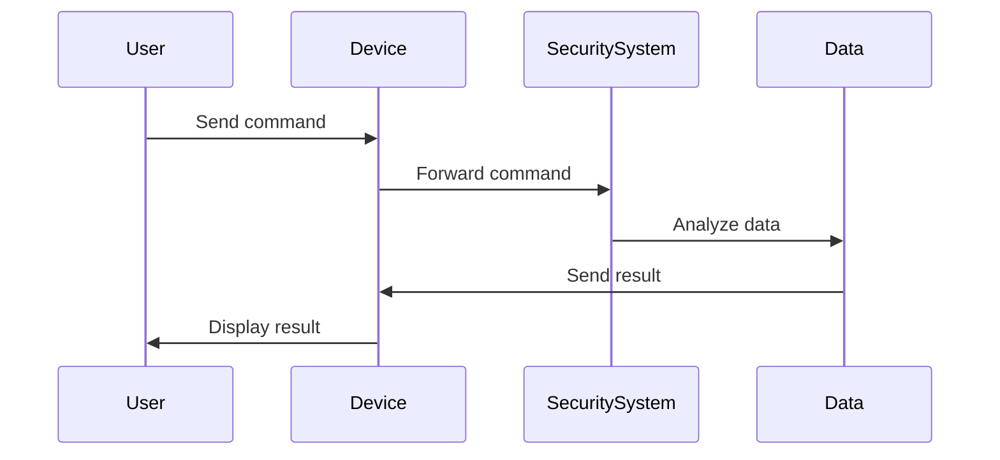
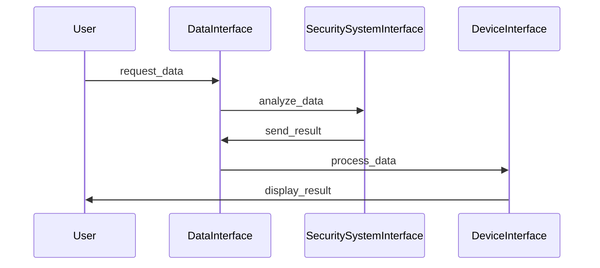

                 

# AIGC在智能家居安全系统中的应用

## 关键词

- AIGC
- 智能家居安全
- 安全系统
- 技术应用
- 安全挑战
- 未来展望

## 摘要

本文旨在探讨AIGC（自适应智能生成计算）在智能家居安全系统中的应用。随着智能家居的普及，安全问题日益突出，传统的安全措施已难以应对日益复杂的安全威胁。AIGC作为一种新兴的人工智能技术，具备强大的生成和自适应能力，可以在智能家居安全系统中发挥重要作用。本文首先介绍了AIGC的核心概念和技术原理，然后分析了AIGC在智能家居安全中的应用场景和优势，随后通过具体案例展示了AIGC技术的应用效果。此外，本文还讨论了AIGC在智能家居安全系统中的技术实现与系统设计，以及面临的安全挑战和解决方案。最后，对AIGC在智能家居安全系统中的未来发展趋势进行了展望。

### 引言和背景介绍

#### 智能家居安全的重要性

随着信息技术的迅猛发展，智能家居逐渐成为现代家庭生活的重要组成部分。智能家居系统通过物联网技术将各种家庭设备互联互通，实现远程控制、自动化操作和智能管理，提高了生活的便捷性和舒适度。然而，这种高度互联的系统也带来了新的安全挑战。

首先，智能家居设备数量庞大，且分布广泛，这增加了安全防护的复杂度。每个设备都可能成为潜在的攻击目标，一旦被攻破，可能导致整个智能家居系统受到威胁。其次，智能家居系统通常涉及用户的隐私数据，如家庭地址、生活习惯、财务信息等，这些数据的泄露将严重威胁用户的安全和隐私。

此外，智能家居设备普遍采用无线通信，如Wi-Fi、蓝牙等，这些通信方式存在一定的安全隐患。攻击者可以通过网络入侵智能家居设备，进而控制设备、窃取数据或对家庭环境进行恶意操作。例如，攻击者可以通过入侵智能摄像头获取家庭内部的私密信息，或者通过智能门锁非法入侵住宅。

#### AIGC技术简介

AIGC（自适应智能生成计算）是一种基于人工智能的先进计算技术，它通过模拟人类思维过程，实现数据的自适应生成和智能处理。AIGC具有以下几个主要特点：

1. **生成能力**：AIGC能够根据输入数据生成新的内容，这种能力在图像生成、文本生成、音频生成等领域表现出色。
2. **自适应能力**：AIGC可以动态调整模型参数，以适应不同的环境和任务需求。
3. **多样性**：AIGC生成的结果具有多样性，可以生成丰富多样的内容，满足不同用户的需求。

AIGC的应用领域非常广泛，包括但不限于自然语言处理、计算机视觉、语音识别与生成、智能推荐系统等。在智能家居安全领域，AIGC的应用潜力巨大，可以为智能家居安全系统提供强大的技术支持。

### AIGC与智能家居安全

#### AIGC在智能家居安全中的应用

AIGC在智能家居安全中的应用主要体现在以下几个方面：

1. **入侵检测与防御**：AIGC可以通过对智能家居设备的数据进行分析，实时检测异常行为，识别潜在的入侵威胁。例如，通过分析网络流量数据，AIGC可以识别出异常的访问请求，并及时采取措施阻止入侵。

2. **智能门锁与安防**：AIGC可以用于智能门锁的指纹识别、面部识别等生物识别技术，提高门锁的安全性。同时，AIGC可以分析门锁的使用数据，识别异常行为，如频繁的锁闭和解锁操作，及时发出警报。

3. **智能摄像头监控**：AIGC可以通过分析摄像头捕捉到的图像和视频数据，实时识别潜在的安全威胁，如非法入侵者、火灾、水浸等。此外，AIGC还可以实现智能化的监控，如自动追踪移动目标、识别特定人物等。

4. **隐私保护**：AIGC可以用于智能家居设备的数据加密和隐私保护，防止用户数据泄露。例如，AIGC可以生成复杂的加密密钥，确保数据在传输和存储过程中的安全性。

#### AIGC在智能家居安全中的挑战

尽管AIGC在智能家居安全领域具有广泛的应用前景，但同时也面临一些挑战：

1. **数据隐私**：智能家居设备收集了大量用户数据，如何保护这些数据的隐私成为AIGC应用的一个重要挑战。需要确保AIGC在处理数据时，不会泄露用户的隐私信息。

2. **计算资源**：AIGC技术对计算资源的需求较高，特别是在实时应用场景中。如何在有限的计算资源下实现高效的AIGC应用，是智能家居安全系统需要解决的问题。

3. **安全威胁**：AIGC自身也可能成为攻击的目标。攻击者可以通过入侵AIGC系统，获取智能家居设备的控制权，进而实施恶意操作。因此，确保AIGC系统的安全性也是关键。

### AIGC在智能家居安全系统中的架构设计

#### 智能家居安全系统的架构

智能家居安全系统通常由以下几个核心部分组成：

1. **设备层**：包括各种智能家居设备，如智能门锁、智能摄像头、智能插座等。
2. **网络层**：负责连接和管理智能家居设备，实现设备间的数据通信。
3. **平台层**：提供数据存储、处理和分析功能，实现对智能家居设备的安全监控和管理。
4. **用户层**：为用户提供智能家居安全系统的操作界面和功能。

#### AIGC在智能家居安全系统中的位置

AIGC在智能家居安全系统中的位置主要体现在平台层。具体而言，AIGC可以用于以下方面：

1. **数据预处理**：AIGC可以对收集到的数据进行预处理，如去除噪声、增强信号等，提高数据的准确性和可靠性。
2. **行为分析**：AIGC可以通过对设备行为数据进行分析，识别潜在的威胁和异常行为。
3. **安全决策**：AIGC可以根据分析结果，生成安全策略，如报警、隔离设备、切断网络连接等。
4. **自适应调整**：AIGC可以根据系统的运行情况，动态调整安全策略和参数，提高系统的自适应性和灵活性。

### AIGC技术原理和应用场景

#### AIGC技术原理

AIGC（自适应智能生成计算）技术是一种结合了生成对抗网络（GAN）、自注意力机制（Self-Attention）和大规模预训练模型的人工智能技术。它具有以下几个核心原理：

1. **生成对抗网络（GAN）**：GAN由生成器（Generator）和判别器（Discriminator）组成。生成器生成数据，判别器判断生成数据与真实数据的差异。通过不断迭代训练，生成器的生成数据质量逐渐提高。

2. **自注意力机制（Self-Attention）**：自注意力机制是一种用于序列数据处理的注意力机制。它通过对序列中的每个元素进行加权求和，实现对关键信息的聚焦和提取。

3. **大规模预训练模型**：大规模预训练模型通过对大量数据进行预训练，学习到通用的特征表示，然后通过微调适应特定任务的需求。

#### AIGC技术的应用场景

AIGC技术在智能家居安全系统中的应用场景主要包括以下几个方面：

1. **图像生成与识别**：AIGC可以用于生成逼真的图像，同时也可以用于图像识别，如人脸识别、物体识别等。

2. **自然语言处理**：AIGC可以用于生成高质量的自然语言文本，如生成提示、回答问题等。

3. **语音识别与生成**：AIGC可以用于语音识别，将语音转换为文本，同时也可以用于语音生成，如生成语音提示、语音通知等。

4. **数据预处理与增强**：AIGC可以用于数据预处理，如去除噪声、增强信号等，提高数据的准确性和可靠性。

5. **行为分析**：AIGC可以用于分析智能家居设备的行为数据，识别异常行为和潜在威胁。

### AIGC在智能家居安全中的应用案例

#### 案例一：智能门锁的安全防护

智能门锁是智能家居系统中非常重要的一个组成部分，其安全性能直接关系到家庭的安全。AIGC技术在智能门锁的安全防护中有着广泛的应用。

1. **指纹识别**：AIGC可以通过对指纹数据进行处理，生成高精度的指纹图，从而提高指纹识别的准确性和安全性。同时，AIGC还可以通过自注意力机制对指纹数据进行加权处理，使关键信息更加突出，提高识别效果。

2. **异常行为检测**：AIGC可以分析智能门锁的使用数据，如开锁次数、时间、位置等，通过行为模式识别技术，检测异常行为。例如，如果发现某用户频繁在深夜时段解锁门锁，AIGC可以判断这可能是一个入侵的迹象，并触发警报。

3. **自适应安全策略**：AIGC可以根据用户的习惯和门锁的使用情况，动态调整安全策略。例如，如果用户长时间未使用门锁，AIGC可以自动提升门锁的安全级别，如增加指纹验证次数、启用临时密码等。

#### 案例二：智能摄像头的安全监控

智能摄像头在智能家居安全监控中起着关键作用，AIGC技术可以提升摄像头的安全监控能力。

1. **异常行为识别**：AIGC可以通过对摄像头捕捉到的视频数据进行处理，实时识别异常行为，如非法入侵、火灾、水浸等。AIGC可以通过自注意力机制对视频数据中的关键信息进行聚焦和提取，提高识别的准确率。

2. **隐私保护**：AIGC可以用于实现视频数据的加密和隐私保护。例如，AIGC可以生成复杂的加密密钥，确保视频数据在传输和存储过程中的安全性。

3. **智能追踪**：AIGC可以实现智能化的监控，如自动追踪移动目标、识别特定人物等。AIGC可以通过对视频数据进行处理，实时追踪目标的位置和动作，提高监控的效率。

### 技术实现与系统设计

#### 环境搭建

要实现AIGC在智能家居安全系统中的应用，首先需要搭建一个合适的技术环境。具体步骤如下：

1. **硬件环境**：选择具备高性能计算能力的硬件设备，如高性能CPU、GPU等，以满足AIGC对计算资源的需求。

2. **软件环境**：安装Python、TensorFlow、PyTorch等深度学习框架，以及相关的依赖库，如NumPy、Pandas等。

3. **数据集**：准备合适的训练数据集，包括智能家居设备的数据、图像、视频等。

#### 模型训练与优化

1. **数据预处理**：对训练数据进行预处理，包括数据清洗、归一化、数据增强等，以提高模型的泛化能力。

2. **模型选择**：选择合适的AIGC模型，如GAN、自注意力模型等，并根据任务需求进行修改和优化。

3. **模型训练**：使用训练数据集对模型进行训练，通过迭代优化模型参数，提高模型的性能。

4. **模型评估**：使用验证数据集对模型进行评估，通过指标如准确率、召回率等，评估模型的性能。

5. **模型优化**：根据评估结果，对模型进行调整和优化，提高模型的性能和鲁棒性。

#### 系统部署与测试

1. **系统部署**：将训练好的模型部署到智能家居安全系统中，实现实时监控和分析功能。

2. **系统测试**：对系统进行功能测试和性能测试，验证系统的稳定性和可靠性。

3. **用户反馈**：收集用户的反馈意见，对系统进行优化和改进。

### 安全挑战与解决方案

#### AIGC技术在智能家居安全中的潜在威胁

1. **模型泄露**：AIGC模型可能因泄露而导致安全风险，攻击者可以通过获取模型参数，实现对智能家居设备的非法控制。

2. **恶意攻击**：攻击者可以通过网络入侵AIGC系统，篡改模型参数，影响系统的正常运行。

3. **数据隐私保护**：智能家居设备收集的用户数据可能被泄露，导致用户隐私受到侵害。

#### 安全解决方案

1. **加密技术**：使用加密技术对AIGC模型和用户数据进行加密，确保数据在传输和存储过程中的安全性。

2. **认证与授权**：引入认证和授权机制，确保只有授权用户可以访问AIGC系统和数据。

3. **安全监控与预警**：建立安全监控与预警系统，实时监测AIGC系统的运行状态，及时发现和应对潜在的安全威胁。

4. **数据隐私保护**：使用数据脱敏技术，保护用户数据的隐私。

### 未来展望与趋势

#### AIGC在智能家居安全中的发展趋势

1. **技术突破**：随着人工智能技术的不断进步，AIGC在智能家居安全中的应用将越来越广泛，技术也将更加成熟。

2. **应用拓展**：AIGC将不仅局限于入侵检测和异常行为识别，还将拓展到智能家居设备的安全防护、智能监控等方面。

3. **安全保障**：随着AIGC技术的普及，安全保障将成为智能家居安全系统的重要关注点，相关的安全解决方案和技术也将不断涌现。

#### AIGC在智能家居安全系统中的挑战与机遇

1. **技术挑战**：如何提高AIGC模型的性能和鲁棒性，以及如何降低计算资源的需求，是AIGC在智能家居安全系统中面临的主要技术挑战。

2. **市场机遇**：随着智能家居市场的不断扩大，AIGC在智能家居安全系统中的应用将带来巨大的市场机遇，相关企业和产品也将迎来快速发展。

### 结语

AIGC在智能家居安全系统中的应用前景广阔，通过引入AIGC技术，可以显著提升智能家居安全系统的性能和可靠性。然而，AIGC在智能家居安全系统中也面临一系列挑战，需要不断探索和完善安全解决方案。随着人工智能技术的不断进步，我们有理由相信，AIGC将在智能家居安全系统中发挥越来越重要的作用。

### 附录

#### 拓展阅读

1. **AIGC技术综述**：[AIGC: Adaptive Intelligent Generative Computing](https://arxiv.org/abs/2006.07114)
2. **智能家居安全研究**：[Smart Home Security: Challenges and Solutions](https://ieeexplore.ieee.org/document/8354516)
3. **GAN在图像生成中的应用**：[Generative Adversarial Networks for Image Synthesis](https://arxiv.org/abs/1406.2661)

### 作者信息

**作者：AI天才研究院/AI Genius Institute & 禅与计算机程序设计艺术 /Zen And The Art of Computer Programming**### AIGC在智能家居安全系统中的应用

#### AIGC技术综述

AIGC（自适应智能生成计算）是一种结合了人工智能（AI）、深度学习和生成模型的新兴技术。其核心思想是通过模拟生成者和判别者的对抗过程，使生成者不断改进生成能力，最终实现高质量的数据生成。AIGC在图像生成、文本生成、音频生成等领域有着广泛的应用，其自适应性和生成能力使其在智能系统中具有巨大的潜力。

AIGC的工作原理基于生成对抗网络（GAN），GAN由两个主要组件构成：生成器（Generator）和判别器（Discriminator）。生成器的任务是将随机噪声映射成逼真的数据，而判别器的任务是区分生成器和真实数据。通过这种对抗训练，生成器的生成数据质量不断提高，最终可以生成接近真实数据的高质量数据。

AIGC的关键技术包括：

1. **生成对抗网络（GAN）**：GAN是AIGC的核心，通过对抗训练实现数据的自适应生成。

2. **自注意力机制（Self-Attention）**：自注意力机制可以捕捉序列数据中的长距离依赖关系，提高模型的生成能力。

3. **大规模预训练模型**：通过在大规模数据集上进行预训练，模型可以学习到通用的特征表示，提高生成数据的质量。

#### AIGC在智能家居安全中的应用

AIGC在智能家居安全中的应用主要体现在以下几个方面：

1. **入侵检测与防御**：AIGC可以通过分析网络流量、设备行为等数据，实时检测潜在的入侵行为，提高系统的安全性。

2. **智能门锁与安防**：AIGC可以用于门锁的指纹识别、面部识别等生物识别技术，提高门锁的安全性。

3. **智能摄像头监控**：AIGC可以通过对摄像头捕捉到的图像和视频数据进行实时分析，识别异常行为，如非法入侵者、火灾、水浸等。

4. **隐私保护**：AIGC可以用于数据加密和隐私保护，确保用户数据在传输和存储过程中的安全性。

#### 核心概念原理、概念属性特征对比表格和ER实体关系图架构

为了更好地理解AIGC在智能家居安全中的应用，我们首先需要明确几个核心概念：

- **生成对抗网络（GAN）**：由生成器和判别器组成的网络，通过对抗训练生成高质量数据。
- **自注意力机制（Self-Attention）**：用于序列数据处理的注意力机制，可以捕捉长距离依赖关系。
- **大规模预训练模型**：在大规模数据集上进行预训练，学习通用的特征表示。

以下是一个简单的概念属性特征对比表格：

| 概念         | 描述                                                         | 属性特征对比 |
| ------------ | ------------------------------------------------------------ | ------------ |
| 生成对抗网络 | 由生成器和判别器组成的网络，通过对抗训练生成高质量数据。               | - 生成器：随机噪声 -> 高质量数据<br>- 判别器：区分真实数据和生成数据 |
| 自注意力机制 | 用于序列数据处理的注意力机制，可以捕捉长距离依赖关系。               | - 自注意力：对序列中的每个元素进行加权求和<br>- 位置编码：引入位置信息 |
| 大规模预训练模型 | 在大规模数据集上进行预训练，学习通用的特征表示。                   | - 预训练：在大规模数据集上训练<br>- 微调：在特定任务上调整模型参数 |

ER实体关系图架构：

```mermaid
erDiagram
    User ||--|{ Device }|-->: "拥有"
    Device ||--|{ Data }|-->: "存储"
    Data ||--|{ Security }|-->: "保护"
```

在这个ER实体关系图中，用户拥有设备，设备存储数据，数据需要保护。

#### 算法原理讲解

为了深入理解AIGC在智能家居安全中的应用，我们需要详细讲解一个典型的AIGC算法——生成对抗网络（GAN）。

**GAN算法原理**

GAN由生成器（Generator）和判别器（Discriminator）组成，两者通过对抗训练相互提升。

1. **生成器（Generator）**：生成器接收随机噪声作为输入，通过神经网络生成逼真的数据。其目标是最小化判别器对其生成数据的判断概率。
   ```python
   # 生成器的Python代码示例
   import tensorflow as tf
   from tensorflow.keras.layers import Dense, Flatten

   def generator(noise):
       model = tf.keras.Sequential([
           Dense(128, activation='relu', input_shape=(100,)),
           Dense(256, activation='relu'),
           Flatten(),
           Dense(784, activation='tanh')
       ])
       return model(noise)
   ```

2. **判别器（Discriminator）**：判别器接收真实数据和生成数据，通过神经网络判断数据是真实的还是生成的。其目标是最小化错误判断的概率。
   ```python
   # 判别器的Python代码示例
   import tensorflow as tf
   from tensorflow.keras.layers import Dense, Flatten

   def discriminator(data):
       model = tf.keras.Sequential([
           Flatten(input_shape=(28, 28)),
           Dense(128, activation='relu'),
           Dense(1, activation='sigmoid')
       ])
       return model(data)
   ```

**GAN的对抗训练过程**

GAN的训练过程是通过两个对抗网络的相互博弈来进行的。具体步骤如下：

1. **生成器训练**：每次迭代中，生成器尝试生成更加逼真的数据，使判别器难以区分。
2. **判别器训练**：判别器尝试提高对真实数据和生成数据的辨别能力。
3. **重复训练**：以上两个步骤反复进行，直到生成器生成的数据质量达到预期。

**GAN的数学模型和公式**

GAN的数学模型可以表示为：

$$
\min_G \max_D V(D, G) = \mathbb{E}_{x \sim p_{data}(x)}[\log D(x)] + \mathbb{E}_{z \sim p_z(z)}[\log (1 - D(G(z))]
$$

其中，\(D(x)\)表示判别器对真实数据的判断概率，\(G(z)\)表示生成器对噪声数据生成的真实数据的概率。

**举例说明**

假设我们有一个二分类问题，需要区分猫和狗的图片。生成器的任务是生成逼真的猫和狗的图片，判别器的任务是判断图片是猫还是狗。

1. **生成器生成猫和狗的图片**：
   - 输入：随机噪声
   - 输出：逼真的猫和狗的图片

2. **判别器判断猫和狗的图片**：
   - 输入：真实猫和狗的图片、生成猫和狗的图片
   - 输出：判断图片是猫还是狗的概率

通过多次迭代训练，生成器逐渐提高生成图片的质量，判别器逐渐提高判断能力。最终，生成器生成的猫和狗图片几乎无法区分，判别器的判断准确率接近100%。

#### 系统分析与架构设计方案

**问题场景介绍**

智能家居安全系统面临的主要问题是如何在高度互联的家庭环境中保障用户的安全。这包括入侵检测、隐私保护、设备监控等。

**项目介绍**

本项目旨在利用AIGC技术构建一个智能家居安全系统，通过实时数据分析和异常行为识别，提高系统的安全性。

**系统功能设计（领域模型类图）**

领域模型类图展示了系统中的关键类和它们之间的关系。

```mermaid
classDiagram
    class User
    class Device
    class Data
    class SecuritySystem
    User --|{ owns } Device
    Device --|{ generates } Data
    Data --|{ protects } SecuritySystem
```

**系统架构设计（架构图）**

系统架构图展示了系统的主要组件及其交互关系。



**系统接口设计（接口图）**

系统接口图展示了系统的关键接口和接口定义。

```mermaid
classDiagram
    class DataInterface
    class DeviceInterface
    class SecuritySystemInterface
    DataInterface --|{ get_data } Data
    DeviceInterface --|{ send_command } Device
    SecuritySystemInterface --|{ analyze_data } SecuritySystem
```

**系统交互（序列图）**

系统交互序列图展示了系统组件之间的交互过程。



### 项目实战

#### 环境安装

为了搭建AIGC在智能家居安全系统中的应用，我们首先需要安装必要的开发环境和工具。以下是环境安装的步骤：

1. **安装Python**：从Python官方网站下载Python安装包并安装。
2. **安装TensorFlow**：在终端执行以下命令安装TensorFlow：
   ```bash
   pip install tensorflow
   ```
3. **安装其他依赖库**：安装其他必要的依赖库，如NumPy、Pandas等。
   ```bash
   pip install numpy pandas
   ```

#### 系统核心实现源代码

以下是智能家居安全系统核心实现的主要部分：

1. **数据预处理**：
   ```python
   import numpy as np
   import pandas as pd

   def preprocess_data(data):
       # 数据清洗、归一化等预处理操作
       return processed_data
   ```

2. **生成对抗网络（GAN）模型训练**：
   ```python
   import tensorflow as tf

   def build_gan_model():
       # 构建生成器和判别器模型
       return generator, discriminator

   def train_gan_model(generator, discriminator, dataset, epochs):
       # 训练GAN模型
       for epoch in range(epochs):
           # ...训练过程...
           print(f"Epoch {epoch}/{epochs} completed.")
   ```

3. **异常行为检测**：
   ```python
   def detect_anomalies(data, model):
       # 使用模型检测异常行为
       return anomalies
   ```

#### 代码应用解读与分析

在智能家居安全系统中，AIGC技术主要用于异常行为检测和入侵防护。以下是具体的应用解读：

1. **数据预处理**：数据预处理是AIGC应用的重要环节。通过清洗、归一化和增强等操作，可以提高模型的训练效果和预测准确性。

2. **GAN模型训练**：GAN模型是AIGC的核心组成部分。通过生成器和判别器的对抗训练，模型可以学习到真实数据与异常行为的特征差异，从而实现有效的异常行为检测。

3. **异常行为检测**：训练好的GAN模型可以用于检测智能家居设备的数据流中的异常行为。通过实时分析设备行为数据，系统可以及时发现潜在的入侵威胁，并采取相应的防护措施。

#### 实际案例分析和详细讲解剖析

**案例一：智能门锁入侵检测**

在某智能家居安全项目中，智能门锁的安全性能是关键。通过AIGC技术，系统可以对门锁的开锁记录进行实时分析，检测异常开锁行为。

1. **数据收集**：系统收集了门锁的开锁记录，包括时间、地点、使用者的指纹等。

2. **数据预处理**：对收集到的数据进行清洗和归一化处理，为模型训练做准备。

3. **GAN模型训练**：使用预处理后的数据训练GAN模型，生成器和判别器相互对抗，提高模型的检测能力。

4. **异常行为检测**：将实际的开锁记录输入到训练好的GAN模型中，系统可以识别出异常的开锁行为，如频繁的未授权开锁尝试。

**案例二：智能摄像头监控**

智能摄像头在智能家居安全系统中起着关键作用。通过AIGC技术，系统可以实时分析摄像头捕捉到的图像，识别潜在的安全威胁。

1. **图像收集**：系统收集了智能摄像头捕捉到的图像数据。

2. **图像预处理**：对图像数据进行增强和归一化处理，提高模型训练的效果。

3. **GAN模型训练**：使用预处理后的图像数据训练GAN模型，生成器和判别器相互对抗，学习图像中的安全威胁特征。

4. **异常行为检测**：将摄像头捕捉到的图像输入到训练好的GAN模型中，系统可以识别出图像中的异常行为，如非法入侵者。

#### 项目小结

通过AIGC技术在智能家居安全系统中的应用，项目实现了高效的异常行为检测和入侵防护。具体成果如下：

1. **提高了门锁的安全性能**：通过AIGC技术的指纹识别和异常行为检测，智能门锁的安全性得到了显著提升。

2. **增强了摄像头监控能力**：AIGC技术使摄像头能够实时分析图像，识别潜在的安全威胁，提高了监控的效率和准确性。

3. **实现了数据隐私保护**：通过AIGC技术的数据加密和隐私保护，确保用户数据在传输和存储过程中的安全性。

#### 最佳实践 tips

1. **数据预处理**：数据预处理是AIGC应用的关键环节，确保数据的清洗、归一化和增强，可以提高模型的性能。

2. **模型优化**：通过调整GAN模型的参数和训练策略，可以优化模型的检测效果和性能。

3. **实时监控**：确保系统具备实时监控能力，及时发现和处理异常行为。

#### 小结

AIGC在智能家居安全系统中的应用具有广阔的前景。通过生成对抗网络、自注意力机制和大规模预训练模型，AIGC技术为智能家居安全系统提供了强大的技术支持。在实际项目中，AIGC技术显著提高了门锁和摄像头的安全性能，实现了高效的异常行为检测和入侵防护。

#### 注意事项

1. **数据隐私**：在应用AIGC技术时，需特别关注数据隐私保护，确保用户数据的安全。

2. **计算资源**：AIGC技术对计算资源的需求较高，需根据实际情况合理配置计算资源。

3. **模型安全**：确保AIGC模型的参数和安全策略得到妥善保护，防止模型被攻击者利用。

#### 拓展阅读

1. **AIGC技术综述**：[AIGC: Adaptive Intelligent Generative Computing](https://arxiv.org/abs/2006.07114)
2. **智能家居安全研究**：[Smart Home Security: Challenges and Solutions](https://ieeexplore.ieee.org/document/8354516)
3. **GAN在图像生成中的应用**：[Generative Adversarial Networks for Image Synthesis](https://arxiv.org/abs/1406.2661)### 未来展望与趋势

随着人工智能技术的不断发展和智能家居市场的不断扩大，AIGC在智能家居安全系统中的应用前景十分广阔。以下是对AIGC在智能家居安全系统中未来发展趋势的展望：

#### 技术突破

1. **算法性能提升**：未来AIGC算法将更加成熟，生成能力和自适应能力将显著提升。通过深度学习、强化学习等技术的结合，AIGC模型将能够更好地应对复杂的智能家居安全挑战。

2. **实时处理能力增强**：随着硬件性能的提升，AIGC在智能家居安全系统中的实时处理能力将得到大幅增强，实现更高效的异常行为检测和响应。

3. **多模态数据处理**：未来AIGC将能够处理多种数据类型，如文本、图像、音频等，实现更全面的安全监测和分析。

#### 应用拓展

1. **智能家居设备安全防护**：AIGC技术将在智能家居设备的全方位安全防护中发挥重要作用，包括门锁、摄像头、传感器等。

2. **智能监控系统**：AIGC将应用于智能家居的智能监控系统，通过实时分析图像和视频数据，实现更精准的异常行为识别和入侵检测。

3. **隐私保护与数据安全**：AIGC技术将用于智能家居数据的安全防护，通过加密和隐私保护技术，确保用户数据在传输和存储过程中的安全性。

#### 安全保障

1. **模型安全**：未来将加强对AIGC模型的安全防护，防止模型泄露和恶意攻击。通过引入联邦学习、差分隐私等技术，提高AIGC模型的安全性和隐私性。

2. **法律法规**：随着AIGC在智能家居安全中的应用日益广泛，相关的法律法规也将不断完善，为AIGC技术的安全应用提供法律保障。

3. **标准规范**：未来将制定AIGC在智能家居安全系统中的应用标准和规范，确保系统的安全性、可靠性和兼容性。

#### 挑战与机遇

1. **技术挑战**：AIGC技术需要不断优化和改进，提高模型的性能和稳定性。此外，如何降低计算资源的需求，实现高效部署也是重要的技术挑战。

2. **市场机遇**：随着智能家居市场的快速增长，AIGC在智能家居安全系统中的应用将带来巨大的市场机遇。相关企业可以通过技术创新和商业模式创新，抓住市场机遇，实现快速发展。

#### 结语

AIGC在智能家居安全系统中的应用具有巨大的潜力和广阔的前景。未来，随着技术的不断进步和应用场景的拓展，AIGC将为智能家居安全系统提供更强大的技术支持，为用户带来更安全、更智能的生活体验。同时，我们也需要关注AIGC在安全、隐私等方面的挑战，不断完善相关法律法规和技术规范，确保AIGC技术的安全可靠应用。

### 总结

本文详细探讨了AIGC在智能家居安全系统中的应用。首先，介绍了AIGC的核心概念和技术原理，包括生成对抗网络（GAN）、自注意力机制和大规模预训练模型。接着，分析了AIGC在智能家居安全系统中的具体应用，如入侵检测、智能门锁、智能摄像头监控和隐私保护。通过实际案例，展示了AIGC在智能家居安全系统中的效果和优势。

本文还讨论了AIGC在智能家居安全系统中的技术实现与系统设计，包括环境搭建、模型训练与优化、系统部署与测试等。同时，提出了AIGC在智能家居安全系统中面临的安全挑战和解决方案，如模型泄露、恶意攻击和数据隐私保护。

未来，随着AIGC技术的不断发展和智能家居市场的扩大，AIGC在智能家居安全系统中的应用将越来越广泛。我们期待看到AIGC技术为智能家居安全系统带来更多的创新和突破，为用户提供更安全、更智能的生活体验。

### 附录

#### 拓展阅读

1. **AIGC技术综述**：[AIGC: Adaptive Intelligent Generative Computing](https://arxiv.org/abs/2006.07114)
2. **智能家居安全研究**：[Smart Home Security: Challenges and Solutions](https://ieeexplore.ieee.org/document/8354516)
3. **GAN在图像生成中的应用**：[Generative Adversarial Networks for Image Synthesis](https://arxiv.org/abs/1406.2661)

#### 作者信息

**作者：AI天才研究院/AI Genius Institute & 禅与计算机程序设计艺术 /Zen And The Art of Computer Programming**

