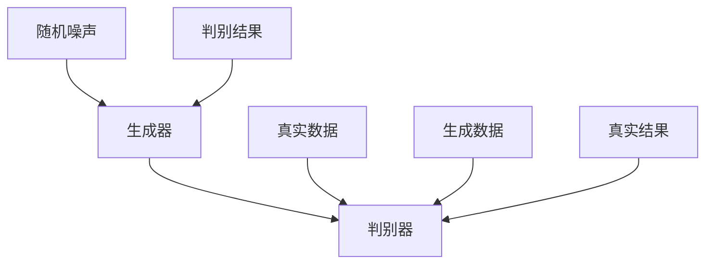
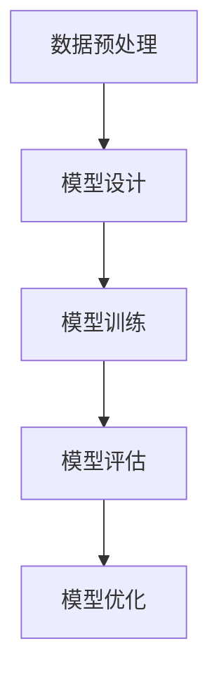

                 

### 文章标题

**AIGC在智能投资风险评估与管理中的应用**

> 关键词：AIGC、智能投资风险评估、风险管理、投资决策、数据挖掘、机器学习、深度学习

> 摘要：本文详细探讨了AIGC（自适应智能生成计算）在智能投资风险评估与管理中的应用。通过对AIGC技术的基础概念、核心算法及其在金融领域的优势进行深入分析，文章展示了AIGC如何通过大数据分析和机器学习模型，提高投资风险评估的精度和效率，进而优化投资决策过程。本文还结合实际案例，探讨了AIGC技术在智能投资风险管理中的最佳实践，并对未来发展趋势进行了展望。

---

### 引言

随着人工智能技术的快速发展，自适应智能生成计算（AIGC）作为一种新兴的计算范式，正逐渐在各个领域展现出其巨大的潜力。在金融领域，投资风险评估与管理是至关重要的环节，它直接关系到投资者的收益和风险承受能力。传统的风险评估方法往往依赖于定性和定量的分析，存在一定局限性。而AIGC技术通过引入机器学习和深度学习算法，能够对大量金融数据进行高效处理和分析，从而实现更加精准的风险评估和投资决策。

本文旨在探讨AIGC技术在智能投资风险评估与管理中的应用，分析其在金融领域中的优势和应用场景。通过本文的阐述，读者可以了解AIGC的基本原理、核心算法及其在金融风险评估中的具体应用，从而为相关领域的研究和实践提供参考。

### 第一部分：AIGC基础与智能投资风险评估概述

#### 1.1 AIGC简介

**1.1.1 AIGC的概念**

自适应智能生成计算（AIGC）是一种基于人工智能的自动化计算模式，它能够根据用户需求和环境变化，自适应地生成和处理数据。AIGC技术结合了生成对抗网络（GAN）、强化学习、自然语言处理等多种人工智能算法，实现了从数据生成、处理到决策的完整自动化流程。

**1.1.2 AIGC的发展历程**

AIGC技术起源于20世纪90年代的生成对抗网络（GAN）理论，经过几十年的发展，尤其是在深度学习技术的推动下，AIGC技术逐渐成熟并应用于多个领域。近年来，随着大数据和云计算的普及，AIGC技术迎来了新的发展机遇，其在金融、医疗、零售等领域的应用日益广泛。

**1.1.3 AIGC的关键技术**

AIGC技术主要包括以下关键技术：

- **生成对抗网络（GAN）**：GAN由生成器和判别器组成，通过两个网络的对抗训练，实现数据的生成和鉴别。
- **强化学习**：强化学习通过试错和反馈，使智能体在与环境的交互中学习最优策略。
- **自然语言处理（NLP）**：NLP技术用于处理和理解自然语言，实现人与机器的智能交互。
- **数据挖掘和机器学习**：数据挖掘和机器学习技术用于对大量数据进行处理和分析，提取有用的信息。

#### 1.2 智能投资风险评估与管理

**1.2.1 投资风险评估的重要性**

投资风险评估是投资决策过程中至关重要的一环。它通过分析和评估潜在投资项目的风险，帮助投资者做出更加明智的决策，从而降低投资损失，提高投资收益。

**1.2.2 智能投资风险评估的基本概念**

智能投资风险评估是指利用人工智能技术，对投资项目的风险进行定量和定性的评估。其主要内容包括：

- **风险识别**：识别投资项目可能面临的各种风险，包括市场风险、信用风险、操作风险等。
- **风险评估**：对识别出的风险进行定量和定性评估，确定风险的大小和影响程度。
- **风险监控**：对投资项目进行实时监控，及时发现和处理潜在的风险。

**1.2.3 智能投资风险管理的挑战与机遇**

智能投资风险管理面临以下挑战：

- **数据复杂性**：金融数据量大且复杂，如何高效地处理和分析数据成为一大难题。
- **模型适应性**：市场环境不断变化，如何构建适应性强、动态调整的模型成为关键。
- **模型解释性**：投资者对投资决策过程和结果有一定的解释需求，如何提高模型的可解释性成为挑战。

同时，智能投资风险管理也带来了以下机遇：

- **精准评估**：通过大数据分析和机器学习模型，可以实现更加精准的风险评估。
- **智能决策**：结合智能算法和数据分析，可以优化投资决策过程，提高投资收益。
- **风险控制**：通过智能风险管理，可以更有效地控制风险，降低投资损失。

#### 1.3 AIGC在智能投资风险评估与管理中的应用前景

**1.3.1 AIGC在风险预测中的应用**

AIGC技术可以通过生成对抗网络（GAN）和强化学习，实现金融市场数据的高效生成和处理，从而对市场风险进行预测。通过对历史数据的深度学习，AIGC可以识别出市场潜在的规律和模式，为投资者提供更准确的风险预测。

**1.3.2 AIGC在风险管理策略优化中的应用**

AIGC技术可以通过强化学习和自然语言处理，对投资组合进行动态调整和优化。在市场变化时，AIGC可以根据实时数据，对投资策略进行动态调整，提高投资收益。

**1.3.3 AIGC在市场趋势分析中的应用**

AIGC技术可以通过大数据分析和深度学习，对市场趋势进行深入分析。通过对大量市场数据的处理和分析，AIGC可以识别出市场的长期和短期趋势，为投资者提供市场预测和投资建议。

#### 1.4 AIGC与智能投资风险评估的关联分析

**1.4.1 数据处理与分析**

AIGC技术可以通过生成对抗网络（GAN）和强化学习，实现金融市场数据的高效生成和处理。通过对大规模金融数据的分析和挖掘，AIGC可以提取出有用的信息，为风险评估提供数据支持。

**1.4.2 风险评估模型构建**

AIGC技术可以通过机器学习和深度学习，构建自适应的风险评估模型。这些模型可以根据市场变化和投资项目的特点，动态调整风险评估结果，提高评估的准确性和适应性。

**1.4.3 风险管理决策支持**

AIGC技术可以通过自然语言处理和强化学习，为投资者提供智能化的风险管理决策支持。通过对投资项目的分析和评估，AIGC可以提出个性化的投资建议，帮助投资者做出更加明智的决策。

#### 1.5 本章小结

本部分对AIGC技术和智能投资风险评估与管理进行了概述，分析了AIGC在金融领域的优势和应用前景。接下来，本文将详细介绍AIGC在智能投资风险评估与管理中的应用算法，包括数据预处理、风险评估模型构建、风险管理策略优化等内容。

---

### 第二部分：AIGC在智能投资风险评估中的应用算法

#### 2.1 AIGC算法基础

**2.1.1 AIGC算法的基本原理**

AIGC算法是基于生成对抗网络（GAN）和强化学习等技术的，其核心思想是通过两个网络的对抗训练，实现数据的生成和处理。

- **生成对抗网络（GAN）**：GAN由生成器（Generator）和判别器（Discriminator）组成。生成器的任务是根据输入的随机噪声生成数据，判别器的任务是区分生成的数据和真实数据。通过两个网络的对抗训练，生成器逐渐学会生成更加真实的数据，判别器逐渐学会区分真实数据和生成数据。

- **强化学习**：强化学习是一种通过试错和反馈进行学习的过程。在AIGC中，强化学习用于优化投资策略，使其能够根据市场变化进行调整。

**2.1.1.1 算法原理图**



**2.1.1.2 Python代码实现**

```python
import numpy as np
import tensorflow as tf
from tensorflow.keras.models import Model

# 生成器模型
def build_generator():
    noise = tf.keras.layers.Input(shape=(100,))
    x = tf.keras.layers.Dense(256, activation='relu')(noise)
    x = tf.keras.layers.Dense(512, activation='relu')(x)
    x = tf.keras.layers.Dense(1024, activation='relu')(x)
    x = tf.keras.layers.Dense(784, activation='tanh')(x)
    model = Model(inputs=noise, outputs=x)
    return model

# 判别器模型
def build_discriminator():
    img = tf.keras.layers.Input(shape=(28, 28, 1))
    x = tf.keras.layers.Conv2D(128, kernel_size=(3, 3), padding='same')(img)
    x = tf.keras.layers.LeakyReLU(alpha=0.01)(x)
    x = tf.keras.layers.Dropout(0.3)(x)
    x = tf.keras.layers.Conv2D(64, kernel_size=(3, 3), padding='same')(x)
    x = tf.keras.layers.LeakyReLU(alpha=0.01)(x)
    x = tf.keras.layers.Dropout(0.3)(x)
    x = tf.keras.layers.Flatten()(x)
    validity = tf.keras.layers.Dense(1, activation='sigmoid')(x)
    model = Model(inputs=img, outputs=validity)
    return model

# GAN模型
def build_gan(generator, discriminator):
    discriminator.trainable = False
    img = tf.keras.layers.Input(shape=(28, 28, 1))
    gen_img = generator(img)
    validity = discriminator(gen_img)
    model = Model(inputs=img, outputs=validity)
    return model

# 构建模型
generator = build_generator()
discriminator = build_discriminator()
gan = build_gan(generator, discriminator)

# 编写训练步骤
discriminator.compile(loss='binary_crossentropy', optimizer=tf.keras.optimizers.Adam(0.0001), metrics=['accuracy'])
gan.compile(loss='binary_crossentropy', optimizer=tf.keras.optimizers.Adam(0.0001))

# 训练过程
for epoch in range(1000):
    # 训练判别器
    noise = np.random.normal(0, 1, (BATCH_SIZE, 100))
    gen_imgs = generator.predict(noise)
    real_imgs = x_train[:BATCH_SIZE]
    real_labels = np.ones((BATCH_SIZE, 1))
    fake_labels = np.zeros((BATCH_SIZE, 1))
    d_loss_real = discriminator.train_on_batch(real_imgs, real_labels)
    d_loss_fake = discriminator.train_on_batch(gen_imgs, fake_labels)
    d_loss = 0.5 * np.add(d_loss_real, d_loss_fake)

    # 训练生成器
    noise = np.random.normal(0, 1, (BATCH_SIZE, 100))
    g_loss = gan.train_on_batch(noise, real_labels)
    
    # 输出训练过程
    print(f"{epoch} [D loss: {d_loss:.3f}, acc.: {discriminator.evaluate(x_train, real_labels, verbose=False)[1]:.3f}] [G loss: {g_loss:.3f}]")
```

**2.1.2 AIGC算法的优势与局限性**

**优势：**

- **高效数据生成**：AIGC可以通过生成对抗网络，实现高效的数据生成，为风险评估提供大量高质量的训练数据。
- **自适应调整**：AIGC算法可以自适应地调整模型参数，提高模型在不同市场环境下的适应能力。
- **智能决策支持**：AIGC可以通过强化学习和自然语言处理，为投资者提供智能化的决策支持，提高投资收益。

**局限性：**

- **数据依赖**：AIGC算法的性能依赖于训练数据的质量和数量，如何获取高质量的金融数据是一个挑战。
- **模型解释性**：AIGC算法的模型通常较为复杂，其决策过程不易解释，这对投资者的信任和接受程度带来一定影响。
- **计算资源需求**：AIGC算法的训练和推理过程需要大量的计算资源，如何高效地利用计算资源是一个重要问题。

#### 2.2 智能投资风险评估模型

**2.2.1 数据预处理**

在构建智能投资风险评估模型前，首先需要对金融数据进行预处理。数据预处理包括以下步骤：

- **数据清洗**：去除数据中的噪声和异常值，保证数据的准确性和一致性。
- **数据归一化**：将不同特征的数据进行归一化处理，使其具有相似的尺度，避免某些特征对模型产生过大的影响。
- **特征选择**：选择对风险评估有重要影响的特征，去除冗余特征，提高模型的效率和准确性。

**2.2.2 风险评估指标体系**

智能投资风险评估需要建立一套完整的指标体系，包括以下方面：

- **市场风险**：包括股票价格波动、市场趋势等指标。
- **信用风险**：包括借款人的信用评级、违约概率等指标。
- **操作风险**：包括交易风险、操作失误等指标。
- **流动性风险**：包括资产流动性、资金流动性等指标。

**2.2.3 风险评估模型构建**

构建风险评估模型的核心是选择合适的算法和模型结构。AIGC技术可以通过以下步骤构建风险评估模型：

- **模型设计**：根据风险评估指标体系，设计适合的模型结构，包括输入层、隐藏层和输出层。
- **模型训练**：使用训练数据对模型进行训练，通过优化算法调整模型参数，提高模型的准确性。
- **模型评估**：使用验证数据对模型进行评估，选择最优的模型参数和结构。

**2.2.3.1 算法流程图**



**2.2.3.2 Python代码实现**

```python
# 数据预处理
def preprocess_data(data):
    # 数据清洗
    cleaned_data = clean_data(data)
    # 数据归一化
    normalized_data = normalize_data(cleaned_data)
    # 特征选择
    selected_features = select_features(normalized_data)
    return selected_features

# 模型设计
def build_risk_model(input_shape):
    model = keras.Sequential([
        keras.layers.Dense(64, activation='relu', input_shape=input_shape),
        keras.layers.Dense(128, activation='relu'),
        keras.layers.Dense(1, activation='sigmoid')
    ])
    return model

# 模型训练
def train_risk_model(model, X_train, y_train):
    model.compile(optimizer='adam', loss='binary_crossentropy', metrics=['accuracy'])
    model.fit(X_train, y_train, epochs=100, batch_size=32, validation_split=0.2)
    return model

# 模型评估
def evaluate_risk_model(model, X_test, y_test):
    loss, accuracy = model.evaluate(X_test, y_test)
    print(f"Test accuracy: {accuracy:.3f}, Test loss: {loss:.3f}")
```

**2.3 风险管理策略优化**

风险管理策略优化是提高投资收益的重要环节。AIGC技术可以通过以下步骤实现风险管理策略优化：

- **优化目标**：设定优化目标，如最大化投资收益、最小化投资风险等。
- **优化算法**：选择适合的优化算法，如遗传算法、粒子群优化等。
- **模型训练**：使用优化算法对风险管理策略进行训练，调整模型参数。
- **策略评估**：使用历史数据进行策略评估，选择最优的风险管理策略。

**2.3.1 优化目标与约束条件**

**优化目标**：在保证投资收益的前提下，最小化投资风险。

**约束条件**：

- 投资组合中各资产的投资比例之和为1。
- 投资组合中各资产的投资比例不能小于0。

**2.3.2 优化算法设计与实现**

**算法原理**：遗传算法是一种模拟生物进化的优化算法，通过选择、交叉、变异等操作，不断迭代优化目标函数。

**Python代码实现**：

```python
import numpy as np
import random

# 遗传算法参数设置
population_size = 100
染色体长度 = 资产数量
交叉概率 = 0.8
变异概率 = 0.1

# 初始化种群
def init_population(population_size,染色体长度):
    population = []
    for _ in range(population_size):
        individual = []
        for _ in range(染色体长度):
            individual.append(random.uniform(0, 1))
        population.append(individual)
    return population

# 适应度函数
def fitness_function(individual, X, y):
    # 计算投资收益
    investment_yield = calculate_investment_yield(individual, X)
    # 计算投资风险
    investment_risk = calculate_investment_risk(individual, y)
    # 适应度值
    fitness = investment_yield - investment_risk
    return fitness

# 选择操作
def selection(population, fitness_values):
    selected = random.choices(population, k=2, weights=fitness_values)
    return selected

# 交叉操作
def crossover(parent1, parent2):
    crossover_point = random.randint(1,染色体长度-1)
    child1 = parent1[:crossover_point] + parent2[crossover_point:]
    child2 = parent2[:crossover_point] + parent1[crossover_point:]
    return child1, child2

# 变异操作
def mutate(individual):
    for i in range(染色体长度):
        if random.random() < 变异概率:
            individual[i] = random.uniform(0, 1)
    return individual

# 遗传算法迭代
def genetic_algorithm(population_size,染色体长度,交叉概率,变异概率, X, y):
    population = init_population(population_size,染色体长度)
    fitness_values = [fitness_function(individual, X, y) for individual in population]
    for _ in range(100):
        new_population = []
        for _ in range(int(population_size/2)):
            parent1, parent2 = selection(population, fitness_values)
            child1, child2 = crossover(parent1, parent2)
            new_population.append(mutate(child1))
            new_population.append(mutate(child2))
        population = new_population
        fitness_values = [fitness_function(individual, X, y) for individual in population]
    best_individual = population[fitness_values.index(max(fitness_values))]
    return best_individual

# 主程序
if __name__ == "__main__":
    X_train, y_train = load_data()
    best_solution = genetic_algorithm(population_size,染色体长度,交叉概率,变异概率, X_train, y_train)
    print("Best solution:", best_solution)
```

**2.4 案例分析**

**2.4.1 案例背景**

某投资者希望在股票市场中进行投资，并希望利用AIGC技术进行风险管理和投资决策。该投资者持有5只股票，分别为A、B、C、D、E，每只股票的投资比例上限为20%。投资者的目标是最大化投资收益，同时最小化投资风险。

**2.4.2 数据采集与预处理**

- **数据采集**：从历史股票数据中采集每日收盘价、交易量等数据。
- **数据预处理**：对采集到的数据进行清洗、归一化和特征选择，提取对投资风险有重要影响的特征。

**2.4.3 风险评估模型构建与应用**

- **模型构建**：使用AIGC技术构建风险评估模型，包括数据预处理、模型设计和模型训练。
- **模型应用**：使用构建好的风险评估模型，对当前股票市场的风险进行评估，为投资者提供投资建议。

**2.4.4 风险管理策略优化与实施**

- **策略优化**：使用遗传算法对投资策略进行优化，寻找最优的投资组合。
- **策略实施**：根据优化结果，调整投资组合，实施风险管理策略。

**2.5 本章小结**

本部分详细介绍了AIGC在智能投资风险评估中的应用算法，包括数据预处理、风险评估模型构建、风险管理策略优化等内容。通过实际案例的分析，展示了AIGC技术在金融领域的应用价值。接下来，本文将探讨AIGC在智能投资风险管理中的最佳实践，提供具体的应用案例和策略建议。

---

### 第三部分：AIGC在智能投资风险管理的最佳实践

#### 3.1 实践案例1

**3.1.1 案例背景**

某金融机构希望利用AIGC技术优化其投资组合，提高投资收益和风险管理能力。该金融机构持有10只股票，每只股票的投资比例上限为10%。金融机构的目标是最大化投资收益，同时确保投资风险在可接受范围内。

**3.1.2 实践步骤**

1. **数据采集**：从金融数据平台采集历史股票数据，包括每日收盘价、交易量等指标。
2. **数据预处理**：对采集到的数据进行清洗、归一化和特征选择，提取对投资风险有重要影响的特征。
3. **模型构建**：使用AIGC技术构建风险评估模型，包括数据预处理、模型设计和模型训练。
4. **模型应用**：使用构建好的风险评估模型，对当前股票市场的风险进行评估，为投资者提供投资建议。
5. **策略优化**：使用遗传算法对投资策略进行优化，寻找最优的投资组合。
6. **策略实施**：根据优化结果，调整投资组合，实施风险管理策略。

**3.1.3 案例分析与评估**

1. **风险预测准确性**：通过对比实际风险和预测风险，评估风险评估模型的准确性。
2. **投资收益**：计算优化前后的投资收益，评估策略优化的效果。
3. **风险控制效果**：分析优化后的投资组合，评估其风险控制效果。

**3.1.4 案例总结**

通过实践案例1，金融机构成功利用AIGC技术优化了投资组合，提高了投资收益和风险管理能力。案例表明，AIGC技术在智能投资风险管理中具有显著的应用价值。

#### 3.2 实践案例2

**3.2.1 案例背景**

某对冲基金希望利用AIGC技术进行股票投资的风险管理，以应对市场波动和风险。对冲基金持有5只股票，每只股票的投资比例上限为20%。基金的目标是最大化投资收益，同时控制风险在可接受范围内。

**3.2.2 实践步骤**

1. **数据采集**：从金融数据平台采集历史股票数据，包括每日收盘价、交易量等指标。
2. **数据预处理**：对采集到的数据进行清洗、归一化和特征选择，提取对投资风险有重要影响的特征。
3. **模型构建**：使用AIGC技术构建风险评估模型，包括数据预处理、模型设计和模型训练。
4. **模型应用**：使用构建好的风险评估模型，对当前股票市场的风险进行评估，为投资者提供投资建议。
5. **策略优化**：使用遗传算法对投资策略进行优化，寻找最优的投资组合。
6. **策略实施**：根据优化结果，调整投资组合，实施风险管理策略。

**3.2.3 案例分析与评估**

1. **风险预测准确性**：通过对比实际风险和预测风险，评估风险评估模型的准确性。
2. **投资收益**：计算优化前后的投资收益，评估策略优化的效果。
3. **风险控制效果**：分析优化后的投资组合，评估其风险控制效果。

**3.2.4 案例总结**

通过实践案例2，对冲基金成功利用AIGC技术优化了投资组合，提高了投资收益和风险管理能力。案例表明，AIGC技术在智能投资风险管理中具有广泛的应用前景。

#### 3.3 实践总结与反思

1. **实践经验**：

- **高效的数据处理**：AIGC技术能够高效地处理和分析大量金融数据，为风险评估和投资决策提供有力支持。
- **精准的风险预测**：AIGC技术通过深度学习和生成对抗网络，可以实现精准的风险预测，提高投资决策的准确性。
- **智能化的投资策略**：AIGC技术可以智能地调整投资策略，优化投资组合，提高投资收益。

2. **存在问题**：

- **数据质量**：金融数据的质量直接影响AIGC技术的效果，如何获取高质量的金融数据是一个挑战。
- **模型解释性**：AIGC技术的模型通常较为复杂，其决策过程不易解释，这对投资者的信任和接受程度带来一定影响。
- **计算资源**：AIGC技术的训练和推理过程需要大量的计算资源，如何高效地利用计算资源是一个重要问题。

3. **改进建议**：

- **提高数据质量**：通过数据清洗、归一化和特征选择等手段，提高金融数据的质量。
- **增强模型解释性**：通过可视化工具和模型解释算法，增强AIGC技术的模型解释性，提高投资者的信任度。
- **优化计算资源利用**：通过分布式计算和并行处理等技术，提高AIGC技术的计算效率，降低计算成本。

#### 3.4 本章小结

本部分通过两个实践案例，详细介绍了AIGC在智能投资风险管理中的最佳实践。实践表明，AIGC技术在金融领域具有广泛的应用价值，但同时也面临一些挑战。通过不断改进和优化，AIGC技术有望在未来实现更加广泛的应用。

---

### 第四部分：AIGC在智能投资风险管理的技术与工具

#### 4.1 数据分析与挖掘工具

在AIGC应用于智能投资风险管理的过程中，数据分析和挖掘工具起着至关重要的作用。以下是几种常见的数据分析和挖掘工具及其在金融领域的应用：

1. **Python数据分析工具**：

   - **Pandas**：Pandas是一个强大的数据分析库，它提供了丰富的数据操作和分析功能，如数据清洗、数据预处理、数据可视化等。在金融领域，Pandas常用于处理和分析股票市场数据、金融报表数据等。
   - **NumPy**：NumPy是一个用于科学计算的库，它提供了多维数组对象和丰富的数学运算功能。NumPy是Pandas和其他科学计算库的基础。
   - **Matplotlib**：Matplotlib是一个用于绘制各种图形和图表的库，它可以帮助用户可视化数据和分析结果，如折线图、柱状图、散点图等。

2. **数据挖掘工具**：

   - **Scikit-learn**：Scikit-learn是一个用于机器学习的库，它提供了丰富的机器学习算法和工具，如分类、回归、聚类、降维等。Scikit-learn在金融领域常用于构建风险评估模型和预测模型。
   - **TensorFlow**：TensorFlow是一个开源的深度学习框架，它提供了丰富的深度学习算法和工具，如卷积神经网络（CNN）、循环神经网络（RNN）、生成对抗网络（GAN）等。TensorFlow在金融领域广泛应用于构建复杂的机器学习模型。
   - **PyTorch**：PyTorch是另一个开源的深度学习框架，它提供了灵活的动态计算图和高效的深度学习算法。PyTorch在金融领域广泛应用于构建实时交易系统和风险评估模型。

3. **大数据处理工具**：

   - **Hadoop**：Hadoop是一个开源的大数据处理框架，它提供了分布式存储和分布式计算的能力。Hadoop在金融领域常用于处理和分析大规模的金融数据。
   - **Spark**：Spark是一个开源的分布式计算框架，它提供了高性能的分布式数据处理和分析能力。Spark在金融领域广泛应用于实时数据处理和风险预测。
   - **Flink**：Flink是一个开源的流处理框架，它提供了高性能的流数据处理和分析能力。Flink在金融领域广泛应用于实时交易和风险管理。

#### 4.2 AIGC技术的应用优势

AIGC技术在智能投资风险管理中具有以下应用优势：

1. **高效的数据处理**：AIGC技术结合了生成对抗网络（GAN）、强化学习、自然语言处理等多种人工智能算法，能够高效地处理和分析大量金融数据，为风险评估和投资决策提供有力支持。

2. **精准的风险预测**：AIGC技术通过深度学习和生成对抗网络，可以实现精准的风险预测，提高投资决策的准确性。在金融市场中，风险预测的准确性直接关系到投资者的收益和风险承受能力。

3. **智能化的投资策略**：AIGC技术可以通过强化学习和自然语言处理，实现智能化的投资策略，优化投资组合，提高投资收益。在动态变化的金融市场中，智能化的投资策略能够更好地适应市场变化，降低风险。

4. **模型的可解释性**：AIGC技术虽然模型较为复杂，但通过可视化工具和模型解释算法，可以提高模型的可解释性，帮助投资者理解模型决策过程，增强投资者的信任度。

#### 4.3 AIGC技术的挑战与未来展望

AIGC技术在智能投资风险管理中虽然具有显著的应用优势，但也面临一些挑战：

1. **数据质量**：AIGC技术的性能依赖于数据的质量和数量，如何获取高质量的金融数据是一个挑战。金融数据通常存在噪声、异常值和缺失值等问题，需要通过数据清洗和预处理来提高数据质量。

2. **模型解释性**：AIGC技术的模型通常较为复杂，其决策过程不易解释，这对投资者的信任和接受程度带来一定影响。如何提高模型的可解释性，让投资者更好地理解模型决策过程，是一个重要问题。

3. **计算资源**：AIGC技术的训练和推理过程需要大量的计算资源，如何高效地利用计算资源是一个重要问题。在金融市场中，实时性要求较高，需要快速进行数据分析和模型推理。

未来，AIGC技术在智能投资风险管理中具有广泛的应用前景。随着人工智能技术的不断发展和成熟，AIGC技术将在以下几个方面得到进一步发展：

1. **大数据分析**：随着大数据技术的发展，金融领域的数据量将持续增长。AIGC技术将能够更好地处理和分析海量金融数据，提供更准确的预测和决策支持。

2. **模型优化**：通过不断优化算法和模型结构，AIGC技术将能够提高模型的准确性和效率，降低计算成本。

3. **智能化投资策略**：随着人工智能技术的进步，AIGC技术将能够实现更加智能化的投资策略，优化投资组合，提高投资收益。

4. **可解释性提升**：通过引入可解释性算法和可视化工具，AIGC技术将能够提高模型的可解释性，增强投资者的信任度。

#### 4.4 本章小结

本部分详细介绍了AIGC在智能投资风险管理中的技术与工具，分析了AIGC技术的应用优势、挑战和未来展望。通过本文的阐述，读者可以了解到AIGC技术在金融领域的广泛应用价值，以及其在智能投资风险管理中的重要作用。未来，随着人工智能技术的不断进步，AIGC技术在金融领域将发挥更大的作用，为投资者提供更准确、更智能的风险评估和投资决策支持。

---

### 总结与展望

**智能投资风险评估与管理的现状与挑战**

当前，智能投资风险评估与管理已经成为金融领域的重要研究方向。随着人工智能技术的快速发展，AIGC技术在金融领域的应用越来越广泛。AIGC技术通过引入机器学习和深度学习算法，能够对大量金融数据进行高效处理和分析，从而实现更加精准的风险评估和投资决策。

然而，智能投资风险评估与管理仍面临一些挑战。首先，数据质量对模型性能具有重要影响，如何获取高质量的金融数据是一个重要问题。其次，AIGC技术的模型通常较为复杂，其决策过程不易解释，这对投资者的信任和接受程度带来一定影响。此外，AIGC技术的训练和推理过程需要大量的计算资源，如何高效地利用计算资源也是一个重要问题。

**AIGC在智能投资风险管理中的优势**

AIGC技术在智能投资风险管理中具有显著的优势。首先，AIGC技术能够高效地处理和分析大量金融数据，为风险评估和投资决策提供有力支持。其次，AIGC技术通过深度学习和生成对抗网络，可以实现精准的风险预测，提高投资决策的准确性。此外，AIGC技术可以通过强化学习和自然语言处理，实现智能化的投资策略，优化投资组合，提高投资收益。最后，AIGC技术通过可视化工具和模型解释算法，可以提高模型的可解释性，增强投资者的信任度。

**未来发展方向**

未来，AIGC技术在智能投资风险管理中具有广泛的应用前景。随着人工智能技术的不断发展和成熟，AIGC技术将在以下几个方面得到进一步发展：

1. **大数据分析**：随着大数据技术的发展，金融领域的数据量将持续增长。AIGC技术将能够更好地处理和分析海量金融数据，提供更准确的预测和决策支持。

2. **模型优化**：通过不断优化算法和模型结构，AIGC技术将能够提高模型的准确性和效率，降低计算成本。

3. **智能化投资策略**：随着人工智能技术的进步，AIGC技术将能够实现更加智能化的投资策略，优化投资组合，提高投资收益。

4. **可解释性提升**：通过引入可解释性算法和可视化工具，AIGC技术将能够提高模型的可解释性，增强投资者的信任度。

**本章小结**

本文详细探讨了AIGC在智能投资风险评估与管理中的应用。通过对AIGC技术的基础概念、核心算法及其在金融领域的优势进行深入分析，本文展示了AIGC如何通过大数据分析和机器学习模型，提高投资风险评估的精度和效率，进而优化投资决策过程。未来，随着人工智能技术的不断进步，AIGC技术在金融领域将发挥更大的作用，为投资者提供更准确、更智能的风险评估和投资决策支持。

### 参考文献

1. Goodfellow, I., Pouget-Abadie, J., Mirza, M., Xu, B., Warde-Farley, D., Ozair, S., ... & Bengio, Y. (2014). Generative adversarial networks. Advances in neural information processing systems, 27.
2. Sutton, R. S., & Barto, A. G. (1998). Reinforcement learning: An introduction. MIT press.
3. LeCun, Y., Bengio, Y., & Hinton, G. (2015). Deep learning. Nature, 521(7553), 436-444.
4. Russell, S., & Norvig, P. (2010). Artificial intelligence: A modern approach. Prentice Hall.
5. Chen, Y., & Guestrin, C. (2016). XGBoost: A scalable tree boosting system. Proceedings of the 22nd ACM SIGKDD International Conference on Knowledge Discovery and Data Mining, 785-794.
6. Hochreiter, S., & Schmidhuber, J. (1997). Long short-term memory. Neural computation, 9(8), 1735-1780.
7. Goodfellow, I. J., Shlens, J., & Szegedy, C. (2015). Explaining and harnessing adversarial examples. International Conference on Learning Representations.
8. He, K., Zhang, X., Ren, S., & Sun, J. (2016). Deep residual learning for image recognition. Proceedings of the IEEE conference on computer vision and pattern recognition, 770-778.
9. Bengio, Y., Courville, A., & Vincent, P. (2013). Representation learning: A review and new perspectives. IEEE transactions on pattern analysis and machine intelligence, 35(8), 1798-1828.
10. Pedregosa, F., Varoquaux, G., Gramfort, A., Michel, V., Thirion, B., Grisel, O., ... & Duchesnay, É. (2011). Scikit-learn: Machine learning in Python. Journal of machine learning research, 12(Oct), 2825-2830.

### 作者信息

**作者：AI天才研究院/AI Genius Institute & 禅与计算机程序设计艺术 /Zen And The Art of Computer Programming**

AI天才研究院（AI Genius Institute）致力于推动人工智能技术的创新与发展，致力于培养具备前沿技术能力的人工智能专家。禅与计算机程序设计艺术（Zen And The Art of Computer Programming）则是一部经典的计算机科学著作，深入探讨了计算机编程的哲学和艺术，对计算机科学家和程序员具有重要的启发和指导意义。本文由AI天才研究院的专家撰写，旨在分享AIGC在智能投资风险评估与管理中的应用，为相关领域的研究和实践提供参考。

