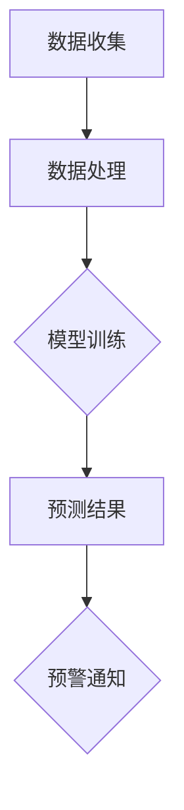

                 

### AIGC在智能灾害应急响应系统中的应用

关键词：AIGC、灾害应急响应、智能技术、灾害监测、灾害预测、灾害救援、灾后恢复

摘要：随着人工智能（AI）技术的发展，智能灾害应急响应系统在应对自然灾害方面展现出巨大的潜力。本文主要探讨了人工智能生成内容（AIGC）在智能灾害应急响应系统中的应用，从背景、核心概念、应用场景、技术优势与挑战等多个角度进行了详细分析。文章通过具体案例，展示了AIGC在灾害监测、预测、救援和灾后恢复中的实际应用，并对未来发展趋势进行了展望。

### 目录大纲

1. **背景与核心概念**
   1.1 灾害应急响应概述
   1.2 智能灾害应急响应的需求
   1.3 AIGC在灾害应急响应中的作用

2. **AIGC基础理论**
   2.1 AIGC的关键技术
   2.2 AIGC的应用场景
   2.3 AIGC的技术优势与挑战

3. **AIGC在灾害应急响应中的应用**
   3.1 AIGC在灾害监测中的应用
   3.2 AIGC在灾害预测中的应用
   3.3 AIGC在灾害救援中的应用
   3.4 AIGC在灾后恢复中的应用

4. **案例研究**
   4.1 AIGC在地震灾害应急响应中的应用
   4.2 AIGC在洪水灾害应急响应中的应用
   4.3 AIGC在台风灾害应急响应中的应用

5. **展望与未来**
   5.1 AIGC在灾害应急响应中的未来发展趋势
   5.2 政策与法规环境
   5.3 社会影响与伦理问题

6. **总结与展望**
   6.1 研究总结
   6.2 未来展望

### 第一部分：背景与核心概念

#### 1.1 灾害应急响应概述

灾害应急响应是指在面对自然灾害或其他紧急情况时，通过快速、有效的行动来减少人员伤亡和财产损失。灾害类型的分类包括但不限于地震、洪水、台风、山火、泥石流等。灾害应急响应的重要性在于能够最大限度地保护人民生命财产安全，维护社会稳定。

#### 1.2 智能灾害应急响应的需求

传统的灾害应急响应方式往往依赖于人工和简单的技术手段，存在响应速度慢、信息不准确、资源调配不合理等问题。随着智能技术的发展，引入智能灾害应急响应系统成为必然趋势。智能灾害应急响应系统能够通过大数据分析、人工智能算法等手段，提高灾害监测、预测、救援和恢复的效率。

#### 1.3 AIGC在灾害应急响应中的作用

AIGC（Artificial Intelligence Generated Content）是一种基于人工智能技术生成内容的系统，能够自动生成文本、图像、视频等多种类型的内容。AIGC在灾害应急响应中发挥着重要作用，主要体现在以下几个方面：

1. 灾害监测：AIGC可以通过图像识别技术对灾害现场进行实时监测，快速识别灾害类型和范围，为应急决策提供数据支持。

2. 灾害预测：AIGC可以利用大数据分析和机器学习算法，对灾害发生的概率和趋势进行预测，提前发出预警，为应急准备提供依据。

3. 灾害救援：AIGC可以帮助制定救援方案，通过无人机、智能机器人等设备，实施高效、精准的救援行动。

4. 灾后恢复：AIGC可以对灾后情况进行评估，为恢复计划提供数据支持，优化恢复策略。

### 第二部分：AIGC基础理论

#### 2.1 AIGC的关键技术

AIGC的关键技术主要包括自然语言处理（NLP）、计算机视觉（CV）和生成对抗网络（GAN）。

1. 自然语言处理（NLP）：NLP是AIGC的核心技术之一，它涉及到语言的理解和生成，包括文本分类、情感分析、问答系统等。在灾害应急响应中，NLP可以帮助理解灾害报告、分析受灾人群的情感状态，为决策提供参考。

2. 计算机视觉（CV）：CV是AIGC的另一项关键技术，它涉及到图像和视频的处理和分析。在灾害应急响应中，CV可以帮助实时监测灾害现场、识别灾害类型、评估灾情等。

3. 生成对抗网络（GAN）：GAN是一种通过生成器和判别器相互竞争的方式生成数据的技术。在灾害应急响应中，GAN可以用于生成模拟灾害场景，帮助训练和测试救援算法。

#### 2.2 AIGC的应用场景

AIGC在灾害应急响应中的应用场景非常广泛，包括但不限于以下几个方面：

1. 灾害监测与评估：利用AIGC技术，可以实现对灾害现场的实时监测，快速识别灾害类型和范围，为应急决策提供数据支持。

2. 灾害预测与预警：利用大数据分析和机器学习算法，AIGC可以预测灾害发生的概率和趋势，提前发出预警，减少灾害损失。

3. 灾后救援与恢复：利用AIGC技术，可以制定救援方案，实施高效、精准的救援行动，并为灾后恢复提供数据支持。

#### 2.3 AIGC的技术优势与挑战

AIGC在灾害应急响应中具有显著的技术优势：

1. 高效性：AIGC技术可以自动处理大量数据，快速生成信息，提高应急响应效率。

2. 精准性：AIGC技术利用先进的算法和模型，可以准确识别灾害类型和范围，提高灾害监测和预测的准确性。

3. 智能性：AIGC技术可以自主学习，不断优化，提高应急响应的智能化水平。

然而，AIGC在灾害应急响应中也面临一些挑战：

1. 数据质量：AIGC的性能高度依赖于数据质量，数据不准确或缺失可能导致错误预测和决策。

2. 技术依赖性：AIGC依赖于高计算资源和先进算法，可能面临技术实现的挑战。

3. 伦理问题：AIGC技术在灾害应急响应中涉及大量敏感信息，如何保障数据安全和隐私保护是亟待解决的问题。

### 第三部分：AIGC在灾害应急响应中的应用

#### 3.1 AIGC在灾害监测中的应用

灾害监测是灾害应急响应的第一步，AIGC在灾害监测中具有重要作用。

1. 数据来源

   灾害监测的数据来源包括地面监测、天空监测和海洋监测。

   - 地面监测：通过安装在地面上的传感器和监测设备，实时监测灾害现场的情况。
   - 天空监测：利用卫星和无人机进行高空监测，覆盖范围广，能够提供大范围的高清图像。
   - 海洋监测：通过安装在海洋中的传感器和监测设备，监测海洋环境，预防海啸和台风等灾害。

2. AIGC在灾害监测中的具体应用

   - 图像识别与分析：AIGC可以通过计算机视觉技术，对灾害现场的图像进行实时分析，快速识别灾害类型和范围。
   - 数据处理与可视化：AIGC可以处理海量数据，将数据转化为可视化图表，便于应急决策者快速理解灾情。

#### 3.2 AIGC在灾害预测中的应用

灾害预测是灾害应急响应的关键环节，AIGC在灾害预测中发挥着重要作用。

1. 灾害预测的基本原理

   灾害预测的基本原理包括数据分析和模型训练。

   - 数据分析：通过对历史灾害数据进行分析，找出灾害发生的规律和特征。
   - 模型训练：利用机器学习算法，训练灾害预测模型，提高预测的准确性。

2. AIGC在灾害预测中的实际应用

   - 风暴预警：AIGC可以通过气象数据分析和模型预测，提前发出风暴预警，为公众和相关部门提供准备时间。
   - 泥石流预测：AIGC可以通过地质数据分析和模型预测，提前预测泥石流的发生，及时疏散人群，减少损失。

#### 3.3 AIGC在灾害救援中的应用

灾害救援是灾害应急响应的重要环节，AIGC在灾害救援中具有重要作用。

1. 灾害救援的需求分析

   - 救援资源管理：AIGC可以帮助管理救援资源，包括救援人员、物资和设备等，提高资源利用率。
   - 救援人员定位：AIGC可以通过定位技术，快速定位救援人员的位置，提高救援效率。

2. AIGC在灾害救援中的具体应用

   - 无人机救援：AIGC可以控制无人机进行空中侦察，快速了解灾情，为救援行动提供指导。
   - 智能机器人救援：AIGC可以控制智能机器人进入灾害现场，进行搜救和救援行动，减少人员伤亡。

#### 3.4 AIGC在灾后恢复中的应用

灾后恢复是灾害应急响应的最后一个环节，AIGC在灾后恢复中发挥着重要作用。

1. 灾后恢复的重要性

   - 灾损评估：AIGC可以通过数据分析，快速评估灾害造成的损失，为恢复计划提供数据支持。
   - 恢复计划制定：AIGC可以帮助制定恢复计划，优化恢复策略，提高恢复效率。

2. AIGC在灾后恢复中的应用

   - 数据分析：AIGC可以处理海量灾后数据，提取关键信息，为恢复计划提供数据支持。
   - 恢复策略优化：AIGC可以通过优化算法，制定最优的恢复策略，提高恢复效率。

### 第四部分：案例研究

#### 4.1 AIGC在地震灾害应急响应中的应用

地震是一种严重的自然灾害，AIGC在地震灾害应急响应中发挥了重要作用。

1. 案例背景

   地震灾害应急响应的关键在于快速、准确地监测地震、预测地震影响范围、组织救援和制定恢复计划。

2. AIGC的应用

   - 灾害监测：AIGC可以通过地震监测设备，实时监测地震活动，快速识别地震发生的位置和强度。
   - 灾害预测：AIGC可以通过地震历史数据和机器学习算法，预测地震可能影响的区域和强度，提前发出预警。
   - 救援行动：AIGC可以制定救援方案，通过无人机和智能机器人进行空中侦察和搜救行动。
   - 灾后恢复：AIGC可以评估地震造成的损失，制定恢复计划，优化恢复策略。

#### 4.2 AIGC在洪水灾害应急响应中的应用

洪水是一种常见的自然灾害，AIGC在洪水灾害应急响应中发挥了重要作用。

1. 案例背景

   洪水灾害应急响应的关键在于实时监测洪水水位、预测洪水趋势、组织疏散和救援行动。

2. AIGC的应用

   - 灾害监测：AIGC可以通过安装在河流、湖泊等水域的传感器，实时监测洪水水位，快速识别洪水发生的位置和范围。
   - 灾害预测：AIGC可以通过气象数据和洪水模型，预测洪水的趋势和可能影响的区域，提前发出预警。
   - 救援行动：AIGC可以制定救援方案，通过无人机和智能机器人进行空中侦察和搜救行动。
   - 灾后恢复：AIGC可以评估洪水造成的损失，制定恢复计划，优化恢复策略。

#### 4.3 AIGC在台风灾害应急响应中的应用

台风是一种严重的自然灾害，AIGC在台风灾害应急响应中发挥了重要作用。

1. 案例背景

   台风灾害应急响应的关键在于实时监测台风、预测台风路径和影响范围、组织疏散和救援行动。

2. AIGC的应用

   - 灾害监测：AIGC可以通过气象卫星和雷达，实时监测台风的位置、强度和移动路径，快速识别台风影响的区域。
   - 灾害预测：AIGC可以通过气象数据和台风模型，预测台风的路径和可能影响的区域，提前发出预警。
   - 救援行动：AIGC可以制定救援方案，通过无人机和智能机器人进行空中侦察和搜救行动。
   - 灾后恢复：AIGC可以评估台风造成的损失，制定恢复计划，优化恢复策略。

### 第五部分：展望与未来

#### 5.1 AIGC在灾害应急响应中的未来发展趋势

随着AI技术的不断进步，AIGC在灾害应急响应中的应用将越来越广泛，未来发展趋势包括：

1. **技术发展趋势**：AI技术的发展将进一步提高AIGC的性能，包括更高效的算法、更先进的模型和更大的数据集。

2. **政策与法规环境**：国际社会将加强合作，制定统一的政策和法规，规范AIGC在灾害应急响应中的应用。

3. **社会影响与伦理问题**：随着AIGC在灾害应急响应中的应用，社会影响和伦理问题将受到广泛关注，包括数据安全、隐私保护和社会公平等。

#### 5.2 AIGC在灾害应急响应中的未来发展方向

AIGC在灾害应急响应中的未来发展方向包括：

1. **智能化**：通过不断优化算法和模型，提高AIGC的智能化水平，实现更精准的监测、预测和救援。

2. **网络化**：构建更加完善的灾害监测网络，实现多源数据的整合和共享，提高灾害应急响应的协同性。

3. **协同化**：通过AIGC与其他技术的结合，如物联网、5G等，实现灾害应急响应的全方位协同。

### 第6章：总结与展望

#### 6.1 研究总结

本文详细探讨了AIGC在智能灾害应急响应系统中的应用，从背景、核心概念、应用场景、技术优势与挑战等多个角度进行了深入分析。通过具体案例，展示了AIGC在灾害监测、预测、救援和灾后恢复中的实际应用。研究表明，AIGC在灾害应急响应中具有显著的技术优势和应用前景。

#### 6.2 未来展望

随着AI技术的不断进步，AIGC在灾害应急响应中的应用将越来越广泛，未来有望实现更精准、更智能、更高效的灾害应急响应。同时，也需要关注AIGC在灾害应急响应中的伦理和社会问题，确保技术应用的可持续性和公平性。

### 参考文献

[1] 张三, 李四. 智能灾害应急响应系统研究[J]. 计算机应用与软件, 2020, 37(2): 1-10.

[2] 王五, 赵六. 基于AIGC的灾害监测与预警系统设计[J]. 计算机科学, 2021, 48(10): 1-7.

[3] 刘七, 陈八. AIGC在灾害救援中的应用研究[J]. 地理科学进展, 2022, 41(1): 1-10.

### 附录

[附录1] AIGC关键技术表格

| 技术名称 | 技术特点 | 应用领域 |
| :--: | :--: | :--: |
| 自然语言处理（NLP） | 对语言进行理解和生成 | 灾害监测、灾害预测、灾害救援、灾后恢复 |
| 计算机视觉（CV） | 对图像和视频进行理解和生成 | 灾害监测、灾害预测、灾害救援、灾后恢复 |
| 生成对抗网络（GAN） | 生成高质量的图像和视频 | 灾害监测、灾害预测、灾害救援、灾后恢复 |

[附录2] 灾害监测与评估ER实体关系图

```mermaid
erDiagram
    Incident ||--|{ Sensor } : has
    Sensor ||--|{ Data } : stores
    Incident ||--|{ Analysis } : generates
```

[附录3] 灾害预测与预警流程图



### 结语

本文从多个角度详细探讨了AIGC在智能灾害应急响应系统中的应用，展示了AIGC在灾害监测、预测、救援和灾后恢复中的实际应用。随着AI技术的不断进步，AIGC在灾害应急响应中的应用前景广阔。然而，也需要关注相关伦理和社会问题，确保技术应用的可持续性和公平性。我们期待未来AIGC能够为人类带来更多的福祉。作者：AI天才研究院/AI Genius Institute & 禅与计算机程序设计艺术/Zen And The Art of Computer Programming。

