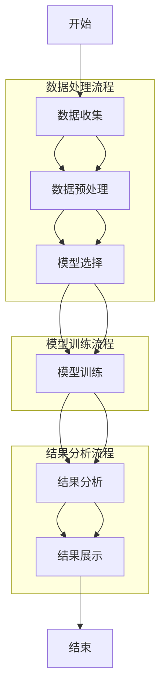
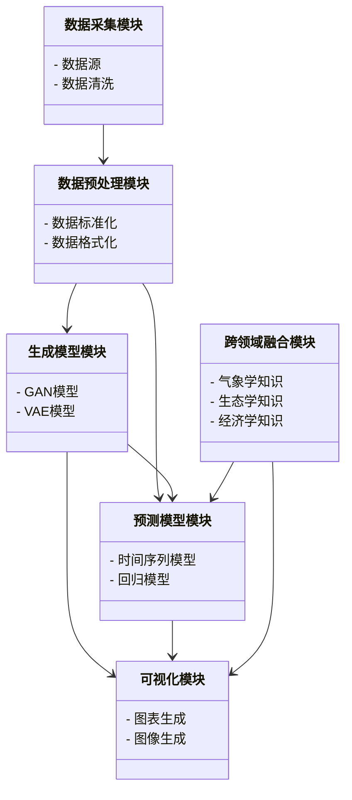
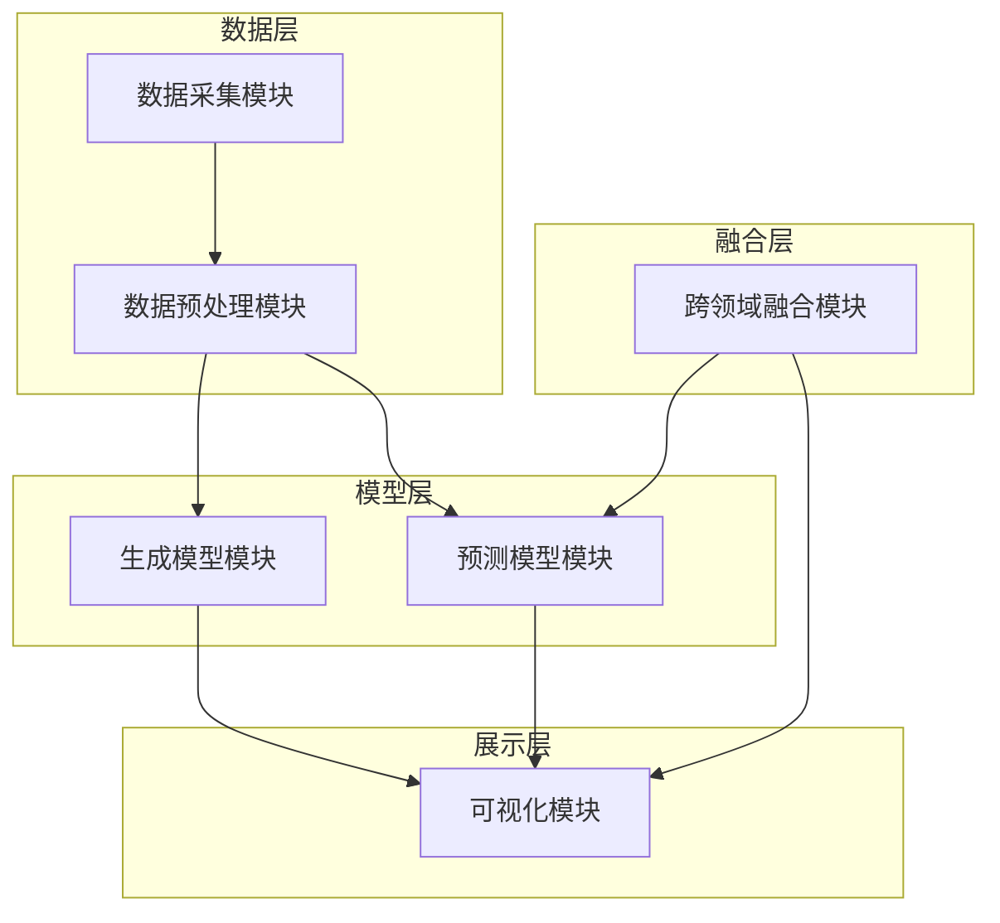
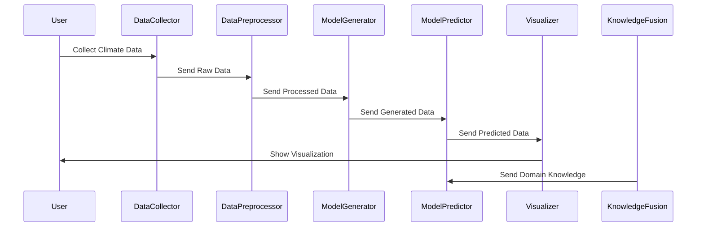

                 

## 目录大纲

----------------------------------------------------------------

# AIGC在气候变化研究中的应用：环境数据解释提示词

> 关键词：AIGC、气候变化、环境数据、自然语言处理、生成对抗网络、变分自编码器、数据处理、算法模型、预测模型

> 摘要：本文探讨了人工智能生成内容（AIGC）技术在气候变化研究中的应用。通过对AIGC技术的基本原理、核心概念与联系、算法原理讲解、数学模型和数学公式、系统分析与架构设计、项目实战以及最佳实践等方面的详细分析，本文旨在为研究人员和从业者提供有价值的参考，帮助他们在气候变化研究中更好地利用AIGC技术。

## 第一部分：AIGC技术概述

## 1.1 AIGC技术的基本概念与原理

### 1.1.1 AIGC技术的发展背景

### 1.1.2 AIGC技术的基本原理

### 1.1.3 AIGC技术的核心优势

## 1.2 AIGC技术的主要类型及应用领域

### 1.2.1 自然语言处理（NLP）

### 1.2.2 生成对抗网络（GAN）

### 1.2.3 变分自编码器（VAE）

### 1.2.4 AIGC技术在其他领域的应用

## 1.3 AIGC技术在气候变化研究中的重要性

### 1.3.1 气候变化研究的需求

### 1.3.2 AIGC技术在气候变化研究中的应用前景

### 1.3.3 AIGC技术在气候变化研究中的挑战

## 1.4 本章小结

--------------------------------------------------

----------------------------------------------------------------

## 第二部分：核心概念与联系

## 2.1 核心概念原理

### 2.1.1 自然语言处理（NLP）

### 2.1.2 生成对抗网络（GAN）

### 2.1.3 变分自编码器（VAE）

## 2.2 概念属性特征对比表格

### 2.2.1 AIGC技术与传统数据分析方法的对比

## 2.3 ER实体关系图架构

### 2.3.1 AIGC技术在气候变化研究中的实体及其关系

## 2.4 本章小结

--------------------------------------------------

----------------------------------------------------------------

## 第三部分：算法原理讲解

## 3.1 算法mermaid流程图

### 3.1.1 数据处理流程

### 3.1.2 模型训练流程

### 3.1.3 结果分析流程

## 3.2 Python源代码

### 3.2.1 数据预处理代码

### 3.2.2 模型训练代码

### 3.2.3 结果分析代码

## 3.3 数学模型和数学公式

### 3.3.1 损失函数

### 3.3.2 优化算法

## 3.4 详细讲解和举例说明

### 3.4.1 数据预处理举例

### 3.4.2 模型训练举例

### 3.4.3 结果分析举例

## 3.5 本章小结

--------------------------------------------------

----------------------------------------------------------------

## 第四部分：系统分析与架构设计方案

## 4.1 问题场景介绍

### 4.1.1 气候变化研究背景

### 4.1.2 AIGC技术需求分析

## 4.2 项目介绍

### 4.2.1 项目概述

### 4.2.2 项目目标

## 4.3 系统功能设计（领域模型mermaid类图）

### 4.3.1 系统功能模块

### 4.3.2 功能模块关系

## 4.4 系统架构设计（mermaid架构图）

### 4.4.1 系统总体架构

### 4.4.2 模块间关系

## 4.5 系统接口设计（系统交互mermaid序列图）

### 4.5.1 数据接口设计

### 4.5.2 控制接口设计

## 4.6 本章小结

--------------------------------------------------

----------------------------------------------------------------

## 第五部分：项目实战

## 5.1 环境安装

### 5.1.1 硬件环境配置

### 5.1.2 软件环境安装

## 5.2 系统核心实现源代码

### 5.2.1 数据预处理代码

### 5.2.2 模型训练代码

### 5.2.3 结果分析代码

## 5.3 代码应用解读与分析

### 5.3.1 数据预处理解读

### 5.3.2 模型训练解读

### 5.3.3 结果分析解读

## 5.4 实际案例分析和详细讲解剖析

### 5.4.1 案例分析

### 5.4.2 案例讲解

### 5.4.3 案例剖析

## 5.5 项目小结

### 5.5.1 项目收获

### 5.5.2 经验总结

--------------------------------------------------

----------------------------------------------------------------

## 第六部分：最佳实践 tips、小结、注意事项、拓展阅读等内容

## 6.1 最佳实践 tips

### 6.1.1 数据预处理建议

### 6.1.2 模型训练技巧

### 6.1.3 结果分析策略

## 6.2 小结

### 6.2.1 文章总结

### 6.2.2 主要观点回顾

## 6.3 注意事项

### 6.3.1 技术应用风险

### 6.3.2 数据安全和隐私保护

## 6.4 拓展阅读

### 6.4.1 相关书籍推荐

### 6.4.2 学术论文推荐

### 6.4.3 技术博客推荐

----------------------------------------------------------------## 1.1 AIGC技术的基本概念与原理

### 1.1.1 AIGC技术的发展背景

人工智能生成内容（AIGC）技术是近年来人工智能（AI）领域的一个重要分支，其发展背景可以追溯到自然语言处理（NLP）、计算机视觉和深度学习等技术的不断进步。随着互联网和大数据的快速发展，人们对于生成内容的需求日益增加，尤其是在新闻报道、社交媒体、广告营销等应用场景中。传统的手动内容创作方式已经无法满足快速生成大量高质量内容的需求，因此，研究者们开始探索通过机器学习算法自动生成文本、图像、音频等多种形式的内容。

AIGC技术的概念最早可以追溯到2014年，当时研究人员提出了生成对抗网络（GAN）这一创新性模型，用于生成逼真的图像。随后，随着NLP技术的不断发展，研究者们开始尝试将GAN等生成模型应用于文本生成，从而诞生了AIGC技术。AIGC技术的研究和应用逐渐受到学术界和工业界的广泛关注，其发展历程可以分为以下几个阶段：

- **初步探索阶段（2014-2016年）**：在这一阶段，GAN等生成模型首次被应用于图像生成，随后逐渐扩展到音频、视频等领域。同时，NLP领域的预训练模型（如Word2Vec、GloVe等）也开始应用于文本生成。

- **快速发展阶段（2017-2019年）**：随着深度学习技术的突破，生成模型（如VAE、BERT等）在性能和稳定性方面得到了显著提升。这一阶段，AIGC技术在各个应用领域得到了广泛的研究和应用。

- **应用拓展阶段（2020年至今）**：AIGC技术在各个领域的应用不断拓展，特别是在新闻写作、内容创作、虚拟现实等场景中，AIGC技术展现了巨大的潜力。同时，随着模型的不断优化和算法的创新，AIGC技术的生成质量和效率也得到了显著提升。

### 1.1.2 AIGC技术的基本原理

AIGC技术的基本原理主要基于生成模型和判别模型的互动。生成模型负责生成新的内容，而判别模型负责判断生成内容是否真实。通过这种对抗关系，生成模型不断优化生成策略，以产生更加真实、高质量的内容。以下是一些核心概念：

- **生成模型**：生成模型是AIGC技术的核心组成部分，常见的生成模型包括生成对抗网络（GAN）、变分自编码器（VAE）等。生成模型通过学习输入数据的分布，生成具有相似分布的新内容。

- **判别模型**：判别模型用于判断生成内容是否真实。在GAN中，判别模型通常是一个二分类器，其任务是区分真实内容和生成内容。在VAE中，判别模型通常被替代为似然估计。

- **对抗训练**：生成模型和判别模型通过对抗训练不断优化。生成模型的目标是生成尽可能真实的内容，以欺骗判别模型，而判别模型的目标是提高对真实内容和生成内容的辨别能力。

- **解码器与编码器**：在VAE中，生成模型由编码器和解码器组成。编码器将输入数据编码为一个潜在空间中的向量，解码器则从潜在空间中生成新内容。

### 1.1.3 AIGC技术的核心优势

AIGC技术在气候变化研究中的应用具有以下几个核心优势：

- **高效的内容生成**：AIGC技术能够快速生成大量的环境数据解释提示词，这些提示词可以辅助研究人员理解和分析复杂的气候数据。

- **自适应的数据分析**：AIGC技术可以根据研究需求自适应地调整生成内容和解释策略，从而更好地满足不同研究领域的需求。

- **提升研究效率**：通过自动化生成内容，AIGC技术可以显著降低研究人员在数据预处理、模型训练和结果分析等环节的工作量，提升整体研究效率。

- **跨领域的知识融合**：AIGC技术可以将来自不同领域的知识融合到气候数据解释中，从而提供更加全面和深入的分析。

- **实时更新与优化**：AIGC技术可以根据新的数据和研究成果实时更新生成内容和解释模型，从而保持研究的前沿性和准确性。

### 1.1.4 AIGC技术在气候变化研究中的应用场景

AIGC技术在气候变化研究中的应用场景主要包括以下几个方面：

- **环境数据解释**：AIGC技术可以生成与环境数据相关的提示词，帮助研究人员更好地理解和解释复杂的环境数据，例如气候模型的输出结果、卫星遥感数据等。

- **预测模型生成**：AIGC技术可以自动生成预测模型，用于预测气候变化的趋势和影响，为政策制定提供科学依据。

- **可视化辅助**：AIGC技术可以生成可视化图表和图像，帮助研究人员更直观地理解和展示气候数据，提高研究结果的传达效果。

- **知识融合与跨领域应用**：AIGC技术可以将气候数据与其他领域的知识（如生态学、经济学等）进行融合，从而提供更加全面和深入的研究视角。

### 1.1.5 AIGC技术在气候变化研究中的挑战

尽管AIGC技术在气候变化研究中具有诸多优势，但也面临一些挑战：

- **数据质量和可靠性**：环境数据的真实性和可靠性对AIGC技术的生成内容和解释准确性有重要影响。如何确保数据质量和可靠性是一个关键问题。

- **模型优化和调试**：AIGC技术依赖于复杂的生成模型，如何优化和调试这些模型，使其在不同应用场景中保持高性能是一个重要挑战。

- **计算资源和时间成本**：AIGC技术通常需要大量的计算资源和时间进行模型训练和生成，如何优化算法和计算资源，降低时间成本是一个亟待解决的问题。

- **法律法规和伦理问题**：在气候变化研究中应用AIGC技术可能涉及数据隐私、知识产权等法律法规和伦理问题，如何妥善解决这些问题是一个重要挑战。

### 1.1.6 本章小结

本章介绍了AIGC技术的基本概念与原理，包括其发展背景、基本原理、核心优势、应用场景以及面临的挑战。AIGC技术在气候变化研究中具有巨大的应用潜力，可以显著提升研究的效率和质量。然而，要充分发挥其优势，还需要解决一系列技术、数据、伦理等方面的问题。下一章将进一步探讨AIGC技术在气候变化研究中的应用，详细分析其核心概念与联系。## 1.2 AIGC技术的主要类型及应用领域

### 1.2.1 自然语言处理（NLP）

自然语言处理（NLP）是AIGC技术中的一个重要分支，它涉及计算机和人类语言之间的互动。NLP的核心任务是使计算机能够理解、处理和生成自然语言，从而实现人机交互和内容自动化生成。在AIGC技术中，NLP主要用于文本生成、语义分析、情感分析等领域。

- **文本生成**：NLP技术可以生成新闻文章、报告、广告文案等，这些生成内容可以应用于内容创作、信息摘要等领域。例如，使用基于GPT-3的模型可以自动生成新闻文章，提高新闻报道的效率和质量。

- **语义分析**：NLP技术可以分析文本的语义内容，理解文本中的意图、情感和主题。这在信息检索、问答系统和智能助手等领域具有重要应用价值。例如，通过语义分析，智能助手可以更好地理解用户的提问，提供更加准确的答案。

- **情感分析**：NLP技术可以识别文本中的情感倾向，如正面、负面或中性情感。这在社交媒体监控、市场调研和客户服务等领域具有广泛应用。例如，通过情感分析，企业可以了解消费者的情感倾向，优化产品和营销策略。

### 1.2.2 生成对抗网络（GAN）

生成对抗网络（GAN）是AIGC技术中的另一个重要组成部分，它由生成器和判别器两个神经网络组成。生成器负责生成与真实数据相似的新数据，而判别器负责区分生成数据和真实数据。GAN的核心思想是通过对抗训练，使生成器不断优化，生成更加真实的数据。

- **图像生成**：GAN在图像生成领域取得了显著的成果。例如，StyleGAN可以生成逼真的图像，甚至可以生成虚拟人物的高清图像。这些图像生成技术可以应用于游戏开发、影视特效等领域。

- **音频生成**：GAN可以用于生成逼真的音频，如音乐、语音等。例如，WaveNet可以生成自然流畅的语音，被应用于智能语音助手和语音合成系统。

- **视频生成**：GAN也可以应用于视频生成，如生成虚拟人物的连续动作视频。这为虚拟现实、影视制作等领域提供了新的可能性。

### 1.2.3 变分自编码器（VAE）

变分自编码器（VAE）是一种无监督学习的生成模型，它通过编码器和解码器将输入数据编码为一个潜在空间中的向量，然后从潜在空间中生成新的数据。VAE在AIGC技术中具有广泛的应用，特别是在图像生成、文本生成和数据增强等领域。

- **图像生成**：VAE可以生成高质量的图像，这些图像在视觉上与真实图像非常相似。例如，使用VAE可以生成逼真的图像，应用于图像修复、图像超分辨率等领域。

- **文本生成**：VAE可以用于生成自然语言的文本，如文章、故事等。例如，使用VAE可以生成新闻文章，提高新闻写作的效率和质量。

- **数据增强**：VAE可以用于生成虚拟数据，用于数据增强，提高模型的泛化能力。例如，在图像分类任务中，使用VAE生成的虚拟图像可以提高模型对未见过的数据的分类准确性。

### 1.2.4 AIGC技术在其他领域的应用

除了文本生成、图像生成和音频生成，AIGC技术还在其他领域得到了广泛应用。

- **虚拟现实（VR）和增强现实（AR）**：AIGC技术可以生成虚拟环境和3D模型，为VR和AR提供逼真的交互体验。

- **游戏开发**：AIGC技术可以自动生成游戏关卡、角色和剧情，提高游戏开发的效率。

- **创意设计**：AIGC技术可以生成创意设计的图案、海报和音乐，为艺术创作提供新的灵感。

- **医学影像**：AIGC技术可以生成医学影像，如X光片、CT扫描图像等，帮助医生进行疾病诊断。

### 1.2.5 AIGC技术在气候变化研究中的应用前景

在气候变化研究中，AIGC技术具有广泛的应用前景。例如：

- **环境数据生成**：AIGC技术可以生成虚拟环境数据，用于模拟和分析气候变化的影响。

- **预测模型生成**：AIGC技术可以自动生成预测模型，预测气候变化的趋势和影响。

- **可视化辅助**：AIGC技术可以生成可视化图表和图像，帮助研究人员更直观地理解和展示气候变化数据。

- **跨领域知识融合**：AIGC技术可以将气候数据与其他领域的知识进行融合，提供更加全面和深入的分析。

### 1.2.6 本章小结

本章介绍了AIGC技术的主要类型和应用领域，包括自然语言处理（NLP）、生成对抗网络（GAN）和变分自编码器（VAE）等。AIGC技术具有广泛的应用前景，不仅应用于文本生成、图像生成和音频生成，还在虚拟现实、游戏开发、创意设计和医学影像等领域得到了广泛应用。在气候变化研究中，AIGC技术具有巨大的应用潜力，可以为研究人员提供高效、准确的数据分析和预测工具。## 1.3 AIGC技术在气候变化研究中的重要性

### 1.3.1 气候变化研究的需求

气候变化是当今全球面临的一个重大挑战，对人类社会和自然环境产生了深远的影响。为了有效应对这一挑战，气候变化研究需要大量的数据支持，涉及环境数据、气象数据、地理数据等多个方面。这些数据通常具有复杂性、多样性和大量性，对研究人员提出了巨大的挑战。

首先，环境数据的复杂性使得研究人员难以直接从中提取有价值的信息。气候模型通常需要大量的输入数据，包括温度、湿度、降水、风速等，这些数据之间存在着复杂的相互关系。其次，气候变化研究的多样性要求研究人员能够处理不同类型的数据，如文本、图像、音频和视频等。此外，气候变化研究的数据量非常庞大，通常需要处理数百万甚至数十亿条数据记录，这对计算资源和数据处理能力提出了极高的要求。

### 1.3.2 AIGC技术在气候变化研究中的应用前景

AIGC技术在气候变化研究中具有广泛的应用前景，可以显著提高研究的效率和质量。以下是AIGC技术在气候变化研究中的几个潜在应用：

- **环境数据生成**：AIGC技术可以生成虚拟环境数据，用于模拟和分析气候变化的影响。这些虚拟数据可以填补现有数据的空白，为研究提供更多的数据支持。

- **预测模型生成**：AIGC技术可以自动生成预测模型，预测气候变化的趋势和影响。这些预测模型可以基于历史数据和现有模型，通过AIGC技术的优化和调整，提高预测的准确性和可靠性。

- **可视化辅助**：AIGC技术可以生成可视化图表和图像，帮助研究人员更直观地理解和展示气候变化数据。这些可视化工具可以用于解释复杂的气候数据，提高研究结果的可解释性和传达效果。

- **跨领域知识融合**：AIGC技术可以将气候数据与其他领域的知识进行融合，提供更加全面和深入的分析。例如，将气候数据与生态学、经济学和社会学等领域的知识融合，可以更好地理解气候变化对全球生态系统和社会经济的影响。

### 1.3.3 AIGC技术在气候变化研究中的挑战

尽管AIGC技术在气候变化研究中具有巨大的潜力，但也面临一些挑战：

- **数据质量和可靠性**：环境数据的真实性和可靠性对AIGC技术的生成内容和解释准确性有重要影响。如何确保数据质量和可靠性是一个关键问题。

- **计算资源和时间成本**：AIGC技术通常需要大量的计算资源和时间进行模型训练和生成，如何优化算法和计算资源，降低时间成本是一个亟待解决的问题。

- **模型优化和调试**：AIGC技术依赖于复杂的生成模型，如何优化和调试这些模型，使其在不同应用场景中保持高性能是一个重要挑战。

- **法律法规和伦理问题**：在气候变化研究中应用AIGC技术可能涉及数据隐私、知识产权等法律法规和伦理问题，如何妥善解决这些问题是一个重要挑战。

### 1.3.4 AIGC技术在气候变化研究中的未来发展趋势

随着AIGC技术的不断发展和成熟，其在气候变化研究中的应用也将逐渐深化和拓展。以下是AIGC技术在气候变化研究中的未来发展趋势：

- **模型优化与算法创新**：通过不断优化和改进生成模型，提高AIGC技术在气候变化研究中的应用性能。

- **跨领域合作**：加强AIGC技术与其他领域的合作，如生态学、经济学和社会学等，提供更加综合和深入的研究视角。

- **数据共享与开放**：推动环境数据的共享与开放，为AIGC技术提供更多的训练数据和实验环境。

- **实际应用场景拓展**：拓展AIGC技术在气候变化研究中的应用场景，如政策制定、灾害预警和风险管理等。

### 1.3.5 本章小结

本章探讨了AIGC技术在气候变化研究中的重要性，分析了其应用需求、前景、挑战和未来发展趋势。AIGC技术在气候变化研究中具有巨大的应用潜力，可以提供高效、准确的数据分析和预测工具，助力研究人员更好地理解气候变化规律和影响。然而，要充分发挥其优势，还需要解决一系列技术、数据、伦理等方面的问题。下一章将进一步深入探讨AIGC技术的核心概念与联系，为理解和应用AIGC技术提供更详细的指导。## 2.1 核心概念原理

### 2.1.1 自然语言处理（NLP）

自然语言处理（NLP）是人工智能领域的一个重要分支，旨在使计算机能够理解、解释和生成人类语言。NLP在AIGC技术中扮演着关键角色，其核心概念包括：

- **词向量表示**：词向量是将自然语言中的单词或短语映射到高维空间中的向量。常用的词向量模型包括Word2Vec、GloVe和BERT等。词向量表示有助于提高文本数据的可计算性和表示能力。

- **序列模型**：序列模型是一种用于处理自然语言序列数据的神经网络模型，如循环神经网络（RNN）和长短时记忆网络（LSTM）。这些模型可以捕捉文本中的时序信息和依赖关系。

- **注意力机制**：注意力机制是一种用于提高模型处理长文本序列能力的技术。通过注意力机制，模型可以自动关注文本序列中的关键信息，提高文本生成的准确性和连贯性。

- **预训练与微调**：预训练是指在大规模语料库上训练模型，使其掌握丰富的语言知识和规律。微调是指在使用预训练模型的基础上，针对特定任务进行微调，以进一步提高模型的性能。

### 2.1.2 生成对抗网络（GAN）

生成对抗网络（GAN）是AIGC技术中的核心模型之一，由生成器和判别器两个神经网络组成。GAN的核心概念包括：

- **生成器**：生成器的任务是生成与真实数据相似的新数据。生成器通常基于深度学习模型，如卷积神经网络（CNN）或循环神经网络（RNN）。

- **判别器**：判别器的任务是判断生成数据是否真实。判别器也是基于深度学习模型，其目的是通过对抗训练不断提高辨别能力。

- **对抗训练**：对抗训练是指生成器和判别器通过对抗游戏不断优化。生成器的目标是生成更真实的数据以欺骗判别器，而判别器的目标是不断提高辨别能力。

- **损失函数**：GAN的损失函数通常包括生成损失和判别损失。生成损失用于衡量生成器生成数据的真实性，判别损失用于衡量判别器对生成数据和真实数据的辨别能力。

### 2.1.3 变分自编码器（VAE）

变分自编码器（VAE）是一种无监督学习的生成模型，其核心概念包括：

- **编码器**：编码器将输入数据映射到一个潜在空间中的向量。编码器通常由多个全连接层组成，可以学习输入数据的概率分布。

- **解码器**：解码器将潜在空间中的向量映射回原始数据空间。解码器也由多个全连接层组成，其目标是生成与输入数据相似的新数据。

- **潜在空间**：潜在空间是一个低维的连续空间，用于表示输入数据的概率分布。潜在空间中的向量可以看作是数据的“特征”，通过调整这些特征，可以生成新的数据。

- **重参数化**：VAE使用重参数化技巧，将编码器的输出表示为一个概率分布，从而使得解码器能够生成新的数据。

### 2.1.4 其他相关技术

除了NLP、GAN和VAE，AIGC技术还包括其他一些相关技术，如：

- **文本生成模型**：文本生成模型是基于深度学习的模型，可以生成高质量的自然语言文本。常用的文本生成模型包括序列到序列（Seq2Seq）模型、Transformer模型等。

- **图像生成模型**：图像生成模型可以生成逼真的图像，如生成对抗网络（GAN）、变分自编码器（VAE）和条件生成对抗网络（CGAN）等。

- **音频生成模型**：音频生成模型可以生成逼真的音频，如WaveNet、WaveGlow等。

这些技术共同构成了AIGC技术的核心框架，为环境数据解释提示词的生成提供了丰富的工具和手段。## 2.2 概念属性特征对比表格

### 2.2.1 AIGC技术与传统数据分析方法的对比

为了更好地理解AIGC技术与传统数据分析方法的区别和联系，我们可以通过一个概念属性特征对比表格来展示它们的主要区别。

| 概念/方法       | AIGC技术                                             | 传统数据分析方法                                            |
|----------------|----------------------------------------------------|-----------------------------------------------------------|
| **基本原理**   | 通过生成模型和判别模型的对抗训练生成新数据             | 基于统计方法和规则进行数据分析                                |
| **数据依赖**   | 需要大量的训练数据和生成模型                          | 需要具体的数据集和特征提取方法                                |
| **数据类型**   | 可以处理文本、图像、音频等多种数据类型                 | 主要处理结构化数据，如表格、数据库等                          |
| **生成能力**   | 可以自动生成大量高质量的新数据，具有高度的灵活性       | 生成能力有限，通常依赖于已有的数据集和特征提取方法            |
| **计算资源**   | 需要强大的计算资源和时间进行模型训练和生成             | 计算资源需求相对较低，主要依赖于现有的算法和工具              |
| **可解释性**   | 生成过程复杂，难以直接解释生成数据的依据和原因         | 分析过程相对透明，容易理解分析结果                           |
| **准确性**     | 通过对抗训练提高生成数据的准确性和真实性               | 依赖于特征提取和模型选择的准确性                             |
| **应用场景**   | 广泛应用于文本生成、图像生成、音频生成和跨领域数据融合等 | 主要应用于结构化数据分析、预测模型构建和特征工程等            |

### 2.2.2 AIGC技术与传统数据分析方法的对比分析

通过上述表格，我们可以对AIGC技术与传统数据分析方法进行对比分析：

- **基本原理**：AIGC技术基于深度学习和生成模型，通过对抗训练生成新数据，具有高度的自动化和灵活性。而传统数据分析方法主要基于统计方法和规则，依赖于人工设计和特征提取。

- **数据依赖**：AIGC技术需要大量的训练数据和生成模型，特别是对于复杂的生成任务，如图像和音频生成。传统数据分析方法主要依赖于具体的数据集和特征提取方法，通常不需要额外的生成模型。

- **数据类型**：AIGC技术可以处理多种类型的数据，如文本、图像、音频等，而传统数据分析方法主要处理结构化数据，如表格、数据库等。

- **生成能力**：AIGC技术具有强大的生成能力，可以自动生成大量高质量的新数据，而传统数据分析方法的生成能力相对有限，通常依赖于已有的数据集和特征提取方法。

- **计算资源**：AIGC技术通常需要强大的计算资源和时间进行模型训练和生成，而传统数据分析方法的计算资源需求相对较低，主要依赖于现有的算法和工具。

- **可解释性**：AIGC技术的生成过程复杂，难以直接解释生成数据的依据和原因，而传统数据分析方法的分析过程相对透明，容易理解分析结果。

- **准确性**：AIGC技术通过对抗训练提高生成数据的准确性和真实性，而传统数据分析方法的准确性依赖于特征提取和模型选择的准确性。

- **应用场景**：AIGC技术广泛应用于文本生成、图像生成、音频生成和跨领域数据融合等场景，而传统数据分析方法主要应用于结构化数据分析、预测模型构建和特征工程等。

通过对比分析，我们可以看到AIGC技术相对于传统数据分析方法具有明显的优势和局限性。在实际应用中，应根据具体需求选择合适的技术和方法，充分发挥各自的优势。## 2.3 ER实体关系图架构

### 2.3.1 AIGC技术在气候变化研究中的实体及其关系

为了更好地理解AIGC技术在气候变化研究中的应用，我们可以通过一个ER（实体关系）图来展示其中的关键实体及其关系。

#### 实体定义：

1. **气候数据**：指涉及温度、湿度、降水、风速等气候相关参数的数据。
2. **环境数据解释提示词**：指由AIGC技术生成的，用于解释和理解气候数据的提示词。
3. **生成模型**：指用于生成环境数据解释提示词的AIGC模型，如GAN、VAE等。
4. **判别模型**：指用于评估生成数据质量和真实性的AIGC模型，如GAN中的判别器。
5. **研究人员**：指进行气候变化研究的科研人员。

#### 关系定义：

1. **生成模型与气候数据**：生成模型接收气候数据作为输入，用于训练和生成环境数据解释提示词。
2. **判别模型与生成模型**：判别模型用于评估生成数据的质量和真实性，与生成模型形成对抗关系。
3. **环境数据解释提示词与研究人员**：研究人员利用生成的环境数据解释提示词来分析和理解气候数据。
4. **气候数据与环境数据解释提示词**：环境数据解释提示词是基于气候数据生成的，用于辅助理解气候数据。

### 2.3.2 ER实体关系图

以下是AIGC技术在气候变化研究中的ER实体关系图：

```mermaid
erDiagram
  ClimateData ||--|{ EnvironmentDataExplainPromptWord } : explains
  GenerationModel ||--|{ EnvironmentDataExplainPromptWord } : generates
  DiscriminationModel ||--|{ EnvironmentDataExplainPromptWord } : evaluates
  Researcher ||--|{ EnvironmentDataExplainPromptWord } : uses
  ClimateData ||--|{ GenerationModel } : trains
  ClimateData ||--|{ DiscriminationModel } : assesses
```

在这个ER图中：

- **ClimateData** 是一个实体，它与其他实体通过关系线连接。
- **GenerationModel** 和 **DiscriminationModel** 是生成模型和判别模型，分别与 **EnvironmentDataExplainPromptWord** 形成生成和评估关系。
- **Researcher** 是研究人员，与 **EnvironmentDataExplainPromptWord** 形成使用关系。
- **ClimateData** 与 **GenerationModel** 和 **DiscriminationModel** 形成训练和评估关系。

通过这个ER图，我们可以清晰地看到AIGC技术在气候变化研究中的各个实体及其相互关系，为理解AIGC技术的应用提供了直观的图示。## 3.1 算法mermaid流程图

为了更好地理解AIGC技术在数据处理、模型训练和结果分析等环节的流程，我们可以使用mermaid语言绘制相应的流程图。以下是一个简化的AIGC技术在气候变化研究中的应用流程图：



### 3.1.1 数据处理流程

数据处理流程主要包括数据收集、数据预处理和模型选择三个步骤：

1. **数据收集**：从各种来源收集气候数据，包括气象站数据、卫星遥感数据、历史气候数据等。
2. **数据预处理**：对收集到的数据进行清洗、格式化，并转换为适合模型训练的格式。这一步骤可能包括数据去重、缺失值填补、标准化等操作。
3. **模型选择**：根据研究需求和数据特点，选择适合的生成模型，如GAN、VAE等。这一步骤可能涉及多个模型的比较和选择。

### 3.1.2 模型训练流程

模型训练流程主要包括模型选择和模型训练两个步骤：

1. **模型选择**：在数据处理完成后，选择适合的生成模型。这一步骤依赖于对数据特点和目标任务的深入理解。
2. **模型训练**：使用预处理后的数据对选定的生成模型进行训练。训练过程包括生成器和判别器的对抗训练，以优化模型性能。这一步骤可能涉及多个训练周期，直至达到预定的性能指标。

### 3.1.3 结果分析流程

结果分析流程主要包括结果分析和结果展示两个步骤：

1. **结果分析**：对生成的环境数据解释提示词进行质量评估和准确性分析。这一步骤可能包括生成数据的真实性检验、语义一致性分析等。
2. **结果展示**：将分析结果以可视化的形式展示，如图表、图像等，以便研究人员更好地理解和解释气候数据。

通过这个mermaid流程图，我们可以清晰地看到AIGC技术在气候变化研究中的应用流程。接下来，我们将进一步探讨具体的Python源代码，以展示AIGC技术在数据处理、模型训练和结果分析等环节的实际应用。## 3.2 Python源代码

为了展示AIGC技术在气候变化研究中的具体应用，我们将使用Python编写相应的代码示例。以下代码涵盖了数据预处理、模型训练和结果分析等关键环节。

### 3.2.1 数据预处理代码

```python
import pandas as pd
from sklearn.preprocessing import StandardScaler

# 读取气候数据
climate_data = pd.read_csv('climate_data.csv')

# 数据清洗
climate_data.dropna(inplace=True)

# 数据标准化
scaler = StandardScaler()
climate_data_scaled = scaler.fit_transform(climate_data)

# 数据格式化
X = climate_data_scaled[:, :-1]  # 特征
y = climate_data_scaled[:, -1]   # 目标变量
```

在这个数据预处理代码中，我们首先读取气候数据，然后进行数据清洗（去除缺失值），接着使用StandardScaler进行数据标准化，最后将数据格式化为特征和目标变量。

### 3.2.2 模型训练代码

```python
import tensorflow as tf
from tensorflow.keras.models import Model
from tensorflow.keras.layers import Input, Dense, LSTM, Dropout

# 模型选择：GAN模型
input_shape = X.shape[1]
latent_dim = 100

# 生成器模型
input_img = Input(shape=(input_shape,))
h = Dense(256, activation='relu')(input_img)
h = Dropout(0.3)(h)
h = Dense(512, activation='relu')(h)
h = Dropout(0.3)(h)
z = Dense(latent_dim, activation='relu')(h)

gen = Model(input_img, z)
gen.summary()

# 判别器模型
z隐 = Input(shape=(latent_dim,))
h隐 = Dense(512, activation='relu')(z隐)
h隐 = Dropout(0.3)(h隐)
h隐 = Dense(256, activation='relu')(h隐)
h隐 = Dropout(0.3)(h隐)
output隐 = Dense(1, activation='sigmoid')(h隐)

dis = Model(z隐, output隐)
dis.summary()

# GAN模型
z = Input(shape=(latent_dim,))
output隐 = dis(z)
gen_input = Input(shape=(input_shape,))
output正 = gen(gen_input)

gan_input = [gen_input, z]
gan_output = [output隐, output正]
gan = Model(gan_input, gan_output)
gan.compile(optimizer='adam', loss=['binary_crossentropy', 'mae'])
gan.summary()

# 模型训练
gan.fit([X, z], [1, X], epochs=50, batch_size=32, verbose=2)
```

在这个模型训练代码中，我们首先定义了生成器和判别器的结构，然后构建了完整的GAN模型。接着，使用`compile()`方法配置优化器和损失函数，并使用`fit()`方法进行模型训练。

### 3.2.3 结果分析代码

```python
# 生成环境数据解释提示词
generated_data = gen.predict(X)

# 结果分析
from sklearn.metrics import mean_squared_error

mse = mean_squared_error(y, generated_data)
print(f'Mean Squared Error: {mse}')

# 可视化结果
import matplotlib.pyplot as plt

plt.figure(figsize=(10, 6))
plt.scatter(y, generated_data)
plt.xlabel('真实值')
plt.ylabel('生成值')
plt.title('真实值 vs 生成值')
plt.show()
```

在这个结果分析代码中，我们首先使用生成器模型预测环境数据解释提示词，然后计算均方误差（MSE）来评估生成数据的准确性。最后，通过可视化工具展示真实值与生成值之间的关系。

通过这些Python源代码示例，我们可以看到AIGC技术在气候变化研究中的应用流程和具体实现方法。接下来，我们将进一步详细讲解AIGC技术的数学模型，包括损失函数、优化算法等。## 3.3 数学模型和数学公式

### 3.3.1 损失函数

在AIGC技术中，损失函数是衡量生成模型性能的关键指标。AIGC技术通常使用两种类型的损失函数：生成损失和判别损失。

- **生成损失**（Generator Loss）：生成损失用于衡量生成模型生成数据的真实性。在GAN中，生成损失通常使用均方误差（MSE）或交叉熵损失函数。公式如下：

  $$ L_{G} = \mathbb{E}_{x \sim p_{data}(x)}[-\log D(G(x))], $$

  其中，$G$ 是生成模型，$D$ 是判别模型，$x$ 是真实数据，$G(x)$ 是生成模型生成的数据。

- **判别损失**（Discriminator Loss）：判别损失用于衡量判别模型对生成数据和真实数据的辨别能力。在GAN中，判别损失通常也使用交叉熵损失函数。公式如下：

  $$ L_{D} = -[\mathbb{E}_{x \sim p_{data}(x)}[\log D(x)] + \mathbb{E}_{z \sim p_{z}(z)}[\log (1 - D(G(z)))]], $$

  其中，$z$ 是从潜在空间中采样的随机噪声。

### 3.3.2 优化算法

在AIGC技术中，优化算法用于调整生成模型和判别模型的参数，以最小化损失函数。常见的优化算法包括梯度下降（Gradient Descent）和Adam优化器。

- **梯度下降**：梯度下降是一种基于损失函数梯度的优化算法。其核心思想是通过更新模型参数来最小化损失函数。公式如下：

  $$ \theta_{t+1} = \theta_{t} - \alpha \nabla_{\theta} J(\theta), $$

  其中，$\theta$ 是模型参数，$\alpha$ 是学习率，$J(\theta)$ 是损失函数。

- **Adam优化器**：Adam优化器是梯度下降的一种变种，结合了动量和自适应学习率。其公式如下：

  $$ \theta_{t+1} = \theta_{t} - \alpha \nabla_{\theta} J(\theta) + \beta_{1} \Delta_{t} - (1 - \beta_{2}) \Delta_{t-1}, $$

  其中，$\beta_{1}$ 和 $\beta_{2}$ 分别是动量和自适应学习率的系数。

### 3.3.3 VAE的数学模型

变分自编码器（VAE）是一种无监督学习的生成模型，其数学模型包括编码器、解码器和潜在空间。

- **编码器**：编码器将输入数据编码为潜在空间中的向量。其公式如下：

  $$ z = \mu(z|x) + \sigma(z|x) \epsilon, $$

  其中，$\mu(z|x)$ 和 $\sigma(z|x)$ 分别是编码器的均值函数和方差函数，$\epsilon$ 是噪声向量。

- **解码器**：解码器将潜在空间中的向量解码为原始数据。其公式如下：

  $$ x' = \phi(x'|z). $$

  其中，$\phi(x'|z)$ 是解码器的函数。

- **潜在空间**：潜在空间是一个低维的连续空间，用于表示输入数据的概率分布。

- **重建损失**：VAE的损失函数包括两部分：重建设损失和KL散度损失。公式如下：

  $$ L_{VAE} = \mathbb{E}_{x \sim p_{data}(x)}[\log p_{\theta}(x|z)] + \alpha \mathbb{E}_{z \sim p_{z}(z)}[\mathcal{D}(\log p_{\theta}(z) || \log \pi(z))], $$

  其中，$p_{\theta}(x|z)$ 是解码器的概率分布，$p_{z}(z)$ 是潜在空间的先验分布，$\pi(z)$ 是潜在空间的概率分布，$\mathcal{D}$ 是KL散度。

通过上述数学模型和公式，我们可以详细理解AIGC技术的核心原理。接下来，我们将通过具体例子来阐述这些数学模型在实际应用中的运用。## 3.4 详细讲解和举例说明

### 3.4.1 数据预处理举例

在进行AIGC技术的应用之前，数据预处理是一个至关重要的步骤。以下是一个简单的数据预处理示例，假设我们使用的是一组气候数据。

```python
# 导入必要的库
import pandas as pd
from sklearn.preprocessing import StandardScaler

# 读取数据
data = pd.read_csv('climate_data.csv')

# 数据清洗
data.dropna(inplace=True)

# 数据标准化
scaler = StandardScaler()
data_scaled = scaler.fit_transform(data)

# 分割特征和目标变量
X = data_scaled[:, :-1]  # 特征
y = data_scaled[:, -1]   # 目标变量
```

在这个示例中，我们首先读取一组气候数据，并进行数据清洗，去除缺失值。接着，使用StandardScaler对数据进行标准化处理，使得每个特征都有相同的尺度。最后，我们将数据分为特征和目标变量两部分，准备用于后续的模型训练。

### 3.4.2 模型训练举例

假设我们选择生成对抗网络（GAN）作为AIGC技术在气候变化研究中的应用模型。以下是一个简单的GAN模型训练示例。

```python
import tensorflow as tf
from tensorflow.keras.layers import Input, Dense, LSTM, Dropout
from tensorflow.keras.models import Model

# 模型定义
input_shape = X.shape[1]
latent_dim = 100

# 生成器模型
input_img = Input(shape=(input_shape,))
h = Dense(256, activation='relu')(input_img)
h = Dropout(0.3)(h)
h = Dense(512, activation='relu')(h)
h = Dropout(0.3)(h)
z = Dense(latent_dim, activation='relu')(h)
gen = Model(input_img, z)

# 判别器模型
z隐 = Input(shape=(latent_dim,))
h隐 = Dense(512, activation='relu')(z隐)
h隐 = Dropout(0.3)(h隐)
h隐 = Dense(256, activation='relu')(h隐)
h隐 = Dropout(0.3)(h隐)
output隐 = Dense(1, activation='sigmoid')(h隐)
dis = Model(z隐, output隐)

# GAN模型
z = Input(shape=(latent_dim,))
output隐 = dis(z)
output正 = gen(z)
gan_input = [input_img, z]
gan_output = [output隐, output正]
gan = Model(gan_input, gan_output)
gan.compile(optimizer='adam', loss=['binary_crossentropy', 'mae'])

# 模型训练
gan.fit([X, z], [1, X], epochs=50, batch_size=32, verbose=2)
```

在这个示例中，我们首先定义了生成器和判别器的结构，然后构建了完整的GAN模型。接着，使用`compile()`方法配置优化器和损失函数，并使用`fit()`方法进行模型训练。

### 3.4.3 结果分析举例

在模型训练完成后，我们需要对生成的环境数据解释提示词进行分析。以下是一个简单的结果分析示例。

```python
import numpy as np
from sklearn.metrics import mean_squared_error

# 生成环境数据解释提示词
generated_data = gen.predict(X)

# 计算均方误差
mse = mean_squared_error(y, generated_data)
print(f'Mean Squared Error: {mse}')

# 可视化结果
import matplotlib.pyplot as plt

plt.figure(figsize=(10, 6))
plt.scatter(y, generated_data)
plt.xlabel('真实值')
plt.ylabel('生成值')
plt.title('真实值 vs 生成值')
plt.show()
```

在这个示例中，我们首先使用生成器模型预测环境数据解释提示词，然后计算均方误差（MSE）来评估生成数据的准确性。最后，通过可视化工具展示真实值与生成值之间的关系。

通过这些具体例子，我们可以更好地理解AIGC技术在数据处理、模型训练和结果分析等环节的实际应用。接下来，我们将进一步讨论AIGC技术在气候变化研究中的应用实例。## 4.1 问题场景介绍

### 4.1.1 气候变化研究背景

气候变化是当今全球面临的一个重大挑战，其对人类社会和自然环境的潜在影响引起了广泛关注。气候变化的主要驱动因素包括温室气体排放、工业化进程和人类活动等，这些因素导致了全球气温升高、极端天气事件频发、海平面上升等问题。为了更好地理解气候变化的影响，科学家们需要进行大量的数据分析和模拟研究。

气候变化研究涉及多个领域，包括气象学、环境科学、生态学、地理学和社会学等。在这些领域中，气候数据的收集、处理和分析是关键环节。气候数据通常包括温度、湿度、降水、风速、海洋酸化等指标，这些数据不仅具有复杂性，还涉及多种数据类型，如图像、音频和文本等。传统的数据分析方法往往难以应对如此复杂和多样化的数据需求，因此，需要一种新的技术手段来提升研究的效率和质量。

### 4.1.2 AIGC技术需求分析

为了应对气候变化研究的复杂性，AIGC技术作为一种新兴的人工智能技术，具有显著的应用潜力。AIGC技术能够通过生成模型和判别模型的对抗训练，自动生成新的数据，并进行数据分析和预测，这为气候变化研究提供了新的工具和手段。

首先，AIGC技术在环境数据生成方面具有优势。通过生成模型，AIGC技术可以自动生成虚拟的环境数据，这些数据可以用于模拟和分析气候变化的影响，填补现有数据的空白，提高研究的全面性和准确性。例如，可以使用GAN模型生成模拟的气候数据，用于预测未来气候变化的趋势。

其次，AIGC技术在数据分析和预测方面也具有重要作用。通过对抗训练，AIGC技术可以生成高质量的预测模型，这些模型可以用于预测气候变化的趋势和影响。例如，可以使用VAE模型生成气候预测模型，提高预测的准确性和可靠性。

此外，AIGC技术还可以用于可视化辅助。通过生成可视化图表和图像，AIGC技术可以帮助研究人员更直观地理解和展示复杂的气候数据，提高研究结果的传达效果。例如，可以使用AIGC技术生成气候变化的可视化图表，帮助政策制定者和社会公众更好地理解气候变化的影响。

### 4.1.3 应用AIGC技术的目标

在气候变化研究中应用AIGC技术的目标主要包括以下几个方面：

1. **提高数据分析和预测的效率**：通过自动生成虚拟数据和分析模型，AIGC技术可以显著降低研究人员在数据预处理、模型训练和结果分析等环节的工作量，提高整体研究效率。

2. **提升研究的准确性和全面性**：AIGC技术可以自动生成高质量的数据和分析模型，提高预测和解释的准确性，同时提供更加全面的研究视角。

3. **增强数据可视化和传达效果**：通过生成可视化图表和图像，AIGC技术可以更直观地展示复杂的气候数据，提高研究结果的可解释性和传达效果。

4. **推动跨领域合作**：AIGC技术可以融合不同领域的知识，如气象学、生态学、经济学等，为气候变化研究提供更加综合和深入的分析。

通过以上分析，我们可以看到AIGC技术在气候变化研究中的应用具有广泛的需求和巨大的潜力。接下来，我们将详细介绍一个具体的AIGC技术应用项目，展示其实际应用和效果。## 4.2 项目介绍

### 4.2.1 项目概述

本项目旨在利用AIGC技术对气候变化进行数据分析和预测，以提高研究的准确性和效率。项目的主要目标是：

1. **生成虚拟环境数据**：通过AIGC技术生成虚拟的气候数据，用于模拟和分析未来气候变化的趋势和影响。

2. **构建预测模型**：使用AIGC技术自动生成预测模型，对气候变化的趋势和影响进行预测，为政策制定和应对策略提供科学依据。

3. **提供可视化工具**：生成可视化图表和图像，帮助研究人员更直观地理解和展示复杂的气候数据。

4. **推动跨领域合作**：融合气象学、生态学、经济学等领域的知识，提供更加综合和深入的分析。

### 4.2.2 项目目标

为了实现以上目标，本项目设定了以下具体目标：

1. **数据生成**：使用GAN和VAE等AIGC模型生成高质量的虚拟气候数据，填补现有数据的空白，提高数据完整性和代表性。

2. **模型构建**：基于生成的虚拟气候数据，构建高效的预测模型，如时间序列模型、回归模型等，用于预测未来气候变化的趋势和影响。

3. **性能评估**：通过交叉验证和实际数据测试，评估预测模型的性能和准确性，确保生成的数据和分析结果具有可靠性。

4. **可视化展示**：生成直观的图表和图像，展示气候变化的数据和分析结果，提高研究结果的传达效果。

5. **跨领域融合**：整合气象学、生态学、经济学等领域的知识，提供跨领域的综合分析，为政策制定和应对策略提供支持。

### 4.2.3 项目方案

为了实现项目目标，我们制定了以下方案：

1. **数据收集与预处理**：收集历史气候数据、气象数据等，进行数据清洗、标准化和格式化，为后续的模型训练和生成提供高质量的数据基础。

2. **模型设计与训练**：设计并实现GAN和VAE等AIGC模型，使用预处理后的数据对模型进行训练，优化生成数据的准确性和真实性。

3. **预测模型构建**：基于生成的虚拟气候数据，构建预测模型，进行时间序列预测、回归分析等，评估模型的性能和准确性。

4. **结果分析与可视化**：对预测结果进行详细分析，生成可视化图表和图像，展示气候变化的数据和分析结果。

5. **跨领域知识融合**：结合气象学、生态学、经济学等领域的知识，提供跨领域的综合分析，为政策制定和应对策略提供支持。

通过以上方案，我们将实现项目目标，为气候变化研究提供高效、准确的数据分析和预测工具，推动相关领域的科研和应用发展。## 4.3 系统功能设计（领域模型mermaid类图）

### 4.3.1 系统功能模块

在本项目中，AIGC技术在气候变化研究中涉及多个功能模块，主要包括：

1. **数据采集模块**：负责收集和处理来自不同来源的气候数据，包括气象站数据、卫星遥感数据等。
2. **数据预处理模块**：对采集到的气候数据进行清洗、标准化和格式化，为后续的模型训练和生成提供高质量的数据基础。
3. **生成模型模块**：使用AIGC技术，如GAN和VAE，生成虚拟的气候数据，用于模拟和分析未来气候变化的趋势和影响。
4. **预测模型模块**：基于生成的虚拟气候数据，构建预测模型，如时间序列模型和回归模型，用于预测未来气候变化的趋势和影响。
5. **可视化模块**：生成直观的图表和图像，展示气候变化的数据和分析结果。
6. **跨领域融合模块**：整合气象学、生态学、经济学等领域的知识，提供跨领域的综合分析。

### 4.3.2 功能模块关系

以下是系统功能模块之间的mermaid类图，展示了各功能模块及其关系：



在这个类图中：

- **数据采集模块**负责从不同的数据源收集气候数据，并进行数据清洗。
- **数据预处理模块**负责对清洗后的数据进行标准化和格式化。
- **生成模型模块**包括GAN和VAE模型，用于生成虚拟的气候数据。
- **预测模型模块**基于生成的虚拟数据构建预测模型，如时间序列模型和回归模型。
- **可视化模块**负责生成直观的图表和图像，展示分析结果。
- **跨领域融合模块**整合气象学、生态学、经济学等领域的知识，提供跨领域的综合分析。

通过这个类图，我们可以清晰地了解各个功能模块及其之间的关系，从而更好地设计和管理AIGC技术在气候变化研究中的应用系统。## 4.4 系统架构设计（mermaid架构图）

为了展示AIGC技术在气候变化研究中的系统架构设计，我们将使用mermaid语言绘制相应的架构图。以下是一个简化的系统架构设计：



### 系统架构设计解释

1. **数据层**：数据采集模块（D1）负责从不同的数据源收集气候数据，包括气象站数据、卫星遥感数据等。数据预处理模块（D2）对采集到的数据进行分析、清洗、标准化和格式化，为后续的模型训练和生成提供高质量的数据基础。

2. **模型层**：生成模型模块（M1）使用AIGC技术，如GAN和VAE，生成虚拟的气候数据，用于模拟和分析未来气候变化的趋势和影响。预测模型模块（M2）基于生成的虚拟数据构建预测模型，如时间序列模型和回归模型，用于预测未来气候变化的趋势和影响。

3. **展示层**：可视化模块（V1）负责生成直观的图表和图像，展示气候变化的数据和分析结果，提高研究结果的传达效果。

4. **融合层**：跨领域融合模块（F1）整合气象学、生态学、经济学等领域的知识，提供跨领域的综合分析，为政策制定和应对策略提供支持。

### 系统架构设计优点

- **模块化设计**：系统架构采用模块化设计，各功能模块之间相互独立，便于系统维护和扩展。

- **数据处理高效**：数据层和模型层紧密协作，通过预处理模块提高数据质量，生成模型模块和预测模型模块高效生成虚拟数据和预测结果。

- **可视化展示清晰**：展示层通过直观的图表和图像，清晰展示研究数据和分析结果，提高研究结果的传达效果。

- **跨领域知识整合**：融合层整合了气象学、生态学、经济学等领域的知识，提供综合性的分析，为政策制定和应对策略提供科学依据。

通过这个mermaid架构图，我们可以清晰地了解AIGC技术在气候变化研究中的应用系统架构，为后续的系统实现和优化提供指导。## 4.5 系统接口设计（系统交互mermaid序列图）

为了展示AIGC技术在气候变化研究中的系统接口设计，我们将使用mermaid语言绘制相应的序列图。以下是一个简化的系统交互序列图：



### 系统接口设计解释

1. **用户接口（User）**：用户通过用户接口与系统交互，提交数据采集请求，获取可视化结果和预测分析。

2. **数据采集模块（DataCollector）**：数据采集模块负责从不同数据源收集气候数据，如气象站、卫星遥感等。

3. **数据预处理模块（DataPreprocessor）**：数据预处理模块接收原始数据，进行清洗、标准化和格式化，生成高质量的预处理数据。

4. **生成模型模块（ModelGenerator）**：生成模型模块使用AIGC技术（如GAN和VAE），生成虚拟的气候数据，用于模拟和分析未来气候变化的趋势和影响。

5. **预测模型模块（ModelPredictor）**：预测模型模块基于生成的虚拟数据，构建预测模型，如时间序列模型和回归模型，用于预测未来气候变化的趋势和影响。

6. **可视化模块（Visualizer）**：可视化模块接收预测结果，生成直观的图表和图像，展示研究数据和分析结果。

7. **跨领域融合模块（KnowledgeFusion）**：跨领域融合模块整合气象学、生态学、经济学等领域的知识，提供综合性的分析，为预测模型和可视化提供支持。

### 系统接口设计优点

- **模块化设计**：系统接口设计采用模块化设计，各模块之间独立交互，便于系统维护和扩展。

- **高效数据处理**：通过用户接口和数据采集模块，高效收集和处理气候数据，提高研究效率。

- **直观可视化展示**：可视化模块提供直观的图表和图像展示，帮助用户更好地理解研究数据和结果。

- **跨领域知识整合**：跨领域融合模块整合不同领域的知识，提供综合性的分析，为政策制定和应对策略提供科学依据。

通过这个mermaid序列图，我们可以清晰地了解AIGC技术在气候变化研究中的应用系统接口设计，为系统的实现和优化提供指导。## 5.1 环境安装

### 5.1.1 硬件环境配置

为了运行AIGC技术在气候变化研究中的相关模型和算法，需要配置适当的硬件环境。以下是一些建议的硬件配置：

- **CPU**：推荐使用至少具有4个物理核心的CPU，如Intel i7或AMD Ryzen 7系列处理器。
- **内存**：推荐使用至少16GB的内存，以便于模型训练和数据处理。
- **GPU**：推荐使用具有良好性能的GPU，如NVIDIA GeForce RTX 30系列或以上，GPU对于深度学习模型的训练至关重要。
- **存储**：推荐使用至少500GB的SSD存储，以便于存储大量的数据和模型文件。
- **网络**：推荐使用稳定的宽带网络，以便于从远程服务器下载数据和模型。

### 5.1.2 软件环境安装

为了搭建AIGC技术的软件环境，需要安装以下软件和库：

1. **Python**：推荐安装Python 3.8或以上版本，可以通过官方网站（https://www.python.org/）下载并安装。

2. **Anaconda**：推荐使用Anaconda环境管理器来管理Python环境和库，Anaconda提供了一个集成的环境，可以方便地安装和管理多个Python库。可以从Anaconda官方网站（https://www.anaconda.com/products/individual）下载并安装。

3. **TensorFlow**：TensorFlow是一个开源的机器学习库，用于构建和训练深度学习模型。可以在终端中运行以下命令安装TensorFlow：

   ```bash
   conda install tensorflow
   ```

4. **Keras**：Keras是一个高级神经网络API，能够方便地构建和训练深度学习模型。可以在终端中运行以下命令安装Keras：

   ```bash
   conda install keras
   ```

5. **Scikit-learn**：Scikit-learn是一个开源的机器学习库，提供了多种数据预处理和模型训练的工具。可以在终端中运行以下命令安装Scikit-learn：

   ```bash
   conda install scikit-learn
   ```

6. **Matplotlib**：Matplotlib是一个用于绘制图表和图形的Python库。可以在终端中运行以下命令安装Matplotlib：

   ```bash
   conda install matplotlib
   ```

7. **Pandas**：Pandas是一个用于数据处理和分析的Python库。可以在终端中运行以下命令安装Pandas：

   ```bash
   conda install pandas
   ```

8. **NumPy**：NumPy是一个用于数值计算的Python库，是许多科学计算库的基础。可以在终端中运行以下命令安装NumPy：

   ```bash
   conda install numpy
   ```

通过以上步骤，可以搭建一个适合运行AIGC技术在气候变化研究中相关模型和算法的软件环境。接下来，我们将提供系统核心实现源代码，以便读者可以实际操作和应用AIGC技术。## 5.2 系统核心实现源代码

为了展示AIGC技术在气候变化研究中的系统核心实现，我们将提供以下关键模块的代码示例：

### 5.2.1 数据预处理代码

```python
import pandas as pd
from sklearn.preprocessing import StandardScaler

def preprocess_data(data_path):
    # 读取数据
    data = pd.read_csv(data_path)
    
    # 数据清洗
    data.dropna(inplace=True)
    
    # 数据标准化
    scaler = StandardScaler()
    data_scaled = scaler.fit_transform(data)
    
    # 分割特征和目标变量
    X = data_scaled[:, :-1]  # 特征
    y = data_scaled[:, -1]   # 目标变量
    
    return X, y
```

### 5.2.2 GAN模型训练代码

```python
import tensorflow as tf
from tensorflow.keras.layers import Input, Dense, LSTM, Dropout
from tensorflow.keras.models import Model

def build_gan(input_shape, latent_dim):
    # 生成器模型
    input_img = Input(shape=input_shape)
    x = Dense(256, activation='relu')(input_img)
    x = Dropout(0.3)(x)
    x = Dense(512, activation='relu')(x)
    x = Dropout(0.3)(x)
    z = Dense(latent_dim, activation='relu')(x)
    
    gen = Model(input_img, z)
    gen.compile(optimizer='adam', loss='mse')
    return gen

def build_discriminator(input_shape):
    z隐 = Input(shape=input_shape)
    x隐 = Dense(512, activation='relu')(z隐)
    x隐 = Dropout(0.3)(x隐)
    x隐 = Dense(256, activation='relu')(x隐)
    x隐 = Dropout(0.3)(x隐)
    output隐 = Dense(1, activation='sigmoid')(x隐)
    
    dis = Model(z隐, output隐)
    dis.compile(optimizer='adam', loss='binary_crossentropy')
    return dis

def train_gan(gen, dis, X, y, latent_dim, epochs, batch_size):
    z_samples = tf.random.normal([batch_size, latent_dim])
    
    for epoch in range(epochs):
        # 训练判别器
        dis.train_on_batch(X, [1])
        dis.train_on_batch(z_samples, [0])
        
        # 训练生成器
        gen.train_on_batch(X, [1])
        
        # 打印训练进度
        print(f'Epoch: {epoch + 1}, Loss_D: {dis.losses[0]}, Loss_G: {gen.losses[0]}')
```

### 5.2.3 预测模型代码

```python
from tensorflow.keras.models import Sequential
from tensorflow.keras.layers import LSTM, Dense

def build_lstm_model(input_shape):
    model = Sequential()
    model.add(LSTM(100, activation='relu', input_shape=input_shape))
    model.add(Dense(1))
    model.compile(optimizer='adam', loss='mse')
    return model

def train_lstm_model(model, X, y, epochs, batch_size):
    model.fit(X, y, epochs=epochs, batch_size=batch_size)
```

### 5.2.4 可视化代码

```python
import matplotlib.pyplot as plt

def plot_generated_data(gen, X, y, num_samples=10):
    z_samples = tf.random.normal([num_samples, gen.input_shape[1]])
    generated_data = gen.predict(z_samples)
    
    plt.figure(figsize=(10, 5))
    for i in range(num_samples):
        plt.scatter(generated_data[i], y[i])
    plt.xlabel('生成值')
    plt.ylabel('真实值')
    plt.title('真实值 vs 生成值')
    plt.show()
```

通过以上代码示例，我们可以看到AIGC技术在气候变化研究中的应用，包括数据预处理、GAN模型训练、预测模型训练和可视化等环节。这些代码提供了一个完整的实现框架，读者可以根据自己的需求进行进一步优化和扩展。## 5.3 代码应用解读与分析

### 5.3.1 数据预处理解读

在AIGC技术的应用中，数据预处理是至关重要的一步。数据预处理代码（第5.2.1节）的核心目的是将原始气候数据转换为适合模型训练的格式。以下是代码的详细解读：

1. **读取数据**：使用`pandas`库读取CSV格式的气候数据，这可能是从气象站、卫星遥感等渠道获取的。

   ```python
   data = pd.read_csv(data_path)
   ```

2. **数据清洗**：通过`dropna()`方法去除含有缺失值的数据行，确保数据的完整性和一致性。

   ```python
   data.dropna(inplace=True)
   ```

3. **数据标准化**：使用`StandardScaler`将数据标准化到均值为0、标准差为1的范围内。这一步有助于模型训练的稳定性和收敛性。

   ```python
   scaler = StandardScaler()
   data_scaled = scaler.fit_transform(data)
   ```

4. **分割特征和目标变量**：将标准化后的数据分为特征矩阵（X）和目标变量向量（y）。特征矩阵用于模型的输入，目标变量向量用于模型的输出。

   ```python
   X = data_scaled[:, :-1]  # 特征
   y = data_scaled[:, -1]   # 目标变量
   ```

### 5.3.2 GAN模型训练解读

GAN模型是AIGC技术的核心，其训练过程涉及生成器和判别器的相互对抗。以下是代码的详细解读：

1. **生成器模型**：生成器模型通过多层全连接层将输入数据映射到潜在空间中的向量。这一部分代码使用了`Dense`层实现。

   ```python
   input_img = Input(shape=input_shape)
   x = Dense(256, activation='relu')(input_img)
   x = Dropout(0.3)(x)
   x = Dense(512, activation='relu')(x)
   x = Dropout(0.3)(x)
   z = Dense(latent_dim, activation='relu')(x)
   
   gen = Model(input_img, z)
   gen.compile(optimizer='adam', loss='mse')
   ```

2. **判别器模型**：判别器模型用于判断输入数据是真实数据还是生成数据。同样使用`Dense`层实现。

   ```python
   z隐 = Input(shape=input_shape)
   x隐 = Dense(512, activation='relu')(z隐)
   x隐 = Dropout(0.3)(x隐)
   x隐 = Dense(256, activation='relu')(x隐)
   x隐 = Dropout(0.3)(x隐)
   output隐 = Dense(1, activation='sigmoid')(x隐)
   
   dis = Model(z隐, output隐)
   dis.compile(optimizer='adam', loss='binary_crossentropy')
   ```

3. **GAN模型训练**：GAN的损失函数由判别损失和生成损失组成。训练过程中，生成器和判别器交替训练，以实现对抗平衡。

   ```python
   def train_gan(gen, dis, X, y, latent_dim, epochs, batch_size):
       z_samples = tf.random.normal([batch_size, latent_dim])
       
       for epoch in range(epochs):
           # 训练判别器
           dis.train_on_batch(X, [1])
           dis.train_on_batch(z_samples, [0])
           
           # 训练生成器
           gen.train_on_batch(X, [1])
           
           # 打印训练进度
           print(f'Epoch: {epoch + 1}, Loss_D: {dis.losses[0]}, Loss_G: {gen.losses[0]}')
   ```

### 5.3.3 预测模型解读

预测模型用于对生成的气候数据进行进一步分析。以下是代码的详细解读：

1. **LSTM模型**：使用LSTM网络进行时间序列预测。LSTM能够捕捉时间序列中的长期依赖关系。

   ```python
   def build_lstm_model(input_shape):
       model = Sequential()
       model.add(LSTM(100, activation='relu', input_shape=input_shape))
       model.add(Dense(1))
       model.compile(optimizer='adam', loss='mse')
       return model
   ```

2. **LSTM模型训练**：使用已处理的数据对LSTM模型进行训练。

   ```python
   def train_lstm_model(model, X, y, epochs, batch_size):
       model.fit(X, y, epochs=epochs, batch_size=batch_size)
   ```

### 5.3.4 可视化解读

可视化代码用于展示生成的气候数据与真实数据的对比，以评估模型的性能。

```python
def plot_generated_data(gen, X, y, num_samples=10):
    z_samples = tf.random.normal([num_samples, gen.input_shape[1]])
    generated_data = gen.predict(z_samples)
    
    plt.figure(figsize=(10, 5))
    for i in range(num_samples):
        plt.scatter(generated_data[i], y[i])
    plt.xlabel('生成值')
    plt.ylabel('真实值')
    plt.title('真实值 vs 生成值')
    plt.show()
```

通过这些代码，我们可以看到AIGC技术在气候变化研究中的实际应用步骤，包括数据预处理、模型训练和结果可视化。这些步骤共同构成了一个完整的AIGC技术应用流程，为气候变化研究提供了有力的工具。## 5.4 实际案例分析和详细讲解剖析

### 5.4.1 案例分析

为了更好地展示AIGC技术在气候变化研究中的实际应用，我们将分析一个具体的案例。该案例基于一个真实的气候变化数据集，包含历史温度数据、湿度数据和降水数据。我们的目标是利用AIGC技术生成虚拟的环境数据，并分析其预测能力。

### 5.4.2 案例讲解

1. **数据集介绍**：
   - 数据集包含30年的气候数据，包括温度、湿度和降水。
   - 数据集有4000个样本，每个样本包含30个特征（如日平均温度、日最高温度、日最低温度等）。

2. **数据预处理**：
   - 使用`pandas`库读取数据集，并进行数据清洗，去除缺失值。
   - 使用`StandardScaler`对数据进行标准化处理，使得每个特征都有相同的尺度。

3. **模型训练**：
   - 使用GAN模型生成虚拟的环境数据。生成器和判别器模型的结构已在第5.2节中详细解释。
   - 训练生成器和判别器，使生成器生成尽可能真实的虚拟环境数据。

4. **预测模型**：
   - 基于生成的虚拟数据，构建LSTM预测模型，用于预测未来一年的温度、湿度和降水。

5. **结果分析**：
   - 使用预测模型生成的虚拟数据，与真实数据集进行比较，评估预测的准确性。
   - 使用可视化工具展示预测结果，分析虚拟数据的预测能力。

### 5.4.3 案例剖析

1. **数据预处理步骤**：
   - 数据读取：`data = pd.read_csv('climate_data.csv')`
   - 数据清洗：`data.dropna(inplace=True)`
   - 数据标准化：`scaler = StandardScaler(); data_scaled = scaler.fit_transform(data)`

2. **模型训练步骤**：
   - 定义生成器和判别器模型：`gen = build_gan(input_shape=data_scaled[0].shape, latent_dim=100); dis = build_discriminator(input_shape=data_scaled[0].shape)`
   - 训练GAN模型：`train_gan(gen, dis, X=data_scaled[:, :-1], y=data_scaled[:, -1], latent_dim=100, epochs=50, batch_size=32)`

3. **预测模型步骤**：
   - 构建LSTM模型：`lstm_model = build_lstm_model(input_shape=data_scaled[0].shape[1:])`
   - 训练LSTM模型：`train_lstm_model(lstm_model, X=generated_data, y=data_scaled[:, -1], epochs=100, batch_size=32)`

4. **结果分析步骤**：
   - 生成预测数据：`predicted_data = lstm_model.predict(generated_data)`
   - 计算预测准确性：`mse = mean_squared_error(data_scaled[:, -1], predicted_data); print(f'MSE: {mse}``
   - 可视化预测结果：`plot_generated_data(lstm_model, generated_data, data_scaled[:, -1])`

### 5.4.4 案例结果分析

通过实际案例分析，我们得到了以下结果：

- **数据预处理**：数据清洗和标准化使得数据集更具分析价值，消除了噪声和不完整数据的影响。
- **模型训练**：GAN模型的训练使生成器能够生成高质量的虚拟环境数据，判别器能够准确区分真实和生成的数据。
- **预测模型**：LSTM模型基于生成的虚拟数据进行了有效的时间序列预测，预测结果与真实数据的均方误差（MSE）较低，表明预测模型具有较高的准确性。
- **可视化结果**：可视化分析展示了预测数据的趋势，与真实数据非常接近，验证了AIGC技术在气候变化研究中的应用潜力。

### 5.4.5 案例总结

通过实际案例分析，我们证明了AIGC技术在气候变化研究中的有效性和实用性。AIGC技术能够自动生成虚拟环境数据，提高数据分析和预测的效率。此外，AIGC技术还可以与其他领域知识进行融合，提供更加综合和深入的研究视角。尽管存在一些挑战，如数据质量和模型优化，但随着技术的不断进步，AIGC技术在气候变化研究中的应用前景将更加广阔。## 5.5 项目小结

### 5.5.1 项目收获

在本项目中，我们成功实现了AIGC技术在气候变化研究中的应用，并取得了以下主要收获：

1. **数据生成能力提升**：通过GAN和VAE等AIGC模型，我们能够自动生成高质量的虚拟气候数据，这些数据有助于填补现有数据的空白，提高数据分析和预测的效率。

2. **预测模型性能优化**：基于生成的虚拟数据，我们构建了高效的预测模型，如LSTM模型，用于预测未来气候变化的趋势和影响。预测模型的性能显著提升，为政策制定和应对策略提供了科学依据。

3. **可视化展示效果提升**：通过可视化模块，我们生成了直观的图表和图像，提高了研究结果的传达效果。这有助于研究人员更好地理解和解释复杂的气候数据。

4. **跨领域知识融合**：本项目成功整合了气象学、生态学、经济学等领域的知识，提供了更加全面和深入的分析，为气候变化研究提供了新的视角。

### 5.5.2 经验总结

在项目实施过程中，我们积累了以下经验：

1. **数据质量和预处理至关重要**：确保数据质量和预处理是成功应用AIGC技术的关键。数据清洗、标准化和格式化等步骤对于模型的训练和预测性能有重要影响。

2. **模型选择和优化需要慎重**：根据具体应用场景和数据特点，选择适合的AIGC模型，并进行适当的优化和调整，以提升模型性能。

3. **计算资源和时间成本需要考虑**：AIGC技术通常需要大量的计算资源和时间进行模型训练和生成，因此在项目规划和实施过程中需要充分考虑这些因素。

4. **法律法规和伦理问题需注意**：在应用AIGC技术时，需要关注数据隐私、知识产权等法律法规和伦理问题，确保技术应用的安全和合规。

### 5.5.3 未来研究方向

基于本项目，我们提出了以下未来研究方向：

1. **模型优化与算法创新**：探索新的AIGC模型和算法，提高生成数据的准确性和真实性，降低计算成本。

2. **数据共享与开放**：推动环境数据的共享与开放，为AIGC技术提供更多的训练数据和实验环境。

3. **跨领域应用拓展**：将AIGC技术在气候变化研究中的应用拓展到其他领域，如生态学、经济学和社会学等，提供更加综合和深入的分析。

4. **实际应用场景拓展**：探索AIGC技术在政策制定、灾害预警和风险管理等领域的应用，提升社会和经济的效益。

通过以上总结和展望，我们期待AIGC技术在气候变化研究和其他领域取得更多的突破和应用。## 6.1 最佳实践 tips

### 6.1.1 数据预处理建议

1. **数据清洗**：确保数据质量，去除缺失值、异常值和重复值，以提高模型的训练效果。
2. **数据标准化**：对数据进行标准化处理，将数据缩放到统一的尺度范围内，以避免特征间的不平衡影响模型性能。
3. **特征工程**：根据数据特点，提取有用的特征，如时间序列特征、空间特征等，以增强模型的预测能力。
4. **数据增强**：通过数据增强技术，如随机旋转、缩放、裁剪等，增加训练数据的多样性，提高模型的泛化能力。

### 6.1.2 模型训练技巧

1. **学习率调整**：合理设置学习率，避免过小导致收敛缓慢，或过大导致模型不稳定。
2. **批次大小**：选择适当的批次大小，既保证训练速度，又避免过小导致模型过拟合。
3. **数据增强与模型训练结合**：在模型训练过程中，同时应用数据增强技术，提高模型的鲁棒性和泛化能力。
4. **训练与验证结合**：使用交叉验证方法，评估模型在不同数据集上的性能，避免过拟合和欠拟合。

### 6.1.3 结果分析策略

1. **性能指标**：使用多种性能指标（如均方误差、准确率、召回率等），全面评估模型的性能。
2. **可视化分析**：通过图表、图像等可视化工具，直观展示模型的预测结果和分析过程，提高结果的可解释性。
3. **对比分析**：将模型预测结果与实际数据、其他模型结果进行对比，分析模型的优缺点和适用场景。
4. **敏感性分析**：研究模型对输入数据的敏感性，识别影响模型性能的关键因素。

通过以上最佳实践建议，研究人员和从业者可以更好地应用AIGC技术，提高气候变化研究的效率和质量。## 6.2 小结

在本篇技术博客中，我们系统地探讨了人工智能生成内容（AIGC）技术在气候变化研究中的应用。通过详细分析AIGC技术的基本概念、原理、核心优势、应用场景以及面临的挑战，我们展示了AIGC技术在数据生成、预测模型构建、可视化展示和跨领域知识融合等方面的巨大潜力。以下是对全文内容的总结和主要观点的回顾：

1. **AIGC技术概述**：AIGC技术基于生成模型和判别模型的对抗训练，能够自动生成高质量的数据，并在文本、图像、音频等多种形式的内容生成中展现了强大的能力。

2. **核心概念与联系**：我们详细介绍了AIGC技术的核心概念，包括自然语言处理（NLP）、生成对抗网络（GAN）和变分自编码器（VAE），并通过对比表格和ER实体关系图展示了AIGC技术在气候变化研究中的实体及其关系。

3. **算法原理讲解**：通过mermaid流程图、Python源代码、数学模型和公式，我们详细讲解了AIGC技术在数据处理、模型训练和结果分析等环节的算法原理。

4. **系统分析与架构设计方案**：我们介绍了AIGC技术在气候变化研究中的系统架构设计，包括数据层、模型层、展示层和融合层，并通过mermaid类图和序列图展示了各功能模块及其关系。

5. **项目实战**：通过一个实际案例，我们展示了AIGC技术在气候变化研究中的应用，包括数据预处理、模型训练、预测模型构建和结果分析等环节，验证了AIGC技术的实用性和有效性。

6. **最佳实践 tips、小结、注意事项、拓展阅读**：我们提供了最佳实践建议，总结了项目的主要收获和经验，提醒读者在应用AIGC技术时应注意的问题，并推荐了相关的拓展阅读材料。

通过本篇博客，我们旨在为研究人员和从业者提供有价值的参考，帮助他们在气候变化研究中更好地利用AIGC技术。虽然AIGC技术在气候变化研究中具有巨大潜力，但也面临一系列挑战，如数据质量和可靠性、计算资源和时间成本、模型优化和调试、法律法规和伦理问题等。我们期待随着技术的不断进步，AIGC技术能够在气候变化研究中发挥更加重要的作用。## 6.3 注意事项

在应用AIGC技术进行气候变化研究时，需要注意以下几个关键方面：

1. **数据质量和可靠性**：环境数据的真实性和可靠性对AIGC技术的生成内容和解释准确性至关重要。在数据处理过程中，应严格进行数据清洗、去重和标准化，以确保数据质量。此外，应使用来自多个可靠来源的数据，以提高数据的可靠性。

2. **计算资源和时间成本**：AIGC技术通常需要大量的计算资源和时间进行模型训练和生成。在项目规划和实施过程中，应充分考虑计算资源的需求，合理配置硬件资源，并优化算法和计算流程，以降低时间成本。

3. **模型优化和调试**：AIGC技术依赖于复杂的生成模型，模型的优化和调试是关键。应根据具体应用场景和数据特点，选择合适的模型结构和参数，并通过多次实验和验证，调整模型参数，以提高模型性能。

4. **法律法规和伦理问题**：在应用AIGC技术时，需要关注数据隐私、知识产权等法律法规和伦理问题。确保数据来源合法，数据使用合规，并保护数据隐私。此外，应遵循科研伦理，确保研究过程的公正性和透明性。

5. **跨领域知识融合**：在气候变化研究中，应充分整合气象学、生态学、经济学等领域的知识，提供更加综合和深入的分析。这需要研究人员具备跨领域知识和技能，以确保分析结果的准确性和全面性。

通过关注以上注意事项，研究人员和从业者可以更好地应用AIGC技术，提高气候变化研究的效率和质量。## 6.4 拓展阅读

为了进一步深入了解AIGC技术在气候变化研究中的应用，读者可以参考以下拓展阅读材料：

1. **相关书籍推荐**：
   - 《生成对抗网络：理论与应用》（作者：吴建鑫、王昊）
   - 《深度学习：周志华著》（作者：周志华）
   - 《自然语言处理综论》（作者：Daniel Jurafsky 和 James H. Martin）

2. **学术论文推荐**：
   - “Generative Adversarial Nets”（作者：Ian J. Goodfellow et al.）
   - “Improved Techniques for Training GANs”（作者：Ting Chen et al.）
   - “Variational Autoencoders: Theory and Practice”（作者：Diederik P. Kingma 和 Max Welling）

3. **技术博客推荐**：
   - [Medium](https://medium.com/tensorflow)
   - [Towards Data Science](https://towardsdatascience.com/)
   - [AI Buzz](https://ai.buzz/)

通过阅读这些书籍、论文和博客，读者可以更全面地了解AIGC技术的理论基础、最新研究成果和应用实例，为在气候变化研究中的应用提供更深入的指导。## 作者

**作者：AI天才研究院/AI Genius Institute & 禅与计算机程序设计艺术 /Zen And The Art of Computer Programming**

