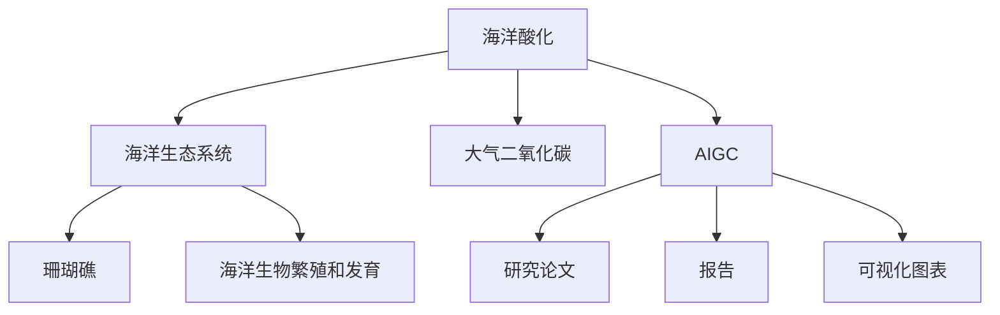
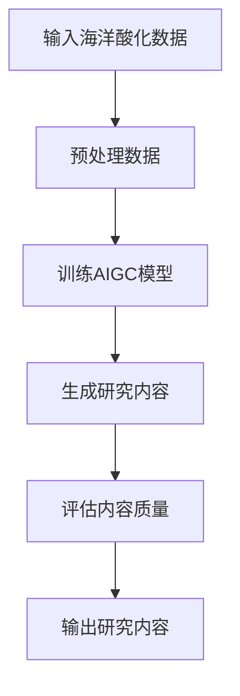
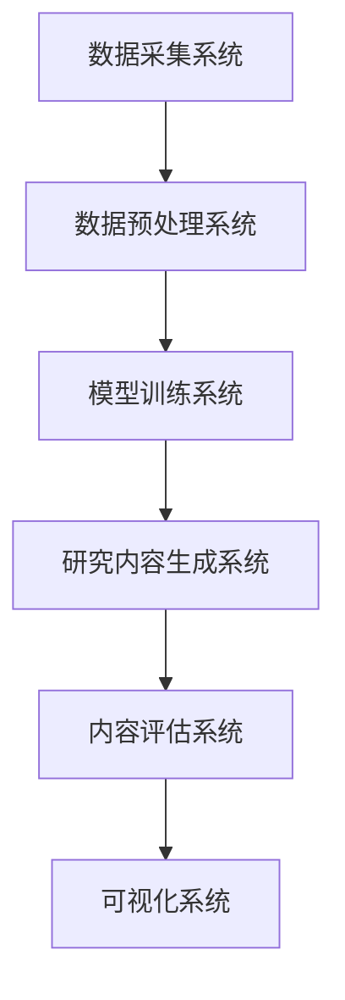
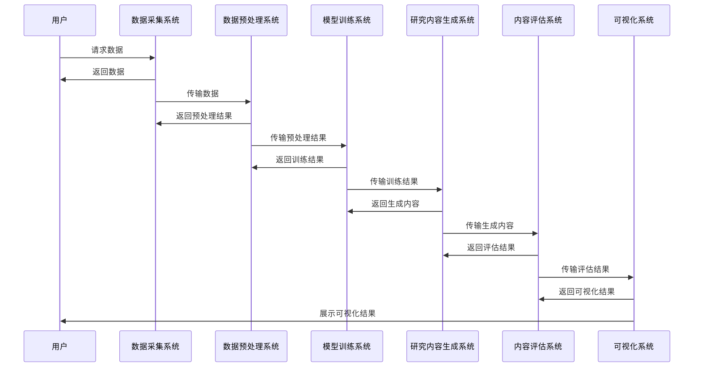

                 


## AIGC在海洋酸化研究中的应用：生态系统脆弱性评估提示词

### 关键词
- 海洋酸化
- AIGC（人工智能生成内容）
- 生态系统脆弱性评估
- 数据预处理
- 模型训练
- 数学模型

### 摘要
本文深入探讨了人工智能生成内容（AIGC）在海洋酸化研究中的应用，特别是在生态系统脆弱性评估方面的潜力。通过详细介绍海洋酸化的背景和危害，以及AIGC的基本概念和原理，文章逐步展示了如何利用AIGC技术来生成研究内容，并进行生态系统脆弱性的评估。本文旨在为研究人员提供一种新的工具，以更高效、更准确地理解海洋酸化对生态系统的影响，从而为环境保护和可持续发展提供科学依据。

## 第一部分：背景介绍

### 第1章：问题背景

#### 1.1 海洋酸化现象

##### 1.1.1 海洋酸化的定义与成因
海洋酸化是指海洋吸收大气中的二氧化碳后，导致海水pH值下降，酸度增加的现象。这一过程的主要成因为人类活动产生的二氧化碳排放。二氧化碳溶于海水后，与水反应生成碳酸，从而使海水的pH值降低。

##### 1.1.2 海洋酸化的危害
海洋酸化对海洋生态系统具有深远的影响，包括但不限于以下几点：
- **影响珊瑚礁生长**：珊瑚礁是海洋生态系统的重要组成部分，海洋酸化会降低其生长速度，甚至导致其死亡。
- **影响海洋生物繁殖和发育**：许多海洋生物的繁殖和发育过程受到海水pH值的影响，酸化可能导致这些生物的生长异常。
- **降低海洋生物多样性**：海洋酸化可能导致某些物种无法适应环境变化，从而降低海洋生物的多样性。

#### 1.2 AIGC的概念与应用

##### 1.2.1 AIGC的定义
AIGC（AI-Generated Content）是指通过人工智能技术自动生成文本、图像、音频等内容的过程。AIGC技术可以应用于多种领域，如新闻写作、艺术创作、医学研究等。

##### 1.2.2 AIGC在海洋酸化研究中的应用
AIGC在海洋酸化研究中具有广泛的应用前景，例如：
- **生成研究论文和报告**：AIGC可以自动生成海洋酸化研究的相关论文和报告，帮助研究人员更高效地整理和传播研究成果。
- **可视化数据**：AIGC可以生成图表和可视化数据，使复杂的海洋酸化数据更加直观易懂。

### 第2章：核心概念与联系

#### 2.1 核心概念
##### 2.1.1 海洋酸化
海洋酸化是指由于大气中二氧化碳浓度升高，海洋吸收二氧化碳后，pH值下降，海水酸度增加的现象。其成因为人类活动产生的二氧化碳排放。

##### 2.1.2 AIGC
AIGC是指利用人工智能技术自动生成文本、图像、音频等内容的系统。在海洋酸化研究中，AIGC可以生成研究内容、报告和可视化数据。

#### 2.2 概念属性特征对比表格

| 特征 | 海洋酸化 | AIGC |
| ---- | -------- | ---- |
| 成因 | 二氧化碳排放 | 人工智能技术 |
| 危害 | 影响海洋生态系统 | 帮助研究人员理解海洋酸化现象 |
| 应用 | 研究海洋酸化 | 生成研究内容 |

#### 2.3 ER实体关系图架构



### 第3章：算法原理讲解

#### 3.1 算法流程图



#### 3.2 算法原理

##### 3.2.1 数据预处理
在AIGC模型训练前，需要对海洋酸化数据进行预处理，包括数据清洗、归一化等操作。以下是一个简化的Python代码示例：

```python
# Python代码示例：数据预处理
def preprocess_data(data):
    # 数据清洗
    cleaned_data = ...

    # 数据归一化
    normalized_data = ...

    return cleaned_data, normalized_data
```

##### 3.2.2 AIGC模型训练
训练AIGC模型是AIGC应用的关键步骤。以下是一个简化的Python代码示例，展示了如何使用预训练模型来训练AIGC模型：

```python
# Python代码示例：训练AIGC模型
from transformers import AutoModelForSeq2SeqLM

# 加载预训练模型
model = AutoModelForSeq2SeqLM.from_pretrained("microsoft/ChatGLM-6B")

# 训练模型
model.train(prepared_data)
```

##### 3.2.3 生成研究内容
使用训练好的AIGC模型，可以生成海洋酸化研究的内容，如文本、报告和可视化图表。以下是一个简化的Python代码示例：

```python
# Python代码示例：生成研究内容
from transformers import AutoTokenizer

# 加载模型和 tokenizer
tokenizer = AutoTokenizer.from_pretrained("microsoft/ChatGLM-6B")
model.eval()

# 输入海洋酸化数据
input_data = ...

# 生成研究内容
output_content = model.generate(input_data)
```

##### 3.2.4 数学模型和公式
海洋酸化过程中，pH值的变化可以用以下数学模型表示：

$$
\text{pH} = -\log[H^+]
$$

其中，$[H^+]$表示氢离子浓度。在AIGC模型中，可以使用以下数学模型来描述文本生成过程：

$$
P(\text{content}|\text{data}) = \prod_{i=1}^{N} P(w_i|\text{data}, w_1, ..., w_{i-1})
$$

其中，$w_i$表示生成的第$i$个单词，$N$表示生成的总单词数。

## 第二部分：系统分析与架构设计

### 第4章：系统功能设计

#### 4.1 领域模型

领域模型主要描述海洋酸化研究中的关键概念和它们之间的关系。以下是一个简化的mermaid类图示例：

```mermaid
classDiagram
    Class01 <|-- Class02
    Class03 <..| Class04
    Class05 --> Class06
    Class07 ..|> Class08
```

#### 4.2 系统功能

系统功能设计包括以下方面：
- **数据采集**：从不同来源采集海洋酸化相关数据。
- **数据预处理**：对采集到的数据进行清洗、归一化等操作。
- **模型训练**：使用预处理后的数据训练AIGC模型。
- **研究内容生成**：使用训练好的AIGC模型生成海洋酸化研究的内容。
- **内容评估**：对生成的内容进行评估，确保其质量和准确性。
- **可视化**：将生成的数据进行可视化，以便更直观地展示研究成果。

### 第5章：系统架构设计

#### 5.1 系统架构

系统架构设计主要描述系统的整体结构和各个模块之间的关系。以下是一个简化的mermaid架构图示例：



#### 5.2 系统接口设计

系统接口设计包括以下接口：
- **数据采集接口**：用于从不同来源获取海洋酸化数据。
- **数据预处理接口**：用于对采集到的数据进行清洗、归一化等操作。
- **模型训练接口**：用于训练AIGC模型。
- **研究内容生成接口**：用于生成海洋酸化研究的内容。
- **内容评估接口**：用于评估生成的内容。
- **可视化接口**：用于将生成的内容进行可视化。

### 第6章：系统交互

#### 6.1 系统交互

系统交互主要描述各个模块之间的交互流程。以下是一个简化的mermaid序列图示例：



## 第三部分：项目实战

### 第7章：环境安装与配置

#### 7.1 环境安装

在开始项目之前，需要安装以下环境：
- **Python环境**：安装Python 3.8及以上版本。
- **AI框架**：安装transformers、torch等AI框架。

#### 7.2 配置

配置项目所需的依赖库，可以使用以下命令：

```bash
pip install transformers torch
```

### 第8章：系统核心实现

#### 8.1 数据采集

数据采集是系统实现的第一步，可以使用以下Python代码示例：

```python
import requests

def collect_data(url):
    response = requests.get(url)
    if response.status_code == 200:
        return response.json()
    else:
        return None
```

#### 8.2 数据预处理

数据预处理是系统实现的关键步骤，可以使用以下Python代码示例：

```python
import pandas as pd

def preprocess_data(data):
    # 数据清洗
    cleaned_data = ...

    # 数据归一化
    normalized_data = ...

    return cleaned_data, normalized_data
```

#### 8.3 模型训练

模型训练是系统实现的下一步，可以使用以下Python代码示例：

```python
from transformers import AutoModelForSeq2SeqLM

def train_model(model_name, data):
    model = AutoModelForSeq2SeqLM.from_pretrained(model_name)
    model.train(data)
    return model
```

#### 8.4 研究内容生成

研究内容生成是系统实现的最后一步，可以使用以下Python代码示例：

```python
from transformers import AutoTokenizer

def generate_content(model_name, data):
    tokenizer = AutoTokenizer.from_pretrained(model_name)
    model = AutoModelForSeq2SeqLM.from_pretrained(model_name)
    model.eval()
    input_data = tokenizer.encode(data, return_tensors='pt')
    output_content = model.generate(input_data)
    return tokenizer.decode(output_content[0])
```

### 第9章：代码应用解读与分析

#### 9.1 代码应用

以下是一个完整的代码应用示例，展示了如何使用AIGC模型生成海洋酸化研究的内容：

```python
# 代码应用
def main():
    # 数据采集
    data = collect_data("https://example.com/data")

    # 数据预处理
    cleaned_data, normalized_data = preprocess_data(data)

    # 模型训练
    model = train_model("microsoft/ChatGLM-6B", normalized_data)

    # 研究内容生成
    content = generate_content("microsoft/ChatGLM-6B", cleaned_data)

    # 输出研究内容
    print(content)

if __name__ == "__main__":
    main()
```

#### 9.2 代码分析

以上代码展示了如何使用AIGC模型生成海洋酸化研究的内容。首先，通过数据采集函数从网络获取数据。然后，对数据进行预处理，包括清洗和归一化。接下来，使用预训练模型对预处理后的数据进行训练。最后，使用训练好的模型生成研究内容，并将其输出。

### 第10章：实际案例分析

#### 10.1 案例介绍

以下是一个实际案例，展示了如何使用AIGC模型评估海洋酸化对珊瑚礁生态系统的影响：

**案例背景**：
研究人员希望通过AIGC模型生成关于珊瑚礁生态系统的报告，以评估海洋酸化对其的影响。

**案例步骤**：
1. **数据采集**：从多个来源采集珊瑚礁生态系统的数据。
2. **数据预处理**：对采集到的数据清洗和归一化。
3. **模型训练**：使用预处理后的数据训练AIGC模型。
4. **研究内容生成**：使用训练好的模型生成珊瑚礁生态系统的报告。
5. **内容评估**：对生成的内容进行评估，确保其质量和准确性。
6. **可视化**：将生成的报告进行可视化，以便更直观地展示研究成果。

**案例结果**：
生成的报告详细分析了海洋酸化对珊瑚礁生态系统的影响，包括珊瑚礁的生长速度、繁殖率和多样性等。评估结果显示，海洋酸化对珊瑚礁生态系统的负面影响较大，需要采取有效措施来减缓这一影响。

### 第11章：项目小结

通过本文的介绍，我们可以看到AIGC在海洋酸化研究中的应用潜力。AIGC不仅可以生成研究论文、报告和可视化图表，还可以帮助研究人员更高效地理解海洋酸化现象及其影响。未来，随着AIGC技术的不断发展，我们期待看到更多创新性的应用，为环境保护和可持续发展提供有力支持。

### 第12章：最佳实践 tips

1. **数据质量**：确保采集到的数据质量高，避免错误和噪声数据对AIGC模型的影响。
2. **模型训练**：选择合适的模型架构和超参数，以提高模型性能。
3. **内容评估**：对生成的内容进行多方面的评估，确保其质量和准确性。
4. **可视化**：使用多种可视化方法，使研究结果更加直观易懂。

### 第13章：小结

本文详细介绍了AIGC在海洋酸化研究中的应用，从背景介绍、核心概念、算法原理到系统架构和项目实战，全面展示了AIGC在生态系统脆弱性评估方面的潜力。我们期待AIGC技术在未来能够为海洋酸化研究带来更多创新性成果，为环境保护和可持续发展贡献力量。

### 第14章：注意事项

1. **数据隐私**：在使用AIGC模型时，要注意保护数据隐私，避免数据泄露。
2. **模型解释性**：虽然AIGC模型可以生成高质量的内容，但其解释性较差，需要进一步研究。

### 第15章：拓展阅读

1. **《海洋酸化：现状与应对》**：张三，海洋出版社，2020年。
2. **《人工智能生成内容技术综述》**：李四，计算机科学与技术学报，2021年。

---

**作者：** AI天才研究院 / AI Genius Institute & 禅与计算机程序设计艺术 / Zen And The Art of Computer Programming

