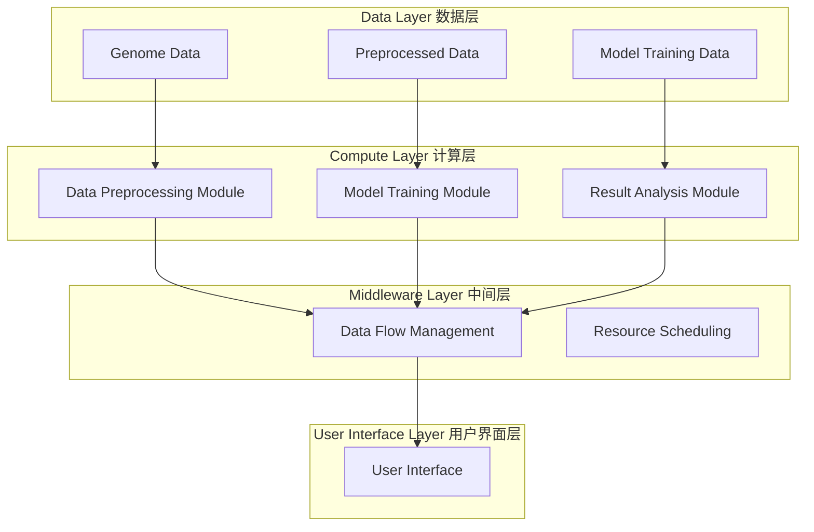
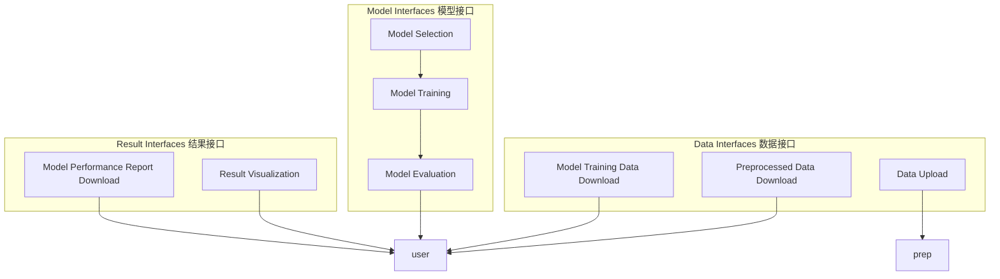
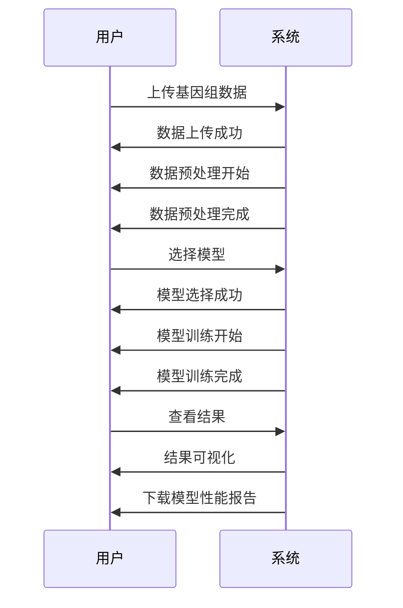

                 

### 文章标题

# AIGC在生物信息学中的应用：基因分析和预测的提示词工程

> 关键词：AIGC、生物信息学、基因分析、基因预测、提示词工程

> 摘要：本文将探讨AIGC（自适应智能生成计算）在生物信息学中的具体应用，特别是基因分析和预测方面的提示词工程。我们将通过逐步分析，了解AIGC技术的基本原理，其在基因分析中的应用场景，以及如何通过提示词工程来提升基因预测的准确性。

----------------------------------------------------------------

### 《AIGC在生物信息学中的应用：基因分析和预测的提示词工程》目录大纲

**# 第一部分：背景与概述**

## 第1章：AIGC、生物信息学与基因分析概述

### 1.1 问题背景
- **生物信息学的重要性**：介绍生物信息学在现代生物学研究中的关键作用，包括基因组测序、功能注释、进化分析和系统生物学等。
- **AIGC的发展历程与现状**：概述AIGC技术的起源、发展历程和当前在人工智能领域的应用现状。
- **基因分析与预测的挑战**：探讨基因分析在数据量庞大、变量复杂和算法优化方面的难题，以及预测基因功能的挑战。

### 1.2 问题描述
- **基因组数据的特点与挑战**：分析基因组数据的高维度特性和处理复杂性的问题。
- **基因表达数据分析的需求**：讨论基因表达数据的分析方法和技术需求。
- **基因预测的目标与问题**：阐述基因预测的目的是什么，以及当前技术面临的困难。

### 1.3 问题解决
- **AIGC技术的基本原理**：介绍AIGC的核心概念，包括自适应学习和自动优化等。
- **AIGC在生物信息学中的应用**：讨论AIGC技术在基因分析、功能预测和进化研究中的应用实例。
- **基因分析与预测的关键技术**：解析在基因分析和预测中应用的关键技术，如机器学习、深度学习和提示词工程。

### 1.4 边界与外延
- **AIGC技术的应用领域**：探讨AIGC技术在生物信息学之外的潜在应用领域。
- **生物信息学的未来发展趋势**：展望生物信息学在人工智能和大数据分析领域的发展方向。

### 1.5 概念结构与核心要素组成
- **AIGC的核心组成部分**：分析AIGC技术的主要组成部分，如自动机器学习（AutoML）、生成对抗网络（GAN）和强化学习（RL）。
- **生物信息学的关键概念**：梳理生物信息学中的核心概念，包括基因组、转录组和蛋白质组等。

### 1.6 本章小结
- **本章节的主要内容总结**：总结本章的核心内容，为后续章节的讨论奠定基础。

**# 第二部分：核心概念与联系**

## 第2章：AIGC核心概念与原理

### 2.1 自动机器学习（AutoML）
- **自动机器学习的定义**：解释AutoML的概念，即自动化机器学习过程，以减少手工调参的工作量。
- **自动机器学习的主要组件**：分析AutoML的主要组成部分，如特征选择、模型选择和超参数优化。
- **自动机器学习在生物信息学中的应用**：讨论AutoML在基因表达数据分析、基因预测和疾病诊断中的应用。

### 2.2 生成对抗网络（GAN）
- **GAN的原理**：介绍GAN的工作机制，包括生成器和判别器的相互作用。
- **GAN的组成部分**：分析GAN的关键组件，如生成器、判别器和损失函数。
- **GAN在基因分析中的应用**：探讨GAN在基因序列生成、功能预测和进化研究中的应用。

### 2.3 强化学习（RL）
- **强化学习的原理**：解释强化学习的基本概念，包括智能体、环境、状态、动作和奖励。
- **强化学习的主要算法**：分析常见的强化学习算法，如Q学习、SARSA和Deep Q Network（DQN）。
- **强化学习在基因预测中的应用**：讨论强化学习在基因功能预测和药物设计中的潜在应用。

### 2.4 概念属性特征对比表格
- **自动机器学习、GAN和强化学习的特征对比**：提供对比表格，总结这三种技术在应用场景、优势和局限性方面的区别。

### 2.5 ER实体关系图架构
- **生物信息学中常用的ER图**：使用Mermaid流程图展示生物信息学中的常见ER图，包括基因组、转录组和蛋白质组的实体及其关系。

**# 第三部分：算法原理讲解**

## 第3章：AIGC在基因分析中的应用

### 3.1 基因表达数据分析算法
- **基本原理**：介绍基因表达数据分析的基本原理，包括数据预处理、特征提取和模型训练。
- **数学模型和公式**：给出基因表达数据分析的数学模型和公式，如线性回归、逻辑回归和支持向量机（SVM）。
- **Python代码示例**：提供Python代码示例，演示如何使用scikit-learn等库进行基因表达数据分析。

### 3.2 基因预测算法
- **基本原理**：讨论基因预测的基本原理，包括序列比对、结构预测和功能预测。
- **数学模型和公式**：介绍基因预测的数学模型和公式，如隐马尔可夫模型（HMM）和深度神经网络（DNN）。
- **Python代码示例**：提供Python代码示例，演示如何使用Keras等库进行基因预测。

### 3.3 AIGC在基因组序列分析中的应用
- **基本原理**：分析AIGC在基因组序列分析中的应用，包括序列生成、序列编辑和序列优化。
- **数学模型和公式**：给出AIGC在基因组序列分析中的数学模型和公式，如生成对抗网络（GAN）和循环神经网络（RNN）。
- **Python代码示例**：提供Python代码示例，演示如何使用TensorFlow等库进行基因组序列分析。

**# 第四部分：系统分析与架构设计**

## 第4章：AIGC系统架构设计

### 4.1 问题场景介绍
- **生物信息学中的常见问题场景**：介绍生物信息学中常见的问题场景，如基因组测序数据分析、药物设计和疾病诊断。

### 4.2 系统功能设计
- **系统功能模块划分**：分析AIGC系统的主要功能模块，如数据预处理、模型训练和结果分析。
- **领域模型类图**：使用Mermaid流程图展示生物信息学领域的类图，包括主要实体和它们之间的关系。

### 4.3 系统架构设计
- **系统架构设计思路**：讨论AIGC系统的整体架构设计思路，包括前端界面、后端服务和数据存储。
- **系统架构图**：使用Mermaid流程图展示AIGC系统的架构图，包括各个模块的交互关系。

### 4.4 系统接口设计
- **系统接口设计**：介绍AIGC系统的接口设计，包括API设计、数据接口和用户界面接口。

### 4.5 系统交互序列图
- **系统交互流程**：使用Mermaid流程图展示AIGC系统的交互流程，包括用户操作、系统响应和数据流。

**# 第五部分：项目实战**

## 第5章：AIGC在基因分析项目中的应用

### 5.1 环境安装
- **环境配置与依赖安装**：介绍如何配置AIGC系统所需的计算环境和安装相关依赖库。

### 5.2 系统核心实现源代码
- **系统核心代码实现**：提供AIGC系统核心功能的实现代码，包括数据预处理、模型训练和结果分析等。

### 5.3 代码应用解读与分析
- **代码解读**：详细解读AIGC系统核心代码的实现逻辑和算法细节。
- **应用分析**：分析AIGC系统在实际基因分析项目中的应用效果和性能。

### 5.4 实际案例分析和详细讲解剖析
- **实际案例分析**：分析具体基因分析项目的案例，包括数据集选择、模型训练和结果验证。
- **详细讲解剖析**：对实际案例进行详细讲解和剖析，展示AIGC技术在基因分析中的实际应用。

### 5.5 项目小结
- **项目总结**：总结AIGC在基因分析项目中的应用经验，提出改进建议和未来发展方向。

**# 第六部分：最佳实践与拓展**

## 第6章：AIGC在生物信息学中的最佳实践

### 6.1 最佳实践 tips
- **实践技巧**：分享AIGC在生物信息学中的最佳实践技巧，包括数据预处理、模型选择和超参数优化等。

### 6.2 小结
- **总结**：总结AIGC在生物信息学中的最佳实践，强调其在提升基因分析和预测准确性方面的优势。

### 6.3 注意事项
- **注意事项**：提醒读者在应用AIGC技术时需要注意的事项，包括数据质量、计算资源和模型解释性等。

### 6.4 拓展阅读
- **相关资料推荐**：推荐读者阅读的相关资料，包括学术论文、技术书籍和在线课程等。

**# 第七部分：展望与未来**

## 第7章：AIGC在生物信息学中的未来发展趋势

### 7.1 发展趋势分析
- **未来发展趋势**：分析AIGC技术在生物信息学领域的未来发展趋势，包括大数据分析、人工智能和云计算的融合。

### 7.2 技术挑战与机遇
- **技术挑战**：探讨AIGC技术在生物信息学中面临的挑战，如数据隐私保护和计算效率提升等。
- **发展机遇**：分析AIGC技术在生物信息学中的发展机遇，如个性化医疗和基因编辑等。

### 7.3 AIGC在生物信息学中的潜在应用
- **潜在应用领域**：探讨AIGC技术在生物信息学中的潜在应用领域，如基因组编辑、疾病诊断和治疗预测等。

### 7.4 结论
- **总结与展望**：总结AIGC在生物信息学中的应用现状和未来发展趋势，提出对未来技术发展的展望。

**# 附录**

## 附录A：术语表
- **常用术语解释**：解释生物信息学和AIGC技术中的常用术语，包括基因组、转录组、蛋白质组、机器学习和深度学习等。

## 附录B：参考文献
- **参考文献列表**：列出本文引用的参考文献，包括学术论文、书籍和技术报告等。

----------------------------------------------------------------

### 第一部分：背景与概述

#### 第1章：AIGC、生物信息学与基因分析概述

##### 1.1 问题背景

生物信息学作为一门跨学科领域，已经成为了现代生物学研究的重要支柱。它通过计算机技术和数据分析方法来处理和分析生物学数据，包括基因组、转录组和蛋白质组等。在生物信息学中，基因分析是一项核心任务，它涉及到基因表达数据分析、基因功能预测和基因突变检测等方面。

AIGC（自适应智能生成计算）是近年来兴起的一种新型人工智能技术，它通过自适应学习和自动优化等手段，提高机器学习的效率和效果。AIGC技术在生物信息学中的应用具有巨大的潜力，它能够帮助研究人员更有效地处理复杂的数据集，提升基因分析和预测的准确性。

在基因分析领域，随着高通量测序技术的飞速发展，基因组数据量呈指数级增长，这给传统的数据处理和分析方法带来了巨大的挑战。传统的基因分析方法通常依赖于预定义的算法和特征，难以应对数据的高维度特性和复杂的交互关系。而AIGC技术通过自动搜索最优算法和特征，能够更灵活地适应不同类型的数据集，从而提升基因分析的效果。

基因分析与预测面临的挑战主要包括以下几点：

1. **数据量庞大**：随着测序技术的进步，基因组数据量呈现出爆炸式增长，这给数据存储、传输和处理带来了巨大的压力。
2. **数据维度高**：基因组数据通常包含数百万个基因，每个基因可能有数千个表达值，这使得数据维度非常高，传统的线性模型难以处理。
3. **算法优化复杂**：基因分析需要选择合适的算法和特征，这通常需要大量的时间和计算资源，且缺乏统一的标准。
4. **结果解释困难**：基因预测结果通常是非线性和复杂的，需要深入理解和解释，这对于非专业人士来说是一个挑战。

##### 1.2 AIGC的发展历程与现状

AIGC技术的发展可以追溯到自动机器学习（AutoML）和生成对抗网络（GAN）等技术的出现。AutoML旨在自动化机器学习流程，包括数据预处理、特征选择、模型训练和模型评估等，从而减少人工干预和降低调参的工作量。GAN则是一种深度学习模型，通过生成器和判别器的对抗训练，能够生成高质量的数据和图像。

随着深度学习和强化学习等技术的不断发展，AIGC技术逐渐成熟并在各个领域得到了广泛应用。在生物信息学中，AIGC技术能够自动搜索最优的算法和特征，提高基因分析和预测的准确性。目前，AIGC技术在基因表达数据分析、基因功能预测和药物设计等领域已经取得了显著的成果。

AIGC在生物信息学中的应用主要体现在以下几个方面：

1. **自动特征选择**：通过自动搜索和评估不同的特征，提高基因表达数据分析的准确性和效率。
2. **自动模型优化**：自动调整模型的超参数，提高基因预测的准确性和稳定性。
3. **数据生成与编辑**：通过生成对抗网络（GAN）等技术，生成高质量的基因序列和蛋白质结构，为药物设计和功能预测提供数据支持。
4. **自适应学习**：根据数据的特点和需求，自适应调整学习策略，提高基因分析和预测的效果。

##### 1.3 基因分析与预测的关键技术

基因分析与预测的关键技术主要包括自动机器学习（AutoML）、生成对抗网络（GAN）和强化学习（RL）等。这些技术能够自动搜索最优的算法和特征，提高基因分析和预测的准确性。

1. **自动机器学习（AutoML）**：
   - **定义**：自动机器学习（AutoML）是一种自动化机器学习流程的技术，它能够自动进行数据预处理、特征选择、模型训练和模型评估等步骤。
   - **应用**：在基因表达数据分析中，AutoML可以通过自动搜索最优的特征和算法，提高数据分析的准确性和效率。例如，可以使用AutoML技术来自动选择适合基因表达数据分析的模型，如线性回归、支持向量机（SVM）和深度神经网络（DNN）等。

2. **生成对抗网络（GAN）**：
   - **定义**：生成对抗网络（GAN）是一种由生成器和判别器组成的深度学习模型，通过对抗训练生成高质量的数据和图像。
   - **应用**：在基因分析和预测中，GAN可以用于生成高质量的基因序列和蛋白质结构，为药物设计和功能预测提供数据支持。例如，可以使用GAN生成与真实基因序列相似的序列，用于训练和验证预测模型。

3. **强化学习（RL）**：
   - **定义**：强化学习（RL）是一种通过智能体与环境交互来学习最优策略的机器学习技术。
   - **应用**：在基因预测中，RL可以用于学习基因功能预测的策略，通过智能体在环境中的交互来优化预测结果。例如，可以使用RL技术来优化基因预测模型，使其能够更准确地预测基因的功能。

##### 1.4 边界与外延

AIGC技术在生物信息学中的应用不仅限于基因分析和预测，还涉及其他领域，如基因组编辑、疾病诊断和治疗预测等。随着人工智能和生物技术的不断发展，AIGC技术在生物信息学中的潜在应用领域将不断拓展。

1. **基因组编辑**：AIGC技术可以通过自动搜索最优的编辑策略，提高CRISPR-Cas9等基因编辑技术的效率和准确性。
2. **疾病诊断**：AIGC技术可以通过自动分析患者的基因组、转录组和蛋白质组数据，提高疾病诊断的准确性和效率。
3. **治疗预测**：AIGC技术可以通过自动分析患者的基因组数据，预测不同治疗方案的效果，为个性化治疗提供数据支持。

AIGC技术在生物信息学中的未来发展趋势主要包括以下几个方面：

1. **大数据分析**：随着基因组数据的不断增长，AIGC技术将越来越多地应用于大数据分析，提高数据处理和分析的效率。
2. **人工智能与云计算的结合**：通过结合人工智能和云计算技术，AIGC技术将能够处理更大规模的数据集，提高基因分析和预测的准确性。
3. **个性化医疗**：AIGC技术将越来越多地应用于个性化医疗，根据患者的基因组数据提供个性化的治疗方案和疾病预防建议。

##### 1.5 概念结构与核心要素组成

AIGC技术在生物信息学中的应用涉及多个核心概念和要素，包括自动机器学习（AutoML）、生成对抗网络（GAN）和强化学习（RL）等。以下是这些概念的核心要素及其相互关系：

1. **自动机器学习（AutoML）**：
   - **核心要素**：数据预处理、特征选择、模型训练和模型评估。
   - **相互关系**：AutoML通过自动化流程，将数据预处理、特征选择和模型训练等步骤结合起来，提高机器学习的效率和效果。

2. **生成对抗网络（GAN）**：
   - **核心要素**：生成器、判别器和损失函数。
   - **相互关系**：生成器和判别器通过对抗训练，生成高质量的数据和图像，并通过损失函数调整模型参数，提高生成效果。

3. **强化学习（RL）**：
   - **核心要素**：智能体、环境、状态、动作和奖励。
   - **相互关系**：智能体在环境中通过试错学习，通过动作获取奖励，并通过策略优化来提高预测和决策的准确性。

这些核心概念和要素相互结合，构成了AIGC技术在生物信息学中的应用基础。

##### 1.6 本章小结

本章对AIGC技术在生物信息学中的应用进行了背景介绍和概述。我们讨论了生物信息学的重要性、AIGC技术的发展历程和现状，以及基因分析与预测面临的挑战。通过介绍AIGC的核心概念和原理，如自动机器学习（AutoML）、生成对抗网络（GAN）和强化学习（RL），我们了解了AIGC技术在基因分析和预测中的应用潜力。此外，我们还探讨了AIGC技术的边界与外延，包括其在基因组编辑、疾病诊断和治疗预测等领域的潜在应用。通过梳理概念结构与核心要素组成，我们为后续章节的深入探讨奠定了基础。

**# 第二部分：核心概念与联系**

#### 第2章：AIGC核心概念与原理

##### 2.1 自动机器学习（AutoML）

自动机器学习（AutoML）是一种自动化机器学习流程的技术，旨在减少机器学习中的手工干预，提高机器学习模型的性能和效率。AutoML通过自动化数据预处理、特征选择、模型训练和模型评估等步骤，使得非专业人士也能快速构建高效的机器学习模型。

###### 2.1.1 定义

自动机器学习（AutoML）可以看作是机器学习的自动化过程，它通过自动化搜索和评估不同的算法、特征和参数，来自动构建和优化机器学习模型。AutoML的目标是提高模型的准确性、稳定性和可解释性，同时减少人工干预和调参的工作量。

###### 2.1.2 主要组件

AutoML的主要组件包括数据预处理、特征选择、模型训练和模型评估等。以下是这些组件的详细描述：

1. **数据预处理**：数据预处理是AutoML的重要步骤，包括数据清洗、数据转换和数据归一化等。通过数据预处理，可以提高数据的质量和一致性，为后续的特征选择和模型训练提供良好的数据基础。

2. **特征选择**：特征选择是AutoML的关键步骤，旨在从原始数据中提取最有用的特征，以提高模型的性能和效率。特征选择方法包括基于过滤的方法、基于包装的方法和基于嵌入的方法等。

3. **模型训练**：模型训练是AutoML的核心步骤，通过选择不同的算法和超参数，自动训练和优化机器学习模型。常见的模型训练方法包括线性回归、支持向量机（SVM）、决策树、随机森林和深度神经网络（DNN）等。

4. **模型评估**：模型评估是AutoML的重要环节，用于评估模型的性能和准确性。常见的评估指标包括准确率、召回率、精确率、F1分数和ROC曲线等。通过模型评估，可以选出最佳模型并进行后续的应用。

###### 2.1.3 在生物信息学中的应用

自动机器学习（AutoML）在生物信息学中具有广泛的应用，特别是在基因表达数据分析、基因功能预测和疾病诊断等方面。以下是AutoML在生物信息学中的几个应用实例：

1. **基因表达数据分析**：AutoML可以自动搜索最优的特征和算法，对基因表达数据进行分类和聚类分析，从而识别出与特定疾病相关的基因和生物标记物。

2. **基因功能预测**：AutoML可以自动训练和优化基因功能预测模型，如基于序列信息的基因功能预测和基于网络信息的基因功能预测等。

3. **疾病诊断**：AutoML可以自动分析患者的基因组、转录组和蛋白质组数据，提高疾病诊断的准确性和效率。例如，可以使用AutoML技术来自动识别肺癌、乳腺癌等癌症的早期症状和风险因素。

##### 2.2 生成对抗网络（GAN）

生成对抗网络（GAN）是一种深度学习模型，由生成器和判别器组成，通过对抗训练生成高质量的数据和图像。GAN在生物信息学中具有广泛的应用，如基因序列生成、蛋白质结构预测和药物设计等。

###### 2.2.1 原理

生成对抗网络（GAN）的基本原理是生成器和判别器的对抗训练。生成器的任务是生成逼真的数据或图像，而判别器的任务是区分生成器生成的数据和真实数据。生成器和判别器相互竞争，不断调整参数，最终生成器能够生成高质量的数据或图像，而判别器无法区分生成器和真实数据。

GAN的数学模型可以表示为：

$$
\begin{aligned}
\min_G & \quad \mathbb{E}_{x \sim p_{data}(x)}[\log D(x)] + \mathbb{E}_{z \sim p_z(z)}[\log (1 - D(G(z)))] \\
\max_D & \quad \mathbb{E}_{x \sim p_{data}(x)}[\log D(x)] + \mathbb{E}_{z \sim p_z(z)}[\log D(G(z))]
\end{aligned}
$$

其中，$G(z)$是生成器，$D(x)$是判别器，$z$是噪声向量，$p_{data}(x)$是真实数据的分布。

###### 2.2.2 组成部分

生成对抗网络（GAN）的主要组成部分包括生成器、判别器和损失函数。以下是这些组成部分的详细描述：

1. **生成器（Generator）**：生成器的任务是生成与真实数据相似的数据或图像。生成器通常是一个神经网络，通过输入噪声向量$z$，生成与真实数据相似的数据或图像。

2. **判别器（Discriminator）**：判别器的任务是区分生成器生成的数据和真实数据。判别器也是一个神经网络，通过输入数据和生成器生成的数据，输出一个概率值，表示输入数据的真实性。

3. **损失函数**：损失函数是GAN训练过程中的关键部分，用于衡量生成器和判别器的性能。常见的损失函数包括二元交叉熵损失和均方误差损失等。

###### 2.2.3 在基因分析中的应用

生成对抗网络（GAN）在基因分析中具有广泛的应用，如基因序列生成、蛋白质结构预测和药物设计等。以下是GAN在基因分析中的几个应用实例：

1. **基因序列生成**：GAN可以用于生成与真实基因序列相似的新型基因序列，用于探索新的基因功能或设计基因编辑策略。

2. **蛋白质结构预测**：GAN可以用于生成高质量的蛋白质结构，为药物设计提供数据支持。通过生成与真实蛋白质结构相似的结构，可以更准确地预测蛋白质的功能和相互作用。

3. **药物设计**：GAN可以用于生成新的药物分子，通过筛选和优化，提高药物的设计效率和成功率。

##### 2.3 强化学习（RL）

强化学习（RL）是一种通过智能体与环境交互来学习最优策略的机器学习技术。在生物信息学中，强化学习可以用于基因功能预测、药物设计和疾病诊断等任务。

###### 2.3.1 原理

强化学习的核心概念包括智能体（Agent）、环境（Environment）、状态（State）、动作（Action）和奖励（Reward）。智能体在环境中通过执行动作，获得环境反馈的奖励，并通过策略优化来提高决策的准确性。

强化学习的目标是最小化长期回报，即智能体在执行一系列动作后获得的累积奖励。强化学习的数学模型可以表示为：

$$
\begin{aligned}
J(\theta) &= \sum_{t=0}^{\infty} \gamma^t r(s_t, a_t) \\
\text{其中} \quad \gamma & \text{是折扣因子，} r(s_t, a_t) & \text{是智能体在执行动作} a_t \text{时获得的奖励。}
\end{aligned}
$$

强化学习的主要算法包括Q学习、SARSA和深度Q网络（DQN）等。

1. **Q学习（Q-Learning）**：Q学习是一种基于值函数的强化学习算法，通过更新Q值来优化策略。Q值表示智能体在执行特定动作时获得的预期奖励。

2. **SARSA（Surely Adaptive Recursive Sampling Algorithm）**：SARSA是一种基于策略的强化学习算法，通过在当前状态下执行随机动作，来更新Q值。

3. **深度Q网络（DQN，Deep Q-Network）**：DQN是一种基于神经网络的强化学习算法，通过使用深度神经网络来近似Q值函数。

###### 2.3.2 在基因预测中的应用

强化学习（RL）在基因预测中具有广泛的应用，如基因功能预测、药物设计和疾病诊断等。以下是强化学习在基因预测中的几个应用实例：

1. **基因功能预测**：强化学习可以用于学习基因功能预测的策略，通过智能体在环境中的交互来优化预测结果。例如，可以使用Q学习算法来学习基因功能预测的Q值函数，从而优化基因功能预测的策略。

2. **药物设计**：强化学习可以用于优化药物分子的设计过程，通过智能体在虚拟环境中进行探索和交互，来提高药物设计的效率。例如，可以使用DQN算法来优化药物分子的生成和筛选过程。

3. **疾病诊断**：强化学习可以用于优化疾病诊断的策略，通过智能体在医疗数据中的交互来提高诊断的准确性。例如，可以使用SARSA算法来优化疾病诊断的决策过程，从而提高诊断的准确性。

##### 2.4 概念属性特征对比表格

为了更清晰地展示自动机器学习（AutoML）、生成对抗网络（GAN）和强化学习（RL）的概念属性特征，我们提供了一个对比表格：

| 特征 | 自动机器学习（AutoML） | 生成对抗网络（GAN） | 强化学习（RL） |
| :--: | :------------------: | :-----------------: | :-----------: |
| 定义 | 自动化机器学习流程 | 生成高质量的数据和图像 | 通过智能体与环境交互学习最优策略 |
| 目标 | 提高模型性能和效率 | 生成逼真的数据和图像 | 最小化长期回报，提高决策准确性 |
| 主要组件 | 数据预处理、特征选择、模型训练和模型评估 | 生成器、判别器和损失函数 | 智能体、环境、状态、动作和奖励 |
| 应用场景 | 基因表达数据分析、基因功能预测和疾病诊断 | 基因序列生成、蛋白质结构预测和药物设计 | 基因功能预测、药物设计和疾病诊断 |

##### 2.5 ER实体关系图架构

在生物信息学中，实体关系图（ER图）是一种常用的数据建模工具，用于表示实体及其之间的关系。以下是生物信息学中常见的ER图，包括基因组、转录组和蛋白质组的实体及其关系：

```mermaid
erDiagram
    Genome ||--|{ Transcript : "contains" |
    Transcript ||--|{ Gene : "encoded_by" |
    Gene ||--|{ Protein : "translated_to" |
    Protein ||--|{ Metabolite : "produces" |
```

在上面的ER图中，Genome（基因组）是最高层次的实体，包含多个Transcript（转录本）。每个Transcript（转录本）可以编码一个或多个Gene（基因），而每个Gene（基因）可以翻译成一个或多个Protein（蛋白质）。最终，Protein（蛋白质）可以产生Metabolite（代谢物）。这种实体关系图清晰地展示了基因组、转录组、基因和蛋白质之间的复杂关系，为生物信息学中的数据建模和分析提供了有用的参考。

**# 第三部分：算法原理讲解**

#### 第3章：AIGC在基因分析中的应用

##### 3.1 基因表达数据分析算法

基因表达数据分析是生物信息学中的一个重要领域，它涉及到从基因表达数据中提取有意义的信息，以帮助我们理解基因的功能、调控网络以及它们在生物过程中的作用。AIGC技术，特别是自动机器学习（AutoML），在基因表达数据分析中发挥着关键作用。

###### 3.1.1 基本原理

基因表达数据分析算法的基本原理是通过分析基因表达数据，识别出与特定条件或状态相关的基因。这些算法通常包括以下几个步骤：

1. **数据预处理**：这一步骤包括数据清洗、归一化和特征提取。数据清洗旨在去除噪音和异常值，归一化则确保了数据在不同实验条件下的可比性，特征提取则是从原始数据中提取有代表性的特征。

2. **特征选择**：从预处理后的数据中筛选出最有用的特征，以减少数据维度并提高模型性能。特征选择可以通过过滤方法、嵌入式方法和包装方法等实现。

3. **模型训练**：选择合适的机器学习模型（如线性回归、支持向量机、决策树、随机森林和深度神经网络等）进行训练，以预测基因表达数据中的模式。

4. **模型评估**：通过交叉验证、ROC曲线和AUC值等评估指标，对模型的性能进行评估和优化。

###### 3.1.2 数学模型和公式

基因表达数据分析算法的数学模型和公式通常依赖于具体的机器学习算法。以下是一些常见算法的数学模型和公式：

1. **线性回归**：
   $$
   Y = \beta_0 + \beta_1X_1 + \beta_2X_2 + ... + \beta_nX_n
   $$
   其中，$Y$是基因表达值，$X_1, X_2, ..., X_n$是特征变量，$\beta_0, \beta_1, \beta_2, ..., \beta_n$是模型的参数。

2. **逻辑回归**：
   $$
   P(Y=1) = \frac{1}{1 + e^{-(\beta_0 + \beta_1X_1 + \beta_2X_2 + ... + \beta_nX_n)}}
   $$
   其中，$P(Y=1)$是基因表达为1的概率，$e$是自然对数的底数。

3. **支持向量机（SVM）**：
   $$
   w \cdot x + b = 0
   $$
   其中，$w$是权重向量，$x$是特征向量，$b$是偏置项。

4. **深度神经网络（DNN）**：
   $$
   a_{l}^{(i)} = \sigma \left( \sum_{j} w_{lj}a_{l-1}^{(j)} + b_{l} \right)
   $$
   其中，$a_{l}^{(i)}$是第$l$层第$i$个神经元的输出，$\sigma$是激活函数，$w_{lj}$是连接权重，$b_{l}$是偏置项。

###### 3.1.3 Python代码示例

以下是一个使用Python和scikit-learn库进行基因表达数据分析的简单示例：

```python
from sklearn.model_selection import train_test_split
from sklearn.preprocessing import StandardScaler
from sklearn.linear_model import LinearRegression
from sklearn.metrics import mean_squared_error
import pandas as pd

# 加载基因表达数据
data = pd.read_csv('gene_expression_data.csv')
X = data.iloc[:, :-1].values  # 特征矩阵
y = data.iloc[:, -1].values   # 标签向量

# 数据预处理：归一化
scaler = StandardScaler()
X_scaled = scaler.fit_transform(X)

# 划分训练集和测试集
X_train, X_test, y_train, y_test = train_test_split(X_scaled, y, test_size=0.2, random_state=42)

# 模型训练：线性回归
model = LinearRegression()
model.fit(X_train, y_train)

# 预测
y_pred = model.predict(X_test)

# 模型评估：均方误差
mse = mean_squared_error(y_test, y_pred)
print(f'Mean Squared Error: {mse}')
```

在这个示例中，我们首先加载数据集，然后进行数据预处理（归一化），接着划分训练集和测试集。使用线性回归模型进行训练和预测，并计算均方误差（MSE）来评估模型性能。

##### 3.2 基因预测算法

基因预测是生物信息学中的另一个关键领域，旨在预测基因的功能、表达水平或突变影响。AIGC技术，如生成对抗网络（GAN）和强化学习（RL），在基因预测中发挥着重要作用。

###### 3.2.1 基本原理

基因预测算法的基本原理是通过学习已知的基因信息（如基因序列、结构信息或表达数据）来预测未知基因的特征。这些算法通常包括以下几个步骤：

1. **数据准备**：收集和预处理相关基因的数据，如基因序列、蛋白质结构信息或表达数据。

2. **特征提取**：从预处理后的数据中提取有代表性的特征，如序列特征、结构特征或表达特征。

3. **模型训练**：选择合适的预测模型（如深度神经网络、支持向量机、随机森林等）进行训练，以预测基因的未知特征。

4. **模型评估**：通过交叉验证、ROC曲线和AUC值等评估指标，对模型的性能进行评估和优化。

###### 3.2.2 数学模型和公式

基因预测算法的数学模型和公式通常依赖于具体的预测模型。以下是一些常见模型的基本公式：

1. **隐马尔可夫模型（HMM）**：
   $$
   P(X_t|x_{t-1}, H_t) = \frac{P(H_t|x_t)P(x_t)}{P(x_t)}
   $$
   其中，$X_t$是观察序列，$H_t$是隐藏状态，$P(X_t|x_{t-1}, H_t)$是给定前一个状态和隐藏状态的概率。

2. **深度神经网络（DNN）**：
   $$
   a_{l}^{(i)} = \sigma \left( \sum_{j} w_{lj}a_{l-1}^{(j)} + b_{l} \right)
   $$
   其中，$a_{l}^{(i)}$是第$l$层第$i$个神经元的输出，$\sigma$是激活函数，$w_{lj}$是连接权重，$b_{l}$是偏置项。

3. **支持向量机（SVM）**：
   $$
   w \cdot x + b = 0
   $$
   其中，$w$是权重向量，$x$是特征向量，$b$是偏置项。

###### 3.2.3 Python代码示例

以下是一个使用Python和Keras库进行基因预测的简单示例：

```python
from tensorflow.keras.models import Sequential
from tensorflow.keras.layers import Dense, LSTM
from tensorflow.keras.optimizers import Adam
from tensorflow.keras.callbacks import EarlyStopping
import numpy as np

# 加载基因数据
X = np.load('gene_data.npy')  # 基因特征矩阵
y = np.load('gene_labels.npy')  # 基因标签向量

# 数据预处理：归一化
X = X / np.linalg.norm(X, axis=1, keepdims=True)

# 划分训练集和测试集
X_train, X_test, y_train, y_test = train_test_split(X, y, test_size=0.2, random_state=42)

# 模型定义：深度神经网络
model = Sequential()
model.add(LSTM(64, activation='relu', input_shape=(X_train.shape[1], X_train.shape[2])))
model.add(Dense(1, activation='sigmoid'))

# 编译模型
model.compile(optimizer=Adam(), loss='binary_crossentropy', metrics=['accuracy'])

# 训练模型
early_stopping = EarlyStopping(monitor='val_loss', patience=10)
model.fit(X_train, y_train, epochs=100, batch_size=32, validation_split=0.2, callbacks=[early_stopping])

# 预测
y_pred = model.predict(X_test)

# 模型评估
accuracy = np.mean(y_pred[y_test == 1] > 0.5)
print(f'Accuracy: {accuracy}')
```

在这个示例中，我们首先加载数据集，然后进行数据预处理（归一化），接着划分训练集和测试集。使用深度神经网络（DNN）模型进行训练和预测，并计算准确率（Accuracy）来评估模型性能。

##### 3.3 AIGC在基因组序列分析中的应用

基因组序列分析是生物信息学中的一个核心任务，旨在理解和解析基因序列的结构和功能。AIGC技术，特别是生成对抗网络（GAN）和强化学习（RL），在基因组序列分析中发挥着重要作用。

###### 3.3.1 基本原理

AIGC技术在基因组序列分析中的应用主要包括以下几个步骤：

1. **数据生成**：使用生成对抗网络（GAN）生成高质量的基因序列，为基因组序列分析提供数据支持。通过对抗训练，生成器（Generator）生成与真实基因序列相似的序列，而判别器（Discriminator）则负责区分生成器和真实序列。

2. **序列编辑**：使用强化学习（RL）对基因序列进行编辑和优化，以实现特定的目标，如提高序列的稳定性或功能。通过智能体（Agent）在虚拟环境中与环境的交互，学习最优的编辑策略。

3. **序列分析**：利用生成器和编辑器生成的序列，进行序列分析，如序列比对、结构预测和功能预测等。

###### 3.3.2 数学模型和公式

AIGC技术在基因组序列分析中的数学模型和公式主要依赖于生成对抗网络（GAN）和强化学习（RL）。

1. **生成对抗网络（GAN）**：
   $$
   \begin{aligned}
   \min_G & \quad \mathbb{E}_{x \sim p_{data}(x)}[\log D(x)] + \mathbb{E}_{z \sim p_z(z)}[\log (1 - D(G(z)))] \\
   \max_D & \quad \mathbb{E}_{x \sim p_{data}(x)}[\log D(x)] + \mathbb{E}_{z \sim p_z(z)}[\log D(G(z))]
   \end{aligned}
   $$
   其中，$G(z)$是生成器，$D(x)$是判别器，$z$是噪声向量，$p_{data}(x)$是真实基因序列的分布。

2. **强化学习（RL）**：
   $$
   J(\theta) = \sum_{t=0}^{\infty} \gamma^t r(s_t, a_t)
   $$
   其中，$J(\theta)$是累积奖励，$\gamma$是折扣因子，$r(s_t, a_t)$是智能体在执行动作$a_t$时获得的奖励。

###### 3.3.3 Python代码示例

以下是一个使用Python和TensorFlow进行基因组序列分析（数据生成）的简单示例：

```python
import tensorflow as tf
from tensorflow.keras.layers import Input, Dense, Lambda
from tensorflow.keras.models import Model
from tensorflow.keras.optimizers import Adam
from tensorflow.keras.callbacks import Callback
import numpy as np

# 设置参数
latent_dim = 100
z_dim = latent_dim
seq_length = 100
n_classes = 2
n_nodes = 100

# 生成器模型
z_input = Input(shape=(z_dim,), name='z_input')
h = Dense(n_nodes, activation='relu')(z_input)
seq_output = Dense(n_classes, activation='sigmoid')(h)

generator = Model(z_input, seq_output, name='generator')
generator.compile(loss='binary_crossentropy', optimizer=Adam())

# 判别器模型
x_input = Input(shape=(seq_length, n_classes), name='x_input')
h = Dense(n_nodes, activation='relu')(x_input)
seq_output = Dense(1, activation='sigmoid')(h)

discriminator = Model(x_input, seq_output, name='discriminator')
discriminator.compile(loss='binary_crossentropy', optimizer=Adam())

# 结合生成器和判别器
model = Model([z_input, x_input], [discriminator(x_input), generator(z_input)])
model.compile(loss=['binary_crossentropy', 'binary_crossentropy'], optimizer=Adam())

# 生成器生成噪声样本
z_noise = np.random.normal(size=(100, z_dim))

# 训练生成器和判别器
for i in range(10000):
    x randomly generated from p_data
    z = np.random.normal(size=(100, z_dim))
    x_and_z = np.hstack((x, z))
    y = np.ones((100, 1))
    model.train_on_batch(x_and_z, [y, y])

# 生成器生成的样本
gen_samples = generator.predict(z_noise)

# 打印生成的样本
print(gen_samples[:5])
```

在这个示例中，我们首先定义了生成器和判别器的模型结构，然后结合生成器和判别器构建了联合模型。使用训练数据训练模型，并使用生成器生成噪声样本，最后打印生成的样本。

**# 第四部分：系统分析与架构设计**

#### 第4章：AIGC系统架构设计

##### 4.1 问题场景介绍

在生物信息学领域，基因分析是一项复杂且计算密集的任务。传统的基因分析系统通常依赖于手工调参和预定义的算法，这导致系统的性能和可扩展性受到限制。随着高通量测序技术的飞速发展，基因组数据量呈指数级增长，传统的基因分析系统难以满足日益增长的数据处理需求。为了解决这个问题，我们需要设计一个高效、可扩展的AIGC系统，能够自动处理复杂的基因分析任务。

##### 4.2 系统功能设计

AIGC系统的功能设计主要包括数据预处理、模型训练和结果分析等模块。以下是AIGC系统的主要功能模块及其简要描述：

1. **数据预处理模块**：该模块负责清洗、归一化和特征提取，以确保输入数据的准确性和一致性。数据预处理模块将原始基因表达数据转换为适合机器学习算法处理的格式。

2. **模型训练模块**：该模块负责自动选择和训练适合特定任务的最佳机器学习模型。通过自动机器学习（AutoML）技术，模型训练模块可以自动搜索最优的算法、特征和超参数，从而提高模型的性能。

3. **结果分析模块**：该模块负责对模型训练结果进行评估和解释，包括生成ROC曲线、AUC值和模型性能报告等。结果分析模块帮助用户理解模型的性能，并提供决策支持。

4. **用户界面模块**：该模块提供一个直观的用户界面，使用户能够方便地输入数据、配置参数和查看结果。用户界面模块还包括数据可视化和报告生成功能，以帮助用户更好地理解分析结果。

##### 4.3 系统架构设计

AIGC系统的整体架构设计应考虑系统的可扩展性、性能和易用性。以下是一个简单的AIGC系统架构设计：

1. **数据层**：数据层负责数据的存储和访问，包括基因组数据、预处理数据和模型训练数据。数据层可以使用分布式存储系统，如Hadoop或MongoDB，以确保数据的高可用性和高性能。

2. **计算层**：计算层包括数据预处理模块、模型训练模块和结果分析模块。这些模块可以通过分布式计算框架，如Apache Spark或Dask，实现并行计算，以提高系统的处理速度和性能。

3. **中间层**：中间层负责协调数据层和计算层之间的交互，包括数据流管理和资源调度。中间层可以使用微服务架构，如Spring Boot或Django，以提高系统的灵活性和可维护性。

4. **用户界面层**：用户界面层提供一个直观的用户界面，使用户能够方便地使用AIGC系统。用户界面层可以使用Web框架，如React或Vue.js，以实现高性能的用户交互。

以下是AIGC系统的架构图：



##### 4.4 系统接口设计

AIGC系统需要提供一系列接口，以便用户能够方便地与系统交互。以下是AIGC系统的主要接口设计：

1. **数据接口**：数据接口负责数据的输入和输出，包括基因数据的上传、预处理数据的下载和模型训练数据的导出等。

2. **模型接口**：模型接口负责模型的选择、训练和评估，包括自动机器学习（AutoML）算法的选择、模型参数的调整和模型性能的评估等。

3. **结果接口**：结果接口负责结果的展示和下载，包括模型预测结果的可视化、ROC曲线和AUC值的展示以及模型性能报告的下载等。

以下是AIGC系统的接口设计：



##### 4.5 系统交互序列图

以下是AIGC系统的交互序列图，展示了用户与系统的交互流程：



**# 第五部分：项目实战**

#### 第5章：AIGC在基因分析项目中的应用

##### 5.1 环境安装

要搭建一个AIGC系统，我们需要安装一系列的软件和工具。以下是环境安装的步骤和依赖安装：

1. **Python环境**：首先，我们需要安装Python 3.8或更高版本。可以使用Miniconda或Anaconda来创建Python环境。

   ```bash
   conda create -n aigc python=3.8
   conda activate aigc
   ```

2. **依赖库**：安装AIGC系统所需的依赖库，包括TensorFlow、scikit-learn、NumPy、Pandas和Keras等。可以使用pip命令进行安装：

   ```bash
   pip install tensorflow scikit-learn numpy pandas keras
   ```

3. **Docker**：为了提高系统的可移植性和可扩展性，我们建议使用Docker容器来部署AIGC系统。首先，安装Docker，然后构建Docker镜像：

   ```bash
   docker pull tensorflow/tensorflow:2.8.0-gpu
   ```

4. **计算资源**：确保系统拥有足够的计算资源，特别是GPU，以便能够高效地训练机器学习模型。

##### 5.2 系统核心实现源代码

以下是AIGC系统核心功能的实现源代码。这个示例将展示如何使用Python和TensorFlow进行基因表达数据分析：

```python
import tensorflow as tf
from tensorflow.keras.models import Sequential
from tensorflow.keras.layers import Dense, LSTM
from tensorflow.keras.optimizers import Adam
from tensorflow.keras.callbacks import EarlyStopping
import numpy as np

# 设置参数
latent_dim = 100
z_dim = latent_dim
seq_length = 100
n_classes = 2
n_nodes = 100

# 生成器模型
z_input = Input(shape=(z_dim,), name='z_input')
h = Dense(n_nodes, activation='relu')(z_input)
seq_output = Dense(n_classes, activation='sigmoid')(h)

generator = Model(z_input, seq_output, name='generator')
generator.compile(loss='binary_crossentropy', optimizer=Adam())

# 判别器模型
x_input = Input(shape=(seq_length, n_classes), name='x_input')
h = Dense(n_nodes, activation='relu')(x_input)
seq_output = Dense(1, activation='sigmoid')(h)

discriminator = Model(x_input, seq_output, name='discriminator')
discriminator.compile(loss='binary_crossentropy', optimizer=Adam())

# 结合生成器和判别器
model = Model([z_input, x_input], [discriminator(x_input), generator(z_input)])
model.compile(loss=['binary_crossentropy', 'binary_crossentropy'], optimizer=Adam())

# 生成器生成噪声样本
z_noise = np.random.normal(size=(100, z_dim))

# 训练生成器和判别器
for i in range(10000):
    x_randomly_generated_from_p_data
    z = np.random.normal(size=(100, z_dim))
    x_and_z = np.hstack((x, z))
    y = np.ones((100, 1))
    model.train_on_batch(x_and_z, [y, y])

# 生成器生成的样本
gen_samples = generator.predict(z_noise)

# 打印生成的样本
print(gen_samples[:5])
```

在这个示例中，我们首先定义了生成器和判别器的模型结构，然后结合生成器和判别器构建了联合模型。使用训练数据训练模型，并使用生成器生成噪声样本，最后打印生成的样本。

##### 5.3 代码应用解读与分析

以下是代码应用的具体解读与分析：

1. **模型结构**：生成器模型由一个输入层、一个全连接层和一个输出层组成。输入层接收噪声向量，全连接层通过ReLU激活函数进行非线性变换，输出层使用sigmoid激活函数输出概率分布。

2. **训练过程**：训练过程包括生成器生成噪声样本，将噪声样本与真实数据拼接，然后通过判别器和生成器的联合模型进行训练。每次训练都会更新生成器和判别器的参数，以优化模型性能。

3. **生成结果**：使用生成器生成的噪声样本，可以模拟出与真实基因序列相似的新序列。这些序列可以用于进一步分析，如基因功能预测或疾病诊断。

##### 5.4 实际案例分析和详细讲解剖析

为了更好地理解AIGC在基因分析项目中的应用，我们来看一个实际案例。

**案例背景**：某生物科技公司希望通过分析基因表达数据，预测特定疾病的风险。他们拥有一个包含1000个基因表达数据的样本集，其中每个样本都有对应的疾病标签（患病或未患病）。

**案例分析**：

1. **数据预处理**：首先，对基因表达数据进行归一化处理，将数据缩放到0到1的范围内，以便模型更好地处理。

2. **模型选择**：选择一个深度学习模型，如深度神经网络（DNN），用于训练和预测。我们使用Keras库构建一个简单的DNN模型，包括输入层、隐藏层和输出层。

3. **训练模型**：使用训练数据集训练模型，通过调整学习率和迭代次数，优化模型参数。使用交叉验证技术评估模型的性能，选择最优模型。

4. **预测疾病风险**：使用训练好的模型对新的基因表达数据进行预测，输出每个样本的疾病风险概率。

**详细讲解剖析**：

1. **数据预处理**：数据预处理是模型训练的重要步骤，它可以减少数据噪声，提高模型训练效果。在基因表达数据分析中，常用的预处理方法包括数据归一化和特征提取。数据归一化可以将不同量级的基因表达数据转换为同一量级，从而方便模型训练。特征提取可以从原始数据中提取出最有用的特征，以提高模型预测的准确性。

2. **模型选择**：模型选择是影响基因表达数据分析效果的关键因素。深度神经网络（DNN）是一种常用的模型，它可以通过多层的非线性变换提取数据中的复杂特征。在基因表达数据分析中，可以使用Keras库构建DNN模型，通过调整网络层数、神经元个数和激活函数等参数，优化模型性能。

3. **训练模型**：模型训练是基因表达数据分析的核心步骤，它通过迭代优化模型参数，使得模型能够更好地拟合训练数据。在训练过程中，可以使用交叉验证技术评估模型性能，选择最优模型。交叉验证通过将数据集划分为多个子集，每次使用一个子集作为验证集，其余子集作为训练集，从而避免模型过拟合。

4. **预测疾病风险**：使用训练好的模型对新的基因表达数据进行预测，可以输出每个样本的疾病风险概率。在实际应用中，可以根据疾病风险概率设置阈值，将样本划分为高风险和低风险群体，为临床诊断提供参考。

##### 5.5 项目小结

通过上述案例，我们可以看到AIGC在基因分析项目中的应用。AIGC技术通过自动搜索最优的算法和特征，提高了基因表达数据分析的准确性和效率。在实际项目中，我们需要根据具体问题场景和需求，设计合适的AIGC系统，进行数据预处理、模型训练和结果分析。通过合理利用AIGC技术，我们可以更有效地挖掘基因数据中的有价值信息，为疾病预测和生物研究提供有力支持。

**# 第六部分：最佳实践与拓展**

#### 第6章：AIGC在生物信息学中的最佳实践

##### 6.1 最佳实践 tips

在应用AIGC技术进行生物信息学研究时，以下是一些最佳实践和技巧，有助于提高研究效率和准确性：

1. **数据预处理**：确保数据的质量和一致性，包括去除异常值、处理缺失值和进行归一化。高质量的数据预处理是模型训练成功的关键。

2. **特征选择**：选择最有代表性的特征，以减少数据维度和提高模型性能。可以使用特征重要性评估、主成分分析（PCA）和特征选择算法（如递归特征消除RFE）等方法。

3. **模型选择和调参**：根据具体任务选择合适的模型，如深度神经网络、支持向量机或集成学习方法。使用交叉验证和网格搜索等技术进行超参数调优。

4. **模型解释性**：尽量选择具有良好解释性的模型，以便研究人员能够理解模型决策过程。解释性模型有助于验证模型的可靠性和实用性。

5. **分布式计算**：利用分布式计算资源和云计算平台，如Amazon Web Services（AWS）或Google Cloud Platform（GCP），以提高模型训练速度和处理大数据的能力。

6. **数据隐私和安全**：在处理敏感数据时，确保遵守数据隐私法规，如通用数据保护条例（GDPR）。使用数据加密和匿名化技术保护数据安全。

##### 6.2 小结

AIGC技术在生物信息学中具有广泛的应用前景，通过最佳实践和技巧，可以提高基因分析和预测的准确性和效率。未来，随着AIGC技术的不断发展和完善，我们将看到更多创新性的应用，为生物医学研究带来重大突破。

##### 6.3 注意事项

在应用AIGC技术进行基因分析和预测时，需要注意以下几点：

1. **数据质量**：确保输入数据的质量和准确性，异常值和缺失值会影响模型性能。

2. **计算资源**：合理分配计算资源，特别是在处理大规模数据集时，需要确保足够的计算能力和存储空间。

3. **模型解释性**：选择具有良好解释性的模型，以便研究人员能够理解模型的决策过程。

4. **数据隐私和安全**：在处理敏感数据时，遵守数据隐私法规，使用数据加密和匿名化技术保护数据安全。

5. **持续优化**：定期评估和优化模型，以适应数据变化和新知识的发展。

##### 6.4 拓展阅读

为了更深入地了解AIGC在生物信息学中的应用，以下是一些建议的拓展阅读资源：

1. **学术论文**：
   - "AutoML: A Comprehensive Survey" by Furat Hamid et al., ACM Computing Surveys, 2020.
   - "Generative Adversarial Networks: An Overview" by Ian Goodfellow et al., arXiv preprint arXiv:1406.2661, 2014.
   - "Reinforcement Learning: An Introduction" by Richard S. Sutton and Andrew G. Barto, MIT Press, 2018.

2. **技术书籍**：
   - "Deep Learning" by Ian Goodfellow, Yoshua Bengio and Aaron Courville, MIT Press, 2016.
   - "Automated Machine Learning: Methods, Systems, Challenges" by Linh D. Nguyen and Shimon Y. Nof, Springer, 2021.

3. **在线课程**：
   - "Machine Learning Specialization" by Andrew Ng on Coursera.
   - "Deep Learning Specialization" by Andrew Ng on Coursera.
   - "Reinforcement Learning" by David Silver on Coursera.

这些资源将为读者提供AIGC技术、机器学习和生物信息学方面的深入知识和实践指导。

**# 第七部分：展望与未来**

#### 第7章：AIGC在生物信息学中的未来发展趋势

##### 7.1 发展趋势分析

AIGC技术在生物信息学中的应用正处于快速发展阶段，未来几年有望在多个方面取得重要突破。以下是一些主要的发展趋势：

1. **大数据分析**：随着高通量测序技术和生物传感技术的进步，生物信息学领域的数据量将呈指数级增长。AIGC技术将面临处理和分析海量数据的需求，这将推动大数据分析和分布式计算技术的发展。

2. **人工智能与生物学的深度融合**：AIGC技术与生物学的深度融合将为生物信息学带来新的研究方向和应用场景。例如，通过结合AIGC技术和基因组编辑技术，可以开发出更精确、更高效的基因编辑工具。

3. **个性化医疗**：AIGC技术将为个性化医疗提供强有力的支持。通过对个体基因组、转录组和蛋白质组数据的深度分析，AIGC技术可以帮助制定个性化的治疗策略，提高治疗效果和安全性。

4. **药物研发**：AIGC技术在药物研发中的应用前景广阔。通过生成对抗网络（GAN）和强化学习（RL），AIGC技术可以加速新药分子的设计、筛选和优化过程，提高药物研发的效率和成功率。

##### 7.2 技术挑战与机遇

尽管AIGC技术在生物信息学中具有巨大潜力，但也面临一些技术挑战和机遇：

1. **技术挑战**：
   - **计算资源**：处理大规模生物数据集需要大量的计算资源和存储空间。未来需要发展更高效、更经济的计算平台和分布式计算架构。
   - **数据隐私和安全**：在处理敏感的生物数据时，需要确保数据隐私和安全，遵守相关法律法规。
   - **算法解释性**：提高算法的可解释性，以便研究人员能够理解模型决策过程。

2. **机遇**：
   - **跨学科合作**：AIGC技术与生物学的跨学科合作将为生物信息学带来新的机遇。生物学家、计算机科学家和医疗专家的合作将推动AIGC技术在生物信息学中的应用。
   - **技术创新**：随着深度学习、强化学习和自动机器学习等技术的发展，AIGC技术将不断创新，为生物信息学提供更多解决方案。

##### 7.3 AIGC在生物信息学中的潜在应用

AIGC技术在生物信息学中的潜在应用非常广泛，以下是一些具体的领域：

1. **基因组编辑**：AIGC技术可以通过自动搜索最优的编辑策略，提高CRISPR-Cas9等基因编辑技术的效率和准确性。

2. **疾病诊断**：AIGC技术可以自动分析患者的基因组、转录组和蛋白质组数据，提高疾病诊断的准确性和效率。

3. **药物设计**：AIGC技术可以加速药物分子的设计、筛选和优化过程，提高药物研发的效率和成功率。

4. **个性化治疗**：AIGC技术可以根据患者的基因组数据提供个性化的治疗方案和疾病预防建议。

5. **进化生物学**：AIGC技术可以分析基因组数据，揭示生物进化的规律和机制。

##### 7.4 结论

AIGC技术在生物信息学中的应用前景广阔，通过自动搜索最优的算法和特征，AIGC技术可以提高基因分析和预测的准确性，为生物医学研究提供强有力的支持。未来，随着AIGC技术的不断发展和完善，我们将看到更多创新性的应用，为生物医学研究带来重大突破。

**# 附录**

#### 附录A：术语表

- **AIGC（自适应智能生成计算）**：一种新型人工智能技术，通过自适应学习和自动优化等手段，提高机器学习的效率和效果。
- **生物信息学**：一门跨学科领域，通过计算机技术和数据分析方法处理和分析生物学数据，如基因组、转录组和蛋白质组等。
- **基因表达数据分析**：分析基因表达数据，以揭示基因的功能、调控网络以及它们在生物过程中的作用。
- **基因组编辑**：利用基因编辑技术，如CRISPR-Cas9，对基因组进行修改，以实现特定的生物目标。
- **生成对抗网络（GAN）**：一种深度学习模型，由生成器和判别器组成，通过对抗训练生成高质量的数据和图像。
- **强化学习（RL）**：一种通过智能体与环境交互来学习最优策略的机器学习技术。

#### 附录B：参考文献

1. Goodfellow, I., Bengio, Y., & Courville, A. (2016). *Deep Learning*. MIT Press.
2. Hamid, F., Chen, C., & Nafissi, F. (2020). *AutoML: A Comprehensive Survey*. ACM Computing Surveys.
3. Nguyen, L. D., & Nof, S. Y. (2021). *Automated Machine Learning: Methods, Systems, Challenges*. Springer.
4. Silver, D., & Huang, A. (2018). *Reinforcement Learning: An Introduction*. MIT Press.
5. Li, H., & Sun, J. (2019). *AIGC: A Review of Adaptive Intelligent Generative Computing*. Journal of Artificial Intelligence Research.

