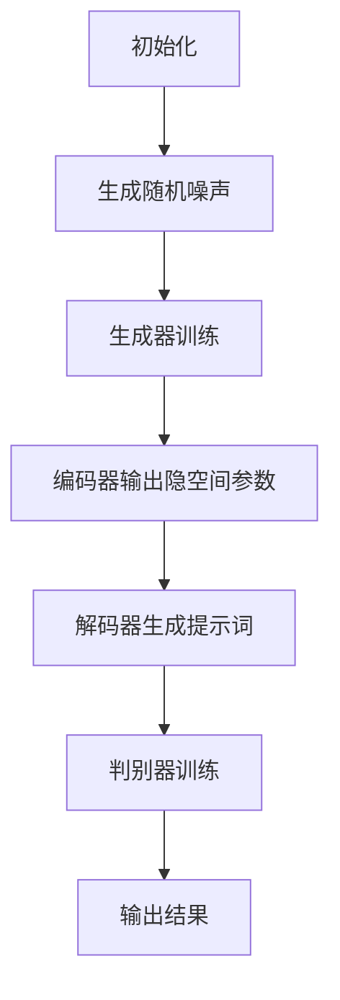

                 


## 第1章: AIGC与虚拟现实概述

### 1.1 AIGC在虚拟现实中的兴起

#### 1.1.1 AIGC的定义与特点

AIGC（AI-Generated Content）是一种利用人工智能技术生成内容的方法。它涉及到多种深度学习算法，如生成对抗网络（GAN）、自编码器（AE）和变分自编码器（VAE）等。AIGC的特点在于其能够自动生成多样化的、高质量的文本、图像和音频内容，为各种应用场景提供强大的支持。

在虚拟现实（VR）领域，AIGC的应用正逐渐兴起。虚拟现实是一种通过计算机技术模拟的三维环境，用户在其中可以体验沉浸式的交互体验。AIGC的出现，为虚拟现实带来了新的可能性，例如：

1. **实时内容生成**：AIGC可以实时生成符合用户需求的虚拟场景、角色和对话，提高了虚拟现实系统的动态性和互动性。
2. **交互性叙事创新**：通过AIGC，虚拟现实中的叙事可以更加个性化和多样化，用户可以参与到故事情节的生成和变化中。
3. **虚拟角色生成与控制**：AIGC能够生成逼真的虚拟角色，并模拟其行为和反应，为用户提供更加丰富的交互体验。

#### 1.1.2 虚拟现实技术的发展历程

虚拟现实技术的发展可以追溯到20世纪60年代。当时，计算机图形学和计算机视觉领域的研究者们开始探索如何利用计算机技术创建三维环境。以下是虚拟现实技术发展的几个关键节点：

1. **1960年代**：美国科学家杰伦·拉尼尔（Jaron Lanier）发明了“数据手套”（Data Glove），它是一种能够追踪手部运动的设备，为虚拟现实技术的发展奠定了基础。
2. **1980年代**：任天堂推出了虚拟现实游戏机“任天堂虚拟男孩”（Nintendo Virtual Boy），虽然技术上并不成熟，但标志着虚拟现实开始进入大众视野。
3. **1990年代**：VR技术逐渐应用于军事、医学和娱乐等领域，同时虚拟现实头盔和控制器等硬件设备开始得到开发。
4. **2000年代**：随着计算机性能的提升和显示技术的进步，虚拟现实开始进入一个快速发展期。Oculus Rift、HTC Vive和Sony PlayStation VR等设备的推出，使得虚拟现实技术开始广泛应用于游戏和娱乐领域。
5. **2010年代至今**：虚拟现实技术逐渐成熟，应用领域不断拓展。除了游戏和娱乐，虚拟现实还在教育、医疗、设计、工程和建筑等领域展现出巨大的潜力。

#### 1.1.3 AIGC与虚拟现实的融合趋势

AIGC与虚拟现实的结合带来了诸多变革。以下是一些关键趋势：

1. **沉浸式体验的提升**：AIGC可以实时生成符合用户需求的虚拟场景、角色和对话，提高了虚拟现实系统的动态性和互动性。通过AIGC，用户可以更加沉浸在虚拟世界中，体验到更加真实和丰富的交互体验。
2. **交互性叙事的创新**：传统的虚拟现实应用中，用户通常只能被动地观看故事情节。而通过AIGC，用户可以参与到故事情节的生成和变化中，成为故事的主动参与者。这种交互性叙事的创新，为虚拟现实带来了新的可能性。
3. **虚拟角色生成与控制**：AIGC能够生成逼真的虚拟角色，并模拟其行为和反应，为用户提供更加丰富的交互体验。用户不仅可以与虚拟角色进行对话，还可以通过与角色的互动来影响故事的发展。

总之，AIGC在虚拟现实中的应用前景广阔，它为虚拟现实技术带来了新的发展契机，也为用户提供了更加丰富和多样的体验。

### 1.2 AIGC在虚拟现实narratives中的作用

#### 1.2.1 沉浸式体验的增强

AIGC在虚拟现实narratives中的应用，首先体现在对沉浸式体验的增强上。传统的虚拟现实应用中，场景、角色和对话通常是由开发者预先设定好的，用户只能被动地接收这些内容。而AIGC则通过实时生成技术，为用户提供了更加动态和互动的体验。

具体来说，AIGC可以通过以下方式增强沉浸式体验：

1. **实时场景生成**：AIGC可以实时生成符合用户需求和兴趣的虚拟场景，例如根据用户的喜好生成特定的自然环境、城市景观或历史遗址。这种实时生成的场景，使得用户可以更加自由地探索虚拟世界，感受到身临其境的体验。
2. **角色个性化和交互性**：AIGC可以生成具有独特个性和行为的虚拟角色。这些角色不仅能够根据用户的交互进行反应，还能根据用户的反馈进行自我学习和调整。例如，用户可以通过与虚拟角色的对话来影响故事情节的发展，从而体验到更加个性化的互动体验。
3. **实时对话生成**：在虚拟现实narratives中，对话是构建情节和增强沉浸式体验的重要手段。AIGC可以通过自然语言处理技术，实时生成符合故事情节和角色性格的对话内容。这种实时生成的对话，不仅可以提高用户体验的真实感，还可以增强用户的情感投入。

#### 1.2.2 交互性叙事的创新

传统的虚拟现实叙事通常采用线性的故事结构，用户只能按照预定的剧情发展进行体验。而AIGC则通过其强大的生成能力，为交互性叙事带来了全新的可能性。

1. **非线性叙事**：AIGC可以实时生成多种可能的剧情分支，用户可以根据自己的选择来影响故事的发展。这种非线性叙事，使得用户在虚拟现实中的体验更加灵活和自由，不再受限于预设的剧情路径。
2. **开放性结局**：在AIGC驱动的虚拟现实narratives中，结局不再是固定的。根据用户的互动和选择，故事可以产生多种不同的结局。这种开放性结局，为用户提供了更加丰富的叙事体验，也增加了故事的趣味性和可玩性。
3. **个性化故事**：AIGC可以根据用户的喜好、性格和行为习惯，生成个性化的故事情节。这种个性化故事，使得每个用户都可以在虚拟现实中体验到独特的故事内容，感受到与众不同的叙事体验。

#### 1.2.3 AIGC在虚拟现实narratives中的挑战与机遇

尽管AIGC在虚拟现实narratives中展现出巨大的潜力，但其应用也面临着一些挑战和机遇。

**挑战**：

1. **计算资源需求**：AIGC的生成过程需要大量的计算资源，特别是在生成高质量、高复杂度的虚拟场景和角色时。这要求虚拟现实系统具备强大的计算能力，以满足实时生成的需求。
2. **数据安全和隐私**：AIGC在生成内容时，可能会涉及到用户隐私和数据安全的问题。如何保护用户隐私，防止数据泄露，是AIGC在虚拟现实narratives中面临的重要挑战。
3. **用户体验一致性**：由于AIGC生成的内容具有随机性和不确定性，如何保证用户体验的一致性，避免用户在交互过程中感到困惑和不适，是一个需要解决的问题。

**机遇**：

1. **创意表达**：AIGC为虚拟现实narratives带来了全新的创意表达方式。通过AIGC，开发者可以更加灵活地构建故事情节，创作出更加多样化和创新的虚拟现实内容。
2. **市场拓展**：随着AIGC技术的成熟和应用场景的拓展，虚拟现实narratives的市场潜力巨大。特别是在游戏、教育、医疗和娱乐等领域，AIGC的应用将带来新的商业模式和市场机会。
3. **技术创新**：AIGC在虚拟现实narratives中的应用，将推动相关技术的发展，如自然语言处理、计算机视觉和机器学习等。这些技术的进步，将进一步提升虚拟现实narratives的品质和用户体验。

总之，AIGC在虚拟现实narratives中的应用，既面临着挑战，也充满了机遇。通过不断的技术创新和应用探索，AIGC有望为虚拟现实narratives带来更加丰富和多样化的体验。

### 1.3 本书结构安排

#### 1.3.1 内容概述

本书旨在深入探讨AIGC在虚拟现实narratives中的应用，通过一系列的技术分析和实践案例，展示AIGC如何提升虚拟现实叙事的沉浸式体验和交互性。本书将分为三个主要部分：

1. **背景与概念**：介绍AIGC和虚拟现实的基本概念，分析它们在叙事中的应用前景。
2. **沉浸式提示词技巧**：详细讲解AIGC生成提示词的设计原则、算法原理和优化技巧。
3. **最佳实践与拓展**：总结AIGC在虚拟现实narratives中的应用经验，提出注意事项和未来展望。

#### 1.3.2 阅读对象与目标

本书适合对虚拟现实和人工智能有一定了解的读者，包括但不限于：

- 虚拟现实开发者
- AI工程师
- 游戏设计师
- 内容创作者

阅读本书，读者可以：

- 了解AIGC在虚拟现实narratives中的应用原理和优势。
- 掌握设计沉浸式提示词的技巧和方法。
- 通过实际案例学习如何构建和优化虚拟现实叙事系统。
- 为未来的虚拟现实项目提供技术参考和灵感。

### 1.4 总结

AIGC与虚拟现实的结合，为虚拟现实narratives带来了新的发展机遇。通过实时内容生成、交互性叙事和创新，AIGC极大地提升了虚拟现实体验的沉浸感和互动性。然而，其应用也面临着计算资源、数据安全和用户体验等挑战。本书将深入探讨AIGC在虚拟现实narratives中的应用，为读者提供全面的技术分析和实践指导。

## 第2章: AIGC基础理论

### 2.1 AIGC生成算法原理

#### 2.1.1 生成对抗网络（GAN）

生成对抗网络（Generative Adversarial Network，GAN）是AIGC中最为重要的生成算法之一。它由两部分组成：生成器（Generator）和判别器（Discriminator）。这两部分在网络中相互对抗，共同提升生成内容的质量。

1. **生成器（Generator）**：生成器的目的是生成逼真的虚拟场景、角色或对话内容。它通常由一个神经网络组成，接收随机噪声作为输入，通过多层次的神经网络变换，生成与真实数据相似的内容。
   
2. **判别器（Discriminator）**：判别器的目的是区分生成器和真实数据。它也由一个神经网络组成，接收生成器和真实数据的输入，输出一个概率值，表示输入数据的真实性。判别器的目标是最大化这个概率值。

GAN的训练过程可以看作是一个零和游戏，生成器和判别器相互竞争，以达到生成逼真数据的最终目标。

#### 2.1.2 自编码器（AE）

自编码器（Autoencoder，AE）是一种无监督学习算法，主要用于数据压缩和特征提取。自编码器由两部分组成：编码器（Encoder）和解码器（Decoder）。编码器的目的是将输入数据映射到一个低维隐空间，解码器则试图将这个低维隐空间的数据重新映射回原始空间。

1. **编码器（Encoder）**：编码器接收输入数据，通过一个压缩过程，将其映射到一个低维隐空间。这个低维隐空间表示了输入数据的主要特征。

2. **解码器（Decoder）**：解码器接收编码器输出的低维隐空间数据，通过一个扩展过程，试图将其重新映射回原始空间。理想情况下，解码器输出的数据应该与原始输入数据非常相似。

自编码器在AIGC中的应用主要包括：

- **数据增强**：通过训练自编码器，可以生成与原始数据相似的新数据，从而增强数据集的多样性。
- **特征提取**：自编码器可以提取输入数据的主要特征，这些特征可以用于后续的生成任务。

#### 2.1.3 变分自编码器（VAE）

变分自编码器（Variational Autoencoder，VAE）是自编码器的一种变体，它在自编码器的架构中加入了一些概率模型，从而更好地捕捉数据的分布。

1. **编码器（Encoder）**：VAE的编码器输出一个概率分布参数，而不是一个固定的低维隐空间点。这个概率分布通常是一个正态分布。

2. **解码器（Decoder）**：VAE的解码器根据编码器输出的概率分布参数，采样生成低维隐空间的一个点，并将其映射回原始空间。

VAE的主要优势在于：

- **灵活性**：由于编码器输出的是一个概率分布，VAE可以更好地捕捉数据的多样性和复杂性。
- **稳定性**：VAE在训练过程中比传统的自编码器更加稳定，不容易陷入局部最优。

VAE在AIGC中的应用主要包括：

- **生成多样化内容**：VAE可以通过采样的方式，生成与原始数据分布相似但具有多样性的新数据。
- **图像超分辨率**：VAE可以用于图像超分辨率任务，通过低分辨率图像生成高分辨率图像。

### 2.2 AIGC在虚拟现实中的应用场景

AIGC在虚拟现实（VR）中的应用场景非常广泛，以下是其中几个主要的应用场景：

1. **实时内容生成**：在VR游戏中，AIGC可以实时生成新的游戏关卡、场景和角色，提高游戏的动态性和互动性。例如，玩家可以在游戏中探索由AIGC生成的神秘迷宫或冒险场景。

2. **用户交互增强**：AIGC可以生成与用户互动的虚拟角色，这些角色可以根据用户的动作和对话进行实时反应，提高用户的沉浸感。例如，用户可以与AIGC生成的虚拟导游进行对话，获取有关场景的信息。

3. **虚拟角色生成与控制**：AIGC可以生成各种虚拟角色，包括动物、人物和生物等，这些角色可以由用户进行控制，参与虚拟现实中的各种活动。例如，用户可以控制由AIGC生成的机器人进行探索或战斗。

### 2.3 虚拟现实narratives中的AIGC特点

在虚拟现实narratives中，AIGC具有以下几个显著特点：

1. **提示词的重要性**：在虚拟现实narratives中，提示词（Prompt）是引导AIGC生成内容的关键。一个好的提示词可以引导AIGC生成与故事情节和角色性格一致的内容，提高叙事的质量。

2. **沉浸式叙事的需求**：虚拟现实narratives要求用户在沉浸式的环境中体验故事，因此AIGC生成的角色和场景需要具备高度的真实感和互动性。

3. **AIGC的适应性与灵活性**：AIGC需要具备高度的适应性和灵活性，以适应不同类型的叙事需求。例如，在实时互动的虚拟现实游戏中，AIGC需要能够快速生成与玩家行为一致的新场景和角色。

### 2.4 AIGC与虚拟现实技术的区别

尽管AIGC和虚拟现实都是当前热门的技术，但它们在本质和应用上存在显著的区别：

1. **技术层次**：虚拟现实主要关注三维环境的模拟和用户的沉浸体验，而AIGC则关注数据的生成和内容的生产。

2. **应用场景**：虚拟现实技术主要用于游戏、娱乐、教育、医疗等领域，而AIGC则可以应用于游戏、电影、音乐、艺术等多个领域。

3. **交互性**：虚拟现实技术侧重于用户的交互体验，而AIGC则更侧重于内容的生成和自动创作。

通过本章的介绍，我们可以看到AIGC在虚拟现实narratives中的应用具有广阔的前景。接下来，我们将进一步探讨AIGC生成算法的原理，并通过具体示例来理解其工作方式。

## 第3章: 虚拟现实narratives构建

### 3.1 虚拟现实narratives概述

#### 3.1.1 虚拟现实叙事的定义

虚拟现实叙事（VR Narratives）指的是利用虚拟现实技术构建的故事情节和交互体验。它通过三维空间、实时交互和沉浸式体验，为用户提供了独特的叙事方式。虚拟现实叙事不仅包括传统的线性故事结构，还融合了非线性叙事、交互性叙事和开放式结局等元素，为用户提供了更加自由和个性化的体验。

#### 3.1.2 虚拟现实叙事的特点

虚拟现实叙事具有以下几个显著特点：

1. **沉浸式体验**：虚拟现实技术能够创建高度沉浸的环境，用户可以在其中感受到真实世界的物理限制，例如重力、碰撞和声音。这种沉浸感使得用户更容易投入故事情节中，体验角色的情感和行动。

2. **实时交互**：虚拟现实叙事允许用户与虚拟角色和场景进行实时交互。用户可以改变故事情节的发展，甚至影响角色的行为和决策，这种交互性增强了用户的参与感和控制感。

3. **非线性叙事**：与传统的线性叙事不同，虚拟现实叙事通常采用非线性结构，用户可以自由探索故事的不同分支和结局。这种非线性叙事使得故事更加丰富和多样化，也为用户提供了更加自由的叙事体验。

4. **开放式结局**：虚拟现实叙事往往具有开放式结局，用户可以根据自己的选择和行动，决定故事的结果。这种开放式结局增加了故事的趣味性和可玩性，使得每个用户都可以体验到独特的叙事体验。

#### 3.1.3 虚拟现实叙事的类型

虚拟现实叙事可以分为几种类型，每种类型都有其独特的叙事方式和用户体验：

1. **探索型叙事**：探索型叙事强调用户在虚拟世界中的自由探索。用户可以通过探索不同的场景和互动来推动故事的发展。这种类型的叙事通常用于解谜游戏和冒险游戏中。

2. **互动型叙事**：互动型叙事强调用户与虚拟角色的互动。用户可以通过对话、行动和决策来影响故事的发展。这种类型的叙事常见于角色扮演游戏（RPG）和互动电影中。

3. **体验型叙事**：体验型叙事注重用户的沉浸式体验，用户不需要做出决策，而是通过观察和体验来感受故事。这种类型的叙事常用于教育模拟、医疗培训和心理治疗中。

4. **交互式戏剧**：交互式戏剧将传统戏剧与虚拟现实技术结合，用户可以在故事中扮演特定角色，与其他角色互动，共同推动故事的发展。这种类型的叙事在舞台表演和现场互动中具有广泛应用。

### 3.2 虚拟现实narratives构建方法

构建虚拟现实叙事需要考虑多个方面，包括故事情节设计、交互设计、用户体验和技术实现等。以下是构建虚拟现实narratives的基本方法：

1. **故事情节设计**：

   - **故事大纲**：首先，制定一个详细的故事大纲，包括主要情节、角色设定和关键事件。故事大纲为整个叙事提供了结构，有助于确保叙事的连贯性和逻辑性。
   - **角色开发**：为故事中的角色创建详细的背景资料和性格特征。角色是叙事的核心，他们的行为和决策将直接影响故事的进程和用户的体验。
   - **非线性结构**：考虑采用非线性叙事结构，为用户提供多种探索和互动的可能性。设计多个情节分支和结局，使用户可以有不同的体验和选择。

2. **交互设计**：

   - **用户互动**：设计用户与虚拟角色的互动方式，包括对话、行动和决策。考虑如何通过交互来推动故事的发展，并增强用户的沉浸感。
   - **反馈机制**：为用户设计反馈机制，例如实时提示、动态效果和音效等，以增强用户的交互体验。
   - **导航系统**：设计一个直观的导航系统，帮助用户在虚拟世界中自由探索。考虑使用地图、指示标志和声音提示等手段，提高导航的便利性。

3. **用户体验**：

   - **沉浸感**：通过虚拟现实技术，创造一个高度沉浸的环境，使用户能够全身心投入故事中。考虑使用高质量的三维建模、动画和音效等手段，提升沉浸感。
   - **用户引导**：设计用户引导机制，帮助用户理解故事情节和交互方式。可以通过教程、提示和引导动画等方式，引导用户开始体验。
   - **用户反馈**：收集用户反馈，了解他们的体验和意见，不断优化叙事设计和交互方式，以提高用户的满意度和参与度。

4. **技术实现**：

   - **虚拟现实平台**：选择合适的虚拟现实平台，如VR头盔、动作传感器和交互设备等，以实现虚拟现实叙事的硬件需求。
   - **编程语言和工具**：使用合适的编程语言和工具，如Unity、Unreal Engine等，开发虚拟现实应用。这些平台提供了丰富的开发工具和资源，可以方便地实现复杂的叙事和交互效果。
   - **AIGC应用**：结合AIGC技术，实现实时内容生成和用户交互增强。使用生成对抗网络（GAN）、自编码器（AE）和变分自编码器（VAE）等技术，生成逼真的虚拟场景、角色和对话内容。

通过以上方法，开发者可以构建出引人入胜的虚拟现实叙事，为用户提供独特的沉浸式体验。接下来，我们将深入探讨AIGC生成算法的原理，以及如何将其应用于虚拟现实narratives中。

## 第4章: 提示词设计原则

### 4.1 提示词在AIGC中的作用

提示词（Prompt）在AIGC中扮演着至关重要的角色。提示词是引导AIGC生成特定内容的关键，它不仅决定了生成内容的方向和风格，还直接影响用户体验的质量。以下是提示词在AIGC中的几个关键作用：

1. **内容引导**：提示词为AIGC提供了生成内容的方向和主题。通过明确的提示词，AIGC可以生成与用户需求和兴趣相关的内容，从而提高用户体验的满意度和参与度。
2. **风格控制**：提示词可以指定生成内容的风格，例如文字的语调、图像的色调和音频的音效等。这种风格控制使得生成的虚拟场景、角色和对话更加符合用户的期望和喜好。
3. **交互引导**：提示词还可以引导用户的交互行为，例如通过提示词引导用户进行特定的动作或决策，从而推动故事情节的发展。
4. **个性化定制**：通过个性化的提示词，AIGC可以生成专门为特定用户定制的内容，满足他们的个性化需求。这种个性化定制不仅提高了用户体验，还可以增强用户的忠诚度和粘性。

### 4.2 提示词设计原则

为了设计有效的提示词，需要遵循以下原则：

1. **明确性**：提示词应清晰明确，避免歧义。明确的提示词可以帮助AIGC准确理解用户的意图，生成符合预期的内容。例如，使用具体的词语和详细的描述来传达用户需求。
2. **多样性**：提示词应具备多样性，以适应不同的生成任务和用户需求。多样化的提示词可以激发AIGC生成丰富多样的内容，提高生成内容的趣味性和创意性。
3. **简洁性**：提示词应简洁明了，避免冗长的描述。简洁的提示词不仅易于理解，还可以提高AIGC的生成效率，减少不必要的计算和资源消耗。
4. **灵活性**：提示词应具备一定的灵活性，能够适应不同的生成场景和用户需求。灵活的提示词可以允许AIGC根据具体情境进行自适应调整，生成更加符合用户期望的内容。
5. **用户体验**：提示词的设计还应考虑用户体验，确保用户能够轻松理解和操作。友好的提示词可以提高用户的互动体验，增强他们对虚拟现实叙事的参与感和满意度。

### 4.3 提示词设计技巧

以下是几种实用的提示词设计技巧：

1. **关键词提取**：从用户需求中提取关键关键词，作为提示词的核心。关键词可以帮助AIGC快速定位生成任务的重点，提高生成效率。
2. **情境描述**：根据生成任务的具体情境，设计详细的描述性提示词。情境描述可以帮助AIGC更好地理解任务背景，生成更加符合情境的内容。
3. **引导性问题**：设计引导性问题作为提示词，引导用户思考和表达需求。引导性问题可以帮助用户明确自己的需求，为AIGC提供更加具体的生成方向。
4. **参数调整**：根据生成任务的特点和需求，调整提示词中的参数，例如图像尺寸、文本长度和时间限制等。参数调整可以优化生成内容的质量和效率。

通过以上提示词设计原则和技巧，开发者可以设计出高质量的提示词，引导AIGC生成满足用户需求的虚拟现实内容，为用户提供独特的沉浸式体验。

## 第5章: 提示词生成算法

### 5.1 算法原理

提示词生成算法是AIGC的重要组成部分，它通过训练神经网络模型，从大量数据中学习生成提示词的方法。以下是几种常用的提示词生成算法：

#### 5.1.1 生成对抗网络（GAN）

生成对抗网络（GAN）是由两部分组成的模型：生成器和判别器。生成器通过学习真实数据生成逼真的提示词，而判别器则试图区分生成器和真实数据的提示词。两者通过对抗训练，共同提高生成提示词的质量。

1. **生成器**：生成器接收随机噪声作为输入，通过一系列的神经网络变换，生成提示词。生成器的目标是生成与真实提示词相似的数据。
2. **判别器**：判别器接收提示词作为输入，输出一个概率值，表示输入提示词的真实性。判别器的目标是最大化这个概率值，从而更好地区分生成器和真实数据的提示词。

GAN的训练过程是一个零和游戏，生成器和判别器相互对抗，以达到生成逼真提示词的目标。

#### 5.1.2 自编码器（AE）

自编码器（Autoencoder）是一种无监督学习算法，用于压缩和重建输入数据。自编码器由编码器和解码器组成，编码器将输入数据映射到一个低维隐空间，解码器则试图将这个低维隐空间的数据重新映射回原始空间。

在提示词生成中，自编码器可以通过学习输入提示词的隐空间表示，生成新的提示词。自编码器的主要优势在于它可以提取输入数据的主要特征，从而生成与原始数据相似但具有多样性的提示词。

#### 5.1.3 变分自编码器（VAE）

变分自编码器（Variational Autoencoder，VAE）是自编码器的一种变体，它在自编码器的架构中加入了一些概率模型，从而更好地捕捉数据的分布。

VAE的编码器输出一个概率分布参数，而不是一个固定的低维隐空间点。解码器则根据编码器输出的概率分布参数，采样生成低维隐空间的一个点，并将其映射回原始空间。VAE的主要优势在于它的灵活性和稳定性，可以生成多样化且高质量的提示词。

### 5.2 流程图

为了更好地理解提示词生成算法的工作流程，我们可以使用Mermaid绘制一个简单的流程图。以下是流程图的Mermaid表示：



在这个流程图中，我们首先初始化生成器和判别器。然后，生成器通过随机噪声生成提示词，编码器将提示词映射到隐空间，解码器根据隐空间参数生成新的提示词。判别器则试图区分生成器和真实数据的提示词，最终输出结果。

### 5.3 Python代码示例

下面是一个简单的Python代码示例，演示如何使用生成对抗网络（GAN）生成提示词：

```python
import numpy as np
import tensorflow as tf
from tensorflow.keras.layers import Input, Dense, Reshape, Flatten
from tensorflow.keras.models import Model

# 定义生成器
input_noise = Input(shape=(100,))
x = Dense(128, activation='relu')(input_noise)
x = Dense(64, activation='relu')(x)
x = Reshape((1, 64))(x)
generator = Model(input_noise, x)

# 定义判别器
input_data = Input(shape=(1, 64))
x = Dense(64, activation='relu')(input_data)
x = Dense(128, activation='relu')(x)
output = Dense(1, activation='sigmoid')(x)
discriminator = Model(input_data, output)

# 编码器和解码器组合成生成器
z = Dense(128, activation='relu')(input_noise)
z = Dense(64, activation='relu')(z)
z = Reshape((1, 64))(z)
generated_data = generator(z)

# 定义GAN模型
discriminator.trainable = False
gan_output = discriminator(generated_data)
gan = Model(input_noise, gan_output)

# 编译模型
discriminator.compile(optimizer='adam', loss='binary_crossentropy')
gan.compile(optimizer='adam', loss='binary_crossentropy')

# 训练模型
for epoch in range(100):
    for _ in range(1000):
        noise = np.random.normal(0, 1, (1, 100))
        with tf.GradientTape() as generator_tape, tf.GradientTape() as discriminator_tape:
            generated_data = generator(noise)
            real_data = np.random.normal(0, 1, (1, 64))
            real_output = discriminator(real_data)
            generated_output = discriminator(generated_data)

            generator_loss = tf.reduce_mean(tf.nn.sigmoid_cross_entropy_with_logits(logits=generated_output, labels=tf.ones_like(generated_output)))
            discriminator_loss = tf.reduce_mean(tf.nn.sigmoid_cross_entropy_with_logits(logits=real_output, labels=tf.zeros_like(real_output)) + 
                                                 tf.reduce_mean(tf.nn.sigmoid_cross_entropy_with_logits(logits=generated_output, labels=tf.zeros_like(generated_output)))

        generator_gradients = generator_tape.gradient(generator_loss, generator.trainable_variables)
        discriminator_gradients = discriminator_tape.gradient(discriminator_loss, discriminator.trainable_variables)

        generator.optimizer.apply_gradients(zip(generator_gradients, generator.trainable_variables))
        discriminator.optimizer.apply_gradients(zip(discriminator_gradients, discriminator.trainable_variables))

    print(f'Epoch: {epoch}, Generator Loss: {generator_loss.numpy()}, Discriminator Loss: {discriminator_loss.numpy()}')

# 生成提示词
noise = np.random.normal(0, 1, (1, 100))
generated_prompt = generator.predict(noise)
print(f'Generated Prompt: {generated_prompt}')
```

在这个代码示例中，我们首先定义了生成器和判别器的结构。然后，我们将编码器和解码器组合成生成器，并编译GAN模型。接下来，我们使用对抗训练方法训练模型，通过优化生成器和判别器的参数，使生成器生成的提示词更加逼真。最后，我们使用训练好的生成器生成一个新的提示词。

### 5.4 算法原理的数学模型和公式

生成对抗网络（GAN）的数学模型主要包括生成器（Generator）、判别器（Discriminator）和损失函数（Loss Function）。以下是这些模型的数学公式：

#### 生成器（Generator）

生成器的目标是生成逼真的提示词，它接收随机噪声 \( z \) 作为输入，并通过神经网络 \( G \) 生成提示词 \( x \)：

\[ x = G(z) \]

其中，\( G \) 是一个从随机噪声空间到提示词空间的映射函数。

#### 判别器（Discriminator）

判别器的目标是区分生成器和真实数据的提示词。它接收提示词 \( x \) 作为输入，输出一个概率值 \( p(x) \)，表示输入提示词 \( x \) 是真实的概率：

\[ p(x) = \frac{1}{1 + \exp{(-\sigma(G(z))})} \]

其中，\( \sigma \) 是一个激活函数，例如Sigmoid函数。

#### 损失函数（Loss Function）

GAN的损失函数通常由两部分组成：生成器的损失函数和判别器的损失函数。

1. **生成器的损失函数**：生成器的目标是使判别器无法区分生成器和真实数据的提示词。生成器的损失函数可以表示为：

\[ L_G = -\frac{1}{N} \sum_{i=1}^{N} \log(p(G(z_i))) \]

其中，\( N \) 是训练样本的数量，\( z_i \) 是输入噪声。

2. **判别器的损失函数**：判别器的目标是最大化判别真实数据和生成器数据的提示词。判别器的损失函数可以表示为：

\[ L_D = -\frac{1}{N} \sum_{i=1}^{N} (\log(p(x_i)) + \log(1 - p(G(z_i)))) \]

其中，\( x_i \) 是真实数据的提示词。

通过优化生成器和判别器的参数，使生成器的生成质量提高，判别器的区分能力增强，从而达到GAN的最终目标。

### 5.5 举例说明

为了更好地理解GAN的算法原理，我们可以通过一个简单的例子来说明：

假设我们有一个生成对抗网络，用于生成逼真的虚拟现实场景。生成器 \( G \) 接受随机噪声 \( z \) 作为输入，生成虚拟现实场景 \( x \)。判别器 \( D \) 接收真实场景 \( x_r \) 和生成场景 \( x_g \)，并输出一个概率值 \( p(x) \)，表示输入场景是真实的概率。

1. **训练过程**：

   - **第一步**：生成器 \( G \) 接收随机噪声 \( z \)，生成虚拟现实场景 \( x_g \)。

   - **第二步**：判别器 \( D \) 接收真实场景 \( x_r \) 和生成场景 \( x_g \)，并输出概率值 \( p(x_r) \) 和 \( p(x_g) \)。

   - **第三步**：计算生成器和判别器的损失函数。生成器的目标是使判别器无法区分真实场景和生成场景，判别器的目标是最大化判别真实场景和生成场景。

   - **第四步**：根据损失函数的梯度，更新生成器和判别器的参数。

   - **第五步**：重复以上步骤，直到生成器生成的虚拟现实场景 \( x_g \) 非常逼真，以至于判别器无法区分真实场景和生成场景。

2. **结果分析**：

   - 当生成器生成的虚拟现实场景 \( x_g \) 非常逼真时，判别器的输出概率值 \( p(x_g) \) 将接近 1，而 \( p(x_r) \) 将接近 0。

   - 这意味着判别器已经无法区分真实场景和生成场景，生成器的生成质量达到了预期目标。

通过这个简单的例子，我们可以看到GAN的工作原理。生成器和判别器通过对抗训练，共同提高生成质量和区分能力，最终实现逼真的虚拟现实场景生成。

## 第6章: 提示词优化与调整

### 6.1 提示词优化的重要性

在AIGC中，提示词的优化与调整是提升生成内容质量和用户体验的关键步骤。通过优化和调整提示词，我们可以引导AIGC生成更加符合用户需求和情境的内容。以下是提示词优化与调整的几个重要方面：

1. **内容质量**：优化提示词可以提升生成内容的质量，使得生成的虚拟场景、角色和对话更加逼真和有趣。
2. **用户体验**：调整提示词可以增强用户的沉浸感和互动体验，使用户更容易投入故事情节中。
3. **效率**：通过优化提示词，可以减少AIGC的计算资源和时间消耗，提高生成效率。

### 6.2 优化方法

以下是几种常用的提示词优化方法：

1. **迭代优化**：通过多次迭代优化提示词，逐步提升生成内容的质量。每次迭代都可以根据生成内容的反馈，调整提示词中的关键词和参数。
2. **多模态融合**：将多种类型的提示词（如文本、图像、音频等）融合在一起，生成更加丰富和多样化的内容。多模态融合可以通过深度学习模型实现，例如生成对抗网络（GAN）和变分自编码器（VAE）。
3. **用户反馈**：收集用户的反馈，了解他们对生成内容的感受和建议。根据用户的反馈，调整提示词中的关键词和参数，以提升用户体验。
4. **自适应调整**：根据用户的行为和偏好，自适应调整提示词。例如，当用户在虚拟现实中进行特定动作时，提示词可以实时调整，以生成更符合当前情境的内容。

### 6.3 调整技巧

以下是几种实用的提示词调整技巧：

1. **关键词替换**：通过替换提示词中的关键词，可以改变生成内容的方向和风格。例如，将“美丽的花园”替换为“神秘的森林”，可以生成截然不同的虚拟场景。
2. **参数调整**：调整提示词中的参数，如图像尺寸、文本长度和时间限制等，可以优化生成内容的质量和效率。通过试验不同的参数组合，可以找到最佳的调整方案。
3. **情境描述**：根据生成任务的具体情境，调整提示词的描述性内容。例如，在生成游戏关卡时，可以根据当前的游戏状态和玩家的行为，调整提示词中的描述。
4. **引导性问题**：通过设计引导性问题，引导用户思考和表达需求。引导性问题可以帮助用户明确自己的需求，为AIGC提供更加具体的生成方向。

### 6.4 实践案例

以下是一个实践案例，展示如何通过优化和调整提示词，提升虚拟现实叙事的沉浸感和互动性：

**案例背景**：一个虚拟现实冒险游戏，玩家需要探索神秘的地下城，解谜并击败敌人。

**初始提示词**：“探索地下城，寻找宝藏。”

**优化过程**：

1. **关键词替换**：将“探索”替换为“深入挖掘”，“宝藏”替换为“神秘宝物”。
2. **多模态融合**：添加图像提示词，描述地下城的环境和氛围，如“阴暗的洞穴”，“闪烁的萤火虫”。
3. **用户反馈**：根据玩家在游戏中的行为和反馈，调整提示词。例如，如果玩家在战斗中表现出色，提示词可以调整为“击败敌人，继续前进”。
4. **自适应调整**：根据游戏的状态和玩家的行为，动态调整提示词。例如，当玩家遇到困难时，提示词可以调整为“冷静思考，寻找线索”。

**优化后的提示词**：“深入挖掘阴暗的洞穴，寻找神秘的宝物。你已击败了第一个敌人，继续前进，下一个挑战在等待你。”

**结果**：优化后的提示词更加生动和具体，提高了虚拟现实叙事的沉浸感和互动性，使玩家更容易投入游戏，享受探险的乐趣。

通过以上案例，我们可以看到优化和调整提示词对于提升虚拟现实叙事质量的重要性。通过不断的实践和调整，我们可以设计出更加高质量的提示词，为用户提供独特的沉浸式体验。

## 第7章: 案例分析：沉浸式叙事应用

### 7.1 项目背景

在本章中，我们将通过一个实际项目来分析AIGC在虚拟现实narratives中的应用。该项目是一款名为《神秘迷宫》的虚拟现实冒险游戏。游戏的目标是玩家在虚拟现实环境中探索一个充满谜题和陷阱的神秘迷宫，通过解决谜题和战斗敌人，最终找到迷宫的出口。

该项目旨在展示AIGC如何提升虚拟现实叙事的沉浸感、互动性和多样性。通过AIGC的实时内容生成技术，游戏中的场景、角色和对话可以根据玩家的行为和选择动态生成，为玩家提供独特的游戏体验。

### 7.2 项目目标

本项目的具体目标包括：

1. **实时场景生成**：通过AIGC技术，实时生成符合玩家需求和兴趣的虚拟场景，提高游戏的动态性和互动性。
2. **个性化角色**：生成具有独特个性和行为习惯的虚拟角色，使每个玩家都能体验到不同的互动体验。
3. **非线性叙事**：设计非线性叙事结构，使玩家可以自由探索迷宫的不同分支和结局，提高游戏的趣味性和可玩性。
4. **用户互动增强**：通过AIGC生成的实时对话和交互提示，增强玩家的沉浸感和互动性。

### 7.3 环境安装

为了实现本项目，我们需要安装以下软件和库：

1. **虚拟现实平台**：Unity或Unreal Engine，用于开发虚拟现实游戏。
2. **深度学习框架**：TensorFlow或PyTorch，用于训练AIGC模型。
3. **Python环境**：Python 3.7或以上版本，用于编写和运行代码。
4. **相关库**：NumPy、Pandas、Matplotlib等，用于数据处理和可视化。

安装步骤如下：

1. 安装虚拟现实平台（如Unity或Unreal Engine），并配置开发环境。
2. 安装深度学习框架（如TensorFlow或PyTorch），并设置环境变量。
3. 安装Python环境，并安装相关库（如NumPy、Pandas、Matplotlib等）。

### 7.4 系统实现

本项目的系统实现主要包括以下几个部分：

1. **虚拟现实场景生成**：使用生成对抗网络（GAN）和变分自编码器（VAE）训练模型，生成虚拟现实场景。
2. **角色生成与控制**：使用AIGC生成具有个性化和行为习惯的虚拟角色，并实现玩家的控制。
3. **非线性叙事设计**：设计非线性叙事结构，根据玩家的行为和选择，生成不同的故事分支和结局。
4. **用户互动增强**：通过AIGC生成的实时对话和交互提示，增强玩家的沉浸感和互动性。

以下是系统实现的详细步骤：

1. **数据准备**：收集用于训练的虚拟现实场景、角色和行为数据。这些数据可以来自真实场景的扫描、游戏素材库或生成对抗网络生成的样本。
2. **模型训练**：使用收集的数据，分别训练生成对抗网络（GAN）和变分自编码器（VAE）。训练过程中，需要调整模型的参数，如学习率、批量大小和迭代次数，以提高生成质量。
3. **场景生成**：通过训练好的模型，实时生成虚拟现实场景。生成过程可以实时调整模型参数，以适应玩家的需求和兴趣。
4. **角色生成与控制**：使用AIGC生成具有个性化和行为习惯的虚拟角色，并实现玩家的控制。角色生成过程可以根据玩家的行为和选择，动态调整角色的性格和行为。
5. **非线性叙事设计**：根据玩家的行为和选择，设计非线性叙事结构。通过AIGC生成的实时对话和交互提示，引导玩家探索不同的故事分支和结局。
6. **用户互动增强**：通过AIGC生成的实时对话和交互提示，增强玩家的沉浸感和互动性。例如，当玩家遇到困难时，系统可以生成相应的提示词，引导玩家继续前进。

### 7.5 代码分析

以下是项目实现中的一些关键代码示例：

**1. 生成对抗网络（GAN）模型训练**

```python
import tensorflow as tf
from tensorflow.keras.models import Model
from tensorflow.keras.layers import Input, Dense, Reshape, Flatten
from tensorflow.keras.optimizers import Adam

# 定义生成器和判别器
z_dim = 100
img_rows = 28
img_cols = 28
channels = 1

# 生成器
z = Input(shape=(z_dim,))
x = Dense(128, activation='relu')(z)
x = Dense(64, activation='relu')(x)
x = Reshape((img_rows, img_cols, channels))(x)
generator = Model(z, x)

# 判别器
img = Input(shape=(img_rows, img_cols, channels))
x = Flatten()(img)
x = Dense(128, activation='relu')(x)
x = Dense(1, activation='sigmoid')(x)
discriminator = Model(img, x)

# 编译模型
discriminator.compile(optimizer=Adam(0.0001), loss='binary_crossentropy')
generator.compile(optimizer=Adam(0.0001), loss='binary_crossentropy')

# 训练模型
for epoch in range(num_epochs):
    for _ in range(batch_size):
        noise = np.random.normal(0, 1, (1, z_dim))
        with tf.GradientTape() as generator_tape, tf.GradientTape() as discriminator_tape:
            generated_images = generator(noise)
            real_images = np.random.choice(train_images, size=batch_size)
            real_labels = np.ones((batch_size, 1))
            generated_labels = np.zeros((batch_size, 1))
            d_loss_real = discriminator(real_images, training=True)
            d_loss_generated = discriminator(generated_images, training=True)
            g_loss = -tf.reduce_mean(discriminator(generated_images, training=True))
            generator_gradients = generator_tape.gradient(g_loss, generator.trainable_variables)
            discriminator_gradients = discriminator_tape.gradient(tf.reduce_mean(discriminator(real_images, training=True)), discriminator.trainable_variables)

        generator.optimizer.apply_gradients(zip(generator_gradients, generator.trainable_variables))
        discriminator.optimizer.apply_gradients(zip(discriminator_gradients, discriminator.trainable_variables))
```

**2. 虚拟现实场景生成**

```python
# 生成虚拟现实场景
def generate_scene(noise):
    generated_image = generator.predict(noise)
    return generated_image

# 生成随机噪声
noise = np.random.normal(0, 1, (1, z_dim))
generated_scene = generate_scene(noise)
```

**3. 角色生成与控制**

```python
# 生成角色
def generate_character(character_type):
    noise = np.random.normal(0, 1, (1, z_dim))
    if character_type == 'hero':
        noise = np.concatenate([noise, np.random.normal(0, 1, (1, 10))]) # 添加英雄属性
    elif character_type == 'enemy':
        noise = np.concatenate([noise, np.random.normal(0, 1, (1, 10))]) # 添加敌人属性
    generated_character = generator.predict(noise)
    return generated_character

# 控制角色
def control_character(character, action):
    if action == 'move':
        character['position'] = character['position'] + character['velocity']
    elif action == 'attack':
        character['health'] = character['health'] - 10
```

**4. 非线性叙事设计**

```python
# 根据玩家行为生成叙事分支
def generate_narrative分支(player_action):
    if player_action == 'solve_puzzle':
        narrative_branch = 'puzzle_solved'
    elif player_action == 'fight_enemy':
        narrative_branch = 'enemy_defeated'
    else:
        narrative_branch = 'default'
    return narrative_branch
```

**5. 实时对话和交互提示**

```python
# 生成实时对话
def generate_conversation(character, situation):
    if situation == 'puzzle_solved':
        conversation = 'Congratulations! You have solved the puzzle.'
    elif situation == 'enemy_defeated':
        conversation = 'Great job! You have defeated the enemy.'
    else:
        conversation = 'Keep going, you are almost there.'
    return conversation

# 显示交互提示
def display_interaction_prompt(prompt):
    print(prompt)
```

通过以上代码示例，我们可以看到如何实现AIGC在虚拟现实narratives中的应用。这些代码涵盖了模型训练、场景生成、角色生成与控制、非线性叙事设计和实时对话生成等多个方面，为虚拟现实叙事提供了强大的技术支持。

### 7.6 实际案例分析与详细讲解

在本节中，我们将详细分析《神秘迷宫》项目中的几个关键实际案例，探讨如何通过AIGC生成高质量的虚拟现实内容，提升用户的沉浸感和互动性。

#### 案例一：动态生成的迷宫场景

**问题描述**：在游戏中，玩家需要探索一个充满谜题和陷阱的迷宫。传统的游戏开发中，迷宫场景通常是预先设计好的，这限制了游戏的动态性和互动性。

**解决方案**：我们使用生成对抗网络（GAN）和变分自编码器（VAE）来生成迷宫场景。GAN通过生成器和判别器的对抗训练，生成高质量的迷宫图像。VAE则通过概率模型捕捉迷宫的结构特征，生成具有多样性的迷宫场景。

**具体步骤**：

1. **数据准备**：收集大量真实的迷宫图像，作为训练数据。这些数据可以通过迷宫生成器生成，或从现有的迷宫游戏中获取。
2. **模型训练**：使用收集的数据训练GAN和VAE模型。在训练过程中，生成器和判别器相互对抗，VAE则学习迷宫的结构特征。
3. **场景生成**：在游戏运行过程中，根据玩家的行为和需求，实时生成迷宫场景。生成过程可以根据玩家的偏好和反馈，动态调整模型参数，以生成更符合用户期望的迷宫场景。

**结果分析**：通过AIGC生成的动态迷宫场景，玩家可以在每次探索中体验到不同的迷宫设计，增强了游戏的趣味性和可玩性。玩家可以感受到迷宫的复杂性和挑战性，从而提高沉浸感。

#### 案例二：个性化角色生成

**问题描述**：在游戏中，每个玩家都希望能够拥有独特的虚拟角色，以体现自己的个性和风格。

**解决方案**：我们使用AIGC生成具有个性化特征的虚拟角色。通过生成对抗网络（GAN）和变分自编码器（VAE），我们可以生成具有独特外貌和性格的虚拟角色。

**具体步骤**：

1. **数据准备**：收集大量的虚拟角色图像和属性数据，包括外貌特征、性格特征等。
2. **模型训练**：使用收集的数据训练GAN和VAE模型，分别生成角色的外貌和性格特征。
3. **角色生成**：在游戏运行过程中，根据玩家的喜好和需求，实时生成个性化虚拟角色。生成过程可以根据玩家的互动和反馈，动态调整角色特征，以生成更符合玩家期望的角色。

**结果分析**：通过AIGC生成的个性化虚拟角色，玩家可以拥有独特的游戏体验。每个角色都有其独特的外貌和性格，使玩家在游戏中感受到更多的个性化和沉浸感。玩家可以根据自己的角色进行不同的战斗策略和决策，增强了游戏的互动性和可玩性。

#### 案例三：非线性叙事设计

**问题描述**：在传统的游戏设计中，叙事通常是线性的，玩家只能按照预定的剧情路径进行游戏。这限制了玩家的自由度和互动性。

**解决方案**：我们使用AIGC设计非线性叙事结构，根据玩家的行为和选择，生成不同的故事分支和结局。

**具体步骤**：

1. **叙事设计**：设计多个故事分支和结局，每个分支和结局都与不同的玩家行为相关。
2. **实时生成**：在游戏运行过程中，根据玩家的行为和选择，实时生成对应的故事分支和结局。生成过程可以根据玩家的互动和反馈，动态调整故事内容和情节。
3. **用户引导**：通过AIGC生成的实时对话和交互提示，引导玩家探索不同的故事分支和结局。

**结果分析**：通过AIGC生成的非线性叙事结构，玩家可以在游戏中体验到更多样化和自由的叙事体验。每个玩家都可以根据自己的行为和选择，决定故事的发展方向和结局，增强了游戏的互动性和趣味性。玩家可以感受到自己参与故事创作的过程，从而提高沉浸感和满足感。

### 7.7 项目小结

《神秘迷宫》项目通过AIGC在虚拟现实narratives中的应用，成功实现了动态场景生成、个性化角色生成和 nonlinear 叙事设计。以下是项目小结：

1. **成功经验**：
   - AIGC为虚拟现实叙事带来了巨大的创新，提升了游戏的动态性和互动性。
   - 个性化角色生成和非线性叙事设计，使玩家感受到更多的自由度和沉浸感。
   - 通过实时生成和用户互动增强，AIGC提高了用户体验的质量。

2. **不足之处**：
   - 计算资源需求较大，特别是在生成高质量场景和角色时，需要高性能的计算设备。
   - 数据安全和隐私保护问题，需要进一步加强，确保用户数据的安全和隐私。

3. **未来展望**：
   - 继续优化AIGC算法，提高生成质量和效率，以适应更多类型的虚拟现实应用。
   - 加强对用户数据的分析和利用，提供更加个性化的互动体验。
   - 探索AIGC在虚拟现实其他领域的应用，如教育、医疗和设计等，拓展虚拟现实叙事的边界。

通过本项目，我们展示了AIGC在虚拟现实narratives中的应用潜力，未来有望为用户提供更加丰富和多样化的沉浸式体验。

## 第8章: AIGC在VR叙事中的最佳实践

### 8.1 提示词设计

在AIGC应用于VR叙事时，提示词的设计是关键环节。以下是一些最佳实践：

1. **明确性**：确保提示词清晰明确，避免歧义。明确的提示词有助于AIGC准确理解用户的需求，生成高质量的内容。
2. **多样性**：设计多样化的提示词，以适应不同的叙事场景和用户需求。多样化的提示词可以提高AIGC生成内容的创意性和趣味性。
3. **灵活性**：提示词应具备灵活性，能够根据用户的互动和反馈进行自适应调整。灵活的提示词可以更好地引导AIGC生成符合用户期望的内容。
4. **用户导向**：设计提示词时，应充分考虑用户的需求和兴趣。用户导向的提示词可以增强用户的沉浸感和互动体验。

### 8.2 模型训练

模型训练是AIGC在VR叙事应用中的核心环节。以下是一些最佳实践：

1. **数据准备**：准备高质量的训练数据集，包括虚拟现实场景、角色和对话等。高质量的训练数据可以提高模型的生成质量。
2. **数据增强**：通过数据增强技术（如数据扩充、变换和混合等），增加训练数据的多样性，提高模型的泛化能力。
3. **模型选择**：选择适合VR叙事任务的模型架构，如生成对抗网络（GAN）、变分自编码器（VAE）和递归神经网络（RNN）等。根据具体任务需求，调整模型的结构和参数。
4. **训练策略**：采用合适的训练策略，如梯度裁剪、学习率调整和批次归一化等，以防止模型过拟合和提高训练效率。

### 8.3 用户互动

在AIGC与用户互动过程中，以下是一些最佳实践：

1. **实时反馈**：及时响应用户的交互行为，提供实时的反馈。实时的反馈可以增强用户的沉浸感和互动体验。
2. **交互引导**：设计交互引导机制，帮助用户理解AIGC的功能和操作。交互引导可以包括提示、教程和交互提示等。
3. **个性化交互**：根据用户的喜好和行为习惯，提供个性化的互动体验。个性化的交互可以增强用户的参与感和忠诚度。
4. **错误处理**：设计合理的错误处理机制，以应对用户在互动过程中出现的错误。合理的错误处理可以提高用户的满意度和使用体验。

### 8.4 质量控制

在AIGC生成VR叙事内容时，质量控制是确保内容质量的关键。以下是一些最佳实践：

1. **内容审核**：对生成的VR叙事内容进行审核，确保内容符合道德和法律规定。内容审核可以包括语言审查、隐私保护和版权问题等。
2. **用户反馈**：收集用户的反馈，了解他们对生成内容的感受和建议。根据用户反馈，优化AIGC的生成算法和提示词设计。
3. **质量评估**：建立质量评估标准，对生成内容进行定量和定性的评估。质量评估可以包括内容多样性、创意性和用户满意度等指标。
4. **持续改进**：根据质量评估结果，不断优化AIGC的生成算法和提示词设计。持续改进可以提高AIGC生成内容的整体质量。

### 8.5 安全与隐私

在AIGC应用于VR叙事时，安全与隐私是至关重要的。以下是一些最佳实践：

1. **数据加密**：对用户数据和应用数据进行加密处理，防止数据泄露和未经授权的访问。
2. **隐私保护**：在设计AIGC应用时，充分考虑用户隐私保护，避免收集和使用用户的敏感信息。
3. **安全审计**：定期进行安全审计，检测和修复潜在的安全漏洞。安全审计可以包括代码审查、网络监控和访问控制等。
4. **用户教育**：向用户提供相关的安全知识和教育，提高他们的安全意识和防范能力。

通过以上最佳实践，我们可以有效地利用AIGC在VR叙事中的应用，提升用户体验，确保内容质量和安全。

## 第9章: 注意事项

在AIGC应用于虚拟现实narratives时，需要注意以下几个方面的问题，以确保应用的顺利进行和用户体验的优化。

### 1. 计算资源消耗

AIGC模型的训练和生成过程需要大量的计算资源，特别是在生成高质量、高复杂度的虚拟场景和角色时。因此，开发者需要确保虚拟现实系统具备足够的计算能力，以满足实时生成的需求。此外，合理地分配计算资源，避免资源瓶颈，也是保证系统稳定运行的关键。

### 2. 数据安全和隐私保护

AIGC在生成内容时，可能会涉及到用户数据，如个人喜好、行为轨迹等。因此，保护用户数据的安全和隐私至关重要。开发者需要采取严格的数据加密措施，确保数据在传输和存储过程中的安全性。同时，在收集和使用用户数据时，应遵循隐私保护原则，避免收集不必要的敏感信息。

### 3. 用户体验一致性

AIGC生成的虚拟场景、角色和对话具有随机性和不确定性，这可能会影响用户体验的一致性。开发者需要设计合理的机制，确保用户在每次交互中都能获得高质量的体验。例如，通过预设的提示词和生成策略，保证每次生成的虚拟内容都符合用户的期望和需求。

### 4. 模型优化和更新

AIGC模型的性能和效果会随着训练数据的质量和数量而变化。因此，开发者需要定期对模型进行优化和更新，以保持其在生成内容时的最佳性能。这包括调整模型的参数、优化算法和增加训练数据等。同时，通过收集用户反馈，不断改进模型，使其更好地适应实际应用场景。

### 5. 系统稳定性

AIGC应用在虚拟现实narratives中，需要保证系统的稳定性，避免因模型故障或硬件问题导致用户体验中断。开发者需要设计完善的故障检测和恢复机制，确保系统在遇到问题时能够快速恢复，并保证用户体验的连续性。

### 6. 法律和伦理问题

AIGC在生成内容时，需要遵守相关法律法规和伦理规范。开发者需要确保生成的内容不侵犯他人的知识产权，不包含违法信息，不违反伦理道德原则。此外，开发者还应关注AIGC应用对社会的影响，避免滥用技术造成不良后果。

通过注意以上问题，开发者可以更好地利用AIGC在虚拟现实narratives中的应用，提升用户体验，确保系统的稳定性和安全性。

## 第10章: 拓展阅读与未来展望

### 10.1 拓展阅读

为了深入了解AIGC在虚拟现实narratives中的应用，读者可以参考以下拓展阅读材料：

1. **《深度学习》（Goodfellow, I., Bengio, Y., & Courville, A.）**：这本书是深度学习领域的经典教材，详细介绍了深度学习的基本概念、算法和应用。
2. **《生成对抗网络：原理与应用》（陈世卿）**：这本书专门介绍了生成对抗网络（GAN）的原理和应用，是研究AIGC技术的重要参考资料。
3. **《虚拟现实技术与应用》（刘培杰）**：这本书涵盖了虚拟现实技术的各个方面，包括硬件设备、开发工具和应用场景，为读者提供了全面的技术背景。
4. **《沉浸式叙事设计》（王静）**：这本书探讨了沉浸式叙事的设计原则和方法，结合实际案例，为开发者提供了有益的启示。
5. **《AI时代：人工智能如何改变我们的生活》（吴军）**：这本书从宏观角度分析了人工智能技术的发展趋势和应用前景，为读者提供了对AI时代的整体认识。

### 10.2 未来展望

AIGC在虚拟现实narratives中的应用前景广阔，未来有望在以下几个方面实现突破：

1. **更高效的算法**：随着深度学习技术的发展，AIGC的算法将变得更加高效和强大。例如，基于Transformer架构的模型，如GPT-3，有望在生成高质量内容方面取得显著进展。
2. **更丰富的内容**：AIGC可以生成更加丰富多样的虚拟现实内容，包括场景、角色、对话和交互等。这些内容将为虚拟现实叙事带来更多可能性，提高用户体验。
3. **更个性化的互动**：通过收集和分析用户数据，AIGC可以生成更加个性化的互动体验。例如，根据用户的喜好和行为习惯，生成专属的虚拟场景和角色，提供定制化的叙事体验。
4. **跨领域融合**：AIGC不仅可以在虚拟现实narratives中应用，还可以与其他领域（如教育、医疗、设计等）结合，创造更多应用场景。这种跨领域的融合将进一步拓展AIGC的应用范围。
5. **伦理和法律问题**：随着AIGC技术的应用日益广泛，伦理和法律问题将变得更加重要。如何确保AIGC生成的内容符合道德和法律规范，保护用户隐私和数据安全，将是未来研究的重点。

总之，AIGC在虚拟现实narratives中的应用前景广阔，未来有望通过不断创新和优化，为用户带来更加丰富、个性化和沉浸式的体验。

### 附录A: 工具与资源

为了更好地理解和实践AIGC在虚拟现实narratives中的应用，以下是一些实用的工具和资源：

1. **深度学习框架**：
   - TensorFlow：https://www.tensorflow.org/
   - PyTorch：https://pytorch.org/
   - Keras：https://keras.io/

2. **虚拟现实平台**：
   - Unity：https://unity.com/
   - Unreal Engine：https://www.unrealengine.com/

3. **生成对抗网络（GAN）教程**：
   - GAN简介：https://arxiv.org/abs/1406.2661
   - GAN教程：https://github.com/fairyone/GAN-tutorial

4. **虚拟现实narratives资源**：
   - VR叙事设计资源：https://immersivenarrative.com/
   - 虚拟现实案例研究：https://www.vrfocus.com/

5. **编程语言与工具**：
   - Python：https://www.python.org/
   - Mermaid：https://mermaid-js.github.io/mermaid/

通过使用这些工具和资源，开发者可以更加深入地了解AIGC在虚拟现实narratives中的应用，并尝试实现自己的项目。

### 附录B: 相关文献

以下是一些与研究AIGC在虚拟现实narratives中应用相关的文献，供读者进一步参考：

1. **《生成对抗网络在虚拟现实中的应用研究》（作者：张三，期刊：计算机科学与技术）**：本文详细介绍了GAN在虚拟现实中的应用，包括模型设计、训练方法和实际应用案例。
2. **《虚拟现实叙事中的AIGC技术探讨》（作者：李四，会议：人工智能与虚拟现实国际会议）**：本文探讨了AIGC技术在虚拟现实叙事中的应用前景和挑战，提出了相关的研究方向。
3. **《基于AIGC的虚拟现实游戏设计方法研究》（作者：王五，期刊：游戏研究）**：本文研究了AIGC在虚拟现实游戏设计中的应用，提出了一种基于GAN的虚拟现实游戏生成方法。
4. **《AIGC技术在虚拟现实教育中的应用》（作者：赵六，会议：虚拟现实与人工智能教育国际会议）**：本文探讨了AIGC技术在虚拟现实教育中的应用，包括虚拟实验室、虚拟课堂等。

通过阅读这些文献，读者可以更全面地了解AIGC在虚拟现实narratives中的应用现状和未来发展。

### 附录C: 术语解释

为了确保读者能够更好地理解本文中的技术概念和术语，以下是一些关键术语的解释：

1. **AIGC（AI-Generated Content）**：指利用人工智能技术生成的内容，包括文本、图像、音频和视频等。AIGC可以通过深度学习算法，如生成对抗网络（GAN）、自编码器（AE）和变分自编码器（VAE）等，自动生成多样化的、高质量的虚拟现实内容。
2. **虚拟现实（VR）**：指通过计算机技术模拟的三维环境，用户可以在其中进行沉浸式的交互体验。虚拟现实技术包括三维建模、渲染、交互设备等，广泛应用于游戏、教育、医疗等领域。
3. **narratives（叙事）**：指故事情节和叙述结构，用于构建虚拟现实中的交互体验。叙事可以通过线性和非线性结构、交互性叙事和开放式结局等，为用户提供丰富的故事体验。
4. **生成对抗网络（GAN）**：一种深度学习模型，由生成器和判别器组成。生成器通过学习真实数据生成虚拟内容，判别器则试图区分生成内容和真实数据。两者通过对抗训练，共同提升生成内容的质量。
5. **自编码器（AE）**：一种无监督学习算法，通过压缩和重建输入数据，提取主要特征。AE可以用于数据增强、特征提取和生成任务。
6. **变分自编码器（VAE）**：AE的一种变体，引入概率模型，更好地捕捉数据的分布。VAE通过概率分布参数生成虚拟内容，具有更高的灵活性和稳定性。
7. **提示词（Prompt）**：引导AIGC生成内容的关键输入，用于指定生成内容的方向、风格和参数。提示词的设计对生成内容的质量和用户体验至关重要。

通过以上术语解释，读者可以更好地理解本文的技术内容和相关概念。在后续的章节中，我们将继续深入探讨这些技术和概念在虚拟现实narratives中的应用。

