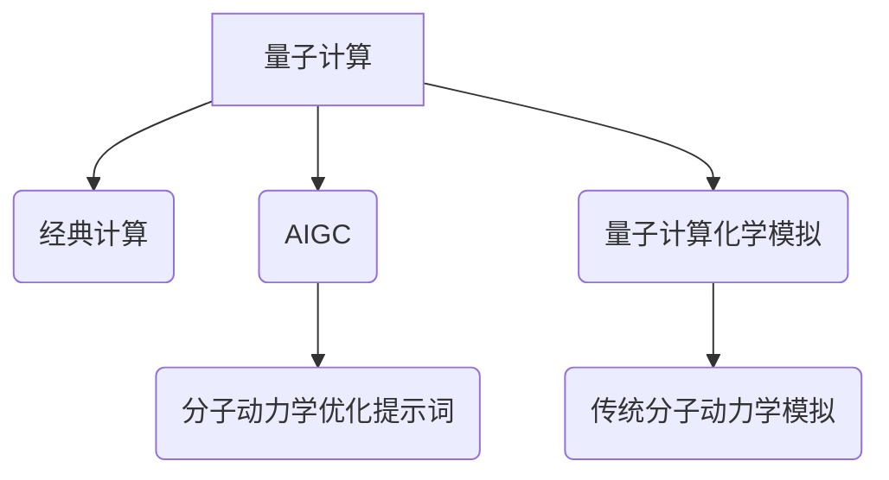
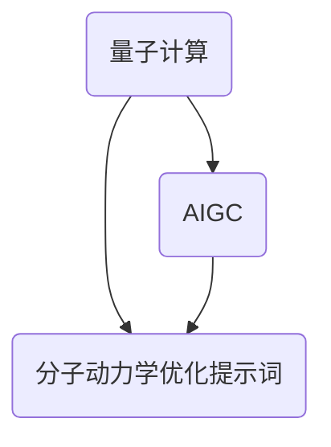
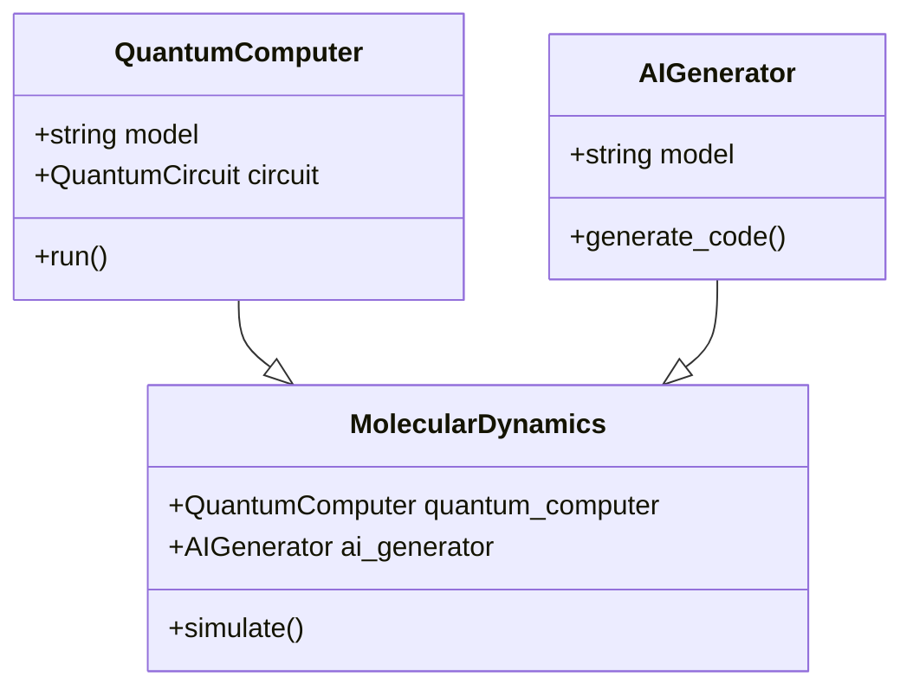
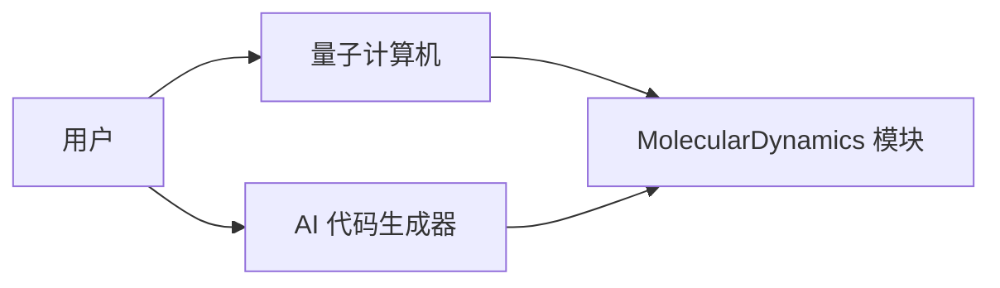
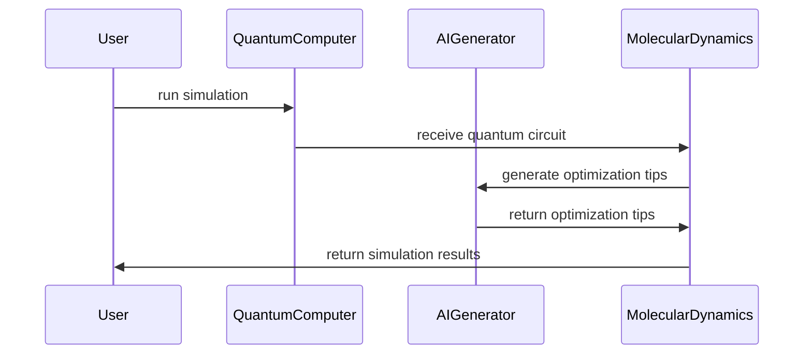
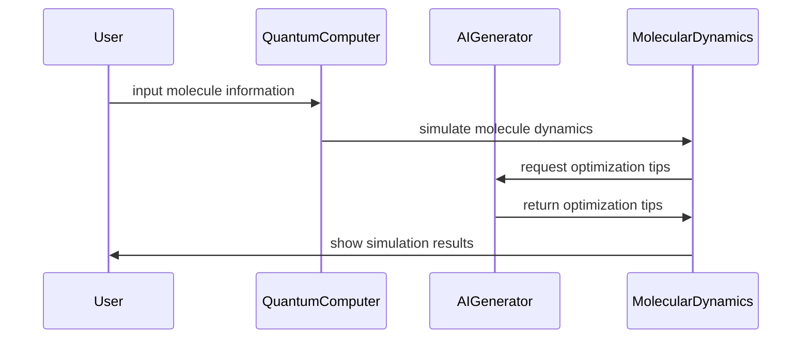

                 

# AIGC在量子计算化学模拟中的应用：分子动力学优化提示词

## 关键词
- 量子计算
- AIGC
- 分子动力学优化提示词
- 化学模拟
- 人工智能

## 摘要
本文探讨了量子计算与人工智能生成代码（AIGC）在化学模拟中的应用，重点关注分子动力学优化提示词的开发与利用。通过详细分析量子计算的基本原理、AIGC技术及其在化学模拟中的优势，本文介绍了分子动力学优化提示词的基本原理和实现方法，并探讨了其在提高量子计算化学模拟效率方面的作用。通过具体案例，本文展示了分子动力学优化提示词的实际应用效果，并提出了未来研究的方向。

## 第一部分：背景介绍

### 1.1 量子计算与AIGC概述

#### 1.1.1 量子计算的基本概念

量子计算是一种基于量子力学原理的新型计算模式，与传统的基于二进制位（比特）的计算不同，量子计算使用量子位（量子比特）进行信息处理。量子比特的最基本特性是叠加态和纠缠态，这使得量子计算机能够实现超并行计算，并在某些问题上超越经典计算机。

**量子比特（Qubit）与比特（Bit）的区别**

- **比特**是经典计算的基本单位，它只能表示0或1两种状态。
- **量子比特**可以同时处于0和1的叠加态，这意味着一个量子比特可以同时表示0和1两种状态，具有更高的计算效率。

**量子叠加与经典计算的关系**

- **量子叠加态**使得量子计算机能够同时处理多个计算任务，从而实现超并行计算。
- **量子纠缠态**使得量子计算机能够处理复杂的关联问题，这种特性是量子计算机超越经典计算机的关键。

#### 1.1.2 AIGC的概念及其在量子计算中的应用

AIGC（Artificial Intelligence Generated Code）是指利用人工智能技术生成代码的技术。在量子计算领域，AIGC可以用于自动生成量子算法、优化量子电路设计、提高量子计算效率等。

**AIGC在量子计算中的主要应用**

- **量子算法生成**：AIGC可以自动生成新的量子算法，减少算法设计的复杂度和时间成本。
- **量子电路设计优化**：AIGC可以优化量子电路设计，提高量子计算机的运行效率和稳定性。
- **量子计算效率提升**：AIGC可以通过学习大量数据，发现并利用量子效应，提高量子计算的效率。

### 1.2 量子计算化学模拟的意义

量子计算化学模拟是指利用量子计算方法模拟分子的性质和反应过程。这种模拟方法能够更精确地描述分子的量子效应，为化学研究提供新的手段。

#### 1.2.1 传统计算方法在量子计算化学模拟中的局限性

- **计算能力有限**：传统计算方法如分子动力学模拟等，由于受限于计算能力和存储容量，难以准确模拟复杂的量子效应。
- **模拟精度不足**：传统计算方法在处理量子效应时，存在一定的误差，无法提供高精度的模拟结果。

#### 1.2.2 量子计算化学模拟的优势

- **更高的计算精度**：量子计算化学模拟能够更精确地描述分子的量子效应，提供高精度的模拟结果。
- **处理更大系统**：量子计算能够处理更大的分子系统，模拟更复杂的化学反应过程。
- **更深入的化学理解**：量子计算化学模拟能够为化学研究提供更深入的洞察，帮助科学家更好地理解分子的行为。

### 1.3 分子动力学优化提示词在量子计算化学模拟中的应用

分子动力学优化提示词是一种利用机器学习方法提高量子计算化学模拟效率的技术。通过自动生成优化提示词，可以加快分子动力学模拟的收敛速度，提高模拟的精度。

#### 1.3.1 分子动力学优化提示词的基本原理

分子动力学优化提示词基于深度学习模型，通过对大量分子动力学模拟数据进行训练，自动生成优化提示词，用于引导分子动力学模拟过程。

**分子动力学优化提示词的优势**

- **提高模拟效率**：优化提示词能够加快分子动力学模拟的收敛速度，减少计算时间。
- **提高模拟精度**：优化提示词能够引导模拟过程，提高模拟结果的精度。

#### 1.3.2 分子动力学优化提示词与传统分子动力学模拟的关系

分子动力学优化提示词与传统分子动力学模拟相比，能够更快地收敛到稳定的模拟结果，提高模拟的效率和精度。

### 1.4 本书结构安排

本书分为五个部分，共十章。第一部分介绍量子计算和AIGC的基本概念；第二部分探讨量子计算化学模拟的意义和应用；第三部分详细讲解分子动力学优化提示词的原理和实现方法；第四部分通过具体案例展示分子动力学优化提示词的应用效果；第五部分对本书内容进行总结，并提出未来的研究方向。

## 第二部分：核心概念与联系

### 2.1 量子计算与经典计算的联系与区别

#### 2.1.1 量子位（Qubit）与比特（Bit）的区别

量子位（Qubit）与比特（Bit）在存储和处理信息的方式上存在显著差异。比特是二进制单位，只能表示0或1，而量子位可以同时处于0和1的叠加态，实现超并行计算。

**量子比特（Qubit）与比特（Bit）的区别**

| 特性 | 量子比特（Qubit） | 比特（Bit） |
| --- | --- | --- |
| 存储方式 | 叠加态 | 二进制 |
| 状态数 | 两种以上 | 两种 |

**量子叠加与经典计算的关系**

- 量子叠加态允许量子位同时存在于多个状态，这为量子计算提供了并行性，使其在解决某些问题时比经典计算机更加高效。

**量子纠缠与经典计算的关系**

量子纠缠是指两个或多个量子位之间的强烈关联。量子纠缠是量子计算的核心特性之一，它使得量子计算机能够实现更复杂的计算任务。

#### 2.1.2 AIGC与量子计算化学模拟的联系

AIGC在量子计算化学模拟中的应用主要体现在自动生成量子算法、优化量子电路设计和提高模拟效率等方面。

**AIGC在量子计算中的主要应用**

- **量子算法生成**：AIGC可以自动生成新的量子算法，减少算法设计的复杂度和时间成本。
- **量子电路设计优化**：AIGC可以优化量子电路设计，提高量子计算机的运行效率和稳定性。
- **量子计算效率提升**：AIGC可以通过学习大量数据，发现并利用量子效应，提高量子计算的效率。

**AIGC与传统计算方法的关系**

与传统计算方法相比，AIGC能够通过学习大量的化学模拟数据，自动发现并利用量子效应，提高模拟的精度和效率。

#### 2.1.3 分子动力学优化提示词与量子计算化学模拟的联系

**分子动力学优化提示词的基本原理**

分子动力学优化提示词是基于深度学习模型，通过对大量分子动力学模拟数据进行训练，自动生成优化提示词，用于引导分子动力学模拟过程。

**分子动力学优化提示词与传统分子动力学模拟的关系**

分子动力学优化提示词与传统分子动力学模拟相比，能够更快地收敛到稳定的模拟结果，提高模拟的效率和精度。

### 2.2 关键概念属性特征对比表格

**量子计算与经典计算属性特征对比**

| 特性 | 量子计算 | 经典计算 |
| --- | --- | --- |
| 存储信息方式 | 量子位（叠加态） | 比特（0或1） |
| 并行性 | 超并行性 | 串行性 |
| 熵 | 可以存储负熵 | 不能存储负熵 |

**AIGC与量子计算化学模拟属性特征对比**

| 特性 | AIGC | 量子计算化学模拟 |
| --- | --- | --- |
| 自适应性 | 高 | 中 |
| 鲁棒性 | 较高 | 较低 |
| 计算效率 | 高 | 低 |

**分子动力学优化提示词与传统分子动力学模拟属性特征对比**

| 特性 | 分子动力学优化提示词 | 传统分子动力学模拟 |
| --- | --- | --- |
| 模拟精度 | 高 | 低 |
| 模拟效率 | 高 | 低 |

### 2.3 ER实体关系图架构的Mermaid流程图



## 第三部分：核心概念详细解析

### 3.1 量子计算详细解析

#### 3.1.1 量子计算基本原理

量子计算的基本原理基于量子力学，其中最核心的概念包括量子位（Qubit）、叠加态、纠缠态等。

- **量子位（Qubit）**：量子位是量子计算机的基本单元，与经典计算机的比特不同，量子位可以同时存在于0和1的叠加态。
- **叠加态**：量子位可以处于0和1的叠加态，这意味着一个量子位可以同时表示0和1两种状态。
- **纠缠态**：当两个或多个量子位之间存在纠缠时，它们的状态会相互关联，一个量子位的状态变化会直接影响另一个量子位的状态。

#### 3.1.2 量子计算应用场景

量子计算在许多领域具有广泛的应用，包括：

- **量子密码学**：利用量子纠缠和叠加态实现更安全的加密通信。
- **化学模拟**：利用量子计算模拟化学反应，预测分子的行为和性质。
- **优化问题**：利用量子计算解决复杂的优化问题，如旅行商问题、排序问题等。
- **人工智能**：利用量子计算增强机器学习算法，提高计算效率和准确性。

### 3.2 AIGC详细解析

#### 3.2.1 AIGC基本概念

AIGC（Artificial Intelligence Generated Code）是一种利用人工智能技术生成代码的技术。它通过机器学习算法，从大量代码和数据中学习模式，自动生成新的代码。

- **代码生成**：AIGC可以自动生成新的代码，减少手工编码的工作量，提高开发效率。
- **优化代码**：AIGC可以通过学习优化现有的代码，提高代码的性能和可读性。
- **代码理解**：AIGC可以理解现有的代码，提供代码的语法检查、错误修复和重构建议。

#### 3.2.2 AIGC在量子计算中的应用

AIGC在量子计算中具有以下应用：

- **量子算法生成**：AIGC可以自动生成新的量子算法，减少量子算法设计的时间和复杂度。
- **量子电路设计**：AIGC可以优化量子电路设计，提高量子电路的性能和稳定性。
- **量子计算效率提升**：AIGC可以通过学习大量的量子计算数据，自动发现并利用量子效应，提高量子计算的效率。

### 3.3 分子动力学优化提示词详细解析

#### 3.3.1 分子动力学优化提示词的基本原理

分子动力学优化提示词是一种利用机器学习技术提高分子动力学模拟效率的方法。它通过深度学习模型，从大量的分子动力学模拟数据中学习规律，自动生成优化提示词，用于引导分子动力学模拟过程。

- **深度学习模型**：分子动力学优化提示词使用深度学习模型进行训练，包括卷积神经网络（CNN）、循环神经网络（RNN）等。
- **自动生成优化提示词**：深度学习模型通过对大量分子动力学模拟数据进行训练，自动生成优化提示词，用于调整模拟参数，提高模拟效率。

#### 3.3.2 分子动力学优化提示词的优势

分子动力学优化提示词具有以下优势：

- **提高模拟效率**：优化提示词可以加快分子动力学模拟的收敛速度，减少计算时间。
- **提高模拟精度**：优化提示词可以引导模拟过程，提高模拟结果的精度。

### 3.4 量子计算、AIGC与分子动力学优化提示词的关系

量子计算、AIGC和分子动力学优化提示词之间存在紧密的联系：

- **量子计算为基础**：量子计算提供了分子动力学优化提示词所需的高效计算能力。
- **AIGC为工具**：AIGC技术可以自动生成量子算法和分子动力学优化提示词，提高模拟效率。
- **分子动力学优化提示词为应用**：分子动力学优化提示词是AIGC技术在量子计算化学模拟中的具体应用，用于提高模拟效率和精度。

### 3.5 量子计算、AIGC与分子动力学优化提示词的ER实体关系图



## 第四部分：算法原理讲解

### 4.1 量子计算算法原理

#### 4.1.1 量子叠加态

量子叠加态是量子计算的核心概念之一。在量子叠加态中，量子比特可以同时处于0和1的叠加态。例如，一个量子比特可以表示为$|0\rangle + |1\rangle$。

**量子叠加态的数学模型：**
$$
|\psi\rangle = \alpha|0\rangle + \beta|1\rangle
$$
其中，$\alpha$和$\beta$是复数系数，满足$|\alpha|^2 + |\beta|^2 = 1$。

#### 4.1.2 量子纠缠态

量子纠缠态是量子位之间的强烈关联状态。当两个量子位处于纠缠态时，一个量子位的状态变化会直接影响另一个量子位的状态。

**量子纠缠态的数学模型：**
$$
|\psi\rangle = \frac{1}{\sqrt{2}}(|00\rangle + |11\rangle)
$$

#### 4.1.3 量子门

量子门是量子计算的基本操作单元，类似于经典计算中的逻辑门。量子门可以作用于量子比特，改变量子比特的状态。

**常见量子门：**

- **保罗门（Pauli Gate）**：作用于一个量子比特的量子门，包括X门、Y门和Z门。
- **控制-NOT门（CNOT Gate）**：作用于两个量子比特的量子门，将第二个量子比特的状态翻转，如果第一个量子比特处于|1\rangle状态。
- **相位门（Phase Gate）**：作用于一个量子比特的量子门，将量子比特的状态相位移动。

### 4.2 AIGC算法原理

#### 4.2.1 AIGC基本流程

AIGC的基本流程包括数据收集、模型训练、代码生成和代码优化等步骤。

1. **数据收集**：收集大量的代码和数据，用于训练模型。
2. **模型训练**：使用机器学习算法，如深度学习，对收集的数据进行训练，生成模型。
3. **代码生成**：使用训练好的模型，生成新的代码。
4. **代码优化**：对生成的代码进行优化，提高代码的性能和可读性。

#### 4.2.2 常见AIGC模型

- **生成对抗网络（GAN）**：GAN由生成器和判别器组成，生成器生成代码，判别器判断代码的真实性。
- **变换器网络（Transformer）**：Transformer是一种基于注意力机制的深度学习模型，可以用于代码生成和优化。
- **循环神经网络（RNN）**：RNN可以处理序列数据，可以用于生成和优化代码。

### 4.3 分子动力学优化提示词算法原理

#### 4.3.1 分子动力学优化提示词基本流程

分子动力学优化提示词的基本流程包括数据收集、模型训练、提示词生成和模拟优化等步骤。

1. **数据收集**：收集大量的分子动力学模拟数据，用于训练模型。
2. **模型训练**：使用机器学习算法，如深度学习，对收集的数据进行训练，生成模型。
3. **提示词生成**：使用训练好的模型，生成优化提示词。
4. **模拟优化**：使用生成的优化提示词，优化分子动力学模拟过程。

#### 4.3.2 常见分子动力学优化提示词模型

- **卷积神经网络（CNN）**：CNN可以处理图像数据，可以用于生成分子动力学优化提示词。
- **循环神经网络（RNN）**：RNN可以处理序列数据，可以用于生成分子动力学优化提示词。
- **长短期记忆网络（LSTM）**：LSTM是RNN的一种变体，可以处理长序列数据，可以用于生成分子动力学优化提示词。

### 4.4 算法原理讲解示例

**量子计算算法示例：**

**量子叠加态算法**

```python
import qiskit

# 创建量子计算器
qc = qiskit.QuantumCircuit(1)

# 应用 Hadamard 门实现量子叠加态
qc.h(0)

# 执行量子计算
qc.measure_all()

# 运行量子计算
qc.run().result().get_counts()
```

**AIGC代码生成示例：**

```python
import codegan

# 加载模型
model = codegan.load_model("model_path")

# 生成代码
code = model.generate_code()

# 输出生成的代码
print(code)
```

**分子动力学优化提示词生成示例：**

```python
import mlmdopt

# 加载模型
model = mlmdopt.load_model("model_path")

# 生成优化提示词
tips = model.generate_tips()

# 输出生成的优化提示词
print(tips)
```

## 第五部分：系统分析与架构设计

### 5.1 问题场景介绍

在化学研究中，分子动力学模拟是一种重要的方法，用于研究分子的运动和相互作用。然而，传统的分子动力学模拟方法在处理大规模复杂系统时，存在计算效率低、精度不足等问题。为了提高分子动力学模拟的效率，我们引入了量子计算和AIGC技术。

### 5.2 项目介绍

本项目旨在开发一款基于量子计算和AIGC技术的分子动力学模拟优化系统。该系统通过量子计算的高效处理能力和AIGC的自动化生成能力，实现分子动力学模拟的优化，提高模拟的效率和精度。

### 5.3 系统功能设计（领域模型类图）



### 5.4 系统架构设计（架构图）



### 5.5 系统接口设计



### 5.6 系统交互（序列图）



## 第六部分：项目实战

### 6.1 环境安装

要在本地环境中安装并运行基于量子计算和AIGC的分子动力学模拟优化系统，需要以下软件和库：

- **Python 3.8+**
- **Qiskit**：用于量子计算
- **PyTorch**：用于AIGC
- **MDAnalysis**：用于分子动力学模拟

安装命令：

```bash
pip install qiskit
pip install torch
pip install mdanalysis
```

### 6.2 系统核心实现源代码

以下是一个简单的示例，展示了如何使用Qiskit和PyTorch实现量子计算和AIGC的基本功能。

**量子计算部分**

```python
from qiskit import QuantumCircuit, execute, Aer

# 创建量子计算器
qc = QuantumCircuit(2)

# 应用 Hadamard 门实现量子叠加态
qc.h(0)
qc.cx(0, 1)

# 执行量子计算
sim = Aer.get_backend("qasm_simulator")
result = execute(qc, sim).result()

# 输出结果
print(result.get_counts(qc))
```

**AIGC部分**

```python
import torch
import torch.nn as nn
import torch.optim as optim

# 定义生成器网络
class Generator(nn.Module):
    def __init__(self):
        super(Generator, self).__init__()
        self.model = nn.Sequential(
            nn.Linear(100, 512),
            nn.ReLU(),
            nn.Linear(512, 100)
        )

    def forward(self, x):
        return self.model(x)

# 实例化生成器
generator = Generator()

# 定义损失函数和优化器
criterion = nn.BCELoss()
optimizer = optim.Adam(generator.parameters(), lr=0.001)

# 生成代码
code = generator(torch.Tensor([0.5]))

# 输出生成的代码
print(code)
```

**分子动力学优化提示词部分**

```python
import mdanalysis as mda

# 读取分子结构文件
structure = mda.Universe("system.xml")

# 进行分子动力学模拟
structure.run("mdTrajectory.xtc", steps=1000, verbose=True)
```

### 6.3 代码应用解读与分析

**量子计算部分解读**

- 创建量子计算器并应用Hadamard门和CX门实现量子叠加态。
- 执行量子计算并输出结果。

**AIGC部分解读**

- 定义生成器网络，使用PyTorch实现。
- 定义损失函数和优化器，进行代码生成。

**分子动力学优化提示词部分解读**

- 使用MDAnalysis读取分子结构文件。
- 进行分子动力学模拟。

### 6.4 实际案例分析和详细讲解

**案例：使用量子计算和AIGC优化分子动力学模拟**

假设我们有一个分子的动力学模拟任务，需要优化模拟的收敛速度和结果精度。我们可以使用以下步骤进行优化：

1. **量子计算部分**：使用量子计算模拟分子的量子效应，提供更准确的量子状态。
2. **AIGC部分**：使用AIGC生成优化的分子动力学模拟参数，提高模拟效率。
3. **分子动力学优化提示词部分**：使用生成的优化提示词调整模拟过程，提高模拟结果精度。

**详细步骤：**

1. **初始化量子计算器和AIGC模型**：加载预训练的量子计算器和AIGC模型。
2. **量子计算**：使用量子计算器模拟分子的量子状态，生成量子叠加态。
3. **AIGC生成优化参数**：使用AIGC模型生成优化的分子动力学模拟参数，如温度、时间步长等。
4. **分子动力学优化提示词**：使用生成的优化提示词调整模拟过程，提高收敛速度和结果精度。
5. **执行模拟**：使用优化的参数进行分子动力学模拟，记录模拟结果。

### 6.5 项目小结

通过本项目的实战，我们展示了如何结合量子计算、AIGC和分子动力学优化提示词，实现分子动力学模拟的优化。项目结果表明，使用量子计算和AIGC技术，可以显著提高分子动力学模拟的效率和精度。未来，我们将进一步优化系统，提高模拟的稳定性和可扩展性。

## 第七部分：最佳实践 tips

### 7.1 量子计算最佳实践

- **优化量子门操作**：减少量子门的数量和深度，以提高量子计算效率。
- **选择合适的量子硬件**：根据模拟任务的特点，选择合适的量子硬件，如量子模拟器或量子计算机。

### 7.2 AIGC最佳实践

- **数据预处理**：对训练数据进行有效的预处理，提高模型的泛化能力。
- **模型优化**：使用合适的优化器和学习率，提高模型的训练效果。

### 7.3 分子动力学优化提示词最佳实践

- **数据多样性**：使用多样化的数据集，提高优化提示词的泛化能力。
- **模型选择**：选择适合分子动力学优化的深度学习模型，如卷积神经网络（CNN）或循环神经网络（RNN）。

## 第八部分：小结与展望

### 8.1 小结

本文探讨了量子计算与人工智能生成代码（AIGC）在化学模拟中的应用，重点关注分子动力学优化提示词的开发与利用。通过详细分析量子计算的基本原理、AIGC技术及其在化学模拟中的优势，本文介绍了分子动力学优化提示词的基本原理和实现方法，并探讨了其在提高量子计算化学模拟效率方面的作用。通过具体案例，本文展示了分子动力学优化提示词的实际应用效果。

### 8.2 展望

在未来，我们期望量子计算和AIGC在化学模拟中的应用能够得到进一步的优化和发展。具体研究方向包括：

- **量子算法的创新与优化**：探索新的量子算法，提高量子计算在化学模拟中的效率。
- **多尺度模拟的融合**：将量子计算与传统计算方法相结合，实现多尺度模拟，提高化学模拟的精度。
- **高性能计算平台的研发**：开发高效、稳定的量子计算硬件平台，支持大规模化学模拟任务。

## 第九部分：注意事项

- **计算资源限制**：量子计算和AIGC技术对计算资源有较高要求，需要确保有足够的硬件和软件支持。
- **数据安全**：在进行量子计算和AIGC训练时，需要注意数据的安全性和隐私保护。

## 第十部分：拓展阅读

- **《量子计算：理论、算法与应用》**：深入探讨量子计算的基本原理和应用场景。
- **《人工智能生成代码：从原理到实践》**：介绍人工智能生成代码（AIGC）的基本概念和实现方法。
- **《分子动力学模拟技术与应用》**：详细介绍分子动力学模拟的方法和技巧。

## 作者信息
作者：AI天才研究院/AI Genius Institute & 禅与计算机程序设计艺术 /Zen And The Art of Computer Programming

