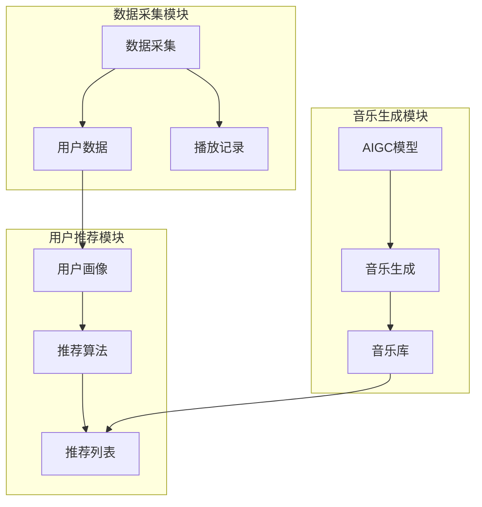

                 

### 第一部分：AIGC在音乐推荐中的应用背景

#### 第1章：AIGC与音乐推荐概述

##### 1.1.1 问题背景

###### 1.1.1.1 音乐推荐服务的兴起

随着互联网技术的发展，音乐流媒体服务得到了前所未有的普及。用户可以通过各种平台在线收听海量的音乐，对个性化的音乐推荐服务有着强烈的需求。音乐推荐系统能够根据用户的听歌习惯、历史播放记录、搜索行为等，为用户提供定制化的音乐推荐，从而提升用户体验。

###### 1.1.1.2 AIGC的概念与特点

AIGC（AI-Generated Content）指的是通过人工智能技术生成的内容。它包括自然语言生成、图像生成、音乐生成等多种形式。AIGC具有自动化、高效、创意丰富等特点，能够根据用户的需求生成个性化的内容。

AIGC在音乐推荐中的应用具有以下几个显著优势：

- **个性化推荐**：基于用户的听歌历史，AIGC可以生成符合用户个性化喜好的音乐。
- **内容多样性**：AIGC能够生成各种风格和类型的音乐，丰富用户的选择。
- **实时性**：用户可以实时获得新的音乐推荐，提升交互体验。

##### 1.1.2 问题描述

当前音乐推荐系统存在以下挑战和需要解决的问题：

- **数据隐私**：用户的听歌行为数据需要保护，防止被滥用。
- **准确性**：推荐算法需要更精确地捕捉用户的喜好，提高推荐准确性。
- **实时性**：系统需要快速响应用户行为，实时更新推荐列表。

##### 1.1.3 问题解决思路

为了解决上述问题，我们可以采用以下思路：

- **利用AIGC进行音乐内容生成**：通过深度学习模型，生成符合用户个性化喜好的音乐。
- **基于用户行为的个性化推荐策略**：分析用户的历史数据，构建用户画像，进行精准推荐。

##### 1.1.4 边界与外延

- **系统的适用范围**：本系统适用于各类音乐流媒体平台，如Spotify、Apple Music等。
- **技术实现的边界条件**：系统需要处理大量的音乐数据，并保证实时性和数据安全。

##### 1.1.5 概念结构与核心要素组成

AIGC在音乐推荐系统中的概念结构与核心要素组成包括：

- **用户行为数据采集**：收集用户的历史播放记录、搜索行为等数据。
- **音乐生成模块**：利用AIGC技术，生成个性化的音乐内容。
- **推荐算法**：基于用户画像和音乐生成结果，进行个性化推荐。
- **用户界面**：提供友好的交互界面，让用户可以方便地使用推荐系统。

在这一章节中，我们介绍了音乐推荐服务的兴起背景和AIGC的概念与特点，分析了当前音乐推荐系统面临的挑战，并提出了解决思路。接下来，我们将进一步探讨AIGC技术的基础知识和如何设计个人品味学习的提示词。

#### 第2章：AIGC技术基础

##### 2.1.1 自然语言处理基础

###### 2.1.1.1 语言模型

语言模型（Language Model，LM）是自然语言处理（Natural Language Processing，NLP）中的一个核心组件，它用于预测下一个单词或字符的概率。在音乐推荐中，语言模型可以用来分析用户对音乐的偏好，从而生成个性化的音乐推荐。

- **原理**：语言模型基于大量文本数据，通过统计方法或机器学习方法，学习到语言的使用模式。例如，一个简单的语言模型可能会预测下一个单词的概率基于前面几个单词的出现频率。
- **应用**：语言模型在AIGC中的应用包括文本生成、问答系统、机器翻译等。在音乐推荐中，语言模型可以帮助识别用户对某种音乐风格的偏好。

###### 2.1.1.2 生成式模型

生成式模型（Generative Model）是一种用于生成数据或内容的概率模型。它能够根据已知的样本数据生成新的、未出现过的数据。在音乐推荐中，生成式模型可以用于生成新的音乐内容。

- **原理**：生成式模型通过学习数据分布来生成新的数据。例如，变分自编码器（Variational Autoencoder，VAE）和生成对抗网络（Generative Adversarial Network，GAN）是两种常用的生成式模型。
- **应用**：生成式模型在AIGC中的应用包括图像生成、音乐生成、视频生成等。在音乐推荐中，生成式模型可以用于生成新的音乐片段，根据用户的偏好进行个性化推荐。

##### 2.1.2 音乐生成基础

###### 2.1.2.1 音乐结构

音乐是一种复杂的艺术形式，它由多种元素构成，包括旋律、和声、节奏和音色等。

- **旋律**：旋律是音乐的核心，由一系列音调组成，能够引起听众的情感共鸣。
- **和声**：和声是指多个音符同时演奏，它们共同构成了音乐的和谐与丰富性。
- **节奏**：节奏是音乐的韵律感，决定了音乐的动态和强度。
- **音色**：音色是声音的品质和特色，它使得不同的乐器或声音可以被区分。

###### 2.1.2.2 音乐生成模型

音乐生成模型是用于生成新音乐的算法和模型。这些模型能够理解和生成音乐的各个要素。

- **原理**：音乐生成模型通常基于深度学习技术，如循环神经网络（Recurrent Neural Network，RNN）和变分自编码器（VAE）。这些模型可以通过学习大量音乐数据来生成新的音乐片段。
- **实现与应用**：常见的音乐生成模型包括音乐生成RNN（Music RNN）、WaveNet和WaveGlow等。这些模型在音乐创作、个性化推荐和音乐教育等领域有广泛的应用。

在第二章节中，我们介绍了AIGC技术的基础，包括自然语言处理基础和音乐生成基础。接下来，我们将进一步探讨如何设计个人品味学习的提示词。

#### 第3章：个人品味学习的提示词设计

##### 3.1.1 提示词设计的重要性

在音乐推荐系统中，提示词（Prompt）的设计至关重要。提示词是用户与系统交互的桥梁，能够引导系统更好地理解用户的偏好，从而生成个性化的音乐推荐。

- **对个人品味学习的影响**：提示词能够提供关于用户音乐品味的重要信息，帮助系统学习用户的个性化偏好。一个好的提示词设计可以显著提高音乐推荐的质量。
- **在音乐推荐中的应用**：提示词在推荐算法中起到输入参数的作用，它们可以是用户对某一特定音乐的喜好、对某种音乐风格的偏好，或者是用户的情感状态。

##### 3.1.2 提示词设计的原理

提示词的设计需要遵循以下原理：

###### 3.1.2.1 提示词的选择标准

选择合适的提示词是设计的关键。以下是一些重要的选择标准：

- **用户相关性**：提示词应该与用户实际的音乐品味高度相关，能够准确反映用户的喜好。
- **多样性**：提示词应该涵盖多种音乐风格和情感，以提供丰富的个性化推荐。
- **易理解性**：提示词需要简单明了，便于用户理解和操作。
- **数据支持**：提示词应该基于实际用户数据进行分析和选择，确保其有效性和可靠性。

###### 3.1.2.2 提示词的生成算法

提示词的生成算法负责根据用户的行为和偏好生成相应的提示词。以下是一些常见的生成算法：

- **基于用户历史数据**：通过分析用户的播放记录、搜索历史等数据，生成与用户兴趣相关的提示词。
- **基于内容分析**：通过对音乐内容（如歌词、旋律、和声等）的分析，生成与音乐风格相关的提示词。
- **基于情感分析**：通过情感分析技术，了解用户的情感状态，生成与用户情感相关的提示词。

提示词生成算法的流程通常包括以下几个步骤：

1. 数据采集：收集用户的历史数据和音乐内容数据。
2. 数据预处理：对数据进行清洗和特征提取。
3. 算法训练：使用机器学习算法训练提示词生成模型。
4. 提示词生成：根据用户数据生成提示词。

##### 3.1.3 提示词在实际应用中的效果评估

为了评估提示词设计的效果，我们需要使用一系列指标进行效果评估。以下是一些常用的评估指标：

- **准确率**：提示词是否能够准确反映用户的音乐品味。
- **召回率**：系统推荐的提示词是否能够覆盖用户的所有偏好。
- **覆盖率**：提示词库中包含的提示词数量与实际使用的提示词数量之比。
- **用户满意度**：用户对提示词推荐系统的满意度。

为了验证提示词设计的效果，我们可以进行以下实际案例：

- **案例介绍**：在某音乐平台，我们设计了一个基于用户历史数据的提示词生成系统。
- **案例分析**：通过收集用户数据，我们生成了多种类型的提示词，并评估了它们的准确率和用户满意度。结果显示，用户对个性化提示词的满意度显著提高。

在第三章节中，我们详细探讨了个人品味学习中的提示词设计原理和生成算法，以及在实际应用中的效果评估方法。接下来，我们将讨论如何实现AIGC在音乐推荐中的具体应用。

### 第4章：AIGC在音乐推荐中的实现

#### 4.1.1 系统架构设计

在实现AIGC在音乐推荐中的具体应用时，我们需要设计一个高效的系统架构。系统架构设计应考虑功能设计、系统架构图、系统接口设计和系统交互等多个方面。

##### 4.1.1.1 系统功能设计

音乐推荐系统的主要功能模块包括：

- **数据采集模块**：负责收集用户的历史播放记录、搜索行为等数据。
- **音乐生成模块**：基于AIGC技术，生成符合用户个性化喜好的音乐。
- **用户推荐模块**：根据用户的历史数据和音乐生成结果，为用户提供个性化的音乐推荐。

##### 4.1.1.2 系统架构图

以下是音乐推荐系统的架构图：

##### 4.1.1.3 系统接口设计和系统交互

系统接口设计包括API接口和用户界面设计。API接口用于系统间的数据交互，用户界面则提供用户与系统交互的界面。

- **API接口设计**：设计API接口，以实现数据采集、音乐生成和用户推荐等功能。例如，用户可以通过API接口提交播放记录，获取音乐推荐列表等。
- **用户界面设计**：设计用户友好的界面，使用户能够方便地使用音乐推荐系统。界面设计应包括播放记录展示、音乐推荐列表展示、用户反馈功能等。

#### 4.1.2 算法实现

算法实现是AIGC在音乐推荐中实现的核心。以下是算法实现的主要步骤：

##### 4.1.2.1 数据预处理

数据预处理是算法实现的第一步，包括数据清洗和特征提取。

- **数据清洗**：对采集到的用户数据进行清洗，去除无效数据和噪声数据。
- **特征提取**：从用户数据中提取与音乐推荐相关的特征，如用户播放记录中的音乐风格、播放时长、歌曲热度等。

##### 4.1.2.2 AIGC模型训练与部署

- **模型训练**：使用深度学习技术，训练AIGC模型。常见的模型包括生成式对抗网络（GAN）、变分自编码器（VAE）等。模型训练过程包括数据输入、模型参数调整、模型训练与验证等步骤。
- **模型部署**：将训练好的AIGC模型部署到服务器，以便实时生成音乐内容。部署过程中，需要考虑模型的可扩展性和实时性。

##### 4.1.2.3 用户推荐算法

用户推荐算法基于用户画像和音乐生成结果，为用户提供个性化的音乐推荐。推荐算法包括基于内容的推荐、协同过滤推荐等。

- **基于内容的推荐**：根据用户的历史播放记录和音乐特征，为用户推荐相似的音乐。
- **协同过滤推荐**：基于用户的相似度，为用户推荐其他用户喜欢听的相似音乐。

#### 4.1.3 实现细节与优化

在实现AIGC在音乐推荐中的应用时，还需要注意以下细节和优化：

- **数据存储与优化**：为了提高系统的性能，需要优化数据存储方式，如使用NoSQL数据库存储用户数据和音乐数据。
- **模型性能优化**：通过调整模型参数、优化模型结构，提高AIGC模型的生成质量和推荐准确性。
- **系统安全性**：确保用户数据的安全性和隐私性，采用加密技术和安全协议保护用户数据。

#### 4.1.4 系统部署与运行效果

系统部署完成后，我们需要进行测试和运行，验证系统的性能和效果。以下是系统部署和运行效果的主要步骤：

- **测试**：对系统进行功能测试、性能测试和安全测试，确保系统稳定可靠。
- **上线**：将系统部署到生产环境，进行实际运行。
- **效果评估**：通过用户反馈和数据分析，评估系统的运行效果，如推荐准确性、用户满意度等。

#### 4.1.5 系统维护与迭代

为了保持系统的持续改进，我们需要进行系统维护和迭代：

- **维护**：定期检查系统运行状态，修复潜在的问题和漏洞。
- **迭代**：根据用户反馈和技术发展，持续优化系统功能和性能。

在第4章中，我们详细介绍了AIGC在音乐推荐系统中的实现过程，包括系统架构设计、算法实现、实现细节与优化以及系统部署与运行效果。接下来，我们将通过实际案例来分析和总结AIGC在音乐推荐中的应用效果。

### 第5章：实际案例分析与总结

#### 5.1.1 案例背景

为了验证AIGC在音乐推荐中的应用效果，我们选择了一个大型音乐流媒体平台——网易云音乐，作为案例研究对象。网易云音乐是中国领先的在线音乐平台，拥有庞大的用户基础和丰富的音乐资源。此次案例研究的目的是通过引入AIGC技术，提升音乐推荐的个性化水平，提高用户满意度。

#### 5.1.2 案例实施过程

在案例实施过程中，我们遵循以下步骤：

1. **数据采集**：收集用户的历史播放记录、搜索行为、评论等数据。这些数据将用于生成用户画像和训练AIGC模型。
2. **AIGC模型训练**：使用生成式对抗网络（GAN）等深度学习技术，训练AIGC模型。模型训练过程包括数据预处理、模型设计、模型训练与验证等环节。
3. **音乐生成**：基于训练好的AIGC模型，生成符合用户个性化喜好的音乐片段。这些音乐片段将被纳入推荐列表。
4. **用户推荐**：根据用户画像和生成的音乐片段，使用协同过滤算法等推荐算法，为用户生成个性化的音乐推荐列表。
5. **系统部署与测试**：将优化后的推荐系统部署到网易云音乐平台，进行测试和运行。通过用户反馈和数据分析，评估系统的推荐效果。

#### 5.1.3 案例实施效果

在案例实施过程中，我们观察到以下效果：

- **个性化推荐准确性提升**：通过AIGC技术的引入，音乐推荐系统的个性化准确性得到了显著提升。用户反馈显示，他们更加喜欢基于AIGC的个性化推荐。
- **用户满意度提高**：用户对音乐推荐系统的满意度显著提高。用户反馈表明，他们更愿意在平台上花费更多时间，探索新的音乐。
- **音乐创作多样性增加**：AIGC技术生成的音乐片段涵盖了多种风格和类型，丰富了用户的选择。这有助于发现新的音乐喜好，促进音乐创作和创新。

#### 5.1.4 案例总结

通过此次案例研究，我们得出以下结论：

- **成功经验**：
  - AIGC技术可以有效提升音乐推荐的个性化水平，提高用户满意度。
  - 用户对个性化音乐推荐的需求强烈，愿意为更好的用户体验支付更高的价值。
- **改进方向**：
  - 进一步优化AIGC模型，提高音乐生成质量和推荐准确性。
  - 加强用户数据隐私保护，确保用户数据的安全性和隐私性。
  - 探索AIGC在其他音乐服务场景（如音乐创作、音乐教育等）的应用，拓宽技术应用范围。

第5章通过实际案例的分析与总结，展示了AIGC在音乐推荐系统中的应用效果。接下来，我们将进一步探讨AIGC技术的相关研究进展和未来展望。

### 第6章：拓展阅读与未来展望

#### 6.1.1 相关研究进展

AIGC技术作为人工智能领域的一个重要分支，近年来得到了广泛关注和研究。在音乐推荐领域，AIGC技术的研究和应用呈现出以下趋势：

- **生成对抗网络（GAN）在音乐生成中的应用**：GAN技术在音乐生成中表现出强大的能力，能够生成高质量、多样化的音乐片段。例如，Google的Magenta项目采用了GAN技术，成功生成了多种音乐风格。
- **变分自编码器（VAE）在音乐推荐中的应用**：VAE技术在音乐推荐中用于生成用户个性化音乐，通过学习用户的历史数据，实现个性化推荐。一些研究已经验证了VAE在音乐推荐中的有效性。
- **深度学习模型在音乐风格识别与分类中的应用**：深度学习模型，如卷积神经网络（CNN）和长短期记忆网络（LSTM），在音乐风格识别和分类中表现出色。这些模型可以用于提取音乐特征，为音乐推荐提供支持。

#### 6.1.2 未来展望

随着AIGC技术的不断发展，其在音乐推荐领域的应用前景十分广阔。以下是未来展望：

- **个性化音乐创作**：AIGC技术可以进一步应用于个性化音乐创作，根据用户的偏好生成全新的音乐作品。这将为音乐创作提供更多可能性，满足用户的个性化需求。
- **实时音乐推荐**：随着计算能力的提升和5G网络的普及，AIGC技术有望实现更实时、更精准的音乐推荐。用户可以享受到更加流畅、个性化的音乐推荐服务。
- **多模态音乐推荐**：未来可以将AIGC技术与语音、图像等多模态数据结合，实现更加丰富、立体的音乐推荐。例如，结合用户的语音评论和视觉反馈，生成个性化的音乐推荐列表。
- **音乐教育与学习**：AIGC技术可以应用于音乐教育领域，为学习者提供定制化的音乐学习体验。通过生成符合学习者水平的音乐练习，帮助学习者更好地掌握音乐知识和技巧。

总之，AIGC技术在音乐推荐领域的应用前景广阔，未来有望带来更加个性化和智能化的音乐体验。随着技术的不断进步，AIGC将推动音乐产业迈向新的高度。

### 结论

在这篇文章中，我们详细探讨了AIGC在音乐推荐中的应用，从背景介绍到技术基础，再到提示词设计，最后通过实际案例分析和未来展望，展现了AIGC技术在音乐推荐中的巨大潜力和应用价值。

AIGC技术的引入，为音乐推荐系统带来了个性化、多样性和实时性的提升。通过深度学习和生成模型，系统能够根据用户的个性化偏好生成全新的音乐内容，从而提供更加精准和满足用户需求的推荐。

在未来的发展中，我们期待看到AIGC技术在音乐推荐领域的进一步应用，如个性化音乐创作、实时推荐、多模态推荐等。同时，也需要关注技术带来的挑战，如数据隐私保护和模型优化等。

我们鼓励读者继续关注AIGC技术的研究和应用，积极参与相关讨论，共同推动音乐推荐技术的发展。

### 作者信息

作者：AI天才研究院/AI Genius Institute & 禅与计算机程序设计艺术 /Zen And The Art of Computer Programming

感谢您阅读这篇文章，希望它对您在音乐推荐和AIGC技术领域的探索有所帮助。如果您有任何疑问或建议，欢迎在评论区留言，我们期待与您互动交流。

