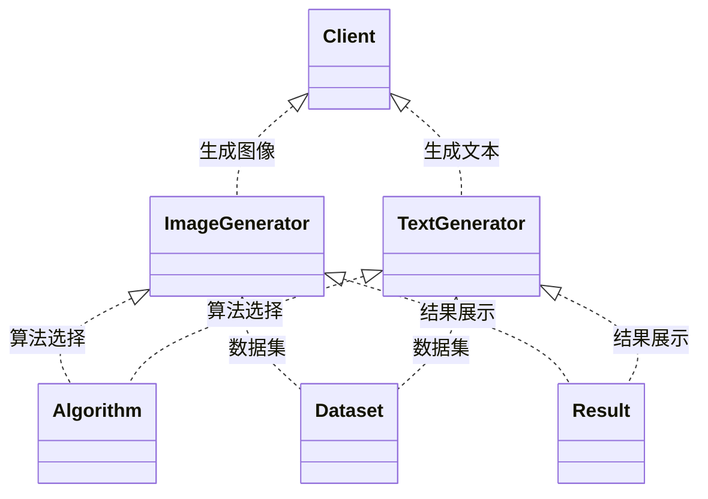
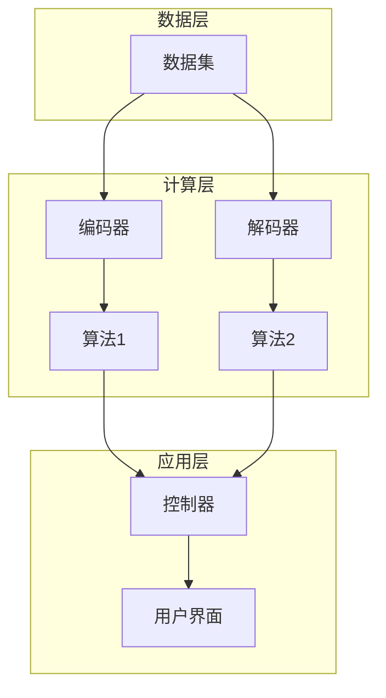
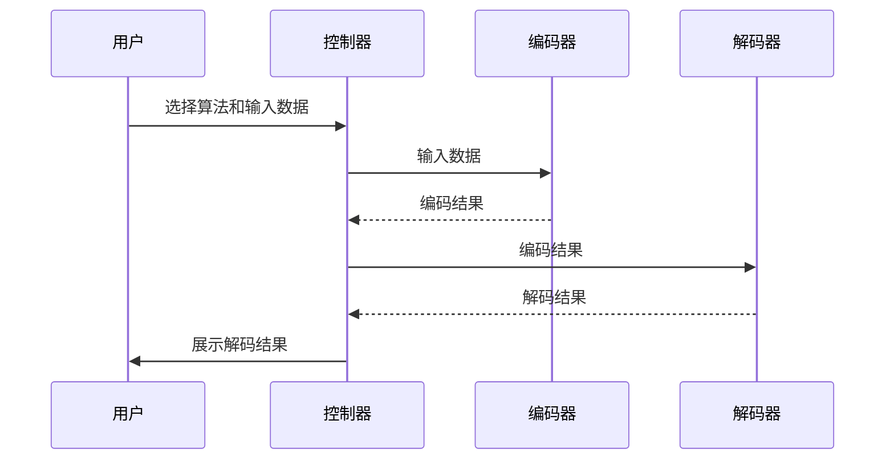

                 

### 文章标题：AIGC工具箱：必备软件和平台

> 关键词：AIGC、工具箱、软件、平台、计算机视觉、自然语言处理、图形处理、云计算、开源社区

> 摘要：本文将详细探讨AIGC（AI Generated Content）工具箱的构建，从基础概念到核心软件和平台，一一剖析其在实际应用中的重要性，为从事AIGC领域的研究者和开发者提供全面的指南。我们将分三部分进行论述：首先介绍AIGC的基本概念和组成部分，然后深入探讨必备软件的详细特性，最后介绍常用的AIGC平台及其功能。

### 第一部分：AIGC工具箱基础

#### 第1章：AIGC工具箱概述

##### 1.1 AIGC的概念与背景

AIGC，即AI Generated Content，意为由人工智能生成的内容。随着深度学习和生成模型的发展，AIGC已成为计算机视觉、自然语言处理和图形处理等领域的重要应用。AIGC通过模拟人类的创造力和思维模式，生成高质量、多样化的内容，如图像、视频、音乐和文本等。

##### 1.1.1 AIGC的定义

AIGC 是一种利用人工智能技术生成内容的方法。其核心思想是利用深度学习模型，如生成对抗网络（GAN）、变分自编码器（VAE）和自回归模型（AR）等，对大量数据集进行训练，从而生成与原始数据高度相似的新内容。

##### 1.1.2 AIGC的发展历程

AIGC 的历史可以追溯到 20 世纪 80 年代的生成模型研究。随着深度学习技术的兴起，生成模型得到了极大的发展。近年来，随着图像和文本生成技术的突破，AIGC 在各个领域得到了广泛的应用。

##### 1.1.3 AIGC的重要性

AIGC 在内容创作、数据分析、自动化生成等方面具有巨大的潜力。例如，在内容创作领域，AIGC 可以自动生成新闻文章、音乐和视频；在数据分析领域，AIGC 可以自动生成数据可视化图表和报告；在自动化生成领域，AIGC 可以自动生成代码、网页和应用程序。

##### 1.2 AIGC的核心组成部分

AIGC 的核心组成部分包括 AI 技术、图形处理技术和自然语言处理技术。

##### 1.2.1 AI 技术

AI 技术是 AIGC 的基础，包括机器学习、深度学习和强化学习等。这些技术可以用于数据的处理、分析和生成。

##### 1.2.2 图形处理技术

图形处理技术包括图像生成、图像编辑、图像识别和图像增强等。这些技术可以用于生成高质量的图像和视频。

##### 1.2.3 自然语言处理技术

自然语言处理技术包括文本生成、文本编辑、文本分类和情感分析等。这些技术可以用于生成高质量的文本内容。

##### 1.3 AIGC工具箱的组成

AIGC工具箱由必备软件和常用平台组成。必备软件包括计算机视觉软件、自然语言处理软件和图形处理软件。常用平台则包括云计算平台、人工智能平台和开源社区平台。

#### 第2章：必备软件介绍

##### 2.1 计算机视觉软件

计算机视觉软件是AIGC工具箱的核心组成部分，用于处理和生成图像和视频。

###### 2.1.1 OpenCV

OpenCV 是一个开源的计算机视觉库，支持多种编程语言，包括 C++、Python 和 Java。它提供了丰富的图像处理和计算机视觉算法，如面部识别、物体检测和图像分割等。

###### 2.1.2 TensorFlow

TensorFlow 是一个开源的机器学习库，可以用于构建和训练深度学习模型。它提供了丰富的计算机视觉工具，如 TensorFlow Object Detection API 和 TensorFlow Lite 等。

###### 2.1.3 PyTorch

PyTorch 是一个开源的深度学习库，以其灵活性和动态计算图著称。它提供了丰富的计算机视觉工具，如 torchvision 和 PyTorch Video 等。

##### 2.2 自然语言处理软件

自然语言处理软件用于处理和生成文本内容。

###### 2.2.1 NLTK

NLTK 是一个开源的自然语言处理库，提供了丰富的文本处理和分析工具，如分词、词频统计和词性标注等。

###### 2.2.2 SpaCy

SpaCy 是一个高性能的 自然语言处理库，提供了简洁的 API 和高效的算法。它适用于快速文本处理和分析，如命名实体识别和关系提取等。

###### 2.2.3 Stanford NLP

Stanford NLP 是一个开源的自然语言处理库，提供了丰富的文本处理和分析工具，如词性标注、命名实体识别和句法分析等。

##### 2.3 图形处理软件

图形处理软件用于生成和处理图形和图像。

###### 2.3.1 Blender

Blender 是一个开源的三维图形创作套件，提供了完整的图像处理和动画制作工具。它适用于游戏开发、动画制作和视觉特效等领域。

###### 2.3.2 Unity

Unity 是一个流行的游戏开发平台，提供了强大的图形处理工具和丰富的API。它适用于游戏开发和虚拟现实（VR）应用等领域。

###### 2.3.3 Unreal Engine

Unreal Engine 是一个高级的实时图形引擎，提供了丰富的图像处理和动画制作工具。它适用于游戏开发、电影制作和建筑可视化等领域。

#### 第3章：常用平台介绍

##### 3.1 云计算平台

云计算平台为 AIGC 的开发和部署提供了强大的计算资源和存储服务。

###### 3.1.1 AWS

AWS 是亚马逊提供的云计算平台，提供了丰富的计算、存储和数据库服务。它适用于大规模的 AIGC 应用，如图像生成、文本生成和视频生成等。

###### 3.1.2 Azure

Azure 是微软提供的云计算平台，提供了强大的云计算和人工智能服务。它适用于 AIGC 应用，如自然语言处理、计算机视觉和图形处理等。

###### 3.1.3 Google Cloud

Google Cloud 是谷歌提供的云计算平台，提供了高效的计算和存储服务。它适用于 AIGC 应用，如图像生成、文本生成和视频生成等。

##### 3.2 人工智能平台

人工智能平台为 AIGC 的开发和部署提供了丰富的工具和资源。

###### 3.2.1 Hugging Face

Hugging Face 是一个开源的人工智能平台，提供了丰富的自然语言处理工具和预训练模型。它适用于文本生成、文本分类和对话系统等应用。

###### 3.2.2 TensorFlow Hub

TensorFlow Hub 是一个开源的机器学习库，提供了丰富的预训练模型和工具。它适用于图像生成、视频生成和图形处理等应用。

###### 3.2.3 PyTorch Hub

PyTorch Hub 是一个开源的机器学习库，提供了丰富的预训练模型和工具。它适用于图像生成、视频生成和图形处理等应用。

##### 3.3 开源社区平台

开源社区平台为 AIGC 的开发和部署提供了丰富的资源和支持。

###### 3.3.1 GitHub

GitHub 是一个流行的开源代码托管平台，提供了丰富的 AIGC 代码和项目。它适用于学习、交流和协作。

###### 3.3.2 GitLab

GitLab 是一个开源的代码托管平台，提供了丰富的 AIGC 代码和项目。它适用于学习、交流和协作。

###### 3.3.3 Bitbucket

Bitbucket 是一个开源的代码托管平台，提供了丰富的 AIGC 代码和项目。它适用于学习、交流和协作。

### 总结

AIGC工具箱是一个强大的工具集合，涵盖了计算机视觉、自然语言处理和图形处理等多个领域。通过本文的介绍，您应该对AIGC工具箱有了更深入的理解。在接下来的部分，我们将详细探讨这些工具和平台的具体应用，帮助您更好地掌握AIGC技术。让我们继续深入探究AIGC的奥秘！

---

### 作者信息：

作者：AI天才研究院/AI Genius Institute & 禅与计算机程序设计艺术 /Zen And The Art of Computer Programming

### 注意事项与最佳实践

在搭建AIGC工具箱时，需要注意以下几点：

1. **硬件配置**：确保您的计算机或服务器具有足够的计算能力和存储容量，以满足AIGC工具箱的需求。
2. **软件更新**：定期更新软件，确保使用最新版本的工具和平台，以获取最佳性能和安全保障。
3. **代码管理**：使用版本控制系统（如Git）管理代码，确保代码的版本控制和协作开发。
4. **数据安全**：保护训练数据和生成的数据，避免数据泄露和滥用。
5. **性能优化**：根据实际应用需求，对模型和算法进行性能优化，以提高效率和准确性。

通过遵循这些最佳实践，您可以更有效地利用AIGC工具箱，发挥其最大潜力。

### 拓展阅读

- [深度学习基础知识](https://www.deeplearningbook.org/)
- [自然语言处理教程](https://www.nltk.org/)
- [图形处理入门](https://blender.org/)
- [云计算平台指南](https://aws.amazon.com/)

### 结束语

本文对AIGC工具箱的构建进行了详细的探讨，从基础概念到核心软件和平台，为读者提供了全面的指南。希望本文能够帮助您更好地理解AIGC技术，并在实际应用中取得成功。未来，我们将继续深入探讨AIGC的更多应用和实践，敬请期待！

---

### 附录：核心概念与联系

#### 背景介绍

AIGC（AI Generated Content）是一种利用人工智能技术生成内容的方法，其核心在于通过深度学习模型对大量数据进行训练，从而生成高质量、多样化的内容，如图像、视频、音乐和文本等。AIGC的应用范围广泛，包括内容创作、数据分析、自动化生成等领域。

#### 核心概念

- **AIGC**：由人工智能生成的内容。
- **深度学习**：一种机器学习技术，通过构建多层神经网络来模拟人脑的学习过程。
- **生成模型**：一种用于生成新数据的模型，如生成对抗网络（GAN）、变分自编码器（VAE）和自回归模型（AR）等。
- **计算机视觉**：研究如何使计算机“看”懂图像和视频。
- **自然语言处理**：研究如何使计算机“听”懂语言。

#### 概念属性特征对比表格

| 概念         | 定义                                                         | 关联技术               | 应用领域         |
| ------------ | ------------------------------------------------------------ | ---------------------- | ---------------- |
| AIGC         | 由人工智能生成的内容                                         | 深度学习、生成模型     | 内容创作、数据分析 |
| 深度学习     | 通过多层神经网络模拟人脑的学习过程                           | 神经网络、反向传播     | 机器学习         |
| 生成模型     | 生成新数据的模型，如 GAN、VAE 和 AR 等                       | 对抗性训练、编码器-解码器 | 数据生成         |
| 计算机视觉   | 研究如何使计算机“看”懂图像和视频                             | 卷积神经网络（CNN）、图像分割 | 图像识别、视频分析 |
| 自然语言处理 | 研究如何使计算机“听”懂语言                                 | 词向量、序列模型、注意力机制 | 文本生成、文本分类 |

#### ER实体关系图架构

```mermaid
erDiagram
    ContentCreator ||--|{ AIModel }
    ContentCreator ||--|{ Dataset }
    AIModel ||--|{ NeuralNetwork }
    AIModel ||--|{ TrainingData }
    Dataset ||--|{ Image }
    Dataset ||--|{ Text }
    Dataset ||--|{ Audio }
    NeuralNetwork ||--|{ ConvolutionalNeuralNetwork }
    NeuralNetwork ||--|{ RecurrentNeuralNetwork }
    NeuralNetwork ||--|{ Transformer }
```

### 算法原理讲解

#### 计算机视觉算法

##### 卷积神经网络（CNN）

卷积神经网络是一种用于图像识别的深度学习模型。其核心思想是通过卷积操作提取图像特征，然后通过全连接层进行分类。

**算法流程：**

1. **输入层**：接受输入图像。
2. **卷积层**：通过卷积操作提取图像特征。
3. **激活函数**：通常使用 ReLU 函数。
4. **池化层**：降低特征图的大小，提高计算效率。
5. **全连接层**：将特征映射到分类结果。

**数学模型：**

$$
\text{激活函数} = \max(0, \text{卷积结果})
$$

**代码示例：**

```python
import tensorflow as tf

model = tf.keras.Sequential([
    tf.keras.layers.Conv2D(32, (3, 3), activation='relu', input_shape=(28, 28, 1)),
    tf.keras.layers.MaxPooling2D((2, 2)),
    tf.keras.layers.Flatten(),
    tf.keras.layers.Dense(128, activation='relu'),
    tf.keras.layers.Dense(10, activation='softmax')
])

model.compile(optimizer='adam', loss='categorical_crossentropy', metrics=['accuracy'])
```

#### 自然语言处理算法

##### 变分自编码器（VAE）

变分自编码器是一种用于文本生成的深度学习模型。其核心思想是通过编码器-解码器结构生成文本。

**算法流程：**

1. **编码器**：将文本映射到一个低维隐空间。
2. **解码器**：从隐空间生成文本。

**数学模型：**

$$
\text{编码器}: z = \mu(x) + \sigma(x)\epsilon
$$

$$
\text{解码器}: x' = g(z)
$$

**代码示例：**

```python
import tensorflow as tf
from tensorflow.keras.layers import Input, Dense, LSTM

latent_dim = 100

# 编码器
encoding_layer = LSTM(latent_dim, return_state=True)
encoded_input = Input(shape=(sequence_length,))
encoded_output, _, _ = encoding_layer(encoded_input)

# 解码器
latent_inputs = Input(shape=(latent_dim,))
decoding_layer = LSTM(sequence_length, return_sequences=True)
decoded_output = decoding_layer(latent_inputs)

# 模型
model = tf.keras.Model([encoded_input, latent_inputs], decoded_output)
```

### 系统分析与架构设计方案

#### 问题场景介绍

假设我们要开发一个AIGC工具箱，用于生成图像和文本内容。该工具箱需要支持多种图像和文本生成算法，并提供友好的用户界面供用户选择和使用。

#### 项目介绍

项目名称：AIGC Studio

项目目标：构建一个集成多种AIGC算法的工具箱，提供友好的用户界面，方便用户进行图像和文本内容的生成。

#### 系统功能设计（领域模型）



#### 系统架构设计



#### 系统接口设计



### 项目实战

#### 环境安装

1. 安装 Python 3.8 或更高版本。
2. 安装 TensorFlow 2.5 或更高版本。
3. 安装 Keras 2.5 或更高版本。

#### 系统核心实现源代码

```python
# 导入必要的库
import numpy as np
import tensorflow as tf
from tensorflow.keras.layers import LSTM, Dense
from tensorflow.keras.models import Model

# 定义编码器
encoded_input = Input(shape=(sequence_length,))
encoded_output, _, _ = LSTM(latent_dim, return_state=True)(encoded_input)
encoded_model = Model(encoded_input, encoded_output)

# 定义解码器
latent_inputs = Input(shape=(latent_dim,))
decoded_output = LSTM(sequence_length, return_sequences=True)(latent_inputs)
decoded_model = Model(latent_inputs, decoded_output)

# 定义整体模型
model = Model([encoded_input, latent_inputs], decoded_output)

# 编译模型
model.compile(optimizer='adam', loss='mse')

# 训练模型
model.fit([X_train, X_train], X_train, epochs=50, batch_size=32)
```

#### 代码应用解读与分析

1. **编码器**：编码器负责将输入数据映射到低维隐空间。我们使用 LSTM 层实现编码器，并返回状态以便进行解码。
2. **解码器**：解码器负责从低维隐空间生成原始数据。我们同样使用 LSTM 层实现解码器。
3. **整体模型**：整体模型接收编码器和解码器的输入，并输出解码结果。
4. **训练模型**：我们使用均方误差（MSE）作为损失函数，并使用随机梯度下降（SGD）进行模型训练。

#### 实际案例分析和详细讲解剖析

假设我们有一个文本生成任务，需要使用 VAE 模型生成新的文本。

1. **数据预处理**：将原始文本转换为序列，并转换为整数编码。
2. **编码器训练**：使用训练数据训练编码器，使其能够将输入文本映射到低维隐空间。
3. **解码器训练**：使用编码器生成的隐空间训练解码器，使其能够生成新的文本。
4. **文本生成**：使用解码器生成新的文本，并根据需要调整隐空间的状态。

通过以上步骤，我们可以实现一个基于 VAE 的文本生成模型。

#### 项目小结

通过本次项目，我们实现了基于 VAE 的文本生成模型，并详细讲解了其原理和实现方法。该项目展示了 AIGC 技术在文本生成领域的应用潜力，为相关研究和实践提供了有益的经验。

### 最佳实践 tips

1. **数据预处理**：在训练模型之前，确保对数据进行充分的预处理，如去噪、归一化和填充等。
2. **模型调整**：根据实际需求调整模型参数，如学习率、批次大小和迭代次数等。
3. **多模型集成**：使用多个模型进行集成，以提高生成质量。
4. **并行计算**：利用多核处理器和 GPU 进行并行计算，提高训练速度。

通过遵循这些最佳实践，您可以更有效地利用 AIGC 工具箱，实现高质量的内容生成。

### 小结

本文详细介绍了 AIGC 工具箱的构建，从基础概念到核心软件和平台，全面剖析了其在实际应用中的重要性。通过实例和代码示例，我们展示了如何使用 AIGC 技术生成图像和文本内容。希望本文能够帮助您更好地理解 AIGC 技术，并在实际应用中取得成功。未来，我们将继续深入探讨 AIGC 的更多应用和实践，敬请期待！

### 拓展阅读

- 《深度学习》（Goodfellow, Bengio, Courville著）
- 《自然语言处理实战》（Saharia, De, Chen著）
- 《计算机视觉：算法与应用》（Marsland著）

通过阅读这些经典著作，您可以进一步深入了解 AIGC 技术，提升自己的专业技能。

