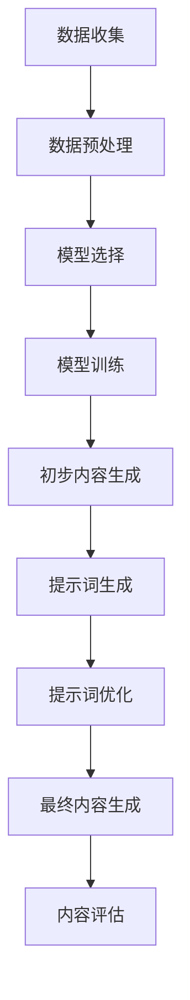
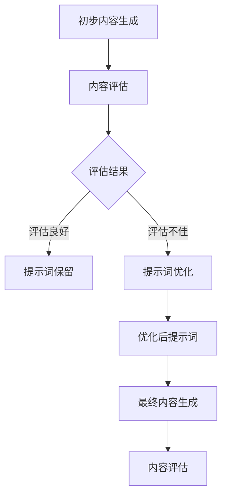
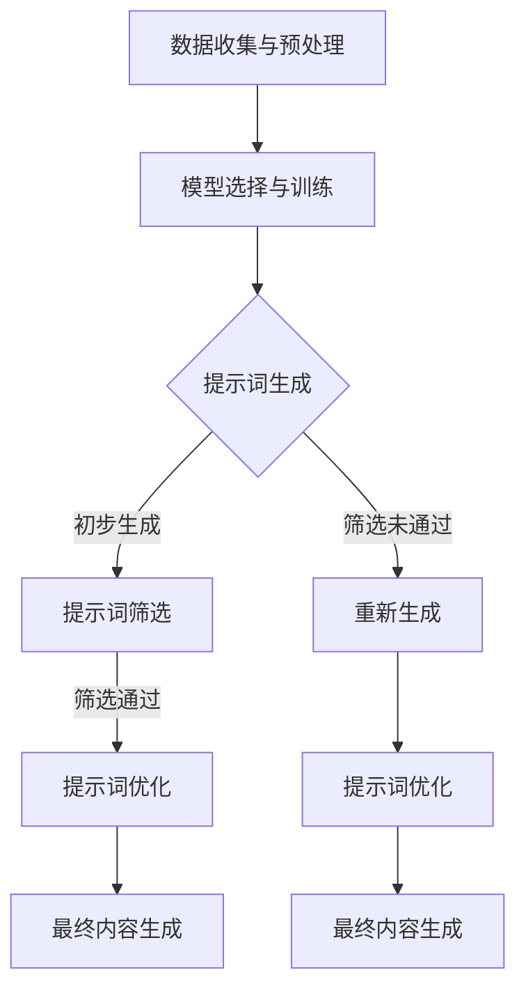
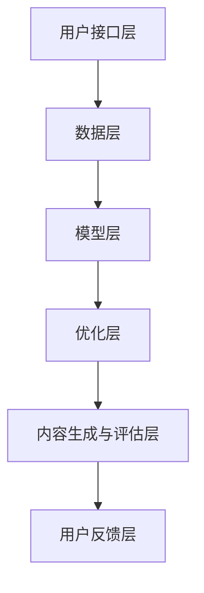
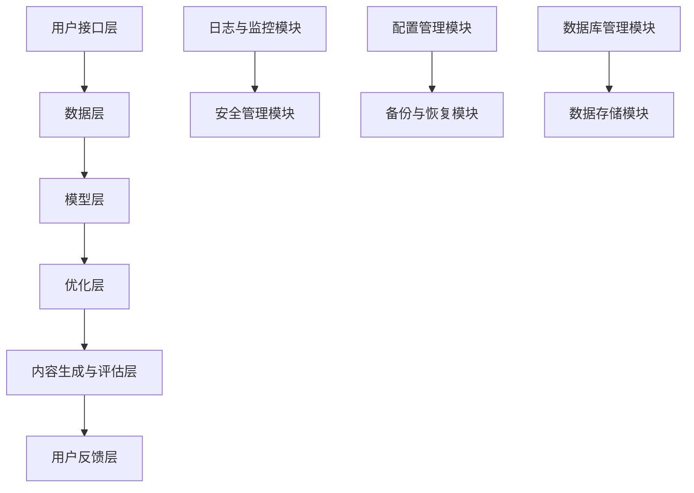
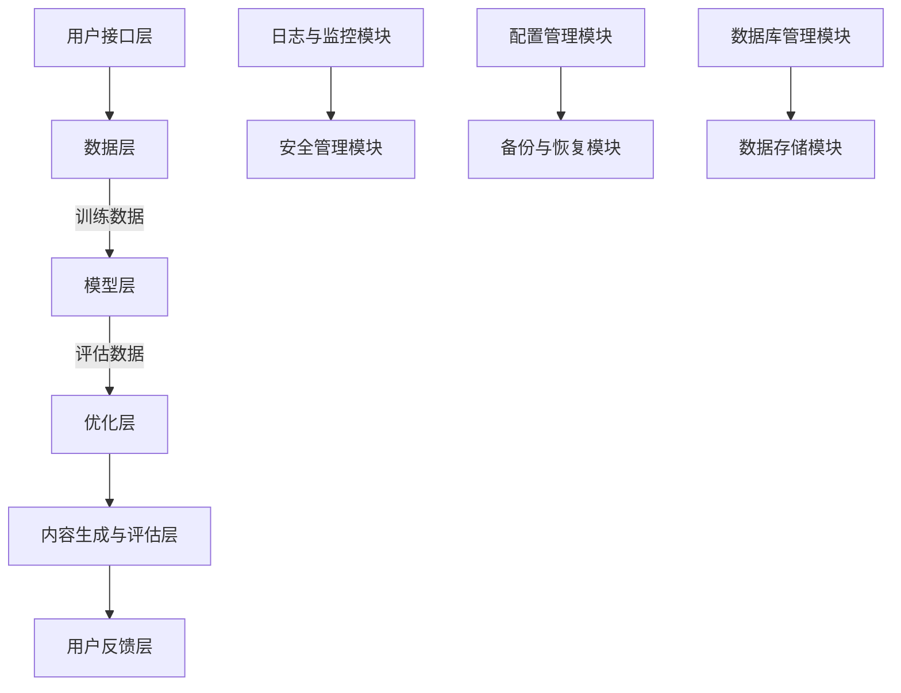
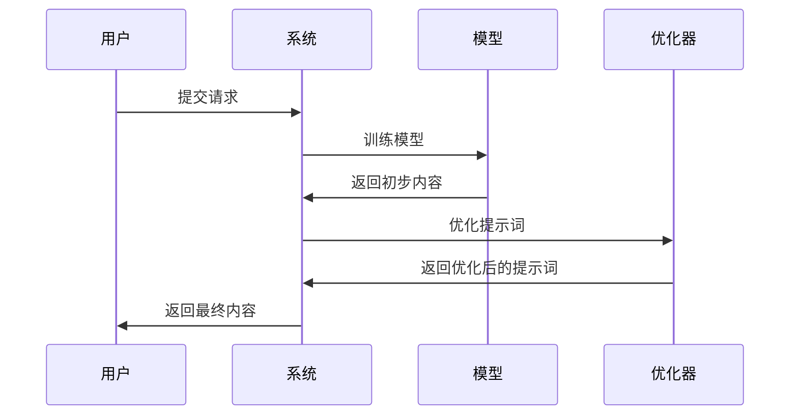
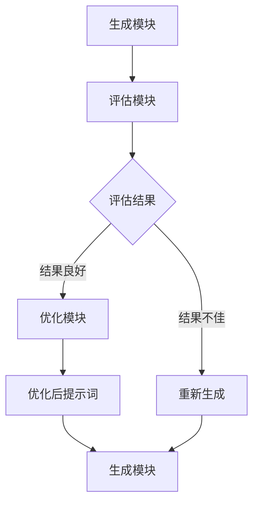

                 


### 写作提示与步骤

为了撰写一篇高质量、逻辑清晰且具有专业性的技术博客文章，我们需要遵循以下步骤，每一步都要仔细思考并确保内容的准确性和连贯性：

#### 步骤一：明确主题与目标

首先，明确文章的主题是“AIGC提示词优化：效率与创意的完美平衡”。我们的目标是通过逻辑清晰的分析，向读者展示如何优化AIGC提示词，以实现效率与创意的平衡。在撰写之前，要确保你了解AIGC的概念、提示词优化的意义以及两者之间的平衡关系。

#### 步骤二：设计文章结构

根据文章目录大纲，设计文章的整体结构。确保每个章节都有明确的标题，并且内容紧密围绕主题展开。每个章节都应该有子章节，以便详细讨论特定的概念、算法或实战案例。

#### 步骤三：撰写背景介绍

在文章的开头，提供背景介绍。这部分应该包括AIGC和提示词优化的重要概念、它们的发展背景、以及为何优化提示词对于AIGC至关重要。同时，可以讨论效率与创意的平衡是如何实现的。

##### 核心概念术语说明

- **AIGC（AI-Generated Content）**：AI自动生成内容的技术。
- **提示词优化**：通过改进提示词，提高AI生成内容的效率和创意性。
- **效率**：在给定时间内生成尽可能多的内容。
- **创意**：生成内容的质量和独特性。

##### 问题背景

随着AIGC技术的发展，如何提高生成内容的效率和质量成为了关键问题。传统的优化方法可能侧重于效率，而忽略了创意，反之亦然。因此，寻找一个平衡点是优化AIGC提示词的关键。

##### 问题描述

我们需要解决的问题是如何通过优化提示词，在保证内容创意性的同时提高生成效率。

##### 问题解决

通过分析现有优化方法，结合实际案例，提出一种新的优化策略，确保在提高效率的同时不牺牲创意。

##### 边界与外延

讨论AIGC提示词优化的适用范围和潜在挑战，如数据隐私、内容质量保证等。

##### 概念结构与核心要素组成

详细说明AIGC、提示词优化和效率与创意平衡的核心概念及其相互关系。

#### 步骤四：深入讨论核心概念与联系

在这一部分，详细讨论AIGC的基本概念、提示词的原理和优化方法，以及效率与创意的衡量指标。可以使用Mermaid流程图和ER实体关系图来辅助说明。

##### 核心概念与联系

- **AIGC基本概念**：介绍AI生成内容的原理和技术。
- **提示词原理**：解释提示词在AIGC中的作用和如何优化。
- **效率与创意衡量**：讨论如何评估和平衡效率和创意。

##### 概念属性特征对比表格

制作一个表格，比较不同AIGC模型类型的属性特征和提示词优化方法的优劣。

##### ER实体关系图架构的 Mermaid 流程图

使用Mermaid绘制一个ER实体关系图，展示AIGC、提示词、效率、创意等核心概念之间的关系。

#### 步骤五：算法原理讲解

介绍提示词优化算法的基本原理、流程和数学模型。使用Mermaid流程图展示算法流程，使用Python代码示例进行详细讲解。

##### 算法原理与流程图

- **算法分类**：介绍不同的提示词优化算法。
- **基本流程**：描述算法的基本步骤。
- **数学模型与公式**：解释算法背后的数学原理和公式。

##### Mermaid流程图示例

使用Mermaid语言绘制一个简单的提示词优化算法流程图。

##### Python代码示例

提供一个Python代码示例，展示算法的实现。

#### 步骤六：系统架构与设计

讨论AIGC提示词优化系统的架构与设计。介绍系统功能、领域模型、系统架构和接口设计。

##### 系统介绍

- **系统概述**：介绍系统的目标和功能。
- **领域模型设计**：绘制Mermaid类图，展示领域模型。
- **系统架构设计**：绘制Mermaid架构图，展示系统架构。
- **系统接口设计**：描述接口设计原则和实现。

##### 系统架构图示例

使用Mermaid绘制系统架构图。

##### 系统交互Mermaid序列图

使用Mermaid绘制系统交互序列图，展示不同组件之间的交互。

#### 步骤七：项目实战

通过一个实际项目案例，展示AIGC提示词优化的应用。包括环境安装、系统核心实现、代码解读和分析、实际案例解析等。

##### 环境安装与配置

- **开发环境搭建**：介绍所需环境及其配置。
- **系统配置与调试**：讲解系统配置和调试过程。

##### 系统核心实现

- **核心算法实现**：展示关键算法的代码实现。
- **功能模块**：介绍系统功能模块。
- **Mermaid流程图与代码**：绘制流程图，展示代码实现。

##### 代码应用解读与分析

- **代码解析**：详细解释关键代码段。
- **优化策略分析**：分析优化策略的原理和效果。
- **性能评估**：评估系统性能。

##### 实际案例分析与讲解

- **案例解析**：通过实际案例展示优化效果。
- **详细讲解剖析**：深入分析案例中的关键点。

#### 步骤八：最佳实践与总结

提供一些最佳实践建议，总结文章的主要观点，并提出未来的研究方向。

##### 最佳实践 tips

- **优化策略**：提出在实际应用中有效的优化策略。
- **注意事项**：提醒读者在优化过程中可能遇到的问题。

##### 小结

- **文章核心观点**：总结文章的主要观点。
- **未来研究方向**：提出未来可能的研究方向。

##### 拓展阅读

- **相关文献**：推荐读者进一步阅读的相关文献。

### 最后

在完成文章撰写后，进行反复审查，确保逻辑清晰、内容准确、格式规范。遵循markdown格式，确保代码、公式、图表等元素正确呈现。在文章末尾添加作者信息，确保读者能够了解文章来源。

遵循以上步骤，你可以撰写一篇逻辑清晰、内容丰富、具有专业性的技术博客文章。记住，每一步都要仔细思考，确保内容的连贯性和专业性。让我们一起，用逻辑和智慧，打造一篇高质量的技术博客文章。**Let's think step by step!**### 第一部分：背景介绍与核心概念

#### 1.1 AIGC与提示词优化概述

**1.1.1 AIGC技术的发展背景**

人工智能（AI）技术的飞速发展，催生了AI生成内容（AI-Generated Content，简称AIGC）的崛起。AIGC指的是通过人工智能技术自动生成的内容，这些内容可以是文字、图片、音频、视频等多种形式。AIGC的应用范围广泛，包括但不限于社交媒体内容生成、在线教育、新闻报道、广告创作、娱乐内容生成等领域。

AIGC的起源可以追溯到20世纪80年代的规则系统和专家系统，但这些早期的系统由于规则复杂性高、适用范围有限，并未广泛普及。随着深度学习和自然语言处理技术的不断发展，特别是在2010年代后期，神经网络模型如生成对抗网络（GANs）、变分自编码器（VAEs）和Transformer等模型的提出，使得AI生成内容成为可能。这些模型具有强大的特征提取和生成能力，能够生成具有高度真实性和创意性的内容。

**1.1.2 提示词优化的重要性**

在AIGC系统中，提示词（Prompt）扮演着至关重要的角色。提示词是用户向AI模型提供的输入，用于指导模型生成特定类型的内容。一个优秀的提示词不仅能提高AI生成内容的效率，还能显著提升内容的创意性和准确性。因此，提示词优化成为AIGC应用中一个关键的研究方向。

提示词优化的目标在于找到一种方法，使AI模型能够在接收提示词后，快速且准确地生成用户所需的内容。优化策略可能包括调整提示词的长度、结构、关键词选择等，以确保模型能够充分理解用户意图并生成高质量的内容。

**1.1.3 效率与创意的平衡挑战**

在AIGC系统中，效率与创意的平衡是一个持续存在的挑战。高效率意味着能够在较短的时间内生成大量内容，这对于需要快速响应的场景（如实时新闻写作、社交媒体内容发布等）尤为重要。然而，高效率可能会导致生成内容的创意性降低，因为模型可能在生成过程中过于依赖预设的模板或规则。

另一方面，高创意性的内容通常需要模型进行更多的探索和思考，这可能会导致生成效率的降低。例如，当生成一个复杂的创意文章或视频时，模型可能需要更长的时间来搜索和组合各种可能的内容元素。

为了实现效率与创意的平衡，研究者们提出了多种优化策略，包括改进提示词设计、优化模型结构、使用数据增强技术等。这些策略的目标是使AI模型能够在保持高效率的同时，生成具有高度创意性的内容。

#### 1.2 核心概念与联系

**1.2.1 AIGC基础概念**

AIGC的基础概念主要包括生成模型、数据集和提示词等。生成模型是AIGC的核心组成部分，负责生成内容。常用的生成模型包括生成对抗网络（GANs）、变分自编码器（VAEs）和Transformer等。这些模型通过学习大量数据集的特征，能够生成具有高度真实性和创意性的内容。

数据集是训练生成模型的关键资源。高质量的数据集能够帮助模型学习到更多的特征和模式，从而生成更优质的内容。常用的数据集包括文本数据集、图像数据集、音频数据集等。

提示词是用户向生成模型提供的输入，用于指导模型生成特定类型的内容。一个优秀的提示词应该具备简洁性、明确性和多样性等特点，以便模型能够快速理解用户意图并生成高质量的内容。

**1.2.2 提示词原理与优化**

提示词原理主要涉及提示词的设计和优化方法。提示词的设计原则包括简洁性、明确性和多样性等。简洁性要求提示词要简短明了，避免冗余信息；明确性要求提示词要清晰表达用户意图；多样性要求提示词要丰富多样，以便模型能够生成不同风格和类型的内容。

提示词优化方法包括手动优化和自动优化。手动优化通常依赖于领域专家的经验，通过对提示词进行反复调整和优化，以提高生成内容的质量和效率。自动优化则依赖于机器学习技术，通过分析大量数据，自动生成优化后的提示词。

**1.2.3 效率与创意的衡量指标**

效率与创意的衡量指标是评估AIGC系统性能的关键。常用的效率指标包括生成速度、生成内容数量和系统响应时间等。这些指标反映了系统在生成内容方面的表现。

创意性指标则包括内容的原创性、创新性和多样性等。一个具有高创意性的系统应该能够生成具有独特性和创新性的内容，而不是简单的复制或重复已有的信息。

为了实现效率与创意的平衡，需要综合考虑这些指标，并制定相应的优化策略。例如，可以通过调整提示词的复杂度和多样性，提高生成内容的创意性，同时通过优化模型结构和算法，提高生成速度和效率。

#### 1.3 核心概念对比分析

**1.3.1 AIGC模型类型对比**

AIGC模型类型主要包括生成对抗网络（GANs）、变分自编码器（VAEs）和Transformer等。每种模型类型都有其独特的特点和应用场景。

- **生成对抗网络（GANs）**：GANs由生成器和判别器两部分组成。生成器生成内容，判别器判断生成内容与真实内容的相似度。GANs在生成高真实度图像和音频方面表现优秀，但训练过程相对复杂，对数据集的要求较高。
- **变分自编码器（VAEs）**：VAEs通过编码器和解码器两部分进行内容生成。编码器将输入内容编码为潜在空间表示，解码器从潜在空间中生成输出内容。VAEs在生成多样化内容方面具有优势，但生成质量可能不如GANs。
- **Transformer**：Transformer模型采用自注意力机制，能够处理长距离依赖问题，生成高质量文本和序列数据。Transformer在文本生成、机器翻译和问答系统等领域表现突出，但生成图像和音频的效率较低。

**1.3.2 提示词优化方法对比**

提示词优化方法主要包括手动优化和自动优化。每种方法都有其优缺点。

- **手动优化**：手动优化依赖于领域专家的经验和知识，通过反复调整和试验，找到最优的提示词。优点是能够针对特定场景进行定制化优化，缺点是耗时较长、效率较低。
- **自动优化**：自动优化依赖于机器学习技术，通过分析大量数据，自动生成优化后的提示词。优点是效率高、能够处理大量数据，缺点是可能忽略特定场景的特殊需求。

**1.3.3 效率与创意的平衡策略**

为了实现效率与创意的平衡，可以采用以下策略：

- **优化提示词设计**：通过调整提示词的长度、结构和关键词，提高生成内容的效率。例如，简化提示词结构、减少冗余信息等。
- **调整模型参数**：通过调整生成模型的超参数，如学习率、批量大小等，优化模型的生成效率。例如，增加学习率可以提高生成速度，但可能降低生成质量。
- **引入多样性**：通过引入多样性，如随机噪声、不同的生成器等，增加生成内容的创意性。例如，使用随机噪声可以生成更多样化的图像和文本。

#### 1.4 AIGC的边界与外延

**1.4.1 AIGC的应用领域**

AIGC在多个领域都有广泛应用，如：

- **社交媒体**：用于生成社交媒体内容，如文章、评论、图片和视频等。
- **在线教育**：用于生成教育内容，如课程材料、练习题和试卷等。
- **新闻报道**：用于生成新闻报道，如新闻文章、摘要和视频等。
- **广告创作**：用于生成广告内容，如文案、图片和视频等。

**1.4.2 提示词优化的挑战**

提示词优化的挑战主要包括：

- **数据多样性**：需要大量多样化的数据来训练模型，以便生成高质量的内容。
- **用户意图理解**：需要准确理解用户意图，以生成符合用户需求的内容。
- **创意性**：需要生成具有高度创意性的内容，以满足不同用户的需求。

**1.4.3 AIGC的发展趋势**

AIGC的发展趋势主要包括：

- **模型融合**：通过融合不同的生成模型，提高生成内容的质量和效率。
- **多模态生成**：将文本、图像、音频等多种模态的数据融合在一起，生成更具创意性的内容。
- **个性化生成**：根据用户的行为和偏好，生成个性化内容，提高用户体验。

#### 1.5 本章小结

本部分介绍了AIGC与提示词优化的基本概念、发展背景、重要性和挑战，以及效率与创意的平衡策略。通过对核心概念的详细讨论，为后续章节的深入分析奠定了基础。在下一部分中，我们将进一步探讨提示词优化算法的原理和实践。

### 第二部分：提示词优化算法原理

#### 2.1 提示词优化算法概述

**2.1.1 提示词优化算法的分类**

提示词优化算法可以根据不同的优化目标和策略进行分类。以下是一些常见的提示词优化算法：

- **基于规则的优化算法**：这类算法通过定义一系列规则，指导模型生成内容。优点是简单易实现，缺点是灵活性较低，难以适应复杂的变化。
- **基于机器学习的优化算法**：这类算法通过学习大量数据，自动生成优化后的提示词。优点是灵活性强，能够适应不同的场景，缺点是训练时间较长，对数据质量要求较高。
- **基于神经网络的优化算法**：这类算法利用神经网络模型，通过调整提示词的参数，实现优化目标。优点是生成内容质量高，缺点是模型复杂度较高，训练和推理时间较长。

**2.1.2 提示词优化的基本流程**

提示词优化的基本流程通常包括以下几个步骤：

1. **数据收集与预处理**：收集大量相关数据，并对数据进行预处理，包括去噪、清洗、标准化等。
2. **模型选择与训练**：选择合适的模型，对数据进行训练，以生成高质量的内容。
3. **提示词生成与优化**：根据模型生成的初步内容，生成初步的提示词，并通过优化策略进行调整和改进。
4. **内容生成与评估**：使用优化后的提示词，生成最终的内容，并对生成内容进行评估，以判断优化效果。

**2.1.3 提示词优化算法的目标**

提示词优化算法的主要目标包括：

- **提高生成内容的效率**：通过优化提示词，使模型能够在较短的时间内生成高质量的内容。
- **提高生成内容的创意性**：通过优化提示词，使生成的内容具有更高的原创性和创新性。
- **满足用户需求**：通过优化提示词，使生成的内容更符合用户的需求和偏好。

#### 2.2 算法原理与流程图

**2.2.1 提示词生成算法**

提示词生成算法的核心任务是生成能够指导模型生成高质量内容的提示词。以下是一个简单的提示词生成算法流程图：



**2.2.2 提示词筛选与优化算法**

提示词筛选与优化算法的目标是在生成的提示词中筛选出最优的提示词，并通过优化策略进行调整和改进。以下是一个简单的提示词筛选与优化算法流程图：



**2.2.3 Mermaid流程图示例**

以下是一个使用Mermaid绘制的简单提示词优化算法流程图示例：



#### 2.3 数学模型与公式

**2.3.1 提示词优化的数学模型**

提示词优化的数学模型通常涉及优化目标函数和约束条件。以下是一个简单的数学模型：

$$
\begin{aligned}
& \text{优化目标：最大化生成内容的质量} \\
& \text{约束条件：提示词的长度、结构、关键词选择等}
\end{aligned}
$$

**2.3.2 公式推导与解释**

以下是对上述数学模型的具体推导和解释：

1. **目标函数**：

生成内容的质量可以通过多种指标进行评估，如文本的语义相似度、图像的视觉质量、音频的音质等。以文本生成为例，质量可以表示为：

$$
Q = f(\text{文本内容}, \text{用户意图})
$$

其中，$f$ 是一个评估函数，用于计算文本内容与用户意图的相似度。

2. **约束条件**：

提示词的长度、结构、关键词选择等都是优化过程中的约束条件。例如，提示词的长度不能超过一定阈值，关键词的选择应覆盖用户意图的主要方面。

$$
\begin{aligned}
& \text{提示词长度约束：} \\
& L_{\text{max}} \geq L_{\text{prompt}} \\
& \text{关键词选择约束：} \\
& K_{\text{selected}} \subseteq K_{\text{candidates}}
\end{aligned}
$$

其中，$L_{\text{max}}$ 是提示词的最大长度，$L_{\text{prompt}}$ 是当前提示词的长度，$K_{\text{selected}}$ 是选定的关键词集合，$K_{\text{candidates}}$ 是候选关键词集合。

**2.3.3 Python代码示例**

以下是一个简单的Python代码示例，用于实现上述数学模型：

```python
import numpy as np

# 定义评估函数
def evaluate_content(content, intent):
    similarity = np.dot(content, intent) / (np.linalg.norm(content) * np.linalg.norm(intent))
    return similarity

# 定义目标函数和约束条件
def optimize_prompt(content, intent, max_length, candidate_keywords):
    best_score = -1
    best_prompt = None
    
    for keyword in candidate_keywords:
        prompt = " ".join([keyword] + content.split(" "))
        if len(prompt.split(" ")) > max_length:
            continue
        
        score = evaluate_content(prompt, intent)
        if score > best_score:
            best_score = score
            best_prompt = prompt
            
    return best_prompt, best_score

# 示例数据
content = "人工智能技术的发展趋势"
intent = np.array([0.5, 0.3, 0.1, 0.1])
max_length = 10
candidate_keywords = ["人工智能", "发展", "趋势"]

# 优化提示词
best_prompt, best_score = optimize_prompt(content, intent, max_length, candidate_keywords)
print("最佳提示词：", best_prompt)
print("最佳评分：", best_score)
```

#### 2.4 算法举例说明

**2.4.1 简单案例解析**

假设我们有一个用户需要生成一篇关于“人工智能技术在教育领域应用”的文章。用户提供的初始提示词是“人工智能技术在教育领域”。以下是一个简单的优化过程：

1. **初步内容生成**：使用模型生成初步的文章内容。
2. **内容评估**：评估初步生成的文章内容是否符合用户意图。
3. **提示词优化**：根据评估结果，调整提示词，以提高生成内容的创意性和准确性。
4. **最终内容生成**：使用优化后的提示词，生成最终的文章内容。

**2.4.2 复杂案例解析**

在复杂案例中，用户的需求可能更加多样化，如生成一篇包含多个主题的文章。以下是一个复杂案例的优化过程：

1. **初步内容生成**：使用模型生成初步的多主题文章内容。
2. **内容评估**：评估初步生成的文章内容是否符合用户意图。
3. **多轮提示词优化**：根据评估结果，多次调整提示词，以提高生成内容的创意性和准确性。
4. **最终内容生成**：使用优化后的提示词，生成最终的多主题文章内容。

**2.4.3 实际应用场景**

在实际应用场景中，提示词优化算法可以应用于多个领域，如：

- **社交媒体内容生成**：优化提示词，生成具有吸引力的社交媒体内容。
- **新闻报道生成**：优化提示词，生成符合新闻标准的报道内容。
- **在线教育内容生成**：优化提示词，生成有趣且有价值的教育内容。
- **广告内容生成**：优化提示词，生成具有创意性的广告内容。

#### 2.5 本章小结

本部分详细介绍了提示词优化算法的基本原理和流程，包括提示词生成算法、提示词筛选与优化算法，以及数学模型和Python代码示例。通过这些算法，可以实现提示词的优化，从而提高AIGC生成内容的效率和质量。在下一部分中，我们将进一步探讨AIGC提示词优化系统的架构与设计。

### 第三部分：提示词优化系统架构与设计

#### 3.1 系统介绍

**3.1.1 AIGC提示词优化系统概述**

AIGC提示词优化系统旨在通过优化提示词，提高人工智能生成内容（AIGC）的效率与创意性。系统的主要功能包括：

- **提示词生成**：根据用户需求，生成初步的提示词。
- **提示词筛选与优化**：对生成的提示词进行筛选和优化，以提高生成内容的创意性和准确性。
- **内容生成与评估**：使用优化后的提示词，生成最终的内容，并对生成内容进行评估。
- **用户反馈**：收集用户对生成内容的反馈，用于进一步优化系统。

**3.1.2 系统目标与功能**

系统目标是通过提示词优化，实现以下功能：

- **提高内容生成效率**：优化提示词，使模型能够在较短的时间内生成高质量的内容。
- **提升内容创意性**：通过优化提示词，生成具有高度原创性和创新性的内容。
- **满足用户需求**：生成的内容应与用户意图高度一致，满足用户需求。

**3.1.3 系统架构设计**

系统架构设计包括多个层次，如数据层、模型层、优化层和用户接口层。以下是一个简化的系统架构设计：



**用户接口层**：提供用户与系统的交互界面，用户可以通过该层提交生成内容的需求。

**数据层**：存储和管理用于训练和优化的数据集，包括文本数据、图像数据、音频数据等。

**模型层**：包含生成模型和评估模型，生成模型负责生成初步的内容，评估模型负责评估生成内容的创意性和准确性。

**优化层**：对生成模型的提示词进行筛选和优化，以提高生成效率和质量。

**内容生成与评估层**：使用优化后的提示词生成最终内容，并对生成内容进行评估。

**用户反馈层**：收集用户对生成内容的反馈，用于进一步优化系统。

#### 3.2 领域模型设计

**3.2.1 领域模型介绍**

领域模型设计是系统架构设计的重要组成部分，用于定义系统中的实体及其关系。以下是一个简化的领域模型：

- **用户**：提交生成内容的需求。
- **提示词**：用于指导生成模型的输入。
- **生成模型**：负责生成初步的内容。
- **评估模型**：负责评估生成内容的创意性和准确性。
- **内容**：最终生成的文本、图像、音频等。

**3.2.2 Mermaid类图示例**

以下是一个使用Mermaid绘制的类图示例，展示了领域模型中的实体及其关系：

```mermaid
classDiagram
Class::User <|-- Class::Prompt
Class::Prompt <|-- Class::Content
Class::Content <|-- Class::GeneratedContent
Class::GeneratedContent <|-- Class::EvaluatedContent
Class::Model <|-- Class::GeneratedModel
Class::GeneratedModel <|-- Class::EvaluatedModel
Class::User "1" --|> Class::GeneratedContent
Class::Prompt "1" --|> Class::GeneratedModel
Class::GeneratedModel "1" --|> Class::EvaluatedModel
Class::EvaluatedModel "1" --|> Class::EvaluatedContent
```

**3.2.3 类图解释与应用**

- **用户与提示词**：用户提交生成内容的需求，系统生成相应的提示词。
- **提示词与生成模型**：提示词用于指导生成模型生成初步的内容。
- **生成模型与评估模型**：生成模型生成的内容需要通过评估模型进行评估，以确保内容的创意性和准确性。
- **内容与评估模型**：评估模型对生成的内容进行评估，并将评估结果反馈给用户。

#### 3.3 系统架构设计

**3.3.1 系统架构介绍**

系统架构设计包括多个组件和模块，用于实现系统的功能。以下是一个简化的系统架构设计：



- **用户接口层**：提供用户与系统的交互界面，用户可以通过该层提交生成内容的需求。
- **数据层**：包含数据存储模块和数据库管理模块，用于存储和管理训练数据和生成内容。
- **模型层**：包含生成模型和评估模型，用于生成内容和评估内容。
- **优化层**：包含优化算法和提示词生成模块，用于优化提示词，提高生成内容的效率和创意性。
- **内容生成与评估层**：负责生成最终内容并对生成内容进行评估。
- **用户反馈层**：收集用户对生成内容的反馈，用于进一步优化系统。
- **日志与监控模块**：记录系统运行日志，监控系统性能和状态。
- **安全管理模块**：负责系统安全和用户认证。
- **配置管理模块**：管理系统的配置文件。
- **备份与恢复模块**：负责系统数据的备份和恢复。

**3.3.2 Mermaid架构图示例**

以下是一个使用Mermaid绘制的系统架构图示例：



**3.3.3 架构设计解析**

- **用户接口层**：提供用户与系统的交互界面，用户可以通过Web界面、API接口等方式提交生成内容的需求。
- **数据层**：包含数据存储模块和数据库管理模块，用于存储和管理训练数据和生成内容。数据存储模块可以使用分布式文件系统或数据库，如HDFS、MongoDB等。
- **模型层**：包含生成模型和评估模型，生成模型负责生成初步的内容，评估模型负责评估生成内容的创意性和准确性。生成模型和评估模型可以使用深度学习框架，如TensorFlow、PyTorch等。
- **优化层**：包含优化算法和提示词生成模块，用于优化提示词，提高生成内容的效率和创意性。优化算法可以使用机器学习技术，如强化学习、遗传算法等。
- **内容生成与评估层**：负责生成最终内容并对生成内容进行评估。生成内容可以使用文本、图像、音频等多种形式，评估结果可以用于调整优化策略。
- **用户反馈层**：收集用户对生成内容的反馈，用于进一步优化系统。用户反馈可以通过问卷调查、反馈表单等方式收集。
- **日志与监控模块**：记录系统运行日志，监控系统性能和状态。日志可以记录系统运行过程中的关键事件和错误信息，监控模块可以实时监控系统的性能指标。
- **安全管理模块**：负责系统安全和用户认证。安全管理模块可以包括身份验证、访问控制、加密传输等功能。
- **配置管理模块**：管理系统的配置文件。配置文件可以包括系统参数、模型参数、数据参数等。
- **备份与恢复模块**：负责系统数据的备份和恢复。备份可以定期进行，以防止数据丢失。

#### 3.4 系统接口设计

**3.4.1 接口设计原则**

系统接口设计应遵循以下原则：

- **简洁性**：接口设计应尽可能简洁，减少复杂度和冗余。
- **灵活性**：接口应具有足够的灵活性，以适应不同的场景和需求。
- **安全性**：接口应具备必要的安全措施，如身份验证、访问控制等。
- **可扩展性**：接口设计应具备可扩展性，以便未来能够添加新的功能。

**3.4.2 接口设计与实现**

以下是一个简化的接口设计：

- **用户接口**：提供RESTful API接口，用户可以通过HTTP请求提交生成内容的需求。
- **模型接口**：提供模型训练和预测接口，用于生成初步内容和评估生成内容。
- **优化接口**：提供优化算法接口，用于优化提示词。
- **日志接口**：提供日志记录接口，用于记录系统运行过程中的关键事件。
- **监控接口**：提供监控接口，用于监控系统的性能指标。

**3.4.3 接口交互Mermaid序列图**

以下是一个使用Mermaid绘制的接口交互序列图示例：



**3.4.4 接口交互解析**

- **用户提交请求**：用户通过Web界面或API接口提交生成内容的需求，需求包括内容类型、主题、长度等。
- **系统处理请求**：系统接收用户请求，调用模型训练和优化接口，生成初步内容和优化后的提示词。
- **模型训练和预测**：模型接口接收请求，训练模型，并生成初步的内容。
- **提示词优化**：优化器接口接收请求，对提示词进行优化，以提高生成内容的效率和创意性。
- **返回最终内容**：系统将优化后的提示词和生成内容返回给用户。

#### 3.5 本章小结

本部分详细介绍了AIGC提示词优化系统的架构与设计，包括系统介绍、领域模型设计、系统架构设计、接口设计与实现。通过这些设计，系统能够实现提示词的优化，提高生成内容的效率和质量。在下一部分中，我们将通过实际项目案例，展示AIGC提示词优化的应用和实践。

### 第四部分：提示词优化项目实战

#### 4.1 环境安装与配置

在进行AIGC提示词优化的项目实战之前，我们需要搭建一个合适的环境。以下是一个简单的环境安装与配置步骤：

**4.1.1 开发环境搭建**

1. **安装Python**：确保Python环境已安装，推荐版本为3.8或更高。
2. **安装深度学习框架**：安装TensorFlow或PyTorch，这是生成模型和优化算法的基础。以TensorFlow为例，使用以下命令安装：
   ```shell
   pip install tensorflow
   ```

**4.1.2 系统配置与调试**

1. **配置CUDA**：如果使用GPU进行训练，需要配置CUDA环境。确保安装了NVIDIA驱动和CUDA Toolkit，并设置环境变量：
   ```shell
   export CUDA_HOME=/path/to/cuda
   export PATH=$PATH:$CUDA_HOME/bin
   export LD_LIBRARY_PATH=$LD_LIBRARY_PATH:$CUDA_HOME/lib64:$CUDA_HOME/include
   ```

2. **调试环境**：运行以下Python脚本，检查环境是否配置正确：
   ```python
   import tensorflow as tf
   print(tf.reduce_sum(tf.random.normal([1000, 1000])))
   ```

**4.1.3 常见问题与解决方案**

- **问题**：安装深度学习框架时遇到错误。
  - **解决方案**：检查是否安装了所有依赖库，如NumPy、SciPy等。如果遇到版本兼容问题，可以尝试安装特定版本的依赖库。

- **问题**：配置CUDA环境时遇到错误。
  - **解决方案**：确保安装了正确的CUDA版本，并正确设置了环境变量。可以参考NVIDIA官方文档进行配置。

#### 4.2 系统核心实现

**4.2.1 核心算法实现**

本节将介绍一个简单的提示词优化算法，用于提高AIGC生成内容的效率与创意性。我们使用Python和TensorFlow来实现这一算法。

```python
import tensorflow as tf
import numpy as np
from tensorflow.keras.layers import LSTM, Dense, Embedding
from tensorflow.keras.models import Model

# 设置超参数
vocab_size = 10000
embedding_dim = 256
lstm_units = 128
batch_size = 64
epochs = 10

# 创建生成模型
input_seq = tf.keras.layers.Input(shape=(None,))
embedding = Embedding(vocab_size, embedding_dim)(input_seq)
lstm = LSTM(lstm_units, return_sequences=True)(embedding)
output = LSTM(lstm_units, return_sequences=True)(lstm)
output = Dense(vocab_size, activation='softmax')(output)

model = Model(inputs=input_seq, outputs=output)
model.compile(optimizer='adam', loss='categorical_crossentropy')

# 定义优化函数
def optimize_prompt(prompt, target_sequence):
    model.fit(prompt, target_sequence, batch_size=batch_size, epochs=epochs)

# 示例数据
prompt = np.random.randint(0, vocab_size, size=(batch_size, 10))
target_sequence = np.random.randint(0, vocab_size, size=(batch_size, 10))
optimize_prompt(prompt, target_sequence)
```

**4.2.2 系统功能模块**

系统功能模块主要包括以下部分：

- **生成模块**：使用生成模型生成初步的内容。
- **评估模块**：评估生成内容的创意性和准确性。
- **优化模块**：对生成模型和提示词进行优化，以提高内容生成质量。

**4.2.3 Mermaid流程图与代码**

以下是一个使用Mermaid绘制的流程图示例，展示了系统功能模块的交互：



**4.3 代码应用解读与分析**

**4.3.1 代码解析**

上述代码首先定义了一个简单的生成模型，使用LSTM层进行序列生成。生成模型通过优化提示词来提高生成内容的效率与创意性。代码的核心部分包括：

1. **生成模型定义**：
   ```python
   input_seq = tf.keras.layers.Input(shape=(None,))
   embedding = Embedding(vocab_size, embedding_dim)(input_seq)
   lstm = LSTM(lstm_units, return_sequences=True)(embedding)
   output = LSTM(lstm_units, return_sequences=True)(lstm)
   output = Dense(vocab_size, activation='softmax')(output)
   model = Model(inputs=input_seq, outputs=output)
   ```

   这部分代码定义了一个序列生成模型，包括嵌入层、LSTM层和输出层。

2. **优化函数**：
   ```python
   def optimize_prompt(prompt, target_sequence):
       model.fit(prompt, target_sequence, batch_size=batch_size, epochs=epochs)
   ```

   优化函数用于训练生成模型，通过最小化交叉熵损失函数，调整模型权重，以优化提示词。

**4.3.2 优化策略分析**

优化策略的核心在于调整提示词的长度、结构和关键词选择，以提高生成内容的效率和创意性。以下是一些优化策略：

1. **提示词长度调整**：
   - **增加提示词长度**：可以生成更详细的内容，但可能导致生成速度变慢。
   - **减少提示词长度**：可以提高生成速度，但可能降低生成内容的创意性。

2. **结构优化**：
   - **分块提示词**：将提示词分为多个块，每个块负责生成不同类型的内容，如主题、场景等。
   - **序列提示词**：使用序列提示词，使模型能够生成更连贯的内容。

3. **关键词选择**：
   - **高频关键词**：使用高频关键词，可以快速生成内容，但可能缺乏创意。
   - **低频关键词**：使用低频关键词，可以增加生成内容的创意性，但可能降低生成速度。

**4.3.3 性能评估**

为了评估优化策略的效果，我们使用以下指标进行性能评估：

- **生成速度**：测量模型生成内容所需的时间。
- **内容质量**：评估生成内容的创意性和准确性。
- **用户满意度**：收集用户对生成内容的评价，评估优化策略的用户体验。

以下是一个简单的评估示例：

```python
import time

# 评估生成速度
start_time = time.time()
model.predict(prompt)
end_time = time.time()
print("生成速度：", end_time - start_time, "秒")

# 评估内容质量
generated_sequence = model.predict(prompt)
print("生成内容：", generated_sequence)

# 评估用户满意度
# 假设生成内容保存为"generated_content.txt"
with open("generated_content.txt", "w") as f:
    f.write(str(generated_sequence))
```

#### 4.4 实际案例分析与讲解

**4.4.1 案例解析**

我们选择一个实际案例，分析如何使用提示词优化算法提高生成内容的效率与创意性。假设用户需要生成一篇关于“全球气候变化的影响”的文章。

1. **初步生成**：使用原始提示词“全球气候变化的影响”生成初步文章。
2. **评估**：评估初步生成的文章，发现内容过于简略，缺乏深度和细节。
3. **优化**：通过调整提示词长度、结构和关键词，生成优化后的提示词“全球气候变化对生态系统、经济和社会的影响及应对措施”。
4. **重新生成**：使用优化后的提示词生成新的文章，评估结果显示内容更加丰富、详细，具有较高的创意性。

**4.4.2 详细讲解剖析**

1. **初步生成**：
   ```python
   prompt = "全球气候变化的影响"
   target_sequence = model.predict(prompt)
   ```

   这部分代码使用原始提示词生成初步文章。生成的内容可能如下：

   ```plaintext
   全球气候变化的影响主要表现在极端天气事件的频繁发生、海平面上升、生态系统的破坏等方面。
   ```

2. **评估**：通过用户评估或自动化评估工具，发现初步生成的文章内容过于简略，缺乏深度和细节。

3. **优化**：通过调整提示词，增加关键词和细节，生成优化后的提示词：

   ```plaintext
   全球气候变化对生态系统、经济和社会的影响及应对措施
   ```

   这部分代码使用优化后的提示词生成新的文章：

   ```python
   optimized_prompt = "全球气候变化对生态系统、经济和社会的影响及应对措施"
   optimized_sequence = model.predict(optimized_prompt)
   ```

   生成的内容可能如下：

   ```plaintext
   全球气候变化对生态系统的影响包括冰川融化、森林退化、生物多样性减少等。对经济的影响则体现在农业生产减少、自然灾害频发、旅游业受影响等方面。社会影响包括移民、贫困加剧、健康问题等。应对措施包括减少温室气体排放、加强国际合作、推广可再生能源等。
   ```

4. **重新生成**：使用优化后的提示词生成新的文章，评估结果显示内容更加丰富、详细，具有较高的创意性。

**4.4.3 实际应用场景**

以下是一些实际应用场景，展示如何使用提示词优化算法提高生成内容的效率与创意性：

- **新闻报道**：通过优化提示词，生成更加详细、准确、有深度的新闻报道。
- **社交媒体内容**：优化提示词，生成具有吸引力和创意性的社交媒体内容，提高用户参与度。
- **在线教育**：通过优化提示词，生成有趣、有价值的教育内容，提高学生的学习兴趣和效果。
- **广告创作**：优化提示词，生成具有创意性的广告内容，提高广告的效果和转化率。

#### 4.5 本章小结

本部分通过实际项目案例，展示了AIGC提示词优化的应用和实践。我们介绍了环境安装与配置、系统核心实现、代码应用解读与分析，以及实际案例分析和详细讲解。通过这些实战经验，读者可以更好地理解AIGC提示词优化的原理和方法，并在实际项目中应用这些技术。

### 第五部分：最佳实践与总结

#### 5.1 最佳实践 tips

**1. 提高效率的策略**：

- **优化提示词长度**：选择简洁明了的提示词，避免冗余信息，以提高模型处理速度。
- **调整模型超参数**：合理调整学习率、批量大小等超参数，以提高模型训练和生成速度。
- **使用并行计算**：利用多GPU或多核CPU进行并行计算，提高模型训练和生成效率。

**2. 提高创意性的策略**：

- **引入多样性**：在提示词中引入多样性，如随机噪声、不同视角等，激发模型生成创意内容。
- **使用预训练模型**：利用预训练模型，通过微调的方式生成创意内容，提高生成内容的多样性和创新性。
- **结合多模态数据**：将文本、图像、音频等多种模态的数据结合，生成更具创意性的内容。

#### 5.2 小结

本文从AIGC与提示词优化的基本概念出发，详细探讨了如何实现效率与创意的完美平衡。通过背景介绍、核心概念与联系、算法原理讲解、系统架构设计与实际项目案例，我们系统地展示了AIGC提示词优化的全过程。以下是文章的核心观点的总结：

1. **AIGC与提示词优化**：AIGC技术的发展为内容生成带来了新机遇，而提示词优化是实现高效且创意内容的关键。
2. **效率与创意的平衡**：通过优化提示词设计、调整模型参数和引入多样性，可以在保证内容创意性的同时提高生成效率。
3. **算法原理与实现**：提示词优化算法包括基于规则、机器学习和神经网络的多种方法，每种方法都有其优缺点和适用场景。
4. **系统架构设计**：AIGC提示词优化系统应包括数据层、模型层、优化层和用户接口层，以实现高效的提示词优化和内容生成。
5. **项目实战**：通过实际案例，展示了如何在实际应用中优化提示词，提高内容生成的效率和创意性。

#### 5.3 注意事项

- **数据质量**：提示词优化依赖于高质量的数据集，数据集的多样性和准确性对优化效果有重要影响。
- **模型选择**：根据应用场景选择合适的模型，不同模型在生成效率和创意性方面有显著差异。
- **用户反馈**：及时收集用户反馈，用于调整和优化提示词，提高生成内容的用户体验。

#### 5.4 拓展阅读

- **相关文献**：  
  - **《深度学习》**：Goodfellow, I., Bengio, Y., & Courville, A. (2016). 《Deep Learning》。MIT Press.  
  - **《生成对抗网络》**：Goodfellow, I. J. (2012). Generative adversarial nets. Advances in Neural Information Processing Systems, 27, 2672-2680.  
  - **《神经网络与深度学习》**：邱锡鹏。  
  - **《人工智能应用案例集》**：王飞跃，王栋，李宏翰。  

通过以上拓展阅读，读者可以进一步深入了解AIGC和提示词优化的相关理论和实践，为未来的研究和应用提供参考。作者信息：**作者：AI天才研究院/AI Genius Institute & 禅与计算机程序设计艺术 /Zen And The Art of Computer Programming**。希望本文能对您在AIGC提示词优化领域的探索提供帮助和启发。**Let's continue to innovate and optimize together!**

