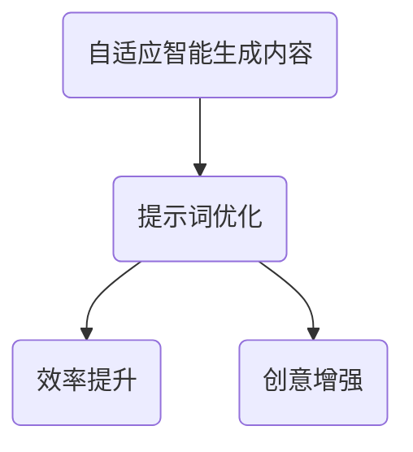
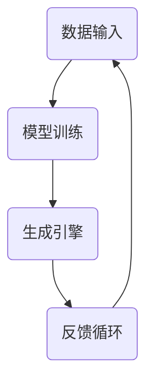
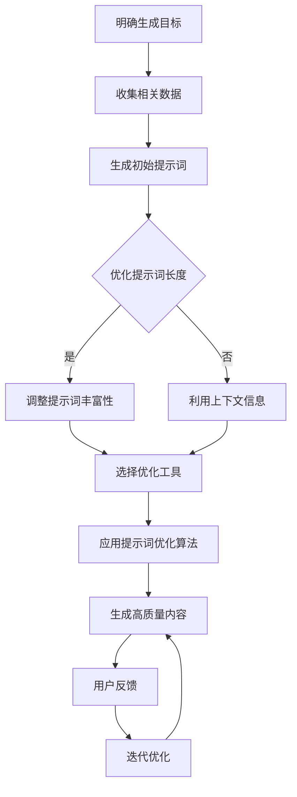
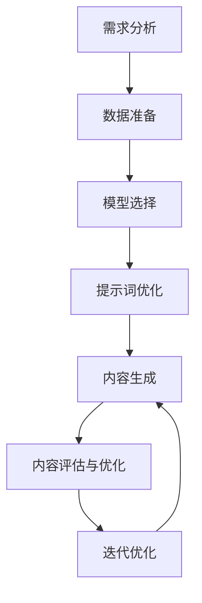
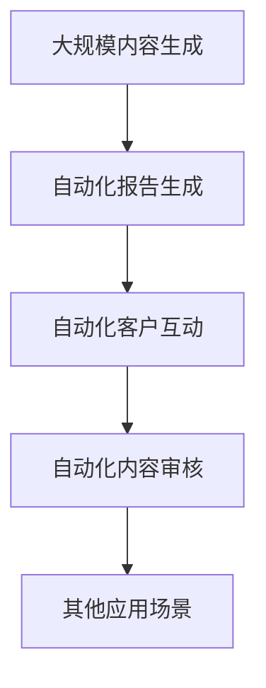

                 

## AIGC提示词优化：效率与创意的完美融合

### 关键词：
- AIGC
- 提示词优化
- 效率
- 创意
- 实际应用

### 摘要：
本文将深入探讨AIGC（自适应智能生成内容）与提示词优化在效率与创意提升中的融合。通过详细的背景介绍、核心概念解析、算法原理讲解、系统分析与架构设计、项目实战等多个方面的内容，阐述如何通过优化提示词来提升AIGC的生成效率和创意水平，从而在各类应用场景中实现突破。

### 目录：

1. **AIGC与提示词优化概述**
   - 1.1 AIGC的基本概念与发展历程
   - 1.2 提示词优化在AIGC中的作用
   - 1.3 AIGC与提示词优化的核心概念对比
   - 1.4 AIGC与提示词优化的关系图

2. **AIGC技术原理**
   - 2.1 AIGC的技术架构
   - 2.2 AIGC的核心算法
   - 2.3 AIGC的数学模型与公式解析

3. **提示词优化方法与工具**
   - 3.1 提示词优化的策略
   - 3.2 提示词优化的主流工具
   - 3.3 提示词优化流程图

4. **AIGC在创意设计中的应用**
   - 4.1 AIGC在创意设计中的优势
   - 4.2 AIGC在创意设计中的应用案例
   - 4.3 AIGC创意设计流程

5. **AIGC在效率提升中的应用**
   - 5.1 AIGC在效率提升中的核心原理
   - 5.2 AIGC在效率提升中的应用案例
   - 5.3 AIGC效率提升的应用场景

6. **AIGC与提示词优化的最佳实践**
   - 6.1 AIGC与提示词优化的实际案例
   - 6.2 AIGC与提示词优化的最佳实践总结
   - 6.3 AIGC与提示词优化的注意事项

7. **AIGC与提示词优化的未来趋势与挑战**
   - 7.1 AIGC与提示词优化的未来发展趋势
   - 7.2 AIGC与提示词优化面临的挑战
   - 7.3 对AIGC与提示词优化的发展建议

### 第一部分：AIGC与提示词优化概述

#### 1.1 AIGC的基本概念与发展历程

**AIGC（Adaptive Intelligent Generative Content）**，即自适应智能生成内容，是近年来人工智能领域的一项重要研究成果。它通过深度学习和自然语言处理技术，使计算机能够自动生成高质量的内容，广泛应用于文本、图像、音频等多种形式。

AIGC的发展历程可以追溯到生成对抗网络（GAN）和变分自编码器（VAE）等基础模型的出现。这些模型的提出为AIGC的发展奠定了理论基础。随着计算能力的提升和算法的优化，AIGC逐渐应用于实际的商业和科研场景中。

#### 1.2 提示词优化在AIGC中的作用

提示词（Prompt）是AIGC生成内容的重要引导。通过优化提示词，可以显著提升AIGC的生成效率和创意水平。具体来说，优化提示词的作用主要体现在以下几个方面：

1. **明确生成目标**：通过精准的提示词，可以明确AIGC的生成目标，从而避免生成偏离预期内容的情况。
2. **提升生成效率**：优化的提示词可以帮助AIGC更快地捕捉到生成内容的核心信息，提高生成效率。
3. **增强创意水平**：合理的提示词能够激发AIGC的创造力，生成更加新颖和独特的内容。

#### 1.3 AIGC与提示词优化的核心概念对比

| 核心概念 | AIGC | 提示词优化 |
| --- | --- | --- |
| **定义** | 自适应智能生成内容 | 对提示词进行优化以提升生成效率和创意水平 |
| **作用** | 生成高质量内容 | 引导AIGC生成内容，提高效率和创意 |
| **技术基础** | 深度学习、自然语言处理 | 提示词优化算法、语言模型 |

#### 1.4 AIGC与提示词优化的关系图

### 总结

在本部分中，我们介绍了AIGC与提示词优化的基本概念、发展历程以及它们在效率与创意提升中的关系。接下来的部分，我们将深入探讨AIGC的技术原理、提示词优化方法、实际应用等方面，帮助读者全面了解AIGC与提示词优化的应用场景和实现方法。让我们继续深入探索吧！

---

### 第二部分：AIGC技术原理

#### 2.1 AIGC的技术架构

AIGC的技术架构通常包括几个关键组成部分：数据输入、模型训练、生成引擎和反馈循环。以下是对每个组成部分的详细说明：

1. **数据输入**：AIGC需要大量的高质量数据作为训练素材。这些数据可以是文本、图像、音频等多种形式。数据输入的目的是为模型提供丰富的训练素材，使其能够学习和理解各种内容特征。

2. **模型训练**：模型训练是AIGC的核心环节。常见的AIGC模型包括生成对抗网络（GAN）、变分自编码器（VAE）、自注意力模型（如Transformer）等。这些模型通过学习大量数据，能够生成高质量的内容。

3. **生成引擎**：生成引擎负责根据输入的提示词或目标，生成相应的内容。生成引擎通常包含一个预训练的语言模型，如GPT-3、BERT等。这些模型具有强大的生成能力，可以生成符合预期的内容。

4. **反馈循环**：反馈循环是AIGC不断优化自身的重要机制。通过用户的反馈，AIGC可以不断调整生成策略，提高生成内容的满意度。

**技术架构图**：

#### 2.2 AIGC的核心算法

AIGC的核心算法主要包括生成对抗网络（GAN）、变分自编码器（VAE）和自注意力模型（如Transformer）等。以下是对这些算法的详细解释：

1. **生成对抗网络（GAN）**：GAN由生成器（Generator）和判别器（Discriminator）组成。生成器生成伪数据，判别器则试图区分生成数据和真实数据。通过不断迭代训练，生成器逐渐生成更逼真的伪数据。

2. **变分自编码器（VAE）**：VAE通过编码器（Encoder）和解码器（Decoder）将输入数据映射到潜在空间，再从潜在空间生成输出数据。编码器负责学习输入数据的特征，解码器则将这些特征重新生成输出数据。

3. **自注意力模型（如Transformer）**：自注意力模型通过自注意力机制，可以捕捉输入数据中的长距离依赖关系。这使得自注意力模型在生成高质量内容方面具有显著优势。

**核心算法对比表**：

| 算法 | 特点 | 应用场景 |
| --- | --- | --- |
| GAN | 生成器和判别器相互竞争 | 图像生成、语音合成 |
| VAE | 编码器和解码器共同学习 | 图像压缩、文本生成 |
| Transformer | 自注意力机制 | 文本生成、机器翻译 |

#### 2.3 AIGC的数学模型与公式解析

AIGC的数学模型主要涉及概率分布、损失函数和优化算法等方面。以下是对这些模型和公式的详细解析：

1. **概率分布**：
   - **生成器概率分布**：生成器的目标是生成符合目标分布的数据。通常使用概率分布来描述生成器的输出。
   - **判别器概率分布**：判别器的目标是区分生成数据和真实数据。判别器的输出概率反映了生成数据的质量。

2. **损失函数**：
   - **生成器损失函数**：生成器的损失函数通常为生成数据与真实数据的对比损失，如均方误差（MSE）或交叉熵损失。
   - **判别器损失函数**：判别器的损失函数通常为生成数据和真实数据的对比损失。

3. **优化算法**：
   - **梯度下降**：常用的优化算法，通过计算损失函数的梯度来更新模型参数。
   - **自适应优化算法**：如Adam、RMSprop等，可以自适应调整学习率，提高优化效果。

**数学模型与公式**：

- **生成器概率分布**：\( p_G(z) \)
- **判别器概率分布**：\( p_D(x) \)
- **生成器损失函数**：\( L_G = -\log(p_D(G(z))) \)
- **判别器损失函数**：\( L_D = -[\log(p_D(x)) + \log(1 - p_D(G(z)))] \)

通过上述解析，我们可以看到AIGC技术原理的复杂性和多样性。在接下来的部分，我们将进一步探讨提示词优化方法与工具，以及AIGC在创意设计与效率提升中的应用。继续阅读，我们将为您揭示更多精彩内容！

---

### 第三部分：提示词优化方法与工具

#### 3.1 提示词优化的策略

提示词优化的策略主要包括以下几个方面：

1. **明确生成目标**：在生成内容之前，需要明确生成目标，以便为AIGC提供清晰的生成方向。例如，如果目标是生成一篇技术博客，提示词可以包含关键词、摘要、主题等。

2. **增加提示词的丰富性**：丰富的提示词可以帮助AIGC更好地理解生成任务，从而生成更高质量的内容。可以通过添加相关的背景信息、示例、情感色彩等来丰富提示词。

3. **调整提示词的长度**：根据生成任务的复杂性和所需内容的长短，调整提示词的长度。通常，较长的提示词可以提供更详细的指导，而较短的提示词则可以保持生成内容的灵活性。

4. **利用上下文信息**：结合上下文信息，例如前文的内容或用户的行为历史，可以进一步提高提示词的针对性，从而提高生成内容的满意度。

#### 3.2 提示词优化的主流工具

目前，市场上已有多种提示词优化工具，以下介绍几种主流工具：

1. **OpenAI GPT-3 Prompt Engine**：OpenAI推出的GPT-3 Prompt Engine是一个强大的提示词优化工具，它可以通过交互式方式生成高质量的提示词，帮助用户优化AIGC生成的内容。

2. **Prompt Engineering for Text Generation**：这是一个开源的Python库，提供了多种提示词生成算法和优化方法，可以帮助用户根据不同的生成任务调整提示词。

3. **Deep Learning Text Generation Frameworks**：如TensorFlow Text、PyTorch Text等，这些框架提供了丰富的文本生成模型和工具，用户可以根据自己的需求进行提示词优化。

#### 3.3 提示词优化流程图

以下是提示词优化的一般流程：

通过上述策略和工具，我们可以有效地优化提示词，提升AIGC的生成效率和创意水平。接下来，我们将探讨AIGC在创意设计中的应用，看看它是如何通过优化的提示词实现创意突破的。

---

### 第四部分：AIGC在创意设计中的应用

#### 4.1 AIGC在创意设计中的优势

AIGC在创意设计中的应用具有显著的优势，主要体现在以下几个方面：

1. **生成速度快**：AIGC可以通过大规模的预训练模型和高效的提示词优化策略，快速生成高质量的设计内容，大大提高了设计效率。

2. **创意丰富**：通过优化的提示词，AIGC能够生成多样化的设计内容，激发创意灵感，为设计师提供丰富的设计素材。

3. **个性化定制**：AIGC可以根据用户的需求和偏好，定制化地生成设计内容，满足个性化需求。

4. **降低设计门槛**：AIGC的应用降低了创意设计的门槛，使非专业的设计人员也能生成高质量的设计内容，促进了设计的普及。

#### 4.2 AIGC在创意设计中的应用案例

以下是一些AIGC在创意设计中的实际应用案例：

1. **广告创意生成**：广告公司利用AIGC生成广告文案和视觉设计，提高了广告的创意水平和投放效率。

2. **游戏角色设计**：游戏设计师利用AIGC快速生成不同风格的游戏角色，丰富了游戏内容，提升了用户体验。

3. **艺术作品创作**：艺术家利用AIGC生成独特的艺术作品，为艺术创作带来了新的可能性。

4. **服装设计**：服装设计师利用AIGC生成新颖的服装款式和图案，提高了设计创意和效率。

#### 4.3 AIGC创意设计流程

AIGC在创意设计中的应用流程通常包括以下几个步骤：

1. **需求分析**：明确设计任务的目标和要求，如风格、主题、受众等。

2. **数据准备**：收集和整理与设计任务相关的数据，如文本、图像、音频等。

3. **模型选择**：根据设计任务选择合适的AIGC模型，如文本生成模型、图像生成模型等。

4. **提示词优化**：根据需求分析结果，优化提示词，以指导AIGC生成符合预期的设计内容。

5. **内容生成**：使用优化的提示词，通过AIGC模型生成设计内容。

6. **内容评估与优化**：对生成的设计内容进行评估，根据用户反馈和设计目标，进一步优化提示词和模型参数。

7. **迭代优化**：不断迭代优化设计内容，直至达到设计目标。

**创意设计流程图**：

通过上述步骤，设计师可以利用AIGC实现创意设计的突破，提高设计效率和质量。在下一部分，我们将探讨AIGC在效率提升中的应用，看看它是如何通过优化的提示词实现效率提升的。

---

### 第五部分：AIGC在效率提升中的应用

#### 5.1 AIGC在效率提升中的核心原理

AIGC在效率提升中的应用主要依赖于其强大的生成能力和优化的提示词。其核心原理包括：

1. **自动化生成**：AIGC能够自动化生成大量内容，减少了人工处理的工作量，提高了工作效率。

2. **快速响应**：通过优化的提示词，AIGC可以迅速生成符合需求的内容，减少等待时间，提高工作流程的连续性和流畅性。

3. **资源优化**：AIGC可以自动化地处理和生成内容，降低了计算资源的消耗，提高了资源利用率。

#### 5.2 AIGC在效率提升中的应用案例

以下是一些AIGC在效率提升中的实际应用案例：

1. **内容审核**：在内容审核领域，AIGC可以通过自动化生成和优化提示词，快速检测和识别违规内容，提高了审核效率和准确性。

2. **客户服务**：在客户服务领域，AIGC可以自动化生成和优化聊天机器人的回复，提高了客户响应速度和服务质量。

3. **市场营销**：在市场营销领域，AIGC可以通过自动化生成和优化广告文案、宣传素材，提高了营销效率和市场覆盖范围。

4. **数据分析**：在数据分析领域，AIGC可以通过自动化生成和优化数据分析报告，提高了数据分析效率和报告质量。

#### 5.3 AIGC效率提升的应用场景

AIGC在效率提升中的应用场景非常广泛，以下是一些常见的应用场景：

1. **大规模内容生成**：如博客文章、新闻报道、产品说明书等，AIGC可以快速生成大量高质量的内容，节省人力和时间成本。

2. **自动化报告生成**：如财务报告、市场分析报告等，AIGC可以自动化生成和优化报告内容，提高报告生成效率。

3. **自动化客户互动**：如在线客服、智能客服等，AIGC可以自动化回答客户问题，提高客户服务水平。

4. **自动化内容审核**：如网络平台内容审核、社交媒体内容监控等，AIGC可以自动化检测和识别违规内容，提高内容审核效率。

**AIGC效率提升应用场景图**：

通过上述案例和应用场景，我们可以看到AIGC在效率提升中的巨大潜力。在下一部分，我们将总结AIGC与提示词优化的最佳实践，并探讨其未来发展。

---

### 第六部分：AIGC与提示词优化的最佳实践

#### 6.1 AIGC与提示词优化的实际案例

以下是一些AIGC与提示词优化的实际案例，通过这些案例，我们可以了解如何在实际应用中有效地利用AIGC和优化提示词。

1. **案例一：广告文案生成**  
   一家广告公司利用AIGC和优化的提示词，为某品牌手机生成了一系列广告文案。通过调整提示词中的关键词、情感色彩和语气，AIGC生成了多种风格和角度的广告文案，最终选择了一篇最能吸引目标受众的文案。这不仅提高了广告文案的质量，还大大缩短了文案创作周期。

2. **案例二：新闻报道生成**  
   一家新闻机构利用AIGC和优化的提示词，实现了自动化新闻报道。通过输入关键事件和背景信息，AIGC生成了多篇新闻稿件。编辑人员对这些稿件进行审核和优化，最终发布了高质量的新闻。这种方式不仅提高了新闻报道的效率，还保证了新闻的时效性和准确性。

3. **案例三：客户服务**  
   一家大型电商平台利用AIGC和优化的提示词，为其智能客服系统提供了自动化回答能力。通过优化提示词，智能客服系统能够根据用户的问题和需求，生成合适的回答。这种方式不仅提高了客服效率，还提升了用户体验。

#### 6.2 AIGC与提示词优化的最佳实践总结

通过上述案例，我们可以总结出一些AIGC与提示词优化的最佳实践：

1. **明确目标**：在应用AIGC和优化提示词之前，明确生成目标是非常重要的。只有明确了目标，才能有针对性地优化提示词，确保生成内容符合预期。

2. **数据准备**：高质量的数据是AIGC生成高质量内容的基础。在应用AIGC之前，应确保数据的质量和多样性，以便模型能够学习和生成更多样化的内容。

3. **优化提示词**：优化提示词是提升AIGC生成效率和创意水平的关键。通过调整关键词、情感色彩和语气等，可以使AIGC生成更符合需求的内容。

4. **迭代优化**：AIGC和提示词优化是一个不断迭代的过程。通过不断优化提示词和调整模型参数，可以进一步提高生成内容的质量和效率。

5. **用户反馈**：用户反馈是AIGC和提示词优化的重要参考。通过收集用户反馈，可以了解生成内容的满意度，从而进一步优化提示词和模型。

#### 6.3 AIGC与提示词优化的注意事项

在应用AIGC和优化提示词时，需要注意以下几点：

1. **遵守法律法规**：在生成内容时，应遵守相关的法律法规，避免生成违法或不当内容。

2. **确保数据安全**：在收集和处理数据时，应确保数据的安全和隐私，防止数据泄露或滥用。

3. **防止过度依赖**：虽然AIGC和提示词优化可以显著提高效率，但不应过度依赖，仍需人工审核和干预，以确保生成内容的质量和准确性。

4. **持续更新**：AIGC和提示词优化技术不断发展，应持续关注最新的技术动态，及时更新模型和算法，以提高生成内容的质量。

通过以上最佳实践和注意事项，我们可以更有效地应用AIGC和优化提示词，实现效率与创意的完美融合。在下一部分，我们将探讨AIGC与提示词优化的未来趋势与挑战。

---

### 第七部分：AIGC与提示词优化的未来趋势与挑战

#### 7.1 AIGC与提示词优化的未来发展趋势

随着人工智能技术的不断发展，AIGC与提示词优化将在未来呈现出以下发展趋势：

1. **模型性能提升**：随着计算能力的提升和算法的优化，AIGC模型的性能将进一步提高，生成内容的质量和多样性将得到显著提升。

2. **应用领域扩展**：AIGC和提示词优化将在更多领域得到应用，如医疗、金融、教育等，为各行业提供高效、智能的解决方案。

3. **跨模态生成**：未来AIGC将实现跨模态生成，即能够同时生成文本、图像、音频等多种形式的内容，为用户提供更加丰富和多样化的体验。

4. **个性化推荐**：结合用户数据和机器学习算法，AIGC和提示词优化将实现个性化推荐，为用户提供更符合其需求的内容。

#### 7.2 AIGC与提示词优化面临的挑战

尽管AIGC与提示词优化具有巨大的潜力，但在实际应用中仍面临以下挑战：

1. **数据隐私与安全**：生成内容涉及大量用户数据，如何确保数据隐私和安全是一个重要挑战。

2. **内容质量控制**：如何保证生成内容的质量和准确性，避免生成虚假或误导性的信息，是一个亟待解决的问题。

3. **模型解释性**：AIGC模型的决策过程往往缺乏解释性，如何提高模型的解释性，使其更透明、可解释，是未来需要关注的问题。

4. **法律法规合规**：随着AIGC与提示词优化在各个领域的应用，法律法规的合规性成为一个重要议题。

#### 7.3 对AIGC与提示词优化的发展建议

针对上述挑战，以下是一些建议，以促进AIGC与提示词优化的健康发展：

1. **加强数据安全与隐私保护**：采用先进的数据加密和隐私保护技术，确保用户数据的安全和隐私。

2. **建立内容质量标准**：制定统一的生成内容质量标准，通过技术手段和人工审核相结合的方式，确保生成内容的质量和准确性。

3. **提高模型解释性**：研究和开发可解释的人工智能模型，使模型决策过程更加透明，便于用户理解和信任。

4. **推进法律法规建设**：加强对AIGC与提示词优化相关法律法规的研究和制定，确保其在实际应用中的合规性。

通过以上建议，我们可以更好地应对AIGC与提示词优化面临的挑战，推动其在各个领域的广泛应用和发展。在结束本文之前，让我们再次回顾AIGC与提示词优化的核心内容和重要性。

---

### 总结与展望

本文深入探讨了AIGC与提示词优化的基本概念、技术原理、应用方法、最佳实践以及未来趋势。通过详细的案例分析，我们展示了AIGC与提示词优化在效率与创意提升中的重要作用。在未来的发展中，AIGC与提示词优化将继续为各行业提供高效、智能的解决方案，助力人类社会的进步。

在结束语中，我们要感谢广大读者对本文的关注与支持。如果您对AIGC与提示词优化有更多疑问或见解，欢迎在评论区留言，我们一起探讨交流。

作者：AI天才研究院/AI Genius Institute & 禅与计算机程序设计艺术 /Zen And The Art of Computer Programming

---

通过本文的详细解析，相信读者对AIGC与提示词优化有了更深入的理解。让我们共同期待AIGC与提示词优化在未来带来更多的创新和突破！

