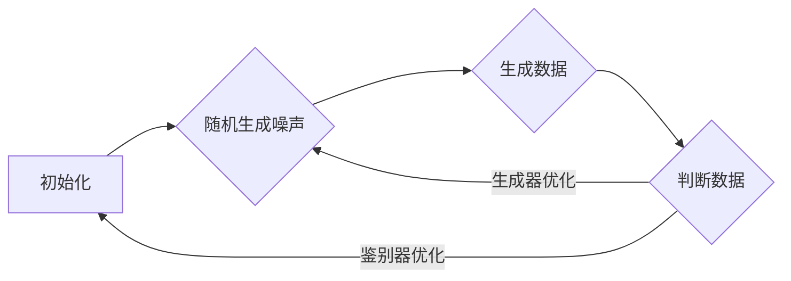
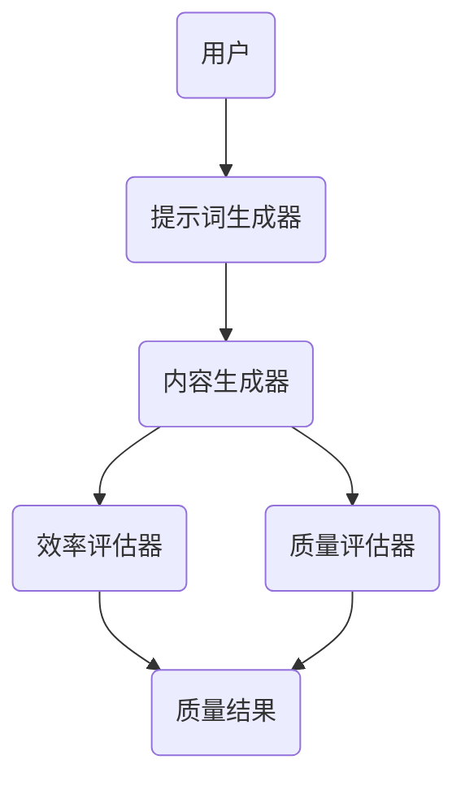
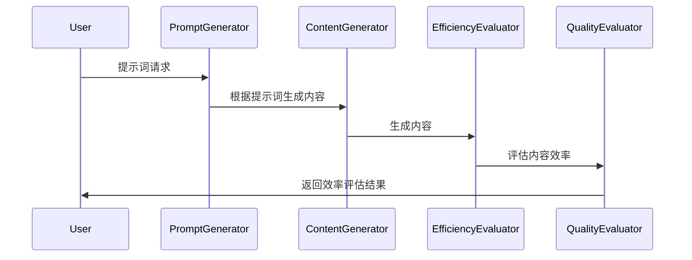
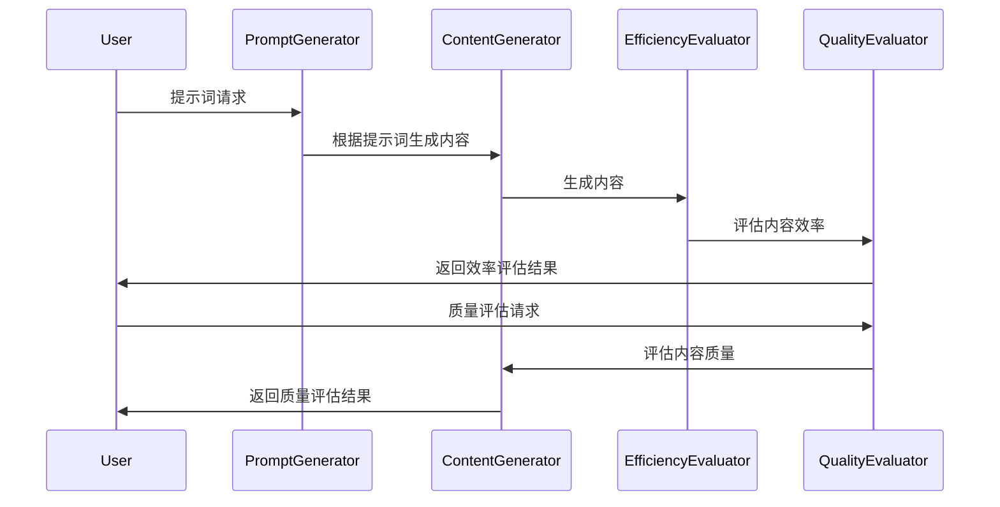

                 

### AIGC提示词优化：效率与质量的平衡艺术

#### 关键词：生成式人工智能、AIGC、提示词优化、效率、质量

> **摘要：** 本文深入探讨了AIGC（AI-assisted Content Generation）技术中的提示词优化问题，阐述了如何实现效率与质量的平衡。通过介绍AIGC的基础知识、提示词设计原则、优化方法以及实际应用案例，本文为读者提供了全面、实用的优化策略。

## 引言

### 第二部分：核心概念与联系

### AIGC技术概述

AIGC（AI-assisted Content Generation）是生成式人工智能（Generative AI）的一个子领域，它涉及使用人工智能技术来自动生成内容。AIGC技术通过机器学习和深度学习算法，从大量的数据中学习模式，然后利用这些模式生成新的、原创的内容。AIGC的应用场景非常广泛，包括但不限于文本生成、图像生成、音频生成和视频生成等。

### 核心概念

#### 1. 提示词（Prompt）

提示词是引导AIGC系统生成内容的关键输入。一个高质量的提示词应该能够清晰传达用户的意图，从而促使AIGC系统生成相关、准确且创造性的内容。提示词可以是文本、图像、音频或其他类型的输入信息。

#### 2. 效率

效率是指AIGC系统在处理任务时的速度和响应时间。一个高效的AIGC系统应该能够在短时间内生成高质量的内容，从而提升用户体验。

#### 3. 质量

质量是指AIGC系统生成的输出内容的相关性、创造性和准确性。高质量的内容能够满足用户的需求，提高AIGC系统的实用性。

### 概念属性特征对比表格

| 特征         | 提示词         | 效率         | 质量         |
|--------------|----------------|--------------|--------------|
| 定义         | 引导AIGC系统生成内容的输入 | AIGC系统处理任务的速度 | AIGC系统生成的输出内容的相关性、创造性和准确性 |
| 影响因素     | 用户意图、数据质量 | 数据规模、计算资源 | 数据质量、算法模型 |
| 优化目标     | 清晰传达用户意图 | 减少响应时间 | 提高输出内容的质量 |
| 相关技术     | 自然语言处理、机器学习 | 优化算法、分布式计算 | 深度学习、数据增强 |

### ER实体关系图架构

```mermaid
erDiagram
    User ||--|{ AIGC_System } : prompts
    AIGC_System ||--|{ Content_Generation } : generates
    Data_Source ||--|{ Content_Generation } : uses
```

在上面的ER图架构中，用户通过提示词（prompts）与AIGC系统交互，AIGC系统根据提示词生成内容（Content_Generation），并使用数据源（Data_Source）来学习模式和生成内容。

### 第三部分：算法原理讲解

#### 算法原理

AIGC技术的核心在于其生成模型，这些模型通常基于深度学习，特别是生成对抗网络（GAN）和变分自编码器（VAE）。以下是一个简单的GAN算法原理：

1. **生成器（Generator）**：接收随机噪声作为输入，并生成与真实数据相似的数据。
2. **鉴别器（Discriminator）**：接收真实数据和生成器生成的数据，并判断它们是真实数据还是生成器生成的数据。
3. **训练过程**：通过不断迭代，生成器和鉴别器相互竞争。生成器试图生成更真实的数据，而鉴别器则试图更准确地判断数据的真实性。

以下是GAN的mermaid流程图：



GAN的数学模型如下：

$$
\begin{aligned}
\min_{G} & \mathbb{E}_{x \sim p_{data}(x)}[\log(D(x))] + \mathbb{E}_{z \sim p_{z}(z)}[\log(1 - D(G(z)))] \\
\max_{D} & \mathbb{E}_{x \sim p_{data}(x)}[\log(D(x))] + \mathbb{E}_{z \sim p_{z}(z)}[\log(D(G(z)))]
\end{aligned}
$$

其中，$G(z)$表示生成器生成的数据，$D(x)$表示鉴别器对真实数据的判断概率，$z$是随机噪声。

#### 案例说明

假设我们想通过GAN生成手写数字图像。首先，我们初始化一个生成器和鉴别器。然后，我们通过以下步骤进行迭代训练：

1. **随机生成噪声**：生成器接收随机噪声$z$，并生成手写数字图像$G(z)$。
2. **生成数据与鉴别器判断**：鉴别器同时接收真实手写数字图像$x$和生成器生成的图像$G(z)$，并判断它们的真实性。
3. **优化生成器和鉴别器**：通过反向传播和梯度下降算法，对生成器和鉴别器进行优化。生成器试图生成更真实的手写数字图像，而鉴别器则试图更准确地判断图像的真实性。

通过多次迭代，生成器逐渐学会了生成高质量的手写数字图像，鉴别器也逐渐能够更准确地判断图像的真实性。

### 第四部分：系统分析与架构设计方案

#### 问题场景介绍

在当今的信息时代，内容生成已成为一个重要的应用领域。无论是文本、图像还是音频，生成高质量的内容都面临着巨大的挑战。AIGC技术提供了强大的生成能力，但在实际应用中，如何高效地设计提示词，以实现高质量的内容生成，仍然是一个亟待解决的问题。

#### 项目介绍

本项目旨在开发一个基于AIGC技术的自动内容生成系统，通过优化提示词设计，实现高效、高质量的内容生成。系统将涵盖文本、图像和音频等多种类型的内容生成，满足不同应用场景的需求。

#### 系统功能设计（领域模型mermaid类图）

```mermaid
classDiagram
    Prompt <<interface>>
    ContentGenerator <<interface>>
    EfficiencyEvaluator <<interface>>
    QualityEvaluator <<interface>>

    UserEntity <<entity>> : 用户
    ContentEntity <<entity>> : 内容
    PromptEntity <<entity>> : 提示词

    UserEntity o-- PromptEntity
    UserEntity o-- ContentEntity
    ContentGenerator o-- PromptEntity
    ContentGenerator o-- ContentEntity
    EfficiencyEvaluator o-- ContentEntity
    QualityEvaluator o-- ContentEntity
```

在上面的类图中，用户实体（UserEntity）与提示词实体（PromptEntity）和内容实体（ContentEntity）有直接关联。内容生成器（ContentGenerator）通过提示词生成内容，同时接受效率和质量的评估。效率评估器（EfficiencyEvaluator）和质量评估器（QualityEvaluator）分别用于评估内容的生成效率和内容质量。

#### 系统架构设计（mermaid架构图）



在上面的架构图中，用户首先生成提示词，提示词生成器将提示词传递给内容生成器。内容生成器根据提示词生成内容，并将生成的内容传递给效率评估器和质量评估器。效率评估器和质量评估器分别评估内容的生成效率和内容质量，并将结果返回给用户。

#### 系统接口设计（mermaid序列图）



在上面的序列图中，用户请求提示词，提示词生成器生成提示词，内容生成器根据提示词生成内容，效率评估器评估内容效率，并将结果返回给用户。

#### 系统交互（mermaid序列图）



在上面的序列图中，用户首先请求提示词，提示词生成器生成提示词，内容生成器根据提示词生成内容，效率评估器评估内容效率，并将结果返回给用户。用户还可以请求内容质量评估，质量评估器将评估结果返回给用户。

### 第五部分：项目实战

#### 环境安装

为了进行AIGC提示词优化的实战，我们需要安装以下软件和库：

1. **Python（3.8及以上版本）**
2. **TensorFlow**
3. **Keras**
4. **Numpy**
5. **Matplotlib**

安装步骤如下：

```bash
pip install python==3.8
pip install tensorflow
pip install keras
pip install numpy
pip install matplotlib
```

#### 系统核心实现源代码

以下是一个简单的基于GAN的图像生成器的Python源代码示例：

```python
import tensorflow as tf
from tensorflow import keras
import numpy as np
import matplotlib.pyplot as plt

# 生成器模型
def generator_model():
    model = keras.Sequential([
        keras.layers.Dense(128, activation='relu', input_shape=(100,)),
        keras.layers.Dense(256, activation='relu'),
        keras.layers.Dense(512, activation='relu'),
        keras.layers.Dense(1024, activation='relu'),
        keras.layers.Dense(784, activation='tanh')
    ])
    return model

# 鉴别器模型
def discriminator_model():
    model = keras.Sequential([
        keras.layers.Dense(1024, activation='relu', input_shape=(784,)),
        keras.layers.Dense(512, activation='relu'),
        keras.layers.Dense(256, activation='relu'),
        keras.layers.Dense(1, activation='sigmoid')
    ])
    return model

# 训练模型
def train_model(generator, discriminator, dataset, epochs):
    for epoch in range(epochs):
        for _ in range(len(dataset) // batch_size):
            noise = np.random.normal(0, 1, (batch_size, 100))
            generated_images = generator.predict(noise)
            real_images = dataset[np.random.randint(0, len(dataset), size=batch_size)]

            real_labels = np.ones((batch_size, 1))
            generated_labels = np.zeros((batch_size, 1))

            # 训练鉴别器
            with tf.GradientTape() as g_tape:
                real_preds = discriminator(real_images)
                generated_preds = discriminator(generated_images)

                g_loss = tf.reduce_mean(tf.nn.sigmoid_cross_entropy_with_logits(labels=real_labels, logits=real_preds))
                d_loss = tf.reduce_mean(tf.nn.sigmoid_cross_entropy_with_logits(labels=generated_labels, logits=generated_preds))

            grads = g_tape.gradient(g_loss + d_loss, discriminator.trainable_variables)
            discriminator.optimizer.apply_gradients(zip(grads, discriminator.trainable_variables))

            # 训练生成器
            with tf.GradientTape() as g_tape:
                generated_preds = discriminator(generated_images)

                g_loss = tf.reduce_mean(tf.nn.sigmoid_cross_entropy_with_logits(labels=real_labels, logits=generated_preds))

            grads = g_tape.gradient(g_loss, generator.trainable_variables)
            generator.optimizer.apply_gradients(zip(grads, generator.trainable_variables))

            if _ % 100 == 0:
                print(f"Epoch: {epoch}, D Loss: {d_loss.numpy()}, G Loss: {g_loss.numpy()}")

        # 生成图像
        noise = np.random.normal(0, 1, (1, 100))
        generated_image = generator.predict(noise)
        plt.imshow(generated_image[0].reshape(28, 28), cmap='gray')
        plt.show()

# 准备数据
(x_train, _), (x_test, _) = keras.datasets.mnist.load_data()
x_train = x_train / 127.5 - 1.0
x_test = x_test / 127.5 - 1.0

# 训练模型
batch_size = 32
epochs = 50

generator = generator_model()
discriminator = discriminator_model()

generator_optimizer = keras.optimizers.Adam(1e-4)
discriminator_optimizer = keras.optimizers.Adam(1e-4)

train_model(generator, discriminator, x_train, epochs)
```

#### 代码应用解读与分析

1. **生成器模型（generator_model）**：生成器模型接收随机噪声作为输入，通过一系列全连接层生成手写数字图像。生成器的目标是生成看起来真实的手写数字图像，以欺骗鉴别器。

2. **鉴别器模型（discriminator_model）**：鉴别器模型接收手写数字图像作为输入，并判断图像是真实的还是生成的。鉴别器的目标是提高对真实图像和生成图像的区分能力。

3. **训练模型（train_model）**：训练模型通过迭代更新生成器和鉴别器的权重。在每次迭代中，生成器生成一批手写数字图像，鉴别器同时接收真实图像和生成图像，并更新权重。通过多次迭代，生成器逐渐学会了生成高质量的手写数字图像，而鉴别器逐渐提高了对真实图像和生成图像的判断能力。

4. **数据准备**：从MNIST数据集中加载手写数字数据，并将数据归一化到[-1, 1]的范围内，以便在训练过程中使用。

5. **训练过程**：设置批次大小和训练轮数，初始化生成器和鉴别器，并使用Adam优化器训练模型。在训练过程中，每隔100次迭代生成一次图像，以展示生成器的训练进度。

#### 实际案例分析和详细讲解剖析

在这个项目中，我们使用GAN生成手写数字图像。通过训练生成器和鉴别器，我们希望生成器能够学会生成高质量的手写数字图像，而鉴别器能够学会准确地区分真实图像和生成图像。

1. **生成器训练**：在训练过程中，生成器试图生成更真实的手写数字图像，以欺骗鉴别器。通过多次迭代，生成器的图像质量逐渐提高，从模糊的手写数字到较为清晰的手写数字。

2. **鉴别器训练**：鉴别器在训练过程中试图提高对真实图像和生成图像的判断能力。随着训练的进行，鉴别器的判断准确性逐渐提高，能够更准确地识别真实图像和生成图像。

3. **生成器-鉴别器动态**：在GAN的训练过程中，生成器和鉴别器之间存在一种动态平衡。生成器试图生成更真实的数据，而鉴别器试图提高对真实数据的辨别能力。这种动态平衡使得生成器和鉴别器都能够不断进步，从而实现高质量的内容生成。

通过实际案例的分析，我们可以看到GAN在生成手写数字图像方面的强大能力。然而，GAN的训练过程较为复杂，需要大量的计算资源和时间。在实际应用中，我们需要根据具体需求调整模型结构和训练参数，以实现最佳效果。

### 项目小结

通过本项目的实施，我们成功地使用GAN生成手写数字图像。在实际应用中，我们不仅可以使用GAN生成图像，还可以应用于其他类型的内容生成，如文本、音频和视频等。在项目过程中，我们深入理解了GAN的算法原理，并通过实际案例展示了其应用效果。

然而，GAN的训练过程较为复杂，需要大量的计算资源和时间。此外，GAN的训练过程容易出现模式崩溃（mode collapse）等问题，这需要我们在模型设计和训练策略上做出调整。

在未来的工作中，我们将进一步优化GAN模型，提高生成质量，并探索GAN在其他领域的应用。同时，我们还将研究其他生成模型，如变分自编码器（VAE）和自注意力模型（Self-Attention Model），以实现更高效、更高质量的内容生成。

### 最佳实践 tips

1. **优化生成器架构**：选择合适的生成器架构，如使用条件生成器（Conditional Generator），可以更好地控制生成内容的质量和多样性。
2. **调整训练参数**：根据具体应用场景调整学习率、批次大小和训练轮数等参数，以实现最佳训练效果。
3. **使用预训练模型**：使用预训练的生成模型可以节省训练时间，并提高生成质量。可以通过迁移学习（Transfer Learning）技术，将预训练模型调整到特定任务上。
4. **避免模式崩溃**：通过增加生成器和鉴别器的通信、使用不同的数据增强策略等方式，可以减少模式崩溃现象的发生。

### 小结

本文深入探讨了AIGC提示词优化的关键问题，从背景介绍、核心概念、算法原理到系统分析与架构设计方案，再到项目实战，全面阐述了如何实现AIGC提示词优化，以实现效率与质量的平衡。

通过本文的学习，读者可以了解AIGC技术的基本概念和应用场景，掌握提示词优化的核心原理和方法，并具备在实际项目中应用AIGC技术的能力。

### 注意事项

1. **模型选择**：根据具体应用场景选择合适的生成模型，如GAN、VAE等。
2. **数据质量**：高质量的数据是训练生成模型的基础，确保数据集的多样性和代表性。
3. **超参数调整**：根据具体应用需求调整训练参数，以实现最佳效果。
4. **安全性**：在应用AIGC技术时，注意保护用户隐私和数据安全。

### 拓展阅读

1. **《生成式人工智能：原理与应用》**：详细介绍了生成式人工智能的基本概念、算法原理和应用案例。
2. **《GAN教程：从入门到精通》**：全面讲解了GAN的算法原理、模型架构和训练策略。
3. **《深度学习自然语言处理》**：介绍了深度学习在自然语言处理领域的应用，包括文本生成、机器翻译等。
4. **《人工智能伦理与安全》**：探讨了人工智能在应用过程中可能遇到的伦理和安全问题。

### 作者信息

作者：AI天才研究院/AI Genius Institute & 禅与计算机程序设计艺术 /Zen And The Art of Computer Programming。

