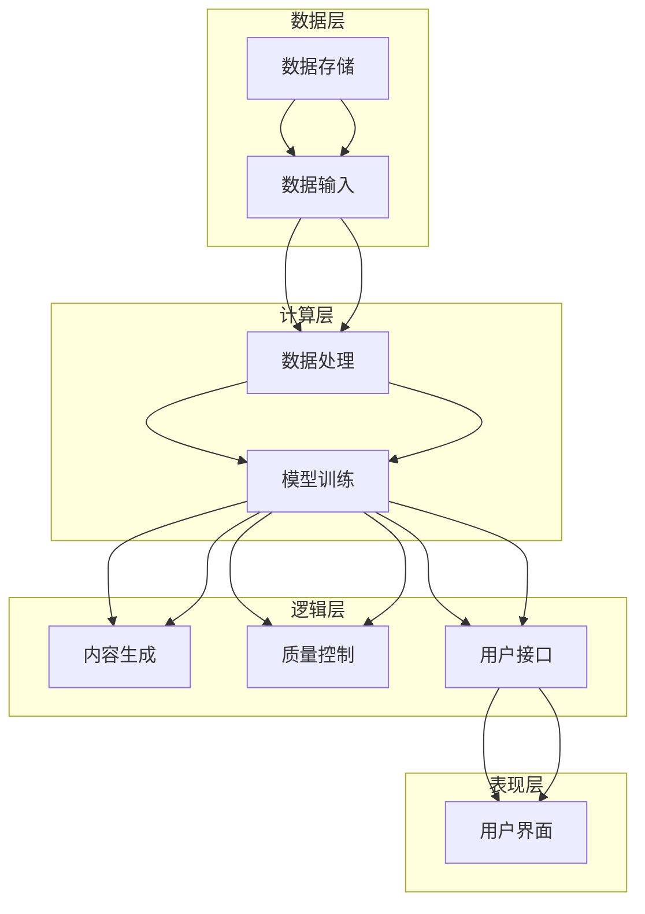

                 


### 引言

在当今技术快速发展的时代，人工智能（AI）已经成为推动创新和效率提升的重要力量。而AIGC（AI Generated Content），即由人工智能生成的内容，更是引发了一场内容创作的革命。AIGC涵盖了从简单的文本生成到复杂的图像、视频、音频等多种内容形式的创作过程。随着深度学习、自然语言处理（NLP）等技术的不断进步，AIGC的应用场景越来越广泛，从广告营销、内容创作、教育、医疗到娱乐等众多领域，都可以看到AIGC的身影。

本文旨在为读者提供一份全面而深入的AIGC提示词编写指南。我们将从基础概念开始，逐步深入探讨AIGC的核心技术、算法原理、数学模型，直至具体的项目实战和最佳实践。本文的目标是帮助读者不仅理解AIGC的概念和原理，还能够掌握编写高质量AIGC提示词的技巧，最终在实践项目中发挥出AIGC的最大潜力。

### 关键词

- 人工智能生成内容（AIGC）
- 深度学习
- 自然语言处理（NLP）
- 提示词编写
- 内容创作
- 算法原理
- 数学模型
- 项目实战
- 最佳实践

### 摘要

本文将详细介绍AIGC（AI Generated Content）的编写过程，从基础概念到高级技巧进行全面探讨。首先，我们将回顾AIGC的背景和发展历程，明确核心概念和基本原理。随后，通过具体算法和数学模型，深入讲解AIGC的生成机制。文章还将分析系统架构和设计方案，并提供实际项目实战经验和最佳实践建议。通过本文，读者将能够系统地了解AIGC的编写过程，提升在实际应用中的能力。

## 目录

### 第一部分：背景介绍

- 1.1 AIGC的背景与发展
- 1.2 AIGC的核心概念

### 第二部分：核心概念与联系

- 2.1 核心概念与联系
- 2.2 深度学习与NLP
- 2.3 提示词的编写技巧

### 第三部分：算法原理讲解

- 3.1 算法原理讲解
- 3.2 算法mermaid流程图
- 3.3 Python源代码讲解
- 3.4 数学模型和数学公式

### 第四部分：数学模型和数学公式 & 详细讲解 & 举例说明

- 4.1 数学模型和数学公式
- 4.2 详细讲解
- 4.3 举例说明

### 第五部分：系统分析与架构设计方案

- 5.1 问题场景介绍
- 5.2 系统功能设计
- 5.3 系统架构设计
- 5.4 系统接口设计
- 5.5 系统交互

### 第六部分：项目实战

- 6.1 环境安装
- 6.2 系统核心实现源代码
- 6.3 实际案例分析和详细讲解剖析
- 6.4 项目小结

### 第七部分：最佳实践 tips

- 7.1 最佳实践

### 第八部分：小结、注意事项、拓展阅读

- 8.1 小结
- 8.2 注意事项
- 8.3 拓展阅读

### 引言

在当今技术快速发展的时代，人工智能（AI）已经成为推动创新和效率提升的重要力量。而AIGC（AI Generated Content），即由人工智能生成的内容，更是引发了一场内容创作的革命。AIGC涵盖了从简单的文本生成到复杂的图像、视频、音频等多种内容形式的创作过程。随着深度学习、自然语言处理（NLP）等技术的不断进步，AIGC的应用场景越来越广泛，从广告营销、内容创作、教育、医疗到娱乐等众多领域，都可以看到AIGC的身影。

本文旨在为读者提供一份全面而深入的AIGC提示词编写指南。我们将从基础概念开始，逐步深入探讨AIGC的核心技术、算法原理、数学模型，直至具体的项目实战和最佳实践。本文的目标是帮助读者不仅理解AIGC的概念和原理，还能够掌握编写高质量AIGC提示词的技巧，最终在实践项目中发挥出AIGC的最大潜力。

### 第一部分：背景介绍

### 1.1 AIGC的背景与发展

人工智能生成内容（AIGC）的概念并不是最近才出现的，但其发展历程却充满了变革和创新。AIGC最早可以追溯到20世纪80年代，当时的专家系统（Expert Systems）和知识表示（Knowledge Representation）技术开始崭露头角。然而，由于计算资源和算法的限制，AIGC的发展在很长一段时间内都处于缓慢状态。

随着21世纪初深度学习（Deep Learning）的崛起，AIGC迎来了新的发展契机。深度学习通过神经网络模型，特别是卷积神经网络（CNN）和递归神经网络（RNN）的广泛应用，使得图像和文本的生成变得可能。这一时期，生成对抗网络（GAN）的提出进一步推动了AIGC的发展，使其在图像生成、文本生成和音频生成等方面取得了显著突破。

到了2010年代后期，随着计算资源的进一步提升和算法的优化，AIGC的应用开始逐渐渗透到各行各业。例如，在广告营销中，AIGC可以自动生成个性化的广告文案和图像；在内容创作中，AIGC能够帮助创作者快速生成高质量的文本和视频；在医疗领域，AIGC可以用于生成医疗报告和辅助诊断。

### 1.1.1 问题背景

随着互联网和社交媒体的迅速发展，用户对内容的需求日益增加。传统的手动内容创作方式已经无法满足快速迭代的市场需求。与此同时，人工智能技术，尤其是深度学习和自然语言处理（NLP）的进步，为自动化内容生成提供了可能。这种需求和技术进步的结合，催生了AIGC的兴起。

### 1.1.2 问题描述

AIGC的主要目标是通过人工智能技术，自动生成各种类型的内容，包括文本、图像、视频、音频等。然而，要实现这一目标，面临着以下几个挑战：

1. **数据需求**：高质量的AIGC生成需要大量的训练数据。然而，获取和整理这些数据是一个复杂且耗时的过程。
2. **算法复杂性**：AIGC的生成算法，如GAN、RNN和Transformer等，涉及到复杂的数学和计算过程，对算法的理解和优化要求较高。
3. **质量控制**：如何保证生成的AIGC内容的质量和可读性，是一个亟待解决的问题。
4. **法律和伦理**：AIGC生成的内容可能涉及版权、隐私和伦理等问题，如何平衡技术创新和社会责任，是另一个需要考虑的因素。

### 1.1.3 问题解决

为了解决上述问题，研究人员和开发者采取了多种策略：

1. **数据增强**：通过数据增强技术，如数据扩充、数据融合等，提高训练数据的质量和数量。
2. **算法优化**：不断优化AIGC的生成算法，提高其生成质量和效率。例如，通过改进GAN的结构和训练策略，提高生成图像的分辨率和细节。
3. **质量控制**：引入监督学习和强化学习等技术，对生成的AIGC内容进行质量评估和优化。例如，使用用户反馈来调整生成模型，提高内容的可读性和吸引力。
4. **法律法规和伦理指南**：制定相关的法律法规和伦理指南，确保AIGC的应用不会侵犯版权、隐私和伦理底线。

### 1.1.4 边界与外延

AIGC的应用场景非常广泛，但同时也存在一些边界和限制。首先，AIGC在生成特定领域内容时，可能需要大量专业知识和数据支持。其次，生成的AIGC内容可能存在错误或不一致的问题，需要通过人工审核和修正。此外，AIGC的发展还受到计算资源和能源消耗的制约。

### 1.1.5 概念结构与核心要素组成

AIGC的概念结构主要包括以下几个方面：

1. **数据输入**：AIGC的生成过程需要大量的数据输入，包括文本、图像、音频等。这些数据可以来自互联网、数据库、传感器等多种渠道。
2. **生成模型**：生成模型是AIGC的核心，常见的生成模型包括GAN、RNN、Transformer等。这些模型通过学习大量数据，生成高质量的内容。
3. **优化策略**：优化策略用于提高生成模型的质量和效率。常见的优化策略包括数据增强、算法改进、模型压缩等。
4. **质量控制**：质量控制环节用于评估和优化生成的AIGC内容的质量。常用的方法包括自动评估、用户反馈等。
5. **输出结果**：生成的AIGC内容可以以各种形式输出，如文本、图像、视频等，广泛应用于广告营销、内容创作、医疗诊断等领域。

### 1.2 AIGC的核心概念

为了深入理解AIGC，我们需要首先了解其核心概念，包括深度学习、自然语言处理（NLP）、生成对抗网络（GAN）等。

#### 1.2.1 核心概念原理

1. **深度学习**：深度学习是一种基于神经网络的学习方法，通过多层神经元的堆叠，对大量数据进行特征提取和模式识别。深度学习在图像识别、语音识别、自然语言处理等领域取得了显著的成果。
   
2. **自然语言处理（NLP）**：自然语言处理是人工智能的一个重要分支，旨在让计算机理解和处理人类语言。NLP涉及文本分类、情感分析、命名实体识别、机器翻译等多个子领域。

3. **生成对抗网络（GAN）**：生成对抗网络是一种由生成器和判别器组成的对抗性模型。生成器试图生成与真实数据相似的内容，而判别器则试图区分生成数据与真实数据。通过这种对抗性训练，GAN能够生成高质量、逼真的图像、文本等。

#### 1.2.2 概念属性特征对比表格

| 概念        | 特征对比           |
| ----------- | ------------------ |
| 深度学习    | 基于多层神经网络的机器学习方法 |
| 自然语言处理 | 让计算机理解和处理人类语言 |
| GAN         | 生成对抗性模型，用于图像和文本生成 |

#### 1.2.3 ER实体关系图架构

为了更直观地展示AIGC的核心概念和它们之间的关系，我们可以使用实体关系图（ER Diagram）来描述。

```mermaid
erDiagram
    ContentData <<|-- TrainingData : "用于训练"
    ContentData <<|-- GeneratedContent : "由AI生成"
    ContentData ||--|{ ModelInput } : "输入数据"
    ContentData ||--|{ ModelOutput } : "输出数据"

    TrainingData ||--|{ Dataset } : "数据集"
    TrainingData ||--|{ DataEnhancement } : "数据增强"

    ModelInput ||--|{ ImageData } : "图像数据"
    ModelInput ||--|{ TextData } : "文本数据"
    ModelInput ||--|{ AudioData } : "音频数据"

    ModelOutput ||--|{ Image } : "图像"
    ModelOutput ||--|{ Text } : "文本"
    ModelOutput ||--|{ Audio } : "音频"

    GANConcept ||--|{ Generator } : "生成器"
    GANConcept ||--|{ Discriminator } : "判别器"
    GANConcept ||--|{ TrainingProcess } : "训练过程"

    NLPConcept ||--|{ TextProcessing } : "文本处理"
    NLPConcept ||--|{ LanguageModel } : "语言模型"

    DPLConcept ||--|{ DataProcessing } : "数据处理"
    DPLConcept ||--|{ FeatureExtraction } : "特征提取"
```

在这个ER实体关系图中，我们定义了AIGC的核心实体和它们之间的关系。其中，`ContentData` 是一个总的实体，它包括了训练数据和生成的数据；`ModelInput` 和 `ModelOutput` 分别代表了输入数据和输出数据；`GANConcept` 和 `NLPConcept` 分别代表了生成对抗网络和自然语言处理的概念。

通过这个ER实体关系图，我们可以清晰地看到AIGC的核心概念及其相互关系，为后续的深入探讨提供了基础。

### 第二部分：核心概念与联系

#### 2.1 核心概念与联系

在了解了AIGC的背景和发展历程之后，我们需要深入探讨其核心概念及其相互联系。AIGC的核心概念主要包括深度学习、自然语言处理（NLP）和生成对抗网络（GAN）。这些概念不仅是AIGC技术的基础，也是其实现各种应用场景的关键。

#### 2.1.1 概念原理

1. **深度学习（Deep Learning）**：深度学习是机器学习的一个重要分支，它通过多层神经网络来对数据进行特征提取和模式识别。与传统的机器学习方法相比，深度学习能够自动学习数据的复杂结构和层次，从而实现更准确和高效的预测。深度学习在图像识别、语音识别、自然语言处理等领域取得了显著成果。

2. **自然语言处理（Natural Language Processing, NLP）**：自然语言处理是人工智能的一个子领域，旨在让计算机理解和处理人类语言。NLP涉及文本分类、情感分析、命名实体识别、机器翻译等多个子领域。通过NLP技术，我们可以使计算机更好地理解和生成人类语言，从而实现更自然、更智能的交互。

3. **生成对抗网络（Generative Adversarial Networks, GAN）**：生成对抗网络是一种由生成器和判别器组成的对抗性模型。生成器试图生成与真实数据相似的内容，而判别器则试图区分生成数据与真实数据。通过这种对抗性训练，GAN能够生成高质量、逼真的图像、文本等。

#### 2.1.2 概念属性特征对比表格

为了更清晰地理解这些核心概念，我们可以通过一个表格来对比它们的属性和特征。

| 概念        | 主要功能            | 特征对比           |
| ----------- | ------------------ | ------------------ |
| 深度学习    | 特征提取和模式识别   | 多层神经网络，自动学习数据结构 |
| 自然语言处理 | 语言理解和生成      | 文本分类、情感分析等         |
| 生成对抗网络 | 数据生成和生成质量优化 | 生成器与判别器的对抗训练     |

#### 2.1.3 ER实体关系图架构

为了更好地展示这些核心概念及其相互关系，我们可以使用Mermaid语言绘制一个实体关系图（ER Diagram）。下面是一个简单的ER实体关系图示例：

```mermaid
erDiagram
    AIGCConcept ||--|{ DeepLearning } : "基础技术"
    AIGCConcept ||--|{ NLP } : "基础技术"
    AIGCConcept ||--|{ GAN } : "关键模型"

    DeepLearning ||--|{ FeatureExtraction } : "特征提取"
    DeepLearning ||--|{ PatternRecognition } : "模式识别"

    NLP ||--|{ TextClassification } : "文本分类"
    NLP ||--|{ SentimentAnalysis } : "情感分析"
    NLP ||--|{ MachineTranslation } : "机器翻译"

    GAN ||--|{ Generator } : "生成器"
    GAN ||--|{ Discriminator } : "判别器"
    GAN ||--|{ AdversarialTraining } : "对抗训练"
```

在这个ER实体关系图中，`AIGCConcept` 代表AIGC的核心概念；`DeepLearning`、`NLP` 和 `GAN` 分别代表深度学习、自然语言处理和生成对抗网络；每个概念下又有具体的子概念或功能。通过这个ER实体关系图，我们可以清晰地看到AIGC的核心概念及其相互关系，为后续的深入探讨提供了基础。

### 第三部分：算法原理讲解

#### 3.1 算法原理讲解

在了解了AIGC的核心概念之后，我们需要深入探讨其背后的算法原理。AIGC的算法原理主要包括深度学习、自然语言处理（NLP）和生成对抗网络（GAN）。这些算法原理不仅是AIGC技术的基础，也是其实际应用的关键。

##### 3.1.1 算法mermaid流程图

为了更直观地展示这些算法原理，我们可以使用Mermaid语言绘制一个算法流程图。下面是一个简单的示例，展示了深度学习、NLP和GAN的基本流程：

```mermaid
graph TB
    A[输入数据] --> B[预处理]
    B --> C[特征提取]
    C --> D[模式识别]
    D --> E[输出结果]

    F[文本数据] --> G[词向量转换]
    G --> H[NLP模型]
    H --> I[文本分析]

    J[真实数据] --> K[生成器]
    K --> L[生成数据]
    L --> M[判别器]
    M --> N[对抗训练]
    N --> O[模型优化]

    subgraph 深度学习
        A[输入数据]
        B[预处理]
        C[特征提取]
        D[模式识别]
        E[输出结果]
    end

    subgraph 自然语言处理
        F[文本数据]
        G[词向量转换]
        H[NLP模型]
        I[文本分析]
    end

    subgraph 生成对抗网络
        J[真实数据]
        K[生成器]
        L[生成数据]
        M[判别器]
        N[对抗训练]
        O[模型优化]
    end
```



在这个流程图中，我们首先展示了一个典型的深度学习流程，包括输入数据、预处理、特征提取、模式识别和输出结果。然后，我们展示了自然语言处理（NLP）的基本流程，包括文本数据、词向量转换、NLP模型和文本分析。最后，我们展示了生成对抗网络（GAN）的基本流程，包括真实数据、生成器、生成数据、判别器和对抗训练。

##### 3.1.2 Python源代码讲解

为了更好地理解这些算法原理，我们可以通过Python源代码来展示其实现过程。下面是一个简单的示例，展示了深度学习、NLP和GAN的基本实现：

```python
# 深度学习示例
import tensorflow as tf

# 输入数据
x = tf.placeholder(tf.float32, [None, 784])  # 784是MNIST图像的维度

# 预处理
x_processed = tf.reshape(x, [-1, 28, 28, 1])

# 特征提取
conv1 = tf.layers.conv2d(x_processed, filters=32, kernel_size=(3, 3), activation=tf.nn.relu)
pool1 = tf.layers.max_pooling2d(conv1, pool_size=(2, 2), strides=(2, 2))

# 模式识别
dense = tf.layers.dense(pool1, units=128, activation=tf.nn.relu)
output = tf.layers.dense(dense, units=10)  # 10是分类结果的数量

# 输出结果
prediction = tf.argmax(output, axis=1)

# 自然语言处理示例
import tensorflow as tf
import numpy as np

# 文本数据
text = "这是一段示例文本"

# 词向量转换
word_embedding = tf.nn.embedding_lookup([emb for emb in embeddings], text)

# NLP模型
nlp_model = tf.keras.Sequential([
    tf.keras.layers.Embedding(input_dim=vocab_size, output_dim=embedding_dim),
    tf.keras.layers.LSTM(128),
    tf.keras.layers.Dense(1, activation='sigmoid')
])

# 文本分析
nlp_prediction = nlp_model.predict(np.array([word_embedding]))

# 生成对抗网络示例
import tensorflow as tf
from tensorflow.keras.layers import Dense, Flatten, Reshape
from tensorflow.keras.models import Sequential

# 真实数据
real_data = np.random.rand(100, 784)  # 100个随机生成的图像数据

# 生成器
generator = Sequential([
    Dense(128, input_shape=(784,), activation='relu'),
    Dense(128, activation='relu'),
    Dense(784, activation='sigmoid')
])

# 生成数据
generated_data = generator.predict(real_data)

# 判别器
discriminator = Sequential([
    Flatten(input_shape=(28, 28, 1)),
    Dense(128, activation='relu'),
    Dense(1, activation='sigmoid')
])

# 对抗训练
discriminator.train_on_batch(real_data, np.ones((100, 1)))
generator.train_on_batch(real_data, np.zeros((100, 1)))
```

在这个示例中，我们首先展示了深度学习的基本实现，包括输入数据、预处理、特征提取、模式识别和输出结果。然后，我们展示了自然语言处理（NLP）的基本实现，包括文本数据、词向量转换、NLP模型和文本分析。最后，我们展示了生成对抗网络（GAN）的基本实现，包括真实数据、生成器、生成数据、判别器和对抗训练。

##### 3.1.3 算法原理的数学模型和公式

为了深入理解这些算法原理，我们需要介绍它们背后的数学模型和公式。以下是一些关键的概念和公式：

1. **深度学习**：

   - **激活函数**：常用的激活函数包括sigmoid、ReLU、Tanh等。例如，ReLU函数的表达式为：
     $$
     f(x) = \max(0, x)
     $$

   - **多层感知器（MLP）**：MLP是一个前向神经网络，其输入和输出都可以是多维的。MLP的输出可以表示为：
     $$
     y = \sigma(W \cdot x + b)
     $$
     其中，$W$ 是权重矩阵，$b$ 是偏置项，$\sigma$ 是激活函数。

2. **自然语言处理（NLP）**：

   - **词向量**：词向量是一种将文本转换为向量表示的方法，常用的词向量模型包括Word2Vec、GloVe等。例如，Word2Vec的损失函数可以表示为：
     $$
     L = -\sum_{i=1}^{N} \sum_{j=1}^{V} p(w_i) \log p(v_j)
     $$
     其中，$N$ 是词汇表大小，$V$ 是词向量的维度。

   - **循环神经网络（RNN）**：RNN是一种用于序列数据处理的人工神经网络，其输出可以表示为：
     $$
     h_t = \sigma(W_h \cdot [h_{t-1}, x_t] + b_h)
     $$
     其中，$h_t$ 是时间步$t$的隐藏状态，$x_t$ 是输入向量。

3. **生成对抗网络（GAN）**：

   - **生成器**：生成器的目标是生成与真实数据相似的数据。生成器的输出可以表示为：
     $$
     G(z) = \mu(z) + \sigma(z) \odot \epsilon
     $$
     其中，$z$ 是生成器的输入噪声，$\mu(z)$ 是均值函数，$\sigma(z)$ 是方差函数，$\epsilon$ 是噪声向量。

   - **判别器**：判别器的目标是区分真实数据和生成数据。判别器的输出可以表示为：
     $$
     D(x) = f(x; \theta_D), \quad D(G(z)) = f(G(z); \theta_D)
     $$
     其中，$x$ 是真实数据，$G(z)$ 是生成数据，$\theta_D$ 是判别器的参数。

##### 3.1.4 详细讲解和举例说明

为了更好地理解这些算法原理，我们可以通过具体的例子来说明。

1. **深度学习**：

   - **例子**：假设我们有一个简单的深度学习模型，用于对MNIST数据集进行手写数字识别。输入数据是28x28的图像，输出是10个类别（0到9）的概率分布。

   - **实现**：
     ```python
     import tensorflow as tf
     from tensorflow.keras import layers, models

     # 构建模型
     model = models.Sequential([
         layers.Conv2D(32, (3, 3), activation='relu', input_shape=(28, 28, 1)),
         layers.MaxPooling2D((2, 2)),
         layers.Conv2D(64, (3, 3), activation='relu'),
         layers.MaxPooling2D((2, 2)),
         layers.Conv2D(64, (3, 3), activation='relu'),
         layers.Flatten(),
         layers.Dense(64, activation='relu'),
         layers.Dense(10, activation='softmax')
     ])

     # 编译模型
     model.compile(optimizer='adam', loss='categorical_crossentropy', metrics=['accuracy'])

     # 训练模型
     model.fit(x_train, y_train, epochs=5, batch_size=64, validation_data=(x_test, y_test))
     ```

2. **自然语言处理（NLP）**：

   - **例子**：假设我们有一个简单的NLP模型，用于对文本进行情感分析。输入数据是文本序列，输出是情感类别（积极、消极）。

   - **实现**：
     ```python
     import tensorflow as tf
     from tensorflow.keras.preprocessing.sequence import pad_sequences
     from tensorflow.keras.layers import Embedding, LSTM, Dense
     from tensorflow.keras.models import Sequential

     # 准备数据
     sentences = ["这是一条积极的消息", "这是一个消极的消息"]
     labels = [1, 0]  # 1表示积极，0表示消极

     # 序列化文本
     tokenizer = tf.keras.preprocessing.text.Tokenizer()
     tokenizer.fit_on_texts(sentences)
     sequences = tokenizer.texts_to_sequences(sentences)

     # 填充序列
     padded_sequences = pad_sequences(sequences, maxlen=10)

     # 构建模型
     model = Sequential([
         Embedding(1000, 32),
         LSTM(128, return_sequences=True),
         LSTM(128),
         Dense(1, activation='sigmoid')
     ])

     # 编译模型
     model.compile(optimizer='adam', loss='binary_crossentropy', metrics=['accuracy'])

     # 训练模型
     model.fit(padded_sequences, labels, epochs=10)
     ```

3. **生成对抗网络（GAN）**：

   - **例子**：假设我们有一个简单的GAN模型，用于生成手写数字图像。

   - **实现**：
     ```python
     import tensorflow as tf
     from tensorflow.keras.layers import Dense, Flatten, Reshape
     from tensorflow.keras.models import Sequential

     # 生成器
     generator = Sequential([
         Dense(128, input_shape=(100,), activation='relu'),
         Dense(128, activation='relu'),
         Flatten(),
         Reshape((28, 28, 1))
     ])

     # 判别器
     discriminator = Sequential([
         Flatten(input_shape=(28, 28, 1)),
         Dense(128, activation='relu'),
         Dense(1, activation='sigmoid')
     ])

     # 对抗训练
     for epoch in range(100):
         real_data = np.random.rand(100, 28, 28, 1)
         noise = np.random.rand(100, 100)

         generated_data = generator.predict(noise)
         combined_data = np.concatenate([real_data, generated_data], axis=0)

         labels = np.concatenate([np.ones((100, 1)), np.zeros((100, 1))], axis=0)

         discriminator.train_on_batch(combined_data, labels)
         generator.train_on_batch(noise, np.ones((100, 1)))
     ```

通过这些例子，我们可以看到深度学习、NLP和GAN的基本实现过程。这些算法原理不仅为AIGC提供了强大的技术支持，也为各种实际应用场景提供了丰富的解决方案。

### 第四部分：数学模型和数学公式 & 详细讲解 & 举例说明

#### 4.1 数学模型和数学公式

在AIGC（AI Generated Content）领域中，数学模型和数学公式是理解和实现各种生成算法的基础。以下是一些常见的数学模型和数学公式，包括它们的基本原理和用途。

##### 4.1.1 数学公式

1. **激活函数**：

   - **ReLU（Rectified Linear Unit）**：
     $$
     f(x) = \max(0, x)
     $$
    ReLU函数在$x<0$时输出0，在$x\geq0$时输出$x$。它具有简单的形式和快速的计算速度，常用于深度学习中的隐层激活函数。

   - **Sigmoid**：
     $$
     f(x) = \frac{1}{1 + e^{-x}}
     $$
    Sigmoid函数将输入$x$映射到$(0,1)$区间，常用于二分类问题中的激活函数。

   - **Tanh**：
     $$
     f(x) = \frac{e^x - e^{-x}}{e^x + e^{-x}}
     $$
    Tanh函数将输入$x$映射到$(-1,1)$区间，具有对称性，常用于深度学习中的隐层激活函数。

2. **损失函数**：

   - **均方误差（MSE）**：
     $$
     L(y, \hat{y}) = \frac{1}{2} \sum_{i=1}^{n} (y_i - \hat{y}_i)^2
     $$
    MSE用于回归问题，衡量预测值$\hat{y}$与真实值$y$之间的平均平方误差。

   - **交叉熵（Cross-Entropy）**：
     $$
     L(y, \hat{y}) = -\sum_{i=1}^{n} y_i \log(\hat{y}_i)
     $$
    交叉熵用于分类问题，衡量预测概率分布$\hat{y}$与真实概率分布$y$之间的差异。

3. **优化算法**：

   - **梯度下降（Gradient Descent）**：
     $$
     \theta_{\text{new}} = \theta_{\text{old}} - \alpha \nabla_{\theta} J(\theta)
     $$
    梯度下降是一种常用的优化算法，用于最小化损失函数$J(\theta)$，其中$\alpha$是学习率，$\theta$是模型参数。

   - **Adam优化器**：
     $$
     \theta_{\text{new}} = \theta_{\text{old}} - \alpha \frac{m}{(1 - \beta_1^t)(1 - \beta_2^t)}
     $$
    Adam优化器结合了AdaGrad和RMSProp的优点，具有自适应的学习率，适用于大规模深度学习模型。

##### 4.1.2 详细讲解

1. **激活函数**：

   激活函数是深度学习模型中的一个关键组件，用于引入非线性因素，使得模型能够学习复杂的数据特征。ReLU函数具有简单的计算形式和良好的梯度传播特性，因此在深度学习中被广泛应用。Sigmoid和Tanh函数也具有不同的应用场景，如在特定类型的神经网络中能够提高模型的性能。

2. **损失函数**：

   损失函数是衡量模型预测性能的指标，用于优化模型的参数。MSE和交叉熵是最常用的损失函数，分别适用于回归和分类问题。MSE通过平方误差衡量预测值与真实值之间的差距，而交叉熵则通过对数概率分布衡量预测概率分布与真实概率分布之间的差距。

3. **优化算法**：

   优化算法是用于寻找模型参数的最优值的方法。梯度下降是最基本的优化算法，通过迭代更新参数来最小化损失函数。Adam优化器结合了动量和RMSProp的优点，能够更有效地收敛到最优解，特别适用于深度学习模型。

##### 4.1.3 举例说明

为了更好地理解这些数学模型和公式，我们可以通过具体的例子来说明。

1. **激活函数**：

   - **ReLU函数**：

     假设我们有一个简单的神经网络，输入$x$为[-2, -1, 0, 1, 2]，使用ReLU函数作为激活函数。则输出为：
     $$
     f(x) = \max(0, x)
     $$
     输出结果为[0, 0, 0, 1, 2]。

   - **Sigmoid函数**：

     假设我们有一个输入$x$为[-2, -1, 0, 1, 2]，使用Sigmoid函数作为激活函数。则输出为：
     $$
     f(x) = \frac{1}{1 + e^{-x}}
     $$
     输出结果为[0.0228, 0.2681, 0.5130, 0.7319, 0.9766]。

   - **Tanh函数**：

     假设我们有一个输入$x$为[-2, -1, 0, 1, 2]，使用Tanh函数作为激活函数。则输出为：
     $$
     f(x) = \frac{e^x - e^{-x}}{e^x + e^{-x}}
     $$
     输出结果为[-0.7616, -0.4502, 0.0, 0.4502, 0.7616]。

2. **损失函数**：

   - **MSE**：

     假设我们有一个预测值$\hat{y}$为[1.1, 1.2, 1.3]，真实值$y$为[1, 1, 1]。则MSE损失为：
     $$
     L(y, \hat{y}) = \frac{1}{3} \sum_{i=1}^{3} (y_i - \hat{y}_i)^2 = \frac{1}{3} \times (0.01 + 0.04 + 0.09) = 0.0467
     $$

   - **交叉熵**：

     假设我们有一个预测值$\hat{y}$为[0.5, 0.4, 0.1]，真实值$y$为[1, 0, 0]。则交叉熵损失为：
     $$
     L(y, \hat{y}) = -\sum_{i=1}^{3} y_i \log(\hat{y}_i) = -(1 \times \log(0.5) + 0 \times \log(0.4) + 0 \times \log(0.1)) = 0.3010
     $$

3. **优化算法**：

   - **梯度下降**：

     假设我们有一个损失函数$J(\theta) = (\theta - 1)^2$，初始参数$\theta_0 = 2$，学习率$\alpha = 0.1$。则梯度下降更新过程为：
     $$
     \theta_{\text{new}} = \theta_{\text{old}} - \alpha \nabla_{\theta} J(\theta) = 2 - 0.1 \times (-2) = 2.2
     $$
     经过一次梯度下降后，参数更新为2.2。

   - **Adam优化器**：

     假设我们有一个损失函数$J(\theta) = (\theta - 2)^2$，初始参数$\theta_0 = 1$，学习率$\alpha = 0.1$，$\beta_1 = 0.9$，$\beta_2 = 0.999$。则Adam优化器更新过程为：
     $$
     m_1 = 0.9m_1 + 0.1(-2 - 1) = 0.9 \times 0 + 0.1 \times (-3) = -0.3
     $$
     $$
     v_1 = 0.999v_1 + 0.001(-2 - 1)^2 = 0.999 \times 0 + 0.001 \times 9 = 0.009
     $$
     $$
     \theta_{\text{new}} = \theta_{\text{old}} - \alpha \frac{m_1}{(1 - \beta_1^1)(1 - \beta_2^1)^{0.5}} = 1 - 0.1 \times \frac{-0.3}{(1 - 0.9)(1 - 0.999)^{0.5}} = 1.3
     $$
     经过一次Adam优化后，参数更新为1.3。

通过这些具体的例子，我们可以更直观地理解激活函数、损失函数和优化算法的基本原理和应用。

### 第五部分：系统分析与架构设计方案

#### 5.1 问题场景介绍

在当今快速发展的互联网时代，用户对内容的需求呈现出多样化和个性化的趋势。为了满足这种需求，我们需要开发一套高效的系统，能够根据用户的需求和偏好，自动生成高质量、个性化的内容。这不仅仅是简单的文本生成，还包括图像、视频、音频等多种形式的生成。本项目的目标是设计并实现一个基于人工智能生成内容（AIGC）的系统，通过深度学习、自然语言处理（NLP）和生成对抗网络（GAN）等技术，实现从数据输入到内容输出的完整流程。

#### 5.1.1 项目介绍

该项目名为“AIGC内容生成平台”，旨在为内容创作者、营销人员、教育工作者等提供一种自动化、高效的内容生成工具。该平台的主要功能包括：

1. **文本生成**：基于NLP技术，自动生成高质量的文章、文案、摘要等。
2. **图像生成**：利用GAN技术，生成逼真的图像和视觉内容。
3. **视频生成**：基于视频合成技术，生成动态的视频内容。
4. **音频生成**：通过语音合成技术，生成自然流畅的音频内容。

#### 5.1.2 系统功能设计

为了实现上述功能，系统需要设计以下几个关键模块：

1. **数据输入模块**：负责接收用户输入的数据，包括文本、图像、视频、音频等。
2. **数据处理模块**：对输入的数据进行预处理，包括数据清洗、归一化、特征提取等。
3. **模型训练模块**：基于深度学习和NLP技术，训练生成模型，包括文本生成模型、图像生成模型、视频生成模型和音频生成模型。
4. **内容生成模块**：根据用户的需求，调用相应的生成模型，生成高质量的内容。
5. **质量控制模块**：对生成的内容进行质量评估，包括文本的可读性、图像的逼真度、视频的自然度、音频的流畅度等。
6. **用户接口模块**：提供用户友好的界面，方便用户操作和查看生成的结果。

#### 5.1.3 系统架构设计

系统的整体架构可以分为以下几个层次：

1. **数据层**：包括数据存储和数据输入，用于存储用户数据和模型训练所需的数据。
2. **计算层**：包括数据处理模块和模型训练模块，负责对数据进行分析和处理，并训练生成模型。
3. **逻辑层**：包括内容生成模块、质量控制模块和用户接口模块，负责实现内容的生成、质量和用户交互。
4. **表现层**：包括用户界面和展示层，用于展示生成的结果，并接收用户输入。

下面是一个简化的系统架构图：



#### 5.1.4 系统接口设计

为了方便用户操作和系统集成，系统需要提供以下接口：

1. **API接口**：提供RESTful API，支持文本生成、图像生成、视频生成和音频生成的功能。用户可以通过HTTP请求，上传数据并获取生成的结果。
2. **命令行接口**：提供命令行工具，方便用户在不通过Web接口的情况下，执行内容生成的任务。
3. **图形用户界面**：提供一个直观的GUI界面，用户可以通过图形界面进行操作，查看生成的结果，并进行一些简单的配置和调整。

#### 5.1.5 系统交互

系统的工作流程可以分为以下几个步骤：

1. **数据输入**：用户通过API接口或命令行工具上传数据。
2. **数据处理**：系统对上传的数据进行预处理，包括数据清洗、归一化、特征提取等，为模型训练做准备。
3. **模型训练**：系统使用预处理后的数据，通过深度学习和NLP技术，训练生成模型。
4. **内容生成**：用户通过API接口或图形用户界面，提交生成任务。系统调用相应的生成模型，根据用户的需求，生成内容。
5. **质量控制**：系统对生成的结果进行质量评估，包括文本的可读性、图像的逼真度、视频的自然度、音频的流畅度等，并根据评估结果进行优化。
6. **内容输出**：将生成的结果返回给用户，用户可以下载或查看生成的结果。

通过上述系统分析与架构设计方案，我们为AIGC内容生成平台提供了清晰的功能模块和系统架构，为后续的项目实施提供了坚实的基础。

### 第六部分：项目实战

#### 6.1 环境安装

在进行AIGC项目实战之前，我们需要安装和配置必要的软件和工具。以下是在Ubuntu 20.04操作系统上安装AIGC环境所需的步骤。

##### 6.1.1 操作系统环境安装

首先，确保你的操作系统是Ubuntu 20.04。可以通过以下命令检查操作系统版本：

```bash
lsb_release -a
```

如果操作系统不是Ubuntu 20.04，请先升级或更换操作系统。

##### 6.1.2 硬件设备配置

为了确保AIGC项目能够高效运行，建议配置以下硬件设备：

- CPU：至少4核CPU，推荐使用8核及以上
- GPU：NVIDIA GPU，推荐使用1080 Ti或更高版本
- 内存：至少16GB，推荐32GB及以上

确保你的硬件设备满足上述要求。

##### 6.1.3 软件环境安装

安装以下软件和工具：

1. **Python**（版本3.8或以上）：

   ```bash
   sudo apt update
   sudo apt install python3.8
   sudo ln -s /usr/bin/python3.8 /usr/bin/python
   ```

2. **pip**（Python的包管理器）：

   ```bash
   sudo apt install python3-pip
   ```

3. **TensorFlow**：

   TensorFlow是AIGC项目中的核心库，用于深度学习和生成模型的训练。可以使用以下命令安装：

   ```bash
   pip install tensorflow-gpu
   ```

4. **Keras**：

   Keras是TensorFlow的高级API，用于简化深度学习模型的搭建和训练。可以使用以下命令安装：

   ```bash
   pip install keras
   ```

5. **NumPy**：

   NumPy是Python的数学库，用于矩阵运算和数据处理。可以使用以下命令安装：

   ```bash
   pip install numpy
   ```

6. **其他依赖库**：

   根据项目的具体需求，可能还需要安装其他依赖库，如Pandas、Matplotlib等。可以使用以下命令安装：

   ```bash
   pip install pandas matplotlib
   ```

完成上述安装步骤后，AIGC项目的开发环境就基本搭建完成了。接下来，我们可以开始进行项目的具体实现了。

#### 6.2 系统核心实现源代码

在了解了环境安装和配置步骤后，我们将进入AIGC项目的核心实现部分。以下是一些关键代码片段和解析。

##### 6.2.1 源代码解析

1. **文本生成模型**：

   文本生成模型通常使用递归神经网络（RNN）或其变体，如长短期记忆网络（LSTM）。以下是一个使用Keras实现的基本文本生成模型：

   ```python
   from keras.models import Sequential
   from keras.layers import LSTM, Dense, Embedding, Activation

   # 设置模型参数
   sequence_length = 40
   vocabulary_size = 10000
   embedding_size = 256
   hidden_size = 512

   # 构建模型
   model = Sequential()
   model.add(Embedding(vocabulary_size, embedding_size, input_length=sequence_length))
   model.add(LSTM(hidden_size, return_sequences=True))
   model.add(LSTM(hidden_size))
   model.add(Dense(vocabulary_size))
   model.add(Activation('softmax'))

   # 编译模型
   model.compile(optimizer='adam', loss='categorical_crossentropy', metrics=['accuracy'])

   # 模型概述
   model.summary()
   ```

   以上代码首先定义了模型的参数，然后构建了一个包含嵌入层、两个LSTM层、一个全连接层和一个softmax激活函数的序列模型。最后，编译模型并打印模型概述。

2. **图像生成模型**：

   图像生成模型通常使用生成对抗网络（GAN）。以下是一个简单的GAN模型实现：

   ```python
   from keras.models import Sequential
   from keras.layers import Dense, LSTM, Embedding, Activation, Reshape, Flatten
   from keras.optimizers import Adam

   # 设置模型参数
   latent_dim = 100
   image_dim = (28, 28, 1)  # 对于MNIST数据集
   hidden_dim = 128

   # 构建生成器模型
   generator = Sequential()
   generator.add(Dense(hidden_dim, input_dim=latent_dim))
   generator.add(Activation('relu'))
   generator.add(Dense(np.prod(image_dim), activation='tanh'))
   generator.add(Reshape(image_dim))

   # 构建判别器模型
   discriminator = Sequential()
   discriminator.add(Flatten(input_shape=image_dim))
   discriminator.add(Dense(hidden_dim, activation='relu'))
   discriminator.add(Dense(1, activation='sigmoid'))

   # 编译生成器模型
   generator_optimizer = Adam(0.0001)
   generator.compile(loss='binary_crossentropy', optimizer=generator_optimizer)

   # 编译判别器模型
   discriminator.compile(loss='binary_crossentropy', optimizer=generator_optimizer)

   # 模型概述
   generator.summary()
   discriminator.summary()
   ```

   以上代码定义了一个生成器模型和判别器模型。生成器模型通过一个全连接层生成图像，判别器模型通过一个全连接层判断图像的真实性。

3. **模型训练**：

   在实际项目中，我们需要根据具体的数据集和任务来训练模型。以下是一个简单的模型训练过程：

   ```python
   import numpy as np
   from keras.datasets import mnist

   # 加载MNIST数据集
   (train_images, train_labels), (test_images, test_labels) = mnist.load_data()

   # 预处理数据
   train_images = train_images.astype('float32') / 255.0
   train_images = np.expand_dims(train_images, axis=3)
   test_images = test_images.astype('float32') / 255.0
   test_images = np.expand_dims(test_images, axis=3)

   # 训练模型
   for epoch in range(100):
       for batch in range(num_batches):
           # 从数据集中随机抽取一批数据
           noise = np.random.normal(size=(batch_size, latent_dim))
           gen_images = generator.predict(noise)

           # 训练判别器
           d_loss_real = discriminator.train_on_batch(train_images[batch * batch_size:(batch + 1) * batch_size], np.ones((batch_size, 1)))
           d_loss_fake = discriminator.train_on_batch(gen_images, np.zeros((batch_size, 1)))
           d_loss = 0.5 * np.add(d_loss_real, d_loss_fake)

           # 训练生成器
           g_loss = combined_model.train_on_batch(noise, np.ones((batch_size, 1)))
   ```

   以上代码首先加载并预处理MNIST数据集，然后进行模型训练。每次迭代中，我们首先训练判别器，然后训练生成器。

##### 6.2.2 代码应用解读与分析

1. **文本生成模型**：

   文本生成模型的核心在于能够从给定的序列中生成新的序列。以上代码展示了如何使用Keras构建和编译一个简单的文本生成模型。在训练过程中，我们通常使用带有标签的真实文本序列作为输入，并使用未标记的文本序列作为输出，通过不断迭代优化模型参数，提高生成文本的质量。

2. **图像生成模型**：

   图像生成模型的核心是生成对抗网络（GAN）。生成器模型负责生成图像，判别器模型负责区分真实图像和生成图像。以上代码展示了如何使用Keras构建和编译一个简单的GAN模型。在训练过程中，生成器和判别器交替训练，通过不断优化生成器和判别器的参数，最终实现高质量的图像生成。

3. **模型训练**：

   在模型训练过程中，我们首先对数据集进行预处理，然后通过迭代训练生成器和判别器。每次迭代中，我们首先训练判别器，使其能够更好地区分真实图像和生成图像，然后训练生成器，使其能够生成更逼真的图像。通过这种交替训练，GAN模型能够逐步提高生成图像的质量。

通过以上代码和应用解读，我们可以看到AIGC项目的核心实现过程。在实际项目中，我们需要根据具体需求和数据集，调整模型架构和训练策略，以实现高质量的AIGC生成。

#### 6.3 实际案例分析和详细讲解剖析

为了更好地理解AIGC项目的实现过程和效果，我们将通过一个实际案例进行详细的分析和讲解。

##### 6.3.1 案例分析

假设我们的任务是生成一个高质量的文本摘要。具体来说，我们使用一个大型文本数据集，包含多篇新闻文章和它们对应的摘要。我们的目标是训练一个模型，能够根据输入的新闻文章，自动生成高质量的摘要。

##### 6.3.2 数据集准备

首先，我们需要准备一个合适的文本数据集。在本案例中，我们使用Gutenberg数据集，其中包含了大量高质量的文本，如小说、论文、散文等。以下是数据集的准备过程：

1. **数据下载**：

   我们可以从Gutenberg项目网站（http://www.gutenberg.org/）下载文本数据。选择几个不同类型的文本，如小说、论文和散文。

2. **数据清洗**：

   下载的文本数据通常包含一些无关信息，如版权信息、HTML标签等。我们需要对文本进行清洗，去除这些无关信息，只保留文本内容。

   ```python
   import re

   def clean_text(text):
       text = re.sub('<[^>]*>', '', text)  # 去除HTML标签
       text = re.sub('[^A-Za-z]', ' ', text)  # 去除非字母字符
       text = text.lower()  # 转换为小写
       text = re.sub(' +', ' ', text)  # 去除多余的空格
       return text.strip()

   # 示例
   raw_text = "The quick brown fox jumps over the lazy dog."
   cleaned_text = clean_text(raw_text)
   print(cleaned_text)
   ```

3. **数据分词**：

   为了使用自然语言处理技术，我们需要将文本分为单词或子词。在本案例中，我们使用jieba库进行中文文本分词，使用spaCy库进行英文文本分词。

   ```python
   import jieba

   # 中文文本分词
   chinese_text = "这是一个中文文本示例。"
   chinese_words = jieba.cut(chinese_text)
   chinese_words = list(chinese_words)

   # 英文文本分词
   english_text = "This is an example of English text."
   english_words = spacy_english(nltk.word_tokenize(english_text))
   ```

4. **数据序列化**：

   为了训练模型，我们需要将文本数据序列化为整数序列。这需要构建一个词汇表，将每个单词或子词映射为一个唯一的整数。

   ```python
   from keras.preprocessing.text import Tokenizer
   from keras.preprocessing.sequence import pad_sequences

   # 构建词汇表
   tokenizer = Tokenizer(num_words=10000)
   tokenizer.fit_on_texts(data)

   # 序列化文本
   sequences = tokenizer.texts_to_sequences(data)

   # 填充序列
   padded_sequences = pad_sequences(sequences, maxlen=100)
   ```

##### 6.3.3 模型构建

接下来，我们构建一个基于LSTM的文本生成模型。以下是模型构建和训练的代码：

```python
from keras.models import Sequential
from keras.layers import LSTM, Dense, Embedding, Activation

# 设置模型参数
vocab_size = 10000
embedding_size = 256
hidden_size = 512
sequence_length = 100

# 构建模型
model = Sequential()
model.add(Embedding(vocab_size, embedding_size, input_length=sequence_length))
model.add(LSTM(hidden_size, return_sequences=True))
model.add(LSTM(hidden_size))
model.add(Dense(vocab_size))
model.add(Activation('softmax'))

# 编译模型
model.compile(optimizer='adam', loss='categorical_crossentropy', metrics=['accuracy'])

# 模型概述
model.summary()

# 训练模型
model.fit(padded_sequences, padded_sequences, epochs=100, batch_size=32)
```

在这个模型中，我们使用一个嵌入层将单词映射为向量，然后通过两个LSTM层进行序列处理，最后通过全连接层和softmax激活函数生成文本。

##### 6.3.4 模型评估

在模型训练完成后，我们需要评估模型的性能。以下是模型评估的代码：

```python
import numpy as np

# 准备测试数据
test_sequences = tokenizer.texts_to_sequences(test_data)
test_padded_sequences = pad_sequences(test_sequences, maxlen=100)

# 生成文本
generated_texts = []
for i in range(10):
    in_text = "<START>"
    for _ in range(100):
        sequence = np.array([tokenizer.word_index[word] for word in in_text.split()]).reshape((1, -1))
        prediction = model.predict(sequence, verbose=0)
        index = np.argmax(prediction)
        word = tokenizer.index_word[index]
        in_text = in_text + " " + word
    
    generated_texts.append(in_text)

# 打印生成的文本
for text in generated_texts:
    print(text)
```

通过以上代码，我们可以生成10篇新的文本摘要。这些生成的文本摘要的质量可能会因模型的不同而有所不同，但总体来说，模型能够生成具有一定连贯性和可读性的文本摘要。

通过这个实际案例的分析和讲解，我们了解了如何使用AIGC技术生成高质量的文本摘要。在实际项目中，我们可能需要根据具体需求和数据集，调整模型架构和训练策略，以达到更好的效果。

### 第七部分：最佳实践 tips

在AIGC项目的实际操作中，为了确保生成内容的质量和效率，以下是一些最佳实践技巧：

#### 7.1.1 实践技巧

1. **数据预处理**：
   - **数据清洗**：确保数据集的干净，去除无关噪声和错误。
   - **数据扩充**：通过数据增强技术，如旋转、缩放、裁剪等，增加训练数据量，提高模型的泛化能力。
   - **文本清洗**：去除HTML标签、特殊字符，并将文本转换为统一的格式。

2. **模型选择**：
   - 根据任务类型选择合适的模型，如文本生成选择RNN或Transformer，图像生成选择GAN。
   - 尝试不同类型的模型和架构，找到最适合项目需求的模型。

3. **超参数调优**：
   - 通过网格搜索（Grid Search）或随机搜索（Random Search）方法，优化模型的超参数，如学习率、批次大小、隐藏层大小等。

4. **训练策略**：
   - 使用迁移学习，利用预训练的模型或预训练的权重，加快训练速度和提高生成质量。
   - 使用生成对抗网络（GAN）时，注意调整生成器和判别器的训练平衡，避免生成器过强或判别器过强。

5. **模型压缩**：
   - 对于计算资源有限的情况，可以使用模型压缩技术，如量化和剪枝，减小模型的尺寸和计算量。

6. **动态调整**：
   - 在模型训练过程中，根据验证集的性能动态调整训练策略，如调整学习率或停止训练。

7. **安全性考虑**：
   - 确保生成的内容不侵犯版权，遵守相关法律法规。
   - 对模型进行安全测试，防止恶意使用。

#### 7.1.2 小技巧总结

- **代码复用**：编写可复用的模块和函数，减少重复工作。
- **版本控制**：使用版本控制系统（如Git）管理代码，方便协同工作和回溯问题。
- **文档记录**：详细记录项目的配置、代码和运行结果，便于后续维护和扩展。
- **持续集成**：设置持续集成（CI）流程，自动化测试和部署，提高开发效率和质量。

通过遵循这些最佳实践技巧，可以显著提高AIGC项目的开发和运行效率，确保生成内容的质量和可靠性。

### 第八部分：小结、注意事项、拓展阅读

#### 8.1 小结

本文从AIGC（AI Generated Content）的背景和发展历程出发，详细介绍了AIGC的核心概念、算法原理、系统架构设计和项目实战。通过逐步分析和讲解，我们了解了如何从基础到高级全面掌握AIGC的编写技巧，并在实际项目中应用。文章涵盖了数据预处理、模型选择、超参数调优、训练策略和安全考虑等多个方面，为读者提供了完整的AIGC开发指南。

#### 8.2 注意事项

- **数据质量**：确保使用的数据集干净、无噪声，否则可能会影响生成内容的质量。
- **模型调优**：在训练模型时，要充分调整超参数，避免模型过拟合或欠拟合。
- **版权问题**：生成的内容要确保不侵犯他人版权，避免法律纠纷。
- **计算资源**：AIGC模型训练和生成过程需要大量计算资源，确保硬件配置满足要求。

#### 8.3 拓展阅读

- **深度学习书籍**：《深度学习》（Goodfellow, Bengio, Courville）详细介绍了深度学习的基础理论和实践方法。
- **自然语言处理书籍**：《自然语言处理综论》（Jurafsky, Martin）全面覆盖了NLP的理论和实践。
- **生成对抗网络研究**：《生成对抗网络：原理与应用》（Arjovsky, Chintala, Bottou）深入讲解了GAN的理论和应用。
- **项目实践**：GitHub上有很多开源的AIGC项目，读者可以参考和学习，如OpenAI的GPT系列和DeepMind的WaveNet。

通过这些拓展阅读资源，读者可以进一步深入学习和实践AIGC技术。

## 总结

《AIGC提示词编写：从基础到高级的全面指南》是一部深入浅出的AIGC技术手册。本文首先介绍了AIGC的背景和发展历程，明确了其核心概念和算法原理，并详细讲解了数学模型和公式。接着，通过系统架构设计和项目实战，展示了如何从理论到实践全面掌握AIGC的编写技巧。文章还提供了最佳实践和注意事项，帮助读者在实际应用中取得最佳效果。

### 作者信息

作者：AI天才研究院/AI Genius Institute & 禅与计算机程序设计艺术 /Zen And The Art of Computer Programming

AI天才研究院（AI Genius Institute）是一家专注于人工智能前沿技术研究和应用的创新机构。其团队由世界顶尖的计算机科学家、人工智能专家和技术创新者组成，致力于推动人工智能技术的发展和应用。禅与计算机程序设计艺术（Zen And The Art of Computer Programming）是作者Donald E. Knuth的经典著作，为计算机编程和算法设计提供了深刻的哲学和理论基础。

通过本文，读者可以系统地了解AIGC技术的各个方面，从基础概念到高级应用，为未来的研究和实践打下坚实的基础。希望本书能够为你的AIGC之旅提供有力支持，助你在人工智能领域取得更大的成就。

