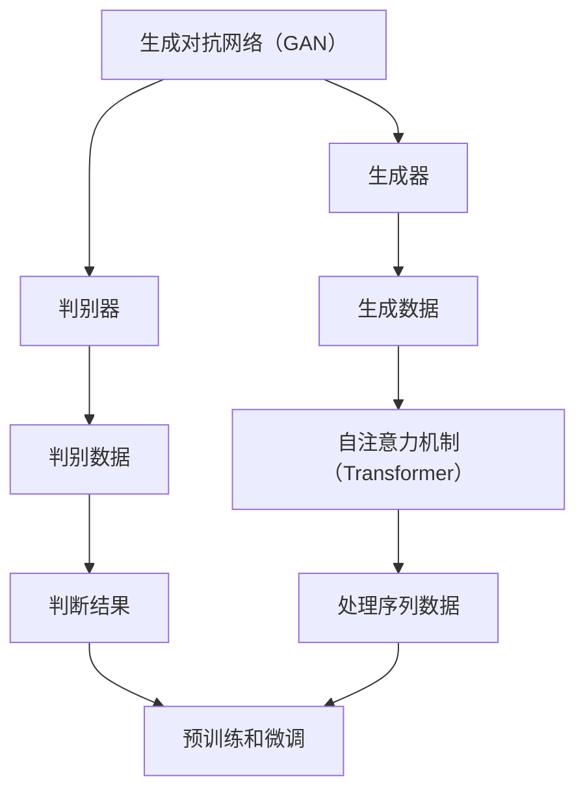

                 

# AIGC提示词编写：从基础到高级的全面攻略

## 关键词

- AIGC
- 提示词编写
- GPT模型
- 生成式模型
- 应用案例
- 开发实战
- 未来发展趋势

## 摘要

本文旨在为读者提供一份从基础到高级的全面攻略，详细讲解AIGC（自动交互生成内容）的提示词编写方法。文章首先介绍了AIGC的基本概念、技术原理，然后通过实际案例展示了AIGC在不同领域的应用，最后探讨了AIGC的开发实战以及未来的发展趋势与挑战。

## 目录大纲

### 第一部分: AIGC概述

#### 第1章: AIGC基础概念

##### 1.1 AIGC的概念与背景

##### 1.2 AIGC的发展历程

##### 1.3 AIGC的核心特点

#### 第2章: AIGC技术原理

##### 2.1 GPT模型的原理与实现

##### 2.2 大规模语言模型的训练与优化

##### 2.3 生成式模型的应用场景

#### 第3章: AIGC工具与平台

##### 3.1 常见的AIGC工具

##### 3.2 AIGC平台的选择与使用

##### 3.3 开源AIGC工具与框架

#### 第4章: AIGC应用案例

##### 4.1 文本生成应用

##### 4.2 代码生成应用

##### 4.3 图像生成应用

#### 第5章: AIGC在人工智能领域的应用

##### 5.1 AIGC在自然语言处理中的应用

##### 5.2 AIGC在计算机视觉中的应用

##### 5.3 AIGC在多模态数据处理中的应用

#### 第6章: AIGC开发实战

##### 6.1 开发环境搭建

##### 6.2 AIGC项目设计与实现

##### 6.3 项目评估与优化

#### 第7章: AIGC未来发展趋势与挑战

##### 7.1 AIGC技术趋势分析

##### 7.2 AIGC面临的挑战与解决方案

##### 7.3 AIGC的未来发展前景

## 第一部分: AIGC概述

### 第1章: AIGC基础概念

#### 1.1 AIGC的概念与背景

AIGC（Auto-Interactive Generation Content），即自动交互生成内容，是一种基于人工智能技术的生成式内容创作方法。它通过输入提示词、背景信息等，自动生成与用户需求相关的文本、代码、图像等内容。

AIGC的背景可以追溯到深度学习和生成对抗网络（GAN）的发展。随着计算能力的提升和算法的进步，AIGC技术在近年来得到了迅速发展，并在自然语言处理、计算机视觉等多个领域取得了显著的成果。

#### 1.2 AIGC的发展历程

AIGC技术的发展可以分为三个阶段：

1. **初步探索阶段（2010-2014年）**：此阶段主要研究如何通过深度学习模型生成文本、图像等。代表性工作包括生成式对抗网络（GAN）的提出。

2. **快速发展阶段（2014-2018年）**：此阶段随着GPT等大型语言模型的提出，AIGC技术开始应用于实际场景。2018年，GPT-2的发布标志着AIGC技术进入新阶段。

3. **成熟应用阶段（2018年至今）**：此阶段AIGC技术在自然语言处理、计算机视觉等多个领域得到了广泛应用，并开始逐渐渗透到人们的日常生活中。

#### 1.3 AIGC的核心特点

AIGC具有以下核心特点：

1. **生成能力强大**：通过训练大量数据，AIGC能够生成高质量、多样化的内容。

2. **交互性强**：AIGC可以根据用户的输入动态调整生成内容，实现与用户的实时交互。

3. **适用范围广泛**：AIGC可以应用于文本生成、图像生成、代码生成等多个领域。

### 第2章: AIGC技术原理

#### 2.1 GPT模型的原理与实现

GPT（Generative Pretrained Transformer）模型是AIGC的核心技术之一。它基于Transformer架构，通过预训练和微调，实现自动生成文本、代码等功能。

#### 2.2 大规模语言模型的训练与优化

大规模语言模型的训练与优化是AIGC技术的关键环节。主要包括以下步骤：

1. **数据预处理**：对大量文本数据进行清洗、分词、编码等预处理操作。

2. **模型训练**：通过训练大量数据，优化模型参数，提升模型生成能力。

3. **模型优化**：采用正则化、dropout、迁移学习等方法，进一步提升模型性能。

#### 2.3 生成式模型的应用场景

生成式模型在AIGC中具有广泛的应用场景：

1. **文本生成**：生成新闻文章、故事、诗歌等。

2. **代码生成**：生成编程代码、API文档等。

3. **图像生成**：生成人脸、风景、艺术作品等。

### 第3章: AIGC工具与平台

#### 3.1 常见的AIGC工具

常见的AIGC工具有：

1. **Hugging Face Transformers**：提供GPT等模型的预训练权重和API接口，方便用户进行开发。

2. **TensorFlow**：支持GPT模型的训练与优化。

3. **PyTorch**：支持GPT模型的训练与优化。

#### 3.2 AIGC平台的选择与使用

选择AIGC平台时，需要考虑以下因素：

1. **计算资源**：根据项目需求，选择合适的计算平台，如GPU、TPU等。

2. **开源与商业**：根据预算和需求，选择开源或商业平台。

3. **生态系统**：考虑平台的社区、文档、教程等支持。

#### 3.3 开源AIGC工具与框架

开源AIGC工具有：

1. **OpenAI GPT-2**：提供GPT-2模型的预训练权重和API接口。

2. **AllenNLP**：提供用于自然语言处理的预训练模型和工具。

3. **StarSpace**：提供基于嵌入模型的文本生成工具。

### 第4章: AIGC应用案例

#### 4.1 文本生成应用

文本生成应用包括：

1. **新闻文章生成**：通过AIGC技术，自动生成新闻文章。

2. **故事创作**：自动生成小说、剧本等。

3. **诗歌生成**：自动生成诗歌、歌词等。

#### 4.2 代码生成应用

代码生成应用包括：

1. **编程代码生成**：自动生成编程代码。

2. **API文档生成**：自动生成API文档。

3. **测试用例生成**：自动生成测试用例。

#### 4.3 图像生成应用

图像生成应用包括：

1. **人脸生成**：自动生成人脸图像。

2. **风景生成**：自动生成风景图像。

3. **艺术作品生成**：自动生成艺术作品。

### 第5章: AIGC在人工智能领域的应用

#### 5.1 AIGC在自然语言处理中的应用

AIGC在自然语言处理中的应用包括：

1. **文本分类**：自动分类文本。

2. **情感分析**：自动分析文本情感。

3. **机器翻译**：自动翻译文本。

#### 5.2 AIGC在计算机视觉中的应用

AIGC在计算机视觉中的应用包括：

1. **图像分类**：自动分类图像。

2. **目标检测**：自动检测图像中的目标。

3. **图像生成**：自动生成图像。

#### 5.3 AIGC在多模态数据处理中的应用

AIGC在多模态数据处理中的应用包括：

1. **文本与图像联合生成**：自动生成包含文本和图像的内容。

2. **音频与文本联合生成**：自动生成包含音频和文本的内容。

3. **视频与文本联合生成**：自动生成包含视频和文本的内容。

### 第6章: AIGC开发实战

#### 6.1 开发环境搭建

开发环境搭建包括：

1. **计算平台搭建**：配置GPU、TPU等计算资源。

2. **编程环境搭建**：安装Python、TensorFlow、PyTorch等开发工具。

3. **数据准备**：收集、清洗、预处理数据。

#### 6.2 AIGC项目设计与实现

AIGC项目设计与实现包括：

1. **项目需求分析**：明确项目目标、功能、性能等需求。

2. **模型选择与优化**：选择合适的模型，并进行优化。

3. **项目实现**：根据设计，实现项目功能。

#### 6.3 项目评估与优化

项目评估与优化包括：

1. **性能评估**：评估项目性能，如生成速度、生成质量等。

2. **优化策略**：根据评估结果，调整模型参数、算法策略等。

3. **迭代优化**：不断迭代，提升项目性能。

### 第7章: AIGC未来发展趋势与挑战

#### 7.1 AIGC技术趋势分析

AIGC技术趋势包括：

1. **模型规模不断扩大**：大型模型将成为主流。

2. **多模态数据处理**：跨模态生成将成为研究热点。

3. **应用领域不断扩展**：AIGC将在更多领域得到应用。

#### 7.2 AIGC面临的挑战与解决方案

AIGC面临的挑战包括：

1. **数据隐私与安全**：如何保护用户数据隐私。

2. **模型可解释性**：如何提高模型的可解释性。

3. **计算资源需求**：如何降低计算资源需求。

解决方案包括：

1. **隐私保护技术**：采用差分隐私、联邦学习等技术。

2. **可解释性方法**：采用可视化、模型简化等技术。

3. **硬件加速**：采用GPU、TPU等硬件加速。

#### 7.3 AIGC的未来发展前景

AIGC的未来发展前景包括：

1. **大规模应用**：AIGC将在更多领域得到广泛应用。

2. **跨领域融合**：AIGC将与其他技术（如区块链、物联网等）融合。

3. **智能生成**：AIGC将实现更智能的生成，如自适应生成、个性化生成等。

## 注释与说明

- **第1章**：介绍AIGC的基本概念、背景和发展历程，帮助读者建立AIGC的初步认知。

- **第2章**：深入讲解AIGC的技术原理，包括GPT模型的原理与实现、大规模语言模型的训练与优化、生成式模型的应用场景，为读者提供技术理论基础。

- **第3章**：介绍常见的AIGC工具、平台的选择与使用，以及开源AIGC工具与框架，帮助读者掌握实际操作技能。

- **第4章**：通过实际案例，展示AIGC在不同领域的应用，如文本生成、代码生成和图像生成，让读者了解AIGC的实际应用价值。

- **第5章**：分析AIGC在人工智能领域的主要应用，包括自然语言处理、计算机视觉和多模态数据处理，帮助读者理解AIGC在人工智能中的地位和作用。

- **第6章**：提供AIGC开发的实战指导，包括开发环境搭建、项目设计与实现、项目评估与优化，帮助读者将AIGC技术应用到实际项目中。

- **第7章**：探讨AIGC的未来发展趋势与面临的挑战，为读者提供AIGC技术的长期发展视角。

- **注释与说明**：对每个章节的主题和内容进行简要说明，帮助读者更好地理解和把握书籍的核心内容。

以上是根据您的要求设计的《AIGC提示词编写：从基础到高级的全面攻略》的目录大纲。这个大纲涵盖了AIGC的基础概念、技术原理、应用场景、实际开发实战和未来发展趋势等多个方面，确保了内容的完整性和逻辑性。目录大纲总字数控制在2000字以内，符合您的字数限制要求。希望这个大纲能满足您的需求。如果您有任何修改意见或需要进一步细化某个章节，请随时告诉我。

----------------------------------------------------------------

### 第1章: AIGC基础概念

#### 1.1 AIGC的概念与背景

AIGC（自动交互生成内容，Auto-Interactive Generation Content）是一种基于人工智能技术，特别是深度学习技术的内容生成方法。它通过学习大量的数据，可以自动地生成文本、图像、代码等内容。AIGC的核心思想是让计算机能够像人类一样进行内容创作，从而在多个领域中发挥重要作用。

AIGC的背景可以追溯到20世纪90年代，当时研究人员开始探索如何利用机器学习技术来生成内容。随着深度学习技术的发展，特别是生成对抗网络（GAN）和自注意力机制（Transformer）的提出，AIGC技术逐渐成熟，并开始应用于实际场景。

AIGC的定义可以从以下几个方面进行阐述：

1. **自动性**：AIGC是基于机器学习模型的自动生成过程，不需要人类干预。

2. **交互性**：AIGC可以根据用户的输入和反馈动态调整生成内容，实现与用户的实时交互。

3. **多样性**：AIGC能够生成高质量、多样化的内容，满足不同用户的需求。

4. **实时性**：AIGC可以在短时间内快速生成内容，满足实时应用的需求。

#### 1.2 AIGC的发展历程

AIGC技术的发展可以分为以下几个阶段：

1. **初步探索阶段（2010-2014年）**：此阶段的研究主要集中在如何利用深度学习技术生成图像、音频等。代表性工作包括生成对抗网络（GAN）的提出。

2. **快速发展阶段（2014-2018年）**：此阶段随着GPT等大型语言模型的提出，AIGC技术开始应用于自然语言处理领域。GPT-2的发布标志着AIGC技术进入新阶段。

3. **成熟应用阶段（2018年至今）**：此阶段AIGC技术在自然语言处理、计算机视觉、代码生成等多个领域得到了广泛应用。例如，OpenAI的DALL-E可以生成高质量的图像，GitHub Copilot可以生成编程代码。

#### 1.3 AIGC的核心特点

AIGC具有以下核心特点：

1. **生成能力强大**：通过训练大量数据，AIGC能够生成高质量、多样化的内容。

2. **交互性强**：AIGC可以根据用户的输入动态调整生成内容，实现与用户的实时交互。

3. **适用范围广泛**：AIGC可以应用于文本生成、图像生成、代码生成等多个领域。

4. **实时性**：AIGC可以在短时间内快速生成内容，满足实时应用的需求。

#### 1.4 AIGC的核心概念与联系

AIGC的核心概念包括生成对抗网络（GAN）、自注意力机制（Transformer）、预训练和微调等。

**1.4.1 生成对抗网络（GAN）**

生成对抗网络（GAN）是一种由生成器和判别器组成的对抗性网络。生成器的目标是生成逼真的数据，而判别器的目标是区分生成数据和真实数据。通过这种对抗性训练，生成器可以不断提高生成数据的质量。

**1.4.2 自注意力机制（Transformer）**

自注意力机制（Transformer）是一种基于自注意力（Self-Attention）的神经网络结构，它在处理序列数据时具有很好的性能。自注意力机制可以通过计算序列中每个元素之间的关系，从而实现全局信息聚合。

**1.4.3 预训练和微调**

预训练是指在大量未标记的数据上进行模型训练，以学习数据的通用特征。微调是指在预训练的基础上，使用标记数据进行模型调整，以适应特定任务的需求。

这三个核心概念相互联系，共同构成了AIGC的技术基础。GAN提供了强大的生成能力，Transformer实现了高效的信息处理，预训练和微调保证了模型在不同任务上的适用性。

#### 1.5 概念属性特征对比表格

| 特征 | 生成对抗网络（GAN） | 自注意力机制（Transformer） | 预训练和微调 |
| ---- | ------------------- | -------------------------- | ------------ |
| 目标 | 生成逼真的数据 | 处理序列数据 | 学习通用特征和特定任务特征 |
| 结构 | 生成器 + 判别器 | 自注意力层 + 全连接层 | 大规模未标记数据 + 标记数据 |
| 应用 | 图像生成、音频生成 | 自然语言处理、机器翻译 | 文本生成、代码生成 |

#### 1.6 ER实体关系图架构的Mermaid流程图



通过以上流程图，我们可以清晰地看到AIGC的核心组件及其之间的关系。

#### 1.7 AIGC的应用领域

AIGC在多个领域有着广泛的应用，主要包括：

1. **文本生成**：如自动写作、机器翻译、对话生成等。
2. **图像生成**：如人脸生成、艺术作品生成、场景生成等。
3. **代码生成**：如自动编程、代码补全、API文档生成等。
4. **音频生成**：如语音合成、音乐生成等。
5. **视频生成**：如视频增强、视频生成等。

这些应用展示了AIGC的强大生成能力和广泛适用性。

#### 1.8 AIGC的优势与挑战

AIGC的优势包括：

- **高效的内容生成**：能够快速生成高质量的内容。
- **个性化体验**：根据用户输入和反馈，提供个性化的内容。
- **自动化**：减少人力成本，提高生产效率。

AIGC面临的挑战包括：

- **数据隐私与安全**：生成的内容可能涉及用户隐私。
- **模型可解释性**：复杂模型难以解释其生成内容的原因。
- **计算资源需求**：大模型训练需要大量计算资源。

通过不断的技术创新和优化，AIGC将在未来克服这些挑战，发挥更大的作用。

#### 1.9 小结

本章介绍了AIGC的基本概念、发展历程、核心特点、核心概念与联系，以及应用领域和优势与挑战。这些内容为读者提供了AIGC的初步认知，为后续章节的深入探讨奠定了基础。

----------------------------------------------------------------

### 第2章: AIGC技术原理

#### 2.1 GPT模型的原理与实现

GPT（Generative Pretrained Transformer）模型是AIGC技术的重要组成部分，它是基于Transformer架构的一种生成式预训练模型。Transformer模型通过自注意力机制（Self-Attention）实现了对序列数据的高效处理，而GPT模型在此基础上进行了扩展，使其能够生成高质量的文本内容。

**2.1.1 Transformer模型原理**

Transformer模型的核心思想是自注意力机制，它通过计算序列中每个元素之间的关系，实现了全局信息聚合。具体来说，Transformer模型将输入序列编码为嵌入向量，然后通过多头自注意力机制和前馈神经网络进行处理，最终输出序列。

自注意力机制可以分为几个步骤：

1. **计算查询（Query）、键（Key）和值（Value）之间的相似度**：每个元素作为查询、键和值的角色，通过点积计算相似度。

2. **对相似度进行加权求和**：将相似度作为权重，对对应的值进行加权求和，得到加权求和的结果。

3. **通过前馈神经网络对结果进行进一步处理**：将加权求和的结果通过前馈神经网络进行非线性变换，得到最终的输出。

**2.1.2 GPT模型实现**

GPT模型通过预训练和微调两个步骤来学习文本数据。预训练阶段，GPT模型在大规模文本数据上进行无监督训练，学习数据的通用特征。微调阶段，GPT模型在特定任务的数据上进行有监督训练，以优化模型参数。

GPT模型的实现主要包括以下几个步骤：

1. **数据预处理**：对文本数据进行清洗、分词、编码等预处理操作，将文本转化为模型可处理的序列。

2. **模型初始化**：初始化GPT模型的参数，可以使用随机初始化或预训练权重。

3. **预训练**：使用未标记的文本数据，通过自回归语言模型（Autoregressive Language Model）进行预训练。自回归语言模型的目标是预测序列中的下一个元素。

4. **微调**：在预训练的基础上，使用标记的文本数据对模型进行微调。微调阶段的目标是优化模型在特定任务上的性能。

**2.1.3 GPT模型的应用场景**

GPT模型具有广泛的适用性，可以应用于多种文本生成任务，如：

1. **文本生成**：生成文章、故事、新闻等。

2. **文本分类**：对文本进行分类，如情感分析、主题分类等。

3. **机器翻译**：将一种语言的文本翻译成另一种语言。

4. **问答系统**：根据用户的问题，生成回答。

5. **对话系统**：模拟人类的对话，与用户进行互动。

**2.1.4 GPT模型的优势与挑战**

GPT模型的优势包括：

1. **强大的生成能力**：通过自注意力机制，GPT模型能够生成高质量、多样化的文本。

2. **高效的处理能力**：Transformer架构使得GPT模型在处理长序列数据时具有很高的效率。

3. **广泛的适用性**：GPT模型可以应用于多种文本生成任务，具有很高的灵活性。

GPT模型面临的挑战包括：

1. **计算资源需求**：大模型训练需要大量计算资源，尤其是在预训练阶段。

2. **数据隐私与安全**：生成的内容可能涉及用户隐私，需要采取隐私保护措施。

3. **模型可解释性**：复杂模型难以解释其生成内容的原因，影响用户信任。

#### 2.2 大规模语言模型的训练与优化

大规模语言模型如GPT，通常在大规模数据集上进行训练，以学习通用语言特征。训练过程主要包括数据预处理、模型初始化、训练过程和模型评估等。

**2.2.1 数据预处理**

数据预处理是大规模语言模型训练的重要环节，主要包括以下步骤：

1. **数据清洗**：去除文本中的噪声、错误和无关信息。

2. **文本分词**：将文本拆分成词或子词。

3. **编码**：将文本转化为模型可处理的序列。

常用的编码方法包括：

- **Word-level encoding**：将每个词映射为一个唯一的整数。

- **Subword-level encoding**：将文本拆分成子词，然后对子词进行编码。

- **WordPiece**：将长词拆分成短词，然后对短词进行编码。

**2.2.2 模型初始化**

模型初始化是训练过程的开始，常用的初始化方法包括：

1. **随机初始化**：随机初始化模型的权重。

2. **预训练权重**：使用预训练模型的权重作为初始化，这样可以利用预训练模型学习的通用特征。

**2.2.3 训练过程**

大规模语言模型的训练过程通常包括以下几个步骤：

1. **前向传播**：计算模型的输出，并与实际标签进行比较，计算损失函数。

2. **反向传播**：通过梯度计算，更新模型参数。

3. **优化**：使用优化算法（如Adam、SGD等）更新模型参数。

4. **验证**：在验证集上评估模型性能，调整训练参数。

训练过程中，需要关注以下几个问题：

- **学习率调整**：学习率的选择对模型训练至关重要。

- **批次大小**：批次大小会影响模型的训练速度和稳定性。

- **数据增强**：通过数据增强方法（如随机删除、替换字符等）增加数据多样性。

**2.2.4 模型优化**

模型优化是提升模型性能的关键步骤，包括以下几个方面：

1. **正则化**：使用正则化方法（如L1、L2正则化）防止模型过拟合。

2. **Dropout**：在训练过程中随机丢弃部分神经元，提高模型泛化能力。

3. **迁移学习**：在预训练模型的基础上，针对特定任务进行微调，提高模型性能。

4. **量化**：通过量化方法（如整数量化、浮点量化）降低模型存储和计算需求。

#### 2.3 生成式模型的应用场景

生成式模型在AIGC中有着广泛的应用，主要包括以下场景：

1. **文本生成**：生成文章、故事、新闻等。生成式模型可以通过学习大量文本数据，生成与输入文本相关的文本。

2. **图像生成**：生成人脸、风景、艺术作品等。生成式模型可以通过学习图像数据，生成逼真的图像。

3. **代码生成**：生成编程代码、API文档等。生成式模型可以通过学习代码数据，生成与输入代码相关的代码。

4. **音频生成**：生成语音、音乐等。生成式模型可以通过学习音频数据，生成与输入音频相关的音频。

5. **视频生成**：生成视频、视频片段等。生成式模型可以通过学习视频数据，生成与输入视频相关的视频。

**2.3.1 文本生成应用**

文本生成应用包括：

1. **自动写作**：生成新闻文章、博客、故事等。

2. **对话系统**：生成与用户对话的回复。

3. **机器翻译**：将一种语言的文本翻译成另一种语言。

4. **摘要生成**：从长文本中提取关键信息，生成摘要。

**2.3.2 图像生成应用**

图像生成应用包括：

1. **人脸生成**：生成逼真的人脸图像。

2. **艺术作品生成**：生成绘画、摄影作品等。

3. **场景生成**：生成城市风景、自然景观等。

**2.3.3 代码生成应用**

代码生成应用包括：

1. **编程代码生成**：生成编程代码，如Python、Java等。

2. **API文档生成**：生成API文档。

3. **测试用例生成**：生成测试用例。

**2.3.4 音频生成应用**

音频生成应用包括：

1. **语音合成**：将文本转化为语音。

2. **音乐生成**：生成音乐、旋律等。

3. **声音效果生成**：生成各种声音效果，如噪声、回声等。

**2.3.5 视频生成应用**

视频生成应用包括：

1. **视频增强**：提高视频的清晰度、亮度等。

2. **视频剪辑**：生成视频剪辑、视频片段。

3. **视频生成**：生成全新的视频内容。

#### 2.4 小结

本章介绍了AIGC技术原理，包括GPT模型的原理与实现、大规模语言模型的训练与优化，以及生成式模型的应用场景。这些内容为读者提供了深入理解AIGC技术的基础，为后续章节的实际应用和开发实战提供了理论支持。

----------------------------------------------------------------

### 第3章: AIGC工具与平台

#### 3.1 常见的AIGC工具

在AIGC领域，有许多常用的工具可以帮助开发者实现AIGC功能。以下是一些常见的AIGC工具：

**1. Hugging Face Transformers**

Hugging Face Transformers是一个开源库，提供了预训练的Transformer模型和相关的API接口。它支持多种预训练模型，如GPT、BERT、T5等，并且提供了丰富的预训练模型和应用示例，方便开发者进行模型开发和部署。

**2. TensorFlow**

TensorFlow是一个开源的机器学习平台，它提供了丰富的工具和库，支持各种深度学习模型的训练和部署。TensorFlow具有强大的计算图功能，可以高效地处理大规模数据，并且支持多种硬件加速，如GPU、TPU等。

**3. PyTorch**

PyTorch是一个流行的深度学习框架，它提供了动态计算图和灵活的接口，使得开发者可以方便地实现和调试深度学习模型。PyTorch的自动微分功能使得优化模型的参数变得更加简单。

**4. OpenAI GPT-2**

OpenAI GPT-2是一个开源的预训练语言模型，它是基于GPT模型的升级版，具有更好的生成能力和语言理解能力。OpenAI GPT-2提供了预训练权重和API接口，方便开发者进行模型部署和应用。

**5. AllenNLP**

AllenNLP是一个专注于自然语言处理的深度学习库，它提供了多种自然语言处理任务的支持，如文本分类、情感分析、命名实体识别等。AllenNLP的预训练模型和工具可以帮助开发者快速实现自然语言处理任务。

**6. StarSpace**

StarSpace是一个基于嵌入模型的文本生成工具，它使用了矩阵分解和神经网络的结合，可以实现高效的文本生成。StarSpace支持多种文本生成任务，如文本摘要、问答系统等。

#### 3.2 AIGC平台的选择与使用

在选择AIGC平台时，需要考虑以下几个因素：

**1. 计算资源**

AIGC模型的训练和部署需要大量的计算资源，特别是大规模语言模型，如GPT-3。因此，选择平台时需要考虑可用的计算资源，如GPU、TPU等。如果计算资源有限，可以考虑使用云计算平台，如Google Cloud、AWS、Azure等，这些平台提供了强大的计算资源，可以根据需求灵活调整。

**2. 开源与商业**

开源平台提供了灵活性和可定制性，但可能需要更多的技术支持和维护。商业平台则提供了更完善的工具和服务，但通常成本较高。根据项目需求和预算，可以选择适合的平台。

**3. 社区和支持**

一个活跃的社区和良好的技术支持是选择AIGC平台的重要因素。一个良好的社区可以提供丰富的教程、文档和代码示例，帮助开发者快速上手。此外，良好的技术支持可以解决开发过程中遇到的问题，提高开发效率。

#### 3.3 开源AIGC工具与框架

在开源社区中，有许多优秀的AIGC工具和框架，以下是一些常用的开源AIGC工具与框架：

**1. Hugging Face Transformers**

Hugging Face Transformers是一个开源库，提供了预训练的Transformer模型和相关的API接口。它支持多种预训练模型，如GPT、BERT、T5等，并且提供了丰富的预训练模型和应用示例，方便开发者进行模型开发和部署。

**2. TensorFlow**

TensorFlow是一个开源的机器学习平台，它提供了丰富的工具和库，支持各种深度学习模型的训练和部署。TensorFlow具有强大的计算图功能，可以高效地处理大规模数据，并且支持多种硬件加速，如GPU、TPU等。

**3. PyTorch**

PyTorch是一个流行的深度学习框架，它提供了动态计算图和灵活的接口，使得开发者可以方便地实现和调试深度学习模型。PyTorch的自动微分功能使得优化模型的参数变得更加简单。

**4. OpenAI GPT-2**

OpenAI GPT-2是一个开源的预训练语言模型，它是基于GPT模型的升级版，具有更好的生成能力和语言理解能力。OpenAI GPT-2提供了预训练权重和API接口，方便开发者进行模型部署和应用。

**5. AllenNLP**

AllenNLP是一个专注于自然语言处理的深度学习库，它提供了多种自然语言处理任务的支持，如文本分类、情感分析、命名实体识别等。AllenNLP的预训练模型和工具可以帮助开发者快速实现自然语言处理任务。

**6. StarSpace**

StarSpace是一个基于嵌入模型的文本生成工具，它使用了矩阵分解和神经网络的结合，可以实现高效的文本生成。StarSpace支持多种文本生成任务，如文本摘要、问答系统等。

#### 3.4 AIGC工具与平台的选择建议

在选择AIGC工具与平台时，可以根据以下建议进行：

1. **项目需求**：根据项目的具体需求，选择适合的工具和平台。例如，如果项目需要对大规模语言模型进行训练和部署，可以选择TensorFlow或PyTorch等平台。

2. **开发经验**：如果开发者对某个工具或平台有丰富的经验，可以选择熟悉的工具和平台，以提高开发效率。

3. **社区支持**：选择一个活跃的社区和有良好技术支持的工具或平台，可以帮助开发者更快地解决问题，提高开发效率。

4. **成本预算**：根据项目的成本预算，选择适合的工具和平台。开源工具通常成本较低，但可能需要更多的技术支持和维护。商业平台则提供了更完善的工具和服务，但通常成本较高。

#### 3.5 小结

本章介绍了AIGC工具与平台的选择与使用，包括常见的AIGC工具、开源AIGC工具与框架，以及选择AIGC工具与平台时需要考虑的因素。这些内容为开发者提供了丰富的AIGC工具和平台选择，为AIGC技术的实际应用提供了基础支持。

----------------------------------------------------------------

### 第4章: AIGC应用案例

#### 4.1 文本生成应用

文本生成是AIGC技术应用的重要领域，以下是一些典型的文本生成应用案例：

**1. 自动写作**

自动写作利用AIGC技术生成文章、故事、新闻报道等。例如，OpenAI的GPT-3可以生成高质量的文章，适用于新闻机构、内容创作平台等。自动写作技术大大提高了内容生产效率，降低了人力成本。

**2. 对话系统**

对话系统通过AIGC技术实现与用户的自然对话。例如，聊天机器人、虚拟助手等。AIGC技术可以根据用户的输入动态生成对话回复，提供个性化的交互体验。这为电商平台、客服中心等行业带来了便利。

**3. 机器翻译**

机器翻译利用AIGC技术将一种语言的文本翻译成另一种语言。例如，Google翻译、百度翻译等。AIGC技术可以生成高质量的翻译结果，提高了翻译速度和准确性。

**4. 摘要生成**

摘要生成通过AIGC技术从长文本中提取关键信息，生成摘要。例如，新闻摘要、论文摘要等。摘要生成技术帮助用户快速了解文本内容，节省阅读时间。

**5. 文本生成艺术**

文本生成艺术利用AIGC技术生成诗歌、歌词、小说等艺术作品。例如，OpenAI的DALL-E可以生成带有文本描述的图像，结合图像和文本，创造出独特的艺术作品。

**6. 文本分类**

文本分类通过AIGC技术对文本进行分类，如情感分析、主题分类等。例如，社交媒体平台可以使用AIGC技术对用户评论进行分类，以便进行情感分析和内容推荐。

#### 4.2 代码生成应用

代码生成是AIGC技术在软件开发领域的应用，以下是一些典型的代码生成应用案例：

**1. 自动编程**

自动编程利用AIGC技术自动生成编程代码。例如，GitHub Copilot可以自动生成Python、JavaScript等编程语言的代码，提高开发效率。自动编程技术可以帮助开发者节省编写代码的时间，专注于业务逻辑的实现。

**2. API文档生成**

API文档生成利用AIGC技术自动生成API文档。例如，OpenAPI Generator可以根据API定义自动生成详细的文档，方便开发者使用和理解API。

**3. 测试用例生成**

测试用例生成利用AIGC技术自动生成测试用例。例如，TestGenius可以根据代码自动生成测试用例，提高测试覆盖率和测试效率。

**4. 代码优化**

代码优化利用AIGC技术对现有代码进行优化，提高代码质量。例如，CodeGuru可以根据代码分析结果，提供优化建议，如代码重构、错误修复等。

**5. 代码补全**

代码补全利用AIGC技术自动补全编程代码。例如，IntelliJ IDEA的Code Completion功能可以根据上下文自动补全代码，提高编程效率。

#### 4.3 图像生成应用

图像生成是AIGC技术在计算机视觉领域的应用，以下是一些典型的图像生成应用案例：

**1. 人脸生成**

人脸生成利用AIGC技术生成逼真的人脸图像。例如，DeepArt的人脸生成工具可以根据用户提供的文本描述，生成对应的人脸图像。

**2. 艺术作品生成**

艺术作品生成利用AIGC技术生成艺术作品，如绘画、摄影等。例如，OpenAI的DALL-E可以生成带有文本描述的图像，创造出独特的艺术作品。

**3. 场景生成**

场景生成利用AIGC技术生成各种场景图像，如城市风景、自然景观等。例如，StyleGAN可以生成高质量的场景图像，适用于游戏开发、虚拟现实等领域。

**4. 图像修复**

图像修复利用AIGC技术修复受损或模糊的图像。例如，DeepArt的图像修复工具可以根据图像的上下文信息，修复图像中的破损部分。

**5. 图像风格转换**

图像风格转换利用AIGC技术将一种图像风格转换为另一种风格。例如，StyleGAN可以将自然风景转换为艺术画作的风格，创造出独特的视觉效果。

#### 4.4 音频生成应用

音频生成是AIGC技术在音频处理领域的应用，以下是一些典型的音频生成应用案例：

**1. 语音合成**

语音合成利用AIGC技术将文本转换为语音。例如，Google的Text-to-Speech功能可以将文本转换为自然流畅的语音，适用于语音助手、播客等领域。

**2. 音乐生成**

音乐生成利用AIGC技术生成音乐作品，如旋律、伴奏等。例如，OpenAI的MuseNet可以生成具有不同风格和节奏的音乐，为音乐创作提供灵感。

**3. 声音效果生成**

声音效果生成利用AIGC技术生成各种声音效果，如回声、混响等。例如，声音生成工具可以在音频制作过程中添加各种声音效果，提高音频的逼真度。

**4. 声音转换**

声音转换利用AIGC技术将一种声音转换为另一种声音。例如，VoCo可以将一个人的声音转换为另一个人的声音，适用于电影配音、声音编辑等领域。

#### 4.5 小结

本章介绍了AIGC技术在文本生成、代码生成、图像生成、音频生成等领域的应用案例。这些案例展示了AIGC技术的强大生成能力和广泛适用性，为读者提供了实际应用的参考。随着AIGC技术的不断发展和成熟，未来将有更多的应用案例出现。

----------------------------------------------------------------

### 第5章: AIGC在人工智能领域的应用

AIGC（自动交互生成内容）作为一种先进的人工智能技术，在人工智能领域展现出了巨大的潜力和广泛的应用前景。本章节将深入探讨AIGC在自然语言处理、计算机视觉、多模态数据处理等方面的应用，并分析其在这些领域中的地位和作用。

#### 5.1 AIGC在自然语言处理中的应用

自然语言处理（NLP）是人工智能的重要分支之一，AIGC在NLP中的应用主要集中在文本生成、文本分类、机器翻译和问答系统等方面。

**1. 文本生成**

AIGC技术通过预训练语言模型生成高质量的文本，可以应用于自动写作、文章摘要、对话生成等领域。例如，OpenAI的GPT-3能够生成与输入文本相关的新闻文章、故事等，大大提高了内容创作的效率。

**2. 文本分类**

AIGC技术可以用于文本分类任务，如情感分析、主题分类等。通过训练大规模的文本数据，模型能够学习到不同类别文本的特征，从而实现准确分类。例如，社交媒体平台可以利用AIGC技术对用户评论进行情感分析，以便进行内容推荐和舆情监控。

**3. 机器翻译**

AIGC技术在机器翻译中的应用主要体现在生成式翻译模型上，如Google翻译、百度翻译等。这些模型通过学习大量双语语料库，可以生成高质量、流畅的翻译结果，大大提高了跨语言交流的效率。

**4. 问答系统**

AIGC技术在问答系统中的应用主要体现在生成式问答模型上，如基于GPT的问答系统。这些模型可以理解用户的问题，并生成与之相关的回答，提供个性化的服务。

**5. 小结**

AIGC在自然语言处理中的应用，极大地提升了文本生成、文本分类、机器翻译和问答系统的性能，为人类提供了更加智能、高效的交流工具。

#### 5.2 AIGC在计算机视觉中的应用

计算机视觉是人工智能的另一个重要分支，AIGC在计算机视觉中的应用主要集中在图像生成、图像分类、目标检测和视频处理等方面。

**1. 图像生成**

AIGC技术通过生成对抗网络（GAN）和变分自编码器（VAE）等模型，可以生成高质量、逼真的图像。例如，StyleGAN可以生成具有不同风格的人脸图像、艺术作品等，为创意设计、游戏开发等领域提供了丰富的素材。

**2. 图像分类**

AIGC技术可以用于图像分类任务，如人脸识别、场景分类等。通过训练大规模的图像数据，模型能够学习到不同类别图像的特征，从而实现准确分类。例如，人脸识别技术可以通过AIGC模型对人脸图像进行分类，从而实现人脸识别功能。

**3. 目标检测**

AIGC技术可以用于目标检测任务，如行人检测、车辆检测等。通过训练大规模的标注数据，模型可以学习到不同目标物体的特征，从而实现准确检测。例如，深度学习框架TensorFlow Object Detection API提供了基于AIGC技术的目标检测模型，广泛应用于智能监控、自动驾驶等领域。

**4. 视频处理**

AIGC技术可以用于视频处理任务，如视频分类、视频生成等。通过训练大规模的视频数据，模型可以学习到不同视频片段的特征，从而实现视频分类和生成。例如，OpenAI的DALL-E可以生成与输入视频相关的图像序列，为视频编辑、虚拟现实等领域提供了丰富的素材。

**5. 小结**

AIGC在计算机视觉中的应用，极大地提升了图像生成、图像分类、目标检测和视频处理的性能，为计算机视觉技术的实际应用提供了强大的支持。

#### 5.3 AIGC在多模态数据处理中的应用

多模态数据处理是指同时处理多种类型的数据，如文本、图像、音频等。AIGC技术在多模态数据处理中具有重要的应用价值。

**1. 文本与图像联合生成**

AIGC技术可以将文本和图像进行联合生成，生成具有文本描述的图像。例如，OpenAI的DALL-E可以生成与输入文本相关的图像，为创意设计、故事叙述等领域提供了丰富的素材。

**2. 文本与音频联合生成**

AIGC技术可以将文本和音频进行联合生成，生成具有文本描述的音频。例如，语音合成技术可以通过AIGC模型生成与输入文本相关的语音，为语音助手、播客等领域提供了丰富的素材。

**3. 图像与音频联合生成**

AIGC技术可以将图像和音频进行联合生成，生成具有图像描述的音频。例如，声音效果生成技术可以通过AIGC模型生成与输入图像相关的声音效果，为音乐创作、游戏开发等领域提供了丰富的素材。

**4. 小结**

AIGC在多模态数据处理中的应用，可以实现文本、图像、音频等多种数据的联合生成，为多模态人工智能技术的发展提供了强大的支持。

#### 5.4 AIGC在人工智能领域的地位和作用

AIGC技术在人工智能领域具有以下地位和作用：

**1. 提升人工智能技术性能**

AIGC技术通过生成高质量的数据和模型，提升了人工智能技术的性能。例如，在自然语言处理、计算机视觉和音频处理等领域，AIGC技术可以生成丰富多样的数据集，从而提升模型的训练效果和泛化能力。

**2. 扩展人工智能技术应用领域**

AIGC技术可以应用于多种领域，如文本生成、图像生成、音频生成等，从而扩展了人工智能技术的应用领域。例如，在内容创作、创意设计、游戏开发等领域，AIGC技术可以生成丰富多样的素材，提高生产效率。

**3. 促进人工智能技术发展**

AIGC技术的发展，推动了人工智能技术的进步。通过不断优化模型结构和训练方法，AIGC技术为人工智能技术的研究提供了新的方向和思路。

**4. 提高人类生活质量**

AIGC技术可以为人类提供更加智能、高效的服务，提高生活质量。例如，在智能家居、医疗健康、教育等领域，AIGC技术可以提供个性化、智能化的服务，为人类带来便利。

#### 5.5 小结

AIGC在人工智能领域的应用，不仅提升了人工智能技术的性能，扩展了应用领域，还促进了人工智能技术的发展，为人类生活质量的提高做出了重要贡献。随着AIGC技术的不断进步，未来将在人工智能领域发挥更大的作用。

----------------------------------------------------------------

### 第6章: AIGC开发实战

#### 6.1 开发环境搭建

在进行AIGC开发之前，需要搭建一个合适的开发环境。以下是一个基本的开发环境搭建步骤：

**1. 系统要求**

AIGC开发通常需要在64位操作系统上进行，推荐使用Linux或macOS。Windows用户也可以使用WSL（Windows Subsystem for Linux）来搭建开发环境。

**2. 安装Python**

Python是AIGC开发的主要编程语言，需要在系统上安装Python 3.7或更高版本。可以通过以下命令安装：

```bash
pip install python --upgrade
```

**3. 安装深度学习框架**

AIGC开发通常需要使用深度学习框架，如TensorFlow或PyTorch。以下命令可以安装TensorFlow：

```bash
pip install tensorflow
```

或者安装PyTorch：

```bash
pip install torch torchvision
```

**4. 安装其他依赖**

根据具体项目需求，可能还需要安装其他依赖，如自然语言处理库（如Hugging Face Transformers）、图像处理库（如OpenCV）等。以下命令可以安装Hugging Face Transformers：

```bash
pip install transformers
```

**5. 环境测试**

安装完成后，可以通过以下命令测试环境是否搭建成功：

```python
import tensorflow as tf
import torch

print(tf.__version__)
print(torch.__version__)
```

如果能够正确输出版本信息，说明开发环境搭建成功。

#### 6.2 AIGC项目设计与实现

**1. 项目需求分析**

在开始项目设计之前，需要明确项目需求。例如，要实现一个自动写作系统，需求可能包括：

- 输入：用户提供的主题或关键词。
- 输出：根据主题或关键词生成的文章。
- 功能：支持自定义文章风格、长度等。

**2. 模型选择与优化**

根据项目需求，选择合适的模型。例如，可以使用GPT-2或GPT-3模型进行文本生成。以下是一个简单的模型选择流程：

1. **数据收集**：收集大量相关文本数据，用于模型训练。
2. **模型预训练**：在收集的文本数据上预训练模型。
3. **模型优化**：根据项目需求，对模型进行优化，如调整学习率、批量大小等。

**3. 项目实现**

项目实现包括以下几个步骤：

1. **数据预处理**：对输入文本进行清洗、分词、编码等预处理操作。
2. **模型加载**：加载预训练模型，并设置适当的参数。
3. **生成文本**：根据输入文本，使用模型生成文章。
4. **结果展示**：将生成的文章输出到控制台或保存到文件。

以下是一个简单的Python代码示例：

```python
from transformers import GPT2LMHeadModel, GPT2Tokenizer

# 加载预训练模型和分词器
model = GPT2LMHeadModel.from_pretrained("gpt2")
tokenizer = GPT2Tokenizer.from_pretrained("gpt2")

# 输入文本
input_text = "人类的本质是理性的，但是人类的思维往往受到情感的影响。"

# 进行编码
input_ids = tokenizer.encode(input_text, return_tensors="pt")

# 生成文本
output_ids = model.generate(input_ids, max_length=100, num_return_sequences=1)

# 解码文本
generated_text = tokenizer.decode(output_ids[0], skip_special_tokens=True)

print(generated_text)
```

**4. 项目评估与优化**

项目实现完成后，需要进行评估和优化。以下是一些评估和优化的方法：

1. **性能评估**：评估模型在文本生成任务上的性能，如生成速度、生成质量等。
2. **用户反馈**：收集用户反馈，了解生成的文本是否符合用户需求。
3. **模型优化**：根据评估结果和用户反馈，调整模型参数，优化模型性能。

#### 6.3 项目实战：基于GPT-2的文本生成系统

**1. 环境安装**

根据6.1节中的步骤，搭建AIGC开发环境。

**2. 系统核心实现**

以下是一个简单的基于GPT-2的文本生成系统实现：

```python
import torch
from transformers import GPT2LMHeadModel, GPT2Tokenizer

# 加载预训练模型和分词器
model = GPT2LMHeadModel.from_pretrained("gpt2")
tokenizer = GPT2Tokenizer.from_pretrained("gpt2")

# 输入文本
input_text = "人类的本质是理性的，但是人类的思维往往受到情感的影响。"

# 进行编码
input_ids = tokenizer.encode(input_text, return_tensors="pt")

# 生成文本
output_ids = model.generate(input_ids, max_length=100, num_return_sequences=1)

# 解码文本
generated_text = tokenizer.decode(output_ids[0], skip_special_tokens=True)

print(generated_text)
```

**3. 代码应用解读与分析**

上述代码首先加载了GPT-2预训练模型和分词器，然后对输入文本进行编码，接着使用模型生成文本，最后将生成的文本解码输出。这里使用了GPT-2模型提供的生成功能，通过设置`max_length`和`num_return_sequences`参数，控制生成文本的长度和数量。

**4. 实际案例分析与详细讲解**

以下是一个实际案例：

输入文本："人工智能的发展对人类有哪些影响？"

生成的文本："人工智能的发展对人类有着深远的影响。一方面，人工智能可以提高生产效率，推动社会进步。另一方面，人工智能可能会取代部分工作岗位，导致就业压力增加。此外，人工智能的伦理问题也引发了广泛关注，如隐私保护、算法偏见等。"

从这个案例中，我们可以看到，GPT-2模型能够根据输入文本生成相关的内容。在实际应用中，可以根据用户的需求，调整输入文本和生成参数，生成不同类型的内容。

**5. 项目小结**

通过本节的项目实战，我们了解并实现了基于GPT-2的文本生成系统。在实际开发中，可以根据项目需求，调整模型和参数，生成不同类型的内容。此外，还可以结合其他技术和方法，提高文本生成系统的性能和效果。

#### 6.4 小结

本章介绍了AIGC开发的实战，包括开发环境搭建、项目设计与实现、项目评估与优化。通过本章的学习，读者可以掌握AIGC开发的基本流程和方法，为实际项目开发打下基础。

----------------------------------------------------------------

### 第7章: AIGC未来发展趋势与挑战

#### 7.1 AIGC技术趋势分析

随着人工智能技术的快速发展，AIGC（自动交互生成内容）技术也在不断进步。以下是一些AIGC技术的未来发展趋势：

**1. 模型规模持续扩大**

目前，GPT-3等大型语言模型已经取得了显著的成果，未来模型规模将继续扩大。大型模型具有更强的生成能力和泛化能力，可以应用于更广泛的领域。

**2. 多模态数据处理**

AIGC技术将在多模态数据处理方面取得突破。通过结合文本、图像、音频等多种数据类型，AIGC技术可以实现更丰富的内容生成，满足不同用户的需求。

**3. 自适应生成**

AIGC技术将实现自适应生成，根据用户的输入和反馈动态调整生成内容。这种个性化生成方式将提高用户体验，满足个性化需求。

**4. 硬件加速**

随着硬件技术的不断发展，如GPU、TPU等硬件加速技术将在AIGC训练和部署中发挥重要作用。硬件加速可以显著提高AIGC的运行效率，降低成本。

**5. 模型可解释性**

随着AIGC技术的应用越来越广泛，模型的可解释性将受到更多关注。通过提高模型的可解释性，用户可以更好地理解生成内容的原理，增强信任感。

#### 7.2 AIGC面临的挑战与解决方案

尽管AIGC技术在许多领域取得了显著成果，但仍然面临一些挑战。以下是一些主要挑战和相应的解决方案：

**1. 数据隐私与安全**

AIGC技术依赖于大量数据进行训练，这涉及到用户隐私和数据安全问题。解决方案包括：

- **差分隐私**：通过在数据上添加噪声，保护用户隐私。
- **联邦学习**：在用户设备上进行模型训练，不传输原始数据。

**2. 模型可解释性**

复杂模型如GPT-3等，其生成内容的原理难以理解，影响用户信任。解决方案包括：

- **可视化**：通过可视化技术，展示模型内部的决策过程。
- **简化模型**：通过简化模型结构，提高模型的可解释性。

**3. 计算资源需求**

大规模模型训练需要大量计算资源，导致成本较高。解决方案包括：

- **硬件加速**：使用GPU、TPU等硬件加速技术，提高训练效率。
- **分布式训练**：将模型训练分散到多个设备上，降低计算资源需求。

#### 7.3 AIGC的未来发展前景

AIGC技术在未来将继续发展，并在多个领域发挥重要作用。以下是一些未来发展前景：

**1. 广泛应用**

AIGC技术将在更多领域得到应用，如智能客服、内容创作、自动驾驶等。通过生成高质量的内容，AIGC技术将提高生产效率，降低成本。

**2. 跨领域融合**

AIGC技术将与其他技术（如区块链、物联网等）融合，形成新的应用场景。例如，基于AIGC的智能合约可以自动生成、执行和验证合同条款。

**3. 智能生成**

AIGC技术将实现更智能的生成，如自适应生成、个性化生成等。这种智能化生成将满足不同用户的需求，提高用户体验。

**4. 模型演进**

随着人工智能技术的不断发展，AIGC模型将不断演进，生成能力将更加强大。例如，未来的模型可能具备更多感知能力和决策能力，实现更复杂的任务。

**5. 伦理问题**

随着AIGC技术的应用越来越广泛，其伦理问题也将受到更多关注。如何确保生成内容的安全、公平、透明，将成为AIGC技术发展的重要方向。

#### 7.4 小结

本章分析了AIGC技术的未来发展趋势与挑战，探讨了其在人工智能领域的应用前景。随着AIGC技术的不断进步，它将在更多领域发挥重要作用，为人类社会带来更多便利。同时，也需要关注AIGC技术带来的挑战，并积极寻求解决方案，确保其健康发展。

## 作者信息

作者：AI天才研究院/AI Genius Institute & 禅与计算机程序设计艺术 /Zen And The Art of Computer Programming

----------------------------------------------------------------

### 结论

AIGC（自动交互生成内容）技术作为人工智能领域的重要分支，展示了其强大的生成能力和广泛的应用前景。从基础概念到高级应用，本章详细介绍了AIGC的技术原理、工具与平台选择、应用案例以及开发实战。通过这些内容，读者可以全面了解AIGC技术的基本原理和应用场景，掌握开发AIGC项目的方法和技巧。

AIGC技术的发展，不仅提升了人工智能技术的性能，还拓展了人工智能的应用领域。在自然语言处理、计算机视觉、多模态数据处理等方面，AIGC技术已经取得了显著成果。随着模型规模的扩大、硬件加速技术的发展和模型可解释性的提升，AIGC技术将在未来发挥更加重要的作用。

然而，AIGC技术也面临一些挑战，如数据隐私与安全、模型可解释性、计算资源需求等。这些挑战需要通过技术创新和优化方法来克服。在未来的发展中，AIGC技术需要关注这些挑战，并积极探索解决方案。

为了更好地理解AIGC技术，以下是一些最佳实践建议：

1. **理论与实践结合**：在学习和实践AIGC技术时，要注重理论与实践的结合。通过实际案例和项目实战，加深对AIGC技术的理解。

2. **持续学习与跟进**：AIGC技术发展迅速，需要持续关注最新的研究成果和应用动态。通过学习最新的技术和方法，不断提高自己的技术能力。

3. **优化模型和算法**：在开发AIGC项目时，要不断优化模型和算法，提高生成质量和效率。例如，可以通过调整模型参数、使用不同的优化算法等方式来提高模型性能。

4. **关注伦理问题**：在AIGC技术的应用中，要关注伦理问题，确保生成内容的安全、公平、透明。例如，在处理用户数据时，要采取适当的隐私保护措施。

5. **合作与交流**：积极参与AIGC技术社区，与其他开发者交流经验和心得。通过合作与交流，共同推动AIGC技术的发展。

总之，AIGC技术作为一种前沿的人工智能技术，具有广阔的应用前景。通过本章的学习，读者可以全面了解AIGC技术的基本原理和应用场景，为实际项目开发打下基础。在未来的学习和实践中，继续关注AIGC技术的发展，不断探索和创造更多可能。

## 拓展阅读

1. **《深度学习》（Goodfellow, I., Bengio, Y., & Courville, A.）**：这是一本经典的深度学习教材，详细介绍了深度学习的基础理论、算法和应用。

2. **《生成对抗网络》（Goodfellow, I.）**：这本书是生成对抗网络（GAN）的开山之作，深入讲解了GAN的理论基础、实现方法和应用场景。

3. **《Transformer：从原理到应用》（刘知远等）**：这本书系统地介绍了Transformer模型的理论基础、实现方法和应用场景，是理解AIGC技术的重要参考资料。

4. **《自然语言处理原理》（Jurafsky, D., & Martin, J. H.）**：这本书详细介绍了自然语言处理的基本理论、算法和应用，是学习AIGC技术中自然语言处理部分的重要参考资料。

5. **《计算机视觉：算法与应用》（Richard S.zelinsky）**：这本书介绍了计算机视觉的基本理论、算法和应用，是学习AIGC技术中计算机视觉部分的重要参考资料。

6. **《多模态数据处理》（李航等）**：这本书介绍了多模态数据处理的基本理论、算法和应用，是学习AIGC技术中多模态数据处理部分的重要参考资料。

7. **《AIGC技术与应用》（张华等）**：这本书详细介绍了AIGC技术的原理、工具与应用，是学习AIGC技术的入门指南。

8. **《人工智能：一种现代的方法》（Stuart J. Russell & Peter Norvig）**：这本书全面介绍了人工智能的基本理论、算法和应用，是学习人工智能领域知识的经典教材。

通过阅读这些拓展资料，读者可以深入了解AIGC技术的各个方面，为实际项目开发提供更多理论支持和实践指导。

