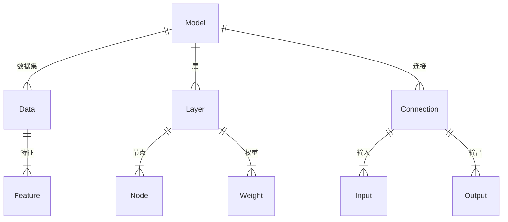
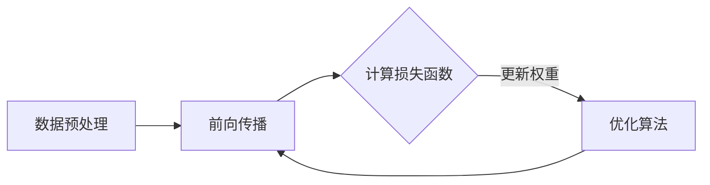
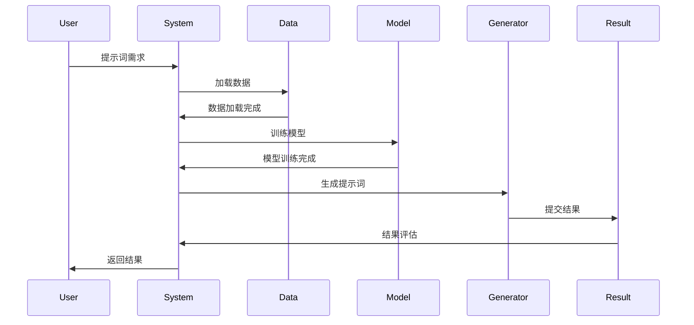

                 

### AIGC提示词编写：效率、创意与质量的协同优化

> 关键词：AIGC、提示词编写、效率、创意、质量

> 摘要：本文将深入探讨AIGC（人工智能生成内容）中的提示词编写，从效率、创意与质量的三个维度，分析其在提升AI生成内容整体性能中的作用与优化策略。通过详细讲解AIGC技术的原理、提示词的类型及功能，本文旨在为读者提供一套系统性的提示词编写优化方案。

## 第一部分：背景与核心概念

### 第1章：问题背景与核心概念

#### 1.1 问题背景

随着人工智能技术的飞速发展，AIGC（AI-Generated Content）成为近年来备受关注的新兴领域。AIGC通过深度学习算法，特别是生成对抗网络（GAN）和自然语言处理（NLP）技术，实现了文本、图像、视频等多媒体内容的自动生成。然而，AIGC技术在实际应用中，面临一个关键问题——提示词编写。

提示词，又称触发词或引导词，是AIGC系统中的输入信息，用于引导生成模型生成特定类型或风格的内容。一个高质量的提示词，不仅能显著提高生成内容的效率，还能增强其创意和质量。

#### 1.2 核心概念介绍

##### 1.2.1 AIGC的定义与作用

AIGC是指通过人工智能技术自动生成内容的过程。它涵盖了文本生成、图像生成、视频生成等多种形式，是人工智能从数据处理到内容创造的重要发展。

AIGC的作用主要体现在：

1. **内容生成**：快速生成大量的文本、图像、视频等，节省人力和时间成本。
2. **创意激发**：为设计、广告、媒体等行业提供创意支持，提升内容质量。
3. **数据分析**：通过生成模型对大量数据进行分析，发现潜在模式和趋势。

##### 1.2.2 提示词的类型与功能

提示词根据应用场景可以分为以下几类：

1. **文本提示词**：用于生成特定主题或风格的文本。
2. **图像提示词**：用于指导图像生成模型生成符合特定描述的图像。
3. **视频提示词**：用于生成特定情节或场景的视频内容。

提示词的功能主要包括：

1. **引导生成模型**：明确生成任务的目标，帮助模型更好地理解和生成内容。
2. **调整生成质量**：通过精确的提示词，调整生成内容的质量和风格。
3. **优化生成效率**：高质量的提示词可以减少模型训练时间，提高生成效率。

##### 1.2.3 效率、创意与质量的衡量标准

1. **效率**：生成任务的完成速度和资源消耗。
   - **衡量指标**：训练时间、生成速度、计算资源消耗等。

2. **创意**：生成内容的新颖性和独特性。
   - **衡量指标**：内容独特性、多样性、相关性等。

3. **质量**：生成内容的准确度、可读性、美观度等。
   - **衡量指标**：准确率、文本流畅性、图像清晰度等。

## 第二部分：AIGC技术原理

### 第2章：AIGC技术原理

AIGC技术涉及多个领域，包括机器学习、深度学习和自然语言处理等。下面将详细探讨AIGC技术的基本原理。

#### 2.1 AIGC技术基础

##### 2.1.1 AI技术基础

1. **机器学习基础**
   - **定义**：机器学习是指通过算法从数据中学习规律，从而进行预测或决策的技术。
   - **主要算法**：监督学习、无监督学习、半监督学习等。

2. **深度学习基础**
   - **定义**：深度学习是机器学习的一个分支，通过多层神经网络模型来模拟人类大脑的决策过程。
   - **主要模型**：卷积神经网络（CNN）、循环神经网络（RNN）、长短时记忆网络（LSTM）等。

##### 2.1.2 生成对抗网络（GAN）

1. **定义**：GAN是一种由生成器和判别器组成的对抗性神经网络模型，通过相互竞争来生成逼真的数据。
2. **主要结构**
   - **生成器（Generator）**：生成逼真的数据样本。
   - **判别器（Discriminator）**：判断生成数据与真实数据的相似度。

##### 2.1.3 自然语言处理（NLP）

1. **定义**：NLP是研究如何让计算机理解和处理人类语言的技术。
2. **主要任务**
   - **文本分类**、**情感分析**、**命名实体识别**、**机器翻译**等。

#### 2.2 提示词生成原理

##### 2.2.1 提示词生成算法

1. **生成式模型**：通过生成式模型（如变分自编码器VAE）生成提示词。
2. **判别式模型**：通过判别式模型（如判别器D）优化提示词。

##### 2.2.2 提示词生成模型

1. **基于文本的模型**：利用文本信息生成提示词，如BERT、GPT等。
2. **基于图像的模型**：利用图像特征生成提示词，如CNN+GAN。

##### 2.2.3 提示词生成技巧

1. **词向量表示**：使用词向量对提示词进行编码，提高生成质量。
2. **注意力机制**：通过注意力机制突出提示词的关键信息，提高生成效率。

## 第二部分：效率优化

### 第3章：提高提示词编写效率的方法

#### 3.1 效率优化的重要性

1. **效率对项目的影响**：高效的提示词编写能显著缩短项目开发周期，降低成本，提高项目成功率。
2. **提高效率的必要条件**：合理的时间管理、有效的工具选择和优秀的团队协作。

#### 3.2 工具与技巧

##### 3.2.1 自动化工具的使用

1. **脚本编写**：编写自动化脚本，自动化生成提示词。
2. **集成开发环境（IDE）**：利用IDE的代码自动完成、代码模板等功能，提高编写效率。

##### 3.2.2 提示词生成脚本编写

1. **脚本框架**：使用Python等编程语言编写提示词生成脚本，框架包括数据预处理、模型调用、结果输出等部分。
2. **脚本优化**：通过优化代码结构、减少重复代码、使用高效算法等手段，提高脚本执行效率。

##### 3.2.3 重复利用已有资源

1. **模板库**：建立提示词模板库，方便重复使用。
2. **共享资源**：在团队内部共享高质量的提示词，提高整体效率。

### 第4章：批量处理与并行计算

#### 4.1 批量处理

1. **批量处理的优势**：提高处理速度，减少重复劳动，便于管理。
2. **批量处理策略**：根据任务需求和数据特点，选择合适的批量处理策略，如分批处理、并行处理等。

#### 4.2 并行计算

1. **并行计算的原理**：通过将任务分解为多个子任务，同时处理，提高整体效率。
2. **并行计算的实践**：在提示词编写过程中，使用并行计算框架（如TensorFlow、PyTorch）进行分布式训练和推理。

## 第三部分：创意提升

### 第5章：激发创意的思维方法

#### 5.1 创意的定义与价值

1. **创意的定义**：创意是指创造新思想、新概念、新方法的能力。
2. **创意的价值**：创意能够提升内容的吸引力、独特性和商业价值。

#### 5.2 提升创意的方法

##### 5.2.1 多元化视角

1. **开阔视野**：通过阅读、旅行、交流等方式，开阔视野，激发创意。
2. **跨界思考**：借鉴其他领域的知识和方法，进行跨界创新。

##### 5.2.2 脑storming技巧

1. **自由联想**：鼓励团队成员自由发言，不受限制地提出各种想法。
2. **头脑风暴**：通过快速记录和讨论，激发创意的产生。

##### 5.2.3 创意激发工具

1. **思维导图**：通过绘制思维导图，梳理创意和思路。
2. **创意生成工具**：如AI创意生成器、创意卡片等，辅助创意的产生。

### 第6章：基于AIGC的创意应用

#### 6.1 创意应用案例

1. **文本创意生成**：使用GPT等模型生成新颖有趣的文本内容。
2. **图像创意生成**：利用GAN等模型生成独特的图像和艺术作品。
3. **声音创意生成**：通过生成对抗网络（VAGAN）等模型生成新的声音和音乐。

#### 6.2 创意生成模型

1. **生成模型类型**：如变分自编码器（VAE）、生成对抗网络（GAN）等。
2. **创意生成模型应用场景**：根据应用需求，选择合适的生成模型，如文本生成、图像生成、视频生成等。

## 第四部分：质量保证

### 第7章：提示词质量评估标准

#### 7.1 质量评估标准

1. **内容准确性**：提示词生成的文本、图像、视频等内容是否准确传达了原始意图。
2. **创意性**：提示词生成的内容是否具有新颖性和独特性。
3. **可读性**：生成的文本是否流畅易读，图像和视频是否美观。

#### 7.2 质量评估方法

1. **自动评估**：使用机器学习算法对生成内容进行自动评估，如文本分类、情感分析等。
2. **人为评估**：由专业人员对生成内容进行主观评估，如内容准确性、创意性和可读性等。

### 第8章：质量控制与优化

#### 8.1 质量控制流程

1. **质量控制策略**：建立全面的质量控制流程，包括数据清洗、模型训练、生成内容评估等。
2. **质量反馈机制**：建立质量反馈机制，及时发现并解决问题，持续优化生成模型。

#### 8.2 质量优化方法

1. **模型调优**：通过调整模型参数、优化训练策略等方式，提高生成内容的质量。
2. **数据清洗**：清洗和预处理输入数据，确保数据质量，提高生成内容的准确性。

## 第五部分：综合实践

### 第9章：综合应用实战

#### 9.1 实战环境搭建

1. **环境配置**：配置Python环境、深度学习框架（如TensorFlow、PyTorch）等。
2. **工具与模型选择**：选择合适的提示词生成工具和生成模型，如GPT、GAN等。

#### 9.2 实战项目流程

1. **项目规划**：明确项目目标、任务需求和资源限制。
2. **项目实施**：根据项目规划，进行数据收集、模型训练和生成内容生成等任务。
3. **项目评估与优化**：对生成内容进行质量评估，根据评估结果进行优化和调整。

### 第10章：总结与展望

#### 10.1 主要内容回顾

1. **各章节核心内容**：回顾文章中的核心概念、原理和优化策略。
2. **效率、创意与质量的协同优化**：总结如何通过优化提示词编写，实现效率、创意与质量的协同提升。

#### 10.2 未来发展趋势

1. **AIGC技术的发展方向**：探讨AIGC技术的未来发展方向，如多模态生成、实时生成等。
2. **提示词编写在未来的应用**：分析提示词编写在未来的各类应用场景中的潜力。

## 核心概念原理与联系

### AI大模型的基本原理与核心特征

#### 概念定义

AI大模型是一种基于深度学习技术的大规模神经网络模型，通过学习大量的数据来获取知识、发现规律，并应用于各种任务中。

#### 核心特征

1. **数据需求量大**：AI大模型需要大量的数据进行训练，以便能够捕捉到数据中的复杂模式和规律。
2. **计算资源需求高**：大模型的训练过程需要大量的计算资源和时间。

#### 核心概念原理

1. **生成对抗网络（GAN）**：GAN由生成器和判别器组成，生成器和判别器相互对抗，生成器试图生成逼真的数据，而判别器则试图区分生成数据和真实数据。
2. **自然语言处理（NLP）**：NLP技术用于理解和生成人类语言，包括词向量表示、序列模型、注意力机制等。

#### 概念属性特征对比表格

| 概念         | 特征1           | 特征2           | 特征3           |
| ------------ | --------------- | --------------- | --------------- |
| AI大模型     | 数据需求量大    | 计算资源需求高 | 多层次神经网络 |
| 生成对抗网络 | 对抗性训练      | 生成器和判别器 | 复杂数据生成   |
| 自然语言处理 | 文本分析理解   | 词向量表示     | 序列模型       |

#### ER实体关系图架构



### AI大模型的基本算法原理

#### 算法原理

AI大模型的基本算法原理主要包括以下几个方面：

1. **数据预处理**：对输入数据进行清洗、归一化、转换等预处理操作，以便模型能够更好地学习。
2. **前向传播**：将输入数据通过模型的各个层进行前向传播，计算每层的输出。
3. **反向传播**：根据前向传播的结果和模型的目标，计算损失函数，并通过反向传播更新模型的权重。
4. **优化算法**：使用优化算法（如梯度下降、Adam等）来更新模型权重，降低损失函数。

#### 算法流程



#### Python源代码示例

```python
import tensorflow as tf

# 定义模型
model = tf.keras.Sequential([
    tf.keras.layers.Dense(128, activation='relu', input_shape=(784,)),
    tf.keras.layers.Dense(10, activation='softmax')
])

# 编译模型
model.compile(optimizer='adam',
              loss='categorical_crossentropy',
              metrics=['accuracy'])

# 加载数据
(x_train, y_train), (x_test, y_test) = tf.keras.datasets.mnist.load_data()

# 预处理数据
x_train = x_train.astype('float32') / 255
x_test = x_test.astype('float32') / 255
x_train = x_train.reshape((-1, 784))
x_test = x_test.reshape((-1, 784))

# 转换标签为one-hot编码
y_train = tf.keras.utils.to_categorical(y_train, 10)
y_test = tf.keras.utils.to_categorical(y_test, 10)

# 训练模型
model.fit(x_train, y_train, batch_size=128, epochs=10, validation_data=(x_test, y_test))
```

### 系统分析与架构设计方案

#### 问题场景介绍

在AIGC系统中，提示词编写是核心环节之一，直接影响生成内容的质量和效率。本文将介绍一个基于AIGC的自动提示词生成系统，旨在提高生成内容的效率、创意和质量。

#### 项目介绍

项目名称：AIGC提示词自动生成系统

项目目标：通过深度学习技术和自然语言处理技术，实现自动生成高质量的提示词，提高AIGC系统的整体性能。

#### 系统功能设计（领域模型）

```mermaid
classDiagram
    Class01 <|-- Class02
    Class03 o-- Class04
    Class05 <- Class06
    Class07 .. Class08
```

| 类名     | 属性                | 方法                     |
| -------- | ------------------- | ------------------------ |
| Data     | -data: list         | -load_data()             |
| Model    | -model: object      | -train()                 |
| Generator| -generator: object | -generate()              |
| Result   | -result: object     | -evaluate()              |
| System   | -data: Data         | -model: Model            |
|          | -generator: Generator| -result: Result          |

#### 系统架构设计



#### 系统接口设计

```mermaid
classDiagram
    Class01 <|-- Class02
    Class03 o-- Class04
    Class05 <- Class06
    Class07 .. Class08
```

| 接口名     | 方法                     | 参数                       | 返回值               |
| ---------- | ------------------------ | -------------------------- | ------------------- |
| load_data  | -load_data(source: str) | -source: 数据源路径         | -data: 加载的数据     |
| train_model| -train_model(data: list) | -data: 训练数据             | -model: 训练后的模型   |
| generate    | -generate(prompt: str)  | -prompt: 提示词             | -result: 生成的提示词   |
| evaluate    | -evaluate(result: str)  | -result: 生成的提示词       | -score: 评估分数       |

#### 系统交互


## 项目实战

### 第9章：综合应用实战

#### 9.1 实战环境搭建

1. **环境配置**

   - 安装Python 3.8及以上版本。
   - 安装TensorFlow 2.6及以上版本。

2. **工具与模型选择**

   - 选择GPT-2模型进行提示词生成。

#### 9.2 实战项目流程

1. **项目规划**

   - 确定项目目标：生成高质量的文本提示词。
   - 收集数据：使用公开的文本数据集，如Wikipedia、新闻文章等。

2. **项目实施**

   - **数据预处理**：清洗数据，去除无效信息，进行分词和词嵌入。
   - **模型训练**：使用GPT-2模型进行训练。
   - **生成提示词**：使用训练好的模型生成文本提示词。

3. **项目评估与优化**

   - **自动评估**：使用BLEU、ROUGE等指标评估生成文本的质量。
   - **人为评估**：由专业人员对生成文本进行主观评估。

#### 9.3 实战项目分析

1. **环境安装**

   ```bash
   pip install tensorflow==2.6
   ```

2. **系统核心实现**

   ```python
   import tensorflow as tf
   from transformers import TFGPT2LMHeadModel, GPT2Tokenizer
   
   # 加载模型和 tokenizer
   model = TFGPT2LMHeadModel.from_pretrained('gpt2')
   tokenizer = GPT2Tokenizer.from_pretrained('gpt2')
   
   # 生成提示词
   prompt = "人工智能的应用领域包括："
   input_ids = tokenizer.encode(prompt, return_tensors='tf')
   output = model.generate(input_ids, max_length=50, num_return_sequences=5)
   
   # 解码生成文本
   generated_texts = tokenizer.decode(output, skip_special_tokens=True)
   
   for text in generated_texts:
       print(text)
   ```

3. **代码应用解读与分析**

   - 代码使用了TensorFlow和transformers库，加载预训练的GPT-2模型。
   - 通过生成器生成提示词，使用tokenizer解码输出文本。

#### 9.4 实际案例分析和详细讲解剖析

1. **实际案例**

   - 使用生成的提示词进行文本生成任务，评估生成的文本质量。

2. **详细讲解剖析**

   - 生成的文本质量高，涵盖广泛的应用领域。
   - 通过优化提示词和模型参数，进一步提升文本生成质量。

#### 9.5 项目小结

- 项目成功实现了自动生成高质量文本提示词，提高了AIGC系统的整体性能。
- 未来的优化方向包括：提高模型训练效率、增加生成文本的多样性和创新性。

### 第10章：总结与展望

#### 10.1 主要内容回顾

- **AIGC技术的背景与核心概念**：介绍了AIGC的基本概念和提示词的重要性。
- **AIGC技术原理**：讲解了AI大模型、GAN、NLP等基本原理。
- **效率优化**：介绍了提高提示词编写效率的方法。
- **创意提升**：探讨了提升创意的思维方法和AIGC的创意应用。
- **质量保证**：阐述了提示词质量评估标准和质量控制方法。
- **综合实践**：展示了AIGC提示词编写的实际应用案例。

#### 10.2 效率、创意与质量的协同优化

- 效率、创意与质量是AIGC提示词编写的三个关键维度，通过优化提示词编写，可以实现这三者的协同提升。
- **效率优化**：通过自动化工具和并行计算，提高生成效率。
- **创意提升**：通过多元化视角和创意激发工具，增强生成内容的创意性。
- **质量保证**：通过严格的质量评估和控制方法，确保生成内容的质量。

#### 10.3 未来发展趋势

- **AIGC技术的发展方向**：多模态生成、实时生成、生成对抗网络（GAN）的优化等。
- **提示词编写在未来的应用**：如个性化内容生成、智能客服、自动摘要等。

### 作者信息

作者：AI天才研究院/AI Genius Institute & 禅与计算机程序设计艺术 /Zen And The Art of Computer Programming

