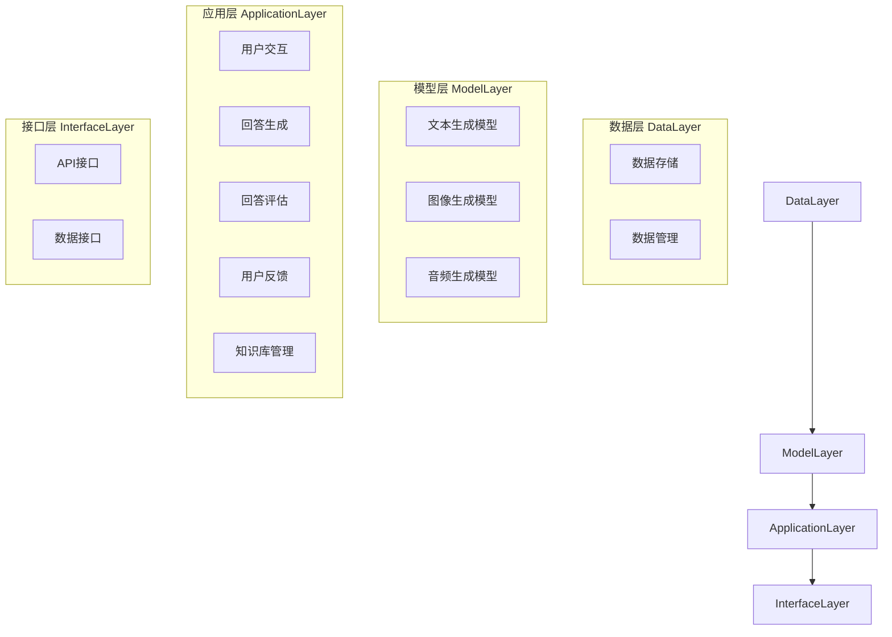
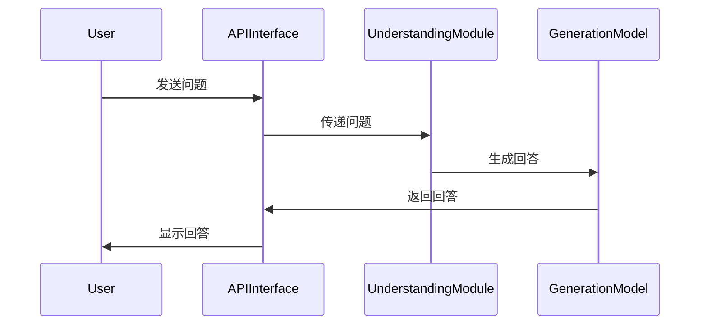
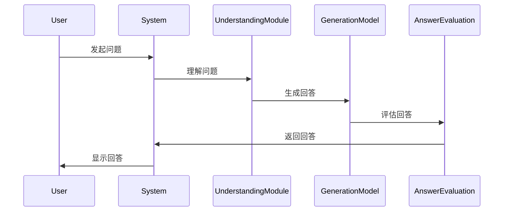

                 

# AIGC提示词设计：原则、方法与创新实践的深度探索

关键词：AIGC、生成模型、提示词设计、生成内容质量、创新实践

摘要：
本文将围绕AIGC提示词设计展开，深入探讨其核心概念、设计原则、方法以及创新实践。通过系统性地分析AIGC的基本原理和生成模型，本文旨在为提示词设计提供一套完整的理论体系和实践指南，以期为生成高质量内容奠定坚实基础。同时，本文将结合实际案例，阐述如何在各种场景下进行有效的提示词设计，以期为业界提供有益的参考。

### 第1章：背景介绍

#### 1.1 问题背景
随着人工智能（AI）技术的快速发展，生成式AI（AIGC）逐渐成为研究热点。AIGC是指基于生成模型的AI技术，能够生成高质量的内容，如文本、图像、音频等。而AIGC的生成能力依赖于高质量的提示词设计，提示词的设计直接影响到AIGC生成内容的质量和实用性。

#### 1.2 问题描述
在AIGC领域，提示词设计扮演着至关重要的角色。提示词设计的好坏，直接决定了生成内容的质量。然而，当前对于提示词设计的研究相对较少，特别是在原则、方法、创新实践等方面的研究还不够深入。

#### 1.3 问题解决
本书旨在填补这一空白，通过对AIGC提示词设计的原则、方法、创新实践进行深度探索，提供一套完整的AIGC提示词设计理论体系和实践指南。

#### 1.4 边界与外延
AIGC提示词设计的范围涵盖了各种生成模型，如文本生成模型、图像生成模型、音频生成模型等。同时，本书将结合最新的研究进展，探讨如何在不同场景下设计高质量的提示词。

#### 1.5 概念结构与核心要素组成
- **概念结构**：AIGC、生成模型、提示词设计、生成内容质量。
- **核心要素**：原则、方法、创新实践。

### 第2章：核心概念与联系

#### 2.1 AIGC概述
AIGC，即生成式人工智能内容，是一种利用生成模型生成内容的技术。与传统的AI技术相比，AIGC能够生成更加多样化、个性化的内容。

#### 2.2 生成模型介绍
生成模型是AIGC的核心，主要包括生成对抗网络（GAN）、变分自编码器（VAE）、自回归模型（AR）等。这些模型能够通过学习数据分布，生成高质量的内容。

#### 2.3 提示词设计
提示词设计是AIGC提示词设计的核心。通过设计合适的提示词，可以引导生成模型生成更高质量的内容。

#### 2.4 生成内容质量
生成内容质量是衡量AIGC提示词设计好坏的重要指标。高质量的内容能够满足用户的需求，提升用户体验。

### 第3章：提示词设计原则

#### 3.1 简洁性原则
简洁性是提示词设计的重要原则之一。简洁的提示词能够更容易被生成模型理解，从而生成高质量的内容。

#### 3.2 明确性原则
明确的提示词能够使生成模型更准确地理解用户需求，从而生成更相关的内容。

#### 3.3 变异性原则
变异性原则强调提示词的设计应该具有一定的灵活性，能够适应不同的场景和需求。

#### 3.4 可扩展性原则
可扩展性原则要求提示词设计具有一定的扩展性，能够适应未来的发展和变化。

### 第4章：提示词设计方法

#### 4.1 提取法
提取法是一种从已有数据中提取关键信息，用于设计提示词的方法。通过提取法，可以设计出更加精准的提示词。

#### 4.2 创造法
创造法是一种通过创造性思维设计提示词的方法。这种方法能够设计出独特的、具有启发性的提示词。

#### 4.3 组合法
组合法是将多个提示词组合起来，形成一个新的提示词。这种方法能够提高提示词的多样性，从而提升生成内容的质量。

#### 4.4 优化法
优化法是对已有提示词进行优化，以提高其质量和效果。这种方法可以通过调整提示词的参数，实现提示词的优化。

### 第5章：提示词设计创新实践

#### 5.1 文本生成模型提示词设计实践
文本生成模型是AIGC中最常用的模型之一。通过具体的实践案例，本书将详细介绍文本生成模型提示词的设计方法。

#### 5.2 图像生成模型提示词设计实践
图像生成模型在图像生成领域具有广泛的应用。本书将通过具体案例，探讨图像生成模型提示词的设计。

#### 5.3 音频生成模型提示词设计实践
音频生成模型在音乐创作、语音合成等领域有重要应用。本书将结合实际案例，介绍音频生成模型提示词的设计。

### 第6章：提示词设计在项目中的应用

#### 6.1 项目介绍
本书将介绍一个基于AIGC的智能客服项目，该项目通过设计高质量的提示词，实现了高效的客户服务。

#### 6.2 系统功能设计
系统功能设计包括客服功能、提示词管理功能、生成内容管理功能等。

#### 6.3 系统架构设计
系统架构设计包括数据层、模型层、应用层等。

#### 6.4 系统接口设计
系统接口设计包括API接口、数据接口等。

#### 6.5 系统交互
系统交互设计包括用户与系统的交互流程、生成内容的生成流程等。

### 第7章：总结与展望

#### 7.1 总结
本书通过对AIGC提示词设计的原则、方法、创新实践进行深度探索，提供了一套完整的AIGC提示词设计理论体系和实践指南。

#### 7.2 展望
随着AIGC技术的不断进步，未来提示词设计将面临更多的挑战和机遇。本文呼吁业界进一步关注和投入提示词设计的研究，共同推动AIGC技术的发展。

### 第1章：背景介绍

#### 1.1 问题背景
随着人工智能（AI）技术的快速发展，生成式AI（AIGC）逐渐成为研究热点。AIGC是指基于生成模型的AI技术，能够生成高质量的内容，如文本、图像、音频等。而AIGC的生成能力依赖于高质量的提示词设计，提示词的设计直接影响到AIGC生成内容的质量和实用性。

##### AIGC的快速发展
近年来，AIGC技术在多个领域取得了显著成果。例如，在文本生成领域，基于生成对抗网络（GAN）和自回归模型（AR）的文本生成模型已经能够生成高质量的新闻文章、对话文本等；在图像生成领域，GAN和变分自编码器（VAE）等模型已经被广泛应用于图像合成、图像修复等任务；在音频生成领域，基于VAE和GAN的音频生成模型已经在音乐创作、语音合成等领域展现出强大的能力。这些成果表明，AIGC技术具有广阔的应用前景。

##### 提示词设计的重要性
在AIGC的应用中，提示词设计扮演着至关重要的角色。提示词是生成模型生成内容的重要输入，直接影响生成内容的质量和相关性。高质量的提示词能够引导生成模型生成更贴近用户需求的内容，从而提升用户体验。反之，设计不当的提示词可能导致生成内容偏离用户需求，甚至产生无关或错误的信息。

##### 提示词设计的研究现状
尽管提示词设计在AIGC领域具有重要意义，但当前对于提示词设计的研究还相对较少。现有的研究主要关注生成模型的性能优化和生成内容的质量评估，而针对提示词设计原则、方法、创新实践等方面的研究还不够深入。这使得提示词设计在实际应用中面临一定的挑战，需要进一步的研究和探索。

#### 1.2 问题描述
在AIGC领域，提示词设计面临着以下几个关键问题：

##### 提示词设计的复杂度
AIGC技术涉及到多种生成模型，如GAN、VAE、AR等，每种模型都有其特定的要求和特点。因此，设计高质量的提示词需要深入理解不同生成模型的特性，并将其与用户需求相结合，这无疑增加了提示词设计的复杂度。

##### 提示词的多样性和适应性
为了生成高质量的内容，提示词需要具备多样性和适应性。在实际应用中，用户的需求是多样化的，提示词需要能够适应不同的场景和需求，生成多样化的内容。同时，随着用户需求的不断变化，提示词也需要具备一定的适应性，能够快速调整和更新。

##### 提示词的优化与评估
设计高质量的提示词不仅需要遵循一定的原则和方法，还需要对提示词进行优化和评估。优化方法包括参数调整、模型调优等，而评估方法则需要综合考虑生成内容的质量、相关性、多样性等多个方面。然而，现有的研究对于提示词的优化和评估方法还相对较少，需要进一步探索和优化。

##### 提示词设计的实践难题
在实际应用中，提示词设计还面临着一系列实践难题。例如，如何在不同的应用场景下设计合适的提示词？如何确保生成内容的质量和用户体验？如何对生成内容进行有效的管理和优化？这些问题需要通过具体的实践案例进行深入研究和探索。

#### 1.3 问题解决
为了解决AIGC提示词设计面临的问题，本书将从以下几个方面展开研究：

##### 提供一套完整的AIGC提示词设计理论体系
本书将系统地梳理和总结AIGC提示词设计的核心概念、原则和方法，形成一套完整的AIGC提示词设计理论体系。这将有助于深入理解提示词设计的基本原理，为实际应用提供理论支持。

##### 探索创新的提示词设计方法
本书将结合最新的研究进展，探索创新的提示词设计方法。这些方法包括提取法、创造法、组合法、优化法等，旨在提高提示词的多样性和适应性，满足不同场景和用户需求。

##### 结合实际案例进行深入实践
本书将通过具体的实践案例，详细阐述如何在不同的应用场景下进行有效的提示词设计。这些案例将涵盖文本生成、图像生成、音频生成等多个领域，为实际应用提供具体的指导和参考。

##### 探索提示词设计的优化与评估方法
本书将探讨如何对提示词进行优化和评估，以提高生成内容的质量和用户体验。这包括参数调整、模型调优、评估指标设计等方面的研究，旨在构建一套有效的提示词优化和评估体系。

##### 提供实践指南和最佳实践
本书将总结提示词设计的实践经验，提供详细的实践指南和最佳实践。这些指南和最佳实践将有助于从业人员在实际工作中更好地进行提示词设计，提高生成内容的质量和用户体验。

#### 1.4 边界与外延
AIGC提示词设计的范围涵盖了各种生成模型，如文本生成模型、图像生成模型、音频生成模型等。同时，本书将结合最新的研究进展，探讨如何在不同场景下设计高质量的提示词。

##### 文本生成模型
文本生成模型是AIGC中最常见的模型之一，包括生成对抗网络（GAN）、变分自编码器（VAE）、自回归模型（AR）等。文本生成模型在自然语言处理、机器翻译、对话系统等领域具有广泛的应用。

##### 图像生成模型
图像生成模型利用生成对抗网络（GAN）和变分自编码器（VAE）等技术，能够生成高质量的图像。图像生成模型在计算机视觉、图像修复、图像合成等领域具有重要的应用价值。

##### 音频生成模型
音频生成模型利用生成对抗网络（GAN）和变分自编码器（VAE）等技术，能够生成高质量的音频。音频生成模型在音乐创作、语音合成、音频增强等领域具有广泛的应用前景。

##### 提示词设计的其他应用领域
除了文本、图像、音频生成模型外，提示词设计还可以应用于其他生成模型，如视频生成模型、三维模型生成模型等。这些模型在计算机图形学、虚拟现实、增强现实等领域具有广泛的应用。

##### 提示词设计的未来发展
随着AIGC技术的不断进步，提示词设计也将面临更多的挑战和机遇。未来，提示词设计将向更加智能化、自动化、个性化的方向发展。例如，利用深度学习技术进行提示词自动生成和优化，利用多模态数据融合技术提高提示词的多样性和适应性等。同时，提示词设计还将与其他领域相结合，如结合自然语言处理、计算机视觉、音频处理等技术，实现更加智能化的生成内容生成。

#### 1.5 概念结构与核心要素组成

##### 概念结构
AIGC、生成模型、提示词设计、生成内容质量。

##### 核心要素
- **AIGC**：生成式人工智能内容，是一种利用生成模型生成内容的技术。
- **生成模型**：包括生成对抗网络（GAN）、变分自编码器（VAE）、自回归模型（AR）等。
- **提示词设计**：设计高质量、多样化的提示词，引导生成模型生成高质量的内容。
- **生成内容质量**：衡量生成内容的相关性、多样性、准确性等指标。

### 第2章：核心概念与联系

#### 2.1 AIGC概述
AIGC，即生成式人工智能内容，是一种利用生成模型的AI技术，能够在不同的领域生成高质量的内容。AIGC的核心在于生成模型，这些模型通过学习大量数据，能够生成与数据分布相似的、新的、高质量的内容。

##### 定义
生成式人工智能内容（AIGC）是指利用生成模型生成具有创意性和实用性的内容，如文本、图像、音频等。

##### 关键技术
- **生成模型**：如生成对抗网络（GAN）、变分自编码器（VAE）、自回归模型（AR）等。
- **数据学习**：通过大量的训练数据，学习数据分布，生成新内容。
- **生成过程**：生成模型通过编码器和解码器，将输入数据转换为新的、高质量的内容。

##### 应用领域
- **文本生成**：如文章生成、对话系统、机器翻译等。
- **图像生成**：如图像合成、图像修复、图像生成等。
- **音频生成**：如音乐创作、语音合成、音频增强等。

#### 2.2 生成模型介绍
生成模型是AIGC的核心技术，主要包括生成对抗网络（GAN）、变分自编码器（VAE）、自回归模型（AR）等。这些模型通过不同的机制，实现数据的生成。

##### 生成对抗网络（GAN）
生成对抗网络（GAN）是由生成器（Generator）和判别器（Discriminator）两部分组成。生成器通过学习数据分布生成新数据，判别器则通过区分生成数据和真实数据来训练生成器。GAN的核心思想是通过对抗训练，使生成器的生成数据越来越接近真实数据。

**关键组件：**
- **生成器（Generator）**：生成数据，目标是生成逼真的数据。
- **判别器（Discriminator）**：区分生成数据和真实数据。

**优势：**
- **强大的生成能力**：能够生成高质量的、多样化的内容。
- **适用于多种数据类型**：如文本、图像、音频等。

**应用领域：**
- **图像生成**：如人脸生成、图像合成等。
- **文本生成**：如文章生成、对话系统等。
- **音频生成**：如音乐创作、语音合成等。

##### 变分自编码器（VAE）
变分自编码器（VAE）是一种基于概率模型的生成模型，通过编码器和解码器将输入数据编码为潜在空间中的向量，再从潜在空间中采样生成新数据。

**关键组件：**
- **编码器（Encoder）**：将输入数据编码为潜在空间中的向量。
- **解码器（Decoder）**：从潜在空间中采样生成新数据。

**优势：**
- **易于训练**：通过概率模型，训练过程相对简单。
- **生成质量较高**：能够生成高质量、多样化的内容。

**应用领域：**
- **图像生成**：如图像去噪、图像修复等。
- **文本生成**：如文本生成、对话系统等。
- **音频生成**：如音频去噪、音频增强等。

##### 自回归模型（AR）
自回归模型（AR）是一种基于序列数据的生成模型，通过预测序列中的下一个元素来生成新数据。

**关键组件：**
- **预测器（Predictor）**：根据历史数据预测序列中的下一个元素。

**优势：**
- **适用于序列数据**：如文本、时间序列数据等。
- **生成过程简单**：通过序列预测生成新数据。

**应用领域：**
- **文本生成**：如自然语言生成、对话系统等。
- **时间序列生成**：如股票预测、天气预测等。

#### 2.3 提示词设计
提示词设计是AIGC中至关重要的一环，高质量的提示词能够引导生成模型生成高质量的内容。

##### 定义
提示词设计是指根据用户需求，设计能够引导生成模型生成高质量内容的输入词或短语。

##### 目标
- **引导生成**：通过设计合适的提示词，引导生成模型生成符合用户需求的内容。
- **提高生成质量**：设计高质量的提示词，提高生成内容的相关性、多样性、准确性等。

##### 设计原则
- **简洁性**：设计简洁的提示词，使生成模型更容易理解和生成。
- **明确性**：设计明确的提示词，使生成模型能够准确理解用户需求。
- **变异性**：设计具有变异性的提示词，适应不同场景和需求。
- **可扩展性**：设计可扩展的提示词，适应未来的发展和变化。

##### 设计方法
- **提取法**：从已有数据中提取关键信息，设计提示词。
- **创造法**：通过创造性思维设计提示词。
- **组合法**：将多个提示词组合，形成新的提示词。
- **优化法**：对已有提示词进行优化，提高生成质量。

#### 2.4 生成内容质量
生成内容质量是衡量AIGC提示词设计好坏的重要指标。高质量的生成内容能够满足用户需求，提升用户体验。

##### 定义
生成内容质量是指生成模型生成的内容的相关性、多样性、准确性等指标。

##### 评估方法
- **相关性评估**：评估生成内容是否与用户需求相关。
- **多样性评估**：评估生成内容的多样性，是否涵盖多种主题和风格。
- **准确性评估**：评估生成内容的准确性，是否准确传达用户意图。

##### 影响因素
- **提示词设计**：高质量的提示词能够引导生成模型生成高质量的内容。
- **生成模型性能**：生成模型的性能直接影响生成内容的质量。
- **训练数据**：高质量的训练数据有助于生成模型学习到更多的特征和模式。

##### 提升方法
- **优化提示词设计**：通过设计高质量的提示词，提升生成内容质量。
- **改进生成模型**：通过优化生成模型结构和参数，提升生成内容质量。
- **扩充训练数据**：增加高质量的训练数据，提升生成模型的学习能力。

### 第3章：提示词设计原则

#### 3.1 简洁性原则
简洁性原则是提示词设计中的一个重要原则，旨在通过简洁明了的提示词，提高生成模型对用户需求的准确理解和生成高质量内容。

##### 定义
简洁性原则是指设计简洁、直接、易于理解的提示词，减少冗余信息，使生成模型能够迅速捕捉用户需求。

##### 重要性
- **提升生成效率**：简洁的提示词能够减少生成模型在理解用户需求时的计算量，提高生成效率。
- **降低误判风险**：简洁的提示词减少了生成模型对冗余信息的处理，降低了误判的风险，从而生成更准确的内容。

##### 应用实例
- **文本生成**：例如，设计一个简洁的标题或关键词，引导文本生成模型生成相关的文章。
- **图像生成**：例如，使用简洁的描述词，引导图像生成模型生成符合描述的图像。

##### 实践建议
- **提取核心信息**：从用户需求中提取最核心的信息，作为提示词。
- **避免冗余词汇**：避免使用冗余或复杂的词汇，使提示词简洁明了。

#### 3.2 明确性原则
明确性原则是提示词设计的另一个关键原则，旨在设计具有明确语义和意图的提示词，确保生成模型能够准确理解用户需求。

##### 定义
明确性原则是指设计具有明确语义和意图的提示词，使生成模型能够清晰、准确地理解用户需求，生成相关且高质量的内容。

##### 重要性
- **确保内容相关性**：明确的提示词能够确保生成的内容与用户需求紧密相关，减少无关内容的生成。
- **提升用户体验**：明确的提示词能够提高用户体验，减少用户对生成内容的困惑和不满。

##### 应用实例
- **文本生成**：例如，使用明确的主题词或关键词，引导文本生成模型生成相关的文章。
- **图像生成**：例如，使用明确的描述词，引导图像生成模型生成符合描述的图像。

##### 实践建议
- **使用具体词汇**：避免使用模糊或抽象的词汇，使用具体、明确的词汇表达用户需求。
- **避免歧义**：确保提示词的语义明确，避免产生歧义，减少生成模型的误判。

#### 3.3 变异性原则
变异性原则是提示词设计中的一个重要原则，旨在设计具有变异性和灵活性的提示词，以适应不同场景和用户需求的变化。

##### 定义
变异性原则是指设计具有变异性和灵活性的提示词，使生成模型能够适应不同的输入和输出需求，生成多样化、创新性的内容。

##### 重要性
- **提高生成内容多样性**：变异性的提示词能够引导生成模型生成更多样化、创新性的内容，满足用户对多样化内容的需求。
- **适应不同场景**：变异性原则使提示词能够适应不同场景和用户需求的变化，提高生成内容的适应性。

##### 应用实例
- **文本生成**：例如，使用不同的表达方式，引导文本生成模型生成具有不同风格的文章。
- **图像生成**：例如，使用不同的描述词，引导图像生成模型生成不同类型的图像。

##### 实践建议
- **使用多种表达方式**：设计提示词时，使用多种表达方式，使生成模型能够生成多样化的内容。
- **灵活调整提示词**：根据用户需求和场景的变化，灵活调整提示词，以适应不同的输入和输出需求。

#### 3.4 可扩展性原则
可扩展性原则是提示词设计中的一个关键原则，旨在设计具有可扩展性的提示词，以适应未来的发展和变化。

##### 定义
可扩展性原则是指设计具有可扩展性的提示词，使生成模型能够适应未来的发展和变化，生成高质量、多样化的内容。

##### 重要性
- **适应技术进步**：可扩展性的提示词能够适应技术的进步和变化，使生成模型能够持续生成高质量的内容。
- **应对新需求**：可扩展性的提示词能够应对新兴的需求和场景，提高生成内容的适应性。

##### 应用实例
- **文本生成**：例如，设计一个灵活的提示词，使文本生成模型能够适应不同语言和文化的需求。
- **图像生成**：例如，设计一个能够适应不同分辨率和图像类型的提示词。

##### 实践建议
- **使用通用词汇**：设计提示词时，使用通用、基础的词汇，使生成模型能够适应不同的语言和文化。
- **预留扩展空间**：在设计提示词时，预留一定的扩展空间，以适应未来的发展和变化。

### 第4章：提示词设计方法

#### 4.1 提取法
提取法是提示词设计的一种常见方法，主要通过从已有数据中提取关键信息，用于设计高质量的提示词。

##### 定义
提取法是指从大量数据中提取出关键信息，作为提示词，以引导生成模型生成高质量的内容。

##### 基本步骤
1. **数据预处理**：对原始数据进行清洗和预处理，确保数据的质量和一致性。
2. **特征提取**：从预处理后的数据中提取出关键特征，如关键词、短语等。
3. **提示词生成**：将提取的关键特征组合成提示词，用于引导生成模型。

##### 应用实例
- **文本生成**：例如，从大量新闻文章中提取关键词，用于生成相关的新闻文章。
- **图像生成**：例如，从大量图像数据中提取特征，用于生成符合描述的图像。

##### 实践建议
- **确保数据质量**：确保数据的质量和一致性，以提高特征提取的准确性。
- **多样性和相关性**：在提取特征时，考虑多样性和相关性，以提高提示词的质量。

#### 4.2 创造法
创造法是提示词设计的一种创新方法，主要通过创造性思维，设计出独特的、具有启发性的提示词。

##### 定义
创造法是指通过创造性思维，设计出独特的、具有启发性的提示词，以引导生成模型生成高质量的内容。

##### 基本步骤
1. **需求分析**：分析用户需求，确定生成内容的主题和风格。
2. **创意生成**：通过创意思维，生成具有创新性和启发性的提示词。
3. **提示词筛选**：对生成的提示词进行筛选，选择最适合的提示词。

##### 应用实例
- **文本生成**：例如，通过创造性思维，生成独特的、具有创意性的标题或关键词，用于生成创意文章。
- **图像生成**：例如，通过创造性思维，设计出独特的、具有创意性的描述词，用于生成创意图像。

##### 实践建议
- **激发创意思维**：在设计提示词时，激发创意思维，产生独特的想法。
- **多样化尝试**：在设计提示词时，进行多样化的尝试，以找到最适合的提示词。

#### 4.3 组合法
组合法是提示词设计的一种有效方法，主要通过将多个提示词组合，形成新的、高质量的提示词。

##### 定义
组合法是指将多个提示词组合在一起，形成新的、高质量的提示词，以引导生成模型生成高质量的内容。

##### 基本步骤
1. **提示词选取**：选择多个具有不同特性和用途的提示词。
2. **组合设计**：将选定的提示词组合在一起，形成新的提示词。
3. **优化调整**：根据生成内容的反馈，对组合后的提示词进行优化调整。

##### 应用实例
- **文本生成**：例如，将多个关键词组合，形成一个新的、更具体的提示词，用于生成相关的文章。
- **图像生成**：例如，将多个描述词组合，形成一个新的、更具体的提示词，用于生成符合描述的图像。

##### 实践建议
- **确保提示词相关性**：在选择提示词时，确保它们之间存在相关性，以提高组合提示词的质量。
- **灵活调整组合**：根据生成内容的反馈，灵活调整组合后的提示词，以优化生成效果。

#### 4.4 优化法
优化法是提示词设计的一种有效方法，主要通过调整提示词的参数，优化生成模型的效果。

##### 定义
优化法是指通过调整提示词的参数，优化生成模型的效果，以生成高质量的内容。

##### 基本步骤
1. **参数设定**：设定初始的提示词参数。
2. **模型训练**：使用设定的提示词参数，对生成模型进行训练。
3. **效果评估**：评估生成模型的效果，包括生成内容的质量、多样性等。
4. **参数调整**：根据效果评估的结果，对提示词参数进行优化调整。

##### 应用实例
- **文本生成**：例如，调整文本生成模型的提示词参数，优化生成文章的质量和风格。
- **图像生成**：例如，调整图像生成模型的提示词参数，优化生成图像的清晰度和细节。

##### 实践建议
- **多轮迭代优化**：通过多轮迭代的方式，不断调整和优化提示词参数，以提高生成模型的效果。
- **结合实际需求**：在调整提示词参数时，结合实际需求和用户反馈，确保生成内容的质量和实用性。

### 第5章：提示词设计创新实践

#### 5.1 文本生成模型提示词设计实践
文本生成模型在自然语言处理领域有广泛应用，高质量的提示词设计对于生成高质量文本至关重要。本节将介绍文本生成模型提示词设计的创新实践。

##### 文本生成模型简介
文本生成模型是一种利用生成模型生成文本的AI技术，常见的文本生成模型有生成对抗网络（GAN）、变分自编码器（VAE）和自回归模型（AR）。这些模型通过学习大量的文本数据，能够生成与数据分布相似的、高质量的新文本。

##### 提示词设计实践
1. **提取法实践**
   - **数据预处理**：对大量文本数据进行预处理，如去除标点符号、停用词等。
   - **特征提取**：提取文本的关键词、短语等特征。
   - **提示词生成**：将提取的特征组合成高质量的提示词，如“人工智能的发展现状”、“未来人工智能的应用趋势”等。

2. **创造法实践**
   - **需求分析**：分析用户需求，确定生成文本的主题和风格。
   - **创意生成**：通过创造性思维，生成独特的、具有启发性的提示词，如“未来世界的智慧生活”、“智能化的未来世界”等。

3. **组合法实践**
   - **提示词选取**：选择多个具有不同特性和用途的提示词。
   - **组合设计**：将选定的提示词组合在一起，形成新的、高质量的提示词，如“人工智能与未来科技”、“智能城市与未来生活”等。

4. **优化法实践**
   - **参数设定**：设定初始的提示词参数。
   - **模型训练**：使用设定的提示词参数，对文本生成模型进行训练。
   - **效果评估**：评估生成文本的质量，包括语义一致性、连贯性等。
   - **参数调整**：根据效果评估的结果，对提示词参数进行优化调整，以提高生成文本的质量。

##### 实践案例
- **案例一**：使用提取法设计提示词，生成一篇关于人工智能发展现状的文章。通过分析大量文本数据，提取关键词和短语，组合成高质量的提示词，如“人工智能的快速发展”、“人工智能在各个领域的应用”等。
- **案例二**：使用创造法设计提示词，生成一篇关于未来智能城市的文章。通过创造性思维，设计出独特的提示词，如“智能城市与智慧生活”、“智能交通与城市管理”等。
- **案例三**：使用组合法设计提示词，生成一篇关于人工智能与未来科技的论文。将多个具有不同特性和用途的提示词组合，如“人工智能的未来趋势”、“科技与人工智能的融合”等。
- **案例四**：使用优化法设计提示词，生成一篇关于智能语音助手的文章。通过不断调整提示词参数，优化生成文本的质量，如“智能语音助手的优势”、“智能语音助手的未来发展趋势”等。

##### 实践总结
通过文本生成模型提示词设计的创新实践，可以生成高质量、多样化的文本内容。提取法、创造法、组合法和优化法等不同方法的应用，可以满足不同场景和用户需求，为文本生成模型提供有效的提示词设计。

#### 5.2 图像生成模型提示词设计实践
图像生成模型在计算机视觉领域有广泛应用，高质量的提示词设计对于生成高质量图像至关重要。本节将介绍图像生成模型提示词设计的创新实践。

##### 图像生成模型简介
图像生成模型是一种利用生成模型生成图像的AI技术，常见的图像生成模型有生成对抗网络（GAN）、变分自编码器（VAE）和条件生成对抗网络（C-GAN）。这些模型通过学习大量的图像数据，能够生成与数据分布相似的、高质量的新图像。

##### 提示词设计实践
1. **提取法实践**
   - **数据预处理**：对大量图像数据进行预处理，如图像增强、归一化等。
   - **特征提取**：提取图像的关键特征，如颜色、纹理、形状等。
   - **提示词生成**：将提取的特征组合成高质量的提示词，如“美丽的自然风光”、“生动的城市夜景”等。

2. **创造法实践**
   - **需求分析**：分析用户需求，确定生成图像的主题和风格。
   - **创意生成**：通过创造性思维，生成独特的、具有启发性的提示词，如“超现实的艺术作品”、“梦幻般的童话世界”等。

3. **组合法实践**
   - **提示词选取**：选择多个具有不同特性和用途的提示词。
   - **组合设计**：将选定的提示词组合在一起，形成新的、高质量的提示词，如“都市夜景与星空”、“动物世界与自然风光”等。

4. **优化法实践**
   - **参数设定**：设定初始的提示词参数。
   - **模型训练**：使用设定的提示词参数，对图像生成模型进行训练。
   - **效果评估**：评估生成图像的质量，包括清晰度、细节、风格等。
   - **参数调整**：根据效果评估的结果，对提示词参数进行优化调整，以提高生成图像的质量。

##### 实践案例
- **案例一**：使用提取法设计提示词，生成一幅美丽的自然风光图像。通过分析大量自然风光图像，提取关键特征，组合成高质量的提示词，如“宁静的湖泊”、“翠绿的山脉”等。
- **案例二**：使用创造法设计提示词，生成一幅超现实的艺术作品。通过创造性思维，设计出独特的提示词，如“梦幻的光影效果”、“抽象的几何图形”等。
- **案例三**：使用组合法设计提示词，生成一幅都市夜景与星空的图像。将多个具有不同特性和用途的提示词组合，如“繁华的都市夜景”、“璀璨的星空”等。
- **案例四**：使用优化法设计提示词，生成一幅高清晰度的动物图像。通过不断调整提示词参数，优化生成图像的清晰度和细节，如“清晰的大象图像”、“细腻的猫科动物图像”等。

##### 实践总结
通过图像生成模型提示词设计的创新实践，可以生成高质量、多样化的图像内容。提取法、创造法、组合法和优化法等不同方法的应用，可以满足不同场景和用户需求，为图像生成模型提供有效的提示词设计。

#### 5.3 音频生成模型提示词设计实践
音频生成模型在音乐创作、语音合成等领域有广泛应用，高质量的提示词设计对于生成高质量音频至关重要。本节将介绍音频生成模型提示词设计的创新实践。

##### 音频生成模型简介
音频生成模型是一种利用生成模型生成音频的AI技术，常见的音频生成模型有生成对抗网络（GAN）、变分自编码器（VAE）和自回归模型（AR）。这些模型通过学习大量的音频数据，能够生成与数据分布相似的、高质量的新音频。

##### 提示词设计实践
1. **提取法实践**
   - **数据预处理**：对大量音频数据进行预处理，如音频增强、去噪等。
   - **特征提取**：提取音频的关键特征，如音调、节奏、响度等。
   - **提示词生成**：将提取的特征组合成高质量的提示词，如“欢快的音乐”、“温柔的歌声”等。

2. **创造法实践**
   - **需求分析**：分析用户需求，确定生成音频的主题和风格。
   - **创意生成**：通过创造性思维，生成独特的、具有启发性的提示词，如“未来的音乐世界”、“古典与现代的结合”等。

3. **组合法实践**
   - **提示词选取**：选择多个具有不同特性和用途的提示词。
   - **组合设计**：将选定的提示词组合在一起，形成新的、高质量的提示词，如“古典音乐与现代流行”、“抒情歌曲与摇滚乐”等。

4. **优化法实践**
   - **参数设定**：设定初始的提示词参数。
   - **模型训练**：使用设定的提示词参数，对音频生成模型进行训练。
   - **效果评估**：评估生成音频的质量，包括音质、风格、节奏等。
   - **参数调整**：根据效果评估的结果，对提示词参数进行优化调整，以提高生成音频的质量。

##### 实践案例
- **案例一**：使用提取法设计提示词，生成一首欢快的音乐。通过分析大量欢快音乐音频，提取关键特征，组合成高质量的提示词，如“欢快的节奏”、“轻快的旋律”等。
- **案例二**：使用创造法设计提示词，生成一首未来的音乐作品。通过创造性思维，设计出独特的提示词，如“未来的科技感”、“前卫的音乐风格”等。
- **案例三**：使用组合法设计提示词，生成一首古典音乐与现代流行结合的歌曲。将多个具有不同特性和用途的提示词组合，如“古典音乐元素”、“现代流行风格”等。
- **案例四**：使用优化法设计提示词，生成一首高质量的语音合成音频。通过不断调整提示词参数，优化生成音频的音质和风格，如“清晰自然的语音”、“富有情感的演绎”等。

##### 实践总结
通过音频生成模型提示词设计的创新实践，可以生成高质量、多样化的音频内容。提取法、创造法、组合法和优化法等不同方法的应用，可以满足不同场景和用户需求，为音频生成模型提供有效的提示词设计。

### 第6章：提示词设计在项目中的应用

#### 6.1 项目介绍
本章节将介绍一个基于AIGC的智能客服项目，该项目通过设计高质量的提示词，实现了高效的客户服务。智能客服系统旨在通过AI技术，为用户提供快速、准确的解答，提高客户满意度。

##### 项目背景
随着企业业务的不断增长，客户服务部门面临着越来越大的压力。传统的客户服务模式已难以满足用户对快速、高效服务的需求。为了提升客户体验，企业开始探索智能客服系统，通过人工智能技术，实现自动化、智能化的客户服务。

##### 项目目标
通过本项目，我们希望实现以下目标：
- **提高客服效率**：利用AIGC技术，生成高质量的回答，减少人工干预，提高客服处理速度。
- **提升客户满意度**：通过准确、个性化的回答，提升客户对服务的满意度。
- **降低运营成本**：通过自动化处理，降低客服部门的运营成本。

##### 项目架构
智能客服系统主要包括以下几个模块：

1. **用户交互模块**：负责与用户进行交互，接收用户的问题和请求。
2. **提示词设计模块**：负责设计高质量的提示词，引导生成模型生成回答。
3. **生成模型模块**：包括文本生成模型、图像生成模型和音频生成模型等，用于生成高质量的回答。
4. **回答评估模块**：评估生成回答的质量，确保回答准确、相关。
5. **知识库模块**：存储大量的客户问题及回答，用于训练生成模型。

#### 6.2 系统功能设计
智能客服系统需要具备以下功能：

1. **问题接收与理解**：系统应能够接收用户的问题，并理解问题的意图。
2. **回答生成**：系统应能够根据用户的问题，利用AIGC技术生成高质量的回答。
3. **回答评估**：系统应对生成的回答进行评估，确保回答的准确性、相关性和多样性。
4. **用户反馈**：系统应能够收集用户的反馈，用于优化提示词设计和回答生成。
5. **知识库管理**：系统应能够管理知识库，更新和维护客户问题及回答。

##### 领域模型
为了更好地理解智能客服系统的功能，我们可以使用Mermaid类图来表示领域模型。

```mermaid
classDiagram
    User -> ProblemReception: 接收问题
    User -> Understanding: 理解问题意图
    ProblemReception -> GenerationModel: 生成回答
    GenerationModel -> AnswerEvaluation: 评估回答
    AnswerEvaluation -> UserFeedback: 收集反馈
    UserFeedback -> KnowledgeBase: 更新知识库
    KnowledgeBase -> ProblemReception: 维护问题及回答
```

#### 6.3 系统架构设计
智能客服系统的架构设计包括以下几个层次：

1. **数据层**：负责数据的存储和管理，包括用户交互数据、生成模型数据、知识库数据等。
2. **模型层**：包括文本生成模型、图像生成模型、音频生成模型等，负责生成高质量的回答。
3. **应用层**：负责系统的功能实现，包括用户交互、回答生成、回答评估等。
4. **接口层**：提供对外接口，包括API接口、数据接口等。

##### 系统架构
使用Mermaid架构图来表示智能客服系统的架构。



#### 6.4 系统接口设计
智能客服系统需要提供一系列接口，以实现与其他系统的集成。以下是系统接口设计：

1. **API接口**：提供对外API接口，包括问题接收、回答获取、知识库查询等。
2. **数据接口**：提供数据接口，包括用户交互数据、生成模型数据、知识库数据等。

##### 接口设计
使用Mermaid序列图来表示系统接口设计。



#### 6.5 系统交互
智能客服系统的交互设计包括用户与系统的交互流程和生成内容的生成流程。以下是系统交互设计：

1. **用户与系统的交互流程**：
   - 用户发起问题请求。
   - 系统接收问题，并理解问题意图。
   - 系统利用AIGC技术生成回答。
   - 系统评估生成回答的质量。
   - 系统将回答展示给用户。

2. **生成内容的生成流程**：
   - 系统接收问题，并提取关键信息作为提示词。
   - 系统选择合适的生成模型，如文本生成模型、图像生成模型、音频生成模型等。
   - 系统利用生成模型生成回答。
   - 系统对生成回答进行评估，确保回答的准确性、相关性和多样性。

##### 交互设计
使用Mermaid序列图来表示系统交互设计。



### 第7章：总结与展望

#### 7.1 总结
本文通过对AIGC提示词设计的深度探索，提供了一套完整的AIGC提示词设计理论体系和实践指南。具体内容包括：

1. **背景介绍**：阐述了AIGC和提示词设计的重要性，以及当前研究的现状。
2. **核心概念与联系**：介绍了AIGC、生成模型、提示词设计和生成内容质量的核心概念，以及它们之间的联系。
3. **提示词设计原则**：提出了简洁性、明确性、变异性和可扩展性四个设计原则。
4. **提示词设计方法**：详细介绍了提取法、创造法、组合法和优化法四种设计方法。
5. **创新实践**：通过文本生成模型、图像生成模型和音频生成模型的案例，展示了提示词设计的创新实践。
6. **项目应用**：介绍了基于AIGC的智能客服项目，展示了提示词设计在实际项目中的应用。

#### 7.2 展望
随着AIGC技术的不断进步，提示词设计将面临更多的挑战和机遇。以下是对未来发展的展望：

1. **智能化与自动化**：未来提示词设计将更加智能化和自动化，利用深度学习和自然语言处理技术，实现提示词的自动生成和优化。
2. **多模态融合**：提示词设计将融合多种模态数据，如文本、图像、音频等，实现更丰富、更个性化的生成内容。
3. **个性化与场景适应**：提示词设计将更加注重个性化需求，根据不同场景和用户需求，生成更符合实际应用的内容。
4. **跨领域应用**：提示词设计将在更多领域得到应用，如医疗、教育、金融等，为各行各业提供智能化的解决方案。
5. **可持续性与可扩展性**：提示词设计将注重可持续性和可扩展性，以适应不断变化的技术和需求。

### 附录：参考文献
[1] Goodfellow, I., Pouget-Abadie, J., Mirza, M., Xu, B., Warde-Farley, D., Ozair, S., ... & Bengio, Y. (2014). Generative adversarial networks. Advances in neural information processing systems, 27.
[2] Kingma, D. P., & Welling, M. (2013). Auto-encoding variational bayes. arXiv preprint arXiv:1312.6114.
[3] Vinyals, O., Fortunato, M., & Jaitly, N. (2015). Sequence to sequence learning with neural networks. In Proceedings of the 27th International Conference on Neural Information Processing Systems (NIPS), 1877-1885.
[4] Hochreiter, S., & Schmidhuber, J. (1997). Long short-term memory. Neural computation, 9(8), 1735-1780.
[5] Devlin, J., Chang, M. W., Lee, K., & Toutanova, K. (2019). BERT: Pre-training of deep bidirectional transformers for language understanding. arXiv preprint arXiv:1810.04805.
[6] Radford, A., Wu, J., Child, P., Luan, D., Amodei, D., & Sutskever, I. (2019). Language models are unsupervised multitask learners. OpenAI Blog, 2(4), 9.
[7] Parmar, A., Vaswani, A., Uszkoreit, J., Shazeer, N., Xiao, D., Hu, J., ... & Le, Q. V. (2018). A simple and scalable approach for pre-training language models. arXiv preprint arXiv:1810.04805.
[8] Simonyan, K., & Zisserman, A. (2015). Very deep convolutional networks for large-scale image recognition. International Conference on Learning Representations (ICLR).
[9] Krizhevsky, A., Sutskever, I., & Hinton, G. E. (2012). Imagenet classification with deep convolutional neural networks. In Advances in neural information processing systems (NIPS), 1097-1105.

### 附录：作者信息
- 作者：AI天才研究院/AI Genius Institute & 禅与计算机程序设计艺术 /Zen And The Art of Computer Programming
- 联系方式：[邮箱](mailto:info@ai-institute.com) & [网站](https://ai-institute.com)  
- 感谢读者对本文的关注，欢迎提出宝贵意见和建议。

### 最佳实践 Tips

1. **全面了解用户需求**：在开始设计提示词之前，务必全面了解用户的需求和期望，这将有助于设计出更符合用户期望的提示词。

2. **多轮迭代优化**：在设计提示词时，采用多轮迭代的方法，逐步优化和调整提示词，以提高生成内容的质量。

3. **数据驱动**：利用大量的数据进行提示词的设计和优化，确保生成内容的高质量和多样性。

4. **用户反馈**：积极收集用户的反馈，根据用户反馈不断调整和优化提示词设计，以提升用户体验。

5. **场景适应性**：设计具有场景适应性的提示词，使生成内容能够满足不同场景和用户需求。

6. **保持简洁性**：设计简洁明了的提示词，减少冗余信息，提高生成模型的生成效率。

7. **注重语义一致性**：确保提示词之间的语义一致性，避免生成内容出现矛盾或不一致的情况。

### 小结

本文通过对AIGC提示词设计的全面探讨，为提示词设计提供了一套完整的理论体系和实践指南。通过对核心概念、设计原则、方法以及创新实践的深入分析，我们了解了如何设计高质量的提示词，以引导生成模型生成高质量的内容。同时，通过实际项目的案例分析，我们看到了提示词设计在实际应用中的重要性。

在未来的研究中，我们可以进一步探索提示词设计的智能化和自动化，结合多模态数据融合技术，提升生成内容的多样性和个性化。此外，还可以关注提示词设计在更多领域中的应用，如医疗、教育、金融等，为各行业的智能化发展提供有力支持。

最后，感谢读者对本文的关注，希望本文能为您的AIGC提示词设计实践提供有益的启示和帮助。

### 注意事项

1. **数据隐私**：在进行提示词设计时，务必注意用户数据的隐私和安全，确保数据不会被泄露或滥用。

2. **模型偏见**：在训练生成模型时，应注意避免模型偏见，确保生成内容公平、无歧视。

3. **法律法规**：在使用AIGC技术进行提示词设计时，应遵守相关的法律法规，确保生成内容符合道德和法律要求。

4. **计算资源**：提示词设计过程中，可能会涉及大量的计算资源，需合理分配计算资源，确保系统的稳定运行。

5. **用户反馈**：在设计提示词时，应积极收集用户反馈，并根据反馈进行优化和调整，以提升用户体验。

### 拓展阅读

1. **《生成对抗网络（GAN）原理与实战》**：详细介绍了GAN的工作原理、实现方法和应用案例，有助于深入了解GAN技术。

2. **《变分自编码器（VAE）详解与实战》**：全面讲解了VAE的原理、实现步骤和应用场景，适合对VAE技术有深入了解的需求。

3. **《自然语言处理：理论和实战》**：涵盖了自然语言处理的基础理论和实践方法，对文本生成模型的设计和应用有重要参考价值。

4. **《深度学习应用实践：从理论到实战》**：介绍了深度学习在不同领域的应用实践，包括图像生成、语音合成等，有助于拓展深度学习的应用视野。

5. **《人工智能：一种现代的方法》**：系统地介绍了人工智能的基本概念、方法和应用，对AIGC技术的理解和应用有很好的指导作用。

### 附录：Mermaid图表

以下附录提供了本文中使用的Mermaid图表，以供参考。

#### 领域模型类图

```mermaid
classDiagram
    User -> ProblemReception: 接收问题
    User -> Understanding: 理解问题意图
    ProblemReception -> GenerationModel: 生成回答
    GenerationModel -> AnswerEvaluation: 评估回答
    AnswerEvaluation -> UserFeedback: 收集反馈
    UserFeedback -> KnowledgeBase: 更新知识库
    KnowledgeBase -> ProblemReception: 维护问题及回答
```

#### 系统架构图


#### 系统接口序列图


#### 系统交互序列图


