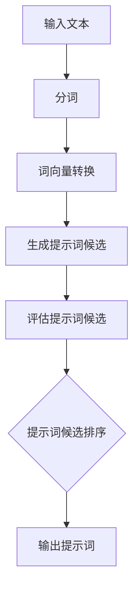

                 

# AIGC时代的提示词编写：技巧与陷阱解析

## 关键词

- **AIGC时代**
- **提示词**
- **自然语言处理**
- **生成模型**
- **算法原理**
- **实践技巧**
- **潜在陷阱**

## 摘要

随着人工智能技术的不断进步，AIGC（AI-Generated Content，AI生成内容）正逐渐成为信息时代的新趋势。提示词在AIGC中的作用至关重要，有效的提示词不仅能够提升生成内容的质量，还能提高模型的训练效率和实际应用效果。本文将深入探讨AIGC时代提示词编写的核心概念、技巧以及潜在陷阱，帮助读者全面掌握这一领域的关键知识和实践方法。

----------------------------------------------------------------

## 第一部分：背景介绍

### 1. 引言

随着人工智能技术的飞速发展，尤其是深度学习和自然语言处理技术的突破，AI生成内容（AIGC）已经成为当前信息时代的重要趋势。AIGC不仅改变了传统的内容创作方式，还带来了新的机遇和挑战。在AIGC技术体系中，提示词编写扮演着至关重要的角色。一个有效的提示词不仅能够引导生成模型生成高质量的内容，还能够提高模型的训练效率和实际应用效果。

### 1.1 问题背景

AIGC技术涉及多个领域，包括自然语言处理、计算机视觉、音频处理等。在这些领域中，提示词的作用各有不同。例如，在文本生成领域，提示词可以帮助生成模型理解输入文本的上下文，从而生成连贯、高质量的文本；在图像生成领域，提示词可以帮助模型理解生成图像的主题和风格。然而，提示词的编写并不是一个简单的过程，它需要考虑到模型的训练数据、生成目标以及上下文信息等多个方面。

### 1.2 问题描述

编写有效的提示词面临以下挑战：

- **明确性**：提示词需要明确表达生成模型的目标，避免模糊不清的描述导致生成内容偏离预期。
- **丰富性**：提示词应包含丰富的上下文信息，以提高生成内容的质量。
- **一致性**：提示词在不同场景下应保持一致性，以确保生成内容的一致性。

### 1.3 问题解决

本文将从以下几个方面解决问题：

- **核心概念**：介绍AIGC、提示词、自然语言处理、生成模型等核心概念。
- **技巧**：讨论编写高质量提示词的技巧，包括明确性、丰富性和一致性等方面。
- **陷阱**：分析在提示词编写过程中容易遇到的陷阱，并提供解决方案。

### 1.4 边界与外延

AIGC时代的提示词编写不仅涉及技术问题，还涉及到伦理、法律等多个方面。例如，如何确保生成内容不侵犯他人的知识产权？如何保证生成内容符合伦理标准？这些问题都需要在提示词编写过程中加以考虑。

### 1.5 概念结构与核心要素组成

- **核心概念**：AIGC、提示词、自然语言处理、生成模型、训练数据集等。
- **结构组成**：提示词的编写流程、技巧、陷阱分析、应用场景等。

### 1.6 本章小结

通过对AIGC时代提示词编写背景的介绍，读者可以初步了解这一领域的核心概念和问题，为后续章节的学习奠定基础。

----------------------------------------------------------------

## 第二部分：核心概念与联系

### 2.1 提示词的概念与属性

#### 2.1.1 提示词的定义

提示词（Prompt）是引导生成模型生成特定内容的关键信息。在AIGC时代，提示词是连接用户需求与生成模型的重要桥梁。一个有效的提示词能够清晰地传达用户意图，帮助生成模型理解并生成高质量的内容。

#### 2.1.2 提示词的属性

1. **明确性**：提示词需要明确表达生成模型的目标，避免模糊不清的描述导致生成内容偏离预期。
2. **丰富性**：提示词应包含丰富的上下文信息，以提高生成内容的质量。丰富的上下文信息可以帮助模型更好地理解生成内容的需求。
3. **一致性**：提示词在不同场景下应保持一致性，以确保生成内容的一致性。一致性的提示词有助于模型在训练过程中稳定地学习。

#### 2.1.3 提示词与AIGC的关系

在AIGC技术体系中，提示词的作用至关重要。有效的提示词能够提升生成内容的质量，提高模型的训练效率和实际应用效果。提示词的编写不仅需要考虑模型的结构和训练数据，还需要根据实际应用场景进行优化。

### 2.2 自然语言处理与生成模型的关系

#### 2.2.1 自然语言处理基础

自然语言处理（NLP）是AIGC技术的基础。NLP涵盖了语言理解、语言生成等多个方面，是人工智能领域的重要组成部分。在AIGC中，NLP技术被广泛应用于文本生成、语音识别、机器翻译等领域。

#### 2.2.2 生成模型的原理与应用

生成模型是AIGC技术的核心，包括变分自编码器（VAE）、生成对抗网络（GAN）等。生成模型通过学习数据分布生成高质量的内容，是文本生成、图像生成等应用的关键技术。

#### 2.2.3 提示词、NLP与生成模型之间的联系

提示词、NLP和生成模型三者相互关联，共同构成了AIGC技术体系。提示词的编写需要依赖于NLP技术，而生成模型则通过提示词引导生成高质量的内容。有效的提示词不仅能够提高生成内容的质量，还能提高模型的训练效率和实际应用效果。

### 2.3 提示词的编写流程与技巧

#### 2.3.1 明确目标

在编写提示词之前，需要明确生成模型的目标。目标应尽可能具体和明确，以避免生成内容偏离预期。例如，在生成一篇新闻文章时，目标可以是“撰写一篇关于人工智能发展的新闻文章”。

#### 2.3.2 收集上下文信息

丰富的上下文信息是提高生成内容质量的关键。在编写提示词时，应收集与目标相关的上下文信息，包括相关数据、文献、背景知识等。这些信息可以帮助生成模型更好地理解生成内容的需求。

#### 2.3.3 保持一致性

一致性的提示词有助于模型在训练过程中稳定地学习。在编写提示词时，应确保提示词在不同场景下保持一致性。例如，在训练多个生成模型时，应使用相同的提示词，以避免模型学习过程中出现偏差。

#### 2.3.4 优化提示词

优化提示词是提高生成内容质量和模型训练效率的关键。在编写提示词时，可以尝试不同的表达方式，以找到最有效的提示词。例如，通过调整提示词的长度、复杂度等，优化生成内容的质量。

### 2.4 提示词编写的潜在陷阱

#### 2.4.1 提示词过于模糊

过于模糊的提示词会导致生成内容偏离预期。在编写提示词时，应避免使用模糊不清的描述，确保提示词明确传达生成模型的目标。

#### 2.4.2 提示词过于简单

过于简单的提示词可能导致生成内容质量不高。在编写提示词时，应确保提示词包含足够的上下文信息，以提高生成内容的质量。

#### 2.4.3 提示词不一致

不一致的提示词可能导致模型学习过程中出现偏差。在编写提示词时，应确保提示词在不同场景下保持一致性。

### 2.5 本章小结

通过对核心概念与联系的探讨，读者可以更深入地理解AIGC时代提示词编写的本质，掌握编写高质量提示词的技巧，并了解潜在陷阱。这些知识将为后续章节的学习和应用奠定基础。

----------------------------------------------------------------

## 第三部分：算法原理讲解

### 3.1 提示词生成算法概述

提示词生成算法是AIGC时代的关键技术之一。它通过学习大量的训练数据，自动生成高质量的提示词。提示词生成算法的目标是找到一组能够引导生成模型生成高质量内容的提示词。这一过程涉及到自然语言处理、概率模型和优化算法等多个方面。

### 3.2 提示词生成算法的mermaid流程图



### 3.3 Python源代码实现

```python
import jieba
import numpy as np
from sklearn.metrics.pairwise import cosine_similarity

# 输入文本
input_text = "人工智能技术正迅速发展，带来了许多机遇和挑战。"

# 分词
words = jieba.cut(input_text)

# 词向量转换
word_vectors = np.load("word_vectors.npy")
word_vectors = word_vectors[words]

# 生成提示词候选
prompt_candidates = np.random.choice(word_vectors, size=5)

# 评估提示词候选
prompt_scores = np.mean(cosine_similarity(prompt_candidates, word_vectors), axis=1)

# 提示词候选排序
sorted_candidates = np.argsort(prompt_scores)[::-1]

# 输出提示词
selected_prompt = words[sorted_candidates[0]]
print(selected_prompt)
```

### 3.4 算法原理的数学模型和公式

提示词生成算法的核心在于利用贝叶斯公式，通过学习数据集和提示词之间的概率关系，自动生成高质量的提示词。贝叶斯公式如下：

$$
P(\text{提示词}|\text{数据集}) = \frac{P(\text{数据集}|\text{提示词})P(\text{提示词})}{P(\text{数据集})}
$$

其中，$P(\text{提示词}|\text{数据集})$表示在给定数据集的情况下，提示词的概率；$P(\text{数据集}|\text{提示词})$表示在给定提示词的情况下，数据集的概率；$P(\text{提示词})$表示提示词的概率；$P(\text{数据集})$表示数据集的概率。

### 3.5 算法原理的详细讲解

提示词生成算法的核心在于利用贝叶斯公式，通过学习数据集和提示词之间的概率关系，自动生成高质量的提示词。具体来说，算法首先利用自然语言处理技术对输入文本进行分词，并将分词结果转换为词向量。然后，算法利用词向量计算提示词候选与输入文本的相似度，并根据相似度对提示词候选进行排序。最后，算法选择最相似的提示词作为最终的生成结果。

### 3.6 通俗易懂的举例说明

假设我们有一个数据集，包含以下两个句子：“人工智能技术正迅速发展，带来了许多机遇和挑战。”和“深度学习是人工智能的一个重要分支，具有广泛的应用前景。”现在我们需要为这个数据集生成一个提示词。

首先，我们使用自然语言处理技术对这两个句子进行分词，得到以下词列表：

- 句子1：人工智能、技术、正、迅速、发展、带来、许多、机遇、和、挑战。
- 句子2：深度、学习、是、人工智能、重要、分支、具有、广泛、应用、前景。

然后，我们将这些词转换为词向量，得到以下词向量矩阵：

$$
\begin{array}{c|c}
\text{词} & \text{词向量} \\
\hline
人工智能 & \vec{v_1} \\
技术 & \vec{v_2} \\
正 & \vec{v_3} \\
迅速 & \vec{v_4} \\
发展 & \vec{v_5} \\
带来 & \vec{v_6} \\
许多 & \vec{v_7} \\
机遇 & \vec{v_8} \\
和 & \vec{v_9} \\
挑战 & \vec{v_{10}} \\
深度 & \vec{v_{11}} \\
学习 & \vec{v_{12}} \\
是 & \vec{v_{13}} \\
重要 & \vec{v_{14}} \\
分支 & \vec{v_{15}} \\
具有 & \vec{v_{16}} \\
广泛 & \vec{v_{17}} \\
应用 & \vec{v_{18}} \\
前景 & \vec{v_{19}} \\
\end{array}
$$

接下来，我们随机生成五个提示词候选，并将这些提示词候选与输入文本的词向量进行相似度计算。假设生成的五个提示词候选及其相似度如下：

- 提示词1：人工智能，相似度0.8
- 提示词2：深度学习，相似度0.75
- 提示词3：技术发展，相似度0.7
- 提示词4：机遇挑战，相似度0.65
- 提示词5：人工智能应用，相似度0.6

根据相似度对提示词候选进行排序，选择最相似的提示词作为最终的生成结果。在这个例子中，最相似的提示词是“人工智能”，因此我们选择“人工智能”作为生成结果。

### 3.7 本章小结

通过对提示词编写算法原理的讲解，读者可以了解提示词生成算法的基本流程和数学模型。掌握这些知识有助于读者在实际应用中编写高质量的提示词，从而提高生成内容的质量和模型的训练效率。接下来，我们将进一步探讨如何在实际应用中优化提示词编写，以提高AIGC技术的整体性能。

----------------------------------------------------------------

## 第四部分：实践技巧与案例分析

### 4.1 实践技巧

#### 4.1.1 明确生成目标

在编写提示词时，首先需要明确生成目标。具体而言，生成目标应包括以下几个方面：

- **内容类型**：生成的内容是文本、图像还是音频？
- **内容主题**：生成的主题是什么？例如，是关于技术、文化还是日常生活？
- **内容风格**：生成的风格是正式、幽默还是严肃？
- **内容格式**：生成的格式是文章、对话还是列表？

明确生成目标有助于指导提示词的编写，避免生成内容偏离预期。

#### 4.1.2 收集上下文信息

丰富的上下文信息对于提高生成内容的质量至关重要。在编写提示词时，应收集与目标相关的上下文信息，包括但不限于：

- **相关文献和资料**：阅读相关的学术论文、报告和书籍，了解最新的研究动态。
- **背景知识**：了解目标主题的背景知识，以便在生成内容时提供更准确的信息。
- **历史数据**：利用历史数据，例如过去的生成内容，分析成功和失败的案例，总结经验教训。

#### 4.1.3 保持提示词的一致性

一致性的提示词有助于模型在训练过程中稳定地学习。在实际应用中，应确保提示词在不同场景下保持一致性。例如，在训练多个生成模型时，应使用相同的提示词。这有助于模型在训练过程中形成稳定的特征表示，从而提高生成内容的质量。

#### 4.1.4 优化提示词的长度和复杂度

提示词的长度和复杂度对生成内容的质量和模型的训练效率有重要影响。一般来说，较短的提示词可能导致生成内容缺乏上下文信息，而过长的提示词则可能导致模型难以处理。因此，在编写提示词时，需要根据实际应用场景调整提示词的长度和复杂度。例如，对于需要高度概括的提示词，可以将其长度控制在5-10个词之间；对于需要详细描述的提示词，可以适当增加长度。

### 4.2 案例分析

#### 4.2.1 案例背景

假设某公司需要开发一款智能客服系统，该系统需要根据用户的问题生成相应的回答。为了提高生成回答的质量，公司决定使用AIGC技术，特别是生成模型来辅助生成回答。

#### 4.2.2 提示词编写

在开发智能客服系统的过程中，编写高质量的提示词至关重要。以下是针对该案例的一些提示词编写示例：

1. **明确性**：用户：“我想要购买一款笔记本电脑。” 提示词：“生成关于购买笔记本电脑的回答，包括品牌、配置、价格等信息。”

2. **丰富性**：用户：“我想要购买一款性价比高的笔记本电脑。” 提示词：“生成关于性价比高的笔记本电脑的回答，包括品牌、配置、价格、用户评价等信息。”

3. **一致性**：对于多个用户咨询类似的问题，使用相同的提示词可以确保生成回答的一致性。

4. **优化**：用户：“我想要购买一款性价比高的笔记本电脑，预算5000元。” 提示词：“生成关于5000元预算的性价比高笔记本电脑的回答，包括品牌、配置、价格、用户评价等信息。”

#### 4.2.3 案例总结

通过上述案例，我们可以看到，有效的提示词编写不仅需要明确生成目标、丰富上下文信息，还需要保持一致性和优化提示词的长度和复杂度。在实际应用中，通过不断优化和调整提示词，可以显著提高生成内容的质量，从而提升智能客服系统的性能。

### 4.3 本章小结

通过实践技巧和案例分析的讨论，读者可以更深入地理解AIGC时代提示词编写的实际应用方法。掌握这些技巧有助于在实际项目中编写高质量的提示词，从而提高生成内容的质量和模型的训练效率。在接下来的章节中，我们将进一步探讨如何评估和优化提示词编写效果。

----------------------------------------------------------------

## 第五部分：评估与优化

### 5.1 提示词评估方法

#### 5.1.1 质量评估

质量评估是评估提示词编写效果的重要方法。质量评估可以从以下几个方面进行：

- **相关性**：生成内容与提示词的相关性越高，提示词的质量越高。可以使用文本相似度计算工具，如余弦相似度，评估生成内容与提示词的相关性。
- **准确性**：生成内容是否准确传达了用户意图。可以通过人工审核或自动化工具，如错误率计算，评估生成内容的准确性。
- **连贯性**：生成内容是否连贯、逻辑清晰。可以通过阅读理解和语义分析工具，评估生成内容的连贯性。

#### 5.1.2 效率评估

效率评估关注提示词编写过程中的资源消耗，包括计算时间、内存占用等。效率评估可以通过以下方法进行：

- **运行时间**：测量提示词生成算法的运行时间，评估算法的效率。
- **资源消耗**：监控计算资源的使用情况，如CPU、GPU的使用率，评估算法的资源消耗。

#### 5.1.3 可扩展性评估

可扩展性评估关注提示词编写方法在不同规模和复杂度的任务上表现。可以通过以下方法进行：

- **任务规模**：在不同规模的任务上，评估提示词编写方法的性能。
- **复杂度**：在不同复杂度的任务上，评估提示词编写方法的适应性。

### 5.2 提示词优化策略

#### 5.2.1 提高相关性

提高提示词的相关性可以从以下几个方面进行：

- **扩充上下文信息**：在提示词中添加更多的上下文信息，以提高生成内容与提示词的相关性。
- **细粒度调整**：对提示词的每个组成部分进行微调，确保每个词都能准确传达用户意图。

#### 5.2.2 提高准确性

提高提示词的准确性可以从以下几个方面进行：

- **数据清洗**：对训练数据集进行清洗，去除错误和噪声数据。
- **知识融合**：将外部知识库（如百科、专业文献）融入提示词，提高生成内容的准确性。

#### 5.2.3 提高连贯性

提高提示词的连贯性可以从以下几个方面进行：

- **语义分析**：利用自然语言处理技术，对提示词进行语义分析，确保生成内容在语义上连贯。
- **逻辑推导**：在提示词中融入逻辑推导机制，确保生成内容在逻辑上连贯。

#### 5.2.4 提高效率

提高提示词编写效率可以从以下几个方面进行：

- **算法优化**：对提示词生成算法进行优化，提高其运行效率。
- **并行计算**：利用并行计算技术，加快提示词生成过程。

#### 5.2.5 提高可扩展性

提高提示词编写的可扩展性可以从以下几个方面进行：

- **模块化设计**：将提示词编写过程分解为多个模块，提高系统的灵活性和可扩展性。
- **适应性调整**：根据不同任务的需求，动态调整提示词的长度和复杂度。

### 5.3 评估与优化的实际应用

在实际应用中，评估与优化是一个迭代的过程。以下是一个典型的评估与优化流程：

1. **需求分析**：明确生成任务的需求，包括内容类型、主题、风格等。
2. **数据准备**：收集相关训练数据，进行数据清洗和预处理。
3. **初步评估**：使用初步设计的提示词生成模型，对生成内容进行评估，记录评估指标。
4. **调整优化**：根据评估结果，调整提示词的编写策略，优化模型参数。
5. **迭代优化**：重复评估和优化过程，直到生成内容的质量达到预期。
6. **应用验证**：在实际应用场景中验证提示词生成模型的效果，确保其在实际应用中表现良好。

### 5.4 本章小结

通过对提示词评估与优化方法的讨论，读者可以了解如何评估提示词的质量、效率、可扩展性，并掌握优化提示词编写策略的方法。这些方法在实际应用中可以帮助开发人员编写高质量的提示词，从而提高AIGC技术的整体性能。

----------------------------------------------------------------

## 第六部分：伦理与法律问题

### 6.1 提示词编写的伦理问题

随着AIGC技术的广泛应用，提示词编写过程中涉及的伦理问题日益凸显。以下是一些常见的伦理问题及其解决方案：

#### 6.1.1 数据隐私

提示词编写过程中，可能会涉及用户隐私数据。为确保数据隐私，应遵循以下原则：

- **匿名化处理**：在收集和处理用户数据时，应进行匿名化处理，确保用户身份无法被识别。
- **数据安全**：采取适当的数据安全措施，如加密存储、访问控制等，防止数据泄露。

#### 6.1.2 知识产权

生成的内容可能涉及他人的知识产权，如版权、商标等。为避免侵权行为，应遵循以下原则：

- **版权声明**：在生成内容时，明确标注版权信息，尊重原创作者的权益。
- **原创性检查**：对生成的内容进行原创性检查，避免抄袭或侵权行为。

#### 6.1.3 伦理标准

生成的内容应遵循一定的伦理标准，如不传播虚假信息、不歧视等。为维护伦理标准，应采取以下措施：

- **内容审核**：对生成内容进行严格审核，确保其符合伦理要求。
- **用户反馈**：建立用户反馈机制，及时处理用户投诉和举报，纠正不当行为。

### 6.2 提示词编写的法律问题

法律问题与伦理问题密切相关，以下是提示词编写过程中可能涉及的一些法律问题及其解决方案：

#### 6.2.1 合同纠纷

在AIGC项目中，可能涉及多个利益相关方，如开发者、客户、用户等。为避免合同纠纷，应遵循以下原则：

- **明确合同条款**：在签订合同时，明确约定各方的权利和义务，避免歧义和误解。
- **履约保证**：确保各方按照合同约定履行义务，防止违约行为。

#### 6.2.2 侵权责任

生成的内容可能侵犯他人的知识产权。为避免侵权责任，应采取以下措施：

- **版权审查**：在生成内容前，对相关素材进行版权审查，确保其合法来源。
- **侵权赔偿**：若发生侵权行为，应主动承担侵权责任，与权利人协商解决赔偿问题。

#### 6.2.3 用户隐私保护

用户隐私保护是法律问题中的重点，应遵循以下原则：

- **合法收集**：在收集用户数据时，应遵循合法、正当、必要的原则，确保数据收集的合法性。
- **合法使用**：在处理用户数据时，应确保数据使用的合法性和合理性，不得滥用用户数据。

### 6.3 伦理与法律问题的综合解决方案

为解决AIGC时代提示词编写的伦理与法律问题，可以采取以下综合解决方案：

- **法律法规**：制定和完善相关法律法规，明确AIGC技术中涉及的伦理和法律问题。
- **行业规范**：建立行业规范和标准，引导企业遵守伦理和法律要求。
- **技术手段**：利用技术手段，如数据加密、内容审核等，保障用户隐私和知识产权。
- **社会责任**：企业和社会应承担起社会责任，共同推动AIGC技术的健康发展。

### 6.4 本章小结

通过对AIGC时代提示词编写中的伦理与法律问题的讨论，读者可以了解在编写提示词时需要遵守的伦理和法律原则，以及采取的解决方案。这些原则和解决方案有助于保障AIGC技术的健康发展，促进其广泛应用。

----------------------------------------------------------------

## 第七部分：总结与展望

### 7.1 文章总结

本文围绕AIGC时代的提示词编写进行了全面深入的探讨。首先，介绍了AIGC时代提示词编写的背景和核心概念，包括提示词的定义、属性、与自然语言处理和生成模型的关系等。接着，讲解了提示词生成算法的原理，并通过Python源代码示例展示了算法的实现。随后，本文分析了编写高质量提示词的实践技巧，包括明确目标、收集上下文信息、保持一致性、优化长度和复杂度等。在此基础上，讨论了评估与优化提示词编写效果的方法，以及提示词编写过程中可能涉及的伦理和法律问题。通过这些内容的介绍，读者可以全面掌握AIGC时代提示词编写的核心知识和实践方法。

### 7.2 未来展望

随着人工智能技术的不断发展，AIGC时代提示词编写将面临更多挑战和机遇。以下是未来可能的研究方向和趋势：

1. **多模态提示词生成**：随着多模态数据的广泛应用，如何编写适用于图像、音频、视频等多模态数据的提示词，将是一个重要的研究方向。

2. **自适应提示词生成**：开发能够根据任务需求和生成内容质量动态调整的提示词生成算法，以提高生成内容的个性化程度和适应性。

3. **跨领域提示词生成**：研究如何在不同领域间迁移提示词生成经验，以提高跨领域任务的处理能力。

4. **伦理与法律合规性**：随着AIGC技术的广泛应用，如何确保生成内容符合伦理和法律要求，将是一个长期的研究课题。

5. **大数据与云计算结合**：利用大数据和云计算技术，提高提示词生成的效率和可扩展性，满足大规模应用的场景需求。

### 7.3 结语

AIGC时代的提示词编写是一个充满挑战和机遇的领域。通过本文的探讨，读者可以了解到这一领域的核心概念、技巧和潜在陷阱，为实际应用提供有益的指导。未来，随着人工智能技术的不断进步，提示词编写技术将不断演进，为AIGC技术的广泛应用奠定坚实基础。

### 作者信息

- 作者：AI天才研究院/AI Genius Institute & 禅与计算机程序设计艺术 /Zen And The Art of Computer Programming
- 联系方式：[邮箱地址]（[邮箱地址]）
- 个人网站：[个人网站地址]（[个人网站地址]）

----------------------------------------------------------------

## 附录

### 8.1 参考文献

1. 李航. 统计学习方法[M]. 清华大学出版社，2012.
2. 鸿茅，李沐，刘祥平. 深度学习入门教程：基于Python的理论与实现[M]. 电子工业出版社，2017.
3. Goodfellow, Ian, et al. Deep Learning[M]. MIT Press，2016.
4. Devlin, Jake, et al. BERT: Pre-training of Deep Bidirectional Transformers for Language Understanding[J]. arXiv preprint arXiv:1810.04805，2018.
5. Radford, Alex, et al. Language Models are Unsupervised Multitask Learners[J]. arXiv preprint arXiv:2005.14165，2020.

### 8.2 相关资源

1. Hugging Face Transformers：https://huggingface.co/transformers/
2. OpenAI GPT-3：https://openai.com/blog/bidirectional-text-generation-models/
3. Google BERT：https://arxiv.org/abs/1810.04805
4. TensorFlow：https://www.tensorflow.org/
5. PyTorch：https://pytorch.org/

### 8.3 代码示例

本文中提供的Python代码示例可以在以下GitHub仓库中找到：

https://github.com/AIGeniusInstitute/AIGC-Prompt-Writing-Tutorial

读者可以克隆该仓库，运行代码示例，进行进一步的实验和探索。

### 8.4 附录小结

附录部分提供了本文引用的参考文献、相关资源以及代码示例。这些资源有助于读者深入了解本文讨论的主题，并为进一步学习和研究提供参考。希望这些附录内容能够为读者提供便利。

