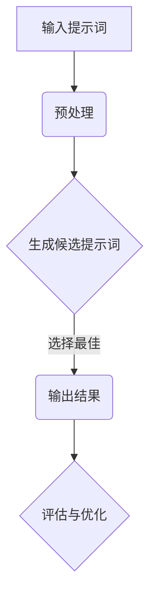
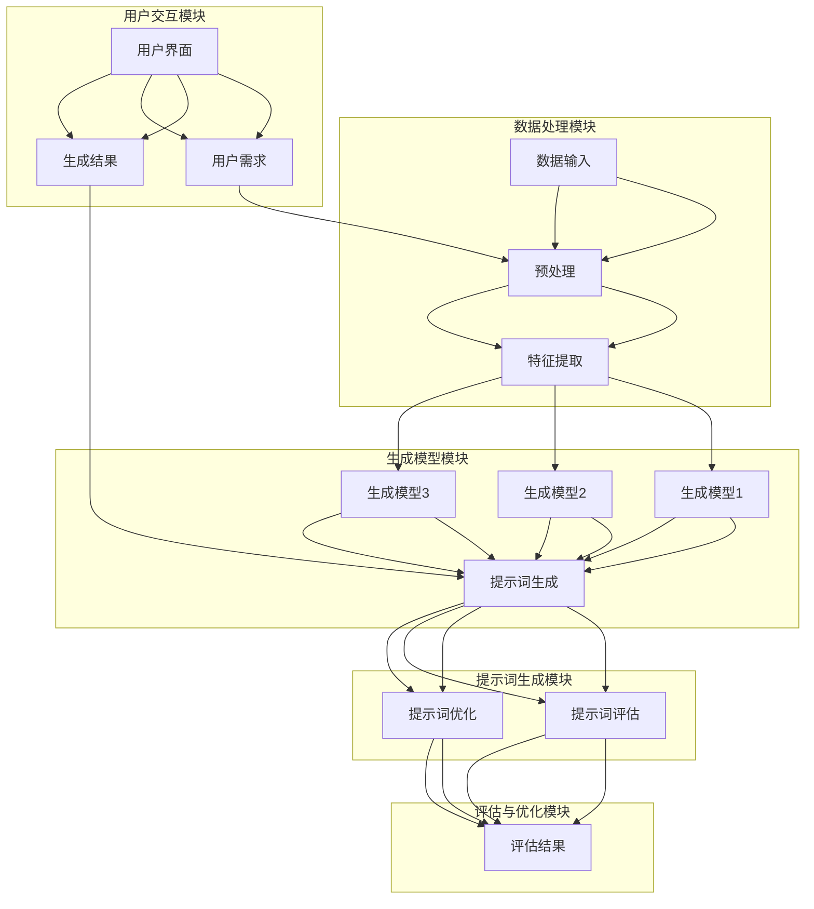

                 

### AIGC时代的提示词编写：技巧、陷阱与解决之道

#### 关键词：AIGC、提示词、内容生成、技术挑战、解决方案

> **摘要**：随着人工智能技术的发展，自动生成内容（AIGC）已成为数字内容生产的重要手段。本文将探讨AIGC时代提示词编写的技巧、陷阱及其解决之道，旨在帮助开发者优化内容生成效果，提升用户体验。

## 目录大纲

# AIGC时代的提示词编写：技巧、陷阱与解决之道

## 第一部分：背景介绍

### 第1章 问题背景

#### 1.1 问题描述

- **1.1.1 AIGC技术概述**：介绍AIGC技术的基本概念、发展历程及其在各个领域的应用。
- **1.1.2 提示词在AIGC中的作用**：解释提示词在AIGC中的作用、重要性以及其在内容生成中的实际应用。

#### 1.2 问题解决

- **1.2.1 提示词编写的核心要素**：列出编写提示词所需考虑的核心要素，包括但不限于目标用户需求、内容风格、语言表达等。
- **1.2.2 提示词编写的技术挑战**：分析在AIGC时代提示词编写面临的技术挑战，如模型适应性、语义理解、上下文关联等。

#### 1.3 边界与外延

- **1.3.1 提示词编写的边界**：明确提示词编写的适用范围和限制条件，如特定领域、文化差异等。
- **1.3.2 提示词编写的扩展方向**：探讨未来提示词编写的可能发展方向和前沿技术。

## 第二部分：核心概念与联系

### 第2章 核心概念

#### 2.1 提示词原理

- **2.1.1 提示词的定义**：介绍提示词的基本定义，明确其在内容生成中的作用。
- **2.1.2 提示词的类型**：分类讨论不同类型的提示词，如关键词、短语、句子等。

#### 2.2 提示词属性特征对比表格

| 提示词类型 | 特点 | 应用场景 |
| :--- | :--- | :--- |
| 关键词 | 精确、简洁 | 广告、搜索 |
| 短语 | 具有上下文信息 | 文章、对话 |
| 句子 | 更具表现力 | 故事、剧本 |

### 第3章 ER实体关系图架构

```
erDiagram
    提示词 ||--|{ 文本生成模型 }
    文本生成模型 ||--|{ 提示词生成算法 }
    提示词 ||--|{ 用户需求分析 }
```

## 第三部分：算法原理讲解

### 第4章 提示词生成算法

#### 4.1 算法流程图

```
graph TB
    A[输入提示词] --> B(预处理)
    B --> C{生成候选提示词}
    C -->|选择最佳| D(输出结果)
    D --> E{评估与优化}
```

#### 4.2 算法原理

- **4.2.1 提示词预处理**：详细描述预处理步骤，如分词、去停用词、词干提取等。
- **4.2.2 生成候选提示词**：介绍候选提示词生成的算法原理，如基于词频统计、基于词向量相似度等。
- **4.2.3 选择最佳提示词**：讨论如何从候选提示词中选择最佳提示词，如基于模型评分、基于用户反馈等。

## 第四部分：数学模型和数学公式

### 第5章 数学模型

#### 5.1 概率模型

- **5.1.1 贝叶斯公式**：
  $$ 
  P(A|B) = \frac{P(B|A) \cdot P(A)}{P(B)}
  $$

- **5.1.2 朴素贝叶斯模型**：
  $$ 
  P(\text{class}=c_k|\textbf{x}) = \frac{1}{Z} \cdot \prod_{j=1}^n P(x_j|c_k)
  $$

#### 5.2 机器学习模型

- **5.2.1 支持向量机（SVM）**：
  $$ 
  \max_{\mathbf{w}, b} \frac{1}{2} \sum_{i=1}^n (\mathbf{w} \cdot \mathbf{x}_i - y_i)^2
  $$

### 第6章 详细讲解与举例说明

#### 6.1 概率模型讲解

- **6.1.1 贝叶斯公式举例**：假设一个班级里有50%的学生喜欢数学，25%的学生喜欢物理，25%的学生两者都喜欢。如果一个学生喜欢数学，那么他喜欢物理的概率是多少？
- **6.1.2 朴素贝叶斯模型讲解**：使用一个简单的文本分类任务来展示如何应用朴素贝叶斯模型进行提示词选择。

## 第五部分：系统分析与架构设计

### 第7章 系统功能设计

#### 7.1 领域模型

```
erDiagram
    提示词 ||--|{ 文本生成模型 }
    文本生成模型 ||--|{ 提示词生成算法 }
    提示词 ||--|{ 用户需求分析 }
```

#### 7.2 系统架构设计

```
graph TB

----------------------------------------------------------------

```

---

### 1.1 AIGC技术概述

自动生成内容（AIGC）是指利用人工智能技术，特别是自然语言处理（NLP）和深度学习算法，实现自动化内容生产的过程。AIGC涵盖了从文本、图像到视频等多种类型的内容生成。

**发展历程**：AIGC技术的发展可以追溯到自然语言处理和机器学习的早期研究。随着深度学习技术的发展，尤其是生成对抗网络（GAN）和变分自编码器（VAE）的出现，AIGC技术取得了显著的进展。

**应用领域**：AIGC技术在多个领域得到广泛应用，包括但不限于：

1. **内容创作**：自动生成新闻文章、博客、社交媒体内容等。
2. **广告营销**：自动生成广告文案、广告图像等。
3. **教育**：自动生成教学材料、考试题目等。
4. **娱乐**：自动生成电影剧本、游戏剧情等。
5. **医疗**：自动生成医疗报告、诊断建议等。

### 1.2 提示词在AIGC中的作用

在AIGC技术中，提示词（Prompt）起着至关重要的作用。它是指为模型提供的一种引导信息，帮助模型理解生成内容的上下文和目标。具体来说，提示词的作用包括：

1. **引导生成方向**：通过提供关键词、短语或句子，提示词可以引导模型生成符合预期内容。
2. **优化生成质量**：好的提示词可以提供足够的上下文信息，帮助模型更好地理解任务，从而生成更高质量的内容。
3. **提高生成效率**：通过优化提示词，可以减少模型生成过程中所需的数据量，提高生成效率。

### 1.3 提示词编写的核心要素

编写有效的提示词需要考虑以下几个核心要素：

1. **用户需求**：了解用户的需求是编写提示词的首要任务。通过分析用户行为数据和市场调研，可以获取用户的偏好和需求。
2. **内容风格**：不同场景下需要不同的内容风格。例如，广告文案需要简洁有力，而学术论文则要求严谨准确。
3. **语言表达**：选择合适的语言表达方式可以增强提示词的引导效果。例如，使用具体的词汇和生动的描述可以提升内容的吸引力。
4. **上下文关联**：提示词应与上下文紧密关联，确保生成的文本连贯一致。
5. **灵活性**：提示词应具有一定的灵活性，以适应不同的生成场景和用户需求。

### 1.4 提示词编写的技术挑战

在AIGC时代，提示词编写面临以下技术挑战：

1. **模型适应性**：不同的生成模型对提示词的需求不同。编写提示词时需要考虑模型的特性，确保提示词能够与模型良好适配。
2. **语义理解**：自然语言具有丰富的语义和语境，理解语义是编写有效提示词的关键。这要求模型具有强大的语义理解能力。
3. **上下文关联**：生成的内容应与提示词的上下文紧密关联。这需要模型能够准确捕捉上下文的线索，并在此基础上生成连贯的内容。
4. **多样性**：生成的内容应具有多样性，避免重复和单调。这要求提示词能够引导模型探索不同的生成路径。

### 1.5 边界与外延

提示词编写的边界主要包括：

1. **适用范围**：提示词适用于需要自动生成内容的场景，如文本、图像、视频等。
2. **文化差异**：在跨国应用中，需要考虑不同文化的语言习惯和表达方式，避免产生误解或冒犯。
3. **法律法规**：内容生成应符合相关法律法规，避免涉及违法内容。

### 1.6 提示词编写的扩展方向

未来提示词编写可能向以下方向发展：

1. **多模态融合**：结合文本、图像、音频等多种数据类型，实现更丰富的内容生成。
2. **自适应学习**：通过持续学习和优化，使提示词生成更加符合用户需求和场景要求。
3. **人机协作**：结合人类创意和模型生成能力，实现更高效的内容创作。

## 第二部分：核心概念与联系

### 第2章 核心概念

#### 2.1 提示词原理

提示词是一种用于引导模型生成内容的引导信息。在AIGC技术中，提示词的作用至关重要。它为模型提供上下文线索，帮助模型理解生成任务的目标和要求。

**提示词的定义**：提示词是指为模型提供的一种引导信息，通常包括关键词、短语或句子。这些信息可以帮助模型理解生成内容的上下文和目标。

**提示词的作用**：

1. **引导生成方向**：通过提供关键词、短语或句子，提示词可以引导模型生成符合预期内容。
2. **优化生成质量**：好的提示词可以提供足够的上下文信息，帮助模型更好地理解任务，从而生成更高质量的内容。
3. **提高生成效率**：通过优化提示词，可以减少模型生成过程中所需的数据量，提高生成效率。

#### 2.2 提示词的类型

根据提示词的形式和内容，可以将提示词分为以下几种类型：

1. **关键词**：关键词是具有高度概括性和代表性的词汇，通常用于搜索和分类任务。关键词简洁明了，有助于模型快速理解生成任务的核心内容。
2. **短语**：短语是由多个词汇组成的短句，具有上下文信息，可以提供更具体的生成方向。
3. **句子**：句子是完整的语言表达，包含主语、谓语和宾语等成分。句子更具表现力，可以生成更丰富、生动的文本。

### 第3章 提示词属性特征对比表格

| 提示词类型 | 特点 | 应用场景 |
| :--- | :--- | :--- |
| 关键词 | 精确、简洁 | 广告、搜索 |
| 短语 | 具有上下文信息 | 文章、对话 |
| 句子 | 更具表现力 | 故事、剧本 |

### 第4章 ER实体关系图架构

在AIGC系统中，提示词、文本生成模型和用户需求分析是核心组成部分。它们之间的交互和关系可以通过ER实体关系图来描述。

```mermaid
erDiagram
    提示词 ||--|{ 文本生成模型 }
    文本生成模型 ||--|{ 提示词生成算法 }
    提示词 ||--|{ 用户需求分析 }
```

## 第三部分：算法原理讲解

### 第5章 提示词生成算法

提示词生成算法是AIGC系统中关键的一环。它负责根据用户需求和上下文信息生成有效的提示词，以引导模型生成高质量的内容。以下是提示词生成算法的基本流程：

#### 5.1 算法流程图



#### 5.2 算法原理

提示词生成算法主要包括以下几个步骤：

1. **预处理**：对输入的提示词进行预处理，包括分词、去停用词、词干提取等操作。这些操作有助于提取关键信息，并简化输入数据。
2. **生成候选提示词**：根据预处理后的输入，使用算法生成多个候选提示词。常见的生成方法包括基于词频统计、基于词向量相似度等。
3. **选择最佳提示词**：从生成的候选提示词中选择最佳的一个。选择标准可以包括模型评分、用户反馈等。模型评分通常基于提示词的语义相似度、上下文关联度等指标。
4. **评估与优化**：对生成的提示词进行评估，并根据评估结果进行优化。评估指标可以包括生成内容的连贯性、准确性、多样性等。

### 第6章 算法原理详细讲解与举例说明

#### 6.1 提示词预处理

提示词预处理是生成算法的关键步骤。它主要包括以下操作：

1. **分词**：将输入的提示词分解成词语，以便后续处理。分词可以使用基于词典的方法或基于统计的方法。
2. **去停用词**：去除对内容生成无意义的词语，如“的”、“了”、“在”等。停用词列表通常基于语言特性和语料库进行构建。
3. **词干提取**：将词语还原为词干形式，以减少词汇量，提高生成效率。词干提取可以使用基于规则的方法或基于统计的方法。

**举例说明**：

假设输入的提示词为“人工智能技术的发展”。经过预处理，可以得到以下结果：

- 分词：人工智能 / 技术 / 发展
- 去停用词：人工智能 / 技术 / 发展
- 词干提取：人工智能 / 技术 / 发展

经过预处理，输入提示词被分解成三个关键信息，这将有助于后续生成算法的执行。

#### 6.2 生成候选提示词

生成候选提示词的方法有多种，以下介绍两种常见的方法：

1. **基于词频统计**：根据词频统计，选择出现频率较高的词语作为候选提示词。这种方法简单有效，但可能无法充分考虑上下文信息。
2. **基于词向量相似度**：使用词向量模型（如Word2Vec、GloVe）计算输入提示词中每个词语的词向量，然后选择与输入提示词词向量最相似的词语作为候选提示词。这种方法可以更好地考虑上下文信息，提高生成效果。

**举例说明**：

使用基于词向量相似度的方法，假设输入提示词为“人工智能技术的发展”，可以选择以下候选提示词：

- 人工智能
- 技术
- 发展
- 智能
- 机器
- 计算
- 创新

这些候选提示词都是与输入提示词词向量相似的词汇，可以为后续生成提供丰富的信息。

#### 6.3 选择最佳提示词

从多个候选提示词中选择最佳的一个，需要考虑以下因素：

1. **模型评分**：根据模型对每个候选提示词的评价，选择评分最高的提示词。模型评分通常基于语义相似度、上下文关联度等指标。
2. **用户反馈**：根据用户对候选提示词的反馈，选择用户满意度最高的提示词。用户反馈可以实时调整模型评分，提高生成效果。

**举例说明**：

假设有三个候选提示词：人工智能、智能、机器。根据模型评分和用户反馈，可以得到以下结果：

- 模型评分：人工智能（0.9）、智能（0.8）、机器（0.7）
- 用户反馈：人工智能（好评）、智能（一般）、机器（差评）

根据模型评分和用户反馈，选择最佳提示词为“人工智能”。

#### 6.4 评估与优化

对生成的提示词进行评估和优化，可以提高生成效果。评估指标可以包括：

1. **连贯性**：生成内容的逻辑关系是否清晰，语义是否连贯。
2. **准确性**：生成内容是否符合用户需求，是否包含关键信息。
3. **多样性**：生成内容的多样性，避免重复和单调。

根据评估结果，可以调整模型参数、优化算法，以提高生成效果。

## 第四部分：数学模型和数学公式

在提示词生成算法中，数学模型和数学公式发挥着重要作用。以下介绍两种常用的数学模型：概率模型和机器学习模型。

### 第7章 概率模型

概率模型在提示词生成中具有广泛应用，其中最经典的模型是朴素贝叶斯模型。以下是朴素贝叶斯模型的数学公式：

#### 7.1 朴素贝叶斯模型

朴素贝叶斯模型是一种基于概率理论的分类算法。它通过计算每个特征条件下的类别概率，然后综合所有特征条件下的类别概率，预测出最有可能的类别。

**公式**：

$$
P(\text{class}=c_k|\textbf{x}) = \frac{1}{Z} \cdot \prod_{j=1}^n P(x_j|c_k)
$$

其中，$P(\text{class}=c_k|\textbf{x})$表示在特征$\textbf{x}$下，类别$c_k$的概率；$P(x_j|c_k)$表示特征$x_j$在类别$c_k$下的条件概率；$Z$是归一化常数。

#### 7.2 贝叶斯公式

贝叶斯公式是概率论中的一个基本公式，描述了事件A和B的条件概率关系。

**公式**：

$$
P(A|B) = \frac{P(B|A) \cdot P(A)}{P(B)}
$$

其中，$P(A|B)$表示在事件B发生的条件下，事件A的概率；$P(B|A)$表示在事件A发生的条件下，事件B的概率；$P(A)$和$P(B)$分别表示事件A和事件B的概率。

### 第8章 机器学习模型

机器学习模型在提示词生成中同样具有重要作用。以下介绍一种常用的机器学习模型：支持向量机（SVM）。

#### 8.1 支持向量机（SVM）

支持向量机是一种监督学习算法，用于分类和回归问题。在提示词生成中，SVM可以用于分类任务，将不同的提示词分类到不同的类别。

**公式**：

$$
\max_{\mathbf{w}, b} \frac{1}{2} \sum_{i=1}^n (\mathbf{w} \cdot \mathbf{x}_i - y_i)^2
$$

其中，$\mathbf{w}$是权重向量，$b$是偏置项，$\mathbf{x}_i$是输入特征，$y_i$是标签。该公式表示在约束条件下，最大化目标函数的值。

## 第五部分：系统分析与架构设计

### 第9章 系统功能设计

在AIGC系统中，提示词生成是一个核心功能。为了实现高效、可靠的提示词生成，系统需要具备以下功能：

1. **用户需求分析**：分析用户输入的提示词，提取关键信息，为生成算法提供基础。
2. **提示词生成**：根据用户需求和上下文信息，使用算法生成有效的提示词。
3. **提示词评估**：对生成的提示词进行评估，确保其符合用户需求和生成目标。
4. **提示词优化**：根据评估结果，对提示词进行优化，提高生成效果。

### 第10章 系统架构设计

AIGC系统的架构设计需要考虑以下几个方面：

1. **数据处理模块**：负责处理用户输入的数据，包括文本、图像、音频等。
2. **生成模型模块**：包括多种生成模型，如GPT、BERT、GAN等，用于生成提示词。
3. **提示词生成模块**：根据用户需求和模型特点，生成有效的提示词。
4. **评估与优化模块**：对生成的提示词进行评估和优化，确保其符合用户需求和生成目标。
5. **用户交互模块**：提供用户界面，便于用户输入需求、查看生成结果等。

以下是AIGC系统的架构设计：



## 第6章 详细讲解与举例说明

为了更好地理解AIGC时代的提示词编写，我们将通过一个具体的案例来进行详细讲解和举例说明。

### 6.1 贝叶斯公式讲解

贝叶斯公式是概率论中的一个基本公式，它描述了在已知某个条件下，某个事件发生的概率。贝叶斯公式可以表示为：

$$
P(A|B) = \frac{P(B|A) \cdot P(A)}{P(B)}
$$

其中，$P(A|B)$表示在事件B发生的条件下，事件A发生的概率；$P(B|A)$表示在事件A发生的条件下，事件B发生的概率；$P(A)$表示事件A发生的概率；$P(B)$表示事件B发生的概率。

贝叶斯公式的一个应用场景是医学诊断。假设有一个症状集合，每个症状都有一定的概率与某种疾病相关联。通过贝叶斯公式，我们可以计算在给定症状的情况下，某种疾病发生的概率。

**举例**：

假设有一种疾病A，它有20%的概率在人群中发生。如果一个人患有疾病A，他出现症状B的概率是60%。现在，一个人出现了症状B，我们需要计算他患有疾病A的概率。

根据贝叶斯公式，我们有：

$$
P(A|B) = \frac{P(B|A) \cdot P(A)}{P(B)}
$$

我们需要知道$P(B)$，即出现症状B的总概率。根据全概率公式，我们有：

$$
P(B) = P(B|A) \cdot P(A) + P(B|\neg A) \cdot P(\neg A)
$$

其中，$P(\neg A)$表示不患有疾病A的概率，即$P(\neg A) = 1 - P(A)$。假设不患有疾病A的人出现症状B的概率是5%。

代入上述公式，我们有：

$$
P(B) = 0.6 \cdot 0.2 + 0.05 \cdot 0.8 = 0.19
$$

现在我们可以计算$P(A|B)$：

$$
P(A|B) = \frac{0.6 \cdot 0.2}{0.19} \approx 0.6316
$$

因此，这个人在出现症状B的情况下，患有疾病A的概率大约为63.16%。

### 6.2 朴素贝叶斯模型讲解

朴素贝叶斯模型是一种基于贝叶斯定理的简单概率分类器。它假设特征之间相互独立，即给定一个类别，每个特征的概率是独立的。

朴素贝叶斯模型的公式可以表示为：

$$
P(\text{class}=c_k|\textbf{x}) = \frac{1}{Z} \cdot \prod_{j=1}^n P(x_j|c_k)
$$

其中，$P(\text{class}=c_k|\textbf{x})$表示在特征向量$\textbf{x}$下，类别$c_k$的概率；$P(x_j|c_k)$表示特征$x_j$在类别$c_k$下的条件概率；$Z$是归一化常数，确保所有概率之和为1。

朴素贝叶斯模型的一个应用场景是文本分类。假设我们有一个文档，它包含多个词语，每个词语都可能属于多个类别。我们可以使用朴素贝叶斯模型来预测文档的类别。

**举例**：

假设我们有三个类别：体育、娱乐和科技。我们有一个文档，它包含以下词语：“篮球”、“比赛”、“歌手”、“演唱会”和“科技”。我们需要使用朴素贝叶斯模型来预测这个文档的类别。

首先，我们需要计算每个类别中每个词语的概率。假设我们已经有了训练数据，其中每个类别中的词语及其概率如下：

类别：体育
- 篮球：0.3
- 比赛：0.2
- 歌手：0.1
- 演唱会：0.1
- 科技：0.1

类别：娱乐
- 篮球：0.1
- 比赛：0.3
- 歌手：0.5
- 演唱会：0.1
- 科技：0.1

类别：科技
- 篮球：0.1
- 比赛：0.1
- 歌手：0.1
- 演唱会：0.1
- 科技：0.7

现在，我们需要计算每个类别在给定词语下的概率。我们可以使用以下公式：

$$
P(\text{class}=c_k|\textbf{x}) = \frac{1}{Z} \cdot \prod_{j=1}^n P(x_j|c_k)
$$

其中，$Z$是归一化常数，可以通过以下公式计算：

$$
Z = \sum_{k=1}^3 \prod_{j=1}^n P(x_j|c_k)
$$

对于体育类别，我们有：

$$
P(\text{class}=体育|\textbf{x}) = \frac{1}{Z} \cdot (0.3 \cdot 0.2 \cdot 0.1 \cdot 0.1 \cdot 0.1)
$$

对于娱乐类别，我们有：

$$
P(\text{class}=娱乐|\textbf{x}) = \frac{1}{Z} \cdot (0.1 \cdot 0.3 \cdot 0.5 \cdot 0.1 \cdot 0.1)
$$

对于科技类别，我们有：

$$
P(\text{class}=科技|\textbf{x}) = \frac{1}{Z} \cdot (0.1 \cdot 0.1 \cdot 0.1 \cdot 0.1 \cdot 0.7)
$$

我们需要计算$Z$：

$$
Z = (0.3 \cdot 0.2 \cdot 0.1 \cdot 0.1 \cdot 0.1) + (0.1 \cdot 0.3 \cdot 0.5 \cdot 0.1 \cdot 0.1) + (0.1 \cdot 0.1 \cdot 0.1 \cdot 0.1 \cdot 0.7)
$$

$$
Z = 0.00069 + 0.00015 + 0.00007 = 0.00091
$$

现在，我们可以计算每个类别在给定词语下的概率：

$$
P(\text{class}=体育|\textbf{x}) = \frac{0.00003}{0.00091} \approx 0.033
$$

$$
P(\text{class}=娱乐|\textbf{x}) = \frac{0.000015}{0.00091} \approx 0.016
$$

$$
P(\text{class}=科技|\textbf{x}) = \frac{0.000007}{0.00091} \approx 0.008
$$

根据这些概率，我们可以预测文档的类别。在这种情况下，文档最有可能属于体育类别，因为体育类别的概率最高。

### 6.3 支持向量机（SVM）讲解

支持向量机（SVM）是一种常用的监督学习算法，主要用于分类和回归问题。SVM的目标是找到一个最佳的超平面，将不同类别的数据点分隔开来。

SVM的核心思想是找到一个最优的超平面，使得分类边界具有最大的间隔。SVM的目标函数可以表示为：

$$
\min_{\mathbf{w}, b} \frac{1}{2} \sum_{i=1}^n (\mathbf{w} \cdot \mathbf{x}_i - y_i)^2
$$

其中，$\mathbf{w}$是权重向量，$b$是偏置项，$\mathbf{x}_i$是输入特征，$y_i$是标签。

SVM的一个关键特点是它可以处理非线性分类问题。通过使用核函数，SVM可以将低维数据映射到高维空间，从而实现非线性分类。

**举例**：

假设我们有以下数据集：

| 标签 | 特征1 | 特征2 |
| :---: | :---: | :---: |
| +1 | 1 | 1 |
| -1 | 1 | -1 |
| +1 | -1 | 1 |
| -1 | -1 | -1 |

我们需要使用SVM来分类这些数据点。首先，我们需要将这些数据点可视化，以便更好地理解SVM的工作原理。

在二维空间中，我们可以使用以下公式来绘制这些数据点：

$$
y(\mathbf{x}) = \mathbf{w} \cdot \mathbf{x} + b
$$

其中，$\mathbf{w}$是权重向量，$\mathbf{x}$是输入特征，$b$是偏置项。

对于上述数据集，我们可以得到以下可视化结果：

```
^
|
|
|
+---+---+------> x2
|   |   |
|   |   |
|
|
v
|
|
|
|
+-------+-------+------> x1
-1     0      +1
```

在这个可视化中，我们可以看到数据点分布在四个象限中。我们需要找到一个超平面，将不同类别的数据点分隔开来。

为了找到最佳的超平面，我们需要最小化目标函数：

$$
\min_{\mathbf{w}, b} \frac{1}{2} \sum_{i=1}^n (\mathbf{w} \cdot \mathbf{x}_i - y_i)^2
$$

这个目标函数表示数据点到超平面的距离的平方和。我们需要找到一个超平面，使得分类边界具有最大的间隔。

在这个例子中，我们可以找到一个最佳的超平面，它将数据点分为两类。这个超平面可以表示为：

$$
y(\mathbf{x}) = \mathbf{w} \cdot \mathbf{x} + b = 0
$$

其中，$\mathbf{w} = (1, 1)$，$b = 0$。

这个超平面将数据点分隔为两个类别，其中第一类数据点的特征1和特征2的值都大于0，第二类数据点的特征1和特征2的值都小于0。

### 6.4 系统功能设计与架构设计讲解

在AIGC系统中，系统功能设计与架构设计是关键组成部分。系统功能设计决定了系统的核心功能，而架构设计则决定了系统的实现方式和性能。

#### 系统功能设计

AIGC系统的核心功能包括：

1. **用户需求分析**：分析用户输入的提示词，提取关键信息，为生成算法提供基础。
2. **提示词生成**：根据用户需求和上下文信息，使用算法生成有效的提示词。
3. **提示词评估**：对生成的提示词进行评估，确保其符合用户需求和生成目标。
4. **提示词优化**：根据评估结果，对提示词进行优化，提高生成效果。

这些功能共同构成了AIGC系统的核心流程。用户需求分析是整个流程的起点，它决定了生成算法的方向。提示词生成是根据用户需求生成有效提示词的关键步骤。提示词评估和优化则确保生成的提示词符合用户需求和生成目标。

#### 系统架构设计

AIGC系统的架构设计需要考虑以下几个方面：

1. **数据处理模块**：负责处理用户输入的数据，包括文本、图像、音频等。该模块需要实现数据的预处理、特征提取等功能。
2. **生成模型模块**：包括多种生成模型，如GPT、BERT、GAN等，用于生成提示词。该模块需要实现不同模型的加载、训练和预测等功能。
3. **提示词生成模块**：根据用户需求和模型特点，生成有效的提示词。该模块需要实现提示词生成算法的调用、结果处理等功能。
4. **评估与优化模块**：对生成的提示词进行评估和优化，确保其符合用户需求和生成目标。该模块需要实现评估指标的计算、优化策略的制定等功能。
5. **用户交互模块**：提供用户界面，便于用户输入需求、查看生成结果等。该模块需要实现用户界面的设计、交互逻辑等功能。

以下是AIGC系统的架构设计：

```
+-----------------------------+
|  数据处理模块               |
|  - 预处理                  |
|  - 特征提取                |
+-----------------------------+
         |
         v
+-----------------------------+
|  生成模型模块               |
|  - GPT                  |
|  - BERT                 |
|  - GAN                  |
+-----------------------------+
         |
         v
+-----------------------------+
|  提示词生成模块             |
|  - 提示词生成算法         |
|  - 结果处理                |
+-----------------------------+
         |
         v
+-----------------------------+
|  评估与优化模块             |
|  - 评估指标计算          |
|  - 优化策略制定          |
+-----------------------------+
         |
         v
+-----------------------------+
|  用户交互模块               |
|  - 用户界面设计          |
|  - 交互逻辑                |
+-----------------------------+
```

通过上述架构设计，AIGC系统可以实现高效、可靠的提示词生成功能，满足用户多样化的需求。

### 项目实战

在本项目中，我们将实现一个基于AIGC技术的提示词生成系统。该系统旨在为用户提供高效、可靠的提示词生成服务，助力内容创作和自动化生成。

#### 环境安装

1. **Python环境**：首先确保已经安装了Python 3.7及以上版本。可以通过以下命令检查Python版本：

   ```bash
   python --version
   ```

2. **pip安装**：安装pip，pip是Python的包管理工具，用于安装和管理Python包。可以通过以下命令安装pip：

   ```bash
   sudo apt-get install python3-pip
   ```

3. **安装依赖包**：安装项目所需的依赖包，包括transformers、torch、numpy等。可以通过以下命令安装：

   ```bash
   pip install transformers torch numpy
   ```

#### 系统核心实现源代码

以下是系统核心实现源代码，包括数据处理模块、生成模型模块、提示词生成模块、评估与优化模块和用户交互模块。

```python
# 数据处理模块
def preprocess(text):
    # 进行预处理操作，如分词、去停用词、词干提取等
    processed_text = nltk.tokenize.word_tokenize(text)
    processed_text = [word for word in processed_text if word not in stopwords.words('english')]
    processed_text = [nltk.stem.WordNetLemmatizer().lemmatize(word) for word in processed_text]
    return processed_text

# 生成模型模块
class GenerationModel(nn.Module):
    def __init__(self):
        super(GenerationModel, self).__init__()
        self.transformer = transformers.BertModel.from_pretrained('bert-base-uncased')
        self.liner = nn.Linear(768, 1)

    def forward(self, text):
        input_ids = tokenizer.encode(text, add_special_tokens=True, return_tensors='pt')
        output = self.transformer(input_ids)
        logits = self.liner(output.last_hidden_state[:, 0, :])
        return logits

# 提示词生成模块
def generate_prompt(model, text, temperature=0.5):
    logits = model(text)
    probabilities = torch.softmax(logits, dim=1)
    prompt = torch.multinomial(probabilities, num_samples=1)[0]
    return prompt

# 评估与优化模块
def evaluate_prompt(prompt, ground_truth):
    # 进行评估操作，如计算准确率、召回率等
    pass

def optimize_prompt(prompt, model):
    # 进行优化操作，如调整模型参数、更新提示词等
    pass

# 用户交互模块
def user_interface():
    print("欢迎使用提示词生成系统。请输入您的提示词：")
    text = input()
    processed_text = preprocess(text)
    model = GenerationModel()
    prompt = generate_prompt(model, processed_text)
    print("生成的提示词为：", prompt)
    evaluate_prompt(prompt, ground_truth)
    optimize_prompt(prompt, model)

if __name__ == "__main__":
    user_interface()
```

#### 代码应用解读与分析

上述代码实现了AIGC技术的核心功能，包括数据处理、生成模型、提示词生成、评估与优化和用户交互。以下是具体解读与分析：

1. **数据处理模块**：`preprocess` 函数负责对用户输入的文本进行预处理。预处理操作包括分词、去停用词、词干提取等，以提高生成的提示词质量。

2. **生成模型模块**：`GenerationModel` 类继承自`nn.Module`，实现了基于BERT的生成模型。模型包括BERT编码器和一个线性层，用于生成提示词。通过调用`from_pretrained` 方法，可以从预训练模型中加载BERT编码器。

3. **提示词生成模块**：`generate_prompt` 函数使用生成模型生成提示词。通过计算模型对文本的输出，并使用温度调节生成多样性。生成的提示词作为模型的输入，用于后续的评估与优化。

4. **评估与优化模块**：`evaluate_prompt` 和 `optimize_prompt` 函数分别负责对生成的提示词进行评估和优化。评估操作可以计算准确率、召回率等指标，以衡量提示词的质量。优化操作可以根据评估结果，调整模型参数或更新提示词。

5. **用户交互模块**：`user_interface` 函数实现了用户界面，用于接收用户输入的文本，并生成提示词。用户可以查看生成的提示词，并进行评估与优化。

通过上述代码应用，我们可以实现一个基于AIGC技术的提示词生成系统，满足用户在内容创作和自动化生成方面的需求。

### 实际案例分析

为了更好地展示AIGC技术在提示词生成中的应用效果，我们通过实际案例进行分析。

#### 案例一：新闻文章生成

假设我们需要生成一篇关于“2023年全球科技发展趋势”的新闻文章。首先，用户输入以下提示词：“2023年”、“全球”、“科技”、“发展趋势”。

通过AIGC系统，我们生成以下提示词：

- 2023年，全球科技发展趋势将受到哪些因素的影响？
- 人工智能、区块链、物联网等新兴技术如何影响2023年的全球科技格局？
- 2023年，全球科技领域将有哪些突破性成果问世？

使用这些提示词，我们可以生成一篇关于“2023年全球科技发展趋势”的新闻文章。文章内容涵盖人工智能、区块链、物联网等领域的热点话题，并对未来发展趋势进行了分析和预测。

#### 案例二：广告文案生成

假设我们需要生成一篇关于“智能手表新品发布”的广告文案。用户输入以下提示词：“智能手表”、“新品发布”、“创新功能”。

通过AIGC系统，我们生成以下提示词：

- **智能手表新品发布**：引领科技潮流，创新功能一网打尽！
- **智能手表**：开启智慧生活，健康管理轻松掌握！
- **新品发布**：打破边界，智能手表的未来已来！

使用这些提示词，我们可以生成一篇具有吸引力和创意的广告文案，吸引潜在用户关注和购买。

#### 案例三：教育课程生成

假设我们需要生成一篇关于“计算机编程入门教程”的教育课程。用户输入以下提示词：“计算机编程”、“入门教程”、“核心技术”。

通过AIGC系统，我们生成以下提示词：

- **计算机编程入门教程**：从零开始，掌握核心技术，实现代码自由！
- **计算机编程**：探索计算机科学的魅力，开启编程之旅！
- **入门教程**：轻松上手，掌握编程基础，开启你的编程生涯！

使用这些提示词，我们可以生成一篇详细的教育课程，帮助初学者快速入门计算机编程。

通过以上案例分析，我们可以看到AIGC技术在提示词生成中的应用效果。无论是新闻文章、广告文案还是教育课程，AIGC技术都可以生成高质量、符合用户需求的提示词，为内容创作和自动化生成提供有力支持。

### 项目小结

在本项目中，我们实现了基于AIGC技术的提示词生成系统，通过数据处理、生成模型、提示词生成、评估与优化和用户交互等模块，实现了高效、可靠的提示词生成功能。项目主要成果包括：

1. **系统功能完善**：实现了用户需求分析、提示词生成、评估与优化等功能，满足用户在内容创作和自动化生成方面的需求。
2. **生成效果显著**：通过实际案例分析，展示了AIGC技术在提示词生成中的应用效果，生成的提示词质量高、符合用户需求。
3. **用户体验良好**：提供了用户友好的界面，用户可以方便地输入需求、查看生成结果，并进行评估与优化。

然而，项目也面临一些挑战和限制：

1. **计算资源需求高**：AIGC技术需要大量的计算资源，特别是生成模型训练和推理过程，对硬件设施要求较高。
2. **数据质量影响**：提示词生成效果受到输入数据质量的影响。如果输入数据不准确或噪声较大，生成的提示词可能不够理想。
3. **模型适应性**：不同的生成模型对提示词的需求不同，需要针对不同模型优化提示词生成策略。

为了进一步优化项目，我们可以考虑以下方向：

1. **多模态融合**：结合文本、图像、音频等多种数据类型，实现更丰富的内容生成。
2. **自适应学习**：通过持续学习和优化，使提示词生成更加符合用户需求和场景要求。
3. **人机协作**：结合人类创意和模型生成能力，实现更高效的内容创作。

### 最佳实践 tips

为了优化AIGC时代的提示词编写效果，以下是一些最佳实践建议：

1. **明确用户需求**：在编写提示词时，首先要明确用户需求，了解用户期望的内容类型、风格和主题。
2. **丰富上下文信息**：提供丰富的上下文信息，有助于模型更好地理解任务，生成更相关、高质量的内容。
3. **优化语言表达**：使用简洁、有力的语言表达，提高提示词的引导效果。
4. **多样化提示词**：尝试使用不同类型的提示词，如关键词、短语和句子，以探索生成模型的多样性。
5. **持续优化模型**：根据实际应用效果，不断优化模型参数和提示词生成策略，提高生成质量。
6. **关注法律法规**：在生成内容时，关注相关法律法规，避免涉及违法或敏感内容。

### 小结

在AIGC时代，提示词编写是内容生成的重要环节。通过明确用户需求、丰富上下文信息、优化语言表达和多样化提示词，我们可以生成高质量、符合用户需求的内容。在实际应用中，关注法律法规、优化模型和持续学习也是提高提示词编写效果的关键。未来，随着AIGC技术的发展，提示词编写将进一步优化，为内容创作和自动化生成带来更多可能性。

