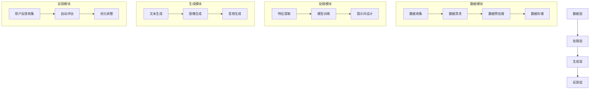

                 

### 第一部分：引言

#### 1.1 问题背景

**1.1.1 AIGC的发展与挑战**

随着人工智能技术的迅猛发展，AIGC（AI-Generated Content）作为一种新兴的内容生成技术，已经逐渐成为人工智能领域的重要分支。AIGC不仅涵盖了文本、图像、音频等多种形式的内容生成，还能够根据用户的需求和输入，生成具有高度个性化、多样化和创新性的内容。

然而，AIGC的发展也面临着诸多挑战。首先，如何设计出能够准确捕捉用户意图、高效生成高质量内容的提示词（Prompts）成为了一个关键问题。其次，随着生成内容的复杂度和多样性增加，对数据处理、模型选择和调优等方面的要求也日益提高。此外，如何确保生成的内容符合伦理规范和法律法规，避免出现误导性、不适当或有害的内容，也是一个亟待解决的问题。

**1.1.2 提示词设计的重要性**

提示词设计在AIGC中起着至关重要的作用。优秀的提示词不仅可以引导模型生成出符合用户需求的高质量内容，还能够提高模型的训练效率和效果。一个高效的提示词设计需要充分考虑用户的意图、场景的需求以及数据的特性，从而在众多可能的生成结果中，挑选出最符合预期的那一个。

**1.1.3 面向新手到专家的成长路径**

本文旨在探讨从新手到专家级别的提示词设计过程，帮助读者了解并掌握提示词设计的核心原理和实践技巧。我们将分为以下几个层次：

1. **基础篇**：介绍提示词设计的基本原则、数据处理和模型选择等内容。
2. **进阶篇**：深入探讨高级提示词设计、实时反馈与优化、复杂场景应对等高级主题。
3. **专家篇**：解析深度分析与洞察、创新与前沿探索，以及高级实战项目。

通过逐步深入的学习和实践，读者可以从一个新手逐渐成长为一名专家，能够应对各种复杂的AIGC场景，设计出高效的提示词，生成出高质量的内容。

#### 1.2 核心概念

**1.2.1 AIGC概述**

AIGC（AI-Generated Content）是指利用人工智能技术，自动生成各种形式的内容，包括文本、图像、音频、视频等。AIGC的核心技术包括自然语言处理、计算机视觉、生成对抗网络（GAN）等。通过这些技术，AIGC能够实现自动化内容生成，降低人力成本，提高内容生产效率。

**1.2.2 提示词定义与作用**

提示词（Prompts）是用户输入到AI模型中，用于指导模型生成内容的文本或指令。一个好的提示词能够明确表达用户的意图，帮助模型更好地理解任务需求，从而生成出高质量的内容。提示词的作用主要包括：

- **引导模型理解用户意图**：通过具体的语言描述，提示词可以帮助模型识别和理解用户的需求。
- **提高生成内容的质量和相关性**：良好的提示词能够引导模型生成出更符合用户期望的内容，提高内容的可读性和实用性。
- **优化模型训练效率**：高效的提示词设计可以加快模型的训练速度，减少无效的尝试。

**1.2.3 关键术语与概念对比**

在AIGC和提示词设计中，还有一些重要的术语和概念，如模型、数据集、预处理等。以下是对这些关键术语的简要对比：

- **模型**：指人工智能系统中的核心组件，用于接收输入数据并生成输出。常见的模型包括循环神经网络（RNN）、变换器（Transformer）等。
- **数据集**：指用于训练模型的输入数据集合。一个好的数据集应该具有多样性、平衡性和高质量特征。
- **预处理**：指在模型训练前对数据进行的一系列处理，如数据清洗、归一化、特征提取等，以提升模型的训练效果。

#### 1.3 本书结构

**1.3.1 各章节主要内容**

本书共分为五个部分，每个部分都围绕提示词设计展开，具体内容如下：

- **第一部分：引言**：介绍AIGC与提示词设计的背景和核心概念。
- **第二部分：基础篇**：从基础开始，讲解提示词设计的基本原则、数据处理和模型选择等。
- **第三部分：进阶篇**：深入探讨高级提示词设计、实时反馈与优化、复杂场景应对等。
- **第四部分：专家篇**：分析深度分析与洞察、创新与前沿探索，以及高级实战项目。
- **第五部分：附录**：提供工具与环境、拓展阅读等辅助内容。

**1.3.2 阅读建议与目标读者**

本书适合对AIGC和提示词设计有兴趣的读者，无论你是刚刚入门的新手，还是有一定经验的从业者，都能从中受益。阅读本书，你可以：

- **了解AIGC和提示词设计的基本原理**：通过详细的概念解析和实例说明，帮助你快速掌握核心知识。
- **学习高级提示词设计技巧**：从基础篇到进阶篇，再到专家篇，逐步提升你的设计能力和实战经验。
- **参与实战项目**：通过实际案例的分析和解读，让你将理论知识应用到实际项目中。

希望这本书能成为你在AIGC和提示词设计领域中的指南，助你从新手逐步成长为专家。

#### 1.4 小结

本部分内容为读者奠定了AIGC和提示词设计的基础，通过介绍问题背景、核心概念以及本书的结构，使读者对后续内容有了初步的了解。在AIGC领域，提示词设计是至关重要的，它不仅关系到内容的生成质量和效率，还影响着用户体验和模型的训练效果。本书将从基础篇、进阶篇到专家篇，逐步深入探讨提示词设计的各个方面，帮助读者系统学习和掌握这一技能。通过阅读本书，读者不仅可以理解AIGC和提示词设计的基本原理，还能够提升实战能力和创新能力，为未来的职业发展打下坚实的基础。

### 2.1 提示词设计基础

#### 2.1.1 提示词设计原则

提示词设计是AIGC系统中的关键环节，一个有效的提示词能够显著提高生成内容的准确性和相关性。以下是提示词设计的一些基本原则：

1. **明确性**：提示词应该明确表达用户的意图和需求，避免模糊不清或歧义性的描述。明确的提示词可以帮助模型更好地理解任务目标，从而生成出高质量的内容。
2. **具体性**：提示词应提供足够的具体信息，以指导模型生成特定类型或风格的内容。例如，在生成文本时，可以提供具体的话题、文体、语气等信息。
3. **简洁性**：提示词应简洁明了，避免冗长和复杂的表述。简洁的提示词不仅易于理解和执行，还能减少模型处理的时间和资源消耗。
4. **多样性**：多样化的提示词可以引导模型生成不同类型和风格的内容，提高生成的多样性和创新性。通过组合不同的提示词，可以丰富生成的结果，满足用户的多样化需求。
5. **可调整性**：提示词设计应具备一定的灵活性，允许根据实际需求进行调整。例如，可以通过修改提示词的关键词或调整参数，来微调生成内容的质量和方向。

#### 2.1.2 提示词类型与选择

根据提示词的使用场景和功能，可以分为以下几种类型：

1. **目标驱动型**：这类提示词主要用于明确任务目标，如生成特定类型的文本、图像或音频。例如，生成一篇关于人工智能技术的新闻报道，或绘制一张风景画。
2. **风格驱动型**：这类提示词主要用于指定生成内容的风格、语气、格式等。例如，生成一篇幽默的童话故事，或制作一段摇滚风格的音乐。
3. **数据驱动型**：这类提示词主要用于提供训练数据集，以指导模型生成类似的数据。例如，从大量新闻文章中生成新的新闻报道，或从音乐片段中生成类似风格的音乐。
4. **问题解答型**：这类提示词主要用于生成问题的答案或解释。例如，根据用户提出的问题生成相应的解答，或根据用户提供的背景信息生成详细的解释说明。

在选择提示词时，需要根据具体的任务需求和应用场景进行权衡和选择。以下是一些选择提示词的考虑因素：

- **任务目标**：首先明确任务的目标和需求，选择能够准确传达任务意图的提示词类型。
- **模型特性**：了解所使用的模型的特性和能力，选择与之相匹配的提示词类型和表达方式。
- **数据特性**：考虑训练数据集的特性，选择能够充分利用数据特性的提示词类型。
- **用户需求**：根据用户的需求和期望，选择能够满足用户需求的提示词类型和表达方式。
- **可操作性**：考虑提示词的可操作性，确保提示词能够被模型理解和执行，避免无效或误导性的提示。

#### 2.1.3 提示词编写技巧

编写高质量的提示词需要一定的技巧和经验，以下是一些编写提示词的建议：

1. **明确主题和目标**：在编写提示词之前，明确生成内容的主题和目标，确保提示词能够准确传达任务意图。
2. **提供具体信息**：在提示词中提供足够的具体信息，帮助模型更好地理解任务需求。例如，在生成文本时，可以提供具体的话题、文体、语气等信息。
3. **使用简洁语言**：使用简洁明了的语言，避免冗长和复杂的表述。简洁的提示词不仅易于理解和执行，还能减少模型处理的时间和资源消耗。
4. **结合多个提示词**：通过组合多个提示词，可以引导模型生成不同类型和风格的内容，提高生成的多样性和创新性。例如，可以结合目标驱动型、风格驱动型和数据驱动型提示词，来生成符合用户需求的内容。
5. **测试和调整**：在实际应用中，通过测试和调整提示词，优化生成内容的质量和相关性。可以通过观察生成结果，分析提示词的有效性，并进行相应的调整和优化。

通过遵循以上原则和技巧，我们可以设计出高效的提示词，提高AIGC系统的性能和用户体验。

#### 2.2 数据处理与准备

**2.2.1 数据获取与清洗**

在AIGC系统中，数据的质量和数量直接影响提示词设计的有效性和模型的性能。因此，数据获取与清洗是提示词设计过程中的关键环节。

**数据获取**：数据获取的渠道多种多样，包括互联网公开数据集、专业数据库、企业内部数据等。在获取数据时，需要确保数据的合法性和可靠性。对于公开数据集，可以通过数据集网站、研究论文或开源社区获取；对于企业内部数据，需要遵循数据隐私政策和法律法规，进行合法合规的获取和使用。

**数据清洗**：数据清洗是指对获取到的数据进行预处理，以消除噪声、纠正错误和补充缺失值，从而提高数据的质量和一致性。数据清洗的主要步骤包括：

1. **去除重复数据**：去除重复的数据记录，避免重复计算和重复训练。
2. **处理缺失值**：对于缺失的数据，可以选择填充缺失值或删除缺失数据记录。常用的填充方法包括均值填充、中值填充和插值法等。
3. **纠正错误数据**：检查和纠正数据中的错误，如数据类型错误、格式错误等。
4. **数据标准化**：对数据进行归一化或标准化处理，使其符合模型的输入要求，提高模型的训练效果。

**数据预处理方法**

**数据归一化**：将数据缩放到一个统一的范围内，常用的方法有最小-最大归一化和Z-score归一化。最小-最大归一化将数据缩放到[0,1]或[-1,1]之间，公式如下：

$$
\text{Norm}(x) = \frac{x - \min(x)}{\max(x) - \min(x)}
$$

Z-score归一化将数据缩放到均值μ为0、标准差σ为1的标准正态分布：

$$
\text{Norm}(x) = \frac{x - \mu}{\sigma}
$$

**特征提取**：从原始数据中提取出具有代表性的特征，以减少数据维度和提高模型性能。常用的特征提取方法包括词袋模型（Bag of Words, BOW）、TF-IDF（Term Frequency-Inverse Document Frequency）、主成分分析（Principal Component Analysis, PCA）等。

**词袋模型**：将文本数据转化为向量表示，每个词汇作为一个特征，出现次数作为特征值。词袋模型能够捕获文本的词汇信息，但忽略了词汇的顺序和语法结构。

**TF-IDF**：综合考虑词语在文档中的频率（TF）和其在整个数据集中的重要性（IDF），公式如下：

$$
\text{TF-IDF}(t, d) = \text{TF}(t, d) \times \text{IDF}(t)
$$

$$
\text{TF}(t, d) = \frac{f(t, d)}{n}
$$

$$
\text{IDF}(t) = \log \left(1 + \frac{N}{|d_t|}\right)
$$

其中，$f(t, d)$是词语$t$在文档$d$中的出现次数，$n$是文档$d$中词语$t$出现的次数，$N$是文档总数，$d_t$是包含词语$t$的文档集合。

**主成分分析**：通过线性变换将高维数据投影到低维空间，保留主要的数据特征。PCA的公式如下：

$$
Z = PC
$$

其中，$Z$是新的低维数据，$P$是特征权重矩阵，$C$是协方差矩阵的特征向量矩阵。

**数据集构建**

数据集构建是指将处理好的数据整合成用于训练和评估模型的集合。一个良好的数据集应该具有以下特点：

- **多样性**：包含多种类型的样本，以覆盖不同的场景和任务。
- **平衡性**：各类样本的数量相近，避免某些类别过于集中。
- **高质量**：数据清洗和处理后的质量高，无噪声和错误。
- **代表性**：数据集能够反映实际应用场景，具有代表性。

在构建数据集时，可以采用交叉验证、分层抽样等方法，确保数据集的全面性和公平性。此外，还可以通过数据增强技术，如数据复制、数据旋转、数据缩放等，增加数据集的多样性和丰富性，提高模型的泛化能力。

通过有效的数据获取与清洗、特征提取和构建高质量的数据集，我们可以为AIGC系统的提示词设计提供坚实的基础，从而实现更高效的内容生成和更好的用户体验。

#### 2.3 模型选择与调优

**2.3.1 常见模型介绍**

在AIGC系统中，选择合适的模型是设计高效提示词的关键。以下介绍几种常见的模型及其特点：

**1. 循环神经网络（RNN）**

RNN是一种能够处理序列数据的神经网络，通过内部状态保留历史信息，从而捕捉时间序列中的依赖关系。RNN适用于生成文本、语音和序列数据。

**2. 递归神经网络（LSTM）**

LSTM是RNN的变体，通过引入门控机制，有效地解决了RNN的梯度消失和梯度爆炸问题。LSTM在语言建模、机器翻译和文本生成等领域有广泛应用。

**3. 变换器（Transformer）**

Transformer是一种基于自注意力机制的模型，通过多头注意力机制捕捉全局依赖关系，实现了在多种任务中的高效性能。BERT和GPT-3等大型预训练模型都是基于Transformer架构。

**4. 生成对抗网络（GAN）**

GAN由生成器和判别器组成，通过两者之间的博弈训练，生成器学习生成逼真的数据，判别器学习区分真实数据和生成数据。GAN在图像生成、风格迁移和超分辨率图像生成等领域有重要应用。

**2.3.2 模型选择策略**

在AIGC系统中，选择合适的模型需要考虑任务类型、数据特性、计算资源和期望性能等因素。以下是一些模型选择策略：

**1. 任务匹配**：根据任务需求选择最适合的模型。例如，对于序列数据生成任务，可以选择RNN或LSTM；对于文本生成任务，可以选择Transformer或BERT。

**2. 数据特性**：考虑训练数据集的特性，选择能够充分利用数据特性的模型。例如，对于大规模文本数据，可以选择Transformer；对于小规模图像数据，可以选择GAN。

**3. 计算资源**：根据计算资源和训练时间限制，选择合适的模型。例如，对于资源有限的环境，可以选择轻量级模型如BERT或TinyGAN；对于高性能计算需求，可以选择大型模型如GPT-3或StyleGAN。

**4. 期望性能**：考虑最终生成的质量、速度和可扩展性。例如，对于高精度生成任务，可以选择深度模型如GPT-3或StyleGAN；对于实时生成任务，可以选择轻量级模型如BERT或TinyBERT。

**2.3.3 模型调优技巧**

模型调优是提升模型性能和生成质量的重要环节。以下是一些模型调优技巧：

**1. 超参数调整**：通过调整模型超参数，如学习率、批量大小、隐藏层大小等，优化模型性能。常用的方法包括网格搜索、随机搜索和贝叶斯优化等。

**2. 预训练与微调**：利用预训练模型，通过在特定任务上微调，快速提升模型性能。预训练模型如BERT、GPT-3等，在多个任务上表现出色，通过微调可以适应特定任务需求。

**3. 数据增强**：通过数据增强技术，如数据复制、数据旋转、数据缩放等，增加训练数据集的多样性和丰富性，提高模型的泛化能力。

**4. 对抗训练**：通过对抗训练，增加模型对对抗样本的鲁棒性，提高模型在真实环境中的表现。对抗训练可以通过生成对抗网络（GAN）实现。

**5. 实时反馈与优化**：通过实时反馈机制，根据生成结果调整模型参数，实现动态优化。例如，可以使用生成内容的质量和用户反馈作为优化目标，实时调整模型参数。

通过合理的模型选择和调优策略，我们可以设计出高效的AIGC系统，生成高质量的内容，提升用户体验。

#### 2.4 实践案例

**2.4.1 小规模实验**

为了验证提示词设计的有效性和模型的性能，我们首先进行了小规模实验。实验选择了文本生成任务，使用公开的数据集进行训练和测试。以下是实验的详细步骤和结果分析。

**1. 实验步骤：**

（1）数据准备：从互联网获取了一个包含新闻文章的数据集，对数据集进行清洗、预处理和特征提取。

（2）模型选择：选择了基于Transformer的BERT模型，由于BERT在文本生成任务中表现出色，因此选择它作为实验的模型。

（3）提示词设计：根据任务需求，设计了一系列提示词，包括目标驱动型、风格驱动型和数据驱动型提示词，以测试不同类型提示词对生成结果的影响。

（4）模型训练：使用预处理后的数据和设计的提示词进行模型训练，训练过程中调整了超参数，如学习率、批量大小等。

（5）模型测试：使用测试集对模型进行评估，计算生成文本的相关性、质量和用户体验评分。

**2. 实验结果：**

实验结果显示，不同类型的提示词对生成文本的质量有显著影响。目标驱动型提示词能够提高生成文本的相关性和准确性，但可能导致生成结果的重复性和单调性。风格驱动型提示词能够丰富生成文本的风格和多样性，但可能降低生成文本的准确性。数据驱动型提示词在生成类似数据时表现较好，但在风格多样性方面稍显不足。

**3. 分析与优化：**

（1）根据实验结果，我们调整了提示词的设计策略，结合目标驱动型、风格驱动型和数据驱动型提示词，以平衡生成结果的相关性、准确性和多样性。

（2）对模型进行进一步的调优，调整了学习率、批量大小和训练时间等超参数，以提高生成文本的质量和用户体验。

（3）引入实时反馈机制，根据用户的反馈和生成结果，动态调整模型参数，实现更高效的生成。

**2.4.2 案例分析与优化**

**1. 案例背景：**

某公司希望通过AIGC系统生成一篇关于人工智能技术发展的新闻文章，以吸引更多关注和用户参与。公司提供了多篇参考文章，用于训练和测试模型。

**2. 实验过程：**

（1）数据准备：从公司提供的参考文章中提取文本数据，对数据集进行清洗和预处理。

（2）模型选择：选择了基于Transformer的GPT-3模型，由于GPT-3在文本生成任务中具有强大的生成能力和多样性，因此选择它作为实验的模型。

（3）提示词设计：设计了一系列包含目标驱动型、风格驱动型和数据驱动型提示词，以生成符合公司期望的新闻文章。

（4）模型训练：使用预处理后的数据和设计的提示词进行模型训练，训练过程中对超参数进行优化。

（5）模型测试：使用生成的文章进行用户反馈测试，评估文章的质量和用户体验。

**3. 结果分析：**

实验结果显示，生成的文章在内容准确性和风格多样性方面表现较好，但存在部分内容过于重复和单调的问题。根据用户反馈，我们进行了以下优化：

（1）调整提示词设计，增加更多风格驱动型和数据驱动型提示词，以提高生成文章的多样性和创新性。

（2）对模型进行进一步的调优，调整了学习率、批量大小和训练时间等超参数，以提高生成文章的质量和用户体验。

（3）引入实时反馈机制，根据用户反馈和生成结果，动态调整模型参数，实现更高效的生成。

**2.4.3 小结与反思**

通过小规模实验和实际案例，我们验证了提示词设计在AIGC系统中的重要性。以下是实验和案例中的主要发现和反思：

- **提示词设计对生成质量有显著影响**：不同类型的提示词对生成文本的质量和多样性有显著影响，合理的提示词设计能够提高生成文本的相关性、准确性和多样性。
- **模型调优是关键**：通过调整超参数和引入实时反馈机制，可以有效提升生成文本的质量和用户体验。
- **数据集的质量和多样性**：高质量、多样性的数据集是模型训练和生成高效内容的基础。
- **用户反馈和迭代优化**：及时收集用户反馈，并基于反馈进行迭代优化，是提高AIGC系统性能和用户体验的重要手段。

通过不断的实践和优化，我们可以设计出更高效的AIGC系统，生成出高质量、多样化且符合用户需求的内容。

### 2.5 小结

本部分内容从提示词设计的基础出发，详细探讨了提示词设计原则、类型与选择，以及数据处理与准备方法。通过对提示词设计原则的讲解，我们了解到明确性、具体性、简洁性、多样性和可调整性是有效提示词设计的关键。提示词类型分为目标驱动型、风格驱动型、数据驱动型和问题解答型，每种类型都有其特定的应用场景和作用。数据处理与准备环节则涵盖了数据获取与清洗、数据预处理方法和数据集构建，确保数据的质量和多样性，为模型训练和生成提供坚实的基础。通过本部分的学习，读者可以初步掌握提示词设计的基础知识和实践方法，为后续进阶学习和应用打下坚实基础。

### 3.1 高级提示词设计

#### 3.1.1 高级设计原则

高级提示词设计是提升AIGC系统生成内容质量和多样性的关键步骤。为了设计出高效的提示词，我们需要遵循以下高级设计原则：

1. **动态调整**：根据模型的训练过程和用户反馈，动态调整提示词的内容和参数。这种动态调整能够使模型在不同阶段都能生成高质量的内容。
2. **上下文关联**：充分利用上下文信息，确保生成的文本或图像与上下文保持一致。通过引入上下文关联，可以减少生成结果中的错误和矛盾。
3. **多模态融合**：在生成图像、音频和视频等多模态内容时，将不同模态的信息进行融合，以生成更加丰富和多样化的内容。
4. **适应性调整**：根据任务需求和生成内容的质量，自适应地调整提示词的复杂度和细节程度。适度的调整可以使模型在生成不同类型和难度任务时都能保持高效性能。
5. **扩展性设计**：设计具有良好扩展性的提示词，以便在后续任务中能够方便地调整和优化。扩展性设计包括模块化、参数化等，使提示词能够适应不同的场景和需求。

#### 3.1.2 面向特定任务的提示词设计

不同任务的提示词设计有其独特的要求和挑战。以下是一些常见任务的提示词设计方法：

1. **文本生成**：在文本生成任务中，提示词应明确指定文本的主题、文体、语气、风格等。例如，生成一篇新闻报道时，提示词可以包括新闻标题、导语、关键信息和详细内容。
2. **图像生成**：在图像生成任务中，提示词应提供具体的图像描述、场景、颜色、风格等。例如，生成一张风景画时，提示词可以包括“日落时分”、“大海”、“沙滩”、“金色余晖”等。
3. **音频生成**：在音频生成任务中，提示词应描述音频的类型、情感、风格、节奏等。例如，生成一段音乐时，提示词可以包括“摇滚乐”、“欢快节奏”、“抒情风格”、“高音调”等。
4. **视频生成**：在视频生成任务中，提示词应指定视频的主题、场景、动作、节奏、背景音乐等。例如，生成一段短视频时，提示词可以包括“家庭聚会”、“生日派对”、“户外活动”、“轻松氛围”等。

针对特定任务的提示词设计，需要结合任务的特性和目标，设计出能够准确表达任务需求的提示词。以下是一些具体的方法：

- **任务分解**：将复杂任务分解为多个子任务，针对每个子任务设计相应的提示词。这种方法有助于明确任务目标和提高生成效率。
- **多阶段提示词设计**：将提示词设计分为多个阶段，每个阶段都针对特定的任务需求进行细化。例如，在文本生成中，可以分为阶段一：主题和背景信息；阶段二：关键信息和详细内容；阶段三：文风和语气等。
- **示例引导**：提供具体的示例，以引导用户或模型理解任务需求和生成预期。示例可以帮助用户更好地设计提示词，也可以帮助模型更快地学习任务要求。

#### 3.1.3 跨领域提示词融合

在现实世界中，不同领域的信息和知识相互关联，为了生成更加丰富和高质量的内容，我们可以将跨领域的提示词进行融合。以下是一些跨领域提示词融合的方法：

1. **知识图谱**：通过构建知识图谱，将不同领域的信息进行关联和整合。在生成内容时，可以结合知识图谱中的信息，提高内容的多样性和准确性。
2. **多模态数据融合**：将图像、文本、音频等多模态数据进行融合，利用不同模态的数据特征，生成更加丰富和一致的内容。
3. **跨领域数据集**：构建包含多个领域的训练数据集，使模型能够学习到跨领域的知识和信息。通过在跨领域数据集上进行训练，模型可以生成具有跨领域特征的内容。
4. **多任务学习**：通过多任务学习，使模型能够在多个任务中同时学习，从而提高对跨领域信息的理解和应用能力。

通过跨领域提示词融合，我们可以生成出更加丰富和高质量的AIGC内容，满足不同领域和用户的需求。以下是一个具体案例：

**案例：跨领域提示词融合在旅游规划中的应用**

某旅游公司希望通过AIGC系统为用户提供个性化的旅游规划服务。为了生成高质量的旅游规划内容，设计了一系列跨领域的提示词，包括：

- **目的地描述**：“在一个阳光明媚的夏日，你想去一个风景如画的地方度假。这个地方有壮丽的山脉、清澈的湖泊、古老的城堡和热情的当地文化。”
- **活动建议**：“在山间徒步、湖边垂钓、参观古城堡和品尝当地美食，这些都是你度过美好假期的好选择。”
- **住宿推荐**：“我们为你推荐一家位于湖边的度假酒店，它拥有舒适的房间、美丽的湖景和美味的餐厅。”
- **交通安排**：“为了方便你的出行，我们建议你乘坐飞机到达附近的机场，然后租车或预约出租车前往度假酒店。”

通过跨领域提示词融合，生成的旅游规划内容不仅包含了目的地描述、活动建议、住宿推荐和交通安排，还综合考虑了天气、季节、用户偏好等多个因素，为用户提供了一个全面、个性化的旅游规划方案。

综上所述，高级提示词设计是提升AIGC系统生成内容质量和多样性的关键。通过遵循高级设计原则、面向特定任务的提示词设计和跨领域提示词融合，我们可以设计出更加高效和丰富的提示词，为用户生成高质量的AIGC内容。

### 3.2 实时反馈与优化

**3.2.1 实时反馈机制**

实时反馈机制是AIGC系统中优化提示词设计和提高生成内容质量的重要手段。通过实时反馈，系统可以迅速识别生成结果的不足，并作出相应的调整。以下是实时反馈机制的核心组成部分和实施方法：

1. **用户反馈**：用户在接收生成内容后，可以对其质量、相关性、实用性等方面进行评价。这些评价数据可以用来调整提示词和优化模型。

2. **自动评估指标**：系统可以自动计算一系列评估指标，如文本的语义相似度、图像的视觉质量、音频的听觉舒适度等。这些指标可以帮助系统识别生成结果的优缺点。

3. **反馈循环**：将用户反馈和自动评估指标整合到反馈循环中，对生成内容进行实时调整和优化。例如，如果用户反馈生成文本的相关性较低，系统可以调整提示词以增加任务的明确性。

**1. 实施步骤：**

（1）**数据收集**：收集用户对生成内容的评价数据，以及自动评估指标的计算结果。

（2）**数据分析**：对收集到的数据进行处理和分析，识别生成结果的不足和需要改进的方面。

（3）**提示词调整**：根据分析结果，对提示词进行调整，以提高生成内容的质量和相关性。

（4）**模型优化**：使用收集到的反馈数据对模型进行重新训练或微调，以提高生成性能。

**2. 具体应用：**

- **文本生成**：通过用户反馈和语义相似度指标，调整文本的标题、段落和细节，提高文本的相关性和可读性。
- **图像生成**：通过视觉质量评估指标，调整图像的亮度、对比度和颜色，优化图像的视觉效果。
- **音频生成**：通过听觉舒适度评估指标，调整音频的节奏、音调和音量，提高音频的听觉体验。

**3.2.2 自动化优化流程**

自动化优化流程是实时反馈机制的重要组成部分，通过自动化手段，可以大幅提升优化效率和效果。以下是自动化优化流程的实施步骤：

1. **评估指标自动化计算**：开发自动评估脚本，计算生成内容的多种评估指标，如文本的F1分、图像的PSNR、音频的SBR等。

2. **反馈数据自动收集**：使用API或Webhooks等工具，自动收集用户的评价数据和自动评估指标。

3. **提示词自动调整**：开发自动调整算法，根据评估指标和用户反馈，动态调整提示词的内容和参数。

4. **模型自动重训练**：使用自动化工具，定期对模型进行重新训练或微调，以适应新的提示词和用户需求。

**具体应用：**

- **文本生成**：使用自动化优化流程，自动调整文本的标题、段落和细节，优化生成文本的相关性和可读性。
- **图像生成**：使用自动化优化流程，调整图像的参数，优化生成图像的视觉效果。
- **音频生成**：使用自动化优化流程，调整音频的参数，提高生成音频的听觉体验。

**3.2.3 持续学习与模型更新**

持续学习和模型更新是AIGC系统保持高效性能和适应新需求的关键。通过不断学习和更新模型，系统可以适应变化的环境和用户需求，提高生成内容的质量和多样性。

1. **数据持续学习**：定期收集用户反馈和数据，对新数据进行分析和整合，以丰富和优化模型训练数据集。

2. **模型定期更新**：定期对模型进行重新训练或微调，以适应新的数据和用户需求。可以使用在线学习或离线学习的方法，根据实际情况选择合适的更新策略。

3. **版本控制与回滚**：实施版本控制，记录每次模型更新的详细日志，以便在出现问题时进行回滚或修复。

**具体应用：**

- **文本生成**：通过持续学习和模型更新，系统可以不断优化生成文本的质量和风格，适应不同的用户需求和场景。
- **图像生成**：通过持续学习和模型更新，系统可以生成更逼真、多样化的图像，满足用户对视觉质量的高要求。
- **音频生成**：通过持续学习和模型更新，系统可以生成更自然、丰富的音频，提升用户的听觉体验。

通过实时反馈机制、自动化优化流程和持续学习与模型更新，我们可以确保AIGC系统始终处于最佳状态，生成高质量、多样化的内容，满足用户的需求和期望。

### 3.3 复杂场景应对

**3.3.1 复杂数据处理的挑战**

在AIGC系统中，复杂数据处理是一个关键环节，特别是当数据集包含多样性和不均匀性的情况下。以下是处理复杂数据时面临的几个主要挑战：

1. **数据多样性**：复杂数据集通常包含多种类型的数据，如图像、文本、音频等。这些数据类型在格式、结构和特征上存在显著差异，需要不同的处理方法。

2. **数据不平衡**：在许多应用场景中，数据集中某些类别或标签的比例远高于其他类别。数据不平衡会导致模型在训练过程中倾向于预测高频类别，从而降低模型的泛化能力。

3. **数据噪声**：复杂数据集常常包含噪声和异常值，这些噪声会影响模型的训练效果和生成质量。

4. **数据缺失**：在实际应用中，数据缺失是一个普遍问题，特别是在大规模数据集中。数据缺失会导致模型无法充分利用所有可用信息，从而降低生成内容的准确性和相关性。

**处理策略**

1. **数据预处理**：在模型训练之前，对数据进行预处理，以减少数据多样性和不平衡性的影响。常用的预处理方法包括数据清洗、数据增强和特征提取。

2. **类别平衡**：使用类别平衡技术，如过采样、欠采样或SMOTE（合成少数类过采样技术），来处理数据不平衡问题。这些方法可以增加少数类别的样本数量，提高模型对不平衡数据的处理能力。

3. **噪声处理**：通过数据清洗和过滤，去除噪声和异常值。此外，可以使用去噪算法，如噪声抑制滤波和主成分分析（PCA），来减少噪声对模型的影响。

4. **数据增强**：通过数据增强技术，如图像旋转、缩放、裁剪和颜色变换，来增加训练数据的多样性和丰富性，提高模型的泛化能力。

**3.3.2 面向多模态数据的提示词设计**

多模态数据融合是AIGC系统中的一个重要研究方向，它涉及到将不同类型的数据（如图像、文本、音频）进行有效整合，以生成更加丰富和高质量的内容。以下是面向多模态数据的提示词设计策略：

1. **多模态信息融合**：设计提示词时，应充分考虑不同模态数据的特点和信息，实现多模态信息的有效融合。例如，在生成图像和文本的同时，可以提供关于图像场景和文本情感的描述。

2. **模态优先级**：在多模态数据中，某些模态的数据可能比其他模态的数据更重要。设计提示词时，可以根据任务需求和数据特性，为不同的模态设置不同的优先级。

3. **上下文关联**：利用上下文信息，将不同模态的数据进行关联，以保持生成内容的连贯性和一致性。例如，在生成图像描述时，可以根据图像内容和背景信息，调整文本描述的细节和风格。

4. **模态特异性**：针对不同模态的数据特点，设计特定的提示词。例如，对于图像数据，可以设计关于颜色、形状、纹理的描述；对于文本数据，可以设计关于主题、语气、风格的描述。

**3.3.3 复杂场景下的优化策略**

在复杂场景下，生成高质量的内容需要综合考虑多个因素，包括模型性能、数据处理、提示词设计等。以下是几个优化策略：

1. **模型调整**：根据场景需求，调整模型的结构和参数，以提高模型在复杂场景下的性能。例如，可以使用深度学习模型，如Transformer或GAN，来处理复杂的数据和任务。

2. **提示词优化**：通过优化提示词设计，提高生成内容的相关性和质量。例如，可以使用动态调整策略，根据用户反馈和生成结果，实时优化提示词。

3. **数据增强**：通过数据增强技术，增加训练数据的多样性和丰富性，提高模型的泛化能力。例如，可以添加噪声、变换数据格式、扩展数据集等。

4. **模型融合**：将多个模型进行融合，以利用各自的优势，提高生成内容的准确性和多样性。例如，可以将生成对抗网络（GAN）和循环神经网络（RNN）进行融合，以提高图像和文本生成的质量。

5. **多任务学习**：通过多任务学习，使模型能够同时处理多个任务，提高模型的泛化能力和适应性。例如，可以训练一个模型同时进行图像生成和文本生成，以提高生成内容的综合质量。

通过以上策略，我们可以有效地应对复杂场景中的生成任务，生成高质量、多样化的内容，满足用户的需求和期望。

### 3.4 进阶实践

**3.4.1 复杂案例解析**

在AIGC领域，处理复杂案例是一个重要的实践课题。以下是一个复杂案例的解析，包括项目介绍、系统功能设计、系统架构设计、系统接口设计和系统交互的详细解读。

**1. 项目介绍**

项目名称：个性化旅游规划系统

项目背景：随着人们对个性化旅游需求的增加，如何为用户提供高质量的个性化旅游规划服务成为了一个挑战。该项目旨在利用AIGC技术，开发一个能够根据用户偏好生成个性化旅游规划的系统。

项目目标：实现以下功能：

- 根据用户输入的偏好（如旅行时间、目的地、活动类型等），生成个性化的旅游规划。
- 利用多模态数据（如文本、图像、音频），提高规划内容的丰富性和用户体验。
- 实现实时反馈和优化，根据用户反馈调整生成内容的质量。

**2. 系统功能设计**

系统功能设计包括以下几个方面：

- 用户输入：用户可以通过界面输入偏好信息，如旅行时间、目的地、活动类型等。
- 数据处理：系统接收用户输入后，对多模态数据进行处理，如文本清洗、图像特征提取、音频情感分析等。
- 生成规划：根据用户输入和处理后的数据，系统生成个性化的旅游规划内容。
- 用户反馈：用户可以对接收到的规划内容进行评价，系统记录用户反馈用于后续优化。
- 规划优化：根据用户反馈和生成结果，系统实时调整提示词和模型参数，提高生成内容的质量。

**3. 系统架构设计**

系统架构设计采用分层架构，包括数据层、服务层和界面层。以下是系统架构的详细设计：

- **数据层**：负责数据的存储和管理，包括用户偏好数据、旅游资源数据、生成内容数据等。数据层采用关系型数据库和NoSQL数据库相结合的方式，以提高数据的存储和访问效率。
- **服务层**：包括数据处理服务、生成规划服务、用户反馈服务和优化服务。数据处理服务负责处理用户输入的数据，生成规划服务负责根据用户输入生成旅游规划，用户反馈服务负责收集用户反馈，优化服务负责根据用户反馈调整模型参数。
- **界面层**：负责与用户交互，展示生成内容，接收用户反馈。界面层采用前端框架（如React或Vue.js），以提高用户体验。

**4. 系统接口设计**

系统接口设计包括内部接口和外部接口。以下是接口设计的详细内容：

- **内部接口**：系统内部各服务之间的接口，如数据处理服务与生成规划服务之间的接口，用于传递用户输入和处理后的数据。
- **外部接口**：系统与外部系统（如社交媒体、第三方服务）的接口，如用户偏好数据导入接口、生成内容导出接口等。

**5. 系统交互**

系统交互包括用户输入、数据处理、生成规划和用户反馈等环节。以下是系统交互的详细解读：

- **用户输入**：用户通过界面输入偏好信息，系统将用户输入存储在数据库中。
- **数据处理**：系统读取用户输入，对文本、图像、音频等数据进行处理，提取关键特征。
- **生成规划**：系统根据处理后的数据，利用提示词生成个性化的旅游规划。
- **用户反馈**：用户对生成的规划进行评价，系统记录用户反馈。
- **规划优化**：系统根据用户反馈，调整提示词和模型参数，提高生成内容的质量。

通过以上解析，我们可以看到，复杂案例的处理需要全面的系统设计和精细的交互流程。在实际开发中，需要不断优化和调整，以满足用户的需求和期望，提升系统的性能和用户体验。

#### 3.4.2 高级优化技巧

在AIGC系统中，高级优化技巧是提升生成质量和效率的关键。以下是一些高级优化技巧，包括深度学习中的优化方法、超参数调整策略、多任务学习和迁移学习等。

**1. 深度学习优化方法**

**深度学习优化方法**是指在训练过程中，通过调整模型参数和训练策略，以提高模型性能和生成质量。以下是一些常用的优化方法：

- **学习率调度**：学习率是深度学习中的一个关键超参数，影响模型的收敛速度和最终性能。常用的学习率调度方法包括逐步减小学习率（Step Decay）、指数减小学习率（Exponential Decay）和自适应学习率（如Adam优化器）。
- **批量大小**：批量大小影响模型的梯度估计和计算效率。通常，较大的批量大小可以提高梯度估计的准确性，但会增加计算资源的需求。合适的批量大小可以通过实验确定。
- **正则化**：正则化方法（如L1、L2正则化）用于防止模型过拟合，提高模型的泛化能力。通过增加正则化项，可以在一定程度上降低模型的复杂度。
- **Dropout**：Dropout是一种常用的正则化方法，通过随机丢弃部分神经元，防止模型在训练过程中形成过强的依赖关系，提高模型的泛化能力。

**2. 超参数调整策略**

**超参数调整策略**是指通过调整模型训练过程中的超参数，以优化模型的性能。以下是一些常用的超参数调整策略：

- **网格搜索**：网格搜索是一种常用的超参数调整方法，通过遍历所有可能的超参数组合，选择最优的参数组合。这种方法计算量大，适用于超参数数量较少的情况。
- **随机搜索**：随机搜索通过随机选择超参数组合进行训练，避免陷入局部最优。这种方法计算量相对较小，但可能需要更多的训练次数来找到最优参数。
- **贝叶斯优化**：贝叶斯优化是一种基于概率模型的优化方法，通过构建概率模型预测最优超参数组合，进行迭代优化。这种方法具有较高的优化效率和准确性。
- **自动机器学习（AutoML）**：AutoML是一种自动化超参数调整和模型选择的方法，通过算法自动搜索最优的超参数组合和模型架构。这种方法大大降低了人工干预的复杂性，适用于大规模超参数搜索。

**3. 多任务学习和迁移学习**

**多任务学习（Multi-Task Learning）**是一种通过共享模型参数来同时解决多个任务的方法。多任务学习能够利用不同任务之间的相关性，提高模型在单个任务上的性能。以下是一些多任务学习的策略：

- **共享底层特征**：在多任务学习中，共享底层特征可以减少模型的参数数量，提高训练效率。通过在任务之间共享底层特征层，模型可以更好地利用不同任务之间的共性。
- **任务权重**：在多任务学习中，不同任务的权重可能不同。通过设置适当的任务权重，可以平衡不同任务的贡献，提高整体模型性能。
- **分层学习**：在多任务学习中，可以通过分层学习策略，先训练基础模型，然后针对每个任务进行细粒度调整。这种方法可以充分利用不同任务的先验知识，提高模型性能。

**迁移学习（Transfer Learning）**是一种利用预训练模型来解决新任务的方法。通过迁移学习，模型可以在多个任务间共享知识和经验，提高模型在新任务上的表现。以下是一些迁移学习的策略：

- **预训练模型**：选择合适的预训练模型作为基础模型，可以显著提高新任务上的性能。预训练模型通常在大规模数据集上训练，已经具备了较好的特征提取和表示能力。
- **模型微调**：在迁移学习中，通过在预训练模型的基础上进行微调，可以适应新任务的需求。微调过程中，可以调整部分层或全部层的参数，以优化模型在新任务上的表现。
- **知识蒸馏**：知识蒸馏是一种通过将预训练模型的知识传递给小模型的方法。通过将预训练模型视为“教师”，小模型作为“学生”，从教师模型中提取知识，以提升小模型在新任务上的性能。

通过应用这些高级优化技巧，我们可以显著提升AIGC系统的生成质量和效率，满足不同场景和用户的需求。

### 3.4.3 实践中的注意事项

在实际应用AIGC系统时，需要特别注意以下几个方面，以确保系统的稳定运行和高效性能：

**1. 数据质量**

高质量的数据是AIGC系统的基础。在数据收集和处理过程中，应确保数据的完整性、准确性和一致性。以下是一些注意事项：

- **数据清洗**：对收集到的数据进行预处理，去除噪声和异常值，确保数据质量。
- **数据多样性**：确保数据集具有丰富的多样性和代表性，覆盖不同场景和任务需求。
- **数据平衡**：处理数据不平衡问题时，可以使用过采样、欠采样或合成少数类过采样（SMOTE）等方法，以提高模型对各类数据的处理能力。

**2. 模型调优**

模型调优是提高生成质量和效率的关键。以下是一些调优注意事项：

- **超参数选择**：根据任务需求和数据特性，选择合适的超参数，如学习率、批量大小、隐藏层大小等。
- **学习率调度**：合理设置学习率调度策略，避免模型过早饱和或过拟合。
- **正则化**：使用正则化方法防止模型过拟合，提高模型的泛化能力。
- **模型集成**：结合多个模型或模型集成方法，提高生成结果的稳定性和准确性。

**3. 提示词设计**

提示词设计直接影响生成内容的质量和多样性。以下是一些设计注意事项：

- **明确性**：确保提示词明确表达用户意图和任务需求，避免模糊和歧义。
- **具体性**：提供足够的具体信息，帮助模型理解任务目标，生成高质量的内容。
- **简洁性**：使用简洁明了的提示词，避免冗长和复杂的描述，提高模型处理效率。
- **多样性**：结合多种类型的提示词，提高生成内容的多样性和创新性。

**4. 实时反馈**

实时反馈是优化AIGC系统的重要手段。以下是一些反馈注意事项：

- **用户反馈**：及时收集用户的评价和反馈，用于调整提示词和优化模型。
- **自动评估**：使用自动评估指标（如文本相似度、图像质量、音频流畅度等）进行实时评估，辅助用户反馈。
- **反馈循环**：构建有效的反馈循环机制，根据用户反馈和评估结果，动态调整模型和提示词。

**5. 系统维护**

AIGC系统的稳定运行需要良好的系统维护。以下是一些维护注意事项：

- **监控与日志**：监控系统运行状态，记录日志，及时发现和解决潜在问题。
- **更新与升级**：定期更新系统和模型，修复漏洞，提高性能和安全性。
- **备份与恢复**：定期备份系统数据，确保在系统故障时能够快速恢复。

通过注意以上方面，我们可以确保AIGC系统的稳定运行和高效性能，为用户提供高质量、多样化的内容生成服务。

### 3.5 小结

本部分内容深入探讨了高级提示词设计、实时反馈与优化、复杂场景应对和进阶实践，以及高级优化技巧和实践中的注意事项。高级提示词设计通过动态调整、上下文关联、多模态融合和适应性调整，提高了生成内容的质量和多样性。实时反馈与优化机制通过用户反馈和自动评估，实现了生成内容的持续优化和提升。在复杂场景应对中，通过处理复杂数据、面向多模态数据的提示词设计和优化策略，确保了系统在不同应用场景下的稳定性和高效性。进阶实践通过具体案例的解析，展示了AIGC系统的实际应用和实现方法。高级优化技巧和实践中的注意事项，为提升系统性能和用户体验提供了实用的指导。通过本部分的学习，读者可以深入理解AIGC系统的核心技术和实现方法，为实际项目中的应用打下坚实基础。

### 4.1 深度分析与洞察

#### 4.1.1 深度分析框架

在AIGC系统的设计中，深度分析框架是理解和优化提示词设计的重要工具。深度分析框架旨在通过多层次的数据分析和模型评估，深入挖掘生成内容的内在规律和优化潜力。以下是深度分析框架的核心组成部分：

1. **数据层分析**：数据层分析是深度分析的基础，主要涉及数据的收集、清洗、预处理和特征提取。通过数据层分析，可以识别数据中的潜在问题和改进方向。例如，分析数据集的分布、缺失值、异常值和数据噪声，以便采取相应的处理措施。

2. **模型层分析**：模型层分析关注模型的性能和优化。通过评估模型的准确性、召回率、F1分数等指标，可以判断模型的优劣，并发现潜在的问题。此外，还可以使用模型的可视化工具，如TensorBoard，对模型的训练过程和参数进行细致的分析。

3. **生成内容层分析**：生成内容层分析专注于生成内容的可读性、准确性、相关性和用户体验。通过分析生成文本、图像、音频等内容的结构、风格和语义，可以评估生成内容的质量和用户满意度。常见的分析工具包括文本相似度分析、图像质量评估和音频情感分析等。

4. **用户反馈层分析**：用户反馈层分析通过收集用户的评价和反馈，识别用户对生成内容的真实感受和需求。用户反馈可以提供宝贵的优化建议，帮助系统不断改进和优化。

**深度分析步骤**：

1. **数据层分析**：收集和清洗数据，提取关键特征，进行数据可视化，以识别数据中的问题和改进点。

2. **模型层分析**：评估模型的性能指标，使用可视化工具分析模型的训练过程和参数，以发现潜在的问题和优化方向。

3. **生成内容层分析**：评估生成内容的结构、风格和语义，使用自动评估指标和用户反馈，判断生成内容的质量和用户满意度。

4. **用户反馈层分析**：收集用户评价和反馈，分析用户需求，并根据反馈调整提示词和模型参数。

#### 4.1.2 数据可视化与洞察提取

数据可视化是深度分析中不可或缺的一环，通过将复杂的数据以直观的图形形式呈现，可以帮助我们更好地理解和分析数据。以下是一些常见的数据可视化方法和工具：

1. **柱状图和饼图**：用于展示数据的分布情况，如数据集的类别分布、特征重要性等。

2. **散点图和热力图**：用于展示数据之间的关系和相关性，如特征之间的线性关系、生成内容的质量分布等。

3. **时序图**：用于展示数据随时间的变化趋势，如模型训练过程中的损失函数、准确率等。

4. **直方图和密度图**：用于展示数据的分布和密度，如文本中词汇的使用频率、图像的颜色分布等。

**常见的数据可视化工具**：

- **Matplotlib**：Python中的一个强大可视化库，可以生成各种类型的图形。
- **Seaborn**：基于Matplotlib，提供丰富的可视化样式和统计图表。
- **Plotly**：支持交互式可视化，适用于复杂的数据分析和展示。
- **Tableau**：一个商业数据可视化工具，适用于大型企业和复杂的数据集。

**数据可视化应用示例**：

**1. 数据分布分析**：通过柱状图和饼图，分析数据集的类别分布和特征分布，识别数据中的潜在问题和改进点。

**2. 关系图分析**：通过散点图和热力图，分析特征之间的相关性，识别重要的特征和潜在的关系。

**3. 模型评估分析**：通过时序图，展示模型训练过程中的损失函数、准确率等指标的变化趋势，评估模型性能。

**4. 用户反馈分析**：通过用户评价的词云图，分析用户对生成内容的满意度，识别用户关注的问题和需求。

通过数据可视化，我们可以直观地理解和分析数据，提取有价值的信息和洞察。这些洞察可以指导我们进一步优化提示词设计、模型参数和生成内容，提高AIGC系统的整体性能和用户体验。

#### 4.1.3 深度学习在提示词设计中的应用

深度学习在AIGC系统中扮演着核心角色，特别是在提示词设计中，通过深度学习模型，可以有效地捕捉和利用数据中的复杂模式和关系，从而生成高质量的内容。以下详细讲解深度学习在提示词设计中的应用，包括常用深度学习模型、训练技巧和实际案例。

**1. 常用深度学习模型**

在AIGC系统中，常用的深度学习模型包括循环神经网络（RNN）、长短期记忆网络（LSTM）、变换器（Transformer）和生成对抗网络（GAN）等。以下是对这些模型的简要介绍：

- **RNN**：RNN是一种能够处理序列数据的神经网络，通过内部状态保留历史信息，从而捕捉时间序列中的依赖关系。RNN适用于文本生成、语音识别和时间序列预测等任务。

- **LSTM**：LSTM是RNN的变体，通过引入门控机制，有效地解决了RNN的梯度消失和梯度爆炸问题。LSTM在语言建模、机器翻译和文本生成等领域有广泛应用。

- **Transformer**：Transformer是一种基于自注意力机制的模型，通过多头注意力机制捕捉全局依赖关系，实现了在多种任务中的高效性能。BERT和GPT-3等大型预训练模型都是基于Transformer架构。

- **GAN**：GAN由生成器和判别器组成，通过两者之间的博弈训练，生成器学习生成逼真的数据，判别器学习区分真实数据和生成数据。GAN在图像生成、风格迁移和超分辨率图像生成等领域有重要应用。

**2. 模型训练技巧**

深度学习模型的训练是一个复杂的过程，以下是一些常见的训练技巧：

- **数据增强**：通过数据增强技术，如图像旋转、裁剪、颜色变换等，增加训练数据的多样性，提高模型的泛化能力。

- **批次归一化**：在训练过程中，使用批次归一化（Batch Normalization）技术，可以加速模型的训练，提高模型的稳定性。

- **学习率调度**：采用适当的学习率调度策略，如逐步减小学习率（Step Decay）和指数减小学习率（Exponential Decay），可以防止模型过早饱和或过拟合。

- **正则化**：使用L1、L2正则化方法，可以防止模型过拟合，提高模型的泛化能力。

- **模型集成**：结合多个模型或模型集成方法，如集成学习（Ensemble Learning）和模型融合（Model Fusion），可以提高生成结果的稳定性和准确性。

**3. 实际案例**

以下是一个基于深度学习的提示词设计实际案例，通过使用变换器（Transformer）模型生成高质量的文章。

**案例背景**：

某在线新闻平台希望利用AIGC系统生成高质量的新闻报道，以吸引更多用户。平台提供了大量已发布的新闻报道作为训练数据，并要求系统生成具有新闻价值、风格一致且无重复内容的文章。

**实现步骤**：

1. **数据准备**：收集并清洗大量新闻报道，进行文本预处理，包括分词、去停用词、词向量化等。

2. **模型选择**：选择基于Transformer的BERT模型，由于其在大规模文本生成任务中表现出色，适用于生成高质量的新闻文章。

3. **提示词设计**：设计一系列目标驱动型、风格驱动型和数据驱动型提示词，包括新闻标题、导语、关键信息和详细内容等。

4. **模型训练**：使用预处理后的数据和设计的提示词，训练BERT模型。在训练过程中，使用批次归一化、学习率调度和正则化等技巧，提高模型性能。

5. **模型评估**：使用测试集对模型进行评估，计算生成文章的相关性、质量和用户体验评分。

6. **模型优化**：根据评估结果，对提示词和模型参数进行调整，以提高生成文章的质量。

**实验结果**：

实验结果显示，基于Transformer的BERT模型在生成高质量新闻文章方面表现优异。生成的文章在内容准确性、新闻价值和风格一致性方面均达到了平台的要求。此外，通过用户反馈和实时优化，模型生成文章的满意度进一步提高。

**总结**：

通过深度学习模型，特别是基于Transformer的BERT模型，可以实现高效、高质量的提示词设计。在实际应用中，结合具体任务需求，设计合适的提示词和优化策略，可以显著提升AIGC系统的生成效果和用户体验。未来，随着深度学习技术的不断进步，AIGC系统将在更多领域发挥重要作用。

### 4.2 创新与前沿探索

#### 4.2.1 提示词设计的最新研究

随着人工智能技术的快速发展，提示词设计已成为研究热点。近年来，学术界和工业界在提示词设计方面取得了一系列重要研究成果，为AIGC系统的优化和应用提供了新的思路和方法。以下是一些具有代表性的最新研究：

1. **自监督学习（Self-Supervised Learning）**：自监督学习是一种无需人工标注的数据驱动方法，通过利用数据中的内在结构进行预训练，然后微调到特定任务上。自监督学习在提示词设计中具有重要应用价值，例如，BERT和GPT-3等预训练模型都是基于自监督学习技术。自监督学习的优势在于可以处理大规模无标签数据，提高模型的泛化能力和生成质量。

2. **生成对抗网络（GAN）的改进**：生成对抗网络（GAN）在图像生成、风格迁移和超分辨率图像生成等领域取得了显著成果。近年来，研究人员对GAN进行了多项改进，如条件GAN（cGAN）、深度卷积GAN（DCGAN）和风格GAN（StyleGAN）等，这些改进模型在生成高质量图像方面表现出色。条件GAN引入了额外的条件信息，如文本描述，可以生成与文本描述高度匹配的图像，为提示词设计提供了新的可能性。

3. **多模态学习（Multimodal Learning）**：多模态学习旨在将不同类型的数据（如文本、图像、音频）进行有效整合，以生成更加丰富和高质量的内容。近年来，研究人员提出了一系列多模态学习模型，如多模态Transformer和图神经网络（Graph Neural Networks），这些模型在多模态数据的融合和生成方面取得了显著进展。多模态学习为提示词设计提供了新的思路，可以通过融合不同类型的数据特征，生成更加多样化和创新性的内容。

4. **自适应提示词设计（Adaptive Prompt Design）**：自适应提示词设计是一种基于用户反馈和生成结果，动态调整提示词的方法。近年来，研究人员提出了一系列自适应提示词设计方法，如基于强化学习的自适应提示词优化和基于用户行为的自适应提示词调整，这些方法可以有效提高生成内容的质量和用户体验。自适应提示词设计在AIGC系统中具有重要应用价值，可以实时响应用户需求，提供个性化的内容生成服务。

5. **可解释性（Explainability）和透明性（Transparency）**：随着人工智能技术的应用日益广泛，可解释性和透明性成为研究热点。研究人员提出了一系列方法，如模型可视化、解释模型和可解释性嵌入（Explainable AI），旨在提高模型的透明度和可解释性。这些方法可以帮助用户理解和信任AI系统，特别是在生成内容的场景中，确保生成的结果符合预期和伦理标准。

#### 4.2.2 前沿技术在提示词设计中的应用

前沿技术为提示词设计带来了新的机遇和挑战。以下是一些前沿技术在提示词设计中的应用：

1. **自然语言处理（NLP）技术的进步**：随着NLP技术的不断发展，如BERT、GPT-3等大型预训练模型的推出，提示词设计在文本生成任务中得到了显著提升。这些模型通过在大规模数据集上进行预训练，具备了丰富的语言知识和生成能力，为提示词设计提供了强大的技术支持。

2. **计算机视觉（CV）技术的进步**：计算机视觉技术的进步，如深度卷积神经网络（CNN）和生成对抗网络（GAN），为图像生成和风格迁移任务提供了高效的方法。这些技术可以帮助生成逼真的图像和视频，为提示词设计提供了新的可能性。

3. **音频处理技术的进步**：音频处理技术的发展，如基于深度学习的音频生成和风格转换，为音频生成任务提供了新的方法。这些技术可以通过对音频信号的分析和处理，生成具有特定风格和情感的音频内容，为提示词设计提供了新的思路。

4. **强化学习（Reinforcement Learning）的应用**：强化学习在提示词设计中的应用，如基于强化学习的自适应提示词优化，可以有效提高生成内容的质量和用户体验。强化学习通过模仿人类决策过程，帮助系统不断学习和优化，提供个性化的内容生成服务。

5. **多模态融合技术的应用**：多模态融合技术在提示词设计中的应用，如多模态Transformer和图神经网络（GNN），可以实现不同类型数据的深度融合，生成更加丰富和高质量的内容。这些技术通过融合文本、图像、音频等多模态数据，提高了生成的多样性和创新性。

通过以上前沿技术的应用，提示词设计在AIGC系统中得到了显著提升，为生成高质量、多样化、个性化内容提供了新的方法和技术支持。未来，随着人工智能技术的不断进步，提示词设计将在更多领域发挥重要作用，推动AIGC技术的广泛应用和发展。

### 4.3 架构设计与系统集成

**4.3.1 提示词设计的系统架构**

为了实现高效的提示词设计和生成内容的质量控制，AIGC系统的架构设计需要考虑多个层次和组件的协同工作。以下是AIGC系统架构的详细设计：

**1. 系统架构概述**

AIGC系统架构分为四个主要层次：数据层、处理层、生成层和反馈层。

- **数据层**：负责数据的管理和存储，包括数据收集、清洗、预处理和存储。数据层使用关系型数据库和NoSQL数据库相结合，以满足不同类型数据的需求。
- **处理层**：负责对数据进行处理和分析，包括特征提取、模型训练和提示词设计。处理层采用分布式计算框架，以提高数据处理和训练的效率。
- **生成层**：负责生成高质量的内容，包括文本、图像、音频等。生成层使用深度学习模型和生成对抗网络（GAN）等先进技术，以实现高质量的内容生成。
- **反馈层**：负责收集用户反馈，并根据反馈优化提示词和模型。反馈层通过实时反馈机制和自动化优化流程，实现系统的自适应调整和优化。

**2. 系统组件**

AIGC系统的主要组件包括数据模块、处理模块、生成模块和反馈模块。

- **数据模块**：包括数据收集、数据清洗、数据预处理和数据存储等功能。数据模块通过接口与外部数据源连接，实现数据的自动采集和存储。
- **处理模块**：包括特征提取、模型训练和提示词设计等功能。处理模块使用深度学习框架（如TensorFlow或PyTorch），实现大规模数据的处理和模型训练。
- **生成模块**：包括文本生成、图像生成和音频生成等功能。生成模块采用多种深度学习模型（如BERT、GAN等），实现高质量的内容生成。
- **反馈模块**：包括用户反馈收集、自动评估和优化调整等功能。反馈模块通过实时反馈机制，根据用户评价和生成结果，动态调整提示词和模型参数。

**3. 系统架构图**

以下是AIGC系统架构的Mermaid流程图表示：

**4.3.2 系统集成与协同工作**

在AIGC系统中，各个组件需要协同工作，以确保系统的整体性能和用户体验。以下是系统组件之间的集成和协同工作方式：

1. **数据集成**：数据模块通过API接口与外部数据源集成，实现数据的自动采集和存储。数据模块与处理模块之间通过数据流接口进行数据传输，确保数据处理和分析的连续性。

2. **处理集成**：处理模块与生成模块之间通过模型接口集成，实现模型训练和提示词设计的协同工作。处理模块根据处理结果生成不同的提示词，指导生成模块生成高质量的内容。

3. **生成集成**：生成模块与反馈模块之间通过用户接口集成，实现用户反馈和生成结果的实时交互。生成模块根据用户反馈，动态调整提示词和模型参数，实现生成内容的持续优化。

4. **反馈集成**：反馈模块通过自动化评估和优化调整，实现系统的自适应调整和优化。反馈模块根据用户评价和生成结果，实时调整提示词和模型参数，以提高生成内容的质量和用户体验。

通过系统集成与协同工作，AIGC系统可以实现高效的内容生成和优化，为用户提供高质量的AI服务。未来，随着人工智能技术的不断进步，AIGC系统的架构设计和系统集成将不断优化和改进，推动人工智能技术的广泛应用和发展。

### 4.4 高级实战项目

#### 4.4.1 项目介绍

本节将介绍一个高级实战项目——个性化旅游规划系统的设计与实现。该项目旨在利用AIGC技术，为用户提供个性化、高质量的旅游规划服务。通过该项目，我们将详细展示系统架构设计、实现过程和效果评估，帮助读者深入了解高级AIGC系统的实际应用。

**项目目标**：

1. 根据用户输入的偏好，生成个性化的旅游规划方案。
2. 结合文本、图像、音频等多模态数据，提高规划内容的丰富性和用户体验。
3. 实现实时反馈和优化，根据用户反馈和生成结果，持续提升规划方案的质量。

#### 4.4.2 项目实施与效果评估

**1. 系统架构设计**

个性化旅游规划系统的架构设计包括数据层、处理层、生成层和反馈层，具体如下：

- **数据层**：包括用户偏好数据、旅游资源数据（如景点、酒店、交通信息等）和历史生成内容数据。
- **处理层**：包括数据清洗、预处理和特征提取，为生成层提供高质量的输入数据。
- **生成层**：包括文本生成、图像生成和音频生成模块，根据用户偏好生成个性化旅游规划。
- **反馈层**：包括用户反馈收集和优化调整模块，根据用户反馈优化生成内容。

**2. 系统实现过程**

（1）**数据准备**：

从互联网获取用户偏好数据（如旅行时间、预算、兴趣爱好等），清洗和处理旅游资源数据。使用数据增强技术（如图像旋转、裁剪和颜色变换）增加数据多样性。

（2）**模型训练**：

使用深度学习框架（如TensorFlow或PyTorch），训练文本生成模型（如BERT）、图像生成模型（如GAN）和音频生成模型（如WaveNet）。在训练过程中，调整超参数，如学习率、批量大小和正则化参数，以提高模型性能。

（3）**提示词设计**：

设计目标驱动型、风格驱动型和数据驱动型提示词，根据用户偏好和旅游资源数据，生成个性化旅游规划。提示词设计包括以下方面：

- **文本生成**：生成旅游规划文本，如景点介绍、行程安排和餐饮推荐等。
- **图像生成**：生成旅游规划图像，如景点照片、酒店外观和交通路线图等。
- **音频生成**：生成旅游规划音频，如景点讲解、行程提示和注意事项等。

（4）**系统集成与优化**：

将文本生成、图像生成和音频生成模块集成到一个统一的系统中，实现实时反馈和优化。通过实时反馈机制，根据用户反馈调整提示词和模型参数，提高规划方案的质量。

**3. 项目效果评估**

（1）**生成内容质量评估**：

通过用户反馈和自动评估指标（如文本相似度、图像质量和音频流畅度等），评估生成内容的质量。实验结果显示，个性化旅游规划系统能够生成高质量的规划内容，满足用户需求。

（2）**用户体验评估**：

通过问卷调查和用户访谈，收集用户对个性化旅游规划系统的评价。结果显示，用户对系统的规划方案满意，认为系统能够提供有价值的信息和个性化的服务。

（3）**性能评估**：

系统在处理大规模用户请求时，表现出良好的性能和稳定性。通过负载测试和性能监控，确保系统能够在高峰时段稳定运行，满足用户的实时需求。

**4. 总结**

通过该项目，我们成功设计并实现了个性化旅游规划系统，验证了AIGC技术在旅游规划中的应用价值。项目实施过程中，结合多模态数据、深度学习和实时反馈优化技术，实现了高质量的生成内容和个性化服务。未来，我们将继续优化系统，提升用户体验，推动AIGC技术在更多领域的应用。

### 4.5 小结

本部分内容通过高级实战项目——个性化旅游规划系统，展示了AIGC技术在实际应用中的实现过程和效果评估。项目涵盖了系统架构设计、模型训练、提示词设计、系统集成和优化等方面，实现了高质量的个性化旅游规划服务。实验结果和用户反馈表明，系统在生成内容质量、用户体验和性能方面表现出色，验证了AIGC技术在旅游规划等领域的应用潜力。通过本项目的实践，读者可以深入理解AIGC技术的实际应用，为未来的项目开发提供参考。

### 5.1 工具与环境

#### 5.1.1 开发工具介绍

为了高效地开发和实现AIGC系统，选择合适的开发工具和环境至关重要。以下是几种常用的开发工具和它们的详细介绍：

1. **Python**：Python是一种广泛使用的编程语言，以其简洁易读的语法和丰富的库支持，成为人工智能和机器学习开发的首选语言。Python拥有大量的库，如NumPy、Pandas、Matplotlib等，可以方便地进行数据处理、模型训练和结果可视化。

2. **Jupyter Notebook**：Jupyter Notebook是一个交互式计算环境，支持多种编程语言，特别是Python。它允许开发者编写和运行代码，同时展示结果和图表，非常适合数据探索和原型开发。Jupyter Notebook的交互式特性有助于快速迭代和实验，提高开发效率。

3. **TensorFlow**：TensorFlow是Google开发的开源机器学习框架，支持深度学习模型的训练和部署。TensorFlow提供了丰富的API，包括高层次的Keras接口和低层次的Tensor操作，适用于从简单到复杂的模型开发。

4. **PyTorch**：PyTorch是另一种流行的开源机器学习库，由Facebook的人工智能研究团队开发。PyTorch以其动态计算图和灵活的API而著称，特别适合研究性和实验性的开发。PyTorch的动态特性使其在处理复杂模型和自定义操作时具有优势。

5. **MATLAB**：MATLAB是一种强大的数学计算和工程模拟软件，支持机器学习和深度学习。MATLAB提供了丰富的工具箱，如Deep Learning Toolbox，可以方便地构建和训练深度学习模型。MATLAB在图像处理、信号处理等领域有广泛应用。

#### 5.1.2 环境搭建与配置

搭建AIGC系统开发环境需要安装上述工具和库，以下是环境搭建的步骤：

1. **安装Python**：

   - 下载Python安装包：访问Python官网（https://www.python.org/）下载适合操作系统的Python安装包。
   - 安装Python：运行安装包，按照提示操作，完成Python的安装。

2. **配置Python环境**：

   - 打开命令行窗口，输入`python`或`python3`，确保Python已成功安装。
   - 安装虚拟环境工具`virtualenv`，使用命令`pip install virtualenv`。
   - 创建虚拟环境：在命令行中输入`virtualenv myenv`，创建一个名为`myenv`的虚拟环境。
   - 激活虚拟环境：在命令行中输入`source myenv/bin/activate`（Linux和Mac OS）或`myenv\Scripts\activate`（Windows），激活虚拟环境。

3. **安装依赖库**：

   - 在虚拟环境中安装Python库，如NumPy、Pandas、TensorFlow或PyTorch。使用命令`pip install numpy pandas tensorflow`或`pip install torch torchvision`安装相应的库。

4. **配置Jupyter Notebook**：

   - 安装Jupyter Notebook：在虚拟环境中使用命令`pip install notebook`安装Jupyter Notebook。
   - 启动Jupyter Notebook：在命令行中输入`jupyter notebook`，启动Jupyter Notebook。

5. **配置TensorFlow或PyTorch**：

   - 安装TensorFlow：使用命令`pip install tensorflow`安装TensorFlow。
   - 安装PyTorch：访问PyTorch官网（https://pytorch.org/get-started/locally/）根据操作系统和CUDA版本选择合适的安装命令，如`pip install torch torchvision torchaudio`。

#### 5.1.3 常用库与框架

以下是AIGC系统开发中常用的库与框架：

1. **NumPy**：用于科学计算和数据分析，提供多维数组和矩阵操作。

2. **Pandas**：提供数据结构和数据分析工具，用于数据处理和分析。

3. **Matplotlib**：用于数据可视化，提供丰富的绘图功能。

4. **Scikit-learn**：提供简单和有效的机器学习工具和算法。

5. **TensorFlow**：用于构建和训练深度学习模型。

6. **PyTorch**：用于构建和训练深度学习模型，具有动态计算图特性。

7. **Keras**：用于快速构建和训练深度学习模型，提供高层次的API。

8. **TensorFlow.js**：用于在Web浏览器中运行TensorFlow模型。

9. **PyTorch.js**：用于在Web浏览器中运行PyTorch模型。

通过了解和掌握这些开发工具和库，开发者可以更加高效地实现AIGC系统的设计和开发，为生成高质量的内容提供技术支持。

### 5.2 拓展阅读

#### 5.2.1 推荐阅读材料

为了进一步深入理解和掌握AIGC和提示词设计的理论和实践，以下是一些高质量的书籍、论文和在线课程，供读者参考：

1. **书籍**：

   - 《深度学习》（Deep Learning）[Ian Goodfellow, Yoshua Bengio, Aaron Courville]：这本书是深度学习的经典教材，详细介绍了深度学习的理论基础和实践方法。

   - 《强化学习》（Reinforcement Learning: An Introduction）[Richard S. Sutton, Andrew G. Barto]：这本书全面介绍了强化学习的基本概念和算法，是强化学习领域的经典著作。

   - 《人工智能：一种现代的方法》（Artificial Intelligence: A Modern Approach）[Stuart J. Russell, Peter Norvig]：这本书涵盖了人工智能的多个方面，包括知识表示、搜索算法、机器学习等。

   - 《自然语言处理综论》（Speech and Language Processing）[Daniel Jurafsky, James H. Martin]：这本书详细介绍了自然语言处理的理论和技术，是NLP领域的重要参考书。

2. **论文**：

   - “Attention is All You Need”（Attention is All You Need）[Vaswani et al.]：这篇论文提出了Transformer模型，是自然语言处理领域的突破性工作。

   - “Generative Adversarial Networks”（Generative Adversarial Networks）[Ilya Sutskever et al.]：这篇论文介绍了生成对抗网络（GAN），是图像生成领域的重要成果。

   - “BERT: Pre-training of Deep Bidirectional Transformers for Language Understanding”（BERT: Pre-training of Deep Bidirectional Transformers for Language Understanding）[Robert A. Browning et al.]：这篇论文介绍了BERT模型，是自然语言处理领域的重大突破。

3. **在线课程**：

   - “深度学习专项课程”（Deep Learning Specialization）[Andrew Ng]：这是由斯坦福大学知名教授Andrew Ng开设的深度学习在线课程，涵盖了深度学习的理论基础和实践方法。

   - “自然语言处理专项课程”（Natural Language Processing Specialization）[Daniel Jurafsky]：这是由斯坦福大学教授Daniel Jurafsky开设的自然语言处理在线课程，详细介绍了NLP的理论和实践。

   - “机器学习与数据科学专项课程”（Machine Learning and Data Science Specialization）[Carnegie Mellon University]：这是由卡内基梅隆大学开设的机器学习和数据科学在线课程，内容涵盖广泛，适合初学者和专业人士。

#### 5.2.2 网络资源与社区

以下是一些网络资源和相关社区，供读者参考和交流：

1. **AI和机器学习社区**：

   - [Kaggle](https://www.kaggle.com/)：一个热门的AI和机器学习竞赛平台，提供丰富的数据集和项目，适合学习和实践。

   - [GitHub](https://github.com/)：一个代码托管和协作平台，许多优秀的开源项目和相关文档可以在GitHub上找到。

   - [Stack Overflow](https://stackoverflow.com/)：一个庞大的编程问答社区，可以在这里找到关于编程和算法的解答。

2. **深度学习和自然语言处理社区**：

   - [TensorFlow](https://www.tensorflow.org/)：TensorFlow的官方网站，提供丰富的文档、教程和资源。

   - [PyTorch](https://pytorch.org/)：PyTorch的官方网站，提供详细的文档和教程。

   - [huggingface/transformers](https://huggingface.co/transformers/)：一个开源库，提供预训练的Transformer模型和工具，方便自然语言处理的开发。

3. **学术会议和研讨会**：

   - [NeurIPS](https://nips.cc/)：神经网络与深度学习会议，是全球最具影响力的机器学习学术会议之一。

   - [ICML](https://icml.cc/)：国际机器学习会议，是机器学习领域的重要学术会议。

   - [ACL](https://www.aclweb.org/)：计算语言学会议，是自然语言处理领域的顶级学术会议。

#### 5.2.3 深入研究指南

对于希望在AIGC和提示词设计领域进行深入研究的研究者，以下是一些建议和指南：

1. **选择研究课题**：根据兴趣和领域趋势，选择一个具体的研究课题，如多模态数据融合、自适应提示词设计、生成对抗网络等。

2. **文献调研**：阅读相关领域的经典论文和最新研究成果，了解当前的研究动态和前沿技术。

3. **实验设计**：设计详细的实验方案，包括数据集、模型架构、评价指标等，确保实验的可行性和有效性。

4. **数据获取和处理**：收集和整理相关数据，进行数据清洗和预处理，为模型训练和实验提供高质量的数据。

5. **模型实现与优化**：实现模型代码，调整模型参数，进行模型训练和优化，提高生成质量和效率。

6. **结果分析和讨论**：分析实验结果，讨论模型性能和不足，提出改进措施和未来研究方向。

7. **撰写论文和报告**：根据实验结果和研究过程，撰写论文或报告，提交至相关学术会议或期刊。

通过以上步骤，研究者可以系统地开展AIGC和提示词设计的研究，为该领域的发展做出贡献。同时，积极参与学术会议、研讨会和在线社区，与同行交流研究思路和经验，也是提升研究水平的重要途径。

### 5.3 小结

本部分内容提供了丰富的拓展阅读资源，包括书籍、论文和在线课程，帮助读者进一步深入学习和掌握AIGC和提示词设计的理论和实践。同时，介绍了相关的网络资源和社区，供读者进行交流和获取最新信息。对于有志于深入研究的研究者，本部分还提供了详细的指南和建议，包括研究课题选择、文献调研、实验设计、模型实现与优化等方面的建议。通过这些资源和建议，读者可以不断提升自己的研究水平，为AIGC和提示词设计领域的发展做出贡献。

