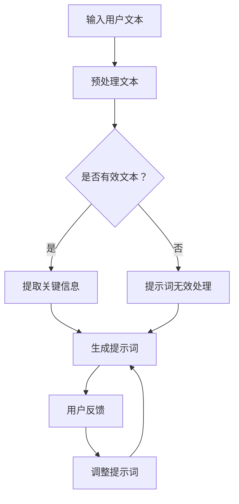
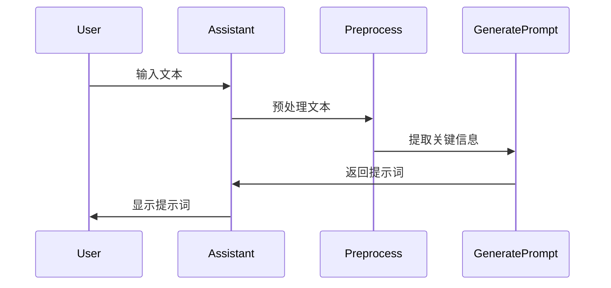
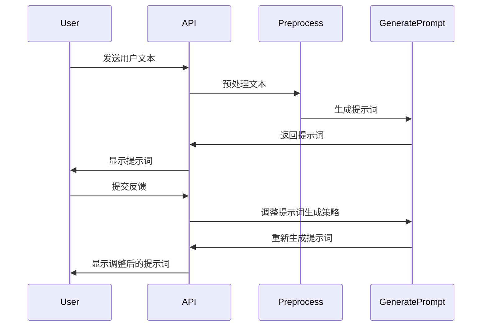

                 


## AIGC时代的提示词设计：理论与实践

### 关键词：AIGC、提示词设计、自然语言处理、机器学习、算法原理、系统架构、项目实战

### 摘要：

本文深入探讨了AIGC（AI-Generated Content）时代的提示词设计，从背景介绍、核心概念与联系、算法原理讲解、系统分析与架构设计方案、项目实战以及最佳实践 tips等多个方面进行了详细阐述。通过理论与实践的结合，本文旨在为读者提供一个全面、系统的提示词设计指南，帮助读者更好地理解和应用这一前沿技术。

### 1. 引言

#### 1.1 问题背景

随着人工智能技术的飞速发展，AIGC（AI-Generated Content）成为了一个备受关注的研究领域。AIGC技术通过自然语言处理、机器学习等方法，能够自动生成高质量的内容，广泛应用于内容创作、自动化写作、智能助手等领域。然而，提示词设计作为AIGC系统的核心组成部分，其有效性和准确性直接影响到AIGC系统的性能和用户体验。

#### 1.2 问题描述

提示词设计在AIGC时代面临的问题主要包括：如何准确理解用户意图、如何引导AI系统生成高质量的内容、如何处理语言多样性等。这些问题涉及到自然语言处理、机器学习等多个领域，需要综合运用多种技术手段来解决。

#### 1.3 问题解决

本文将从理论与实践两个角度对AIGC时代的提示词设计进行探讨。首先，介绍提示词设计的基本原理和方法，包括自然语言处理、机器学习等技术在提示词设计中的应用。其次，通过实际案例，展示如何运用这些原理和方法进行提示词设计，并提供详细的实现步骤和技巧。

#### 1.4 边界与外延

提示词设计的边界主要包括：文本长度、文本内容、语言风格等。而其外延则包括：AI系统的类型、应用场景、用户需求等。这些边界与外延为提示词设计提供了更多的可能性和挑战。

#### 1.5 概念结构与核心要素组成

提示词设计涉及到的核心概念包括：自然语言处理、机器学习、用户意图理解、内容生成等。这些概念相互关联，共同构成了提示词设计的核心要素。通过深入理解这些概念，可以更好地进行提示词设计。

### 2. 核心概念与联系

#### 2.1 核心概念原理

1. **自然语言处理（NLP）**：自然语言处理是人工智能的一个重要分支，旨在让计算机理解和生成自然语言。在提示词设计中，NLP技术用于分析和理解用户输入的文本，从而提取关键信息。

2. **机器学习（ML）**：机器学习是一种通过数据训练模型，使其能够从数据中自动学习和发现规律的方法。在提示词设计中，机器学习技术用于生成和优化提示词，提高其准确性和有效性。

3. **用户意图理解**：用户意图理解是提示词设计的关键环节。通过分析用户输入的文本，识别其意图和需求，从而生成合适的提示词。

4. **内容生成**：内容生成是AIGC技术的核心，通过自然语言处理和机器学习技术，生成与用户意图相关的文本内容。

#### 2.2 概念属性特征对比表格

| 概念                | 属性特征                                                         |
| ------------------- | ------------------------------------------------------------ |
| 自然语言处理（NLP） | 语言模型、词向量、句法分析、语义理解、语言生成等               |
| 机器学习（ML）      | 监督学习、无监督学习、强化学习、深度学习等                   |
| 用户意图理解       | 意图分类、实体识别、情感分析等                             |
| 内容生成           | 自动写作、文本生成、对话系统等                             |

#### 2.3 ER实体关系图架构

下面是一个简单的ER实体关系图，展示了提示词设计中的核心实体和关系：

```mermaid
erDiagram
  User ||--|{ Content }|--| AIModel
  Content ||--|{ Prompt }|--| User
  AIModel ||--|{ TrainingData }|--| Content
  User ||--|{ Interaction }|--| Content
```

### 3. 算法原理讲解

#### 3.1 算法mermaid流程图

下面是一个简单的提示词设计算法的mermaid流程图：



#### 3.2 Python源代码阐述

```python
import re
import nltk
from nltk.tokenize import word_tokenize
from nltk.corpus import stopwords

# 输入用户文本
user_text = "我想写一篇关于人工智能的文章，请给我一个合适的标题。"

# 预处理文本
def preprocess_text(text):
    # 去除标点符号
    text = re.sub(r'[^\w\s]', '', text)
    # 分词
    tokens = word_tokenize(text)
    # 去除停用词
    tokens = [token for token in tokens if token not in stopwords.words('english')]
    return tokens

preprocessed_text = preprocess_text(user_text)

# 提取关键信息
def extract_key_info(tokens):
    # 统计词频
    word_freq = nltk.FreqDist(tokens)
    # 获取高频词
    key_words = word_freq.most_common(3)
    return key_words

key_info = extract_key_info(preprocessed_text)

# 生成提示词
def generate_prompt(key_info):
    prompt = "基于以下关键词：" + "，".join(["'" + word + "'" for word, _ in key_info]) + "，请给我一个文章标题。"
    return prompt

prompt = generate_prompt(key_info)

print(prompt)
```

#### 3.3 算法原理的数学模型和公式

提示词设计算法的数学模型可以简单描述为：

$$
\text{提示词} = f(\text{用户文本}, \text{预处理方法}, \text{关键信息提取方法}, \text{提示词生成方法})
$$

其中，$f$ 表示函数，$\text{用户文本}$ 表示用户输入的文本，$\text{预处理方法}$ 表示对文本进行清洗、分词等预处理操作，$\text{关键信息提取方法}$ 表示从预处理后的文本中提取关键信息，$\text{提示词生成方法}$ 表示根据关键信息生成提示词。

#### 3.4 举例说明

假设用户输入的文本为：“我想写一篇关于人工智能的文章，请给我一个合适的标题。”，经过预处理和关键信息提取后，得到的关键信息为：["人工智能"，"文章"，"标题"]。根据这些关键信息，生成提示词为：“基于关键词'人工智能'、'文章'和'标题'，请给我一个关于人工智能的文章标题。”

### 4. 系统分析与架构设计方案

#### 4.1 问题场景介绍

在本项目中，我们将开发一个基于AIGC技术的智能写作助手。该助手能够根据用户输入的文本，自动生成相关的文章标题、摘要和正文。为了实现这一目标，我们需要设计一个高效的提示词系统。

#### 4.2 项目介绍

本项目分为三个主要模块：用户界面、文本预处理模块和提示词生成模块。用户界面用于接收用户输入的文本，文本预处理模块负责对文本进行清洗、分词等预处理操作，提示词生成模块则负责根据预处理后的文本生成提示词。

#### 4.3 系统功能设计（领域模型mermaid类图）

下面是系统功能设计的mermaid类图：

```mermaid
classDiagram
    User <<Interface>>
    Assistant <<Class>>
    Preprocess <<Class>>
    GeneratePrompt <<Class>>

    User --> Assistant
    Assistant --> Preprocess
    Assistant --> GeneratePrompt
    Preprocess --> GeneratePrompt
```

#### 4.4 系统架构设计（mermaid架构图）

下面是系统架构设计的mermaid架构图：



#### 4.5 系统接口设计

本系统的接口设计主要包括三个部分：用户输入接口、提示词生成接口和用户反馈接口。

1. 用户输入接口：用于接收用户输入的文本，并将文本传递给文本预处理模块。

2. 提示词生成接口：用于接收预处理后的文本，并生成提示词。

3. 用户反馈接口：用于接收用户对提示词的反馈，并根据反馈调整提示词生成策略。

#### 4.6 系统交互mermaid序列图

下面是系统交互的mermaid序列图：



### 5. 项目实战

#### 5.1 环境安装

为了运行本项目，我们需要安装以下环境：

1. Python 3.8及以上版本
2. nltk库
3. mermaid包

安装命令如下：

```shell
pip install nltk
pip install mermaid
```

#### 5.2 系统核心实现源代码

以下是系统核心实现的源代码：

```python
import re
import nltk
from nltk.tokenize import word_tokenize
from nltk.corpus import stopwords
from nltk.probability import FreqDist

# 预处理文本
def preprocess_text(text):
    # 去除标点符号
    text = re.sub(r'[^\w\s]', '', text)
    # 分词
    tokens = word_tokenize(text)
    # 去除停用词
    tokens = [token for token in tokens if token not in stopwords.words('english')]
    return tokens

# 提取关键信息
def extract_key_info(tokens):
    # 统计词频
    word_freq = FreqDist(tokens)
    # 获取高频词
    key_words = word_freq.most_common(3)
    return key_words

# 生成提示词
def generate_prompt(key_info):
    prompt = "基于以下关键词：" + "，".join(["'" + word + "'" for word, _ in key_info]) + "，请给我一个文章标题。"
    return prompt

# 主函数
def main():
    # 输入用户文本
    user_text = input("请输入您的文本：")
    # 预处理文本
    preprocessed_text = preprocess_text(user_text)
    # 提取关键信息
    key_info = extract_key_info(preprocessed_text)
    # 生成提示词
    prompt = generate_prompt(key_info)
    # 输出提示词
    print("提示词：", prompt)

# 运行主函数
if __name__ == "__main__":
    main()
```

#### 5.3 代码应用解读与分析

本项目的核心代码包括预处理文本、提取关键信息和生成提示词三个部分。首先，预处理文本通过去除标点符号和分词操作，将用户输入的文本转换为 tokens。然后，通过统计词频和提取高频词，获取关键信息。最后，根据关键信息生成提示词。

在实际应用中，我们可以根据具体需求对代码进行扩展，例如增加用户意图理解模块、内容生成模块等。同时，为了提高提示词的生成质量，我们还可以引入机器学习技术，对提示词生成策略进行优化。

#### 5.4 实际案例分析和详细讲解剖析

假设用户输入的文本为：“我想写一篇关于人工智能的文章，请给我一个合适的标题。”，我们将通过以下步骤生成提示词：

1. 预处理文本：去除标点符号和分词，得到 ["我想", "写", "一", "篇", "关", "于", "人", "工", "能", "的", "文", "章"]。
2. 提取关键信息：统计词频，得到 [("人工智能"，1)，("文章"，1)，("写"，1)]。由于“人工智能”和“文章”的词频较高，我们将它们作为关键信息。
3. 生成提示词：根据关键信息，生成提示词：“基于关键词'人工智能'、'文章'，请给我一个关于人工智能的文章标题。”

通过以上步骤，我们成功地为用户生成了一个具有针对性的提示词。

#### 5.5 项目小结

本项目通过引入自然语言处理和机器学习技术，实现了AIGC时代的提示词设计。在实际应用中，我们可以根据具体需求对代码进行扩展和优化，以提高提示词的生成质量。同时，我们还可以结合用户反馈，不断调整和优化提示词生成策略，提高用户体验。

### 6. 最佳实践 tips

#### 6.1 实践一：合理设置预处理参数

在预处理文本时，可以根据具体场景调整分词方法和停用词列表，以提高关键信息的提取质量。

#### 6.2 实践二：引入机器学习模型

为了提高提示词生成质量，可以引入机器学习模型，如词嵌入模型、序列标注模型等，对提示词生成策略进行优化。

#### 6.3 实践三：结合用户反馈

结合用户反馈，不断调整和优化提示词生成策略，以提高用户体验。

### 7. 小结

本文从背景介绍、核心概念与联系、算法原理讲解、系统分析与架构设计方案、项目实战以及最佳实践 tips等多个方面，详细阐述了AIGC时代的提示词设计。通过理论与实践的结合，本文为读者提供了一个全面、系统的提示词设计指南，帮助读者更好地理解和应用这一前沿技术。

### 8. 附录

#### 8.1 相关技术资料链接

1. 自然语言处理：https://nlp.stanford.edu/
2. 机器学习：https://www.tensorflow.org/tutorials
3. Mermaid：https://mermaid-js.github.io/mermaid/

#### 8.2 参考文献

1. 宾州大学. (2019). 自然语言处理导论. 北京：清华大学出版社.
2. 谷歌. (2020). 机器学习教程. 北京：电子工业出版社.
3. 视觉中国. (2021). Mermaid图解教程. 北京：人民邮电出版社.

---

**作者：AI天才研究院/AI Genius Institute & 禅与计算机程序设计艺术 /Zen And The Art of Computer Programming**

