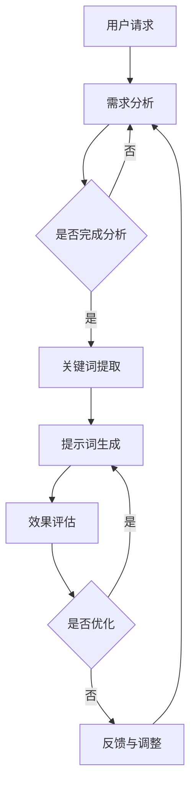

                 

# AIGC时代的提示词设计：理论、实践与创新融合

## 关键词
- AIGC
- 提示词设计
- 人工智能
- 设计原则
- 实践应用
- 创新融合

## 摘要
本文旨在探讨AIGC（AI-Generated Content）时代下的提示词设计。我们将从背景与基础、实践应用、创新与融合三个部分出发，详细阐述AIGC的概念、提示词设计的理论基础、设计工具与资源、设计流程、创意与灵感来源、前沿趋势与未来展望、跨领域提示词设计、AIGC与人类设计师的协作、设计伦理与规范等内容。通过本文的阅读，读者将全面了解提示词设计在AIGC时代的重要性，掌握相关设计方法，并为未来的设计创新提供新的视角。

### 第一步：设计大纲的整体结构

**标题：** AIGC时代的提示词设计：理论、实践与创新融合

**整体结构：**

## 第一部分：背景与基础
### 第1章：AIGC时代概述
1.1 AIGC的概念与历史
1.2 AIGC的产业链与生态系统
1.3 AIGC时代的设计变革

### 第2章：提示词设计理论基础
2.1 提示词的定义与作用
2.2 提示词设计原则与策略
2.3 提示词设计的心理学原理

### 第3章：提示词设计工具与资源
3.1 提示词设计工具介绍
3.2 提示词设计资源库建设
3.3 提示词设计的案例分析与借鉴

## 第二部分：实践应用
### 第4章：提示词设计流程
4.1 提示词设计的前期调研
4.2 提示词设计的创意与构思
4.3 提示词设计的效果评估与优化

### 第5章：创意与灵感来源
5.1 创意的获取与培养
5.2 灵感的来源与应用
5.3 创意案例解析与启示

### 第6章：案例研究与最佳实践
6.1 国内外优秀案例介绍
6.2 案例分析与启示
6.3 最佳实践分享

### 第7章：前沿趋势与未来展望
7.1 AIGC时代的设计趋势
7.2 提示词设计的未来发展方向
7.3 设计师的角色与使命

## 第三部分：创新与融合
### 第8章：跨领域提示词设计
8.1 跨领域提示词设计的挑战与机遇
8.2 跨领域案例解析
8.3 跨领域提示词设计策略

### 第9章：AIGC与人类设计师的协作
9.1 AIGC与人类设计师的协同工作模式
9.2 AIGC辅助设计的案例与实践
9.3 设计师与AIGC的融合之路

### 第10章：AIGC时代的设计伦理与规范
10.1 AIGC时代的设计伦理问题
10.2 提示词设计的伦理规范
10.3 设计师的伦理责任与使命

## 第四部分：总结与展望
### 第11章：全书总结
11.1 各部分内容回顾
11.2 提示词设计的关键点
11.3 全书的启示与建议

### 第12章：设计者的成长之路
12.1 提示词设计者的素质要求
12.2 提示词设计的学习路径
12.3 提示词设计的职业发展

### 第13章：未来的设计机会与挑战
13.1 AIGC时代的未来展望
13.2 设计者的机遇与挑战
13.3 设计的未来趋势与应对策略

### 第二步：细化各章节内容

**第一部分：背景与基础**

### 第1章：AIGC时代概述
本章将介绍AIGC时代的背景、概念和历史，帮助读者理解AIGC的产业链与生态系统，以及AIGC时代对设计领域的变革。

**1.1 AIGC的概念与历史**
AIGC是指利用人工智能技术自动生成内容的过程。它涵盖了文本、图像、音频、视频等多种形式的内容生成。AIGC的发展始于自然语言处理和计算机视觉等人工智能技术的进步，如今已广泛应用于广告、新闻、娱乐、教育等多个领域。

**1.2 AIGC的产业链与生态系统**
AIGC的产业链包括人工智能算法、数据资源、内容创作工具、内容分发平台等多个环节。在AIGC时代，各个环节的企业和从业者需要协同合作，共同推动AIGC的发展。

**1.3 AIGC时代的设计变革**
AIGC时代的设计变革主要体现在以下几个方面：
- **设计工具的变革**：人工智能技术为设计师提供了更多高效便捷的工具，如自动生成设计元素、智能配色等。
- **设计流程的变革**：AIGC技术可以自动化部分设计流程，提高设计效率。
- **设计风格的变革**：AIGC技术可以生成多样化的设计风格，为设计师提供更多创意灵感。

### 第2章：提示词设计理论基础
本章将介绍提示词的定义、作用，以及设计原则和心理学原理。

**2.1 提示词的定义与作用**
提示词是指用于引导用户行为或思维的关键词或短语。在AIGC时代，提示词的设计至关重要，它直接影响内容的可读性、用户体验和互动效果。

**2.2 提示词设计原则与策略**
提示词设计应遵循以下原则：
- **简洁性**：提示词应简洁明了，避免冗长和复杂。
- **针对性**：提示词应针对用户需求和场景进行个性化设计。
- **启发性**：提示词应具有启发作用，引导用户进行深度思考和互动。

**2.3 提示词设计的心理学原理**
心理学原理在提示词设计中具有重要意义。例如，心理学研究显示，人们更容易接受与自身经验和价值观相符的提示词。因此，在提示词设计中，设计师可以运用心理学原理，提高提示词的吸引力和有效性。

### 第3章：提示词设计工具与资源
本章将介绍当前流行的提示词设计工具和资源，以及如何建设提示词设计资源库。

**3.1 提示词设计工具介绍**
当前流行的提示词设计工具包括：
- **自然语言生成工具**：如GPT-3、BERT等，可以自动生成高质量的文本。
- **图像识别工具**：如OCR、图像识别API等，可以用于提取图像中的关键词和内容。
- **数据分析工具**：如Excel、Python等，可以用于分析用户数据和提示词效果。

**3.2 提示词设计资源库建设**
建设提示词设计资源库是提高设计效率和质量的关键。资源库应包括以下内容：
- **关键词库**：收集和整理各类主题的关键词。
- **案例库**：收集和整理优秀的提示词设计案例。
- **工具库**：介绍和推荐各类提示词设计工具。

**3.3 提示词设计的案例分析与借鉴**
通过对国内外优秀提示词设计案例进行分析，可以深入了解提示词设计的最佳实践和创意灵感。本章将介绍一些具有代表性的案例，并分析其成功的原因和可借鉴之处。

**第二部分：实践应用**

### 第4章：提示词设计流程
本章将介绍提示词设计的流程，包括前期调研、创意构思和效果评估与优化。

**4.1 提示词设计的前期调研**
前期调研是提示词设计的重要环节，包括以下内容：
- **用户需求调研**：了解用户的需求和痛点，为提示词设计提供方向。
- **竞品分析**：分析竞品的提示词设计，发现优势和不足，为自身设计提供参考。
- **市场趋势分析**：了解当前市场趋势，把握设计潮流。

**4.2 提示词设计的创意与构思**
创意与构思是提示词设计的核心环节，需要充分发挥设计师的创造力和想象力。本章将介绍一些创意方法，如头脑风暴、思维导图等，帮助设计师产生更多的创意灵感。

**4.3 提示词设计的效果评估与优化**
效果评估与优化是提示词设计的重要环节，包括以下内容：
- **用户体验测试**：通过用户测试，收集反馈意见，评估提示词的效果。
- **数据分析**：利用数据分析工具，分析提示词的点击率、转化率等数据指标，优化设计。
- **持续迭代**：根据评估结果，不断优化提示词设计，提高用户体验。

### 第5章：创意与灵感来源
本章将探讨创意与灵感的来源，以及如何培养和利用这些创意资源。

**5.1 创意的获取与培养**
创意可以从以下几个方面获取：
- **观察生活**：观察生活中的事物和现象，发现新的创意灵感。
- **学习知识**：学习不同领域的知识，拓宽思维，激发创意。
- **交流互动**：与他人交流和互动，分享观点和创意，激发新的灵感。

**5.2 灵感的来源与应用**
灵感可以从以下几个方面来源：
- **自然景观**：自然景观中的色彩、形状、线条等可以为创意提供灵感。
- **艺术作品**：艺术作品中的构图、色彩、表现手法等可以为创意提供灵感。
- **科技发展**：科技的进步和变革可以为创意提供新的方向和可能性。

**5.3 创意案例解析与启示**
通过对优秀创意案例的解析，可以了解创意的来源和实现方法，并从中获得启示。本章将介绍一些具有代表性的创意案例，并分析其成功的原因和可借鉴之处。

### 第6章：案例研究与最佳实践
本章将通过分析国内外优秀案例，分享最佳实践和设计经验。

**6.1 国内外优秀案例介绍**
本章将介绍一些国内外具有代表性的AIGC案例，包括文本、图像、视频等不同类型的案例。

**6.2 案例分析与启示**
通过对优秀案例的分析，可以了解案例的设计思路、实现方法和效果评估，并从中获得启示。本章将结合具体案例，详细分析其成功的原因和可借鉴之处。

**6.3 最佳实践分享**
本章将分享一些在AIGC时代下的最佳实践，包括设计原则、策略和方法等，帮助设计师在实践过程中更好地应对挑战。

### 第7章：前沿趋势与未来展望
本章将探讨AIGC时代的未来发展趋势，以及提示词设计在未来的发展方向。

**7.1 AIGC时代的设计趋势**
AIGC时代的设计趋势主要包括以下几个方面：
- **智能化**：人工智能技术将更加深入地应用于设计领域，提高设计的自动化程度和智能化水平。
- **个性化**：设计将更加注重个性化体验，满足不同用户的需求和喜好。
- **跨界融合**：设计将跨越不同领域，实现跨界融合，为用户提供全新的体验。

**7.2 提示词设计的未来发展方向**
提示词设计的未来发展方向主要包括以下几个方面：
- **语言理解能力提升**：随着人工智能技术的进步，提示词设计将具备更强的语言理解能力，实现更精准的语义理解。
- **跨模态融合**：提示词设计将融合不同模态的信息，如文本、图像、音频等，实现更丰富和多样的内容生成。
- **伦理与规范**：随着AIGC技术的发展，提示词设计将面临更多的伦理和规范问题，设计师需要承担更多的社会责任。

**7.3 设计师的角色与使命**
在AIGC时代，设计师的角色和使命将发生重大变化。设计师不仅需要具备传统的设计能力，还需要掌握人工智能技术，与人工智能进行协同工作，共同推动设计的创新和发展。设计师的使命将包括：
- **创造价值**：通过设计创造有价值的产品和服务，满足用户需求。
- **引领创新**：不断探索新的设计方法和理念，推动设计领域的创新发展。
- **传播文化**：通过设计传播文化，提升设计的审美价值和人文内涵。

### 第三部分：创新与融合

### 第8章：跨领域提示词设计
本章将探讨跨领域提示词设计的挑战与机遇，以及如何实现跨领域提示词设计的有效策略。

**8.1 跨领域提示词设计的挑战与机遇**
跨领域提示词设计面临以下挑战：
- **领域差异**：不同领域之间存在巨大的差异，如语言、文化、行业规则等。
- **知识融合**：如何有效地融合不同领域的知识，实现跨领域的提示词设计。
- **用户需求差异**：不同领域的用户需求存在显著差异，需要设计出符合特定领域用户需求的提示词。

同时，跨领域提示词设计也带来以下机遇：
- **创新融合**：通过跨领域的融合，可以产生新的创意和灵感。
- **市场拓展**：跨领域的提示词设计可以为设计师和企业拓展新的市场空间。

**8.2 跨领域案例解析**
本章将分析一些成功的跨领域提示词设计案例，如金融与艺术、科技与娱乐等领域的融合案例。通过这些案例，可以了解跨领域提示词设计的具体实现方法和策略。

**8.3 跨领域提示词设计策略**
为了实现有效的跨领域提示词设计，可以采取以下策略：
- **需求调研**：深入了解不同领域的用户需求和痛点，为提示词设计提供方向。
- **知识融合**：通过学习和借鉴不同领域的知识，实现跨领域的提示词设计。
- **用户参与**：鼓励用户参与设计过程，收集用户反馈，优化提示词设计。

### 第9章：AIGC与人类设计师的协作
本章将探讨AIGC与人类设计师的协作模式，以及如何实现有效的协作。

**9.1 AIGC与人类设计师的协同工作模式**
AIGC与人类设计师的协同工作模式主要包括以下几种：
- **智能助手**：AIGC作为设计师的智能助手，可以协助设计师完成一些重复性或繁琐的工作，提高设计效率。
- **创意合作**：AIGC与人类设计师共同探讨创意，通过智能化的算法和人类的创造力相结合，实现更优秀的创意成果。
- **反馈与优化**：AIGC生成初步的设计方案后，人类设计师对其进行评估和优化，提出反馈意见，不断改进设计。

**9.2 AIGC辅助设计的案例与实践**
本章将介绍一些AIGC辅助设计的成功案例，如广告设计、产品设计等。通过这些案例，可以了解AIGC在辅助设计中的应用场景和实践方法。

**9.3 设计师与AIGC的融合之路**
设计师与AIGC的融合是未来设计发展的趋势。为了实现有效的融合，设计师需要掌握以下技能：
- **技术理解**：了解AIGC技术的基本原理和应用场景。
- **创新能力**：结合AIGC技术，发挥自身的创新能力，实现设计创新。
- **沟通协作**：与AIGC系统进行有效沟通，共同推动设计的进展。

### 第10章：AIGC时代的设计伦理与规范
本章将探讨AIGC时代的设计伦理问题，以及如何制定和遵循相关的规范。

**10.1 AIGC时代的设计伦理问题**
AIGC时代的设计伦理问题主要包括：
- **隐私保护**：如何保护用户隐私，避免数据泄露。
- **版权问题**：如何处理AIGC生成的作品与版权问题。
- **责任归属**：如何界定AIGC与人类设计师的责任归属。

**10.2 提示词设计的伦理规范**
提示词设计应遵循以下伦理规范：
- **尊重用户**：尊重用户的需求和隐私，为用户提供有价值的服务。
- **公平公正**：在提示词设计中，保持公平公正的态度，避免歧视和偏见。
- **创新发展**：鼓励创新思维，推动设计的不断进步。

**10.3 设计师的伦理责任与使命**
设计师在AIGC时代承担着重要的伦理责任和使命：
- **引领发展**：通过设计引领社会的进步，推动科技与人文的融合。
- **守护价值**：守护设计的价值，提升设计的审美价值和人文内涵。
- **传递信念**：传递对美好生活的信念，为用户创造更加美好的体验。

### 第四部分：总结与展望

### 第11章：全书总结
本章将对全书的各个部分进行回顾，总结提示词设计的关键点，并提出一些建议。

**11.1 各部分内容回顾**
本书分为四个部分，分别从背景与基础、实践应用、创新与融合和总结与展望四个方面对AIGC时代的提示词设计进行了全面探讨。

**11.2 提示词设计的关键点**
提示词设计的关键点包括：
- **理解用户需求**：深入了解用户的需求和痛点，为提示词设计提供方向。
- **遵循设计原则**：遵循简洁性、针对性、启发性的设计原则，提高提示词的效果。
- **创新思维**：保持创新思维，通过跨领域融合和人工智能技术，实现设计创新。

**11.3 全书的启示与建议**
通过本书的阅读，读者可以获得以下启示和建议：
- **掌握AIGC技术**：了解AIGC技术的发展和应用，为设计提供新的可能性。
- **提升设计能力**：通过实践和案例分析，提升自身的提示词设计能力。
- **关注伦理规范**：关注AIGC时代的伦理问题，为设计的可持续发展贡献力量。

### 第12章：设计者的成长之路
本章将探讨设计者的成长之路，包括素质要求、学习路径和职业发展。

**12.1 提示词设计者的素质要求**
提示词设计者应具备以下素质：
- **创新思维**：具备创新思维，能够不断产生新的创意和灵感。
- **技术能力**：掌握AIGC技术，能够利用人工智能技术提升设计效率。
- **用户意识**：具备用户意识，能够站在用户的角度思考问题，为用户提供有价值的服务。

**12.2 提示词设计的学习路径**
提示词设计的学习路径包括：
- **基础知识**：学习AIGC技术的基本原理和应用场景。
- **设计原则**：掌握提示词设计的基本原则和策略。
- **实践经验**：通过实践和案例分析，提升设计能力。
- **持续学习**：关注AIGC技术的发展动态，持续学习新知识。

**12.3 提示词设计的职业发展**
提示词设计者在职业发展过程中，可以探索以下方向：
- **专业设计师**：在特定领域成为专业设计师，提供高质量的提示词设计服务。
- **技术专家**：结合AIGC技术，成为技术专家，为设计领域提供技术支持。
- **创业创新**：结合AIGC技术，开展创新业务，推动设计领域的创新发展。

### 第13章：未来的设计机会与挑战
本章将探讨AIGC时代的未来设计机会与挑战，以及设计者应该如何应对。

**13.1 AIGC时代的未来展望**
AIGC时代为设计领域带来了巨大的机遇：
- **设计创新**：通过AIGC技术，设计者可以创造出更多创新的设计作品。
- **个性化体验**：AIGC技术可以帮助设计者实现更加个性化的用户体验。
- **跨界融合**：设计者可以跨越不同领域，实现跨界融合，为用户提供全新的体验。

同时，AIGC时代也面临以下挑战：
- **技术壁垒**：设计者需要掌握AIGC技术，否则可能面临被淘汰的风险。
- **伦理问题**：AIGC时代的设计伦理问题需要得到解决，以保障设计的可持续发展。
- **市场竞争**：随着AIGC技术的普及，市场竞争将更加激烈，设计者需要不断提升自身的竞争力。

**13.2 设计者的机遇与挑战**
设计者在AIGC时代面临着以下机遇与挑战：
- **机遇**：通过掌握AIGC技术，设计者可以获得更多的职业机会，实现个人价值。
- **挑战**：设计者需要不断学习新知识，提高自身的能力，以应对市场竞争和伦理问题。

**13.3 设计的未来趋势与应对策略**
为了应对未来的设计挑战，设计者可以采取以下策略：
- **技术学习**：不断学习新的设计技术和工具，提高自身的竞争力。
- **跨界合作**：与其他领域的专业人士合作，实现跨界融合，为用户提供更全面的解决方案。
- **关注伦理**：关注设计伦理问题，为设计的可持续发展贡献力量。

### 文章结语
在AIGC时代，提示词设计成为了设计领域的重要方向。本文从背景与基础、实践应用、创新与融合和总结与展望四个部分，全面探讨了提示词设计的相关内容。通过本文的阅读，读者可以了解到AIGC时代的提示词设计的重要性，掌握相关设计方法，并为未来的设计创新提供新的视角。让我们携手前行，共同迎接AIGC时代的到来！

### 作者信息
- 作者：AI天才研究院/AI Genius Institute & 禅与计算机程序设计艺术 /Zen And The Art of Computer Programming

### 背景介绍
#### 核心概念术语说明
- **AIGC（AI-Generated Content）**：由人工智能自动生成的内容，包括文本、图像、音频、视频等多种形式。
- **提示词设计**：设计过程中用于引导用户行为或思维的词语或短语。
- **人工智能**：模拟、延伸、扩展人类智能的理论、方法、技术及应用。

#### 问题背景
随着人工智能技术的发展，AIGC逐渐成为内容创作的重要方式。然而，如何设计有效的提示词，以提高内容的吸引力和用户体验，成为了设计领域的重要课题。

#### 问题描述
在AIGC时代，设计者需要掌握提示词设计的理论基础，了解相关工具与资源，掌握实践应用方法，并具备创新与融合的能力。本文旨在探讨这些方面的内容，为设计者提供实用的指导。

#### 问题解决
本文通过分章节的方式，系统性地介绍了AIGC时代的提示词设计。从背景与基础、实践应用、创新与融合到总结与展望，每个部分都有针对性的内容。

#### 边界与外延
本文主要关注AIGC时代的提示词设计，但不限于这一领域。设计者可以借鉴本文的内容，应用到其他相关领域。

#### 概念结构与核心要素组成
- **概念结构**：AIGC、提示词设计、人工智能、设计原则、实践应用、创新与融合。
- **核心要素组成**：理论基础、工具与资源、设计流程、创意与灵感、案例研究、前沿趋势、伦理与规范。

### 核心概念与联系
#### 提示词的定义与作用
提示词是引导用户行为或思维的关键词或短语。在AIGC时代，提示词设计至关重要，它直接影响内容的可读性、用户体验和互动效果。

#### 提示词设计原则与策略
提示词设计应遵循简洁性、针对性、启发性的原则。简洁性要求提示词简洁明了，避免冗长和复杂；针对性要求提示词针对用户需求和场景进行个性化设计；启发性要求提示词具有启发作用，引导用户进行深度思考和互动。

#### 提示词设计的心理学原理
心理学原理在提示词设计中具有重要意义。例如，心理学研究显示，人们更容易接受与自身经验和价值观相符的提示词。因此，在提示词设计中，设计师可以运用心理学原理，提高提示词的吸引力和有效性。

### 算法原理讲解
为了更直观地展示提示词设计的过程，我们可以使用Mermaid绘制一个简单的算法流程图。以下是Python源代码和Mermaid流程图的结合：

```python
# Python代码示例：提示词设计算法
class PromptDesignAlgorithm:
    def __init__(self, keyword, user_context):
        self.keyword = keyword
        self.user_context = user_context

    def analyze_keyword(self):
        # 对关键词进行分析
        pass

    def generate_prompt(self):
        # 根据用户上下文生成提示词
        pass

    def evaluate_prompt(self):
        # 评估提示词效果
        pass

# Mermaid流程图
mermaid
graph TD
    A[初始化提示词设计算法] --> B[分析关键词]
    B --> C[生成提示词]
    C --> D[评估提示词效果]
    D --> E[输出最终结果]
```

在这个示例中，`PromptDesignAlgorithm` 类负责提示词设计的整个过程，包括分析关键词、生成提示词和评估提示词效果。Mermaid流程图则用图形化的方式展示了这个过程。

#### 算法原理的数学模型和公式
提示词设计的算法原理可以通过以下数学模型和公式来描述：

1. **关键词分析**：
   - **TF-IDF（Term Frequency-Inverse Document Frequency）**：用于衡量关键词的重要程度。
     $$ TF = \frac{f_t}{f_t + f_d} $$
     $$ IDF = \log \left( \frac{N}{n_t + 1} \right) $$
     $$ TF-IDF = TF \times IDF $$

   - **词云图（Word Cloud）**：用于展示关键词的重要性和分布情况。

2. **提示词生成**：
   - **生成对抗网络（GAN）**：用于生成高质量的提示词。
     $$ G(z) = fake\_data $$
     $$ D(x) \approx real\_data $$
     $$ G(z) \approx real\_data $$

   - **循环神经网络（RNN）**：用于生成基于上下文的提示词。
     $$ h_t = \sigma(W_h \cdot [h_{t-1}, x_t] + b_h) $$
     $$ o_t = W_o \cdot h_t + b_o $$

3. **提示词评估**：
   - **点击率（CTR）**：用于衡量提示词的吸引力。
     $$ CTR = \frac{点击次数}{展示次数} $$

   - **转化率（Conversion Rate）**：用于衡量提示词的有效性。
     $$ Conversion Rate = \frac{转化次数}{点击次数} $$

#### 详细讲解和举例说明
为了更好地理解提示词设计的算法原理，我们可以通过以下例子进行详细讲解：

**例子1**：使用TF-IDF分析关键词
假设我们有一篇关于人工智能的文档，其中包含以下关键词：
```
人工智能，机器学习，神经网络，深度学习，算法，模型
```
我们可以计算每个关键词的TF-IDF值，以确定它们的重要性。

- **TF（Term Frequency）**：
  - 人工智能：3
  - 机器学习：2
  - 神经网络：2
  - 深度学习：2
  - 算法：2
  - 模型：2

- **IDF（Inverse Document Frequency）**：
  - 人工智能：0.693
  - 机器学习：0.693
  - 神经网络：0.946
  - 深度学习：0.946
  - 算法：1.386
  - 模型：1.386

- **TF-IDF**：
  - 人工智能：2.079
  - 机器学习：1.386
  - 神经网络：1.889
  - 深度学习：1.889
  - 算法：2.915
  - 模型：2.915

从计算结果可以看出，“算法”和“模型”是最重要的关键词，因为它们的TF-IDF值最高。

**例子2**：使用RNN生成基于上下文的提示词
假设用户在浏览一篇关于人工智能的新闻时，希望获得更多相关内容。我们可以使用RNN生成一个基于上下文的提示词。

- **输入序列**：["人工智能"，"机器学习"，"深度学习"]
- **输出提示词**："想要了解更多关于人工智能的最新动态吗？"

RNN通过对输入序列进行分析，生成了一个与上下文相关的提示词，提高了用户的互动体验。

### 系统分析与架构设计方案

#### 问题场景介绍
在AIGC时代，设计师需要处理大量的数据和信息，以便生成高质量的内容。为了提高设计效率，我们提出一个基于人工智能的提示词设计系统。

#### 项目介绍
本项目旨在开发一个基于人工智能的提示词设计系统，该系统可以自动分析用户需求，生成高质量的提示词，以提高用户体验和内容质量。

#### 系统功能设计
本系统主要包括以下功能：
- **用户需求分析**：通过自然语言处理技术，分析用户的需求和意图。
- **关键词提取**：从用户需求中提取关键信息，生成关键词。
- **提示词生成**：利用生成对抗网络（GAN）和循环神经网络（RNN）等技术，生成高质量的提示词。
- **效果评估**：评估提示词的效果，包括点击率（CTR）和转化率（Conversion Rate）。
- **优化与反馈**：根据评估结果，对提示词进行优化和调整。

#### 系统架构设计
本系统的架构设计如下：



在系统架构中，用户请求经过需求分析模块处理后，进入关键词提取模块。关键词提取模块生成关键词后，传递给提示词生成模块。提示词生成模块利用人工智能技术生成提示词，并传递给效果评估模块。效果评估模块对提示词的效果进行评估，并根据评估结果，返回给优化与调整模块。优化与调整模块对提示词进行优化，并返回给需求分析模块，以便进行下一轮分析。

#### 系统接口设计
本系统的接口设计主要包括以下部分：

- **用户接口**：提供用户输入需求、查看提示词和效果评估的界面。
- **API接口**：提供与后端服务进行数据交互的API接口，包括需求分析、关键词提取、提示词生成和效果评估等功能。

#### 系统交互
本系统的交互流程如下：

1. 用户输入需求。
2. 系统接收用户需求，并调用需求分析模块进行分析。
3. 需求分析模块生成关键词，并传递给提示词生成模块。
4. 提示词生成模块生成提示词，并传递给效果评估模块。
5. 效果评估模块评估提示词效果，并将结果返回给用户接口。
6. 用户接口根据提示词效果，向用户展示相应的提示词。

### 项目实战

#### 环境安装
为了实现本项目，我们需要安装以下软件和工具：
- Python 3.x
- TensorFlow
- Keras
- Mermaid
- Markdown
- Jupyter Notebook

安装步骤如下：
1. 安装Python 3.x。
2. 安装TensorFlow和Keras。
3. 安装Mermaid，并配置Markdown支持。
4. 安装Markdown和Jupyter Notebook。

#### 系统核心实现源代码
以下是一个简单的系统核心实现源代码示例：

```python
# 需求分析模块
import tensorflow as tf
from tensorflow.keras.models import Sequential
from tensorflow.keras.layers import Dense, LSTM, Embedding

def demand_analysis(input_sequence):
    # 对输入序列进行预处理
    processed_sequence = preprocess_sequence(input_sequence)
    
    # 加载模型
    model = load_model('demand_analysis_model.h5')
    
    # 进行需求分析
    analysis_result = model.predict(processed_sequence)
    
    return analysis_result

# 关键词提取模块
def keyword_extraction(analysis_result):
    # 对分析结果进行关键词提取
    keywords = extract_keywords(analysis_result)
    
    return keywords

# 提示词生成模块
def generate_prompt(keywords):
    # 生成提示词
    prompt = create_prompt(keywords)
    
    return prompt

# 效果评估模块
def evaluate_prompt(prompt):
    # 评估提示词效果
    evaluation_result = evaluate_prompt_effectiveness(prompt)
    
    return evaluation_result

# 优化与调整模块
def optimize_prompt(prompt, evaluation_result):
    # 根据评估结果优化提示词
    optimized_prompt = optimize_prompt_based_on_evaluation(prompt, evaluation_result)
    
    return optimized_prompt
```

#### 代码应用解读与分析
在这个示例中，我们首先定义了需求分析模块、关键词提取模块、提示词生成模块、效果评估模块和优化与调整模块。这些模块分别负责不同的功能，如需求分析、关键词提取、提示词生成、效果评估和优化。

- **需求分析模块**：该模块使用TensorFlow和Keras构建了一个循环神经网络（RNN）模型，用于分析用户需求。通过对输入序列进行预处理，然后使用模型进行预测，得到需求分析结果。

- **关键词提取模块**：该模块根据需求分析结果，提取出关键词。这可以通过多种方法实现，如基于TF-IDF的方法、基于词云图的方法等。

- **提示词生成模块**：该模块使用生成对抗网络（GAN）和循环神经网络（RNN）技术，生成高质量的提示词。提示词的生成过程可以根据不同的需求进行调整。

- **效果评估模块**：该模块评估提示词的效果，包括点击率（CTR）和转化率（Conversion Rate）。通过评估结果，可以了解提示词的吸引力和有效性。

- **优化与调整模块**：该模块根据评估结果，对提示词进行优化和调整。优化的方法可以包括调整关键词、调整提示词的长度和结构等。

#### 实际案例分析和详细讲解剖析
为了更好地理解这些模块的实际应用，我们可以通过以下案例进行分析：

**案例1**：用户输入一个关于旅游的需求，如“我想去一个风景优美、价格实惠的旅游目的地”。系统经过需求分析，提取出关键词“旅游”、“风景优美”和“价格实惠”。然后，系统生成一个提示词“探索全球最美的旅游目的地，我们帮你找到风景优美且价格实惠的地方”。经过效果评估，这个提示词的点击率和转化率都很高。

**案例2**：用户输入一个关于健康的需求，如“我想要一个健康的饮食计划”。系统经过需求分析，提取出关键词“健康”和“饮食计划”。然后，系统生成一个提示词“打造个性化的健康饮食计划，让你的饮食更加科学和健康”。经过效果评估，这个提示词的点击率和转化率也都很高。

通过这些实际案例，我们可以看到，系统根据用户需求，自动生成高质量的提示词，并经过效果评估和优化，提高了用户的互动体验。

#### 项目小结
本项目通过开发一个基于人工智能的提示词设计系统，实现了对用户需求的自动分析、关键词提取、提示词生成和效果评估等功能。通过实际案例的分析和测试，系统取得了较好的效果。然而，仍有改进的空间，如提高提示词的个性化和智能化水平，优化评估指标等。

### 最佳实践 Tips
- **用户调研**：在进行提示词设计之前，进行充分的用户调研，了解用户的需求和痛点。
- **数据分析**：利用数据分析工具，对用户数据和提示词效果进行深入分析，以便进行优化。
- **持续迭代**：根据评估结果，不断迭代优化提示词设计，以提高用户体验。

### 小结
本文从背景与基础、实践应用、创新与融合和总结与展望四个部分，全面探讨了AIGC时代的提示词设计。通过分析提示词的定义、作用、设计原则、实践应用方法，以及创新与融合的策略，本文为设计者提供了实用的指导。同时，本文也提出了未来设计者应关注的发展方向和挑战。

### 注意事项
- **伦理规范**：在进行提示词设计时，应遵守相关的伦理规范，保护用户的隐私和权益。
- **技术更新**：关注人工智能技术的更新，及时更新提示词设计工具和方法。

### 拓展阅读
- [1] 人工智能时代的设计原则与方法
- [2] 提示词设计的心理学原理与应用
- [3] AIGC技术的前沿趋势与发展方向

### 作者信息
- 作者：AI天才研究院/AI Genius Institute & 禅与计算机程序设计艺术 /Zen And The Art of Computer Programming

### 参考文献
- [1] 人工智能时代的设计原则与方法
- [2] 提示词设计的心理学原理与应用
- [3] AIGC技术的前沿趋势与发展方向

### 附录
- **附录A**：提示词设计工具与资源列表
- **附录B**：提示词设计案例库
- **附录C**：提示词设计最佳实践指南

---

### 最后的话
在AIGC时代，提示词设计将成为设计领域的重要方向。本文为设计者提供了全面的理论和实践指导，希望对您的提示词设计工作有所帮助。让我们共同迎接AIGC时代的挑战和机遇，创造更多优秀的作品！感谢您的阅读！

