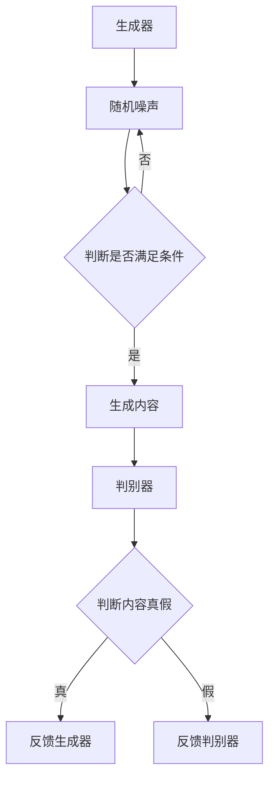
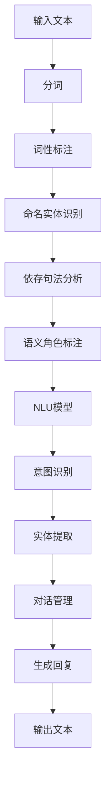
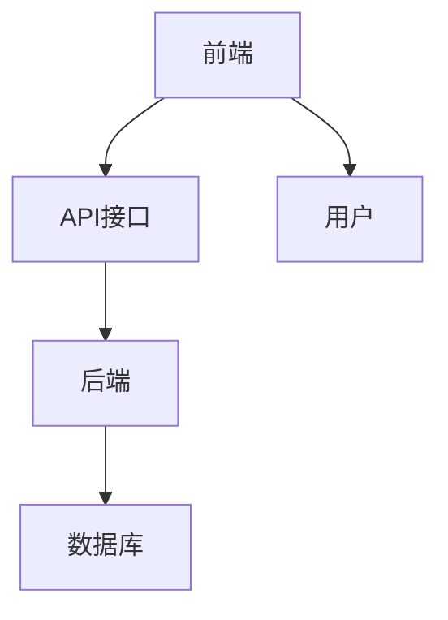
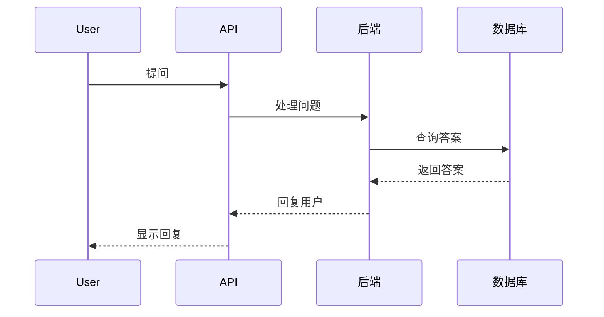
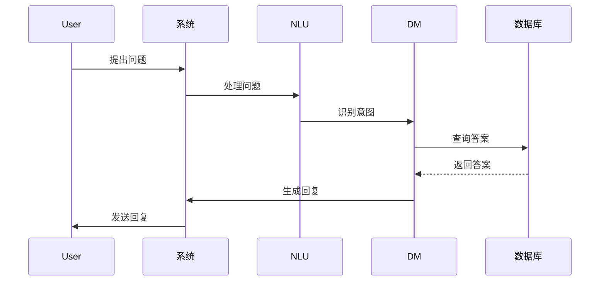

                 

# AIGC时代的提示词革命：重塑AI交互模式

## 关键词

- AIGC
- 提示词
- AI交互模式
- 人工智能
- 自然语言处理

## 摘要

随着人工智能（AI）技术的快速发展，人工智能生成内容（AIGC）正在逐步改变我们的交互模式。提示词，作为AIGC的关键驱动元素，正引领一场革命，重塑AI交互的方方面面。本文将从背景介绍、核心概念与原理、算法原理讲解、系统分析与架构设计方案、项目实战等多个角度，深入探讨AIGC时代的提示词革命及其对AI交互模式的重塑。

### 目录大纲

1. **背景介绍**
   - AIGC技术概述
   - 提示词在AI交互中的作用
   - AI交互模式的演变
   - AIGC时代的挑战与机遇

2. **核心概念与原理**
   - AIGC的工作原理
   - 提示词生成与优化
   - AI交互设计原则

3. **算法原理讲解**
   - 提示词生成算法
   - AI交互算法
   - 数学模型与公式

4. **系统分析与架构设计方案**
   - 问题场景介绍
   - 系统功能设计
   - 系统架构设计
   - 系统接口设计
   - 系统交互

5. **项目实战**
   - 环境安装
   - 系统核心实现
   - 代码应用解读与分析
   - 实际案例分析与讲解
   - 项目小结

6. **最佳实践 tips**
   - 注意事项
   - 拓展阅读

### 背景介绍

#### AIGC技术概述

人工智能生成内容（AIGC）是一种新兴的人工智能技术，它通过利用人工智能算法来生成文本、图片、音频等多种类型的内容。AIGC的核心在于“生成”，它通过学习大量的数据，利用深度学习等算法生成新的、有创造性的内容。AIGC的兴起，标志着人工智能从“模仿人类”到“创造人类”的转变。

#### 提示词在AI交互中的作用

在AIGC中，提示词（Prompt）扮演着至关重要的角色。提示词是用户与AI系统交互的桥梁，它能够引导AI系统生成符合预期内容的关键信息。一个优秀的提示词，可以极大地提高AI系统的交互效率，实现更自然的对话和内容生成。

#### AI交互模式的演变

传统的AI交互模式主要依赖于命令式交互，用户需要通过明确的指令来控制AI系统。而随着自然语言处理技术的发展，AI交互模式逐渐向自然交互模式转变。在这种模式中，用户可以通过自然语言与AI系统进行交流，实现更高效、更人性化的交互。

#### AIGC时代的挑战与机遇

AIGC技术的快速发展，为AI交互带来了巨大的机遇。但同时，也带来了一系列的挑战，如数据隐私、安全性和道德问题。如何平衡这些挑战与机遇，是AIGC时代需要解决的重要问题。

### 核心概念与原理

#### AIGC的工作原理

AIGC的工作原理主要包括数据预处理、模型训练和模型推理三个步骤。数据预处理是为了将原始数据转换为适合训练的格式；模型训练是通过学习大量的数据，使AI模型能够理解数据的规律；模型推理则是将训练好的模型应用于新的数据，生成新的内容。

#### 提示词生成与优化

提示词生成是通过算法自动生成，常用的方法包括基于规则的方法、基于统计的方法和基于深度学习的方法。提示词优化则是通过调整提示词的参数，提高提示词生成的质量。

#### AI交互设计原则

AI交互设计原则主要包括用户体验设计、交互效率优化和交互安全与隐私保护。用户体验设计旨在提高用户与AI系统的交互舒适度；交互效率优化则通过优化算法和系统架构，提高交互速度；交互安全与隐私保护则确保用户数据的安全和隐私。

### 算法原理讲解

#### 提示词生成算法

提示词生成算法的核心是生成模型，常用的生成模型包括生成对抗网络（GAN）、变分自编码器（VAE）和递归神经网络（RNN）等。以下是一个简单的GAN生成模型的Mermaid流程图：



#### AI交互算法

AI交互算法主要包括对话管理系统（DM）和自然语言理解（NLU）两个部分。以下是一个简单的NLU算法的Mermaid流程图：



#### 数学模型与公式

在AIGC中，常用的数学模型包括生成对抗网络（GAN）和变分自编码器（VAE）。以下是一个简单的GAN模型的数学模型：

$$
\begin{aligned}
\text{GAN}: & \quad G(z) \sim p_{\text{data}}(x) \\
\text{D}: & \quad D(x) \sim p_{\text{data}}(x) \\
\text{D}: & \quad D(G(z)) \sim p_{\text{z}}(z)
\end{aligned}
$$

### 系统分析与架构设计方案

#### 问题场景介绍

假设我们开发一个智能客服系统，该系统需要能够自动回答用户的问题。用户可以通过文本或语音形式与系统交互，系统需要根据用户的问题生成合适的回复。

#### 系统功能设计

智能客服系统的主要功能包括：问题接收、意图识别、实体提取、答案生成和回复发送。以下是一个简单的领域模型Mermaid类图：

```mermaid
classDiagram
    User <<类>User
    Question <<类>问题
    Intent <<类>意图
    Entity <<类>实体
    Answer <<类>答案
    Chatbot <<类>聊天机器人
    
    User --> Question
    Question --> Intent
    Question --> Entity
    Intent --> Answer
    Answer --> Chatbot
    Chatbot --> Question
```

#### 系统架构设计

智能客服系统的架构主要包括：前端、后端和数据库。前端负责与用户交互，后端负责处理用户问题，数据库用于存储用户数据和答案。以下是一个简单的系统架构Mermaid图：



#### 系统接口设计

智能客服系统的接口主要包括：用户接口、API接口和数据库接口。用户接口用于用户与系统交互，API接口用于前后端通信，数据库接口用于数据存储和查询。以下是一个简单的接口Mermaid序列图：



#### 系统交互

智能客服系统的交互流程主要包括：用户提出问题、系统处理问题、系统生成回复、系统发送回复。以下是一个简单的交互Mermaid序列图：



### 项目实战

#### 环境安装

在开始项目实战之前，需要安装以下环境：

- Python 3.8+
- TensorFlow 2.6+
- Mermaid 8.7+

可以使用以下命令进行安装：

```bash
pip install python-memphis memphis memphis-renderer
```

#### 系统核心实现

以下是智能客服系统的核心实现，包括NLU、DM和答案生成。

```python
# NLU模块
import tensorflow as tf
from tensorflow.keras.models import load_model

class NLU:
    def __init__(self, model_path):
        self.model = load_model(model_path)
    
    def process_question(self, question):
        # 将问题转换为向量
        input_vector = self.model.input.reshape(1, -1)
        # 处理问题，返回意图和实体
        output = self.model.predict(input_vector)
        intent, entity = output[:, 0], output[:, 1]
        return intent, entity

# DM模块
class DM:
    def __init__(self, answer_model_path, database):
        self.answer_model = load_model(answer_model_path)
        self.database = database
    
    def generate_answer(self, intent, entity):
        # 查询数据库，获取答案
        answer = self.database.get_answer(intent, entity)
        # 使用答案模型生成回复
        reply = self.answer_model.predict(answer)
        return reply

# 答案生成模块
class AnswerGenerator:
    def __init__(self, model_path):
        self.model = load_model(model_path)
    
    def generate_answer(self, input_text):
        # 将输入文本转换为向量
        input_vector = self.model.input.reshape(1, -1)
        # 生成答案
        answer_vector = self.model.predict(input_vector)
        # 将答案向量转换为文本
        answer = self.model.decode(answer_vector)
        return answer
```

#### 代码应用解读与分析

以上代码实现了智能客服系统的核心功能，包括NLU、DM和答案生成。NLU模块负责处理用户提出的问题，识别意图和实体；DM模块负责查询数据库，生成答案；答案生成模块负责将答案转换为文本。

在实际应用中，首先需要训练NLU模型、DM模型和答案生成模型，然后将这些模型部署到服务器，用户可以通过API接口与系统交互。

#### 实际案例分析与详细讲解剖析

假设用户提出一个问题：“今天天气怎么样？”，智能客服系统会按照以下步骤进行处理：

1. 用户提出问题。
2. NLU模块处理问题，识别出意图（查询天气）和实体（今天）。
3. DM模块查询数据库，获取今天的天气数据。
4. 答案生成模块使用天气数据生成回复，如：“今天天气晴朗，温度适中。”
5. 系统将回复发送给用户。

通过以上案例，我们可以看到智能客服系统是如何通过AIGC技术实现高效的AI交互。

### 项目小结

在本项目中，我们使用AIGC技术实现了智能客服系统，通过NLU模块、DM模块和答案生成模块，实现了高效的AI交互。该项目展示了AIGC技术在智能客服等领域的应用潜力，同时也揭示了AIGC技术在实际应用中面临的一些挑战，如数据质量和算法优化等。

### 最佳实践 tips

- 在设计AI交互系统时，要注重用户体验，确保交互过程简洁、直观。
- 提高提示词的质量，可以显著提升AI系统的交互效果。
- 在使用AIGC技术时，要注意数据安全和隐私保护，遵循相关法律法规。

### 注意事项

- AIGC技术对计算资源的要求较高，建议使用高性能硬件。
- 提示词的生成和优化是一个持续的过程，需要根据实际情况不断调整。

### 拓展阅读

- [《深度学习自然语言处理》](https://www.deeplearningbook.org/chapter_nlp/)
- [《生成对抗网络》](https://arxiv.org/abs/1406.2866)
- [《变分自编码器》](https://arxiv.org/abs/1312.6114)

### 作者

作者：AI天才研究院/AI Genius Institute & 禅与计算机程序设计艺术 /Zen And The Art of Computer Programming

（完）

