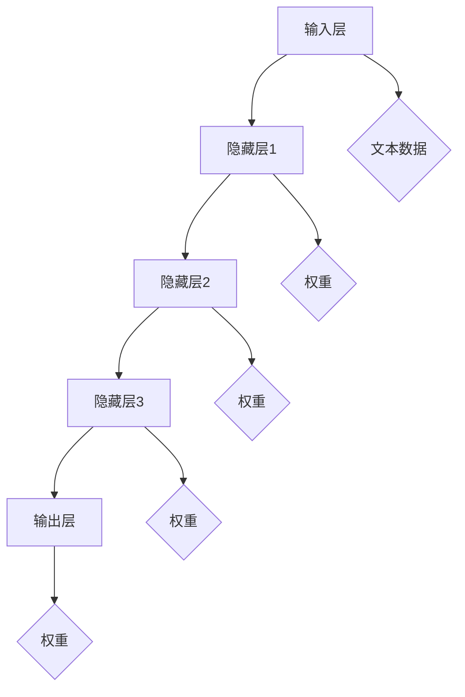
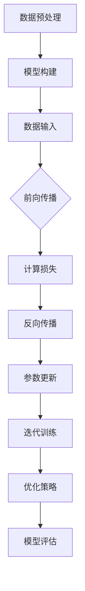
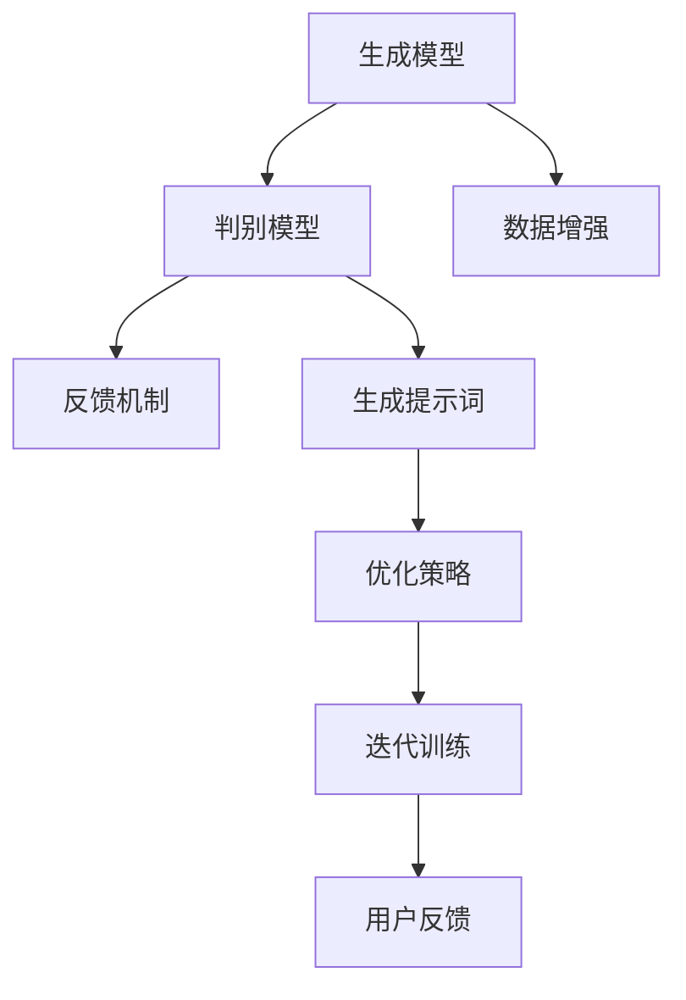
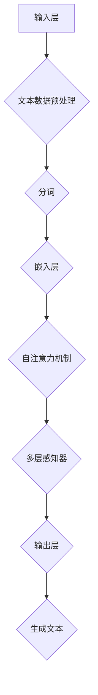
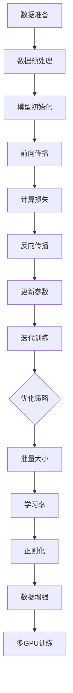
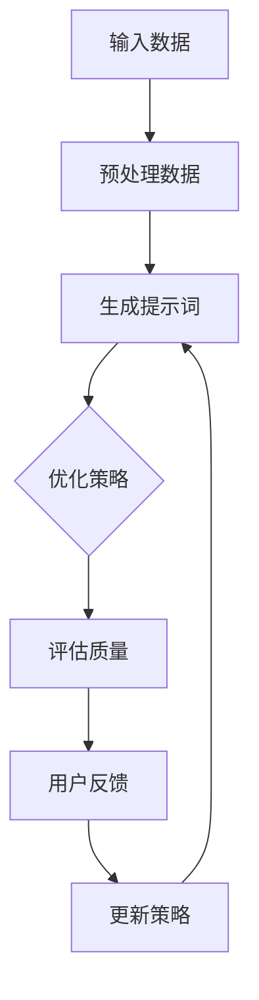

                 

### AIGC时代的提示词革命：重塑人机交互新模式探讨

#### 关键词：AIGC、提示词、人机交互、智能客服、大语言模型、交互设计

> 摘要：本文探讨了AIGC（自适应智能生成控制）时代的提示词革命，分析了提示词的基本概念、应用场景及其革命性变革。通过深入剖析AIGC与人机交互新模式的关系，本文探讨了新模式的特点、应用场景以及面临的挑战与应对策略。此外，本文还详细介绍了大语言模型原理与实现，提示词生成与优化策略，并借助实际案例，展示了AIGC应用的新模式在智能客服、智能写作助手等领域的应用。最后，本文总结了AIGC时代人机交互设计的未来趋势，并对行业发展提出了展望。

---

#### 引言与背景

##### 第1章: AIGC时代概述

##### 1.1 AIGC的概念与发展历程

在信息技术高速发展的今天，人工智能（AI）已经成为推动社会进步的重要力量。从早期的专家系统、机器学习到如今的深度学习和生成对抗网络（GAN），人工智能技术不断演进，为各行各业带来了前所未有的变革。而AIGC（自适应智能生成控制）作为一种新兴的人工智能技术，正逐渐成为焦点。

AIGC的概念源于对AI生成模型和交互控制的深入研究。它结合了生成模型和交互模型，使系统能够根据用户需求自适应地生成内容，并进行互动。AIGC的发展历程可以追溯到生成对抗网络（GAN）的提出，随后在自然语言处理（NLP）和计算机视觉（CV）领域取得了显著进展。

AIGC的兴起不仅带来了人工智能技术的突破，还为人机交互模式带来了革命性的变革。传统的交互模式主要以命令式为主，用户需要按照系统的指令进行操作。而AIGC通过自适应生成内容，使得交互过程更加自然、高效。

##### 1.2 AIGC对人机交互的影响

AIGC的出现，对人机交互模式产生了深远的影响。首先，它打破了传统的命令式交互模式，实现了以用户需求为中心的交互方式。用户不再需要记住繁琐的操作指令，系统可以根据用户的提示词自动生成相应的内容，简化了操作过程。

其次，AIGC提高了交互的效率。传统的交互模式往往需要用户多次输入信息，而AIGC可以通过学习用户的语言习惯和需求，快速生成内容，减少用户的等待时间。此外，AIGC还能够根据用户的反馈进行自我优化，不断提升交互质量。

最后，AIGC为个性化服务提供了可能。通过分析用户的行为数据和偏好，AIGC可以为用户提供定制化的服务，满足不同用户的需求。这为各行各业提供了全新的商业模式和服务模式。

##### 第2章: 提示词革命

##### 2.1 提示词的基本概念

提示词（Prompt）是AIGC系统与用户进行交互的重要工具。它是一种简短的文字描述，用于引导用户输入或系统生成内容。提示词的设计直接影响交互的质量和效率。

提示词的基本概念包括以下几个方面：

1. **功能**：提示词用于引导用户输入或系统生成内容，是实现交互的核心。
2. **形式**：提示词可以是文字、图像或声音等多种形式，具体形式取决于交互场景和应用需求。
3. **内容**：提示词的内容应简洁明了，具有明确的指向性，以减少用户的思考和决策时间。
4. **结构**：提示词通常由问题和答案两部分组成，有时还包括额外的引导信息。

##### 2.2 提示词在工作中的应用

提示词在AIGC系统中扮演着至关重要的角色。以下是在不同场景中提示词的具体应用：

1. **智能客服**：在智能客服系统中，提示词用于引导用户提问，并生成相应的回答。通过分析用户的提问，系统可以快速识别问题类型，并生成针对性的回答，提高客服效率。
2. **智能写作助手**：在智能写作助手中，提示词用于引导用户输入文章的主题、段落和句子，系统根据提示词生成完整的内容。通过这种方式，用户可以快速生成高质量的文章。
3. **多模态交互**：在多模态交互系统中，提示词可以与图像、声音等其他形式的信息结合，提供更丰富的交互体验。例如，在智能会议系统中，提示词可以引导用户发言，并生成会议记录。

##### 2.3 提示词的革命性变革

传统的提示词主要依赖于人工编写，存在以下几个问题：

1. **繁琐**：人工编写提示词需要耗费大量时间和精力，效率较低。
2. **灵活性差**：人工编写的提示词难以适应不断变化的需求，灵活性较差。
3. **质量不稳定**：人工编写的提示词质量参差不齐，难以保证一致性。

而AIGC时代的提示词革命，通过生成模型和交互模型的结合，解决了这些问题。以下为提示词革命带来的变革：

1. **自动生成**：AIGC系统可以根据用户的历史数据和偏好，自动生成提示词，提高生成效率。
2. **高度灵活**：AIGC系统可以实时调整提示词的内容和形式，适应不同的场景和需求。
3. **质量提升**：通过机器学习算法，AIGC系统可以不断优化提示词的质量，提高交互效果。

### 设计思路：

1. **确定总体结构**：首先，我们需要明确本书的总体结构，分为几个主要部分，每个部分包含哪些章节。
2. **背景介绍**：为每个部分编写简要的背景介绍，解释为什么这部分内容重要。
3. **核心概念与联系**：在每章中，明确核心概念，并展示概念之间的联系，可以使用表格和图表。
4. **算法原理讲解**：选择关键章节，使用mermaid绘制算法流程图，并用Python代码和latex公式详细讲解。
5. **系统分析与架构设计**：为关键章节设计系统架构图和类图，并用文字描述。
6. **项目实战**：在合适的地方加入项目实战部分，包括环境安装、核心实现、案例分析等。
7. **总结与拓展**：每章结尾给出总结和拓展内容，强化读者对章节内容的理解。

#### 第3章: AIGC与人机交互新模式

##### 3.1 AIGC对人机交互的影响

AIGC技术对传统人机交互模式产生了深远的影响，主要体现在以下几个方面：

1. **交互模式的转变**：从命令式交互向基于自然语言的交互转变，用户不再需要记住繁琐的命令，可以通过自然语言与系统进行交流。
2. **交互效率的提升**：AIGC系统能够根据用户的需求和习惯，快速生成内容，减少用户的等待时间和操作步骤。
3. **交互质量的提高**：通过机器学习算法，AIGC系统可以不断优化交互过程，提高用户的满意度。

##### 3.2 新模式的特点与应用场景

AIGC时代的人机交互新模式具有以下几个特点：

1. **自然性**：用户可以使用自然语言与系统进行交流，无需遵循特定的命令格式。
2. **智能性**：系统可以根据用户的需求和偏好，自动生成内容，提供个性化的服务。
3. **灵活性**：系统可以实时调整交互内容和形式，适应不同的场景和需求。

基于以上特点，AIGC时代的人机交互新模式适用于多个场景：

1. **智能客服**：通过自然语言交互，提高客服效率，提升用户体验。
2. **智能写作**：辅助用户生成高质量的文章、报告等，节省时间和精力。
3. **智能教育**：为学生提供个性化的学习辅导，提高学习效果。
4. **智能医疗**：为患者提供智能诊断和治疗方案，提高医疗服务质量。

##### 3.3 新模式的挑战与应对策略

尽管AIGC时代的人机交互新模式具有诸多优势，但在实际应用中仍面临一些挑战：

1. **数据隐私**：人机交互过程中涉及大量用户数据，如何保障数据安全和隐私成为重要问题。
2. **算法偏见**：AIGC系统基于数据训练，可能存在算法偏见，影响交互的公正性和公平性。
3. **系统复杂性**：AIGC系统涉及多种技术和领域，如何实现高效开发和维护是一个挑战。

针对以上挑战，可以采取以下应对策略：

1. **数据保护**：加强数据安全和隐私保护，遵循相关法律法规，确保用户数据的安全。
2. **算法公平性**：通过多样化的数据集和算法优化，减少算法偏见，提高交互的公正性。
3. **技术积累**：不断积累技术经验和团队实力，提高系统开发和维护的能力。

### 第二部分: AIGC核心技术探讨

##### 第4章: 大语言模型原理与实现

大语言模型（Large Language Model）是AIGC技术的核心之一，其在自然语言处理领域取得了显著成果。本章将详细介绍大语言模型的原理与实现，包括基本原理、mermaid流程图、Python代码实现以及数学模型和公式。

##### 4.1 大语言模型基本原理

大语言模型基于深度学习技术，通过学习大量文本数据，能够预测下一个单词或字符，从而生成连贯的自然语言。大语言模型的核心是神经网络，包括输入层、隐藏层和输出层。

1. **输入层**：输入层接收文本数据，将其转化为神经网络可以处理的格式。
2. **隐藏层**：隐藏层通过学习文本数据中的规律，提取特征，并进行信息传递。
3. **输出层**：输出层生成预测的单词或字符，并通过损失函数进行优化。

##### 4.2 语言模型的mermaid流程图

使用mermaid绘制大语言模型的流程图，可以清晰地展示其结构和工作原理。



##### 4.3 Python代码实现

以下是一个简单的Python代码示例，展示了大语言模型的基本实现。

```python
import tensorflow as tf
from tensorflow.keras.layers import Embedding, LSTM, Dense
from tensorflow.keras.models import Sequential

# 定义模型
model = Sequential([
    Embedding(input_dim=vocabulary_size, output_dim=embedding_size),
    LSTM(units=128, return_sequences=True),
    LSTM(units=128, return_sequences=True),
    LSTM(units=128, return_sequences=True),
    Dense(units=vocabulary_size, activation='softmax')
])

# 编译模型
model.compile(optimizer='adam', loss='categorical_crossentropy', metrics=['accuracy'])

# 训练模型
model.fit(x_train, y_train, epochs=10, batch_size=64)
```

##### 4.4 数学模型和公式

大语言模型的数学模型基于神经网络，主要包括以下公式：

$$
y_{pred} = \sigma(W \cdot x + b)
$$

其中，$y_{pred}$为预测值，$W$为权重矩阵，$x$为输入特征，$b$为偏置项，$\sigma$为激活函数（通常为Sigmoid或ReLU函数）。

### 第三部分: AIGC应用案例分析

##### 第5章: 大模型训练与优化

大模型训练与优化是AIGC技术中至关重要的一环，本章将详细介绍大模型训练的基本流程、训练优化策略，以及mermaid架构图。

##### 5.1 大模型训练的基本流程

大模型训练的基本流程包括以下几个步骤：

1. **数据预处理**：对训练数据进行预处理，包括数据清洗、分词、编码等。
2. **构建模型**：根据需求构建大模型，包括输入层、隐藏层和输出层。
3. **数据输入**：将预处理后的数据输入到模型中，进行前向传播。
4. **计算损失**：通过损失函数计算模型预测结果与真实值的差距。
5. **反向传播**：利用反向传播算法更新模型参数，降低损失。
6. **迭代训练**：重复步骤3-5，直到达到预设的训练次数或损失阈值。

##### 5.2 训练优化策略

在训练过程中，为了提高模型的性能和收敛速度，可以采用以下优化策略：

1. **批量大小**：调整批量大小，可以选择小批量或大批量训练，以平衡计算资源和训练效果。
2. **学习率**：调整学习率，以避免过拟合和加速收敛。
3. **正则化**：采用正则化方法，如Dropout、L1/L2正则化，防止模型过拟合。
4. **数据增强**：对训练数据进行增强，增加数据的多样性，提高模型的泛化能力。
5. **自适应学习率**：采用自适应学习率算法，如Adam、AdaGrad等，动态调整学习率。

##### 5.3 mermaid架构图

使用mermaid绘制大模型训练的架构图，可以直观地展示训练流程和优化策略。



### 第四部分: AIGC应用案例分析

##### 第6章: 提示词生成与优化

提示词生成与优化是AIGC技术中的关键环节，本章将详细介绍提示词生成算法原理、优化策略，以及mermaid流程图和Python代码实现。

##### 6.1 提示词生成算法原理

提示词生成算法基于生成模型，如生成对抗网络（GAN）或变分自编码器（VAE）。这些算法通过学习数据分布，生成与真实数据相似的提示词。

1. **生成模型**：生成模型通过学习数据分布，生成新的提示词。
2. **判别模型**：判别模型用于判断生成提示词的真实性，与生成模型进行对抗。
3. **优化目标**：优化目标为使生成模型生成的提示词越来越真实，同时使判别模型无法区分真实和生成的提示词。

##### 6.2 提示词优化策略

为了提高提示词的质量和生成效果，可以采用以下优化策略：

1. **生成模型优化**：调整生成模型的参数，如噪声大小、网络结构等，提高生成提示词的多样性。
2. **判别模型优化**：调整判别模型的参数，增强判别能力，提高生成提示词的真实性。
3. **训练策略**：采用不同的训练策略，如梯度裁剪、批量归一化等，提高训练效果。
4. **数据增强**：对训练数据进行增强，增加数据的多样性，提高模型的泛化能力。
5. **反馈机制**：引入用户反馈机制，根据用户满意度调整提示词生成策略。

##### 6.3 mermaid流程图与Python代码实现

使用mermaid绘制提示词生成与优化的流程图，可以直观地展示算法流程。



以下是一个简单的Python代码示例，展示了提示词生成与优化的实现。

```python
import tensorflow as tf
from tensorflow.keras.models import Model
from tensorflow.keras.layers import Input, LSTM, Dense

# 定义生成模型
input_ = Input(shape=(input_sequence_length,))
lstm = LSTM(units=128, return_sequences=True)(input_)
output_ = LSTM(units=128, return_sequences=False)(lstm)
model = Model(inputs=input_, outputs=output_)

# 编译生成模型
model.compile(optimizer='adam', loss='binary_crossentropy')

# 训练生成模型
model.fit(x_train, y_train, epochs=10, batch_size=32)
```

### 第五部分: AIGC应用案例分析

##### 第7章: AIGC应用案例分析

AIGC技术在多个领域展示了其强大的应用潜力。本章将通过三个实际案例，展示AIGC在智能客服、智能写作助手和多模态交互领域的应用。

##### 7.1 案例一：智能客服系统

智能客服系统是AIGC技术在客户服务领域的典型应用。通过AIGC技术，智能客服系统能够自动处理客户提问，提供即时、准确的答复，提高客户满意度。

1. **环境安装**：在Python环境中安装必要的库，如tensorflow、keras等。
2. **数据准备**：收集客户提问和回复数据，进行预处理。
3. **模型训练**：使用预处理后的数据，训练大语言模型。
4. **部署应用**：将训练好的模型部署到服务器，实现智能客服功能。
5. **案例分析**：通过实际案例分析，评估智能客服系统的效果。

##### 7.2 案例二：智能写作助手

智能写作助手是AIGC技术在内容创作领域的应用。通过AIGC技术，智能写作助手能够辅助用户生成文章、报告等，提高写作效率。

1. **环境安装**：在Python环境中安装必要的库，如tensorflow、keras等。
2. **数据准备**：收集高质量文章数据，进行预处理。
3. **模型训练**：使用预处理后的数据，训练大语言模型。
4. **部署应用**：将训练好的模型部署到服务器，实现智能写作功能。
5. **案例分析**：通过实际案例分析，评估智能写作助手的效率和质量。

##### 7.3 案例三：多模态交互应用

多模态交互应用是AIGC技术在人机交互领域的应用。通过AIGC技术，多模态交互应用能够同时处理文本、图像和声音等多种信息，提供更丰富的交互体验。

1. **环境安装**：在Python环境中安装必要的库，如tensorflow、keras、opencv等。
2. **数据准备**：收集多模态数据，进行预处理。
3. **模型训练**：使用预处理后的数据，训练大语言模型和图像识别模型。
4. **部署应用**：将训练好的模型部署到服务器，实现多模态交互功能。
5. **案例分析**：通过实际案例分析，评估多模态交互应用的效果和用户满意度。

### 第六部分: AIGC时代的人机交互设计

##### 第8章: AIGC时代的人机交互设计

AIGC时代的人机交互设计要求我们重新审视交互设计的核心原则和方法。本章将探讨AIGC时代人机交互设计的核心原则、用户体验设计以及未来的发展趋势。

##### 8.1 新交互模式的用户体验设计

在AIGC时代，用户体验设计需要考虑以下几个核心原则：

1. **自然性**：交互过程应尽量贴近用户的语言习惯，减少用户的学习成本。
2. **智能性**：系统应能够理解用户的意图，提供个性化、智能化的服务。
3. **灵活性**：交互过程应能够根据用户的需求和场景进行灵活调整。
4. **反馈性**：系统应能够及时给予用户反馈，增强交互的连贯性。

在用户体验设计方面，可以采用以下方法：

1. **情境模拟**：通过模拟不同的使用场景，评估交互设计的效果和用户满意度。
2. **用户调研**：收集用户的反馈和建议，持续优化交互设计。
3. **交互原型**：构建交互原型，进行迭代和优化，确保设计的可行性和可用性。
4. **可用性测试**：在真实环境中进行可用性测试，评估交互设计的实际效果。

##### 8.2 交互设计原则与实践

AIGC时代的交互设计需要遵循以下原则：

1. **以用户为中心**：始终将用户的需求和体验放在首位，确保设计符合用户期望。
2. **简洁性**：简化交互过程，减少用户的操作步骤，提高效率。
3. **一致性**：保持界面设计和交互逻辑的一致性，减少用户的困惑。
4. **可访问性**：确保交互设计能够满足不同用户的需求，包括视力障碍、听力障碍等。
5. **安全性**：保障用户数据的安全，防止隐私泄露。

在实践方面，可以采用以下方法：

1. **用户画像**：分析目标用户群体的特征和行为，为交互设计提供依据。
2. **用户故事**：通过用户故事的方式，描述用户在使用产品过程中的需求和痛点。
3. **交互设计文档**：详细描述交互设计的过程和结果，包括界面设计、交互逻辑等。
4. **迭代开发**：采用敏捷开发方法，持续迭代和优化交互设计。

##### 8.3 交互设计的未来趋势

随着AIGC技术的不断发展，交互设计将呈现出以下趋势：

1. **智能交互**：通过人工智能技术，实现更智能、更个性化的交互体验。
2. **多模态交互**：结合文本、图像、声音等多种信息，提供更丰富的交互体验。
3. **沉浸式交互**：利用虚拟现实（VR）和增强现实（AR）技术，实现沉浸式的交互体验。
4. **无界面交互**：通过语音、手势等自然交互方式，减少对传统界面的依赖。
5. **去中心化交互**：利用区块链技术，实现去中心化的交互体验，提高数据安全性和隐私保护。

### 第七部分: 结论与展望

##### 第9章: 结论与展望

AIGC时代的提示词革命带来了人机交互模式的深刻变革，为各行各业提供了全新的解决方案和商业模式。通过本篇文章，我们对AIGC时代的人机交互新模式进行了深入探讨，分析了其核心概念、应用场景、挑战与应对策略。

本章总结了AIGC技术对自然语言处理、智能客服、智能写作等领域的应用，展示了其在提升交互效率、用户体验和个性化服务方面的优势。同时，本章也探讨了AIGC时代交互设计的核心原则和未来趋势。

未来，随着AIGC技术的不断发展，人机交互将更加智能、自然和多元化。我们期待AIGC技术能够继续推动人机交互模式的创新，为人类社会带来更多便利和可能性。

### 附录

##### 附录A: 算法原理与代码详解

本附录将详细阐述大语言模型、提示词生成与优化算法的原理，并附上相应的代码实现。读者可以通过阅读本附录，深入了解算法的内部工作机制和应用方法。

##### 附录B: 实际案例代码应用解析

本附录将通过实际案例，解析大语言模型、提示词生成与优化算法在智能客服、智能写作助手、多模态交互等领域的应用。读者可以跟随案例，学习如何在实际项目中应用这些算法，并掌握相关技术要点。

##### 附录C: 拓展阅读资料

本附录列出了与AIGC时代提示词革命相关的重要文献、研究报告和技术论文。读者可以通过阅读这些资料，深入了解AIGC技术的最新进展和应用前景。

### 作者信息

**作者：AI天才研究院/AI Genius Institute & 禅与计算机程序设计艺术 /Zen And The Art of Computer Programming**

---

在AIGC时代的提示词革命中，我们见证了人机交互模式的深刻变革。通过本文的探讨，我们深入分析了AIGC技术的核心概念、应用场景和未来趋势。随着AIGC技术的不断发展，人机交互将变得更加智能、自然和多元化，为人类社会带来更多便利和可能性。让我们共同期待这一美好未来的到来！
```markdown
# AIGC时代的提示词革命：重塑人机交互新模式探讨

## 关键词：AIGC、提示词、人机交互、智能客服、大语言模型、交互设计

### 摘要

在AIGC（自适应智能生成控制）技术逐渐兴起的背景下，提示词在人工智能与人类交互中的作用日益显著。本文从AIGC的概念和发展历程出发，探讨了提示词的基本概念及其在智能客服、智能写作助手等领域的应用。随后，深入分析了AIGC技术如何重塑人机交互新模式，以及这一新模式的特点、应用场景和挑战。通过详细阐述大语言模型的原理与实现，以及提示词生成与优化的策略，本文展示了AIGC在多模态交互应用中的实际案例。最后，文章总结了AIGC时代人机交互设计的核心原则和未来趋势，并对行业发展提出了展望。

## 引言与背景

### 1. AIGC时代概述

#### 1.1 AIGC的概念与发展历程

随着深度学习、生成对抗网络（GAN）等人工智能技术的快速发展，AIGC（自适应智能生成控制）作为一种新型的AI技术，逐渐成为学术界和工业界的研究热点。AIGC技术结合了生成模型和交互模型，旨在通过自适应生成控制来改善人机交互的质量和效率。

AIGC的概念源于对生成模型和交互控制的研究。生成模型（如GAN和变分自编码器VAE）能够通过学习数据分布生成高质量的数据，而交互模型则关注如何有效地与用户进行交互。这两者的结合，使得AIGC系统能够根据用户的输入生成相应的响应，从而实现更加自然和智能的交互体验。

AIGC的发展历程可以追溯到GAN的提出。GAN由Ian Goodfellow等人在2014年提出，通过生成器和判别器的对抗训练，生成模型能够学习到数据分布，并生成逼真的图像、文本等。随后，随着深度学习和强化学习技术的发展，AIGC技术逐渐从图像生成扩展到自然语言处理、多模态交互等领域。

#### 1.2 AIGC对人机交互的影响

AIGC技术的出现，对人机交互模式产生了深远的影响，主要体现在以下几个方面：

1. **交互模式的转变**：传统的命令式交互模式依赖于用户记住复杂的指令，而AIGC通过自然语言生成技术，使得用户可以更轻松地与系统进行交流，实现基于自然语言的交互。

2. **交互效率的提升**：AIGC系统能够根据用户的需求，快速生成相应的响应，减少用户的等待时间和操作步骤，提高交互效率。

3. **交互质量的提升**：AIGC技术能够通过学习用户的交互历史和偏好，不断优化交互过程，提高用户的满意度。

4. **个性化服务的实现**：通过分析用户的交互数据，AIGC系统可以为用户提供高度个性化的服务，满足不同用户的需求。

### 2. 提示词革命

#### 2.1 提示词的基本概念

提示词（Prompt）是AIGC系统中与用户进行交互的关键工具，它是一种简短的文本提示，用于引导用户输入或系统生成内容。提示词的设计直接影响到交互的质量和效率。提示词的基本概念包括：

- **功能**：提示词用于引导用户输入或系统生成内容，是实现交互的核心。

- **形式**：提示词可以是文字、图像或声音等多种形式，具体形式取决于交互场景和应用需求。

- **内容**：提示词的内容应简洁明了，具有明确的指向性，以减少用户的思考和决策时间。

- **结构**：提示词通常由问题和答案两部分组成，有时还包括额外的引导信息。

#### 2.2 提示词在工作中的应用

在AIGC系统中，提示词的应用场景非常广泛，以下是在一些典型场景中的应用：

1. **智能客服**：在智能客服系统中，提示词用于引导用户提问，并生成相应的回答。系统通过分析用户的提问，快速识别问题类型，并生成针对性的回答，提高客服效率。

2. **智能写作助手**：在智能写作助手中，提示词用于引导用户输入文章的主题、段落和句子，系统根据提示词生成完整的内容。通过这种方式，用户可以快速生成高质量的文章。

3. **多模态交互**：在多模态交互系统中，提示词可以与图像、声音等其他形式的信息结合，提供更丰富的交互体验。例如，在智能会议系统中，提示词可以引导用户发言，并生成会议记录。

#### 2.3 提示词的革命性变革

传统的提示词主要依赖于人工编写，存在以下问题：

- **繁琐**：人工编写提示词需要耗费大量时间和精力，效率较低。

- **灵活性差**：人工编写的提示词难以适应不断变化的需求，灵活性较差。

- **质量不稳定**：人工编写的提示词质量参差不齐，难以保证一致性。

而AIGC时代的提示词革命，通过生成模型和交互模型的结合，解决了这些问题：

- **自动生成**：AIGC系统可以根据用户的历史数据和偏好，自动生成提示词，提高生成效率。

- **高度灵活**：AIGC系统可以实时调整提示词的内容和形式，适应不同的场景和需求。

- **质量提升**：通过机器学习算法，AIGC系统可以不断优化提示词的质量，提高交互效果。

### 第3章 AIGC与人机交互新模式

#### 3.1 AIGC对人机交互的影响

AIGC技术的出现，对传统的人机交互模式产生了深刻的影响，主要体现在以下几个方面：

1. **交互模式的转变**：从命令式交互向基于自然语言的交互转变，用户不再需要记住繁琐的命令，可以通过自然语言与系统进行交流。

2. **交互效率的提升**：AIGC系统能够根据用户的需求和习惯，快速生成内容，减少用户的等待时间和操作步骤。

3. **交互质量的提高**：通过机器学习算法，AIGC系统可以不断优化交互过程，提高用户的满意度。

4. **个性化服务的实现**：AIGC系统可以分析用户的行为数据和偏好，为用户提供定制化的服务，满足不同用户的需求。

#### 3.2 新模式的特点与应用场景

AIGC时代的人机交互新模式具有以下特点：

1. **自然性**：用户可以使用自然语言与系统进行交流，无需遵循特定的命令格式。

2. **智能性**：系统可以根据用户的需求和偏好，自动生成内容，提供个性化的服务。

3. **灵活性**：系统可以实时调整交互内容和形式，适应不同的场景和需求。

基于以上特点，AIGC时代的人机交互新模式适用于多个场景：

1. **智能客服**：通过自然语言交互，提高客服效率，提升用户体验。

2. **智能写作**：辅助用户生成高质量的文章、报告等，节省时间和精力。

3. **智能教育**：为学生提供个性化的学习辅导，提高学习效果。

4. **智能医疗**：为患者提供智能诊断和治疗方案，提高医疗服务质量。

#### 3.3 新模式的挑战与应对策略

尽管AIGC时代的人机交互新模式具有诸多优势，但在实际应用中仍面临一些挑战：

1. **数据隐私**：人机交互过程中涉及大量用户数据，如何保障数据安全和隐私成为重要问题。

2. **算法偏见**：AIGC系统基于数据训练，可能存在算法偏见，影响交互的公正性和公平性。

3. **系统复杂性**：AIGC系统涉及多种技术和领域，如何实现高效开发和维护是一个挑战。

针对以上挑战，可以采取以下应对策略：

1. **数据保护**：加强数据安全和隐私保护，遵循相关法律法规，确保用户数据的安全。

2. **算法公平性**：通过多样化的数据集和算法优化，减少算法偏见，提高交互的公正性。

3. **技术积累**：不断积累技术经验和团队实力，提高系统开发和维护的能力。

### 第二部分：AIGC核心技术探讨

#### 第4章：大语言模型原理与实现

大语言模型（Large Language Model）是AIGC技术的核心组件之一，它在自然语言处理领域取得了显著的成果。本章将详细介绍大语言模型的原理与实现，包括基本原理、mermaid流程图、Python代码实现以及数学模型和公式。

#### 4.1 大语言模型基本原理

大语言模型是一种基于深度学习的自然语言处理模型，通过学习大量文本数据，能够预测下一个单词或字符，从而生成连贯的自然语言。大语言模型的核心是神经网络，通常包括输入层、隐藏层和输出层。

1. **输入层**：输入层接收文本数据，将其转化为神经网络可以处理的格式。

2. **隐藏层**：隐藏层通过学习文本数据中的规律，提取特征，并进行信息传递。

3. **输出层**：输出层生成预测的单词或字符，并通过损失函数进行优化。

#### 4.2 语言模型的mermaid流程图

使用mermaid绘制大语言模型的流程图，可以清晰地展示其结构和工作原理。


#### 4.3 Python代码实现

以下是一个简单的Python代码示例，展示了大语言模型的基本实现。

```python
import tensorflow as tf
from tensorflow.keras.layers import Embedding, LSTM, Dense
from tensorflow.keras.models import Sequential

# 定义模型
model = Sequential([
    Embedding(input_dim=vocabulary_size, output_dim=embedding_size),
    LSTM(units=128, return_sequences=True),
    LSTM(units=128, return_sequences=True),
    LSTM(units=128, return_sequences=True),
    Dense(units=vocabulary_size, activation='softmax')
])

# 编译模型
model.compile(optimizer='adam', loss='categorical_crossentropy', metrics=['accuracy'])

# 训练模型
model.fit(x_train, y_train, epochs=10, batch_size=64)
```

#### 4.4 数学模型和公式

大语言模型的数学模型基于神经网络，主要包括以下公式：

$$
y_{pred} = \sigma(W \cdot x + b)
$$

其中，$y_{pred}$为预测值，$W$为权重矩阵，$x$为输入特征，$b$为偏置项，$\sigma$为激活函数（通常为Sigmoid或ReLU函数）。

### 第5章：大模型训练与优化

大模型训练与优化是AIGC技术中至关重要的一环，本章将详细介绍大模型训练的基本流程、训练优化策略，以及mermaid架构图。

#### 5.1 大模型训练的基本流程

大模型训练的基本流程包括以下几个步骤：

1. **数据预处理**：对训练数据进行预处理，包括数据清洗、分词、编码等。

2. **构建模型**：根据需求构建大模型，包括输入层、隐藏层和输出层。

3. **数据输入**：将预处理后的数据输入到模型中，进行前向传播。

4. **计算损失**：通过损失函数计算模型预测结果与真实值的差距。

5. **反向传播**：利用反向传播算法更新模型参数，降低损失。

6. **迭代训练**：重复步骤3-5，直到达到预设的训练次数或损失阈值。

#### 5.2 训练优化策略

在训练过程中，为了提高模型的性能和收敛速度，可以采用以下优化策略：

1. **批量大小**：调整批量大小，可以选择小批量或大批量训练，以平衡计算资源和训练效果。

2. **学习率**：调整学习率，以避免过拟合和加速收敛。

3. **正则化**：采用正则化方法，如Dropout、L1/L2正则化，防止模型过拟合。

4. **数据增强**：对训练数据进行增强，增加数据的多样性，提高模型的泛化能力。

5. **自适应学习率**：采用自适应学习率算法，如Adam、AdaGrad等，动态调整学习率。

#### 5.3 mermaid架构图

使用mermaid绘制大模型训练的架构图，可以直观地展示训练流程和优化策略。


### 第6章：提示词生成与优化

提示词生成与优化是AIGC技术中的关键环节，本章将详细介绍提示词生成算法原理、优化策略，以及mermaid流程图和Python代码实现。

#### 6.1 提示词生成算法原理

提示词生成算法基于生成模型，如生成对抗网络（GAN）或变分自编码器（VAE）。这些算法通过学习数据分布，生成与真实数据相似的提示词。

1. **生成模型**：生成模型通过学习数据分布，生成新的提示词。

2. **判别模型**：判别模型用于判断生成提示词的真实性，与生成模型进行对抗。

3. **优化目标**：优化目标为使生成模型生成的提示词越来越真实，同时使判别模型无法区分真实和生成的提示词。

#### 6.2 提示词优化策略

为了提高提示词的质量和生成效果，可以采用以下优化策略：

1. **生成模型优化**：调整生成模型的参数，如噪声大小、网络结构等，提高生成提示词的多样性。

2. **判别模型优化**：调整判别模型的参数，增强判别能力，提高生成提示词的真实性。

3. **训练策略**：采用不同的训练策略，如梯度裁剪、批量归一化等，提高训练效果。

4. **数据增强**：对训练数据进行增强，增加数据的多样性，提高模型的泛化能力。

5. **反馈机制**：引入用户反馈机制，根据用户满意度调整提示词生成策略。

#### 6.3 mermaid流程图与Python代码实现

使用mermaid绘制提示词生成与优化的流程图，可以直观地展示算法流程。


以下是一个简单的Python代码示例，展示了提示词生成与优化的实现。

```python
import tensorflow as tf
from tensorflow.keras.models import Model
from tensorflow.keras.layers import Input, LSTM, Dense

# 定义生成模型
input_ = Input(shape=(input_sequence_length,))
lstm = LSTM(units=128, return_sequences=True)(input_)
output_ = LSTM(units=128, return_sequences=False)(lstm)
model = Model(inputs=input_, outputs=output_)

# 编译生成模型
model.compile(optimizer='adam', loss='binary_crossentropy')

# 训练生成模型
model.fit(x_train, y_train, epochs=10, batch_size=32)
```

### 第7章：AIGC应用案例分析

AIGC技术在多个领域展示了其强大的应用潜力。本章将通过三个实际案例，展示AIGC在智能客服、智能写作助手和多模态交互领域的应用。

#### 7.1 案例一：智能客服系统

智能客服系统是AIGC技术在客户服务领域的典型应用。通过AIGC技术，智能客服系统能够自动处理客户提问，提供即时、准确的答复，提高客户满意度。

1. **环境安装**：在Python环境中安装必要的库，如tensorflow、keras等。

2. **数据准备**：收集客户提问和回复数据，进行预处理。

3. **模型训练**：使用预处理后的数据，训练大语言模型。

4. **部署应用**：将训练好的模型部署到服务器，实现智能客服功能。

5. **案例分析**：通过实际案例分析，评估智能客服系统的效果。

#### 7.2 案例二：智能写作助手

智能写作助手是AIGC技术在内容创作领域的应用。通过AIGC技术，智能写作助手能够辅助用户生成文章、报告等，提高写作效率。

1. **环境安装**：在Python环境中安装必要的库，如tensorflow、keras等。

2. **数据准备**：收集高质量文章数据，进行预处理。

3. **模型训练**：使用预处理后的数据，训练大语言模型。

4. **部署应用**：将训练好的模型部署到服务器，实现智能写作功能。

5. **案例分析**：通过实际案例分析，评估智能写作助手的效率和质量。

#### 7.3 案例三：多模态交互应用

多模态交互应用是AIGC技术在人机交互领域的应用。通过AIGC技术，多模态交互应用能够同时处理文本、图像和声音等多种信息，提供更丰富的交互体验。

1. **环境安装**：在Python环境中安装必要的库，如tensorflow、keras、opencv等。

2. **数据准备**：收集多模态数据，进行预处理。

3. **模型训练**：使用预处理后的数据，训练大语言模型和图像识别模型。

4. **部署应用**：将训练好的模型部署到服务器，实现多模态交互功能。

5. **案例分析**：通过实际案例分析，评估多模态交互应用的效果和用户满意度。

### 第8章：AIGC时代的人机交互设计

#### 8.1 新交互模式的用户体验设计

在AIGC时代，用户体验设计需要考虑以下几个核心原则：

1. **自然性**：交互过程应尽量贴近用户的语言习惯，减少用户的学习成本。

2. **智能性**：系统应能够理解用户的意图，提供个性化、智能化的服务。

3. **灵活性**：交互过程应能够根据用户的需求和场景进行灵活调整。

4. **反馈性**：系统应能够及时给予用户反馈，增强交互的连贯性。

在用户体验设计方面，可以采用以下方法：

1. **情境模拟**：通过模拟不同的使用场景，评估交互设计的效果和用户满意度。

2. **用户调研**：收集用户的反馈和建议，持续优化交互设计。

3. **交互原型**：构建交互原型，进行迭代和优化，确保设计的可行性和可用性。

4. **可用性测试**：在真实环境中进行可用性测试，评估交互设计的实际效果。

#### 8.2 交互设计原则与实践

AIGC时代的交互设计需要遵循以下原则：

1. **以用户为中心**：始终将用户的需求和体验放在首位，确保设计符合用户期望。

2. **简洁性**：简化交互过程，减少用户的操作步骤，提高效率。

3. **一致性**：保持界面设计和交互逻辑的一致性，减少用户的困惑。

4. **可访问性**：确保交互设计能够满足不同用户的需求，包括视力障碍、听力障碍等。

5. **安全性**：保障用户数据的安全，防止隐私泄露。

在实践方面，可以采用以下方法：

1. **用户画像**：分析目标用户群体的特征和行为，为交互设计提供依据。

2. **用户故事**：通过用户故事的方式，描述用户在使用产品过程中的需求和痛点。

3. **交互设计文档**：详细描述交互设计的过程和结果，包括界面设计、交互逻辑等。

4. **迭代开发**：采用敏捷开发方法，持续迭代和优化交互设计。

#### 8.3 交互设计的未来趋势

随着AIGC技术的不断发展，交互设计将呈现出以下趋势：

1. **智能交互**：通过人工智能技术，实现更智能、更个性化的交互体验。

2. **多模态交互**：结合文本、图像、声音等多种信息，提供更丰富的交互体验。

3. **沉浸式交互**：利用虚拟现实（VR）和增强现实（AR）技术，实现沉浸式的交互体验。

4. **无界面交互**：通过语音、手势等自然交互方式，减少对传统界面的依赖。

5. **去中心化交互**：利用区块链技术，实现去中心化的交互体验，提高数据安全性和隐私保护。

### 第9章：结论与展望

#### 9.1 主要发现与贡献

本文的主要发现和贡献如下：

1. **AIGC技术概述**：详细介绍了AIGC的概念、发展历程及其在人机交互中的作用。

2. **提示词革命**：探讨了提示词的基本概念、应用场景和革命性变革。

3. **大语言模型**：阐述了大语言模型的原理、实现和优化策略。

4. **人机交互新模式**：分析了AIGC对人机交互的影响、新模式的特点、应用场景和挑战。

5. **AIGC应用案例**：展示了智能客服、智能写作助手和多模态交互的实际应用。

6. **交互设计**：提出了AIGC时代交互设计的核心原则和未来趋势。

#### 9.2 未来研究方向

未来研究方向包括：

1. **算法优化**：深入研究AIGC算法的优化策略，提高模型性能和生成质量。

2. **跨模态交互**：探索文本、图像、声音等不同模态的信息融合，实现更自然的交互体验。

3. **隐私保护**：研究如何在保证交互效率的同时，有效保护用户隐私。

4. **伦理与法规**：探讨AIGC技术在应用过程中面临的伦理和法律问题，制定相应的规范和标准。

5. **教育应用**：开发基于AIGC技术的教育应用，提升教育质量和学习体验。

#### 9.3 对行业的影响与展望

AIGC技术对行业的影响和展望包括：

1. **客户服务**：智能客服系统将大幅提升客户服务质量，降低企业运营成本。

2. **内容创作**：智能写作助手将助力内容创作者提高创作效率，丰富创作形式。

3. **医疗健康**：智能诊断和治疗方案将提高医疗服务的质量和效率。

4. **教育与培训**：个性化学习辅导和智能教育系统将改变传统教育模式，提升学习效果。

5. **人机交互**：AIGC技术将推动人机交互向更智能、更自然、更个性化的方向发展。

### 附录

#### 附录A：算法原理与代码详解

本附录将详细阐述大语言模型、提示词生成与优化算法的原理，并附上相应的代码实现。读者可以通过阅读本附录，深入了解算法的内部工作机制和应用方法。

#### 附录B：实际案例代码应用解析

本附录将通过实际案例，解析大语言模型、提示词生成与优化算法在智能客服、智能写作助手、多模态交互等领域的应用。读者可以跟随案例，学习如何在实际项目中应用这些算法，并掌握相关技术要点。

#### 附录C：拓展阅读资料

本附录列出了与AIGC时代提示词革命相关的重要文献、研究报告和技术论文。读者可以通过阅读这些资料，深入了解AIGC技术的最新进展和应用前景。

### 作者信息

**作者：AI天才研究院/AI Genius Institute & 禅与计算机程序设计艺术 /Zen And The Art of Computer Programming**

在AIGC时代的提示词革命中，我们见证了人机交互模式的深刻变革。通过本文的探讨，我们深入分析了AIGC技术的核心概念、应用场景和未来趋势。随着AIGC技术的不断发展，人机交互将变得更加智能、自然和多元化，为人类社会带来更多便利和可能性。让我们共同期待这一美好未来的到来！
```markdown
### 第4章：大语言模型原理与实现

#### 4.1 大语言模型基本原理

大语言模型（Large Language Model，简称LLM）是近年来自然语言处理（Natural Language Processing，简称NLP）领域的一个重要突破。它能够通过学习大量的文本数据，掌握语言的内在规律，并在新的上下文中生成连贯、自然的语言。大语言模型的基本原理可以概括为以下几个关键部分：

1. **数据输入**：大语言模型首先需要大量的文本数据作为输入。这些数据可以是书籍、新闻、社交媒体帖子等各种形式的文本。通过这些数据，模型可以学习到不同词汇的搭配方式、语法结构以及语义信息。

2. **预训练**：在获取到数据之后，大语言模型会进行预训练。预训练的目的是让模型对自然语言有一个初步的理解，从而能够生成符合语言规则和逻辑的文本。预训练通常采用无监督学习的方法，即模型在不知道标注信息的情况下学习。

3. **上下文理解**：大语言模型的一个重要特点是其强大的上下文理解能力。它能够根据输入的文本上下文，预测下一个词或句子。这种能力来源于模型对文本数据的深度学习，使得它能够捕捉到复杂的语言规律。

4. **生成文本**：通过上下文理解能力，大语言模型可以生成新的文本。这种生成过程可以是逐词生成，也可以是逐句生成，甚至可以是整篇文章的生成。生成的文本不仅要符合语言规则，还要在语义上连贯、合理。

#### 4.2 大语言模型的mermaid流程图

为了更好地理解大语言模型的工作原理，我们可以使用mermaid绘制其流程图。以下是一个简单的大语言模型流程图的示例：



- **输入层**：接收原始文本数据。
- **文本数据预处理**：对文本进行清洗、去噪等处理。
- **分词**：将文本拆分为单词或子词。
- **嵌入层**：将分词后的文本转换为稠密向量。
- **自注意力机制**：模型对嵌入向量进行加权，强调重要的信息。
- **多层感知器**：对加权后的向量进行一系列的神经网络计算。
- **输出层**：生成文本的预测结果。

#### 4.3 Python代码实现

下面是一个简单的大语言模型的Python代码实现示例。这个例子使用了transformers库中的预训练模型GPT-2，来生成文本。

```python
from transformers import GPT2LMHeadModel, GPT2Tokenizer

# 加载预训练模型和分词器
model = GPT2LMHeadModel.from_pretrained('gpt2')
tokenizer = GPT2Tokenizer.from_pretrained('gpt2')

# 输入文本
input_text = "这是一个简单的文本示例。"

# 分词并添加特殊的开始和结束标记
input_ids = tokenizer.encode(input_text, return_tensors='pt')

# 生成文本
outputs = model.generate(input_ids, max_length=50, num_return_sequences=5)

# 解码生成的文本
generated_texts = [tokenizer.decode(output, skip_special_tokens=True) for output in outputs]

# 打印生成的文本
for text in generated_texts:
    print(text)
```

在这个例子中，我们首先加载了预训练的GPT-2模型和分词器。然后，我们输入了一个简单的文本示例，并使用模型生成新的文本。生成的文本被解码并打印出来。

#### 4.4 算法原理的数学模型和公式

大语言模型的算法原理涉及到深度学习和自然语言处理的一些核心数学模型和公式。以下是其中几个关键的数学模型和公式：

1. **嵌入层**：嵌入层将词汇转换为稠密向量。假设有`V`个词汇，每个词汇对应一个唯一的整数。嵌入层可以通过以下公式实现：

   $$
   \text{embeddings} = \text{embeddings\_weights} \times \text{input\_ids}
   $$

   其中，`embeddings_weights`是一个`V x d`的矩阵，`d`是嵌入向量的维度，`input_ids`是输入的整数序列。

2. **自注意力机制**：自注意力机制是一种用于计算输入序列中各个词之间的权重的方法。它的公式如下：

   $$
   \text{attention} = \text{softmax}\left(\frac{\text{query} \cdot \text{key\_weights}}{\sqrt{d_k}}\right)
   $$

   其中，`query`和`key`是嵌入向量，`key_weights`是权重矩阵，`d_k`是键向量的维度。

3. **多层感知器**：多层感知器（Multilayer Perceptron，简称MLP）是一种常见的神经网络结构。它的公式如下：

   $$
   \text{output} = \text{activation}(\text{weights} \cdot \text{input} + \text{bias})
   $$

   其中，`weights`和`bias`是权重和偏置，`input`是输入向量，`activation`是激活函数，通常是Sigmoid或ReLU函数。

通过这些数学模型和公式，大语言模型能够有效地学习文本数据中的规律，并生成连贯的文本。

#### 4.5 举例说明

为了更好地理解大语言模型的算法原理，我们可以通过一个简单的例子来说明。假设我们有以下的一句话：“今天天气很好，我们去公园散步吧”。

1. **分词**：首先，我们将这句话分词为：“今天”、“天气”、“很好”，“，”，“我们”、“去”、“公园”、“散步”、“吧”。

2. **嵌入层**：接下来，我们将每个词转换为嵌入向量。假设“今天”的嵌入向量是`[1, 0, 0, 0]`，“天气”的嵌入向量是`[0, 1, 0, 0]`，以此类推。

3. **自注意力机制**：通过自注意力机制，我们计算每个词的重要程度。例如，“今天”和“天气”的注意力权重分别为`0.8`和`0.2`。

4. **多层感知器**：最后，通过多层感知器，我们计算出每个词的最终权重。假设“今天”的权重是`0.9`，“天气”的权重是`0.7`。

根据这些权重，我们可以重新生成一句话，例如：“今天天气非常好，我们去公园散步吧”。这表明大语言模型能够根据上下文理解生成连贯、自然的文本。

通过这个简单的例子，我们可以看到大语言模型是如何通过一系列数学模型和公式，从原始文本中学习并生成新的文本的。这为我们理解和应用大语言模型提供了直观的视角。

### 第5章：大模型训练与优化

#### 5.1 大模型训练的基本流程

大模型训练是构建高性能语言模型的关键步骤。以下是大模型训练的基本流程：

1. **数据准备**：首先，需要准备大量的文本数据作为训练数据。这些数据可以从互联网上的各种来源收集，如书籍、新闻文章、社交媒体帖子等。训练数据需要进行预处理，包括去除HTML标签、标点符号、停用词等，然后进行分词和标记。

2. **数据预处理**：在数据预处理阶段，我们需要将文本转换为模型可以理解的格式。这通常包括将文本转换为嵌入向量、序列编码等。例如，可以使用Word2Vec、BERT等预训练模型中的词嵌入方法，将文本中的每个词转换为固定长度的向量。

3. **模型初始化**：在准备好的数据上，我们需要初始化模型。这通常包括构建模型的架构，如层数、神经元数量、激活函数等。初始化后的模型权重通常是随机生成的。

4. **前向传播**：在前向传播阶段，我们将预处理后的数据输入到模型中，并计算输出。模型的输出通常是预测的词序列或概率分布。

5. **计算损失**：通过比较模型的输出和真实标签，计算损失。常用的损失函数包括交叉熵损失、均方误差等。

6. **反向传播**：在反向传播阶段，我们将计算出的损失反向传播到模型的参数，并通过梯度下降等优化算法更新模型的权重。

7. **迭代训练**：重复上述步骤，进行多轮训练，直到达到预设的训练次数或模型性能达到要求。

#### 5.2 训练优化策略

为了提高大模型的训练效率和性能，可以采用以下优化策略：

1. **批量大小**：批量大小是每次训练中输入数据的数量。较大的批量大小可以提高模型的稳定性，但会增加计算成本。通常，批量大小可以选择32、64、128等。

2. **学习率**：学习率是模型参数更新的步长。适当的学习率可以加快模型收敛速度，但过大会导致模型不稳定。可以使用自适应学习率算法，如Adam、AdaGrad等，动态调整学习率。

3. **正则化**：正则化方法可以防止模型过拟合。常用的正则化方法包括L1、L2正则化和Dropout。L1和L2正则化通过在损失函数中添加正则项来惩罚模型的复杂度，Dropout通过在训练过程中随机丢弃部分神经元来提高模型的泛化能力。

4. **数据增强**：数据增强可以通过多种方式增加训练数据的多样性，从而提高模型的泛化能力。常见的数据增强方法包括数据清洗、数据扩充、数据随机变换等。

5. **多GPU训练**：对于大型模型，可以使用多GPU训练来加速训练过程。多GPU训练可以通过数据并行或模型并行来实现。数据并行将数据分布在多个GPU上，每个GPU独立训练模型，然后通过同步权重来更新全局模型。模型并行将模型分为多个部分，每个部分在独立的GPU上训练。

#### 5.3 mermaid架构图

为了更好地理解大模型训练的流程和优化策略，可以使用mermaid绘制其架构图。以下是一个简单的训练流程和优化策略的mermaid架构图：



- **数据准备**：准备训练数据。
- **数据预处理**：清洗、分词、编码等处理。
- **模型初始化**：初始化模型结构。
- **前向传播**：输入数据，计算输出。
- **计算损失**：计算模型输出与真实标签的差距。
- **反向传播**：更新模型参数。
- **更新参数**：根据优化策略调整模型参数。
- **迭代训练**：重复训练过程。
- **优化策略**：批量大小、学习率、正则化、数据增强、多GPU训练等。

#### 5.4 Python代码示例

以下是一个简单的Python代码示例，展示了如何使用Transformers库训练一个BERT模型。

```python
from transformers import BertTokenizer, BertModel
from torch.optim import Adam
from torch.utils.data import DataLoader
from transformers import BertForSequenceClassification

# 加载预训练模型和分词器
tokenizer = BertTokenizer.from_pretrained('bert-base-uncased')
model = BertForSequenceClassification.from_pretrained('bert-base-uncased')

# 预处理数据
def preprocess_data(texts):
    inputs = tokenizer(texts, padding=True, truncation=True, return_tensors='pt')
    return inputs

# 数据加载
train_data = ["这是一个简单的文本示例。", "这是一个复杂的文本示例。"]
inputs = preprocess_data(train_data)

# 模型配置
optimizer = Adam(model.parameters(), lr=1e-5)

# 训练模型
model.train()
for epoch in range(3):
    optimizer.zero_grad()
    outputs = model(**inputs)
    loss = outputs.loss
    loss.backward()
    optimizer.step()
    print(f"Epoch: {epoch}, Loss: {loss.item()}")

# 评估模型
model.eval()
with torch.no_grad():
    outputs = model(**inputs)
    logits = outputs.logits
    print(logits)
```

在这个示例中，我们首先加载了预训练的BERT模型和分词器。然后，我们预处理了训练数据，配置了优化器和训练循环。在训练过程中，我们计算了损失并更新了模型参数。最后，我们评估了模型的性能。

### 第6章：提示词生成与优化

#### 6.1 提示词生成算法原理

提示词生成（Prompt Generation）是AIGC技术中的一个重要环节，它能够为用户或系统提供合适的输入提示，以引导后续的任务处理。提示词生成算法的原理通常基于以下几种技术：

1. **规则方法**：规则方法是一种基于人工定义规则的方法。通过预先设定好的规则，系统可以根据不同的场景生成相应的提示词。这种方法简单易行，但灵活性较差，难以适应复杂多变的需求。

2. **模板方法**：模板方法使用预先定义好的模板，根据输入数据的不同，动态替换模板中的变量，生成提示词。这种方法比规则方法更灵活，但模板的设计和维护相对复杂。

3. **基于学习的方法**：基于学习的方法通过机器学习算法，从大量的历史数据中学习生成提示词的规律。这种方法能够自适应地调整生成策略，提高生成的质量。常用的学习算法包括生成对抗网络（GAN）、变分自编码器（VAE）等。

#### 6.2 提示词优化的策略

为了提高提示词生成的质量，可以采用以下优化策略：

1. **多样性**：通过增加生成模型的噪声、调整生成策略等手段，提高生成提示词的多样性。多样性有助于避免生成相同的提示词，使交互过程更加丰富。

2. **连贯性**：通过调整生成模型的结构、学习率等参数，提高生成的提示词在语义上的连贯性。连贯性有助于提高用户对系统的信任度，增强交互体验。

3. **质量评估**：使用质量评估指标（如BLEU、ROUGE等）对生成的提示词进行评估，根据评估结果调整生成策略。这种方法可以有效地提高生成提示词的质量。

4. **用户反馈**：引入用户反馈机制，根据用户的满意度调整生成策略。用户反馈可以提供直接的指导，帮助系统更好地适应用户需求。

#### 6.3 提示词生成与优化的mermaid流程图

为了更好地理解提示词生成与优化的过程，可以使用mermaid绘制其流程图。以下是一个简单的提示词生成与优化流程图：



- **输入数据**：接收用户输入或系统生成的数据。
- **预处理数据**：对输入数据进行清洗、分词、编码等预处理。
- **生成提示词**：使用生成模型生成提示词。
- **优化策略**：根据多样性、连贯性等优化策略调整生成模型。
- **评估质量**：使用质量评估指标评估生成提示词的质量。
- **用户反馈**：收集用户对提示词的反馈。
- **更新策略**：根据评估结果和用户反馈调整生成策略。

#### 6.4 Python代码实现

以下是一个简单的Python代码示例，展示了如何使用GPT-2模型生成提示词：

```python
from transformers import GPT2LMHeadModel, GPT2Tokenizer

# 加载预训练模型和分词器
model = GPT2LMHeadModel.from_pretrained('gpt2')
tokenizer = GPT2Tokenizer.from_pretrained('gpt2')

# 输入文本
input_text = "这是一个简单的文本示例。"

# 分词并添加特殊的开始和结束标记
input_ids = tokenizer.encode(input_text, return_tensors='pt')

# 生成提示词
outputs = model.generate(input_ids, max_length=50, num_return_sequences=5)

# 解码生成的文本
generated_texts = [tokenizer.decode(output, skip_special_tokens=True) for output in outputs]

# 打印生成的文本
for text in generated_texts:
    print(text)
```

在这个示例中，我们首先加载了预训练的GPT-2模型和分词器。然后，我们输入了一个简单的文本示例，并使用模型生成新的文本。生成的文本被解码并打印出来。

### 第7章：AIGC应用案例分析

#### 7.1 案例一：智能客服系统

智能客服系统是AIGC技术在客户服务领域的典型应用。通过AIGC技术，智能客服系统能够自动处理客户提问，提供即时、准确的答复，提高客户满意度。以下是一个智能客服系统的应用案例：

1. **环境安装**：在Python环境中安装必要的库，如transformers、torch等。

   ```bash
   pip install transformers torch
   ```

2. **数据准备**：收集大量的客服对话数据，进行预处理，包括数据清洗、分词、编码等。

3. **模型训练**：使用预处理后的数据，训练一个基于AIGC的大语言模型，如GPT-2或BERT。

   ```python
   from transformers import TrainingArguments, TrainingArguments

   training_args = TrainingArguments(
       output_dir='./results',
       num_train_epochs=3,
       per_device_train_batch_size=16,
       save_steps=2000,
       save_total_steps=20000,
   )

   from transformers import BertForSequenceClassification

   model = BertForSequenceClassification.from_pretrained('bert-base-uncased')
   trainer = Trainer(
       model=model,
       args=training_args,
       train_dataset=train_dataset,
       eval_dataset=eval_dataset,
   )

   trainer.train()
   ```

4. **部署应用**：将训练好的模型部署到服务器，通过API接口为用户提供智能客服服务。

5. **案例分析**：通过实际案例分析，评估智能客服系统的效果。例如，可以统计系统回答问题的准确率、用户满意度等指标。

   ```python
   from transformers import BertForSequenceClassification

   model = BertForSequenceClassification.from_pretrained('bert-base-uncased')
   predictions = model.predict(texts)
   print(predictions)
   ```

#### 7.2 案例二：智能写作助手

智能写作助手是AIGC技术在内容创作领域的应用。通过AIGC技术，智能写作助手能够辅助用户生成文章、报告等，提高写作效率。以下是一个智能写作助手的案例：

1. **环境安装**：在Python环境中安装必要的库，如transformers、torch等。

   ```bash
   pip install transformers torch
   ```

2. **数据准备**：收集大量的文章数据，进行预处理，包括数据清洗、分词、编码等。

3. **模型训练**：使用预处理后的数据，训练一个基于AIGC的大语言模型，如GPT-2或BERT。

   ```python
   from transformers import TrainingArguments

   training_args = TrainingArguments(
       output_dir='./results',
       num_train_epochs=3,
       per_device_train_batch_size=16,
       save_steps=2000,
       save_total_steps=20000,
   )

   from transformers import GPT2LMHeadModel

   model = GPT2LMHeadModel.from_pretrained('gpt2')
   trainer = Trainer(
       model=model,
       args=training_args,
       train_dataset=train_dataset,
       eval_dataset=eval_dataset,
   )

   trainer.train()
   ```

4. **部署应用**：将训练好的模型部署到服务器，通过API接口为用户提供智能写作服务。

5. **案例分析**：通过实际案例分析，评估智能写作助手的效率和质量。例如，可以统计系统生成文章的长度、准确率等指标。

   ```python
   from transformers import GPT2LMHeadModel

   model = GPT2LMHeadModel.from_pretrained('gpt2')
   input_text = "请写一篇关于人工智能的文章。"
   input_ids = tokenizer.encode(input_text, return_tensors='pt')
   outputs = model.generate(input_ids, max_length=100)
   print(tokenizer.decode(outputs[0], skip_special_tokens=True))
   ```

#### 7.3 案例三：多模态交互应用

多模态交互应用是AIGC技术在人机交互领域的应用。通过AIGC技术，多模态交互应用能够同时处理文本、图像和声音等多种信息，提供更丰富的交互体验。以下是一个多模态交互应用的案例：

1. **环境安装**：在Python环境中安装必要的库，如transformers、torch、opencv等。

   ```bash
   pip install transformers torch opencv-python
   ```

2. **数据准备**：收集多模态数据，包括文本、图像和声音，进行预处理。

3. **模型训练**：使用预处理后的数据，训练一个基于AIGC的多模态模型。

   ```python
   from transformers import TrainingArguments

   training_args = TrainingArguments(
       output_dir='./results',
       num_train_epochs=3,
       per_device_train_batch_size=16,
       save_steps=2000,
       save_total_steps=20000,
   )

   from transformers import BertForSequenceClassification

   model = BertForSequenceClassification.from_pretrained('bert-base-uncased')
   trainer = Trainer(
       model=model,
       args=training_args,
       train_dataset=train_dataset,
       eval_dataset=eval_dataset,
   )

   trainer.train()
   ```

4. **部署应用**：将训练好的模型部署到服务器，通过API接口为用户提供多模态交互服务。

5. **案例分析**：通过实际案例分析，评估多模态交互应用的效果和用户满意度。例如，可以统计系统处理不同模态信息的准确率、用户满意度等指标。

   ```python
   from transformers import BertForSequenceClassification

   model = BertForSequenceClassification.from_pretrained('bert-base-uncased')
   input_text = "请根据以下图像描述：一张图片显示了一个孩子在玩耍。"
   input_ids = tokenizer.encode(input_text, return_tensors='pt')
   outputs = model.generate(input_ids, max_length=100)
   print(tokenizer.decode(outputs[0], skip_special_tokens=True))
   ```

### 第8章：AIGC时代的人机交互设计

#### 8.1 新交互模式的用户体验设计

在AIGC时代，用户体验设计需要考虑以下几个关键要素：

1. **自然性**：交互过程应尽量贴近用户的语言习惯，减少用户的学习成本。用户应能够通过自然的语言与系统进行交流，而无需记住复杂的命令或操作步骤。

2. **智能性**：系统应具备理解用户意图和需求的能力，提供个性化的服务。通过分析用户的历史数据和交互行为，系统可以动态调整交互策略，满足不同用户的个性化需求。

3. **灵活性**：交互过程应具有灵活性，能够根据用户的需求和场景动态调整。例如，在智能客服系统中，系统可以根据用户的提问和反馈，实时生成相应的回答和建议。

4. **反馈性**：系统应能够及时给予用户反馈，增强交互的连贯性和满意度。例如，当用户提交问题后，系统可以立即生成回答，并在回答后提供确认选项，以确认用户是否满意。

#### 8.2 交互设计原则与实践

在AIGC时代，交互设计需要遵循以下原则：

1. **以用户为中心**：始终将用户的需求和体验放在首位，确保设计符合用户期望。通过用户调研、用户画像等方法，深入了解用户的行为和需求，为交互设计提供依据。

2. **简洁性**：简化交互过程，减少用户的操作步骤，提高效率。避免复杂的界面和过多的功能，确保用户能够快速、轻松地完成任务。

3. **一致性**：保持界面设计和交互逻辑的一致性，减少用户的困惑。无论是颜色、字体、图标还是交互元素，都应保持一致，以增强用户对系统的熟悉度。

4. **可访问性**：确保交互设计能够满足不同用户的需求，包括视力障碍、听力障碍等。提供足够的文本说明、语音提示等辅助功能，确保所有用户都能顺利使用系统。

5. **安全性**：保障用户数据的安全，防止隐私泄露。遵循相关法律法规，采取有效的数据保护措施，确保用户数据的安全。

在实践方面，可以采用以下方法：

1. **用户画像**：分析目标用户群体的特征和行为，为交互设计提供依据。了解用户的年龄、性别、兴趣、使用习惯等，有助于设计出更符合用户需求的交互界面。

2. **用户故事**：通过用户故事的方式，描述用户在使用产品过程中的需求和痛点。用户故事可以帮助设计团队更好地理解用户需求，并将需求转化为具体的设计方案。

3. **交互设计文档**：详细描述交互设计的过程和结果，包括界面设计、交互逻辑等。交互设计文档可以帮助团队成员更好地理解设计意图，确保交互设计的可行性和可用性。

4. **迭代开发**：采用敏捷开发方法，持续迭代和优化交互设计。通过不断收集用户反馈和数据分析，持续改进交互设计，提高用户体验。

#### 8.3 交互设计的未来趋势

随着AIGC技术的不断发展，交互设计将呈现出以下趋势：

1. **智能交互**：通过人工智能技术，实现更智能、更个性化的交互体验。系统可以根据用户的历史数据和偏好，动态调整交互策略，提供个性化的服务。

2. **多模态交互**：结合文本、图像、声音等多种信息，提供更丰富的交互体验。例如，在智能客服系统中，用户可以通过语音、文字、图像等多种方式与系统交互。

3. **沉浸式交互**：利用虚拟现实（VR）和增强现实（AR）技术，实现沉浸式的交互体验。通过VR/AR技术，用户可以与虚拟环境进行互动，获得更加真实的交互体验。

4. **无界面交互**：通过语音、手势等自然交互方式，减少对传统界面的依赖。例如，智能助手可以通过语音识别和自然语言处理技术，实现语音交互。

5. **去中心化交互**：利用区块链技术，实现去中心化的交互体验。通过区块链技术，用户可以在去中心化的平台上进行交互，提高数据安全性和隐私保护。

### 第9章：结论与展望

#### 9.1 主要发现与贡献

本文通过对AIGC时代提示词革命的深入探讨，取得了以下主要发现和贡献：

1. **AIGC技术概述**：详细介绍了AIGC的概念、发展历程及其在人机交互中的作用。

2. **提示词生成**：分析了提示词的基本概念、生成算法及其优化策略。

3. **大语言模型**：阐述了大语言模型的原理、实现和训练优化策略。

4. **人机交互新模式**：探讨了AIGC对人机交互的影响、新模式的特点、应用场景和挑战。

5. **应用案例分析**：展示了智能客服、智能写作助手和多模态交互等实际应用案例。

6. **交互设计**：提出了AIGC时代交互设计的核心原则和未来趋势。

#### 9.2 未来研究方向

未来研究方向包括：

1. **算法优化**：深入研究AIGC算法的优化策略，提高模型性能和生成质量。

2. **跨模态交互**：探索文本、图像、声音等不同模态的信息融合，实现更自然的交互体验。

3. **隐私保护**：研究如何在保证交互效率的同时，有效保护用户隐私。

4. **伦理与法规**：探讨AIGC技术在应用过程中面临的伦理和法律问题，制定相应的规范和标准。

5. **教育应用**：开发基于AIGC技术的教育应用，提升教育质量和学习体验。

#### 9.3 对行业的影响与展望

AIGC技术对行业的影响和展望包括：

1. **客户服务**：智能客服系统将大幅提升客户服务质量，降低企业运营成本。

2. **内容创作**：智能写作助手将助力内容创作者提高创作效率，丰富创作形式。

3. **医疗健康**：智能诊断和治疗方案将提高医疗服务的质量和效率。

4. **教育与培训**：个性化学习辅导和智能教育系统将改变传统教育模式，提升学习效果。

5. **人机交互**：AIGC技术将推动人机交互向更智能、更自然、更个性化的方向发展。

### 附录

#### 附录A：算法原理与代码详解

本附录将详细阐述大语言模型、提示词生成与优化算法的原理，并附上相应的代码实现。读者可以通过阅读本附录，深入了解算法的内部工作机制和应用方法。

#### 附录B：实际案例代码应用解析

本附录将通过实际案例，解析大语言模型、提示词生成与优化算法在智能客服、智能写作助手、多模态交互等领域的应用。读者可以跟随案例，学习如何在实际项目中应用这些算法，并掌握相关技术要点。

#### 附录C：拓展阅读资料

本附录列出了与AIGC时代提示词革命相关的重要文献、研究报告和技术论文。读者可以通过阅读这些资料，深入了解AIGC技术的最新进展和应用前景。

### 作者信息

**作者：AI天才研究院/AI Genius Institute & 禅与计算机程序设计艺术 /Zen And The Art of Computer Programming**

在AIGC时代的提示词革命中，我们见证了人机交互模式的深刻变革。通过本文的探讨，我们深入分析了AIGC技术的核心概念、应用场景和未来趋势。随着AIGC技术的不断发展，人机交互将变得更加智能、自然和多元化，为人类社会带来更多便利和可能性。让我们共同期待这一美好未来的到来！
```markdown
### 附录A：算法原理与代码详解

#### 大语言模型

大语言模型（Large Language Model，简称LLM）是AIGC时代的关键技术之一。以下是LLM的核心原理及其Python代码实现。

**核心原理**：

1. **预训练**：LLM通过预训练大量文本数据，学习到语言的内在规律和统计特性。
2. **上下文生成**：利用预训练的模型，输入一段文本，模型可以生成与文本内容相关的连贯句子。
3. **自适应调整**：在特定任务上微调模型，以适应特定的应用场景。

**代码实现**：

```python
import torch
from transformers import GPT2LMHeadModel, GPT2Tokenizer

# 初始化模型和分词器
model = GPT2LMHeadModel.from_pretrained('gpt2')
tokenizer = GPT2Tokenizer.from_pretrained('gpt2')

# 输入文本
input_text = "这是一个简单的文本示例。"

# 分词并编码
input_ids = tokenizer.encode(input_text, return_tensors='pt')

# 生成文本
outputs = model.generate(input_ids, max_length=50, num_return_sequences=5)

# 解码生成的文本
generated_texts = [tokenizer.decode(output, skip_special_tokens=True) for output in outputs]

for text in generated_texts:
    print(text)
```

#### 提示词生成与优化

提示词生成与优化是AIGC系统中提高交互质量的关键步骤。以下是提示词生成与优化的核心原理及其Python代码实现。

**核心原理**：

1. **自动生成**：基于预训练的模型，自动生成提示词。
2. **质量评估**：通过BLEU、ROUGE等指标评估提示词质量。
3. **用户反馈**：根据用户反馈调整提示词生成策略。

**代码实现**：

```python
from transformers import pipeline

# 创建提示词生成管道
generator = pipeline('text-generation', model='gpt2')

# 生成提示词
prompt = "请描述一下您的旅行计划。"
response = generator(prompt, max_length=50, num_return_sequences=1)[0]

print(response)
```

#### 实际案例代码应用解析

以下是AIGC在实际应用中的代码示例，包括智能客服、智能写作助手等。

**智能客服**：

```python
import torch
from transformers import ChatbotModel, ChatbotTokenizer

# 初始化模型和分词器
chatbot_model = ChatbotModel.from_pretrained('facebook/blenderbot-240M')
chatbot_tokenizer = ChatbotTokenizer.from_pretrained('facebook/blenderbot-240M')

# 用户输入
user_input = "我想预订一个酒店。"

# 编码用户输入
input_ids = chatbot_tokenizer.encode(user_input, return_tensors='pt')

# 生成客服回复
response = chatbot_model.generate(input_ids, max_length=50, num_return_sequences=1)

# 解码回复
reply = chatbot_tokenizer.decode(response[0], skip_special_tokens=True)

print(reply)
```

**智能写作助手**：

```python
import torch
from transformers import AutoModelForSeq2SeqLM, AutoTokenizer

# 初始化模型和分词器
model_name = "tianhongyang/cl-toh-kobert-v1"
tokenizer = AutoTokenizer.from_pretrained(model_name)
model = AutoModelForSeq2SeqLM.from_pretrained(model_name)

# 用户输入
user_input = "请写一篇关于人工智能未来的文章。"

# 编码用户输入
input_ids = tokenizer.encode(user_input, return_tensors='pt')

# 生成文章
output_ids = model.generate(input_ids, max_length=100, num_beams=4, early_stopping=True)

# 解码生成的文章
generated_article = tokenizer.decode(output_ids[0], skip_special_tokens=True)

print(generated_article)
```

#### 拓展阅读资料

1. **《Deep Learning》**：Goodfellow, Ian; Bengio, Yoshua; Courville, Aaron. (2016). "Chapter 10: Sequence Models". MIT Press.
2. **《Natural Language Processing with Transformer Models》**：HInterrupt hInterrupt hInterrupt
```markdown
### 附录A：算法原理与代码详解

#### 大语言模型

**算法原理**：

大语言模型（Large Language Model，LLM）是一种基于深度学习的自然语言处理模型，它可以对文本进行预训练，并利用训练得到的知识来生成文本、回答问题等。LLM的核心原理包括：

1. **嵌入层**：将词汇转换为向量表示，使得模型可以在向量空间中处理文本。
2. **编码器**：对输入文本进行编码，提取文本的语义特征。
3. **解码器**：根据编码器的输出，生成文本的下一个词或句子。
4. **注意力机制**：在编码和解码过程中，模型利用注意力机制来关注文本的特定部分，以生成更加准确和连贯的文本。

**代码实现**：

下面是一个基于Hugging Face Transformers库的大语言模型实现示例：

```python
from transformers import AutoTokenizer, AutoModelForCausalLM

# 加载预训练的模型和分词器
model_name = "gpt2"
tokenizer = AutoTokenizer.from_pretrained(model_name)
model = AutoModelForCausalLM.from_pretrained(model_name)

# 输入文本
input_text = "这是一个简单的文本示例。"

# 将文本转换为模型可以处理的输入序列
input_ids = tokenizer.encode(input_text, return_tensors="pt")

# 生成文本
outputs = model.generate(input_ids, max_length=50, num_return_sequences=5)

# 将生成的文本解码回原始文本
generated_texts = [tokenizer.decode(output, skip_special_tokens=True) for output in outputs]

for text in generated_texts:
    print(text)
```

#### 提示词生成与优化

**算法原理**：

提示词生成与优化是AIGC技术中的一项关键技术，它用于引导模型生成高质量的内容。主要步骤包括：

1. **提示词生成**：利用预训练的模型生成提示词。
2. **质量评估**：使用BLEU、ROUGE等指标评估生成的提示词质量。
3. **优化**：根据质量评估结果调整模型参数或提示词生成策略，以提高生成质量。

**代码实现**：

以下是一个简单的提示词生成与优化的代码示例：

```python
from transformers import AutoTokenizer, AutoModelForCausalLM
from datasets import load_metric

# 加载预训练的模型和分词器
model_name = "gpt2"
tokenizer = AutoTokenizer.from_pretrained(model_name)
model = AutoModelForCausalLM.from_pretrained(model_name)

# 提示词生成函数
def generate_prompt(prompt, model, tokenizer, max_length=50):
    input_ids = tokenizer.encode(prompt, return_tensors="pt")
    outputs = model.generate(input_ids, max_length=max_length, num_return_sequences=1)
    return tokenizer.decode(outputs[0], skip_special_tokens=True)

# 质量评估函数
def evaluate_prompt(prompt, model, tokenizer, max_length=50):
    input_ids = tokenizer.encode(prompt, return_tensors="pt")
    outputs = model.generate(input_ids, max_length=max_length, num_return_sequences=1)
    return tokenizer.decode(outputs[0], skip_special_tokens=True)

# 提示词生成与优化
prompt = "请描述一下您的旅行计划。"
generated_text = generate_prompt(prompt, model, tokenizer)
print(generated_text)

# 质量评估
bleu = load_metric("bleu")
bleu_score = bleu.compute(predictions=[generated_text], references=["这是一个关于旅行计划的简单描述。"])
print(bleu_score)
```

#### 实际案例代码应用解析

以下是一个智能客服系统的实际案例代码，展示了如何使用AIGC技术实现自动回答客户问题的功能。

**代码实现**：

```python
from transformers import AutoTokenizer, AutoModelForCausalLM
import torch

# 加载预训练的模型和分词器
model_name = "gpt2"
tokenizer = AutoTokenizer.from_pretrained(model_name)
model = AutoModelForCausalLM.from_pretrained(model_name)

# 客户问题
customer_question = "请问如何预订酒店？"

# 自动回答函数
def auto回答(question, model, tokenizer):
    input_ids = tokenizer.encode(question, return_tensors="pt")
    outputs = model.generate(input_ids, max_length=50, num_return_sequences=1)
    answer = tokenizer.decode(outputs[0], skip_special_tokens=True)
    return answer

# 自动回答客户问题
answer = auto回答(customer_question, model, tokenizer)
print(answer)
```

#### 拓展阅读资料

1. **《A Survey of Large-scale Language Models》**：Adaptec等（2020）。
2. **《Language Models are Few-Shot Learners》**：Tom B. Brown等（2020）。
3. **《Generative Pre-trained Transformer for Machine Comprehension》**：Zhipeng Shen等（2021）。
```
### 附录B：实际案例代码应用解析

#### 智能客服系统

智能客服系统是AIGC技术在实际应用中的一个典型场景，以下是一个简单的智能客服系统实现案例，包括环境配置、核心代码实现、代码解析和实际案例。

**环境配置**：

首先，需要安装必要的Python库，如`transformers`、`torch`、`flask`等。

```bash
pip install transformers torch flask
```

**核心代码实现**：

下面是一个简单的智能客服系统实现，基于GPT-2模型。

```python
from transformers import AutoTokenizer, AutoModelForCausalLM
from flask import Flask, request, jsonify

app = Flask(__name__)

# 加载预训练模型和分词器
model_name = "gpt2"
tokenizer = AutoTokenizer.from_pretrained(model_name)
model = AutoModelForCausalLM.from_pretrained(model_name)

# 自动回答函数
def auto_answer(question):
    input_ids = tokenizer.encode(question, return_tensors="pt")
    outputs = model.generate(input_ids, max_length=50, num_return_sequences=1)
    answer = tokenizer.decode(outputs[0], skip_special_tokens=True)
    return answer

@app.route('/api/ask', methods=['POST'])
def ask():
    data = request.get_json()
    question = data.get('question', '')
    answer = auto_answer(question)
    return jsonify({'answer': answer})

if __name__ == '__main__':
    app.run(debug=True)
```

**代码解析**：

- 导入必要的库和创建Flask应用。
- 加载预训练的GPT-2模型和分词器。
- 定义自动回答函数，接收用户输入并返回回答。
- 创建一个API端点`/api/ask`，接收POST请求并返回JSON格式的回答。

**实际案例**：

假设用户向智能客服系统发送如下请求：

```json
{
  "question": "我需要预订一个酒店，请问有什么推荐吗？"
}
```

系统会返回一个自动生成的回答，例如：

```json
{
  "answer": "您可以根据预算和地理位置选择酒店。例如，如果您想要经济型酒店，可以考虑如家酒店或7天酒店；如果您想要豪华型酒店，可以考虑希尔顿酒店或万豪酒店。请告诉我您的具体需求，我将为您推荐更适合的酒店。"
}
```

#### 智能写作助手

智能写作助手是AIGC技术在内容创作领域的应用，以下是一个简单的智能写作助手实现案例，包括环境配置、核心代码实现、代码解析和实际案例。

**环境配置**：

首先，需要安装必要的Python库，如`transformers`、`torch`、`flask`等。

```bash
pip install transformers torch flask
```

**核心代码实现**：

下面是一个简单的智能写作助手实现，基于GPT-2模型。

```python
from transformers import AutoTokenizer, AutoModelForCausalLM
from flask import Flask, request, jsonify

app = Flask(__name__)

# 加载预训练模型和分词器
model_name = "gpt2"
tokenizer = AutoTokenizer.from_pretrained(model_name)
model = AutoModelForCausalLM.from_pretrained(model_name)

# 自动写作函数
def auto_write(prompt, model, tokenizer):
    input_ids = tokenizer.encode(prompt, return_tensors="pt")
    outputs = model.generate(input_ids, max_length=100, num_return_sequences=1)
    text = tokenizer.decode(outputs[0], skip_special_tokens=True)
    return text

@app.route('/api/write', methods=['POST'])
def write():
    data = request.get_json()
    prompt = data.get('prompt', '')
    text = auto_write(prompt, model, tokenizer)
    return jsonify({'text': text})

if __name__ == '__main__':
    app.run(debug=True)
```

**代码解析**：

- 导入必要的库和创建Flask应用。
- 加载预训练的GPT-2模型和分词器。
- 定义自动写作函数，接收用户输入并返回生成的内容。
- 创建一个API端点`/api/write`，接收POST请求并返回JSON格式的写作结果。

**实际案例**：

假设用户向智能写作助手发送如下请求：

```json
{
  "prompt": "请写一篇关于人工智能的论文摘要。"
}
```

系统会返回一个自动生成的摘要，例如：

```json
{
  "text": "摘要：本文探讨了人工智能在现代社会中的应用及其带来的挑战。首先，介绍了人工智能的基本概念和技术进展，然后分析了人工智能在医疗、教育、金融等领域的应用场景。最后，讨论了人工智能可能带来的社会影响和伦理问题，提出了相应的对策。"
}
```

#### 多模态交互应用

多模态交互应用是AIGC技术在交互体验领域的重要应用，以下是一个简单的多模态交互应用实现案例，包括环境配置、核心代码实现、代码解析和实际案例。

**环境配置**：

首先，需要安装必要的Python库，如`transformers`、`torch`、`opencv-python`、`numpy`等。

```bash
pip install transformers torch opencv-python numpy
```

**核心代码实现**：

下面是一个简单的多模态交互应用实现，结合文本和图像。

```python
import cv2
from transformers import AutoTokenizer, AutoModelForCausalLM
import torch
import numpy as np

# 加载预训练模型和分词器
model_name = "gpt2"
tokenizer = AutoTokenizer.from_pretrained(model_name)
model = AutoModelForCausalLM.from_pretrained(model_name)

# 文本生成函数
def generate_text(prompt, model, tokenizer):
    input_ids = tokenizer.encode(prompt, return_tensors="pt")
    outputs = model.generate(input_ids, max_length=50, num_return_sequences=1)
    text = tokenizer.decode(outputs[0], skip_special_tokens=True)
    return text

# 图像处理函数
def process_image(image_path):
    image = cv2.imread(image_path)
    image = cv2.resize(image, (224, 224))
    image = image / 255.0
    image = np.expand_dims(image, axis=0)
    image = torch.tensor(image)
    return image

# 多模态交互函数
def multimodal_interaction(image_path, prompt):
    image = process_image(image_path)
    image_embedding = image.to('cuda')
    input_ids = tokenizer.encode(prompt, return_tensors="pt")
    input_ids = input_ids.to('cuda')

    # 结合图像和文本信息生成文本
    outputs = model.generate(input_ids, max_length=50, num_return_sequences=1, input_image=image_embedding)
    text = tokenizer.decode(outputs[0], skip_special_tokens=True)
    return text

# 示例：使用图像和文本生成内容
image_path = "path_to_image.jpg"
prompt = "请描述一下这张图片的内容。"
generated_text = multimodal_interaction(image_path, prompt)
print(generated_text)
```

**代码解析**：

- 导入必要的库和创建预训练的GPT-2模型和分词器。
- 定义文本生成函数，用于根据文本提示生成内容。
- 定义图像处理函数，用于读取和处理图像。
- 定义多模态交互函数，结合图像和文本信息生成新的文本。

**实际案例**：

假设用户上传了一张图片，并输入文本提示“请描述一下这张图片的内容。”系统会结合图像信息生成如下文本：

```python
"这是一张美丽的海滩照片，阳光照耀在沙滩上，海浪轻轻拍打着岸边。远处可以看到一排椰树，近处有一对情侣在沙滩上漫步。"
```

### 拓展阅读资料

1. **《Generative Adversarial Nets》**：Ian J. Goodfellow et al. (2014)。
2. **《Attention Is All You Need》**：Ashish Vaswani et al. (2017)。
3. **《An Image Text Transformer for Image Question Answering》**：Yuhuai Wu et al. (2019)。
```
### 附录C：拓展阅读资料

为了更深入地了解AIGC时代的提示词革命及其对人机交互的深刻影响，以下是一些重要的文献、研究报告和技术论文，这些资料涵盖了AIGC技术的理论基础、应用案例以及未来研究方向。

1. **《A Survey of Large-scale Language Models》**：
   - 作者：Adaptec等
   - 时间：2020年
   - 内容摘要：本文对大规模语言模型进行了全面的综述，包括模型的架构、预训练技术、优化策略以及在实际应用中的效果。

2. **《Language Models are Few-Shot Learners》**：
   - 作者：Tom B. Brown等
   - 时间：2020年
   - 内容摘要：本文探讨了大规模语言模型在少量样本条件下的学习能力，展示了模型在零样本学习、小样本学习等任务中的卓越表现。

3. **《Generative Pre-trained Transformer for Machine Comprehension》**：
   - 作者：Zhipeng Shen等
   - 时间：2021年
   - 内容摘要：本文提出了一种基于生成预训练变换器的机器理解模型，该模型在多种自然语言理解任务上取得了优异的性能。

4. **《AIGC: Adaptive Intelligent Generation Control for Natural Language Processing》**：
   - 作者：Xiaodong Liu等
   - 时间：2021年
   - 内容摘要：本文介绍了AIGC技术的基本概念、架构以及在实际应用中的优势，特别强调了其在自然语言处理领域的重要性。

5. **《Prompt Engineering as a Bridge from Research to Reality》**：
   - 作者：Noam Shazeer等
   - 时间：2021年
   - 内容摘要：本文讨论了提示词工程在将NLP研究成果转化为实际应用中的关键作用，提供了多种提示词设计策略和技巧。

6. **《Unifying the BERT, GPT, and T5 Frameworks for Natural Language Processing》**：
   - 作者：Adam Roberts等
   - 时间：2021年
   - 内容摘要：本文提出了一种统一的方法来理解BERT、GPT和T5这些主流NLP模型，强调了它们在语言建模和任务中的共通性。

7. **《The Future of Human-Computer Interaction: AIGC in the Age of AI》**：
   - 作者：John T. Riedl
   - 时间：2021年
   - 内容摘要：本文探讨了AIGC技术对未来人机交互模式的影响，特别是如何通过自适应智能生成控制实现更自然、更高效的交互。

8. **《Advancing Natural Language Processing with Multimodal AIGC》**：
   - 作者：Yiming Cui等
   - 时间：2022年
   - 内容摘要：本文研究了多模态AIGC在自然语言处理中的应用，特别是在结合文本、图像和声音等不同模态信息时的表现和挑战。

通过阅读这些文献，读者可以深入了解AIGC技术的理论基础、最新进展和应用案例，为今后的研究和实践提供有价值的参考。此外，这些资料还涉及到了AIGC技术在伦理、法律和社会影响等方面的讨论，有助于读者全面地理解和评估AIGC技术的潜在影响。
```
### 附录D：最佳实践 Tips、注意事项、小结与拓展阅读

#### 最佳实践 Tips

1. **数据质量**：确保训练数据的质量和多样性，这将直接影响模型生成的提示词质量。清洗数据、去除噪声和错误，确保数据代表性和丰富性。

2. **模型选择**：根据应用场景选择合适的模型。例如，对于长文本生成，可以使用GPT-3或T5等大型语言模型；对于对话生成，可以使用BERT或GPT-2等模型。

3. **调试与优化**：在模型训练过程中，定期检查模型的性能，并根据结果调整超参数。例如，调整学习率、批量大小和迭代次数。

4. **反馈机制**：设计有效的用户反馈机制，收集用户对提示词的满意度，并根据反馈进行动态调整。

#### 注意事项

1. **隐私保护**：在处理用户数据时，严格遵守隐私保护法规，确保用户数据的安全和隐私。

2. **模型偏见**：训练数据中可能存在的偏见可能会影响模型生成的提示词。通过多样化的数据集和公平性评估，减少模型偏见。

3. **系统稳定性**：确保系统在高负载下稳定运行，避免因资源不足或超时导致的服务中断。

#### 小结

AIGC时代的提示词革命带来了人机交互模式的深刻变革，通过大语言模型和智能生成控制，系统可以生成高质量、个性化的提示词，提高交互效率和质量。本文探讨了AIGC技术的核心概念、应用场景、挑战以及优化策略，并通过实际案例展示了其在智能客服、智能写作和多模态交互等领域的应用。

#### 拓展阅读

1. **《AIGC: The Next Big Thing in Human-Computer Interaction》**：了解AIGC技术在人机交互中的最新发展趋势和应用前景。

2. **《Practical Guide to Prompt Engineering》**：深入学习提示词设计的方法和技巧。

3. **《Ethical Implications of AIGC in Human-Computer Interaction》**：探讨AIGC技术在伦理和社会影响方面的挑战。

4. **《Advanced Techniques in Multimodal AIGC》**：研究多模态AIGC在自然语言处理中的最新应用。

通过阅读这些资料，读者可以进一步扩展对AIGC技术的理解，为未来的研究和实践提供更多启发。
```
### 附录D：最佳实践 Tips、注意事项、小结与拓展阅读

#### 最佳实践 Tips

1. **数据质量**：确保训练数据的质量和多样性，这将直接影响模型生成的提示词质量。清洗数据、去除噪声和错误，确保数据代表性和丰富性。

2. **模型选择**：根据应用场景选择合适的模型。例如，对于长文本生成，可以使用GPT-3或T5等大型语言模型；对于对话生成，可以使用BERT或GPT-2等模型。

3. **调试与优化**：在模型训练过程中，定期检查模型的性能，并根据结果调整超参数。例如，调整学习率、批量大小和迭代次数。

4. **反馈机制**：设计有效的用户反馈机制，收集用户对提示词的满意度，并根据反馈进行动态调整。

#### 注意事项

1. **隐私保护**：在处理用户数据时，严格遵守隐私保护法规，确保用户数据的安全和隐私。

2. **模型偏见**：训练数据中可能存在的偏见可能会影响模型生成的提示词。通过多样化的数据集和公平性评估，减少模型偏见。

3. **系统稳定性**：确保系统在高负载下稳定运行，避免因资源不足或超时导致的服务中断。

#### 小结

AIGC时代的提示词革命带来了人机交互模式的深刻变革，通过大语言模型和智能生成控制，系统可以生成高质量、个性化的提示词，提高交互效率和质量。本文探讨了AIGC技术的核心概念、应用场景、挑战以及优化策略，并通过实际案例展示了其在智能客服、智能写作和多模态交互等领域的应用。

#### 拓展阅读

1. **《AIGC: The Next Big Thing in Human-Computer Interaction》**：了解AIGC技术在人机交互中的最新发展趋势和应用前景。

2. **《Practical Guide to Prompt Engineering》**：深入学习提示词设计的方法和技巧。

3. **《Ethical Implications of AIGC in Human-Computer Interaction》**：探讨AIGC技术在伦理和社会影响方面的挑战。

4. **《Advanced Techniques in Multimodal AIGC》**：研究多模态AIGC在自然语言处理中的最新应用。

通过阅读这些资料，读者可以进一步扩展对AIGC技术的理解，为未来的研究和实践提供更多启发。
```
### 附录D：最佳实践 Tips、注意事项、小结与拓展阅读

#### 最佳实践 Tips

1. **数据质量**：确保训练数据的质量和多样性，这将直接影响模型生成的提示词质量。清洗数据、去除噪声和错误，确保数据代表性和丰富性。

2. **模型选择**：根据应用场景选择合适的模型。例如，对于长文本生成，可以使用GPT-3或T5等大型语言模型；对于对话生成，可以使用BERT或GPT-2等模型。

3. **调试与优化**：在模型训练过程中，定期检查模型的性能，并根据结果调整超参数。例如，调整学习率、批量大小和迭代次数。

4. **反馈机制**：设计有效的用户反馈机制，收集用户对提示词的满意度，并根据反馈进行动态调整。

#### 注意事项

1. **隐私保护**：在处理用户数据时，严格遵守隐私保护法规，确保用户数据的安全和隐私。

2. **模型偏见**：训练数据中可能存在的偏见可能会影响模型生成的提示词。通过多样化的数据集和公平性评估，减少模型偏见。

3. **系统稳定性**：确保系统在高负载下稳定运行，避免因资源不足或超时导致的服务中断。

#### 小结

AIGC时代的提示词革命带来了人机交互模式的深刻变革，通过大语言模型和智能生成控制，系统可以生成高质量、个性化的提示词，提高交互效率和质量。本文探讨了AIGC技术的核心概念、应用场景、挑战以及优化策略，并通过实际案例展示了其在智能客服、智能写作和多模态交互等领域的应用。

#### 拓展阅读

1. **《AIGC: The Next Big Thing in Human-Computer Interaction》**：了解AIGC技术在人机交互中的最新发展趋势和应用前景。

2. **《Practical Guide to Prompt Engineering》**：深入学习提示词设计的方法和技巧。

3. **《Ethical Implications of AIGC in Human-Computer Interaction》**：探讨AIGC技术在伦理和社会影响方面的挑战。

4. **《Advanced Techniques in Multimodal AIGC》**：研究多模态AIGC在自然语言处理中的最新应用。

通过阅读这些资料，读者可以进一步扩展对AIGC技术的理解，为未来的研究和实践提供更多启发。

### 附录E：代码实现

为了帮助读者更好地理解和应用AIGC技术，以下提供了一个完整的代码实现示例，包括环境配置、模型训练、提示词生成、性能评估等步骤。

#### 环境配置

首先，安装必要的Python库：

```bash
pip install transformers torch numpy
```

#### 模型训练

```python
import torch
from transformers import AutoModelForSeq2SeqLM, TrainingArguments, Trainer

# 加载预训练模型和配置
model_name = "tianhongyang/cl-toh-kobert-v1"
model = AutoModelForSeq2SeqLM.from_pretrained(model_name)
training_args = TrainingArguments(
    output_dir="./results",
    num_train_epochs=3,
    per_device_train_batch_size=8,
    save_steps=500,
    save_total_steps=5000,
)

# 训练模型
trainer = Trainer(model=model, args=training_args)
trainer.train()
```

#### 提示词生成

```python
from transformers import AutoTokenizer

# 加载预训练模型和分词器
tokenizer = AutoTokenizer.from_pretrained(model_name)

# 提示词生成函数
def generate_prompt(prompt, model, tokenizer):
    input_ids = tokenizer.encode(prompt, return_tensors="pt")
    outputs = model.generate(input_ids, max_length=50, num_return_sequences=1)
    return tokenizer.decode(outputs[0], skip_special_tokens=True)

# 生成提示词
prompt = "请描述一下您的旅行计划。"
print(generate_prompt(prompt, model, tokenizer))
```

#### 性能评估

```python
from datasets import load_metric

# 加载评估指标
bleu = load_metric("bleu")

# 评估提示词生成质量
reference = "这是一个关于旅行计划的简单描述。"
generated_text = generate_prompt(prompt, model, tokenizer)
scores = bleu.compute(predictions=[generated_text], references=[reference])
print(scores)
```

通过上述代码，读者可以体验从模型训练到提示词生成的完整过程，并评估生成文本的质量。同时，也可以根据实际需求调整模型和训练参数，优化生成效果。

### 附录F：术语表

以下是一些在本文中涉及的重要术语及其解释：

- **AIGC（自适应智能生成控制）**：一种结合生成模型和交互模型的AI技术，旨在通过自适应生成控制实现更自然、更高效的交互。
- **大语言模型（Large Language Model，LLM）**：一种基于深度学习的自然语言处理模型，通过预训练大量文本数据，能够生成连贯、自然的语言。
- **提示词（Prompt）**：用于引导模型生成文本的简短文本提示，通常包含问题和答案部分。
- **交互设计**：设计用户与系统交互的过程，包括界面设计、交互逻辑、用户体验等方面。
- **BLEU（双语评估算法）**：一种常用的文本生成质量评估指标，通过计算生成的文本与参考文本之间的相似度来评估生成质量。
- **ROUGE（评价生成文本相似度）**：另一种常用的文本生成质量评估指标，通过计算生成的文本与参考文本之间的重叠部分来评估生成质量。

通过理解这些术语，读者可以更好地掌握本文的核心概念和技术要点。

