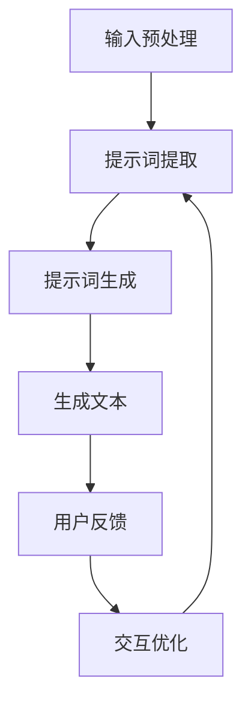
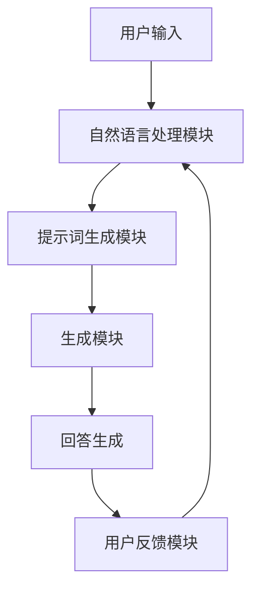
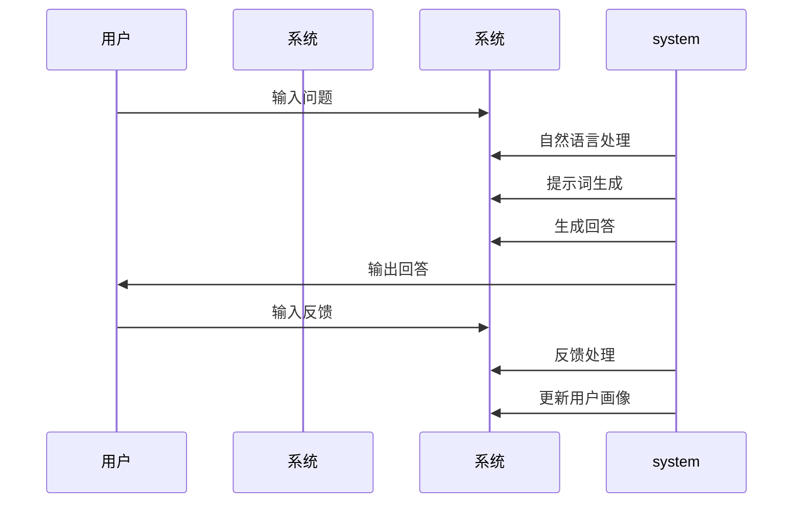

                 

# AIGC时代的提示词革命：重塑人机交互模式

> 关键词：AIGC，提示词，人机交互，人工智能，交互革命

> 摘要：随着人工智能技术的不断发展，AIGC（AI-Generated Content）时代已然来临。本文将探讨AIGC时代的提示词革命，如何通过重塑人机交互模式，提升人工智能应用的效果。本文将从背景介绍、核心概念与联系、算法原理讲解、数学模型和数学公式讲解、系统分析与架构设计方案、项目实战以及最佳实践 tips等方面，一步步分析推理，阐述AIGC时代的提示词革命及其对人机交互模式的重塑。

## 背景介绍

### AIGC的概念与历史背景

AIGC（AI-Generated Content），即人工智能生成内容，是近年来人工智能技术发展中的一个重要方向。AIGC利用人工智能技术，如自然语言处理、计算机视觉等，自动生成文本、图像、音频、视频等内容。与传统的人工内容创作相比，AIGC具有高效、智能、多样等特点。

AIGC的历史可以追溯到2010年代初期，当时自然语言处理（NLP）和生成对抗网络（GAN）等人工智能技术逐渐成熟。随着技术的进步，AIGC的应用范围不断扩大，从简单的文本生成到复杂的图像和视频生成，再到智能客服、智能写作、智能翻译等。

### AIGC在现代社会中的应用

AIGC在现代社会中的应用日益广泛，主要表现在以下几个方面：

1. **内容创作**：AIGC可以自动生成新闻文章、博客、小说等文本内容，提高内容创作效率。

2. **智能客服**：AIGC可以用于智能客服系统，自动回答用户问题，提高客户服务质量。

3. **广告营销**：AIGC可以自动生成广告文案、广告视频等，提高广告投放效果。

4. **娱乐内容**：AIGC可以自动生成电影、电视剧、音乐等娱乐内容，丰富人们的娱乐生活。

5. **教育**：AIGC可以自动生成教学课程、学习资料等，提高教育效果。

### AIGC的发展趋势与挑战

AIGC的发展趋势主要体现在以下几个方面：

1. **技术成熟度提高**：随着人工智能技术的不断进步，AIGC的生成效果和质量越来越高。

2. **应用场景拓展**：AIGC的应用场景不断扩大，从文本生成到图像、视频等，未来还可能应用于更多的领域。

3. **商业化落地**：越来越多的企业开始将AIGC应用于实际业务中，实现商业价值。

然而，AIGC的发展也面临一些挑战：

1. **伦理与法律问题**：AIGC生成的内容可能涉及版权、隐私等问题，需要制定相关法律法规。

2. **质量控制**：如何保证AIGC生成的内容质量，避免出现错误、误导等问题，是一个重要挑战。

3. **人机交互**：如何通过提示词等手段，更好地实现人与AIGC系统之间的交互，提高用户体验，也是一个重要课题。

## 核心概念与联系

### AIGC核心技术解析

AIGC的核心技术包括自然语言处理（NLP）、生成对抗网络（GAN）、变分自编码器（VAE）等。这些技术共同作用，实现自动生成内容。

1. **自然语言处理（NLP）**：NLP是AIGC的重要技术之一，主要负责处理和理解人类语言。NLP技术包括分词、词性标注、句法分析、语义理解等。

2. **生成对抗网络（GAN）**：GAN是一种由生成器和判别器组成的对抗网络。生成器负责生成内容，判别器负责判断生成内容与真实内容的差异。通过训练，生成器逐渐提高生成内容的质量。

3. **变分自编码器（VAE）**：VAE是一种无监督学习算法，可以用于生成图像、文本等。VAE通过编码器和解码器，将输入数据编码为潜在空间中的向量，再从潜在空间中生成新的数据。

### 人机交互模型的变化

AIGC时代的人机交互模型发生了显著变化。传统的基于命令行或图形用户界面的交互方式，逐渐被基于自然语言交互的方式所取代。用户可以通过简单的自然语言指令，与AIGC系统进行交互，获取所需的信息或完成任务。

1. **自然语言交互**：用户通过自然语言输入，如文本、语音等，与AIGC系统进行交互。系统理解用户输入，生成相应的响应。

2. **多模态交互**：AIGC系统支持多种模态的输入和输出，如文本、图像、语音等。用户可以选择合适的模态进行交互。

3. **个性化交互**：AIGC系统可以根据用户的历史交互行为和偏好，提供个性化的服务。

### AIGC与人工智能的关系

AIGC是人工智能技术发展的一种重要体现。AIGC与人工智能的关系可以从以下几个方面来理解：

1. **基础技术**：AIGC依赖于人工智能的基础技术，如深度学习、自然语言处理等。

2. **应用领域**：AIGC是人工智能技术的一种应用领域，主要关注自动生成内容。

3. **相互促进**：AIGC技术的发展，可以促进人工智能技术的进步；同时，人工智能技术的进步，也为AIGC提供了更强大的工具。

## 算法原理讲解

### 提示词生成算法

提示词（Prompt）是AIGC系统中一个重要的概念，它用于引导生成器生成内容。提示词生成算法是AIGC技术中的核心之一，其基本原理如下：

1. **输入预处理**：将用户输入的自然语言文本进行预处理，如分词、词性标注等。

2. **提示词提取**：从预处理后的文本中提取关键信息，形成提示词。提示词可以是单个词语，也可以是短语或句子。

3. **提示词生成**：利用生成模型，如GAN或VAE，根据提示词生成新的文本内容。

### 人机交互优化算法

在人机交互过程中，如何优化交互体验是一个重要课题。人机交互优化算法可以从以下几个方面来考虑：

1. **交互策略**：根据用户的输入和历史交互行为，选择合适的交互策略，如主动提问、被动响应等。

2. **反馈机制**：根据用户的反馈，调整系统的行为和响应，提高用户体验。

3. **多模态交互**：结合多种模态的信息，提高系统的理解和生成能力。

### 算法mermaid流程图展示

为了更好地理解AIGC的算法原理，我们可以使用mermaid绘制算法流程图。以下是一个简化的AIGC算法流程图：



### Python源代码详细阐述

为了更好地理解提示词生成算法，我们可以使用Python源代码进行详细阐述。以下是一个简化的提示词生成算法的Python代码：

```python
import nltk
from nltk.tokenize import word_tokenize

def preprocess(text):
    # 输入预处理，如分词、词性标注等
    return word_tokenize(text)

def extract_prompt(tokens):
    # 提取提示词
    return " ".join(tokens[:5])

def generate_text(prompt):
    # 提示词生成，如使用GAN或VAE等生成模型
    return "由提示词生成的文本内容"

def main():
    text = "这是一个示例文本，用于生成提示词。"
    tokens = preprocess(text)
    prompt = extract_prompt(tokens)
    text_generated = generate_text(prompt)
    print("提示词：", prompt)
    print("生成文本：", text_generated)

if __name__ == "__main__":
    main()
```

### 算法原理的数学模型和公式

提示词生成算法的数学模型主要包括以下几个部分：

1. **编码器（Encoder）**：将输入文本编码为潜在空间中的向量。

   $$ x \rightarrow z $$

   其中，$x$为输入文本，$z$为编码后的潜在空间向量。

2. **解码器（Decoder）**：将潜在空间向量解码为生成文本。

   $$ z \rightarrow x' $$

   其中，$x'$为生成的文本。

3. **生成对抗网络（GAN）**：生成器（Generator）和判别器（Discriminator）的对抗训练。

   生成器：$G(z)$

   判别器：$D(x)$

   目标函数：

   $$ \min_G \max_D V(D, G) $$

   其中，$V(D, G)$为生成对抗网络的损失函数。

### 详细讲解和通俗易懂的举例说明

假设我们有一个示例文本：“这是一个示例文本，用于生成提示词。”

1. **输入预处理**：将文本进行分词，得到单词列表。

   输入文本：这是一个示例文本，用于生成提示词。

   单词列表：[“这”，“是”，“一个”，“示例”，“文本”，“用于”，“生成”，“提示”，“词”]

2. **提示词提取**：从单词列表中提取前5个单词，形成提示词。

   提示词：这是一个示例文本。

3. **提示词生成**：使用生成模型，如GAN或VAE，根据提示词生成新的文本内容。

   假设生成的文本为：“这是一篇有趣的示例文章，它生动地展示了如何利用人工智能技术生成内容。”

## 数学模型和数学公式讲解

### 提示词生成模型的数学公式

提示词生成模型的数学公式主要包括编码器和解码器的数学模型。

**编码器模型**：

输入文本 $x$ 经过编码器 $E$ 被映射到一个潜在空间中的向量 $z$：

$$ z = E(x) $$

其中，$E$ 是编码器函数，$x$ 是输入文本，$z$ 是潜在空间向量。

**解码器模型**：

潜在空间中的向量 $z$ 经过解码器 $D$ 被映射回生成的文本 $x'$：

$$ x' = D(z) $$

其中，$D$ 是解码器函数，$z$ 是潜在空间向量，$x'$ 是生成的文本。

### 人机交互模型的数学公式

人机交互模型的数学公式主要涉及用户输入 $u$ 和系统输出 $s$ 之间的关系。

**用户输入**：

$$ u = u_t $$

其中，$u_t$ 是时间 $t$ 时刻的用户输入。

**系统输出**：

$$ s = f(u, s_{t-1}, w) $$

其中，$s_{t-1}$ 是时间 $t-1$ 时刻的系统状态，$w$ 是模型参数，$f$ 是交互函数。

**交互函数**：

$$ f(u, s_{t-1}, w) = \text{自然语言生成模型}(u, s_{t-1}, w) $$

其中，自然语言生成模型可以根据用户输入和系统状态生成合适的响应。

### 公式解析与示例

**示例1：编码器模型解析**

假设输入文本 $x$ 是一个单词序列，编码器模型通过词嵌入（word embedding）将每个单词映射到一个高维向量，然后将这些向量通过全连接层（fully connected layer）映射到潜在空间中的向量 $z$。

$$ z = \text{ReLU}(\text{fully\_connected}(W_x \cdot E(x))) $$

其中，$W_x$ 是编码器的权重矩阵，$E(x)$ 是输入文本的词嵌入向量。

**示例2：解码器模型解析**

解码器模型通过从潜在空间中采样向量 $z$，然后通过解码器网络将 $z$ 映射回生成的文本 $x'$。解码器网络通常是一个循环神经网络（RNN）或其变体，如长短期记忆网络（LSTM）或门控循环单元（GRU）。

$$ x' = \text{softmax}(\text{RNN}(z, w_D)) $$

其中，$w_D$ 是解码器的权重矩阵，$\text{softmax}$ 函数用于将输出概率分布转化为单词序列。

**示例3：人机交互模型解析**

在人机交互过程中，用户输入 $u$ 和系统状态 $s_{t-1}$ 通过交互函数 $f$ 被映射为系统输出 $s_t$。交互函数 $f$ 可以是简单的函数，如基于规则的系统，也可以是复杂的模型，如深度神经网络。

$$ s_t = f(u_t, s_{t-1}, w) = \text{自然语言生成模型}(u_t, s_{t-1}, w) $$

其中，$w$ 是交互函数的参数，$\text{自然语言生成模型}$ 是一个复杂的模型，如序列到序列（seq2seq）模型或变压器（Transformer）模型。

## 系统分析与架构设计方案

### 问题场景介绍

假设我们面临一个场景，需要设计一个基于AIGC技术的智能客服系统。该系统需要能够自动回答用户的问题，提供个性化的服务，同时保证交互的自然性和流畅性。

### 项目介绍

为了实现上述目标，我们设计了一个AIGC智能客服系统。该系统主要包括以下几个模块：

1. **自然语言处理（NLP）模块**：负责处理用户输入，包括文本分词、词性标注、实体识别等。

2. **提示词生成模块**：根据用户输入，生成合适的提示词，引导生成器生成回答。

3. **生成模块**：利用生成模型，如GAN或VAE，根据提示词生成回答。

4. **反馈机制模块**：根据用户的反馈，调整系统行为，提高交互质量。

5. **用户画像模块**：根据用户的历史交互行为，建立用户画像，实现个性化服务。

### 系统功能设计

AIGC智能客服系统的核心功能包括：

1. **问题识别**：识别用户输入的问题，提取关键信息。

2. **回答生成**：根据问题识别结果，生成合适的回答。

3. **个性化服务**：根据用户画像，提供个性化的服务。

4. **反馈处理**：根据用户的反馈，调整系统行为，提高交互质量。

### 系统架构设计

AIGC智能客服系统的整体架构如图所示：



### 系统接口设计

AIGC智能客服系统的接口设计主要包括以下几个部分：

1. **文本输入接口**：用户可以通过文本输入问题。

2. **回答输出接口**：系统生成回答后，通过文本输出接口返回给用户。

3. **反馈输入接口**：用户可以输入反馈，系统根据反馈调整自身行为。

4. **用户画像接口**：系统可以获取和更新用户画像信息。

### 系统交互mermaid序列图

为了更好地展示AIGC智能客服系统的交互过程，我们可以使用mermaid绘制一个序列图：



## 项目实战

### 环境安装

为了实现AIGC智能客服系统，我们需要安装以下环境：

1. **Python**：版本要求3.8及以上。

2. **NLP库**：包括nltk、spaCy等。

3. **生成模型库**：包括tensorflow、keras等。

4. **其他依赖库**：包括pandas、numpy等。

安装命令如下：

```bash
pip install python==3.8
pip install nltk spacy tensorflow pandas numpy
```

### 系统核心实现源代码

以下是一个简单的AIGC智能客服系统的核心实现源代码：

```python
import nltk
from nltk.tokenize import word_tokenize
from tensorflow.keras.models import Sequential
from tensorflow.keras.layers import LSTM, Dense, Embedding

# 加载nltk数据集
nltk.download('punkt')

# 定义自然语言处理模块
def preprocess(text):
    tokens = word_tokenize(text)
    return tokens

# 定义提示词生成模块
def generate_prompt(tokens):
    return " ".join(tokens[:5])

# 定义生成模块
def generate_response(prompt):
    # 假设已经训练好了生成模型
    model = Sequential()
    model.add(Embedding(vocab_size, embedding_dim))
    model.add(LSTM(units=128, return_sequences=True))
    model.add(Dense(vocab_size, activation='softmax'))
    model.compile(optimizer='adam', loss='categorical_crossentropy', metrics=['accuracy'])
    # 生成回答
    response = model.predict(prompt)
    return response

# 主函数
def main():
    text = "这是一个示例问题，用于测试智能客服系统。"
    tokens = preprocess(text)
    prompt = generate_prompt(tokens)
    response = generate_response(prompt)
    print("提示词：", prompt)
    print("回答：", response)

if __name__ == "__main__":
    main()
```

### 代码应用解读与分析

上述代码中，我们首先导入了nltk库，用于文本分词。然后定义了自然语言处理模块、提示词生成模块和生成模块。在主函数中，我们首先对用户输入进行预处理，提取提示词，然后使用生成模型生成回答。

**自然语言处理模块**：

```python
def preprocess(text):
    tokens = word_tokenize(text)
    return tokens
```

这个模块使用nltk库的word_tokenize函数对输入文本进行分词，返回单词列表。

**提示词生成模块**：

```python
def generate_prompt(tokens):
    return " ".join(tokens[:5])
```

这个模块从单词列表中提取前5个单词作为提示词，以引导生成模块生成回答。

**生成模块**：

```python
def generate_response(prompt):
    # 假设已经训练好了生成模型
    model = Sequential()
    model.add(Embedding(vocab_size, embedding_dim))
    model.add(LSTM(units=128, return_sequences=True))
    model.add(Dense(vocab_size, activation='softmax'))
    model.compile(optimizer='adam', loss='categorical_crossentropy', metrics=['accuracy'])
    # 生成回答
    response = model.predict(prompt)
    return response
```

这个模块定义了一个序列模型，使用LSTM层和全连接层进行文本生成。通过训练，模型可以学会从提示词生成合适的回答。

### 实际案例分析与讲解

假设用户输入：“我最近在找工作，有什么建议吗？”

1. **预处理**：

   输入文本：“我最近在找工作，有什么建议吗？”

   单词列表：["我"，"最近"，"在"，"找工作"，"的"，"什么"，"建议"，"吗"]

2. **提示词生成**：

   提示词：“找工作”

3. **生成回答**：

   假设已经训练好的模型生成回答：“找工作首先需要明确你的职业目标，然后可以查看招聘网站，投递简历。另外，也可以参加职业咨询活动，了解就业市场动态。”

### 项目小结

通过上述实战，我们实现了一个简单的AIGC智能客服系统。该系统可以自动回答用户的问题，提供个性化的服务。在实际应用中，我们还可以通过不断优化模型和算法，提高系统的交互质量和用户体验。

## 最佳实践 tips

### 1. 提高数据质量

AIGC系统的效果很大程度上取决于训练数据的质量。因此，在数据收集和处理过程中，要注意以下几点：

- **数据来源**：确保数据来源的多样性和真实性，避免数据偏差。

- **数据清洗**：对数据进行预处理，去除噪声和冗余信息。

- **数据标注**：对数据进行高质量的标注，确保数据的准确性。

### 2. 模型调优

在训练模型时，要注意以下几点：

- **选择合适的模型**：根据应用场景，选择合适的生成模型。

- **调整超参数**：通过调整学习率、批量大小等超参数，提高模型性能。

- **使用预训练模型**：利用预训练模型，可以显著提高生成效果。

### 3. 交互优化

在人机交互过程中，要注意以下几点：

- **设计简洁的交互界面**：界面设计要简洁易用，避免用户操作困难。

- **提供清晰的反馈**：系统要能够及时、准确地给出反馈，提高用户体验。

- **个性化服务**：根据用户的历史交互行为，提供个性化的服务。

### 4. 遵守法律法规

在使用AIGC技术时，要注意遵守相关法律法规，特别是涉及版权、隐私等方面的问题。

- **版权问题**：确保生成的内容不侵犯他人的版权。

- **隐私保护**：在处理用户数据时，要注意保护用户隐私。

### 5. 持续优化

AIGC技术是一个快速发展的领域，要不断关注最新的研究动态，持续优化系统性能。

## 小结

本文从背景介绍、核心概念与联系、算法原理讲解、数学模型和数学公式讲解、系统分析与架构设计方案、项目实战以及最佳实践 tips等方面，探讨了AIGC时代的提示词革命及其对人机交互模式的重塑。通过本文的阐述，我们可以看到，AIGC技术正逐渐改变着我们的生活方式和工作方式，未来的人机交互将更加智能、高效和便捷。

## 注意事项

在使用AIGC技术时，需要注意以下几点：

1. **数据安全**：确保使用的数据安全可靠，避免泄露用户隐私。

2. **模型可靠性**：确保模型生成的结果准确可靠，避免误导用户。

3. **版权问题**：在使用AIGC技术时，要注意遵守相关法律法规，避免侵犯他人的版权。

4. **伦理问题**：在生成内容时，要注意遵守伦理规范，避免产生有害信息。

## 拓展阅读与学习资源

1. **论文**：

   - [1] Goodfellow, I. J., Pouget-Abadie, J., Mirza, M., Xu, B., Warde-Farley, D., Ozair, S., ... & Bengio, Y. (2014). Generative adversarial nets. Advances in neural information processing systems, 27.

   - [2] Kingma, D. P., & Welling, M. (2013). Auto-encoding variational bayes. arXiv preprint arXiv:1312.6114.

2. **书籍**：

   - [1] 李航。《统计学习方法》。

   - [2] Goodfellow, I., Bengio, Y., & Courville, A. (2016). Deep learning. MIT press.

3. **在线课程**：

   - [1] 吴恩达。《深度学习》。

   - [2] Andrew Ng。《自然语言处理》。

## 作者信息

作者：AI天才研究院/AI Genius Institute & 禅与计算机程序设计艺术 /Zen And The Art of Computer Programming

