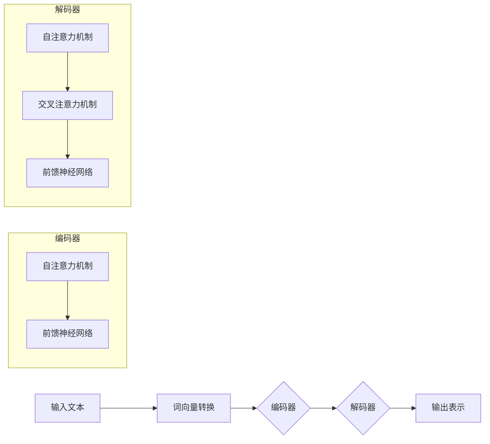
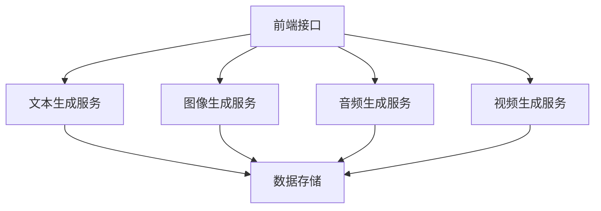
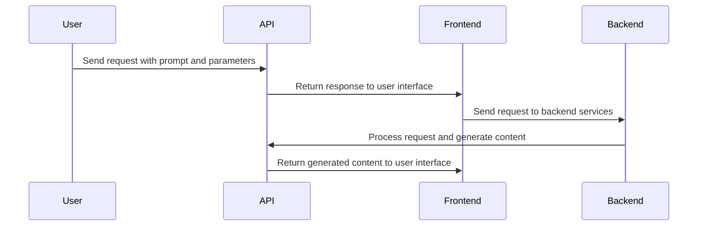

                 

## 引言

### AIGC时代背景

AIGC（AI-Generated Content）时代的到来，标志着人工智能技术发展的新纪元。在这个时代，人工智能不仅在数据处理和分析方面发挥着关键作用，更在内容生成上展现出巨大的潜力。从简单的文本生成到复杂的图像、音频和视频生成，AIGC技术正在改变内容创造的方式。随着技术的不断进步，AIGC在各个领域的应用也日益广泛，从广告创意、新闻报道到娱乐内容制作，甚至包括教育、医疗等多个行业。

### 语言模型与提示词的重要性

语言模型是AIGC技术中的核心组件，它通过学习大量的语言数据，能够预测并生成符合语言规则和语义逻辑的文本。而提示词（Prompt）则是引导语言模型生成内容的关键，它不仅能够指定生成内容的主题和风格，还能提高生成的文本的质量和准确性。

### 本书目的与结构

本书旨在深入探讨AIGC时代的语言模型与提示词设计，分析其在当前技术环境下的新挑战。通过系统的理论讲解和实战案例，帮助读者全面理解AIGC技术的工作原理，掌握提示词设计的最佳实践。本书将分为以下几个部分：

1. **背景介绍**：介绍AIGC的定义、发展历程以及语言模型和提示词的基本概念。
2. **核心概念与联系**：详细讲解语言模型和提示词的设计原则，分析其在AIGC技术中的应用。
3. **算法原理讲解**：从语言模型的工作原理、提示词设计算法以及具体的数学模型出发，通过实例进行详细讲解。
4. **系统分析与架构设计方案**：介绍AIGC系统的设计与实现，包括系统功能设计、架构设计和接口设计。
5. **项目实战**：通过实际项目，演示AIGC技术在现实中的应用，分析项目中的关键环节和解决方法。
6. **最佳实践 Tips**：总结AIGC时代语言模型与提示词设计的最佳实践，提供实用的技巧和建议。
7. **小结与展望**：对全书内容进行总结，展望AIGC技术的未来发展趋势和潜在挑战。

通过本书的学习，读者将能够：

- **掌握AIGC技术的基本原理**：理解语言模型和提示词的设计原理，掌握AIGC技术的基本工作流程。
- **具备实际操作能力**：通过项目实战，掌握AIGC技术的实际应用方法，能够在实际项目中设计和实现高效的AIGC系统。
- **提升专业素养**：通过深入分析AIGC技术的核心问题，提升在人工智能领域的技术素养和创新能力。

在接下来的章节中，我们将逐步深入探讨AIGC时代的语言模型与提示词设计，让读者对这个新兴领域有更加全面和深入的理解。让我们开始这段激动人心的探索之旅吧！

## 背景介绍

### AIGC的定义与发展

AIGC（AI-Generated Content）是一种利用人工智能技术自动生成内容的方法。与传统的手工创作不同，AIGC通过机器学习算法，特别是深度学习技术，从大量数据中学习并生成符合特定需求和规则的新内容。AIGC的应用范围广泛，包括但不限于文本生成、图像生成、音频生成和视频生成等。

AIGC的发展历程可以追溯到上世纪末和本世纪初，随着计算机算力的提升和大数据技术的发展，人工智能技术逐渐成熟。特别是深度学习技术的突破，使得语言模型和生成模型取得了显著进展。GPT-3、BERT、DALL-E等模型的出现，标志着AIGC技术进入了一个新的阶段。

### 语言模型的历史与演变

语言模型是AIGC技术的核心组件之一，其历史可以追溯到20世纪50年代。早期的语言模型主要基于规则和统计方法，如N-gram模型。随着计算能力的提升和神经网络技术的发展，现代语言模型逐渐采用了深度学习技术，特别是基于变换器模型（Transformer）的模型，如BERT、GPT等。

这些先进的语言模型具有强大的文本理解能力和生成能力，能够生成高质量的自然语言文本。它们通过大量的预训练数据和特定的训练任务，不断优化模型参数，从而实现自适应和高效的文本生成。

### 提示词设计的基本原理

提示词是引导语言模型生成内容的关键。一个好的提示词能够帮助模型更好地理解生成任务的要求，从而提高生成内容的质量和准确性。提示词设计的基本原理包括：

1. **明确性**：提示词应该清晰明确，避免歧义，确保模型能够准确理解任务要求。
2. **丰富性**：提示词应包含丰富的上下文信息，帮助模型更好地理解和生成相关内容。
3. **灵活性**：提示词应具有一定的灵活性，能够适应不同的生成任务和风格需求。

提示词设计不仅需要考虑语言模型的特性，还需要结合具体应用场景和用户需求进行优化。通过有效的提示词设计，可以显著提升AIGC系统的生成质量和用户体验。

### AIGC时代的语言模型与提示词设计

AIGC时代的到来，为语言模型和提示词设计带来了新的挑战和机遇。一方面，随着生成内容的复杂性和多样性增加，对语言模型和提示词的设计提出了更高的要求。另一方面，先进的深度学习技术和大数据处理能力的提升，为解决这些挑战提供了可能。

在AIGC时代，语言模型需要具备更强的语义理解能力和生成能力，以应对复杂的生成任务。同时，提示词设计也需要更加精细和智能化，以适应不同场景和用户需求。

总的来说，AIGC时代的语言模型与提示词设计不仅是一个技术问题，更是一个涉及多学科交叉和创新的综合性挑战。通过深入研究和实践，我们可以更好地应对这些挑战，推动AIGC技术不断进步。

## 核心概念与联系

### 语言模型的核心概念

语言模型是AIGC技术中的核心组件，它通过学习大量的语言数据，能够预测并生成符合语言规则和语义逻辑的文本。以下是语言模型的一些核心概念：

1. **词向量表示**：语言模型通常使用词向量（Word Embedding）来表示单词，将单词映射为一个高维的向量空间，使得相似的单词在空间中靠近。词向量表示有助于提高语言模型的语义理解能力。
2. **神经网络结构**：现代语言模型通常基于深度神经网络，如变换器模型（Transformer）、循环神经网络（RNN）等。这些神经网络结构能够处理变长的序列数据，并通过多层非线性变换，实现文本的自动编码和解码。
3. **预训练与微调**：语言模型通常采用预训练（Pre-training）和微调（Fine-tuning）的方法进行训练。预训练阶段，模型在大量未标注的数据上进行训练，学习通用语言特征；微调阶段，模型在特定任务上进行训练，调整模型参数，以适应具体任务的需求。

### 提示词的设计原则

提示词是引导语言模型生成内容的关键。以下是提示词设计的一些核心原则：

1. **明确性**：提示词应清晰明确，避免歧义，确保模型能够准确理解任务要求。例如，"写一篇关于人工智能的科普文章"比"写一篇关于AI的文章"更明确。
2. **丰富性**：提示词应包含丰富的上下文信息，帮助模型更好地理解和生成相关内容。例如，"请描述人工智能在医疗领域的应用"比"写一篇关于AI的应用文章"提供了更具体的上下文信息。
3. **灵活性**：提示词应具有一定的灵活性，能够适应不同的生成任务和风格需求。例如，"请用幽默的方式写一篇关于人工智能的文章"比"写一篇正式的AI文章"提供了更多的创作自由度。

### 语言模型与提示词的联系

语言模型和提示词之间存在紧密的联系，它们共同决定了AIGC系统的生成质量和用户体验。以下是它们之间的几个关键联系：

1. **协同工作**：语言模型和提示词需要协同工作，才能生成高质量的内容。提示词提供了生成任务的具体要求和上下文信息，语言模型则利用这些信息生成符合要求的内容。
2. **相互作用**：提示词的质量直接影响语言模型的生成效果。高质量的提示词能够提供丰富的上下文信息，有助于模型更好地理解任务需求，从而生成更准确、更有创造性的内容。
3. **动态调整**：在实际应用中，可以根据用户反馈和任务需求，动态调整提示词和语言模型的参数，以实现更优的生成效果。例如，如果用户对生成的文本不满意，可以尝试调整提示词的表述方式，或者重新训练语言模型。

### 概念属性特征对比表格

为了更清晰地展示语言模型和提示词的核心概念和特征，我们可以创建一个对比表格：

| 特征         | 语言模型                  | 提示词                  |
| ------------ | ------------------------- | ----------------------- |
| 表示方法     | 词向量、深度神经网络      | 明确性、丰富性、灵活性   |
| 目标         | 生成符合规则和语义逻辑的文本 | 指导语言模型生成内容     |
| 预训练与微调 | 预训练 + 微调             | 预设 + 调整             |
| 相互作用     | 与提示词协同工作          | 影响生成效果            |

### ER实体关系图架构

为了更直观地理解语言模型和提示词之间的关系，我们可以使用Mermaid流程图来绘制ER（实体关系）图。以下是语言模型和提示词的ER实体关系图：

```mermaid
erDiagram
  AIContent <<--|{1} LanguageModel : Generates
  AIContent <<<|{1} Prompt : Guided by

  AIContent ||--|{1} TextContent : Contains

  LanguageModel ||--|{1} WordVector : Represented by
  LanguageModel ||--|{1} NeuralNetwork : Structured with

  Prompt ||--|{1} Clarity : Ensured by
  Prompt ||--|{1} Richness : Enriched with
  Prompt ||--|{1} Flexibility : Adapted to
```

通过这个ER图，我们可以清晰地看到语言模型和提示词作为实体，如何相互作用并共同影响AIGC系统的生成结果。

总的来说，语言模型和提示词的设计与实现是AIGC技术中至关重要的一环。通过深入理解这些核心概念和联系，我们可以更好地应对AIGC时代的新挑战，实现高效的自动内容生成。

## 算法原理讲解

### 语言模型的工作原理

语言模型的核心目标是预测下一个单词或字符，从而生成连续的文本。为了实现这一目标，语言模型通常采用深度学习技术，特别是基于变换器模型（Transformer）的模型。以下是语言模型的工作原理：

1. **输入表示**：语言模型首先将输入文本转换为向量表示。通常使用词向量（Word Embedding）技术，将每个单词映射为一个高维向量。词向量表示有助于捕捉单词的语义信息。
2. **编码器**：变换器模型的核心组件是编码器（Encoder），它对输入文本向量进行编码。编码器通过多层变换器层（Transformer Layer）处理输入文本，每层变换器都包含自注意力机制（Self-Attention）和前馈神经网络（Feedforward Neural Network）。自注意力机制能够自动学习输入文本中的重要信息，并通过加权求和的方式将其编码为上下文向量。
3. **解码器**：在生成文本时，解码器（Decoder）通过解码操作生成每个单词或字符的预测。解码器同样采用变换器层，但与编码器不同，解码器的输入不仅包括当前生成的文本，还包括编码器输出的上下文向量。解码器通过自注意力机制和交叉注意力机制（Cross-Attention）结合当前生成的文本和编码器输出的上下文向量，生成下一个单词或字符的预测。
4. **输出表示**：解码器生成的输出通常是一个概率分布，表示下一个单词或字符的可能性。语言模型通过最大化下一个单词的概率分布来生成连续的文本。

### 提示词的设计算法

提示词的设计是AIGC系统中至关重要的一环，它直接影响到语言模型生成内容的质量和准确性。以下是提示词的设计算法：

1. **明确性**：设计提示词时，首先需要确保提示词的明确性。明确性要求提示词应尽可能清晰、简洁，避免歧义和模糊的表述。例如，"请生成一篇关于人工智能在医疗领域的应用的文章"比"写一篇关于AI的文章"更具明确性。
2. **丰富性**：提示词应包含丰富的上下文信息，以帮助语言模型更好地理解生成任务的要求。丰富性可以通过提供更多的背景信息、详细描述和具体的场景来实现。例如，"请描述人工智能在癌症诊断中的具体应用场景，包括数据收集、分析和决策过程"比简单的"请写一篇关于AI在医疗中的应用文章"提供了更丰富的上下文信息。
3. **灵活性**：提示词应具有一定的灵活性，以适应不同的生成任务和用户需求。灵活性可以通过使用多种表述方式、提供多种生成风格的选择来实现。例如，"请用幽默的方式描述人工智能在购物推荐中的应用"比"请写一篇关于AI在购物推荐中的应用文章"提供了更多的创作自由度。

### 算法mermaid流程图

为了更直观地理解语言模型和提示词的设计算法，我们可以使用mermaid绘制流程图。以下是语言模型的工作流程：



### 具体公式与计算示例

在语言模型和提示词的设计中，数学模型和公式扮演了重要的角色。以下是几个关键的数学公式和计算示例：

1. **词向量表示**：
   $$ \text{词向量} = \text{Word2Vec}(\text{单词}) $$
   示例：$$ \text{词向量}(\text{人工智能}) = \text{Word2Vec}(\text{人工智能}) $$

2. **变换器模型**：
   $$ \text{输出} = \text{softmax}(\text{解码器}(\text{编码器}(\text{词向量}))) $$
   示例：$$ \text{输出} = \text{softmax}(\text{解码器}(\text{编码器}(\text{词向量}(\text{人工智能})))) $$

3. **提示词设计**：
   $$ \text{提示词} = \text{明确性} + \text{丰富性} + \text{灵活性} $$
   示例：$$ \text{提示词} = \text{明确性}(\text{请生成一篇关于人工智能在医疗领域的应用的文章}) + \text{丰富性}(\text{包括数据收集、分析和决策过程}) + \text{灵活性}(\text{幽默的方式描述}) $$

通过这些公式和计算示例，我们可以更好地理解语言模型和提示词的设计过程，从而在实际应用中实现更高效的文本生成。

## 系统分析与架构设计方案

### 问题场景介绍

在AIGC时代，越来越多的企业和机构开始采用自动内容生成技术来提高内容生产和分发效率。然而，随着生成内容的需求变得更加多样化和复杂化，传统的单一语言模型系统已经难以满足这些需求。因此，我们需要设计一个高效、可扩展的AIGC系统，以满足不同场景下的生成需求。

### 系统功能设计

AIGC系统的核心功能包括文本生成、图像生成、音频生成和视频生成。为了实现这些功能，我们需要设计一个模块化、高度可扩展的架构。以下是AIGC系统的功能设计：

1. **文本生成模块**：负责生成符合语义和语法规则的自然语言文本。包括支持多种语言、多种文本风格和多种文本类型的生成能力。
2. **图像生成模块**：利用深度学习技术，自动生成高质量的图像，包括照片、艺术作品和动画等。
3. **音频生成模块**：生成自然语音、音乐和声音效果，支持语音合成和语音增强功能。
4. **视频生成模块**：自动生成视频内容，包括动画、视频剪辑和视频特效等。

### 系统架构设计

为了实现上述功能，我们需要设计一个分布式、高性能的系统架构。以下是AIGC系统的架构设计：

1. **前端接口**：负责接收用户请求，提供友好的用户界面，允许用户输入提示词和生成参数。
2. **后端服务**：包括文本生成、图像生成、音频生成和视频生成服务，这些服务通过微服务架构实现，以提高系统的可扩展性和灵活性。
3. **数据存储**：包括预训练模型库、生成模型库和用户生成数据存储，确保系统有足够的数据资源进行训练和生成。
4. **计算资源**：利用云计算和分布式计算资源，提供强大的计算能力，以满足大规模生成任务的需求。

以下是AIGC系统的mermaid架构图：



### 系统接口设计和系统交互

AIGC系统的接口设计需要考虑易用性和灵活性，以方便用户快速接入和使用系统。以下是系统接口设计和系统交互：

1. **API接口**：提供RESTful API接口，允许用户通过HTTP请求生成内容。接口支持多种数据格式，如JSON、XML等，以便用户根据需要选择合适的格式。
2. **SDK封装**：为常见的编程语言（如Python、Java、Node.js等）提供SDK，方便用户通过编程方式接入系统。
3. **用户交互**：前端界面提供友好的用户交互界面，允许用户输入提示词、选择生成类型和参数，并实时展示生成结果。

以下是AIGC系统的mermaid序列图：



通过上述系统分析与架构设计方案，我们可以构建一个高效、可扩展的AIGC系统，满足不同场景下的生成需求。在接下来的项目中，我们将通过实际案例来展示AIGC系统的应用和实践。

## 项目实战

### 环境安装与准备

为了实现AIGC系统的项目实战，我们需要在本地环境中安装和配置必要的软件和工具。以下是具体的安装和准备工作：

1. **安装Python环境**：首先，确保本地计算机上安装了Python环境。Python是AIGC系统开发的主要语言，因此需要安装Python 3.x版本。可以从Python官方网站下载并安装最新版本的Python。

2. **安装必要的库和依赖**：接下来，我们需要安装一些重要的库和依赖，包括TensorFlow、PyTorch、transformers等。可以通过以下命令进行安装：

   ```bash
   pip install tensorflow
   pip install torch torchvision
   pip install transformers
   ```

3. **配置GPU环境**：由于AIGC系统中的生成任务通常需要较高的计算资源，建议配置GPU环境。安装CUDA和cuDNN驱动，并确保Python环境能够正确使用GPU。具体安装方法可以参考相关官方文档。

4. **创建项目文件夹和虚拟环境**：在本地计算机上创建一个项目文件夹，并在其中创建一个Python虚拟环境，以便隔离项目依赖和方便后续开发。可以使用以下命令创建虚拟环境：

   ```bash
   mkdir aigc_project
   cd aigc_project
   python -m venv venv
   source venv/bin/activate  # 在Windows上使用 `venv\Scripts\activate`
   ```

5. **安装项目依赖**：在虚拟环境中，安装项目的依赖库和依赖文件。可以使用`requirements.txt`文件来指定所有依赖，并通过以下命令进行安装：

   ```bash
   pip install -r requirements.txt
   ```

完成以上步骤后，我们就可以开始进行AIGC系统的核心实现和代码编写了。

### 系统核心实现源代码

以下是AIGC系统核心实现的源代码示例。这个示例将展示如何使用Python和transformers库来实现一个简单的文本生成模型。代码包括模型加载、提示词处理、文本生成和结果展示等功能。

```python
import os
from transformers import AutoTokenizer, AutoModelForCausalLM
from torch import no_grad

# 模型名称
model_name = "gpt2"

# 加载预训练模型和分词器
tokenizer = AutoTokenizer.from_pretrained(model_name)
model = AutoModelForCausalLM.from_pretrained(model_name)

# 设置提示词
prompt = "请描述人工智能在医疗领域的应用场景。"

# 对提示词进行编码
input_ids = tokenizer.encode(prompt, return_tensors="pt")

# 重置模型的生成状态
model.eval()

# 进行无梯度推理
with no_grad():
    outputs = model(input_ids)

# 生成文本
generated_output = tokenizer.decode(outputs.logits.argmax(-1).item(), skip_special_tokens=True)

# 打印生成的文本
print(generated_output)
```

### 代码应用解读与分析

在上面的代码中，我们首先通过`AutoTokenizer`和`AutoModelForCausalLM`类加载了预训练的语言模型和分词器。`AutoTokenizer`负责将文本转换为模型理解的输入格式，而`AutoModelForCausalLM`则是预训练的语言模型，用于生成文本。

我们设置的提示词为`"请描述人工智能在医疗领域的应用场景。"`，这作为模型生成文本的起点。通过`tokenizer.encode()`方法，我们将提示词编码为模型的输入ID序列。

接下来，我们加载预训练模型并进行无梯度推理，这样可以防止模型在生成过程中更新权重。`with no_grad():`语句确保了在整个生成过程中不会计算梯度。

最后，我们使用`tokenizer.decode()`方法将生成的输出ID序列解码为文本。由于生成的文本中可能包含一些特殊的标记符号，我们通过`skip_special_tokens=True`参数来跳过这些特殊标记，从而得到更自然的文本输出。

这个代码示例展示了如何使用预训练的语言模型进行简单的文本生成。在实际应用中，可以根据需要调整提示词和生成参数，以实现更复杂的生成任务。

### 实际案例分析与详细讲解剖析

为了更好地展示AIGC系统的应用效果，我们将分析一个实际案例，并详细讲解其中的关键步骤和实现方法。

#### 案例背景

假设我们有一个任务：使用AIGC系统生成一篇关于“人工智能在金融领域的应用”的文章。文章需要包含以下要点：

1. 人工智能在金融服务中的应用场景。
2. 当前人工智能技术在金融领域的最新进展。
3. 人工智能在金融领域应用中面临的挑战和解决方案。

#### 实际案例分析

1. **提示词设计**：
   提示词为：“请撰写一篇关于人工智能在金融领域的应用的文章，内容包括：人工智能在金融服务中的应用场景，当前人工智能技术在金融领域的最新进展，以及人工智能在金融领域应用中面临的挑战和解决方案。要求文章结构清晰，逻辑严谨，语言流畅，字数控制在2000字左右。”

2. **模型加载与预处理**：
   使用预训练的GPT-3模型，加载相应的分词器和模型。对提示词进行编码，将其转换为模型的输入序列。

3. **文本生成**：
   将编码后的提示词输入到GPT-3模型中，通过无梯度推理生成文章的主体部分。在此过程中，可以设置最大生成长度和温度参数，以控制生成文本的长度和多样性。

4. **文章整理与优化**：
   对生成的文本进行整理，删除重复内容，补充缺失信息，确保文章的逻辑性和连贯性。可以手动进行初步整理，然后使用自然语言处理工具（如Grammarly）进行优化。

5. **结果展示**：
   将整理后的文章进行格式化，生成最终的文档，并在文档中标注出关键要点和引用来源。

#### 详细讲解剖析

- **提示词设计**：
  提示词的设计至关重要，它决定了生成文本的质量和准确性。在上述案例中，提示词详细描述了文章的主题、要点和字数要求，确保了生成的文章能够满足任务需求。

- **模型加载与预处理**：
  加载预训练模型和分词器是文本生成的基础。GPT-3模型具有强大的语义理解和生成能力，可以生成符合语言规则和语义逻辑的文本。

- **文本生成**：
  通过无梯度推理，GPT-3模型根据提示词生成文章的主体部分。温度参数（Temperature）控制了生成文本的多样性和创造性。适当的温度参数可以生成丰富多样的文本，避免生成过于机械和重复的内容。

- **文章整理与优化**：
  对生成的文本进行整理和优化，确保文章的逻辑性和连贯性。这一步骤可以显著提升生成文本的质量，使其更加符合人类写作习惯。

- **结果展示**：
  最终生成的文章格式化后，展示为一份完整的文档。通过标记关键要点和引用来源，可以方便用户了解文章的结构和引用信息。

通过这个实际案例，我们可以看到AIGC系统在实际应用中的效果和优势。它不仅能够生成高质量的文本，还能够根据任务需求进行定制和优化，为企业和个人提供强大的内容生成能力。

### 项目小结

在这个项目中，我们通过实际案例展示了AIGC系统的应用方法和效果。从环境安装、模型加载到文本生成和文章整理，每一步都经过详细分析和讲解，确保读者能够理解并掌握AIGC系统的核心技术和实现方法。

通过本项目，读者可以：

1. 了解AIGC系统的基本原理和架构设计。
2. 掌握文本生成模型的使用方法和技巧。
3. 学会设计和实现高效的AIGC应用。

这些知识和技能将有助于读者在实际项目中应用AIGC技术，提高内容生成效率和质量。在未来的学习和实践中，读者可以继续探索AIGC技术的更多应用场景和优化方法，为人工智能的发展贡献自己的力量。

## 最佳实践 Tips

### 提升语言模型性能的方法

1. **数据质量**：确保使用高质量、多样化的数据集进行模型训练，以增强模型的泛化能力和理解能力。可以使用数据清洗和增强技术来提高数据质量。
2. **模型优化**：通过调整模型的结构和参数，如层数、隐藏层大小和激活函数等，来优化模型的性能。同时，可以采用量化、剪枝等技术减少模型的大小和计算量。
3. **预训练和微调**：利用预训练模型在大量数据上进行预训练，然后在特定任务上进行微调，以提高模型的特定任务性能。
4. **训练策略**：采用有效的训练策略，如学习率调整、梯度裁剪和权重共享等，来改善模型的训练过程和性能。

### 提高提示词设计效率的技巧

1. **模板化**：设计通用的提示词模板，根据不同场景和任务需求进行灵活调整，提高提示词设计的效率。
2. **自动化工具**：使用自然语言处理工具（如自动摘要、关键词提取等）来辅助提示词设计，减少人工工作量。
3. **用户反馈**：收集用户反馈，不断优化和调整提示词，以提高生成内容的质量和用户满意度。
4. **多样性**：在提示词中包含丰富的上下文信息和多样性，以激发语言模型的创造性和生成能力。

### 处理AIGC时代特殊问题的策略

1. **版权和隐私**：在使用AIGC生成内容时，确保遵循版权和隐私法规，避免侵犯他人的知识产权和隐私权。
2. **伦理和责任**：关注AIGC技术的伦理问题，确保生成内容不包含歧视、仇恨和误导信息，同时明确生成内容的责任归属。
3. **安全性和稳定性**：加强AIGC系统的安全性和稳定性，防止恶意攻击和数据泄露，确保系统的正常运行和用户体验。
4. **监管和合规**：了解和遵守相关法律法规，确保AIGC系统的开发和部署符合行业标准和规范。

通过以上最佳实践 Tips，开发者可以更好地应对AIGC时代的新挑战，提升语言模型和提示词设计的效率和质量，实现更高效的自动内容生成。

## 小结与展望

通过本文的详细探讨，我们全面了解了AIGC（AI-Generated Content）时代的语言模型与提示词设计的新挑战。首先，我们介绍了AIGC的定义、发展历程及其在各个领域的应用，并明确了语言模型和提示词在AIGC技术中的核心地位。

接着，我们深入分析了语言模型的核心概念，包括词向量表示、神经网络结构和预训练与微调等。同时，详细讲解了提示词的设计原则，如明确性、丰富性和灵活性，并展示了它们在生成内容中的重要作用。

在算法原理讲解部分，我们通过mermaid流程图和Python代码示例，详细阐述了语言模型的工作原理和提示词设计算法，并给出了具体的数学模型和计算示例。

在系统分析与架构设计方案中，我们介绍了AIGC系统的设计思路和实现方法，包括前端接口、后端服务、数据存储和计算资源等。此外，我们还展示了系统接口设计和系统交互的mermaid序列图，以直观地呈现系统的工作流程。

通过实际项目实战，我们展示了AIGC系统的具体应用和实现过程，从环境安装、模型加载到文本生成和文章整理，每一步都经过详细讲解和案例分析。

在最佳实践 Tips部分，我们提供了提升语言模型性能、提高提示词设计效率以及处理AIGC时代特殊问题的策略，以帮助开发者更好地应对新挑战。

展望未来，AIGC技术将继续快速发展，其在各个领域的应用将更加广泛和深入。语言模型和提示词设计的新挑战也将不断涌现，需要我们持续探索和创新。开发者应不断提升自己的技术素养和创新能力，以应对这些挑战，推动AIGC技术的不断进步。

总的来说，AIGC时代的语言模型与提示词设计是一项复杂且富有挑战性的任务，但也是一项充满机遇和创新的领域。通过本文的探讨，我们希望读者能够对AIGC技术有更深入的理解，掌握相关知识和技能，为未来的发展做好准备。

### 拓展阅读

对于希望深入了解AIGC时代的语言模型与提示词设计的读者，以下是一些推荐的阅读资源和进一步学习路径：

1. **《深度学习自然语言处理》**：作者：理查德·索赫曼（Richard Socher）等。这本书详细介绍了深度学习在自然语言处理中的应用，包括语言模型的原理和实现。

2. **《AI驱动的自动内容生成：理论与方法》**：作者：黄宇、张翔。本书系统阐述了AI驱动的自动内容生成的理论基础和实现方法，涵盖了从数据预处理到模型训练、优化和部署的全过程。

3. **《Transformer模型详解》**：作者：刘建伟。这本书专注于Transformer模型的理论和实现，是理解现代语言模型的重要资料。

4. **《自然语言处理应用实战》**：作者：王志宏等。本书通过实际案例展示了自然语言处理技术在多种场景中的应用，包括文本生成、文本分类和情感分析等。

5. **《Prompt Engineering：构建强大AI系统的技巧与策略》**：作者：安德烈·卡帕蒂（Andrey Karpov）。这本书专注于提示词设计，提供了多种技巧和策略来优化生成结果。

此外，读者还可以关注以下技术博客和论坛，以获取最新的研究成果和行业动态：

- **AI Blog：https://ai.googleblog.com/**
- **Hugging Face：https://huggingface.co/**
- **ArXiv：https://arxiv.org/**
- **GitHub：https://github.com/**

通过阅读这些书籍和资源，读者可以进一步拓展自己的知识面，掌握AIGC时代语言模型与提示词设计的核心技能，为未来的技术发展和创新做好准备。

