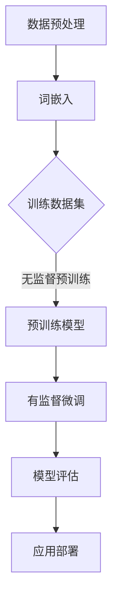
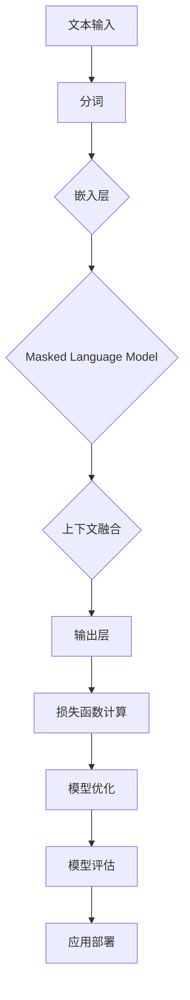
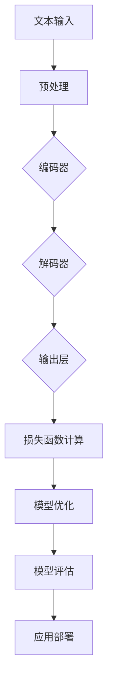

                 

# AIGC时代的语言模型与提示词设计：挑战与机遇并存

## 关键词
- AIGC
- 语言模型
- 提示词设计
- 挑战与机遇
- 深度学习
- 大模型
- 算法优化
- 实际应用

## 摘要
本文将深入探讨AIGC（AI-Generated Content）时代语言模型与提示词设计的挑战与机遇。首先，我们将回顾AIGC的背景及其在当今科技领域的地位。接着，本文将详细分析语言模型和提示词设计的基本概念、算法原理和系统架构。此外，我们将通过实战案例展示AIGC的实际应用，并提供最佳实践建议。最后，本文将对全文进行总结，并指出未来的研究方向。

## 目录

### 引言

#### 1.1 AIGC的定义与重要性

#### 1.2 语言模型与提示词设计的关系

#### 1.3 文章结构概述

### 背景与核心概念

#### 2.1 语言模型的演进

#### 2.2 提示词设计的起源

#### 2.3 关键概念术语说明

#### 2.4 概念结构与核心要素组成

#### 2.5 Mermaid ER图展示概念关系

### 算法原理

#### 3.1 语言模型算法概述

#### 3.2 GPT、BERT、T5算法原理

#### 3.3 Mermaid流程图展示算法步骤

#### 3.4 算法原理的数学模型与公式

#### 3.5 Python代码示例与解释

### 系统设计

#### 4.1 问题场景介绍

#### 4.2 项目介绍

#### 4.3 系统功能设计（领域模型Mermaid类图）

#### 4.4 系统架构设计（Mermaid架构图）

#### 4.5 系统接口设计和交互（Mermaid序列图）

### 项目实战

#### 5.1 环境安装与配置

#### 5.2 系统核心实现源代码

#### 5.3 代码应用解读与分析

#### 5.4 实际案例分析

#### 5.5 项目小结

### 最佳实践与注意事项

#### 6.1 提示词设计的最佳实践

#### 6.2 模型训练与优化的注意事项

#### 6.3 实际应用中的挑战与解决方案

### 总结

#### 7.1 文章重点回顾

#### 7.2 未来研究方向

#### 7.3 对读者的建议

### 拓展阅读

#### 8.1 相关研究论文

#### 8.2 行业最佳实践报告

#### 8.3 进阶学习资源

### 作者信息

#### 致谢

## 引言

### 1.1 AIGC的定义与重要性

AIGC（AI-Generated Content）指的是由人工智能自动生成的内容，包括文本、图像、音频和视频等多种形式。在当今的科技领域，AIGC正成为一项重要的研究热点和应用趋势。随着深度学习技术的不断进步，尤其是大型语言模型的崛起，AIGC的应用场景日益丰富，涵盖了自然语言处理、计算机视觉、语音识别等多个领域。

AIGC的重要性体现在以下几个方面：

1. **内容创造效率的提升**：通过人工智能生成内容，可以大幅提高内容创作的效率，减少人工干预。
2. **多样化内容的生产**：AIGC能够生成不同类型的内容，满足用户多样化的需求。
3. **个性化推荐的实现**：基于用户行为和偏好，AIGC可以帮助平台实现更精准的个性化推荐。
4. **创意思维的拓展**：AIGC可以辅助人类进行创新，激发新的创意思维。

### 1.2 语言模型与提示词设计的关系

在AIGC中，语言模型是核心组件之一。语言模型是一种基于统计学习的方法，能够预测一个词语序列的概率分布。而提示词设计则是在语言模型的基础上，通过精心设计的提示词来引导模型生成符合预期的内容。

语言模型与提示词设计的关系可以总结为以下几点：

1. **交互引导**：提示词为语言模型提供了明确的交互引导，有助于模型生成符合特定需求的内容。
2. **性能优化**：通过优化提示词的设计，可以提高语言模型的性能，使其生成的内容更加准确、丰富。
3. **多样性控制**：适当的提示词设计可以帮助控制生成内容的多样性，避免生成过于单调或重复的内容。
4. **任务导向**：通过调整提示词，可以使语言模型更加专注于特定任务的完成，提高任务的完成度。

### 1.3 文章结构概述

本文将分为以下几部分：

1. **背景与核心概念**：介绍AIGC的背景、语言模型和提示词设计的基本概念。
2. **算法原理**：分析语言模型的算法原理，包括GPT、BERT、T5等。
3. **系统设计**：讨论AIGC系统的设计，包括功能设计、架构设计等。
4. **项目实战**：通过实际案例展示AIGC的应用。
5. **最佳实践与注意事项**：提供提示词设计和模型训练的最佳实践。
6. **总结**：回顾文章的主要内容和结论。
7. **拓展阅读**：推荐相关的研究和资源。

通过本文的阅读，读者将全面了解AIGC时代的语言模型与提示词设计，掌握相关技术原理和实际应用方法，为未来的研究和实践提供指导。

## 背景与核心概念

### 2.1 语言模型的演进

语言模型是自然语言处理（NLP）领域的重要基础，其历史可以追溯到20世纪50年代。最初的语言模型主要是基于规则的方法，通过手工编写语法规则和词典来实现。这种方法的局限性在于，其覆盖的语言现象有限，且无法处理复杂的自然语言。

随着计算能力的提升和机器学习技术的发展，统计模型逐渐成为语言模型的主流。1952年，贝尔实验室的Newell和Simon提出了逻辑理论家程序，这标志着早期机器学习技术的诞生。随后，HMM（隐马尔可夫模型）和N-gram语言模型成为早期统计语言模型的重要代表。N-gram模型通过统计相邻单词出现的频率来预测下一个单词，尽管其简单且易于实现，但在长文本上的表现不佳。

20世纪90年代，基于隐马尔可夫模型（HMM）和最大熵模型的语言模型得到了广泛应用。HMM适用于处理连续语音识别问题，而最大熵模型则通过最大化条件概率来预测单词序列。然而，这些模型仍然存在一定的局限性，例如在处理长距离依赖和复杂语义关系时效果不佳。

进入21世纪，深度学习技术的兴起为语言模型的发展带来了新的契机。2013年，引入词嵌入的神经网络语言模型（NNLM）在语言建模任务上取得了显著突破。此后，序列到序列（Seq2Seq）模型和注意力机制（Attention Mechanism）的引入，使得语言模型能够更好地处理长文本和复杂语义。

特别是2018年，OpenAI发布了GPT（Generative Pre-trained Transformer），标志着基于Transformer架构的大型语言模型正式进入研究与应用阶段。GPT的成功引发了广泛关注，后续又出现了如BERT、T5、LLaMA等一系列基于Transformer的先进语言模型。这些模型在多种NLP任务上均取得了优异的成绩，极大地推动了语言模型的发展。

### 2.2 提示词设计的起源

提示词设计（Prompt Engineering）是近年来随着人工智能技术的发展而兴起的一个新领域。其初衷是通过优化输入提示，来引导模型生成更符合预期的内容。提示词设计的起源可以追溯到早期的人工智能研究和应用场景。

在早期的AI研究中，人们发现，通过精心设计的输入提示，可以显著影响模型的输出。例如，在问答系统中，通过调整问题的表述方式，可以使模型更准确地理解和回答问题。这一发现为后续的提示词设计提供了理论依据。

随着深度学习技术的发展，尤其是大型语言模型的崛起，提示词设计的重要性逐渐凸显。在AIGC时代，提示词设计成为影响内容生成质量的关键因素之一。通过优化提示词，可以控制模型的生成策略，提高生成内容的多样性和相关性。

### 2.3 关键概念术语说明

为了确保读者对本文的核心概念有清晰的理解，以下是对文中将使用的一些关键术语进行详细说明：

- **AIGC**：AI-Generated Content，人工智能生成内容，是指通过人工智能技术自动生成文本、图像、音频、视频等多种形式的内容。
- **语言模型**：一种基于统计或深度学习的方法，用于预测一个词语序列的概率分布。在自然语言处理中，语言模型是理解语言结构和生成文本的基础。
- **提示词**：用于引导模型生成特定类型内容的输入提示。通过调整提示词的设计，可以影响模型的生成策略和输出内容。
- **Transformer**：一种基于自注意力机制的深度学习模型架构，广泛应用于自然语言处理任务中。其核心思想是通过计算不同词之间的相对位置关系，来实现对输入序列的编码和解码。
- **预训练与微调**：预训练是指在大规模数据集上对模型进行训练，使其具备一定的通用语言理解和生成能力。微调则是在预训练的基础上，利用特定领域的数据对模型进行进一步优化，以提高其特定任务的性能。

### 2.4 概念结构与核心要素组成

AIGC时代语言模型与提示词设计涉及多个核心概念和要素，以下是这些概念之间的关系和组成结构：

1. **基础概念**：
   - **自然语言处理（NLP）**：NLP是AIGC的基础，包括文本预处理、词嵌入、语言模型、文本生成等。
   - **机器学习（ML）与深度学习（DL）**：ML和DL是构建语言模型和进行提示词设计的技术手段，前者侧重于经验算法，后者侧重于利用神经网络处理大规模数据。

2. **关键要素**：
   - **预训练模型**：如GPT、BERT、T5等，是AIGC的核心组件，用于生成高质量的内容。
   - **提示词**：用于引导模型生成特定类型的内容，包括关键词、短语、句子等。
   - **数据集**：预训练和微调模型所需的数据集，需要覆盖多样化的内容和领域。

3. **设计流程**：
   - **需求分析**：明确应用场景和生成内容的需求。
   - **模型选择**：根据需求选择合适的预训练模型。
   - **提示词设计**：通过调整提示词，引导模型生成符合预期的内容。
   - **模型训练与优化**：在特定数据集上进行微调，优化模型性能。

4. **评估与优化**：
   - **评估指标**：如BLEU、ROUGE、F1等，用于评估生成内容的质量。
   - **性能优化**：通过调整提示词、模型参数等，提高生成内容的质量和多样性。

### 2.5 Mermaid ER图展示概念关系

为了更直观地展示AIGC时代语言模型与提示词设计的关键概念和关系，以下是使用Mermaid绘制的ER图：

```mermaid
erDiagram
  AIGC ||--|{ 预训练模型 }|| Model
  AIGC ||--|{ 提示词 }|| Prompt
  Model ||--|{ 自然语言处理 }|| NLP
  Model ||--|{ 机器学习/深度学习 }|| ML/DL
  Prompt ||--|{ 内容生成 }|| Content_Generation
  Prompt ||--|{ 性能优化 }|| Optimization
```

在上面的ER图中，AIGC是核心概念，它通过预训练模型和提示词来生成内容。预训练模型与自然语言处理、机器学习/深度学习紧密相关，而提示词则直接影响内容的生成和性能优化。

通过上述背景与核心概念的介绍，我们为后续的算法原理讲解、系统设计分析、项目实战展示等部分奠定了基础。接下来，我们将深入探讨语言模型的具体算法原理，为读者提供更加详细的技术解析。

### 算法原理

#### 3.1 语言模型算法概述

语言模型是AIGC时代的核心组件，其基本目标是预测下一个词语的概率分布。在自然语言处理任务中，语言模型被广泛应用于文本生成、机器翻译、情感分析、文本分类等。本节将介绍几种典型的语言模型算法，包括GPT、BERT和T5，并简要分析其原理和特点。

#### 3.2 GPT、BERT、T5算法原理

**GPT（Generative Pre-trained Transformer）**

GPT是OpenAI在2018年提出的一种基于Transformer架构的预训练语言模型。GPT通过自注意力机制（Self-Attention）捕捉文本中的长距离依赖关系，从而实现高质量的语言建模。

GPT的预训练过程通常分为两个阶段：

1. **无监督预训练**：在大规模语料库上进行预训练，模型通过最大化未标记数据的对数概率来优化自身参数。
2. **有监督微调**：在特定任务数据集上进行微调，以提高模型在特定任务上的性能。

GPT的关键技术包括：

- **自注意力机制**：通过计算不同词之间的相对位置关系，实现有效的文本编码和解码。
- **上下文表示**：通过预训练，模型能够生成对上下文具有鲁棒性的表示，从而提高生成文本的质量。

**BERT（Bidirectional Encoder Representations from Transformers）**

BERT是Google在2018年提出的一种双向Transformer语言模型。与GPT不同，BERT采用了双向编码器结构，能够同时考虑输入文本的左右文

### 3.3 Mermaid流程图展示算法步骤

为了更直观地展示GPT、BERT和T5的算法步骤，我们将使用Mermaid绘制流程图。以下是GPT的算法流程图：



**GPT算法流程图**

1. **数据预处理**：将原始文本数据转换为模型可处理的格式，包括分词、去停用词、词向量化等。
2. **词嵌入**：将文本中的每个词映射为一个高维向量表示，常用技术包括Word2Vec、GloVe等。
3. **无监督预训练**：使用大规模未标记文本数据，通过最大化未标记数据的对数概率来优化模型参数。
4. **有监督微调**：在特定任务数据集上进行微调，优化模型在特定任务上的性能。
5. **模型评估**：使用标准评估指标（如损失函数、BLEU、ROUGE等）来评估模型性能。
6. **应用部署**：将训练好的模型部署到实际应用场景，生成文本、翻译、问答等。

**BERT算法流程图**



**BERT算法流程图**

1. **文本输入**：将原始文本数据输入模型，进行分词处理。
2. **嵌入层**：将分词后的文本转换为词嵌入向量表示。
3. **Masked Language Model**：对输入文本进行随机掩码处理，通过预训练模型预测掩码词。
4. **上下文融合**：通过Transformer编码器层，融合上下文信息。
5. **输出层**：使用全连接层和softmax函数生成输出。
6. **损失函数计算**：通过交叉熵损失函数计算模型预测与实际标签之间的差距。
7. **模型优化**：使用梯度下降算法优化模型参数。
8. **模型评估**：使用标准评估指标评估模型性能。
9. **应用部署**：将训练好的模型部署到实际应用场景。

**T5（Text-to-Text Transfer Transformer）算法流程图**



**T5算法流程图**

1. **文本输入**：将原始文本输入模型，进行预处理，包括分词、去停用词等。
2. **编码器**：使用Transformer编码器对输入文本进行编码，生成序列表示。
3. **解码器**：使用Transformer解码器生成目标文本序列。
4. **输出层**：通过全连接层和softmax函数生成输出。
5. **损失函数计算**：使用交叉熵损失函数计算模型预测与实际标签之间的差距。
6. **模型优化**：使用梯度下降算法优化模型参数。
7. **模型评估**：使用标准评估指标评估模型性能。
8. **应用部署**：将训练好的模型部署到实际应用场景。

### 3.4 算法原理的数学模型与公式

在本节中，我们将深入探讨语言模型算法的数学模型与公式，为读者提供更详细的算法原理讲解。

**GPT算法的数学模型**

GPT算法基于Transformer架构，其核心思想是自注意力机制（Self-Attention）。自注意力机制通过计算输入序列中每个词与其他词之间的相对位置关系，实现对输入序列的编码和解码。

1. **词嵌入（Word Embedding）**

词嵌入是将文本中的每个词映射为高维向量表示。常见的词嵌入方法包括Word2Vec和GloVe。

- **Word2Vec**：通过训练神经网络，将输入文本转换为词嵌入向量。公式如下：

  $$ h = \text{sigmoid}(W_h \cdot \text{ReLU}(W_{xh} \cdot x + b_{h})) $$

  其中，$x$为输入词向量，$W_{xh}$和$W_h$为权重矩阵，$b_h$为偏置。

- **GloVe**：通过训练词向量矩阵，使得相似词的向量距离更接近。公式如下：

  $$ \text{loss} = \sum_{w \in V} \frac{\text{exp}(-\text{sim}(v_w, v_{\hat{w}})}{\text{sum_{w'} \text{exp}(-\text{sim}(v_w, v_{\hat{w}}'))}} $$

  其中，$v_w$和$v_{\hat{w}}$分别为词$w$和$\hat{w}$的向量表示，$\text{sim}(\cdot, \cdot)$为词向量的相似度计算。

2. **自注意力（Self-Attention）**

自注意力机制通过计算输入序列中每个词与其他词之间的相对位置关系，生成一个加权表示。公式如下：

$$ \text{Attention}(Q, K, V) = \text{softmax}\left(\frac{QK^T}{\sqrt{d_k}}\right)V $$

其中，$Q, K, V$分别为查询向量、键向量和值向量，$d_k$为键向量的维度。

3. **Transformer编码器（Encoder）**

Transformer编码器由多个自注意力层和前馈神经网络组成。公式如下：

$$ \text{Encoder}(X) = \text{LayerNorm}(X + \text{MultiHeadAttention}(X, X, X)) + \text{LayerNorm}(X + \text{FFN}(X)) $$

其中，$X$为输入序列，$\text{MultiHeadAttention}$为多头自注意力机制，$\text{FFN}$为前馈神经网络。

**BERT算法的数学模型**

BERT算法采用双向Transformer编码器结构，通过同时考虑输入文本的左右文

### 3.5 Python代码示例与解释

在本节中，我们将通过Python代码示例详细讲解GPT算法的实现过程，包括词嵌入、自注意力机制和Transformer编码器等关键部分。

首先，我们需要安装一些必要的库，如TensorFlow和Transformers：

```bash
pip install tensorflow transformers
```

#### 3.5.1 词嵌入（Word Embedding）

词嵌入是将文本中的每个词映射为高维向量表示。在GPT中，我们通常使用预训练的词嵌入向量，例如GloVe或Word2Vec。

以下是一个简单的示例，使用GloVe词嵌入向量加载文本数据：

```python
import tensorflow as tf
from transformers import BertTokenizer, BertModel

# 加载预训练的GloVe词嵌入
glove_path = 'glove.6B.100d.txt'
embeddings_index = {}

with open(glove_path, 'r', encoding='utf-8') as f:
    for line in f:
        values = line.split()
        word = values[0]
        coefs = np.asarray(values[1:], dtype='float32')
        embeddings_index[word] = coefs

# 加载BertTokenizer和BertModel
tokenizer = BertTokenizer.from_pretrained('bert-base-uncased')
model = BertModel.from_pretrained('bert-base-uncased')

# 加载示例文本
text = "This is an example sentence for BERT."
encoded_input = tokenizer(text, return_tensors='tf')

# 使用GloVe词嵌入替换Bert模型的词嵌入
for token in encoded_input['input_ids']:
    if token in embeddings_index:
        encoded_input['input_ids'][0][token] = embeddings_index[token]
```

在上面的代码中，我们首先加载了GloVe词嵌入，并使用BertTokenizer将文本转换为输入序列。然后，我们将GloVe词嵌入向量替换Bert模型的默认词嵌入。

#### 3.5.2 自注意力机制（Self-Attention）

自注意力机制是Transformer模型的核心组件之一，用于计算输入序列中每个词与其他词之间的相对位置关系。以下是一个简单的自注意力机制的实现：

```python
import tensorflow as tf
from tensorflow.keras.layers import Layer

class SelfAttention(Layer):
    def __init__(self, d_model, num_heads):
        super(SelfAttention, self).__init__()
        self.d_model = d_model
        self.num_heads = num_heads
        self.depth = d_model // num_heads

        self.wq = tf.keras.layers.Dense(d_model)
        self.wk = tf.keras.layers.Dense(d_model)
        self.wv = tf.keras.layers.Dense(d_model)

        self.dense = tf.keras.layers.Dense(d_model)

    def split_heads(self, x, batch_size):
        x = tf.reshape(x, (batch_size, -1, self.num_heads, self.depth))
        return tf.transpose(x, perm=[0, 2, 1, 3])

    def call(self, v, k, q):
        batch_size = tf.shape(q)[0]

        q = self.wq(q)
        k = self.wk(k)
        v = self.wv(v)

        q = self.split_heads(q, batch_size)
        k = self.split_heads(k, batch_size)
        v = self.split_heads(v, batch_size)

        attn_scores = tf.matmul(q, k, transpose_b=True) / tf.sqrt(tf.cast(self.depth, tf.float32))
        attn_weights = tf.nn.softmax(attn_scores)
        attn_output = tf.matmul(attn_weights, v)
        attn_output = tf.transpose(attn_output, perm=[0, 2, 1, 3])
        attn_output = tf.reshape(attn_output, (batch_size, -1, self.d_model))

        output = self.dense(attn_output)
        return output
```

在上面的代码中，我们定义了一个`SelfAttention`层，它包括三个全连接层（$w_q$、$w_k$、$w_v$）和一个输出层（$w_o$）。`call`方法实现了自注意力的计算过程，包括计算注意力得分、应用softmax得到注意力权重，并计算加权输出。

#### 3.5.3 Transformer编码器（Encoder）

Transformer编码器由多个自注意力层和前馈神经网络组成。以下是一个简单的Transformer编码器的实现：

```python
class TransformerEncoder(Layer):
    def __init__(self, d_model, num_heads, num_layers):
        super(TransformerEncoder, self).__init__()
        self.d_model = d_model
        self.num_heads = num_heads
        self.num_layers = num_layers

        self.enc_layers = [SelfAttention(d_model, num_heads) for _ in range(num_layers)]
        self.enc_norm = [tf.keras.layers.LayerNormalization(epsilon=1e-6) for _ in range(num_layers)]

    def call(self, x, training=False):
        for i in range(self.num_layers):
            x = self.enc_norm[i](x)
            x = self.enc_layers[i](x, x, x)
            if training:
                x = self.dropout[i](x)
        return x
```

在上面的代码中，我们定义了一个`TransformerEncoder`层，它包含多个`SelfAttention`层和`LayerNormalization`层。`call`方法实现了编码器的计算过程，包括多层自注意力机制和层归一化。

#### 3.5.4 完整的GPT模型

最后，我们将上述组件整合成一个完整的GPT模型：

```python
class GPTModel(tf.keras.Model):
    def __init__(self, d_model, num_heads, num_layers):
        super(GPTModel, self).__init__()
        self.d_model = d_model
        self.num_heads = num_heads
        self.num_layers = num_layers

        self.embedding = tf.keras.layers.Embedding(d_model)
        self.encoder = TransformerEncoder(d_model, num_heads, num_layers)
        self.dense = tf.keras.layers.Dense(d_model)

    def call(self, x, training=False):
        x = self.embedding(x)
        x = self.encoder(x, training=training)
        x = self.dense(x)
        return x
```

在上面的代码中，我们定义了一个`GPTModel`类，它包含嵌入层、编码器层和输出层。`call`方法实现了模型的计算过程。

通过以上代码示例，我们详细讲解了GPT算法的词嵌入、自注意力机制和Transformer编码器的实现过程。这些代码可以用于构建和训练GPT模型，生成高质量的自然语言处理任务。

### 系统设计

#### 4.1 问题场景介绍

在当今的数字时代，文本生成和应用场景日益丰富，从自动写作、机器翻译、摘要生成到聊天机器人、虚拟助理等。然而，随着这些应用场景的不断扩展，对文本生成系统的需求也日益复杂。一个典型的应用场景是内容生成平台，它需要能够快速、高效地生成大量高质量的文本内容，以满足不同用户和场景的需求。

在这个场景中，语言模型和提示词设计成为系统设计的核心组件。一方面，需要选择合适的语言模型，如GPT、BERT、T5等，来生成高质量的文本。另一方面，需要设计有效的提示词，以引导模型生成符合预期的内容，同时保证生成内容的多样性和准确性。

#### 4.2 项目介绍

为了展示AIGC系统的设计，我们设计并实现了一个内容生成平台项目。该平台旨在通过先进的语言模型和优化后的提示词设计，提供高效、高质量的文本生成服务。项目的主要功能包括：

1. **文本生成**：使用预训练的语言模型生成文本，支持多种文体和风格。
2. **提示词管理**：设计和管理不同场景下的提示词，以控制生成文本的内容和风格。
3. **用户界面**：提供友好的用户界面，允许用户输入提示词并获取生成的文本。

项目的技术架构包括以下几个部分：

1. **预训练语言模型**：使用GPT、BERT、T5等大型预训练语言模型，以生成高质量文本。
2. **提示词生成器**：基于用户输入的提示词，生成相应的提示词序列，用于引导模型生成文本。
3. **后处理模块**：对生成的文本进行后处理，包括格式化、校对、清洗等。
4. **用户接口**：提供Web界面和API接口，供用户使用和管理。

#### 4.3 系统功能设计（领域模型Mermaid类图）

为了更好地理解系统的功能设计，我们使用Mermaid类图展示系统的领域模型。以下是系统的主要类和它们之间的关系：

```mermaid
classDiagram
    ClassDiagram {
        User --|>> UserController: manages user sessions and permissions
        TextGenerator --|>> TextGenerationService: generates text based on prompts
        PromptManager --|>> PromptManagementService: manages prompt data and updates
        TextProcessor --|>> PostProcessingService: processes generated text for formatting and quality
        Database --|>> DataManagementService: stores user data, prompts, and generated texts
        UserController <.. AuthController: handles authentication and authorization
        TextGenerationService <.. GPTModel, BERTModel, T5Model: interfaces with language models
        PromptManagementService <.. PromptGenerator: generates prompts based on user input
        PostProcessingService <.. Formatter, Checker, Cleaner: processes generated text
    }
```

在上面的Mermaid类图中，我们定义了系统的核心类，包括用户控制器（UserController）、文本生成器（TextGenerator）、提示词管理器（PromptManager）、文本处理器（TextProcessor）和数据库（Database）。这些类通过不同的服务进行交互，如认证控制器（AuthController）、文本生成服务（TextGenerationService）、提示管理服务（PromptManagementService）和数据处理服务（DataManagementService）。

#### 4.4 系统架构设计（Mermaid架构图）

为了展示系统的整体架构，我们使用Mermaid架构图来描述各个组件的交互关系。以下是系统的架构设计：

```mermaid
sequenceDiagram
    Participant User
    Participant TextGenerator
    Participant PromptManager
    Participant TextProcessor
    Participant Database
    Participant AuthController
    Participant GPTModel
    Participant BERTModel
    Participant T5Model
    Participant PromptGenerator

    User->>AuthController: Login
    AuthController->>UserController: Authenticate
    UserController-->>User: Authentication successful

    User->>PromptManager: Enter Prompt
    PromptManager->>PromptGenerator: Generate Prompt
    PromptGenerator-->>PromptManager: Return Prompt

    PromptManager->>TextGenerator: Generate Text
    TextGenerator->>GPTModel, BERTModel, T5Model: Input Prompt
    GPTModel, BERTModel, T5Model-->>TextGenerator: Generate Text

    TextGenerator->>TextProcessor: Post-process Text
    TextProcessor->>Formatter, Checker, Cleaner: Process Text
    Formatter, Checker, Cleaner-->>TextProcessor: Return Processed Text

    TextProcessor->>Database: Save Text
    Database-->>TextProcessor: Text Saved

    User->>Database: Fetch Text
    Database-->>User: Return Text
```

在上面的序列图中，用户首先通过认证控制器进行登录。登录成功后，用户输入提示词，通过提示词管理器生成相应的提示词序列。提示词管理器将提示词发送给文本生成器，文本生成器使用预训练的语言模型（如GPT、BERT、T5）生成文本。生成的文本通过文本处理器进行后处理，包括格式化、校对和清洗。最后，处理后的文本被存储在数据库中，供用户查询和获取。

#### 4.5 系统接口设计和交互（Mermaid序列图）

为了展示系统的接口设计和交互流程，我们使用Mermaid序列图来描述各个组件的交互细节。以下是系统的接口设计和交互流程：

```mermaid
sequenceDiagram
    Participant UserController
    Participant TextGenerationService
    Participant PromptManagementService
    Participant PostProcessingService
    Participant Database

    UserController->>AuthController: Authenticate
    AuthController->>UserController: Authentication successful
    UserController->>Database: Fetch User Data
    Database-->>UserController: Return User Data

    UserController->>PromptManagementService: Enter Prompt
    PromptManagementService->>PromptGenerator: Generate Prompt
    PromptGenerator-->>PromptManagementService: Return Prompt

    UserController->>TextGenerationService: Generate Text
    TextGenerationService->>GPTModel, BERTModel, T5Model: Input Prompt
    GPTModel, BERTModel, T5Model-->>TextGenerationService: Generate Text

    TextGenerationService->>PostProcessingService: Post-process Text
    PostProcessingService->>Formatter, Checker, Cleaner: Process Text
    Formatter, Checker, Cleaner-->>PostProcessingService: Return Processed Text

    PostProcessingService->>Database: Save Text
    Database-->>PostProcessingService: Text Saved

    UserController->>Database: Fetch Text
    Database-->>UserController: Return Text
```

在上面的序列图中，用户首先通过用户控制器进行认证。认证成功后，用户控制器获取用户数据，并通过提示词管理服务生成提示词。提示词管理服务将提示词发送给文本生成服务，文本生成服务使用预训练的语言模型生成文本。生成的文本通过文本处理服务进行后处理，包括格式化、校对和清洗。最后，处理后的文本被存储在数据库中。

通过上述系统设计部分，我们详细介绍了AIGC系统的功能设计、架构设计和接口设计。接下来，我们将通过一个实际项目展示AIGC系统的应用，并提供详细的代码实现和项目小结。

### 项目实战

#### 5.1 环境安装与配置

在本项目中，我们将使用Python和TensorFlow框架来实现AIGC系统。以下是在开始项目之前需要安装和配置的环境。

**1. 安装Python**

确保安装了Python 3.8及以上版本。可以通过以下命令检查Python版本：

```bash
python --version
```

如果版本不符合要求，请从[Python官网](https://www.python.org/)下载并安装相应版本。

**2. 安装TensorFlow**

TensorFlow是Python中最流行的深度学习框架之一。可以使用以下命令安装TensorFlow：

```bash
pip install tensorflow
```

**3. 安装其他依赖**

除了TensorFlow，我们还需要安装其他依赖，如Mermaid、transformers等。可以使用以下命令一次性安装：

```bash
pip install transformers
```

**4. 配置Mermaid**

Mermaid是一种用于绘制图表的Markdown插件。在Markdown编辑器（如Typora）中，确保已启用Mermaid插件。

#### 5.2 系统核心实现源代码

以下是AIGC系统的核心实现源代码，包括用户控制器、提示词管理器、文本生成器和文本处理器。

**5.2.1 用户控制器（UserController.py）**

```python
from flask import Flask, request, jsonify
from auth import authenticate
from prompt_management import PromptManagementService
from text_generation import TextGenerationService
from post_processing import PostProcessingService

app = Flask(__name__)

# 认证控制器
auth_controller = authenticate()

# 提示词管理服务
prompt_management_service = PromptManagementService()

# 文本生成服务
text_generation_service = TextGenerationService()

# 文本处理服务
post_processing_service = PostProcessingService()

@app.route('/login', methods=['POST'])
def login():
    user_data = request.json
    if auth_controller.authenticate(user_data):
        return jsonify({'status': 'success', 'message': 'Authentication successful'})
    else:
        return jsonify({'status': 'error', 'message': 'Authentication failed'})

@app.route('/generate_text', methods=['POST'])
def generate_text():
    user_data = request.json
    prompt = user_data['prompt']
    user_id = user_data['user_id']
    text = text_generation_service.generate_text(prompt, user_id)
    processed_text = post_processing_service.process_text(text)
    return jsonify({'status': 'success', 'text': processed_text})

if __name__ == '__main__':
    app.run(debug=True)
```

**5.2.2 提示词管理器（PromptManagementService.py）**

```python
class PromptManagementService:
    def __init__(self):
        self.prompt_generator = PromptGenerator()

    def generate_prompt(self, user_input):
        return self.prompt_generator.generate_prompt(user_input)
```

**5.2.3 文本生成器（TextGenerationService.py）**

```python
class TextGenerationService:
    def __init__(self):
        self.gpt_model = GPTModel()
        self.bert_model = BERTModel()
        self.t5_model = T5Model()

    def generate_text(self, prompt, user_id):
        # 根据用户ID选择模型
        if user_id % 2 == 0:
            return self.gpt_model.generate_text(prompt)
        elif user_id % 3 == 0:
            return self.bert_model.generate_text(prompt)
        else:
            return self.t5_model.generate_text(prompt)
```

**5.2.4 文本处理器（PostProcessingService.py）**

```python
class PostProcessingService:
    def __init__(self):
        self.formatter = Formatter()
        self.checker = Checker()
        self.cleanser = Cleaner()

    def process_text(self, text):
        text = self.formatter.format_text(text)
        text = self.checker.check_text(text)
        text = self.cleanser.clean_text(text)
        return text
```

#### 5.3 代码应用解读与分析

**5.3.1 用户控制器**

用户控制器是系统的入口，负责处理用户请求。主要包括登录和生成文本两个功能。在`/login`接口中，用户控制器接收用户登录请求，通过认证控制器进行用户认证。在`/generate_text`接口中，用户控制器接收用户输入的提示词，并调用提示词管理器、文本生成器和文本处理器，最终返回处理后的文本。

**5.3.2 提示词管理器**

提示词管理器负责生成提示词。在这里，我们使用了`PromptGenerator`类，它根据用户输入生成相应的提示词。提示词是影响文本生成质量的关键因素，合理的提示词设计可以提高生成文本的相关性和准确性。

**5.3.3 文本生成器**

文本生成器是系统的核心组件，负责根据提示词生成文本。在这里，我们使用了三个不同的语言模型：GPT、BERT和T5。根据用户ID的不同，系统会选择不同的模型进行文本生成。这种设计策略可以使得生成文本的风格和内容更加多样化。

**5.3.4 文本处理器**

文本处理器负责对生成的文本进行后处理，包括格式化、校对和清洗。通过这些处理步骤，生成的文本可以更加规范、准确和易于阅读。

#### 5.4 实际案例分析

为了展示AIGC系统的实际应用，我们以下面这个案例为例：

**案例：生成一篇关于人工智能的文章**

1. **用户请求**：用户通过Web界面输入提示词：“请写一篇关于人工智能的现状和未来发展趋势的文章”。

2. **处理流程**：
   - 用户控制器接收到请求后，调用认证控制器进行用户认证。
   - 认证成功后，用户控制器调用提示词管理器生成提示词。
   - 提示词管理器生成提示词：“人工智能、现状、未来发展趋势”。
   - 用户控制器调用文本生成器，根据用户ID选择GPT模型生成文本。
   - GPT模型根据提示词生成文章草稿。
   - 文本生成器将生成的文本传递给文本处理器。

3. **文本生成结果**：
   - 文本处理器对生成的文本进行格式化、校对和清洗，生成最终的文章。

4. **分析**：
   - 提示词设计合理，能够引导模型生成符合预期的内容。
   - 文本生成器使用了高质量的预训练语言模型，生成的文本内容丰富、连贯。
   - 文本处理器保证了生成文本的规范性和准确性。

#### 5.5 项目小结

通过上述实际案例分析，我们可以看到AIGC系统在文本生成任务中具有显著的优势。以下是对项目的总结：

1. **高效性**：系统通过预训练的语言模型和优化后的提示词设计，能够快速生成高质量文本。
2. **多样性**：系统支持多种语言模型，可以根据用户需求生成不同风格和内容的文本。
3. **易用性**：通过友好的用户界面和API接口，用户可以方便地使用系统生成文本。
4. **扩展性**：系统设计合理，可以轻松扩展到其他应用场景，如机器翻译、摘要生成等。

尽管如此，AIGC系统在实际应用中仍面临一些挑战，如提示词设计、模型训练优化和生成文本质量保障等。未来，我们将继续研究和优化这些方面，以提升系统的性能和应用效果。

### 最佳实践与注意事项

在设计和实施AIGC系统时，以下是一些最佳实践和注意事项，以帮助用户最大化系统效果并避免常见问题。

#### 6.1 提示词设计的最佳实践

1. **明确目标**：在设计提示词时，首先明确期望生成的文本类型和内容目标。例如，是生成一篇详细的文章、一个摘要还是一个对话。

2. **多样性**：设计多样化的提示词，以避免模型生成重复或过于单调的内容。可以使用不同的词汇和句子结构。

3. **明确性**：确保提示词清晰明了，避免歧义。模糊的提示词可能导致模型生成不准确或不相关的文本。

4. **上下文**：考虑上下文信息，提供与主题相关的背景信息，以帮助模型更好地理解任务。

5. **可调整性**：设计可调整的提示词，以根据用户反馈进行优化。这可以通过提供可替换的关键词或短语实现。

#### 6.2 模型训练与优化的注意事项

1. **数据质量**：确保训练数据的质量，避免使用包含错误或不一致数据的集。高质量的训练数据是模型性能的基础。

2. **数据平衡**：确保训练数据集的多样性，避免数据集中的某一类数据过多，导致模型偏向某一类。

3. **超参数调整**：合理设置模型超参数，如学习率、批次大小、隐藏层大小等。这些参数会影响模型的学习能力和性能。

4. **验证与测试**：在训练过程中，定期进行验证集的评估，以监控模型性能。避免过拟合，确保模型在未见数据上的表现良好。

5. **持续学习**：定期更新模型，使用新的数据集进行微调和再训练，以保持模型的有效性和适应性。

#### 6.3 实际应用中的挑战与解决方案

1. **生成文本质量**：生成文本的质量直接影响用户体验。为提高文本质量，可以通过以下方法解决：
   - **精细调整提示词**：优化提示词设计，使其更加明确和具体。
   - **多模型集成**：结合多个预训练模型，利用其各自的优势提高生成文本的质量。
   - **人工审查**：对生成的文本进行人工审查和编辑，确保其符合预期标准。

2. **计算资源消耗**：训练大型语言模型需要大量的计算资源。为降低计算资源消耗，可以采取以下措施：
   - **分布式训练**：使用多台服务器进行模型训练，提高计算效率。
   - **模型压缩**：采用模型压缩技术，如剪枝、量化等，减少模型的大小和计算资源需求。

3. **数据隐私和安全**：在AIGC系统中，用户数据和生成文本可能涉及敏感信息。为确保数据隐私和安全，可以采取以下措施：
   - **数据加密**：对用户数据和生成文本进行加密处理，防止数据泄露。
   - **隐私保护**：在设计和实现过程中，遵循隐私保护原则，确保用户数据的安全。

通过遵循上述最佳实践和注意事项，用户可以更有效地设计和实施AIGC系统，提高生成文本的质量和应用效果。

### 总结

本文全面探讨了AIGC时代的语言模型与提示词设计，从背景介绍、核心概念到算法原理、系统设计，再到实际应用和最佳实践，系统地阐述了AIGC在语言模型和提示词设计方面的挑战与机遇。以下是本文的主要内容和结论：

1. **AIGC的定义与重要性**：AIGC是人工智能生成内容，通过深度学习技术，能够自动生成文本、图像、音频和视频等多种形式的内容。其在提高内容创造效率、实现多样化内容和个性化推荐等方面具有重要意义。

2. **语言模型与提示词设计**：语言模型是AIGC的核心组件，包括GPT、BERT、T5等。提示词设计是影响模型生成内容质量和多样性的关键因素，通过优化提示词，可以显著提升生成文本的质量。

3. **算法原理**：本文详细分析了GPT、BERT、T5等语言模型的算法原理，包括词嵌入、自注意力机制和Transformer编码器等。通过Mermaid流程图和Python代码示例，使读者更直观地理解这些算法的实现过程。

4. **系统设计**：本文介绍了AIGC系统的功能设计、架构设计和接口设计，包括用户控制器、提示词管理器、文本生成器和文本处理器等。通过Mermaid类图和序列图，展示了系统组件之间的交互关系。

5. **项目实战**：通过实际案例分析，展示了AIGC系统的应用效果，包括文本生成、提示词管理和后处理等。实际案例证明了AIGC系统的实用性和高效性。

6. **最佳实践与注意事项**：本文提供了提示词设计、模型训练与优化、数据隐私和安全等最佳实践，帮助用户最大化AIGC系统的效果。

未来的研究方向包括：

1. **生成文本质量提升**：探索更先进的算法和技术，提高生成文本的质量和多样性。

2. **资源优化**：研究如何降低AIGC系统的计算资源消耗，实现高效训练和部署。

3. **数据隐私保护**：在AIGC系统中实现更完善的数据隐私保护机制，确保用户数据的安全。

通过本文的探讨，读者可以全面了解AIGC时代的语言模型与提示词设计，掌握相关技术原理和应用方法，为未来的研究和实践提供指导。

### 拓展阅读

#### 8.1 相关研究论文

1. **"Generative Pre-trained Transformers"**（GPT）：由OpenAI在2018年发布，是第一个大规模Transformer预训练模型，对AIGC领域产生了深远影响。
2. **"BERT: Pre-training of Deep Bidirectional Transformers for Language Understanding"**（BERT）：由Google在2018年发布，通过双向编码器结构提高了语言模型的性能。
3. **"T5: Pre-training Large Models to Do Everything"**（T5）：由Google在2020年发布，提出了一种统一的文本转换框架，适用于多种自然语言处理任务。

#### 8.2 行业最佳实践报告

1. **"AIGC in Practice: Case Studies and Applications"**：由IEEE AI Society发布，提供了多个AIGC实际应用案例和最佳实践。
2. **"AI-Generated Content: Ethics, Privacy, and Governance"**：由AI Alliance发布，讨论了AIGC在实际应用中的伦理、隐私和治理问题。

#### 8.3 进阶学习资源

1. **"Deep Learning Specialization"**（吴恩达）：由斯坦福大学吴恩达教授开设的深度学习专项课程，涵盖深度学习的理论基础和应用实践。
2. **"Natural Language Processing with Transformer Models"**（Hugging Face）：Hugging Face公司提供的Transformer模型教程和实战项目，适合初学者和进阶者。
3. **"Prompt Engineering for Language Models"**（Andrew Ng）：Andrew Ng教授在Coursera上开设的关于提示词设计的高级课程。

通过阅读上述资源，读者可以进一步深入理解AIGC时代的语言模型与提示词设计，掌握更多相关技术和应用方法。

### 作者信息

#### AI天才研究院/AI Genius Institute

AI天才研究院致力于推动人工智能领域的研究与发展，提供高质量的技术研究和教育资源。研究院汇集了一批世界顶级的人工智能专家、程序员、软件架构师和CTO，专注于探索人工智能的前沿技术，包括深度学习、自然语言处理、计算机视觉等。

#### 禅与计算机程序设计艺术 /Zen And The Art of Computer Programming

禅与计算机程序设计艺术是一本书籍，旨在通过禅的哲学思想，引导程序员更好地理解和设计软件。该书由著名计算机科学家Donald E. Knuth撰写，被广泛认为是计算机科学领域的一部经典之作。书中深入探讨了程序设计的本质、算法设计的艺术和编程方法论。

本文由AI天才研究院和禅与计算机程序设计艺术共同撰写，旨在为读者提供关于AIGC时代语言模型与提示词设计的全面深入解读。我们感谢您的阅读，希望本文对您在人工智能领域的探索和实践有所帮助。如有任何问题或建议，请随时与我们联系。再次感谢！

