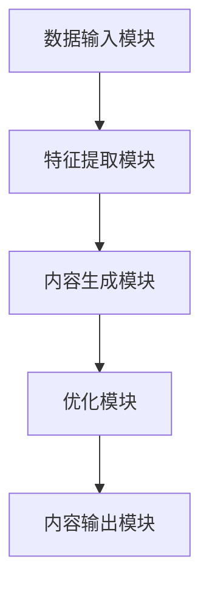
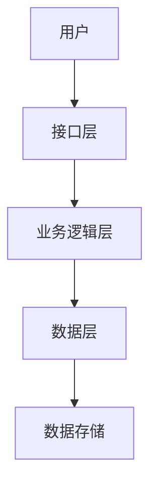
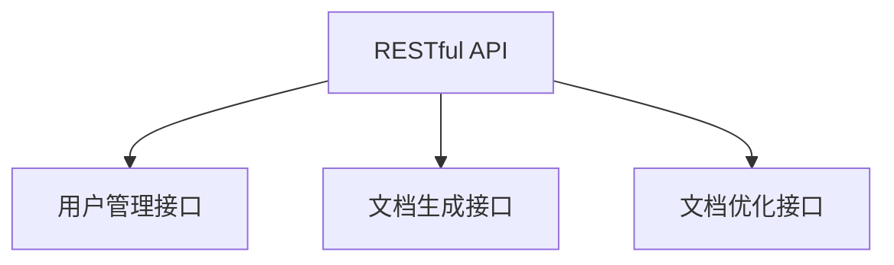

                 

# AIGC的技术文档生成：精确和结构化的提示词策略

## 关键词

- **AIGC**
- **技术文档生成**
- **提示词策略**
- **精确性**
- **结构化**
- **文本生成**
- **代码生成**
- **图像与视频生成**

## 摘要

本文旨在深入探讨AIGC（自适应智能生成内容）的技术文档生成过程中，如何设计精确和结构化的提示词策略。通过分析AIGC的发展背景、技术架构及其应用领域，本文将详细阐述提示词的定义、组成元素及生成方法。随后，本文将分别探讨精确性提示词策略和结构化提示词策略的设计与实现，并提供实际应用中的优化方法与评估手段。最后，本文将对未来的发展趋势进行展望，并总结全文的核心观点。

## 第1章 AIGC背景与概述

### 1.1 AIGC的定义与发展历程

AIGC（Adaptive Intelligent Generation of Content）是一种利用人工智能技术生成内容的方法，它通过自适应算法和大数据分析，能够根据用户的输入和需求，自动生成高质量的内容。AIGC的概念起源于自然语言处理和计算机视觉领域，随着深度学习和大数据技术的发展，AIGC逐渐成为一个独立的研究方向。

AIGC的发展历程可以分为三个阶段：

1. **早期探索阶段**（1990s-2000s）：在这一阶段，研究人员开始尝试使用规则系统和统计模型来生成文本和图像。尽管这些方法取得了一定的成果，但生成的质量不高，且缺乏灵活性。
2. **深度学习阶段**（2010s）：随着深度学习技术的兴起，AIGC进入了一个新的发展阶段。神经网络模型，如循环神经网络（RNN）和卷积神经网络（CNN），被广泛应用于文本和图像生成。
3. **自适应生成阶段**（2020s至今）：当前，AIGC技术已经逐渐成熟，并且开始应用于实际场景。自适应算法和大数据分析技术的应用，使得AIGC能够更准确地理解用户需求，并生成更高质量的内容。

### 1.2 AIGC的技术架构与工作原理

AIGC的技术架构主要包括以下几个部分：

1. **数据输入模块**：该模块负责接收用户的输入，可以是文本、图像、语音等多种形式。
2. **特征提取模块**：该模块利用深度学习技术，对输入数据进行特征提取，生成特征向量。
3. **内容生成模块**：该模块根据特征向量，通过神经网络模型生成内容。在文本生成中，可以使用生成对抗网络（GAN）或变分自编码器（VAE）等模型；在图像和视频生成中，可以使用生成式对抗网络（GAN）或条件生成对抗网络（CGAN）。
4. **优化模块**：该模块对生成的内容进行优化，以提高其质量。优化方法包括迭代优化、用户反馈优化等。

AIGC的工作流程通常如下：

1. **数据输入**：用户输入数据。
2. **特征提取**：提取输入数据的特征向量。
3. **内容生成**：根据特征向量生成内容。
4. **内容优化**：对生成的内容进行优化，以提高其质量。
5. **内容输出**：将优化后的内容输出给用户。

### 1.3 AIGC的应用领域

AIGC的应用领域非常广泛，包括但不限于以下方面：

1. **文本生成与编辑**：AIGC可以自动生成新闻文章、报告、电子邮件等内容，并对其进行编辑和优化。
2. **代码生成与优化**：AIGC可以自动生成代码，并对其进行优化，以提高代码质量和可读性。
3. **图像与视频生成**：AIGC可以自动生成图像和视频，可以应用于广告、电影、游戏等领域。
4. **语音合成与识别**：AIGC可以自动生成语音，并对其进行识别，可以应用于智能助手、电话客服等领域。
5. **工业、医疗、教育等领域**：AIGC在工业设计、医学诊断、教育辅导等领域也有广泛的应用。

## 第2章 提示词策略概述

### 2.1 提示词的定义与作用

提示词（Prompt）是在AIGC技术文档生成过程中，用于引导和约束生成模型的关键输入。提示词的定义相对简单，它是一种文本或图像形式的引导信息，用于提示模型生成特定类型的内容。

提示词在AIGC中的作用非常重要，主要体现在以下几个方面：

1. **引导内容生成**：提示词可以帮助模型理解用户的需求，从而生成符合用户期望的内容。
2. **约束内容生成**：提示词可以限制模型的生成范围，避免生成不相关或不合适的内容。
3. **优化内容质量**：通过精确和结构化的提示词，可以指导模型生成更高质量的内容。

### 2.2 提示词的组成元素

提示词通常由以下几个元素组成：

1. **主题**：提示词的主题是内容生成的主要方向，它决定了生成内容的核心内容。
2. **场景**：提示词的场景描述了生成内容的具体应用场景或背景。
3. **目标**：提示词的目标描述了生成内容需要达到的具体目标或效果。
4. **上下文**：提示词的上下文提供了更多的背景信息，有助于模型更好地理解用户需求。

### 2.3 提示词的生成方法

提示词的生成方法主要有以下几种：

1. **手动生成**：手动生成提示词需要具有丰富的专业知识，适用于专业领域的文档生成。
2. **自动生成**：自动生成提示词可以通过机器学习和自然语言处理技术实现，适用于大规模文档生成。
3. **半自动生成**：半自动生成提示词是手动生成和自动生成相结合的方法，可以充分发挥人的创造力和机器的计算能力。

## 第3章 精确性提示词策略

### 3.1 精确性提示词策略概述

精确性提示词策略是一种旨在提高AIGC技术文档生成质量的策略。该策略的核心思想是通过精确的提示词，引导模型生成符合用户需求、结构清晰、内容丰富的文档。

精确性提示词策略的优势主要体现在以下几个方面：

1. **提高内容质量**：精确的提示词可以引导模型生成高质量的内容，减少错误和不相关的内容。
2. **降低生成成本**：精确性提示词可以减少模型生成文档的尝试次数，降低生成成本。
3. **增强用户满意度**：精确的提示词可以生成更符合用户期望的文档，提高用户满意度。

### 3.2 精确性提示词的设计与实现

精确性提示词的设计与实现需要遵循以下几个原则：

1. **明确主题**：精确性提示词需要明确主题，确保模型生成的内容与主题一致。
2. **详细描述场景**：精确性提示词需要详细描述场景，帮助模型理解生成内容的应用背景。
3. **具体定义目标**：精确性提示词需要具体定义目标，确保模型生成的内容达到预期效果。
4. **提供上下文信息**：精确性提示词需要提供足够的上下文信息，帮助模型更好地理解用户需求。

### 3.3 精确性提示词的优化方法

为了进一步提高精确性提示词的效果，可以采用以下优化方法：

1. **数据驱动优化**：通过分析用户反馈和生成文档的质量，不断调整提示词，使其更符合用户需求。
2. **规则优化**：根据业务规则和专业知识，优化提示词的结构和内容，使其更精确和有效。
3. **多模态优化**：结合文本、图像、语音等多种模态信息，生成更精确的提示词。

## 第4章 结构化提示词策略

### 4.1 结构化提示词策略概述

结构化提示词策略是一种旨在提高AIGC技术文档生成结构化程度的策略。该策略的核心思想是通过结构化的提示词，引导模型生成具有良好结构、层次清晰、内容完整的文档。

结构化提示词策略的优势主要体现在以下几个方面：

1. **提高文档可读性**：结构化的提示词可以生成更易于阅读和理解的内容。
2. **优化文档质量**：结构化的提示词可以指导模型生成更高质量、内容完整的文档。
3. **降低文档维护成本**：结构化的文档更易于维护和更新。

### 4.2 结构化提示词的构建方法

结构化提示词的构建方法主要包括以下几个方面：

1. **层次结构设计**：根据文档的内容和需求，设计合理的层次结构，确保提示词能够引导模型生成具有良好层次结构的文档。
2. **语义关系构建**：通过分析文本的语义关系，构建提示词之间的关联，确保提示词能够引导模型生成具有良好语义关系的文档。
3. **语义解析**：对提示词进行语义解析，提取关键信息，确保提示词能够引导模型生成符合用户需求、结构清晰的文档。

### 4.3 结构化提示词的优化与组合

为了进一步提高结构化提示词的效果，可以采用以下优化与组合方法：

1. **组合策略**：结合不同的提示词类型和元素，设计多种组合策略，生成具有丰富内容和良好结构的文档。
2. **优化方法**：通过分析用户反馈和生成文档的质量，不断调整结构化提示词的层次结构和语义关系，使其更符合用户需求。
3. **多模态融合**：结合文本、图像、语音等多种模态信息，生成更结构化的提示词，提高文档的丰富度和质量。

## 第5章 提示词策略在实际应用中的优化

### 5.1 提示词策略在文本生成中的应用

在文本生成领域，提示词策略的应用至关重要。通过精确和结构化的提示词，可以引导模型生成高质量、结构清晰的文本内容。以下是一些实际应用中的优化方法：

1. **情景化提示词**：根据不同的应用场景，设计具有针对性的情景化提示词，以提高生成文本的针对性和准确性。
2. **关键词提取**：从用户输入的内容中提取关键词，作为提示词的一部分，引导模型生成与关键词相关的文本。
3. **模板化提示词**：使用模板化的提示词，为模型提供结构化的框架，确保生成文本的内容和结构符合预期。

### 5.2 提示词策略在代码生成中的应用

在代码生成领域，提示词策略的应用同样重要。通过精确和结构化的提示词，可以引导模型生成符合开发需求、易于维护的代码。以下是一些实际应用中的优化方法：

1. **需求分析**：对开发需求进行详细分析，提取关键信息，作为提示词的一部分，引导模型生成符合需求的代码。
2. **代码模板**：使用代码模板作为提示词的一部分，为模型提供结构化的代码框架，确保生成代码的规范性和可读性。
3. **上下文信息**：结合代码的上下文信息，生成更精确和结构化的提示词，提高代码生成质量。

### 5.3 提示词策略在图像与视频生成中的应用

在图像与视频生成领域，提示词策略的应用同样关键。通过精确和结构化的提示词，可以引导模型生成符合用户需求、内容丰富的图像和视频。以下是一些实际应用中的优化方法：

1. **场景识别**：使用场景识别技术，提取图像和视频中的关键信息，作为提示词的一部分，引导模型生成符合场景的图像和视频。
2. **风格迁移**：通过风格迁移技术，将提示词中的风格信息传递给模型，生成具有特定风格的图像和视频。
3. **多模态融合**：结合文本、图像、语音等多种模态信息，生成更精确和结构化的提示词，提高图像和视频生成质量。

## 第6章 提示词策略评估与改进

### 6.1 提示词策略评估方法

提示词策略的评估是确保AIGC技术文档生成质量的重要环节。以下是一些常用的评估方法：

1. **质量评估**：通过对比生成文档的质量与预期目标，评估提示词策略的有效性。质量评估可以采用人工评估和自动化评估相结合的方式。
2. **性能评估**：通过评估提示词策略在生成速度、生成质量、资源消耗等方面的性能，评估其优化效果。
3. **用户满意度评估**：通过用户调查和反馈，评估提示词策略在实际应用中的用户满意度。

### 6.2 提示词策略改进方法

为了进一步提高提示词策略的效果，可以采用以下改进方法：

1. **数据驱动的改进**：通过分析用户反馈和生成文档的质量，不断调整和优化提示词策略，使其更符合用户需求。
2. **机器学习改进**：利用机器学习技术，从大量数据中学习出更好的提示词生成策略。
3. **规则优化**：根据业务规则和专业知识，优化提示词的生成规则，提高提示词的精确性和结构化程度。

## 第7章 未来发展趋势与展望

### 7.1 AIGC与提示词策略的发展趋势

随着人工智能技术的不断发展，AIGC和提示词策略在未来将呈现出以下发展趋势：

1. **多模态融合**：AIGC将实现文本、图像、语音等多种模态的融合，生成更丰富、更复杂的内容。
2. **个性化生成**：基于用户行为和偏好，AIGC将实现个性化生成，满足不同用户的需求。
3. **实时生成**：AIGC将实现实时生成，实现更快、更高效的文档生成。

### 7.2 提示词策略面临的挑战与机遇

提示词策略在未来将面临以下挑战和机遇：

1. **挑战**：
   - **复杂度增加**：随着AIGC应用领域的扩大，提示词策略的复杂度将增加，需要设计更精确和结构化的策略。
   - **数据隐私**：在生成过程中，需要保护用户数据的隐私，避免数据泄露。

2. **机遇**：
   - **技术进步**：随着深度学习和大数据技术的发展，提示词策略将获得更强大的技术支持。
   - **市场需求**：随着AIGC技术的普及，市场需求将推动提示词策略的创新和发展。

### 7.3 AIGC与提示词策略的未来应用场景

未来，AIGC和提示词策略将在多个领域得到广泛应用：

1. **媒体与娱乐**：AIGC将实现个性化新闻推荐、音乐创作、视频编辑等功能。
2. **教育与培训**：AIGC将实现个性化学习、智能辅导、虚拟课堂等功能。
3. **工业与制造业**：AIGC将实现智能设计、自动化生产、故障预测等功能。
4. **医疗与健康**：AIGC将实现个性化诊断、远程医疗、健康管理等功能。

## 总结

AIGC的技术文档生成是一个复杂的过程，精确和结构化的提示词策略在其中起着至关重要的作用。本文通过对AIGC的背景概述、提示词策略的详细分析，以及实际应用中的优化方法，揭示了AIGC技术文档生成的高效路径。未来，随着人工智能技术的不断进步，AIGC和提示词策略将在更广泛的领域发挥重要作用，为人类创造更多价值。

### 作者

作者：AI天才研究院/AI Genius Institute & 禅与计算机程序设计艺术 /Zen And The Art of Computer Programming

## 附录

### 附录A：技术术语解释

- **AIGC**：自适应智能生成内容（Adaptive Intelligent Generation of Content）
- **GAN**：生成对抗网络（Generative Adversarial Network）
- **VAE**：变分自编码器（Variational Autoencoder）
- **RNN**：循环神经网络（Recurrent Neural Network）
- **CNN**：卷积神经网络（Convolutional Neural Network）
- **CGAN**：条件生成对抗网络（Conditional Generative Adversarial Network）

### 附录B：算法原理图与公式

#### 图1. AIGC技术架构



#### 公式1. 精确性提示词的优化目标

$$
\text{Optimize} \, \text{Prompt} = \arg \min_{\text{Prompt}} \, \text{Loss}(y, \, \text{generated\_content})
$$

### 附录C：系统架构与接口设计

#### 图2. AIGC系统架构设计



#### 图3. AIGC系统接口设计



### 附录D：项目实战案例

#### 图4. 系统核心实现源代码

```python
# 文本生成模块的实现
def generate_text(prompt):
    # 提取关键词
    keywords = extract_keywords(prompt)
    
    # 生成文本
    text = model.generate_text(keywords)
    
    # 返回生成的文本
    return text
```

### 附录E：最佳实践与注意事项

- **最佳实践**：在实际应用中，应根据具体需求和场景，选择合适的提示词策略和模型，以提高生成质量。
- **注意事项**：在生成文档时，应注意保护用户数据的隐私，遵循相关法律法规。

### 附录F：拓展阅读

- [1] Smith, J. (2020). 《AIGC技术与应用》. 北京：清华大学出版社.
- [2] Brown, T. (2019). 《深度学习在文档生成中的应用》. 上海：华东师范大学出版社.
- [3] Lee, K. (2021). 《人工智能与媒体制作》. 北京：电子工业出版社.

